<!-- Date: 2026-08-13 | Purpose: Regression special lecture for doctoral researchers at the Korea Institute of Nuclear Safety. Slide bodies carry the formal treatment; the speaker notes carry the plain-language script. | File: regression-lecture-note.qmd -->

# Introduction

::: notes
지금부터 회귀분석 특강을 시작하겠습니다. 이 장에서 세워 둘 것은 두 가지입니다. 회귀가 무엇이냐는 물음에 답하는 한 줄짜리 정의, 그리고 회귀분석을 실제로 수행하는 여덟 단계의 절차. 뒤에 오는 장들은 전부 이 둘에 살을 붙이는 작업입니다. 수식이 많아 보여도 출발점의 생각은 단순합니다. 어떤 값을 맞혀야 하는데 아무 정보가 없다면 전체 평균을 말하는 것이 최선입니다. 그런데 힌트가 하나 주어지면 어떻게 될까요? 그 힌트에 해당하는 대상만 골라내서 그 안의 평균을 말하는 편이 낫습니다. 오늘 배울 내용은 전부 이 한 문장을 정밀하게 다듬는 일입니다.
:::

## What is regression analysis?

### <i class="fa-solid fa-question"></i> 연구 질문

::: {.callout-note appearance="minimal"}
**이 장의 질문**: 회귀분석이란 무엇이며, 어떤 절차로 수행하는가?
:::

::: {.callout-tip appearance="minimal"}
**연구 질문**

<ul>
<li>구리 함량과 중성자 조사량이 이 정도일 때 압력용기의 천이온도는 평균적으로 얼마나 올라가는가</li>
<li>특정 에너지 대역에서 검출기의 계수 효율은 평균 얼마인가</li>
<li>1 Gy를 받은 집단에서 암 위험도는 평균적으로 얼마나 커지는가</li>
</ul>
:::

> 세 질문의 공통 형태: **특정 조건이 주어졌을 때의 평균**

<ul>
<li>측정 반복으로는 답이 나오지 않음. 조건이 같아도 결과는 매번 다름</li>
<li>회귀분석 = 흩어짐을 인정한 채 조건과 결과의 관계를 하나의 식으로 요약</li>
</ul>

::: notes
회귀분석이 왜 필요한지부터 말씀드리겠습니다. 화면의 세 질문은 서로 다른 분야에서 발췌한 연구 질문 입니다.  그런데 질문의 주요 골자는 모두 같습니다. 이 세 질문 모두 조건이 이러이러할 때 결과가 평균 얼마냐고 묻고 있습니다. 여기서 평균이라는 말이 왜 들어갔을까요? 조건을 아무리 똑같이 맞춰도 결과는 매번 조금씩 다르게 나오기 때문입니다. 같은 재료, 같은 조사량이라도 시편마다 값이 흔들립니다. 그래서 답 하나를 콕 집어 말할 수가 없습니다. 대신 그 흔들림의 한가운데가 어디인지는 말할 수 있습니다. 회귀분석은 흩어짐을 없애려는 방법이 아닙니다. 흩어짐을 인정하고 중심을 찾는 방법입니다.
:::

## 회귀의 의미 {.smaller}

### <i class="fa-solid fa-bullseye"></i> 용어의 기원

> 회귀(regression, 回歸)는 이전 단계로 되돌아감을 뜻하는 말이며, 통계학에서는 **평균(mean)으로 되돌아감** 을 의미한다.
>
> 개념상 회귀분석은 변수들 사이의 함수 관계를 자료로부터 탐색하는 방법이다.

::: {style="font-size: 120%; margin-top: 1em; margin-bottom: 1em;"}
| Role | Symbol | 분야별 다른 이름 |
|:---------------------------|:----:|:---------------------------------------------------------|
| **반응변수** response variable | $y$ | 종속변수(dependent), 출력변수(output), target |
| **설명변수** explanatory variable | $x$ | 독립변수(independent), 입력변수(input), 예측변수(predictor), covariate, regressor, factor, carrier |
: The two roles in a regression model, and the names used for them across fields
:::

::: {.callout-tip appearance="minimal" style="font-size: 120%"}
**응용 분야**

<ul>
<li><b>자연·공학</b> &nbsp; physics, chemistry, engineering, meteorology</li>
<li><b>생명·의학</b> &nbsp; medicine, biology</li>
<li><b>사회·경제</b> &nbsp; economics, finance, law, sociology, psychology</li>
<li><b>교육·기타</b> &nbsp; education, sports, history</li>
</ul>
:::

::: notes
회귀라는 우리말 단어는 원래 되돌아간다는 뜻입니다. 통계학에서는 무엇으로 되돌아가느냐. 평균으로 되돌아갑니다. 이름의 유래를 조금 더 짚고 가겠습니다. 이 말을 만든 골턴이 처음 쓴 단어는 regression이 아니었습니다. 1877년 논문에서는 reversion이라고 썼습니다. 격세유전, 곧 부모를 닮지 않고 먼 조상 쪽으로 되돌아간다는 뜻의 유전학 용어입니다. 다윈도 쓴 말입니다. 그러니까 골턴은 이것을 유전이 한 방향으로 밀어내는 힘이라고 본 것입니다.

그런데 1885년에 생각을 바꿉니다. 자식이 부모의 평균 쪽으로 끌려오는 것만이 아니라, 거꾸로 부모도 자식의 평균 쪽으로 끌려온다는 사실을 발견했기 때문입니다. 방향이 양쪽이면 유전이 미는 힘으로는 설명할 수 없습니다. 그래서 유전 용어인 reversion을 버리고 regression으로 바꿔 부르기 시작했습니다. 골턴 본인의 회고가 남아 있습니다. 1877년에는 지금 보이는 단순한 설명에 눈이 멀어 있었다고 적었습니다.

여기서 오늘 강의에 중요한 것을 하나 짚겠습니다. 골턴이 스스로 폐기한 가설의 그림자가 이름에만 남았다는 점입니다. 오늘 배우는 회귀분석에서 실제로 평균으로 되돌아가는 것은 아무것도 없습니다. 하는 일은 조건부 기댓값을 추정하는 것뿐입니다. 이름은 역사의 흔적으로 보시고, 뜻은 조건부 기댓값으로 기억하십시오. 앞으로 계속 나올 두 변수의 이름도 여기서 정리해 두겠습니다. 우리가 알고 싶은 값, 결과에 해당하는 것이 반응변수입니다. 그 값을 설명하거나 예측하는 데 쓰는 재료가 설명변수고요. 문제는 이 둘을 부르는 이름이 분야마다 제각각이라는 점입니다. 논문에서 종속변수라고 쓰든 출력변수라고 쓰든 타깃이라고 쓰든 전부 반응변수를 가리킵니다. 이름이 여러 개라는 사실만 알아 두시면 다른 분야 논문을 읽을 때 덜 헷갈립니다.
:::

## Francis Galton과 회귀의 기원

### <i class="fa-solid fa-chart-line"></i> 아버지의 키와 자식의 키

:::: {.columns style="font-size: 80%"}
::: {.column width="58%"}
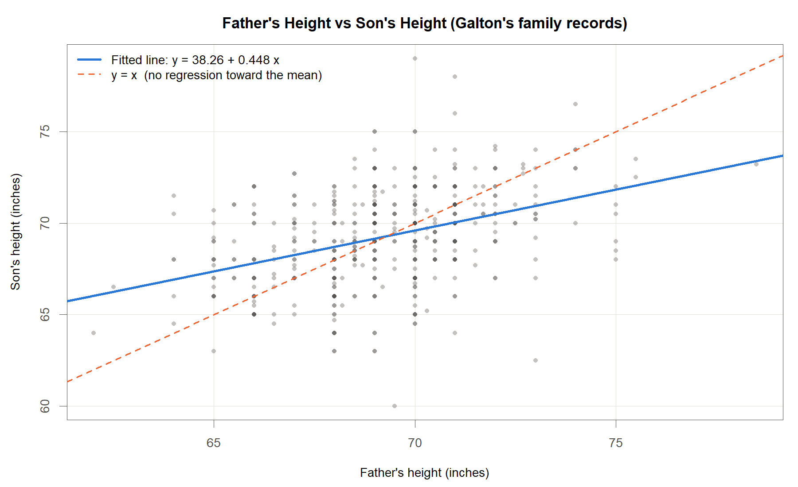{width=100%}
:::

::: {.column width="42%"}
::: {.callout-tip appearance="minimal" style="margin-top: 1.5em;"}
**Sir Francis Galton (England, 1822-1911)**

<ul>
<li>회귀(regression)라는 용어의 창시자</li>
<li>부모의 신체 특성과 자식의 신체 특성 사이의 관계를 자료로 탐구</li>
</ul>
:::

::: {.callout-note appearance="minimal" style="margin-top: 0.6em;"}
**자료에 관한 주의**

<ul>
<li>골턴이 직접 수집한 <b>가족 기록</b>. 197 가족의 자녀 898명</li>
<li>이 그림은 그중 <b>아들 465명</b>과 그 아버지의 키</li>
<li>$y=x$ 보다 적합선이 <b>완만함</b></li>
<li><b>이 기울기 차이가 회귀의 근거</b></li>
</ul>
:::
:::
::::

::: {.aside}
Galton, F. (1886). Regression towards mediocrity in hereditary stature. *Journal of the Anthropological Institute of Great Britain and Ireland*, 15, 246-263. / Pearson, K. and Lee, A. (1903). On the laws of inheritance in man. *Biometrika*, 2, 357-462. / Data plotted here: Galton's family records, 197 families and 898 children (`galton-stata11.tab`).
:::

::: notes
회귀라는 개념을 처음 만들어 낸 사람은 영국의 프랜시스 골턴입니다. 골턴이 궁금해했던 것은 소박한 질문이었습니다. 부모가 크면 자식도 큰가, 크다면 얼마나 큰가. 이 질문에 답하려면 부모와 자식의 키를 실제로 재서 짝을 지어 놓고 들여다봐야 합니다. 회귀분석은 처음부터 자료에서 출발한 방법이었던 셈입니다.

골턴이 사람의 키부터 본 것은 아닙니다. 1877년에는 완두콩으로 시작했습니다. 씨앗을 무게에 따라 일곱 등급으로 나누고, 친구 일곱 명에게 등급마다 열 알씩 담은 봉지 일곱 개를 보냈습니다. 이듬해 자식 씨앗을 거둬 돌려받아 무게를 재 보니 무거운 어미에서 나온 자식은 어미보다 가볍고, 가벼운 어미에서 나온 자식은 어미보다 무거웠습니다. 양쪽 다 가운데로 몰렸습니다. 그리고 그 몰리는 정도가 어미의 치우침에 정확히 비례했습니다. 직선이었던 것입니다.

사람 키로 넘어온 것이 1885년입니다. 205가족의 부모와 성인 자녀의 키를 모았습니다. 어머니 키에 1.08을 곱해 아버지 키와 같은 눈금으로 맞춘 뒤 두 값을 평균해 중간부모라는 값을 만들었습니다. 중간부모와 자녀의 중앙값은 둘 다 68.25인치였습니다. 여기서 발표한 법칙이 이렇습니다. 자녀의 편차는 평균적으로 중간부모 편차의 3분의 2다.

골턴이 같은 자리에서 든 비유가 참 쉽습니다. 포도주 통에 물을 붓는 것과 같다고 했습니다. 진한 포도주든 연한 포도주든, 같은 비율로 물을 부으면 똑같은 비율로 묽어집니다. 여기에 유전이 끼어들 자리가 있습니까. 없습니다. 섞으면 옅어질 뿐입니다. 키도 마찬가지입니다. 아들 키가 아버지 키를 그대로 빼닮는 것만 아니라면, 자식은 언제나 가운데 쪽으로 조금 당겨집니다. 유전이라서가 아니라 숫자가 원래 그렇게 움직입니다. 골턴이 완두콩을 심은 지 8년 만에 얻은 답이 이것입니다.

이제 그림을 보겠습니다. 점 하나가 아버지와 아들 한 쌍입니다. 가로가 아버지 키, 세로가 아들 키이고 단위는 인치입니다. 이 점들은 골턴이 직접 적어 둔 실제 가족 기록입니다. 197가족의 자녀 898명 가운데 아들 465명을 골라 아버지와 짝지었습니다. 여기서 두 가지를 같이 봐 주십시오. 첫째, 점 무리가 오른쪽 위로 비스듬히 올라갑니다. 아버지가 크면 아들도 큰 편이라는 뜻입니다. 둘째, 그 점 무리가 위아래로 꽤 두껍습니다. 아버지 키가 같아도 아들 키는 제각각이라는 뜻입니다. 회귀분석은 이 두 가지를 모두 다룹니다. 비스듬한 정도는 직선으로, 두꺼운 정도는 오차의 크기로 나타냅니다.

파선을 하나 더 그어 두었습니다. 아들 키가 아버지 키와 똑같아지는 선입니다. 아버지가 70이면 아들도 70, 이런 선입니다. 파란 실선이 그 파선보다 더 누워 있는 것이 보이십니까. 오른쪽 끝에서는 파란 선이 파선보다 아래에 있습니다. 키 큰 아버지의 아들은 아버지만큼 크지는 않다는 뜻입니다. 왼쪽 끝에서는 반대로 위에 있습니다. 키 작은 아버지의 아들은 아버지보다는 크다는 뜻입니다. 양쪽 다 가운데로 당겨집니다. 바로 이 기울기 차이 때문에 회귀라는 이름이 붙었습니다.
:::

## 주변분포와 조건부분포 {.smaller}

### <i class="fa-solid fa-chart-line"></i> 조건을 걸면 분포가 통째로 움직인다

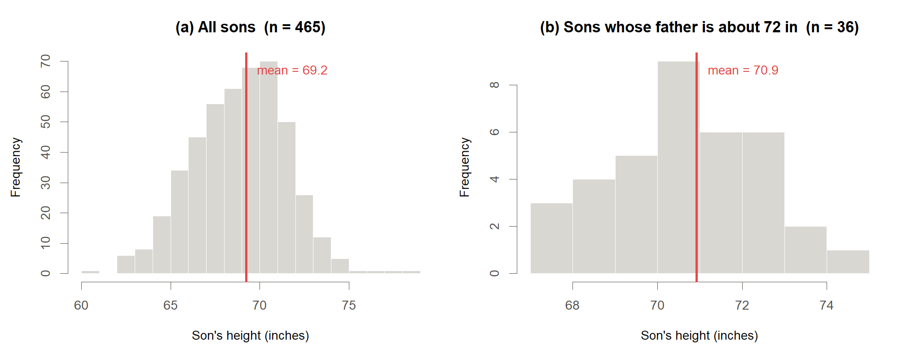{width=100%}

:::: {.columns}

::: {.column width="50%"}
::: {.callout-tip appearance="minimal"}
**질문 1. 아무 정보 없이 자식 한 명의 키를 예측한다면**

전체 평균 69.2인치 = 조건을 걸지 않은 **주변분포(marginal distribution)** 의 평균 $E(Y)$

<ul>
<li>기호 $E(\cdot)$ 는 기댓값(expectation), 곧 이론적인 평균</li>
</ul>
:::
:::

::: {.column width="50%"}
::: {.callout-tip appearance="minimal"}
**질문 2. 아버지의 키가 72인치라는 조건이 있다면**

조건을 만족하는 집단 안의 평균 = **조건부분포(conditional distribution)** 의 평균 $E(Y \mid X = 72)$

<ul>
<li>해당 구간(72 ± 0.75인치, 36명)의 표본평균: 70.9인치</li>
<li>회귀직선 $\hat y = 38.3 + 0.448\,x$ 가 $x = 72$ 에서 주는 예측: 70.5인치</li>
</ul>
:::
:::

::::

> 질문 1에서 질문 2로 넘어가는 전환이 회귀의 출발점임.

::: notes
같은 자료를 다른 각도에서 보겠습니다. 왼쪽 히스토그램은 아버지가 누구인지 전혀 따지지 않고 아들 465명의 키만 모은 것입니다. 전체 평균이 69.2인치입니다. 오른쪽은 조건을 하나 걸었습니다. 아버지 키가 대략 72인치인 집안만 골라냈으니, 왼쪽 그림에서 세로로 얇은 조각 하나를 잘라 낸 셈입니다. 이 조각 안의 평균은 70.9인치로 올라가 있습니다. 무엇이 달라졌습니까? 조건 하나를 걸었더니 분포가 통째로 옮겨 갔습니다. 예측 문제로 바꿔 보겠습니다. 아무 정보 없이 아들 한 명의 키를 맞히라면 전체 평균 69인치가 최선입니다. 그런데 아버지가 72인치라는 힌트를 받고도 여전히 69라고 답하시겠습니까? 70인치대 초반으로 고쳐 부르는 편이 낫습니다. 이때 숫자가 두 개 나옵니다. 구간 안에 실제로 들어온 아들들의 평균이 70.9, 자료 전체로 그은 직선에서 읽은 값이 70.5입니다. 앞의 값은 소수의 관측만 평균 낸 것이라 흔들림이 큽니다. 뒤의 값은 자료 전체를 써서 그은 선 위에서 읽었습니다.
:::

## 국소평균과 회귀직선 {.smaller}

### <i class="fa-solid fa-chart-line"></i> 조건을 여러 개로 늘리면

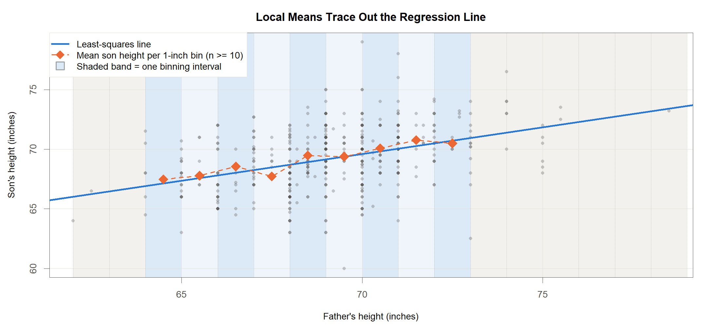{width=100%}

::: {.callout-tip appearance="minimal"}
<ul>
<li>앞 슬라이드는 $x=72$ 라는 <b>조건 하나</b>였고, 여기서는 아버지 키를 <b>1인치 구간</b>으로 나누어 조건을 여러 개로 늘림</li>
<li>구간마다 구한 자식 키의 평균이 <b>국소평균(local mean)</b>. 그림의 주황 마름모이며, 색 띠 하나가 구간 하나</li>
<li>관측이 10명 미만인 구간(회색 띠)은 평균의 흔들림이 커서 제외</li>
</ul>
:::

> 국소평균들이 하나의 직선 위에 거의 일치 $\rightarrow$ **최소제곱 회귀직선**

::: notes
조건을 하나만 걸면 점이 하나만 찍힙니다. 그러면 그 점이 우연인지 아닌지 알 수가 없습니다. 이번에는 조건을 여러 개로 늘려 보겠습니다. 아버지 키를 1인치 단위로 잘라 칸을 여러 개 만들고, 각 칸에 속한 아들들의 평균 키를 하나씩 구했습니다. 주황색 마름모가 그 값입니다. 이것을 국소평균이라고 부릅니다. 결과를 보십시오. 따로따로 계산한 이 평균들이 흩어지지 않고 거의 일직선 위에 줄을 서 있습니다. 파란 직선은 그 자료에 맞춘 회귀직선인데, 마름모들 사이를 잘 지나갑니다. 조건부 평균이 아버지 키에 따라 직선으로 움직인다는 뜻입니다. 회귀직선을 왜 직선으로 그리는지, 그 직선이 무엇을 이어 놓은 선인지를 한 장으로 보여 주는 그림입니다.
:::

## 회귀의 정의 {.smaller}

### <i class="fa-solid fa-bullseye"></i> 정의

> **회귀(regression)** 란 설명변수 $X = x$ 가 주어졌을 때 반응변수 $Y$ 의 조건부 기댓값
> $$E(Y \mid X = x)$$
> 이다.

:::: {.columns}
::: {.column width="58%"}
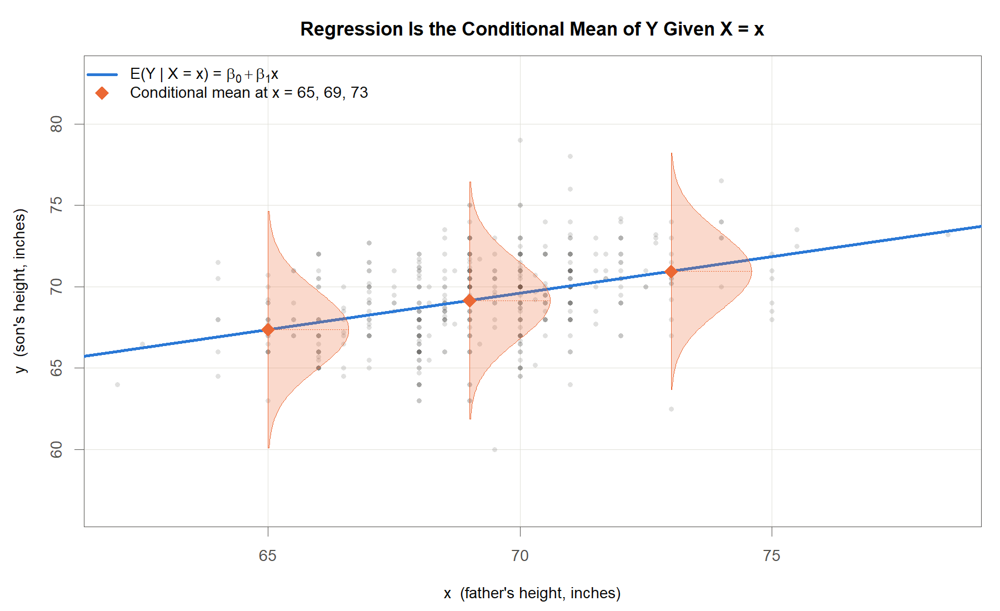{width=100%}
:::

::: {.column width="42%"}
<ul>
<li>$Y$: 반응변수, $X$: 설명변수, $x$: 설명변수가 취한 특정한 값</li>
<li>$E(\cdot \mid X = x)$: $X = x$ 라는 조건 아래에서 계산한 평균</li>
</ul>

::: {.callout-tip appearance="minimal"}
**그림 읽는 법**

<ul>
<li>각 $x$ 마다 $Y$ 의 분포가 하나씩 존재</li>
<li>그 분포의 중심이 회귀직선 위에 위치</li>
<li>회귀직선은 그 중심들을 이은 선</li>
</ul>
:::

두 변수가 함께 종 모양의 좌우대칭 분포(이변량 정규분포)를 이루면, 이 조건부 기댓값은 정확히 직선
:::
::::

::: notes
이제 오늘 강의에서 가장 중요한 한 문장을 말씀드리겠습니다. 회귀란 설명변수가 특정 값으로 주어졌을 때 반응변수의 평균입니다. 조건부 기댓값이라는 어려운 이름이 붙어 있지만, 뜻은 방금 히스토그램에서 보신 그대로입니다. 조건을 걸고 나서 구한 평균. 그림에는 파란 직선 위에 종 모양 곡선이 세 개 얹혀 있습니다. 각각 아버지 키가 65인치, 69인치, 73인치일 때 아들 키가 어떻게 퍼지는지를 나타냅니다. 세 곡선의 봉우리가 모두 파란 직선 위에 정확히 올라앉아 있습니다. 회귀직선은 이 봉우리들을 이어 놓은 선입니다. 방금 종 모양이라는 말을 썼습니다. 평균을 중심으로 좌우가 대칭이고 가운데가 가장 높은 이 모양을 정규분포라고 부릅니다. 두 변수가 함께 이 모양을 이루면 봉우리들이 정확히 직선을 이룬다는 사실이 수학적으로 증명되어 있습니다. 앞으로 회귀라는 말이 나올 때마다 머릿속에서 이 그림으로 돌아오시면 됩니다.
:::

## 회귀모형과 선형회귀모형 {.smaller}

### <i class="fa-solid fa-bullseye"></i> 회귀모형 (regression model)

::: {.callout-tip appearance="minimal" style="font-size: 150%; margin-top: 1em; margin-bottom: 1em;"}
$$X_1, \; X_2, \; \dots, \; X_p \;\; \longrightarrow \;\; Y, \qquad Y = f(X_1, X_2, \dots, X_p) + \varepsilon$$

<ul>
<li>$Y$: 반응변수, $X_1, \dots, X_p$: $p$ 개의 설명변수, $\varepsilon$: 확률오차(random error)</li>
<li>$f$: 설명변수 값이 주어졌을 때 $Y$ 의 조건부 평균, 곧 $f(x) = E(Y \mid X = x)$</li>
</ul>
:::

### <i class="fa-solid fa-bullseye"></i> 선형회귀모형 (linear regression model)

::: {.callout-tip appearance="minimal" style="font-size: 150%; margin-top: 1em; margin-bottom: 1em;"}
$$Y = \beta_0 + \beta_1 X_1 + \beta_2 X_2 + \dots + \beta_p X_p + \varepsilon$$

<ul>
<li>$\beta_0, \beta_1, \dots, \beta_p$: 회귀모수(regression parameters), 회귀계수(coefficients)</li>
<li>$f$ 의 모양을 모르므로 <b>가장 단순한 형태</b>인 일차식부터 가정한 것</li>
</ul>
:::

::: {.callout-note appearance="minimal"}
**Remark**

<ul>
<li>회귀모수 = 자료로부터 추정해야 할 <b>미지의 상수(unknown constants)</b></li>
<li>자료가 바뀌면 추정값은 바뀌나, 추정 대상인 모수 자체는 고정</li>
</ul>
:::

::: notes
방금 정의한 조건부 평균에 이름을 붙여 함수 f라고 쓰겠습니다. 그러면 반응변수는 이 함수에 오차를 더한 것으로 적을 수 있습니다. f가 신호, 엡실론이 잡음입니다. 관측값은 항상 신호와 잡음의 합입니다. 문제는 f의 모양을 우리가 모른다는 점입니다. 세상의 모든 함수를 다 시도할 수는 없습니다. 가장 단순한 모양부터 가정해 보는 것이 자연스럽습니다. 그 단순한 모양이 각 설명변수에 계수를 곱해서 더하는 형태고, 이것을 선형회귀모형이라고 부릅니다. 여기 등장하는 베타들은 우리가 모르는 값입니다. 그렇지만 자료를 새로 뽑는다고 해서 변하지는 않는 고정된 상수입니다. 자료마다 다르게 얻는 것은 그 상수에 대한 추정값이지 상수 자체가 아닙니다. 이 구분은 뒤에서 계속 필요합니다.
:::

## Galton 자료에 대한 단순선형모형 적합 {.smaller}

### <i class="fa-solid fa-table"></i> 결과

| Term | Estimate | SE | $t$ value | $p$-value |
|:---|---:|---:|---:|---:|
| (Intercept) $\hat\beta_0$ | 38.3 | 3.39 | 11.3 | < 0.001 |
| $x$ (father's height) $\hat\beta_1$ | 0.448 | 0.0489 | 9.15 | < 0.001 |

: Least-squares fit of son's height on father's height, n = 465, from Galton's family records.

| Source | Df | Sum Sq | Mean Sq | $F$ value | $p$-value |
|:---|---:|---:|---:|---:|---:|
| $x$ | 1 | 492 | 492 | 83.7 | < 0.001 |
| Residuals | 463 | 2721 | 5.88 | n.a. | n.a. |

: Analysis of variance for the fitted simple linear model. R-squared = 0.153, residual SD = 2.42 inches.

::: {.callout-note appearance="minimal"}
**표에 나온 용어**

<ul>
<li>표준오차(SE): 같은 조사를 반복할 때 추정값이 얼마나 흔들리는지를 나타내는 값</li>
<li>$t$ 값: 추정값을 그 표준오차로 나눈 값. 절댓값이 클수록 추정값이 0에서 멀다</li>
<li>$p$ 값: 참값이 0이라고 가정했을 때 지금 자료에서 얻은 정도의 값이 우연히 나타날 확률. 작을수록 "참값이 0"이라는 가정이 자료와 어울리지 않는다</li>
</ul>

세 용어의 정식 정의: 다음 장 Preliminary Knowledge
:::

적합된 직선 $\hat y = 38.3 + 0.448\,x$. 여기서 $\hat y$: 아들 키의 적합값, $x$: 아버지의 키(인치)

::: notes
방금 세운 모형을 이 자료에 실제로 맞춘 결과입니다. 위 표의 두 줄만 보시면 됩니다. 절편이 38.3, 기울기가 0.448. 기울기 0.448의 뜻은 이렇습니다. 아버지 키가 1인치 더 큰 집단으로 옮겨 가면 아들 키의 평균은 0.448인치만 더 큽니다. 1인치가 아니라 그 절반이 채 안 되게 따라옵니다. 이 현상 때문에 골턴이 회귀, 곧 평균으로 되돌아간다는 이름을 붙였습니다. 아주 큰 아버지의 아들은 여전히 크긴 합니다. 다만 아버지만큼은 아니고 전체 평균 쪽으로 조금 끌려옵니다.

여기서 예상 질문이 하나 나옵니다. 골턴은 3분의 2라고 했는데 왜 이 표는 0.448이냐. 두 숫자는 서로 다른 회귀입니다. 골턴의 3분의 2는 아버지와 어머니를 평균한 중간부모를 설명변수로 쓴 값이고, 이 표는 아버지 한 사람만 쓴 값입니다. 같은 자료로 직접 확인해 보았습니다. 이 파일에 든 자녀 898명 전체에 대해 중간부모를 설명변수로 회귀하면 기울기가 0.729로 나옵니다. 골턴의 3분의 2, 곧 0.667과 같은 계열의 숫자입니다. 반면 아버지 한 사람만 쓰면 0.448입니다. 왜 이렇게 차이가 날까요. 중간부모는 두 사람을 평균한 값이라 개인차가 상쇄되어 정보가 더 정확하고, 그만큼 자식 키를 더 강하게 끌어당깁니다. 설명변수를 무엇으로 두느냐가 기울기를 바꾼다는 뜻입니다. 어긋난 것이 아닙니다.

나머지 칸의 용어는 아래 상자에 풀어 두었습니다. 표준오차는 이 추정값이 얼마나 흔들리는 값인지를 알려 줍니다. t 값은 추정값을 그 흔들림으로 나눈 것이니, 흔들림에 비해 추정값이 얼마나 큰지를 재는 셈입니다. p 값은 기울기가 사실은 0인데 우연히 이런 결과가 나올 확률입니다. 0.001보다도 작습니다. 우연으로 보기 어렵다는 뜻입니다. 아래 표는 전체 변동을 직선으로 설명된 부분과 남은 부분으로 쪼갠 것입니다. 자세한 해석은 Simple Linear Regression 장에서 하겠습니다.
:::

## 회귀분석의 8단계 {.smaller}

### <i class="fa-solid fa-list-check"></i> Steps in regression analysis

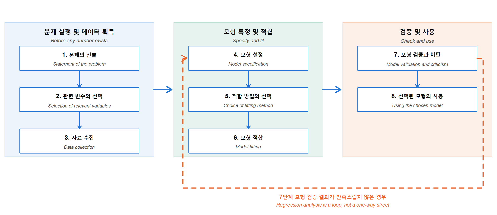{width=100%}

::: {.callout-tip appearance="minimal" style="font-size: 150%; margin-top: 1em; margin-bottom: 1em;"}
**1단계가 가장 중요**: 1단계 = 질문 확정. 연구 질문을 잘못 정의하면 이후 모든 단계의 노력이 무효
:::

::: notes
이제 절차로 넘어가겠습니다. 회귀분석은 여덟 단계로 정리됩니다. 순서를 외우실 필요는 없습니다. 화면의 세 덩어리만 보시면 됩니다. 왼쪽 파란 묶음은 자료를 만들기 전의 일, 가운데 초록 묶음은 모형을 세우고 맞추는 일, 오른쪽 주황 묶음은 검증하고 쓰는 일입니다. 강조하고 싶은 것은 1단계입니다. 실무에서 분석이 실패하는 가장 흔한 이유는 계산을 틀려서가 아닙니다. 애초에 답하려는 질문이 흐릿했기 때문입니다. 무엇을 알고 싶은지가 한 문장으로 안 나오면 어떤 기법을 써도 소용이 없습니다. 목적지를 정하지 않고 출발하면 아무리 빨리 달려도 도착하지 못합니다. 그리고 이 여덟 단계는 직선이 아니라 고리입니다. 화면 아래를 크게 돌아 올라가는 주황 점선을 봐 주십시오. 7단계 검증에서 문제가 나오면 화살표를 따라 4단계 모형 설정으로 되돌아가서 다시 내려옵니다. 파란 화살표만 있는 일방통행이 아닙니다.
:::

## 8단계와 이 강의의 구성 {.smaller}

### <i class="fa-solid fa-list-check"></i> 어느 장에서 어느 단계를 다루는가

| Step | 단계 | 다루는 장 |
|:--:|:--|:--|
| 1~3 | 문제의 진술, 관련 변수의 선택, 자료 수집 | Introduction |
| 4 | 모형 설정 | Preliminary Knowledge (행렬 표현), Simple Linear Regression, Multiple Linear Regression, Dummy Variable |
| 5 | 적합 방법의 선택 | Simple Linear Regression (최소제곱), Weighted Regression (가중최소제곱) |
| 6 | 모형 적합 | Simple Linear Regression, Multiple Linear Regression |
| 7 | 모형 검증과 비판 | Diagnosis & Variable Selection |
| 8 | 선택된 모형의 사용 | Simple Linear Regression (구간추정), Multiple Linear Regression (예측) |

: Mapping of the eight steps of regression analysis onto the chapters of this lecture.

::: {.callout-tip appearance="minimal"}
**다음 장 예고** · Preliminary Knowledge: 이후 모든 장에서 쓰는 기초 도구(공분산과 상관계수, 확률분포와 검정, 행렬 표기)의 정리
:::

::: notes
왼쪽이 여덟 단계, 오른쪽이 그 단계를 실제로 다루는 장입니다. 앞의 세 단계, 그러니까 문제를 진술하고 변수를 고르고 자료를 모으는 일은 지금 이 장에서 이야기합니다. 4단계 모형 설정은 여러 장에 걸쳐 나옵니다. 행렬로 적는 법을 익히고, 설명변수가 하나일 때와 여럿일 때를 차례로 보고, 마지막에 범주형 변수를 넣습니다. 5단계, 어떤 방법으로 맞출지는 보통 최소제곱입니다. 관측마다 신뢰도가 다르면 가중최소제곱을 쓰고, 그것이 Weighted Regression 장입니다. 7단계 검증은 Diagnosis 장이 통째로 담당합니다. 마지막 8단계, 만든 모형을 쓰는 일은 구간추정과 예측에서 나옵니다. 길을 잃었다 싶으시면 이 표로 돌아오십시오. 다음 장은 도구를 챙기는 자리입니다. 공분산이니 상관계수니 하는 것들을 한 번 정리하고 넘어가겠습니다.
:::

## 예제 자료: 아이스크림 소비량 {.smaller}

### <i class="fa-solid fa-table"></i> 이 강의에서 반복해 쓰는 자료

::: panel-tabset

### 자료 구조

| period | IC | price | income | temp | year |
|---:|---:|---:|---:|---:|---:|
| 1 | 0.386 | 0.270 | 78 | 41 | 0 |
| 2 | 0.374 | 0.282 | 79 | 56 | 0 |
| 3 | 0.393 | 0.277 | 81 | 63 | 0 |
| 4 | 0.425 | 0.280 | 80 | 68 | 0 |
| 5 | 0.406 | 0.272 | 76 | 69 | 0 |

: First five rows of the ice cream consumption data. The full data set has n = 30 four-week periods and 6 variables.

행 = 관측(4주 단위의 한 기간), 열 = 변수. 전체 규모는 $n = 30$ 개 기간, 변수 6개

### 변수 설명

| Variable | 설명 | 단위 | 역할 |
|:--|:--|:--|:--|
| period | 관측 기간 번호 (4주 단위) | n.a. | 식별자 |
| IC | 아이스크림 섭취량 | pint | 반응변수 $y$ |
| price | 아이스크림 가격 | dollar | 설명변수 |
| income | 가족의 월수입 | dollar | 설명변수 |
| temp | 평균기온 | fahrenheit | 설명변수 |
| year | 관측 연차 (0, 1, 2) | n.a. | 질적 설명변수 |

: Variables of the ice cream consumption data.

`year` 는 계절이 아니라 **관측 연차**. 30개 기간이 세 해에 걸쳐 수집되었음을 뜻하며, Dummy Variable 장에서 가변수로 투입

### 수식 기호

관측 하나를 기호로 옮기면 네 값의 묶음

$$(y_i,\;x_{i1},\;x_{i2},\;x_{i3}),\qquad i=1,2,\dots,30$$

| Symbol | Variable | Range in the data |
|:--|:--|:--|
| $y_i$ | IC | 0.256 – 0.548 |
| $x_{i1}$ | price | 0.260 – 0.292 |
| $x_{i2}$ | income | 76 – 96 |
| $x_{i3}$ | temp | 24 – 72 |

: Notation used throughout the lecture for the ice cream data (n = 30)

이후 모든 슬라이드에서 $y$ 는 IC, $x_1,x_2,x_3$ 은 각각 price, income, temp 를 가리킴

:::

::: notes
오늘 강의에서 계속 따라다닐 자료를 소개하겠습니다. 아이스크림 소비량 자료입니다. 원자력과는 아무 상관이 없어 보입니다. 그래서 오히려 좋습니다. 전문 지식 없이도 결과가 말이 되는지 안 되는지 바로 판단하실 수 있으니까요. 첫 번째 탭이 자료의 앞 다섯 줄입니다. 가로 한 줄이 4주짜리 기간 하나이고, 이런 기간이 모두 30개 있습니다. 세로 한 칸은 변수 하나입니다. 두 번째 탭에 변수 설명을 정리했습니다. 우리가 알고 싶은 값은 아이스크림 섭취량, 파인트 단위입니다. 이걸 설명할 재료로 가격, 가족의 월수입, 평균기온을 씁니다. 기온 단위가 화씨라는 점만 주의하십시오. 41에서 71 사이 값이 나옵니다. 마지막 year 변수는 오해하기 쉽습니다. 계절이 아니라 몇 년째인지를 가리키고, 0, 1, 2 세 값을 갖습니다. 숫자처럼 보이지만 실은 종류를 나누는 변수라서 그대로 넣으면 안 됩니다. 어떻게 넣는지는 Dummy Variable 장에서 다루겠습니다.
:::

## 변수의 유형과 특수한 이름들

### <i class="fa-solid fa-bullseye"></i> 변수의 유형

::: {.callout-tip appearance="minimal"}
<ul>
<li>양적 변수(quantitative): 가격, 소득, 기온, 조사량과 같이 수치로 측정되는 변수</li>
<li>질적 변수(qualitative): 제품 형태(용접재/판재/단조재), 성별(남/여)과 같이 범주로 측정되는 변수. 지시변수(indicator) 또는 가변수(dummy variable)로 코딩하여 모형에 넣는다</li>
</ul>
:::

> 회귀분석에서 **반응변수는 양적** 이고, **설명변수는 양적 또는 질적** 모두 가능하다.

### <i class="fa-solid fa-lightbulb"></i> 특수한 이름들

| Method | 반응변수 | 설명변수 |
|:---|:---|:---|
| 분산분석 (analysis of variance) | 양적 | 질적 |
| 공분산분석 (analysis of covariance) | 양적 | 양적, 질적 혼합 |
| 로지스틱회귀 (logistic regression) | 질적 (보통 이항) | 양적, 질적 |

: Special names for regression models by the type of the response and the predictors.

::: notes
변수는 두 종류입니다. 숫자로 재는 양적 변수, 종류를 나누는 질적 변수. 기온이나 가격은 양적이고 제품 형태나 합격 여부는 질적입니다. 질적 변수도 회귀에 넣을 수 있습니다. 다만 그대로는 못 넣고 0과 1로 바꿔서 넣습니다. 이것을 가변수라고 부르고, 뒤에서 따로 한 장을 씁니다. 회귀분석에서는 반응변수가 양적이어야 합니다. 설명변수 쪽은 양적이든 질적이든 상관없습니다. 여기서 눈여겨볼 대목이 있습니다. 통계학에서 다른 이름으로 배웠던 방법들이 알고 보면 이 표의 칸 하나씩을 채우고 있을 뿐입니다. 설명변수가 전부 질적이면 분산분석, 섞여 있으면 공분산분석이라고 부릅니다. 반응변수가 질적이면 로지스틱 회귀가 됩니다. 이름은 달라 보여도 뿌리는 하나입니다.
:::

## 모형의 분류: 세 가지 기준

### <i class="fa-solid fa-bullseye"></i> 판정의 잣대

::: {.callout-tip appearance="minimal"}
<ul>
<li>선형(linear) / 비선형(nonlinear): 모수 $\beta_j$ 가 설명항에 곱해져 더해지는 형태이면 선형, 그렇지 않으면 비선형</li>
<li>단순(simple) / 다중(multiple): 모형에 들어간 <b>설명항(regressor)</b> 이 한 개면 단순, 두 개 이상이면 다중</li>
<li>일변량(univariate) / 다변량(multivariate): 반응변수가 한 개면 일변량, 두 개 이상이면 다변량</li>
</ul>
:::

::: {.callout-note appearance="minimal"}
**Remark**

<ul>
<li>선형성 판정은 모수 $\beta_j$ 가 들어가는 방식만 봄. 그래프가 곡선이어도 선형모형일 수 있음</li>
<li>설명항을 셀 때 $\log X$, $X^2$ 처럼 변환한 항도 각각 하나로 셈</li>
<li>기준은 원변수의 개수가 아니라 모형에 들어간 항의 개수</li>
</ul>
:::

::: notes
모형을 세 가지 잣대로 나눠 보겠습니다. 첫째는 선형이냐 아니냐입니다. 여기서 오해가 가장 많이 생깁니다. 선형이라는 말은 그림이 직선이라는 뜻이 아닙니다. 모수 베타가 들어가는 방식이 곱하고 더하는 형태냐를 묻는 것입니다. 둘째 잣대는 모형에 들어간 설명항이 몇 개냐, 셋째 잣대는 반응변수가 몇 개냐입니다. 설명항이 하나면 단순, 둘 이상이면 다중. 반응변수가 하나면 일변량, 여럿이면 다변량. 단서를 하나 달아 두겠습니다. 같은 원변수를 변환한 항도 별개의 설명항으로 셉니다. 로그를 씌운 항, 제곱을 한 항이 각각 하나씩입니다. 이 약속을 다음 슬라이드의 여섯 문제에 그대로 적용해 보십시오.
:::

## 모형의 분류: 연습

### <i class="fa-solid fa-question"></i> 여섯 개 모형을 분류하라

<ol>
<li>$Y = \beta_0 + \beta_1 X_1 + \varepsilon$</li>
<li>$Y = \beta_0 + e^{\beta_1 X_1} + \varepsilon$</li>
<li>$Y = \beta_0 + \beta_1 X_1 + \beta_2 X_2 + \varepsilon$</li>
<li>$Y_1 = \beta_0 + \beta_1 X_1 + \beta_2 X_2 + \varepsilon_1$ 이고 $Y_2 = \gamma_0 + \gamma_1 X_1 + \gamma_2 X_2 + \varepsilon_2$</li>
<li>$Y = \beta_0 + \beta_1 \log X_1 + \varepsilon$</li>
<li>$Y = \beta_0 + \beta_1 X + \beta_2 X^2 + \varepsilon$</li>
</ol>

::: {.callout-tip appearance="minimal"}
판정 순서: 선형성 → 설명항의 개수 → 반응변수의 개수
:::

::: notes
직접 해 보실 차례입니다. 여섯 개 모형을 앞의 세 기준으로 하나씩 판정해 보십시오. 순서를 정해 두면 헷갈리지 않습니다. 먼저 베타가 어디에 어떻게 들어가 있는지 보고 선형인지 비선형인지 정합니다. 그다음 더해진 설명항이 몇 개인지 셉니다. 마지막으로 좌변의 반응변수가 몇 개인지 봅니다. 2번을 특히 눈여겨보십시오. 베타 1이 어디에 앉아 있습니까? 지수 안에 갇혀 있습니다. 6번도 함정입니다. 원변수는 X 하나뿐인데 항은 몇 개일까요? 30초 드리겠습니다.
:::

## 모형의 분류: 정답과 해설

### <i class="fa-solid fa-circle-check"></i> 판정 결과

| 기준 | 해당 모형 |
|:---|:---|
| 선형 (linear) | 1, 3, 4, 5, 6 |
| 비선형 (nonlinear) | 2 |
| 단순 (simple) | 1, 2, 5 |
| 다중 (multiple) | 3, 4, 6 |
| 일변량 (univariate) | 1, 2, 3, 5, 6 |
| 다변량 (multivariate) | 4 |

: Classification of the six example models.

::: {.callout-tip appearance="minimal"}
**해설**

<ul>
<li>2번은 $\beta_1$ 이 지수 안에 들어가 있어 비선형</li>
<li>5번의 $\log X_1$, 6번의 $X^2$ 는 변환된 항이지만 $\beta_j$ 가 곱해져 더해지므로 선형</li>
<li>6번은 원변수가 $X$ 하나여도 설명항이 $X$ 와 $X^2$ 로 두 개이므로 다중</li>
<li>모형이 선형이면 통상적인 회귀 소프트웨어를 그대로 사용. 1, 3, 4, 5, 6은 모두 같은 절차로 모수를 추정</li>
</ul>
:::

::: notes
답을 맞춰 보겠습니다. 비선형은 2번 하나입니다. 베타 1이 지수 안에 갇혀 있어서 곱하고 더하는 형태로 풀어낼 수가 없습니다. 5번은 로그가 붙어 있어 비선형처럼 보입니다. 그런데 변환된 것은 설명변수이지 모수가 아닙니다. 그래서 선형입니다. 6번도 마찬가지입니다. 그림을 그리면 포물선이 나오는데도 선형모형입니다. 대신 6번은 설명항이 X와 X 제곱 두 개이므로 다중으로 분류합니다. 원변수 개수가 아니라 항의 개수를 센다는 점, 여기서 확인해 두십시오. 4번은 좌변에 Y가 두 개라 유일한 다변량 모형입니다. 이 구분이 왜 중요할까요? 선형이기만 하면 우리가 아는 표준 절차 하나로 전부 처리되기 때문입니다.
:::

## 적합값과 예측값

### <i class="fa-solid fa-bullseye"></i> 두 값의 구분

6단계 모형 적합 = 회귀모수의 추정. 추정된 계수를 $\hat\beta_0, \hat\beta_1, \dots, \hat\beta_p$ 라 하면

$$\hat y_i = \hat\beta_0 + \hat\beta_1 x_{i1} + \dots + \hat\beta_p x_{ip}, \qquad i = 1, \dots, n$$

여기서 $\hat y_i$: $i$ 번째 관측의 적합값, $x_{ij}$: $i$ 번째 관측의 $j$ 번째 설명변수 값

::: {.callout-note appearance="minimal"}
**Remark: 적합값 vs 예측값**

<ul>
<li>적합값(fitted value): 설명변수 값이 자료에 있는 $n$ 개 관측 중 하나와 일치하는 경우에 계산한 값 $\hat y_i$</li>
<li>예측값(predicted value): 설명변수의 <b>임의의</b> 값 집합에 대하여 계산한 값 $\hat Y$</li>
</ul>

<ul>
<li>두 값의 계산식은 동일</li>
<li>입력한 설명변수 값이 자료 안의 관측이면 적합값, 자료 밖의 새 값이면 예측값</li>
<li>잔차 $e_i = y_i - \hat y_i$ 는 적합값에서만 정의됨</li>
</ul>
:::

::: notes
적합과 예측은 계산식이 똑같아서 자주 뒤섞여 쓰입니다. 구분해 두시는 편이 좋습니다. 적합값은 이미 자료에 들어 있는 관측의 설명변수 값을 그대로 식에 넣어 얻은 값입니다. 답을 아는 문제를 다시 풀어 본 셈입니다. 그래서 실제 관측값과 비교할 수 있고, 그 차이가 잔차입니다. 예측값은 다릅니다. 자료에 없는 새로운 설명변수 값을 넣어 얻은 값이라 맞았는지 지금은 알 수가 없습니다. 이 차이가 왜 중요할까요? 모형이 얼마나 좋은지 평가할 때 적합값만 보면 지나치게 낙관하게 되기 때문입니다. 이미 본 문제를 다시 푸는 일은 원래 쉽습니다. 그리고 예측할 때는 자료의 범위를 크게 벗어난 곳까지 함부로 나가지 않는 것이 원칙입니다.
:::

## 연구 현장의 사례 1: 조사취화 예측식

### <i class="fa-solid fa-atom"></i> 원자로압력용기 조사취화 예측식 (ASTM E900-15)

:::: {.columns}
::: {.column width="50%"}
::: {.callout-tip appearance="minimal"}
**변수 구성**

<ul>
<li>반응변수: 중성자 조사에 따른 샤르피 41 J 천이온도 변화량(transition temperature shift, TTS)</li>
<li>양적 설명변수: 구리, 니켈, 인, 망간 함량, 중성자 조사량(fluence)과 조사율(flux), 조사 온도</li>
<li>질적 설명변수: 제품 형태(용접재, 판재, 단조재 등)를 지시변수로 투입</li>
</ul>
:::
:::

::: {.column width="50%"}
::: {.callout-tip appearance="minimal"}
**적합과 적합도**

<ul>
<li>자료: 상용 원전 감시시험 1878건. 13개국 감시시험 프로그램의 PLOTTER-BASELINE 자료</li>
<li>방법: 최대가능도로 26개 모수를 적합</li>
<li>적합도: RMSE 13.3 °C, 결정계수 $R^2 = 0.875$</li>
</ul>
:::
:::
::::

> 이 강의와의 연결: 지시변수 투입은 Dummy Variable 장, $R^2$ 는 Simple Linear Regression 장.

::: {.aside}
ASTM E900-21e1. / *Metals* 12(3), 481 (2022), doi:10.3390/met12030481.
:::

::: notes
오늘 배운 정의가 현장에서 어떤 모습으로 나타나는지 실제 사례 세 건을 보여 드리겠습니다. 첫 번째는 여러분께 가장 익숙한 문제일 것입니다. 원자로압력용기가 중성자를 오래 맞으면 취성이 커집니다. 그 정도를 샤르피 41 줄 천이온도가 얼마나 올라갔는지로 재고, 이 값을 예측하는 식이 ASTM E900입니다. 설명변수를 보십시오. 구리, 니켈, 인, 망간 같은 화학 조성이 들어가고 중성자 조사량과 조사율, 조사 온도가 들어갑니다. 여기까지는 전부 숫자, 양적 설명변수입니다. 그런데 하나가 더 있습니다. 제품 형태입니다. 용접재냐 판재냐 단조재냐 하는 것은 숫자가 아닙니다. 이걸 지시변수로 바꿔서 모형에 넣습니다. 뒤에서 배울 가변수가 이것입니다. 자료는 13개국 감시시험 프로그램에서 모은 1878건이고, 최대가능도로 모수 26개를 적합했습니다. 적합도는 RMSE 13.3도, 결정계수 0.875입니다. 이 결정계수라는 숫자를 어떻게 읽는지는 단순선형회귀 장에서 다룹니다.
:::

## 연구 현장의 사례 2·3: 검교정과 선량-반응 {.smaller}

### <i class="fa-solid fa-radiation"></i> 감마선 효율 검교정, 원폭 생존자 선량-반응

:::: {.columns}
::: {.column width="50%"}
::: {.callout-tip appearance="minimal"}
**사례 2. 감마선 분광 효율 검교정**

<ul>
<li>각 측정점의 분산이 계수 통계(counting statistics)로 이미 알려져 있음</li>
<li>가중치를 추정하지 않고 계산한다: $w_i = 1/\sigma_i^2$. 여기서 $\sigma_i$ 는 해당 측정점 계수율의 표준편차</li>
<li>자료의 분산이 알려져 있을 때 역분산 가중이 최소분산 추정을 준다. 다른 가중은 정밀도 손실과 계수 불확도의 잘못된 추정을 부른다</li>
</ul>
:::

이 강의와의 연결: Weighted Regression.
:::

::: {.column width="50%"}
::: {.callout-tip appearance="minimal"}
**사례 3. 방사선 선량-반응 (원폭 생존자 수명연구 LSS)**

<ul>
<li>포아송 회귀로 1 Gy당 초과상대위험(excess relative risk, ERR)을 추정. 방사선방호 선량한도의 근거 자료</li>
<li>고형암 발생 1958~2009년 자료: 대상 105,444명, 고형암 22,538건, 3.1백만 인년</li>
<li>여성은 선형 모형이 가장 잘 맞는다. ERR = 0.64 /Gy (95% 신뢰구간 0.52~0.77)</li>
<li>남성은 선형-이차 모형이 더 잘 맞는다. 1 Gy에서 ERR = 0.20 (95% 신뢰구간 0.12~0.28)</li>
<li>같은 자료에서도 집단에 따라 설정할 모형이 달라짐</li>
</ul>
:::

이 강의와의 연결: Diagnosis & Variable Selection, Simple Linear Regression.
:::
::::

::: {.aside}
*Analytical Chemistry* 91(7) (2019), doi:10.1021/acs.analchem.9b00119. / INMM Annual Meeting Proceedings, "Weighted Least Squares Fitting of Gamma Spectroscopy Efficiency Functions". / *Carcinogenesis* (2025), "Summary of radiation effects on incidence of solid cancers in the Life Span Study of atomic bomb survivors: 1958-2009".
:::

::: notes
왼쪽은 감마선 분광기의 효율 검교정입니다. 이 사례에는 특별한 점이 있습니다. 보통 회귀에서는 관측마다 오차가 얼마나 큰지 모릅니다. 계수 측정은 다릅니다. 계수 통계로 각 측정점의 분산을 이미 알고 있습니다. 그러면 가중치를 추정할 필요 없이 계산하면 됩니다. 분산의 역수, 그것이 가중치입니다. 분산이 알려져 있을 때 역분산 가중이 가장 정밀한 추정을 줍니다. 다른 가중을 쓰면 정밀도를 잃고 계수 불확도도 잘못 추정하게 됩니다. 가중회귀 장에서 이 사례를 떠올려 주십시오. 오른쪽은 원폭 생존자 수명연구입니다. 방사선방호에서 쓰는 선량한도의 근거가 이 자료입니다. 10만 5천 명을 1958년부터 2009년까지 추적해 고형암 2만 2천여 건을 관찰했습니다. 여기서 눈여겨볼 대목이 나옵니다. 여성은 선량과 위험이 직선 관계로 가장 잘 맞습니다. 1 그레이당 초과상대위험이 0.64, 신뢰구간은 0.52에서 0.77. 그런데 남성은 직선이 아니라 선형-이차 모형이 더 잘 맞습니다. 같은 자료, 같은 반응변수인데 집단을 나누면 세워야 할 모형이 달라집니다. 어느 모형을 고를 것인가. 이 물음이 진단과 변수선택 장의 주제입니다.
:::

## 세 사례의 공통 구조

### <i class="fa-solid fa-link"></i> 분야는 달라도 묻는 형태는 하나

| Case | 분야 | 반응변수 $Y$ | 이 강의에서 쓰는 도구 |
|:--|:--|:--|:--|
| 1. 조사취화 예측식 | 재료 | 천이온도 변화량 TTS | Dummy Variable, $R^2$ |
| 2. 감마선 효율 검교정 | 계측 | 검출 효율 | Weighted Regression |
| 3. 원폭 생존자 선량-반응 | 역학 | 고형암 초과상대위험 ERR | Diagnosis & Variable Selection, 신뢰구간 |

: The three cases, their fields, and the chapters of this lecture that supply the tools.

> 세 사례는 재료, 계측, 역학으로 분야가 다르지만 모두 설명변수가 주어졌을 때 반응변수의 조건부 기댓값 $E(Y \mid X = x)$ 를 추정하는 문제이다.

::: notes
세 사례를 한 화면에 놓고 보겠습니다. 재료, 계측, 역학. 학회도 다르고 쓰는 용어도 다르고 저널도 다릅니다. 그런데 반응변수 칸을 보십시오. 천이온도 변화량, 검출 효율, 초과상대위험. 이름은 다 달라도 하는 일은 똑같습니다. 조건이 이러이러할 때 이 값의 평균이 얼마인가를 묻고 있습니다. 앞에서 말씀드린 조건부 기댓값, 그 한 문장입니다. 오른쪽 칸은 오늘 어느 장에서 그 도구를 배우는지 적어 둔 것입니다. 1번 사례의 제품 형태는 가변수 장, 2번의 역분산 가중은 가중회귀 장, 3번의 남녀 모형 선택은 진단과 변수선택 장에서 나옵니다. 정의 하나만 확실히 붙잡으시면, 나머지 장은 그 정의를 다루는 도구를 하나씩 늘려 가는 과정입니다.
:::

## 이 장의 정리

### <i class="fa-solid fa-list-check"></i> Introduction

<ul>
<li>회귀 = 조건부 기댓값 $E(Y \mid X = x)$. 조건을 걸면 분포가 통째로 옮겨 가고, 그 중심을 이은 선이 회귀직선</li>
<li>회귀모형 $Y = f(X_1, \dots, X_p) + \varepsilon$. 선형회귀모형은 $f$ 가 $\beta_j$ 의 일차결합인 경우</li>
<li>회귀분석 8단계. 1단계 문제의 진술이 가장 중요하고, 7단계에서 4단계로 되먹임</li>
<li>예제 자료 ice cream: $n = 30$ 기간, 변수 6개</li>
<li>현장 사례 3건(조사취화, 효율 검교정, 선량-반응)은 모두 $E(Y \mid X = x)$ 의 추정 문제</li>
</ul>

::: {.callout-note appearance="minimal"}
**다음 장** · Preliminary Knowledge: 조건부 기댓값을 계산으로 옮기는 데 필요한 도구(공분산과 상관계수, 확률분포와 검정, 행렬 표기)
:::

::: notes
1장을 정리하겠습니다. 오늘 붙잡아야 할 문장은 하나입니다. 회귀란 조건이 주어졌을 때 결과의 평균이다. 골턴의 자료에서 아버지 키라는 조건을 걸자 아들 키의 분포가 통째로 옮겨 갔고, 구간마다 구한 평균들이 직선 위에 늘어섰습니다. 그 선이 회귀직선입니다. 여기에 오차를 더하면 회귀모형이 되고, 계수를 곱해서 더하는 가장 단순한 형태가 선형회귀모형입니다. 절차는 여덟 단계로 정리했습니다. 계산보다 1단계, 그러니까 무엇을 묻고 있는가가 더 중요합니다. 검증에서 문제가 나오면 모형 설정으로 되돌아간다는 점도 함께 기억해 주십시오. 앞으로 아이스크림 자료가 계속 따라다닙니다. 마지막에 보신 현장 사례 세 건은 분야가 전부 다른데도 묻는 형태가 같았습니다. 다음 장에서는 이 정의를 실제 계산으로 옮기는 데 필요한 도구를 챙기겠습니다.
:::

# Preliminary Knowledge

::: notes
회귀분석을 배우기 전에 연장통부터 챙기겠습니다. 이 장은 두 부분입니다. 앞쪽은 행렬 표기, 자료 30줄을 한 줄로 줄여 쓰는 방법입니다. 뒤쪽은 확률분포와 검정의 기초입니다. 정규분포, 표집분포, t분포, p-value, 신뢰구간. 회귀 결과표에서 매번 마주치는 말들입니다. 여기서 뜻을 확실히 해 두면 뒤가 편합니다. 새 기호가 몇 개 나오지만 겁먹으실 필요는 없습니다. 새로 배우는 계산은 전치와 역행렬 두 개뿐이고, 나머지는 전부 이름 붙이기입니다. 이 장에는 회귀 이야기가 거의 나오지 않습니다. 대신 개념마다 맨 끝에 회귀에서 이것이 어디에 쓰이는지를 한 줄로 붙여 두었습니다.
:::

## 왜 행렬 표기인가

### <i class="fa-solid fa-question"></i> 질문

::: {.callout-note appearance="minimal"}
**앞 장에서 여기까지** · 회귀 = 조건부 기댓값 $E(Y \mid X = x)$, 절차는 8단계. **이 장의 질문** · 그 정의를 계산으로 옮기려면 어떤 도구가 필요한가
:::

관측 하나마다 회귀식을 따로 쓰면 같은 모양의 식이 $n$개 필요

$$
\begin{aligned}
y_1    &= \beta_0+\beta_1 x_{11}+\cdots+\varepsilon_1\\
y_2    &= \beta_0+\beta_1 x_{21}+\cdots+\varepsilon_2\\
       &\;\;\vdots\\
y_{30} &= \beta_0+\beta_1 x_{30,1}+\cdots+\varepsilon_{30}
\end{aligned}
$$

여기서 $y_i$: $i$번째 관측의 반응변수, $x_{i1}$: $i$번째 관측의 첫 번째 설명변수 값, $\beta_0,\beta_1,\dots$: 모든 관측에 공통인 회귀계수, $\varepsilon_i$: $i$번째 관측의 오차, $n=30$: 관측 수

::: {.callout-tip appearance="minimal"}
**핵심**

<ul>
<li>관측이 바뀌어도 식의 모양은 동일하고, 회귀계수 $\beta_0,\beta_1,\dots$는 모든 관측에 공통임</li>
<li>같은 모양이 반복되면 하나로 묶어 쓰는 것이 자연스러움</li>
<li>행렬 표기는 이 30줄을 한 줄로 줄여 줌</li>
</ul>
:::

::: notes
성적표 비유를 하나 들어 보겠습니다. 학생 30명 평균을 내는데 성적표를 한 장씩 넘기며 계산기를 두드리는 분은 없으실 겁니다. 엑셀에 표로 넣고 한 번에 처리하십니다. 행렬은 그 엑셀 시트에 붙인 수학 이름일 뿐입니다. 화면의 30줄을 보십시오. 번호만 바뀌고 모양은 완전히 같습니다. 같은 모양이 반복되면 묶고 싶어지는 것이 사람 마음이고, 그 포장이 행렬입니다. 여기서 꼭 나오는 질문이 있습니다. 어차피 계산은 컴퓨터가 해 주는데 행렬을 알아야 하느냐. 필요합니다. 어떤 통계 프로그램이든 속으로 하는 일이 정확히 이 행렬 계산입니다. 결과표를 제대로 읽으려면 최소한의 행렬 언어가 있어야 합니다. 오늘은 그 최소한만 하겠습니다.
:::

## 벡터와 행렬 {.smaller}

### <i class="fa-solid fa-bullseye"></i> 정의

::: columns

:::: {.column width="46%"}
> **벡터** : 숫자를 세로로 줄 세운 배열. 굵은 소문자 $\mathbf{y}$로 표기한다.
>
> **행렬** : 숫자를 행과 열의 격자로 배열한 것. 굵은 대문자 $\mathbf{X}$로 표기한다.
>
> **차원** : 크기는 항상 "행 $\times$ 열" 순서로 적는다.
::::

:::: {.column width="54%"}
::: {.callout-tip appearance="minimal"}
**표기 규약**

<ul>
<li>원소 $x_{ij}$의 아래첨자는 행 먼저, 열 나중</li>
<li>굵은 글씨는 묶음, 아래첨자가 붙은 보통 글씨는 그 안의 낱개 숫자 하나</li>
<li>$\mathbf{X}$는 절편열을 포함한 $n\times(p+1)$ 설계행렬 전용 기호</li>
</ul>
:::
::::

:::

$$
\mathbf{y}=\begin{pmatrix} y_1\\ y_2\\ \vdots\\ y_{30} \end{pmatrix}
\;(30\times 1), \qquad
\mathbf{X}=\begin{pmatrix}
1 & x_{11} & \cdots & x_{1p}\\
1 & x_{21} & \cdots & x_{2p}\\
\vdots & \vdots & \ddots & \vdots\\
1 & x_{n1} & \cdots & x_{np}
\end{pmatrix}
\;(n\times (p+1))
$$

여기서 $\mathbf{y}$: 반응변수 $y_1,\dots,y_{30}$을 세로로 모은 벡터, $\mathbf{X}$: 1열이 절편열(모두 1)이고 나머지 $p$개 열이 설명변수 값인 설계행렬, $x_{ij}$: $i$번째 관측의 $j$번째 설명변수 값, $n$: 관측 수, $p$: 설명변수의 개수

::: notes
외울 것은 세 가지뿐입니다. 세로로 줄 세우면 벡터, 굵은 소문자. 격자로 배열하면 행렬, 굵은 대문자. 원소를 찾을 때는 행 먼저 열 나중. 영화관에서 몇 번째 줄, 그 줄의 몇 번째 자리를 찾는 것과 똑같습니다. 차원 표기 30 곱하기 1도 서른 줄 한 칸이라고 소리 내어 읽으면 금방 익숙해집니다. 굵은 글씨는 왜 따로 쓸까요. 굵은 y는 서른 개짜리 묶음 전체이고, 보통 y에 아래첨자 i가 붙으면 그중 한 칸의 숫자 하나입니다. 굵은 글씨를 만나면 여러 개를 한 덩어리로 묶었구나 하고 읽으시면 됩니다.
:::

## 회귀모형의 행렬 표현 {.smaller}

### <i class="fa-solid fa-bullseye"></i> 정의

> 관측 $n$개로 이루어진 선형회귀모형은 다음 한 줄로 표현된다.
>
> $$\mathbf{y}=\mathbf{X}\boldsymbol{\beta}+\boldsymbol{\varepsilon}$$
>
> 여기서 $\mathbf{X}$는 절편열을 포함한 $n\times(p+1)$ 설계행렬이다.

<ul>
<li>$\mathbf{y}$: 반응변수 $n$개를 모은 $n\times 1$ 벡터</li>
<li>$\mathbf{X}$: 1열이 모두 1이고 나머지 $p$개 열이 설명변수 값인 설계행렬</li>
<li>$\boldsymbol{\beta}$: 회귀계수 $\beta_0,\beta_1,\dots,\beta_p$를 모은 $(p+1)\times 1$ 벡터</li>
<li>$\boldsymbol{\varepsilon}$: 오차 $\varepsilon_1,\dots,\varepsilon_n$을 모은 $n\times 1$ 벡터. 각 $\varepsilon_i$가 흩어진 정도를 $\sigma^2$으로 적음</li>
</ul>

::: {.callout-note appearance="minimal"}
**행렬 곱과 개별 식의 동치**

<ul>
<li>행렬 곱 규칙 = 행과 열을 짝지어 곱한 뒤 더하기</li>
<li>$\mathbf{X}\boldsymbol{\beta}$의 $i$번째 성분이 $\beta_0+\beta_1x_{i1}+\cdots+\beta_px_{ip}$</li>
<li>따라서 이 한 줄을 풀어 쓰면 앞 슬라이드의 30줄과 정확히 일치</li>
</ul>
:::

::: {.aside}
Matrix formulation follows Kutner et al. (2005), *Applied Linear Statistical Models*, 5th ed., McGraw-Hill.
:::

::: notes
이 장 앞부분에서 가장 중요한 슬라이드입니다. 요점은 하나입니다. 화면의 식 한 줄이 앞에서 본 서른 줄과 완전히 같은 내용이라는 것. 행렬 곱셈도 어렵지 않습니다. 왼쪽 표의 한 행과 오른쪽 세로 묶음을 순서대로 짝지어 곱한 다음 전부 더한다. 이것이 전부입니다. 그 규칙대로 하면 i번째 행에서 베타영 더하기 베타일 곱하기 x, 원래 회귀식이 그대로 튀어나옵니다. 내용은 그대로고 포장만 바뀌었습니다. 상자 서른 개를 하나씩 나르느냐, 팔레트에 올려 한 번에 옮기느냐의 차이입니다. X를 설계행렬이라 부르는 이유도 단순합니다. 실험이나 관측을 어떻게 설계해 자료를 모았는지가 이 표에 그대로 담기기 때문입니다.
:::

## 아이스크림 자료: 데이터 구조 {.smaller}

### <i class="fa-solid fa-table"></i> 앞 다섯 행과 변수 구성

| period | IC | price | income | temp | year |
|---:|---:|---:|---:|---:|---:|
| 1 | 0.386 | 0.270 | 78 | 41 | 0 |
| 2 | 0.374 | 0.282 | 79 | 56 | 0 |
| 3 | 0.393 | 0.277 | 81 | 63 | 0 |
| 4 | 0.425 | 0.280 | 80 | 68 | 0 |
| 5 | 0.406 | 0.272 | 76 | 69 | 0 |

: First five rows of the ice cream data.

::: {.callout-tip appearance="minimal"}
**규모와 변수**

<ul>
<li>$n=30$개 기간(4주 단위) $\times$ 6개 열: 기간 번호 period와 분석 변수 5개</li>
<li>IC: 아이스크림 소비량, 반응변수 $y_i$ 자리에 들어감</li>
<li>price: 가격, income: 소득, temp: 평균 기온, 설명변수 $x_{ij}$ 자리에 들어감</li>
<li>year: 관측 연차(0, 1, 2). 계절이 아니라 자료를 모은 해를 뜻하며, Dummy Variable 장에서 가변수로 투입</li>
</ul>
:::

::: notes
앞 장에서 소개한 아이스크림 자료를 이번에는 행렬의 눈으로 보겠습니다. 한 줄이 4주짜리 기간 하나이고, 그런 기간이 서른 개 있습니다. 화면에는 앞 다섯 줄만 띄웠습니다. 열을 보십시오. IC가 소비량, 우리가 맞히고 싶은 값입니다. price는 가격, income은 소득, temp는 그 기간의 평균 기온입니다. 마지막 year는 조심하셔야 합니다. 봄여름가을겨울 같은 계절이 아니라 자료를 모은 해가 첫해냐 둘째 해냐 셋째 해냐를 나타냅니다. 0, 1, 2 세 값입니다. 이 변수는 뒤에 가변수 장에서 따로 다룹니다. 서른 개면 적다고 느끼실 수 있습니다. 회귀분석 교과서에서 오래 쓰인 고전 자료입니다.
:::

## 아이스크림 자료: 설계행렬

### <i class="fa-solid fa-pen-to-square"></i> 표를 행렬로 옮기면

::: {.callout-tip appearance="minimal"}
**Design matrix for the ice cream data**, $n=30$, $p=3$

$$
\underbrace{\begin{pmatrix} y_1\\ y_2\\ \vdots\\ y_{30} \end{pmatrix}}_{\mathbf{y}\;(30\times 1)}
=
\underbrace{\begin{pmatrix}
1 & x_{11} & x_{12} & x_{13}\\
1 & x_{21} & x_{22} & x_{23}\\
\vdots & \vdots & \vdots & \vdots\\
1 & x_{30,1} & x_{30,2} & x_{30,3}
\end{pmatrix}}_{\mathbf{X}\;(30\times 4)}
\underbrace{\begin{pmatrix} \beta_0\\ \beta_1\\ \beta_2\\ \beta_3 \end{pmatrix}}_{\boldsymbol{\beta}\;(4\times 1)}
+
\underbrace{\begin{pmatrix} \varepsilon_1\\ \varepsilon_2\\ \vdots\\ \varepsilon_{30} \end{pmatrix}}_{\boldsymbol{\varepsilon}\;(30\times 1)}
$$
:::

<ul>
<li>$\mathbf{y}$: 30개 기간의 소비량 IC를 모은 벡터</li>
<li>$\mathbf{X}$의 1열: 절편 $\beta_0$의 자리를 만들어 주는 1들. 2, 3, 4열: price $x_{i1}$, income $x_{i2}$, temp $x_{i3}$</li>
<li>첫 행의 실제 값: $x_{11}=0.270$, $x_{12}=78$, $x_{13}=41$, $y_1=0.386$</li>
<li><b>1열이 전부 1</b>인 이유: 행렬 곱에서 각 행마다 $\beta_0\times 1$이 계산되어 절편이 모든 기간에 똑같이 더해지도록 하기 위함</li>
</ul>

::: notes
앞 슬라이드의 표를 그대로 수학 기호로 옮긴 그림입니다. 왼쪽 y는 우리가 맞히고 싶은 서른 개 소비량 묶음. 가운데 큰 X는 엑셀 시트 그대로인데, 맨 앞에 1로만 채워진 열이 하나 추가되어 30 곱하기 4가 되었습니다. 그 옆 베타는 알아내고 싶은 계수 네 개, 마지막 엡실론은 설명되지 않고 남는 오차입니다. 여기서 꼭 나오는 질문이 있습니다. 1열은 왜 전부 1인가. 행렬 곱을 하면 각 행에서 베타영 곱하기 1이 계산되고, 그래서 절편이 모든 기간에 똑같이 더해집니다. 1들의 열은 절편이 앉을 좌석인 셈입니다. 아래에 첫 행의 실제 숫자를 넣어 두었습니다. x11이 0.270, x12가 78, x13이 41. 앞 슬라이드 표 첫 줄과 맞춰 보십시오.
:::

## 전치와 역행렬 {.smaller}

### <i class="fa-solid fa-bullseye"></i> 정의

::: columns

:::: {.column width="50%"}
> **전치** $\mathbf{X}^\top$ : 행과 열을 맞바꾼 행렬. $\mathbf{X}$가 $30\times 4$이면 $\mathbf{X}^\top$은 $4\times 30$이다.

$\mathbf{X}$의 $(i,j)$ 원소가 $\mathbf{X}^\top$의 $(j,i)$ 원소. 값은 그대로이고 배열 방향만 바뀜
::::

:::: {.column width="50%"}
> **역행렬** $\mathbf{A}^{-1}$ : 정방행렬 $\mathbf{A}$에 대해 $\mathbf{A}^{-1}\mathbf{A}=\mathbf{I}$ 를 만족하는 행렬.

여기서 $\mathbf{A}$: 행과 열의 수가 같은 정방행렬, $\mathbf{I}$: 주대각선이 1이고 나머지가 0인 항등행렬. 역행렬은 스칼라의 나눗셈에 대응하는 연산
::::

:::

$$
\mathbf{A}\mathbf{x}=\mathbf{b}\;\Longrightarrow\;\mathbf{x}=\mathbf{A}^{-1}\mathbf{b}
$$

::: {.callout-note appearance="minimal"}
**$2\times 2$ 로 직접 계산**

$$
\mathbf A=\begin{pmatrix}2&1\\ 1&1\end{pmatrix}
\;\Longrightarrow\;
\mathbf A^{-1}=\frac{1}{ad-bc}\begin{pmatrix}d&-b\\ -c&a\end{pmatrix}
=\frac{1}{2\cdot 1-1\cdot 1}\begin{pmatrix}1&-1\\ -1&2\end{pmatrix}
=\begin{pmatrix}1&-1\\ -1&2\end{pmatrix}
$$

검산 : $\mathbf A^{-1}\mathbf A=\begin{pmatrix}1&-1\\ -1&2\end{pmatrix}\begin{pmatrix}2&1\\ 1&1\end{pmatrix}=\begin{pmatrix}1&0\\ 0&1\end{pmatrix}=\mathbf I$

여기서 $ad-bc$ : 행렬식(determinant). 이 값이 0이면 역행렬이 존재하지 않음
:::

::: notes
새로 배우는 계산은 이 두 개로 끝입니다. 먼저 전치. 종이에 표를 그린 다음 대각선 축으로 뒤집는다고 상상해 보십시오. 가로줄이 세로줄이 되고 30 곱하기 4가 4 곱하기 30이 됩니다. 숫자는 하나도 바뀌지 않고 자리만 옮겨 다닙니다. 다음은 역행렬, 되돌리기 버튼입니다. 숫자에서는 3 곱하기 x가 6이면 3으로 나눠서 x를 구합니다. 그런데 행렬에는 나눗셈이 없습니다. 대신 역행렬을 곱해서 되돌립니다. 화면 아래에 2 곱하기 2짜리 예를 넣어 두었습니다. 대각선 두 곱의 차, 2 곱하기 1 빼기 1 곱하기 1이 1입니다. 이 값을 행렬식이라 부릅니다. 대각선 원소를 맞바꾸고 나머지 둘의 부호를 뒤집은 뒤 행렬식으로 나누면 역행렬입니다. 곱해 보시면 정확히 항등행렬이 나옵니다. 예상 질문 하나. 역행렬은 항상 있습니까. 아닙니다. 두 설명변수가 사실상 같은 정보를 담아 표의 열이 겹치면 역행렬이 없거나 몹시 불안정해집니다. 이 문제는 뒤에 다중공선성이라는 이름으로 다시 만납니다. 지금은 항상 되는 것은 아니라는 점만 기억해 두십시오.
:::

## 예고: 최소제곱추정량 {.smaller}

### <i class="fa-solid fa-lightbulb"></i> 핵심

> 자료 $(\mathbf{y},\mathbf{X})$가 주어졌을 때 회귀계수의 추정값은 전치와 역행렬만으로 한 줄에 표현된다.

$$
\hat{\boldsymbol{\beta}}=(\mathbf{X}^\top\mathbf{X})^{-1}\mathbf{X}^\top\mathbf{y}
$$

여기서 $\hat{\boldsymbol{\beta}}$: 자료로 추정한 회귀계수 벡터(모자 기호는 추정값이라는 뜻), $\mathbf{X}^\top$: $\mathbf{X}$의 전치, $(\mathbf{X}^\top\mathbf{X})^{-1}$: $\mathbf{X}^\top\mathbf{X}$의 역행렬, $\mathbf{y}$: 반응변수 벡터

::: {.callout-note appearance="minimal"}
**차원으로 따라가기** (아이스크림 완전모형, $n=30$, 설명변수 $p=3$)

$$
\underbrace{\mathbf X^\top}_{4\times 30}\;\underbrace{\mathbf X}_{30\times 4}=\underbrace{\mathbf X^\top\mathbf X}_{4\times 4}
\qquad\Longrightarrow\qquad
\underbrace{(\mathbf X^\top\mathbf X)^{-1}}_{4\times 4}\;\underbrace{\mathbf X^\top}_{4\times 30}\;\underbrace{\mathbf y}_{30\times 1}=\underbrace{\hat{\boldsymbol\beta}}_{4\times 1}
$$

관측이 30개든 3만 개든 역행렬을 취하는 대상은 언제나 $(p+1)\times(p+1)$ 행렬 하나
:::

단순회귀, 다중회귀, 가변수회귀는 모두 이 한 줄의 특수한 경우. 유도는 Multiple Linear Regression 장

::: notes
행렬 부분을 마무리하는 예고편입니다. 화면의 식 한 줄이 사실상 이 강의 전체의 주인공입니다. 방금 배운 재료가 전부 들어 있습니다. X를 뒤집고, 곱한 것을 역행렬로 되돌리고, 다시 y를 곱한다. 아래 상자에서 차원만 따라가 보십시오. 4 곱하기 30에 30 곱하기 4를 곱하면 4 곱하기 4가 됩니다. 가운데의 30이 서로 만나 사라집니다. 여기가 핵심입니다. 관측이 30개든 3만 개든 역행렬을 취할 대상은 언제나 변수 개수만 한 작은 행렬입니다. 마지막에 4 곱하기 1이 남고, 그것이 우리가 찾던 계수 네 개입니다. 외우실 필요는 없습니다. 어떤 통계 프로그램이든 속으로 이 계산을 한다는 것, 그리고 역행렬이 불안정하면 계수도 같이 흔들린다는 감각. 그 둘만 가져가시면 됩니다. 이제 확률 이야기로 넘어가겠습니다.
:::

## 정규분포

### <i class="fa-solid fa-bullseye"></i> 정의

> 확률변수 $X$가 평균 $\mu$, 표준편차 $\sigma$인 **정규분포**를 따를 때 $X\sim N(\mu,\sigma^2)$로 적고, 그 밀도함수는 다음과 같다.
>
> $$f(x)=\frac{1}{\sigma\sqrt{2\pi}}\exp\left\{-\frac{(x-\mu)^2}{2\sigma^2}\right\},\qquad -\infty<x<\infty$$

<ul>
<li>$\mu$: 분포의 중심인 평균, $\sigma$: 흩어진 정도인 표준편차, $\sigma^2$: 그 제곱인 분산</li>
<li>밀도함수 $f(x)$의 값 자체는 확률이 아님. 곡선 아래 넓이가 확률이고, 곡선 전체의 넓이는 1</li>
</ul>

::: {.callout-tip appearance="minimal"}
**모양의 성질**

<ul>
<li>$\mu$를 중심으로 좌우대칭인 종 모양이고, 평균과 중앙값이 같음</li>
<li>모수 두 개($\mu$, $\sigma$)만 정하면 분포 전체가 결정됨. $\mu$는 위치, $\sigma$는 폭을 조절</li>
<li>$\mu=0$, $\sigma=1$인 경우를 표준정규분포라 하고 $N(0,1)$로 적음</li>
</ul>
:::

::: notes
확률 이야기의 출발점입니다. 정규분포, 종 모양 곡선입니다. 식이 복잡해 보여도 읽는 법은 간단합니다. 뮤가 어디에 봉우리를 세울지, 시그마가 얼마나 넓게 퍼질지. 두 개만 정하면 곡선이 완전히 결정됩니다. 헷갈리기 쉬운 점을 하나 짚고 가겠습니다. 곡선의 높이는 확률이 아닙니다. 곡선 아래 넓이가 확률입니다. 특정 한 점의 값이 나올 확률은 0입니다. 1.5와 2.0 사이에 들어올 확률처럼 구간을 물어야 넓이로 답이 나옵니다. 전체 넓이는 1, 100퍼센트입니다. 시그마와 시그마 제곱을 왜 둘 다 쓸까요. 시그마는 자료와 단위가 같아 읽기 편하고, 시그마 제곱은 계산할 때 편합니다. 상황에 따라 골라 씁니다.
:::

## 정규분포: 68-95-99.7 규칙 {.smaller}

### <i class="fa-solid fa-table"></i> 구간별 포함 확률

| Interval | Probability |
|:---|---:|
| $\mu\pm 1\sigma$ | 0.683 |
| $\mu\pm 2\sigma$ | 0.954 |
| $\mu\pm 3\sigma$ | 0.997 |

: Coverage probabilities of the normal distribution.

계산: $P(|Z|\le 1)=0.683$, $P(|Z|\le 2)=0.954$, $P(|Z|\le 3)=0.997$. 평균에서 표준편차 3배 넘게 떨어질 확률은 약 0.3%

### <i class="fa-solid fa-lightbulb"></i> 측정오차에 정규분포를 가정하는 이유

> 서로 독립인 작은 영향이 여러 개 더해지면 그 합의 분포는 관여한 각 요인의 분포와 무관하게 정규분포에 가까워진다(중심극한정리).

측정오차 = 온도, 습도, 진동, 판독 습관 등 작은 요인 다수의 합. 따라서 종 모양 분포가 근거 있는 출발점

::: {.callout-tip appearance="minimal"}
**회귀에서의 쓰임** · 오차 $\varepsilon_i$가 평균 0, 분산 $\sigma^2$인 정규분포를 따른다고 가정하고, 그 위에서 검정과 구간추정
:::

::: notes
정규분포를 다루는 사람들이 몸으로 외우는 숫자가 있습니다. 68, 95, 99.7. 평균에서 표준편차 한 칸 안에 약 68퍼센트, 두 칸 안에 약 95퍼센트, 세 칸 안에 약 99.7퍼센트가 들어옵니다. 세 칸을 벗어나면 천 번에 세 번쯤 있는 일입니다. 관리도에서 3시그마 선을 긋는 이유가 여기에 있습니다. 그러면 왜 하필 정규분포를 가정할까요. 근거가 있습니다. 작고 서로 무관한 영향이 여럿 겹쳐 더해지면, 각각이 어떤 모양이든 그 합은 종 모양으로 수렴합니다. 측정오차가 그렇습니다. 그날 온도, 습도, 장비 진동, 읽는 사람의 버릇. 어느 하나가 지배하지 않고 조금씩 보태집니다. 다만 가정은 가정입니다. 맞는지는 뒤에 잔차로 확인하겠습니다.
:::

## 표본과 표집분포 {.smaller}

### <i class="fa-solid fa-bullseye"></i> 정의

> **모집단** : 알고 싶은 대상 전체. **표본** : 실제로 관측한 일부.
>
> **통계량** : 표본에서 계산한 값(표본평균 $\bar X$ 등). 표본이 바뀌면 값도 바뀌므로 통계량 자체가 확률변수다.
>
> **표집분포** : 같은 크기의 표본을 반복해서 뽑을 때 통계량이 갖는 분포.

$X_1,\dots,X_n$이 평균 $\mu$, 분산 $\sigma^2$인 모집단에서 뽑힌 표본일 때, 표본평균 $\bar X=\frac{1}{n}\sum_{i=1}^n X_i$의 표집분포는 다음을 만족

$$
E(\bar X)=\mu,\qquad \operatorname{SD}(\bar X)=\frac{\sigma}{\sqrt{n}}
$$

여기서 $E(\bar X)$: 표본평균의 평균(반복해서 뽑았을 때의 중심), $\operatorname{SD}(\bar X)$: 표본평균의 표준편차 곧 **표준오차**(standard error, SE)

::: {.callout-tip appearance="minimal"}
<ul>
<li>표준오차는 추정값의 흔들림 폭이고, $n$이 커질수록 $\sqrt{n}$에 반비례해 줄어듦. $n$이 4배면 표준오차는 절반</li>
<li><b>회귀에서의 쓰임</b>: 계수 추정값 $\hat\beta_j$가 통계량이고, 결과표의 표준오차 열이 그 표집분포의 표준편차</li>
</ul>
:::

::: notes
여기가 통계에서 가장 중요한 생각의 전환점입니다. 같은 실험을 내일 다시 하면 어떻게 될까요. 숫자가 조금 달라집니다. 그러니 우리가 계산한 평균 하나는 그럴 수도 있었던 여러 값 가운데 하나일 뿐입니다. 그 여러 값이 어떻게 퍼져 있는지를 그린 것이 표집분포입니다. 자료의 분포가 아니라 계산 결과의 분포. 이 구분이 핵심입니다. 그리고 그 퍼짐의 폭을 표준오차라고 부릅니다. 시그마 나누기 루트 n. 여기에 좋은 소식이 있습니다. 표본이 커지면 표준오차가 줄어듭니다. 다만 루트가 붙어 있습니다. 정밀도를 두 배로 올리려면 자료를 네 배 모아야 한다는 뜻입니다. 표준편차와 표준오차는 이름이 비슷해서 자주 헷갈립니다. 표준편차는 자료가 흩어진 정도, 표준오차는 추정값이 흔들리는 정도입니다.
:::

## 카이제곱분포 {.smaller}

### <i class="fa-solid fa-bullseye"></i> 정의

::: columns

:::: {.column width="56%"}
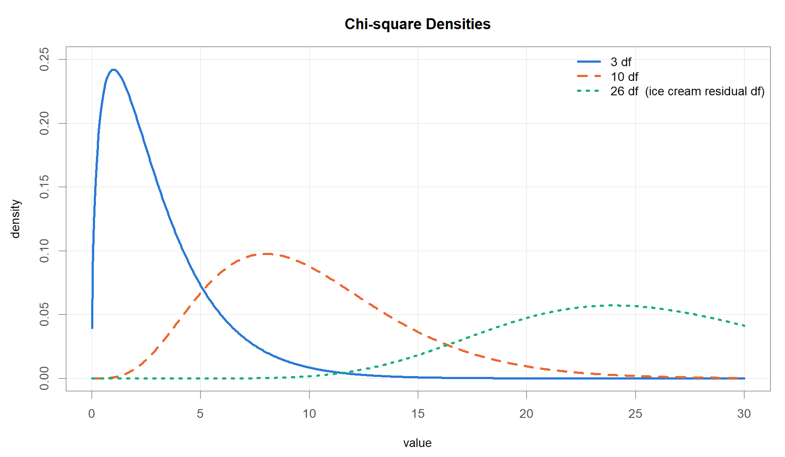{width=100%}
::::

:::: {.column width="44%"}
> 서로 독립인 표준정규 확률변수 $Z_1,\dots,Z_\nu$ 의 제곱을 모두 더하면
> $$W=\sum_{i=1}^{\nu}Z_i^{2}$$
> 은 자유도 $\nu$ 의 **카이제곱분포** $\chi^2(\nu)$ 를 따른다.

<ul>
<li>제곱의 합이므로 항상 0 이상</li>
<li>오른쪽 꼬리가 긴 비대칭 분포</li>
<li>$E(W)=\nu$, $\operatorname{Var}(W)=2\nu$</li>
<li>$\nu$ 가 커지면 점차 대칭에 가까워짐</li>
</ul>
::::

:::

::: {.callout-tip appearance="minimal"}
**회귀에서의 쓰임** · **흩어진 정도를 재는 양**의 분포. 잔차제곱합을 오차분산으로 나누면

$$\frac{\mathrm{SSE}}{\sigma^2}\sim\chi^2(n-p-1)$$

아이스크림 완전모형은 $\chi^2(26)$. 다음 두 분포가 모두 여기서 만들어짐
:::

::: notes
정규분포 다음으로 챙길 도구는 카이제곱분포입니다. 만드는 법이 단순합니다. 표준정규분포에서 뽑은 값을 제곱해서 더한다. 그것이 전부입니다. 제곱해서 더했으니 음수가 나올 수 없습니다. 그래서 그림처럼 0에서 시작해 오른쪽으로 늘어진 모양이 됩니다. 몇 개를 더했느냐가 자유도입니다. 평균이 곧 자유도라는 점도 기억해 두시면 편합니다. 자유도 26짜리 초록 곡선을 보십시오. 봉우리가 26 근처에 있고 모양도 꽤 대칭에 가까워졌습니다. 이 분포가 회귀에서 어디에 쓰이느냐. 아래 상자를 봐 주십시오. 잔차제곱합입니다. 잔차를 제곱해서 더한 양이니 만드는 방식이 정확히 같습니다. 오차분산으로 나누어 눈금을 맞추면 자유도 26짜리 카이제곱을 따릅니다. 왜 이것이 중요한가. 다음에 볼 t분포와 F분포가 전부 카이제곱을 재료로 만들어지기 때문입니다. 흩어짐을 재는 자가 바로 이 분포입니다.
:::

## t분포 {.smaller}

### <i class="fa-solid fa-bullseye"></i> 정의

::: columns

:::: {.column width="58%"}
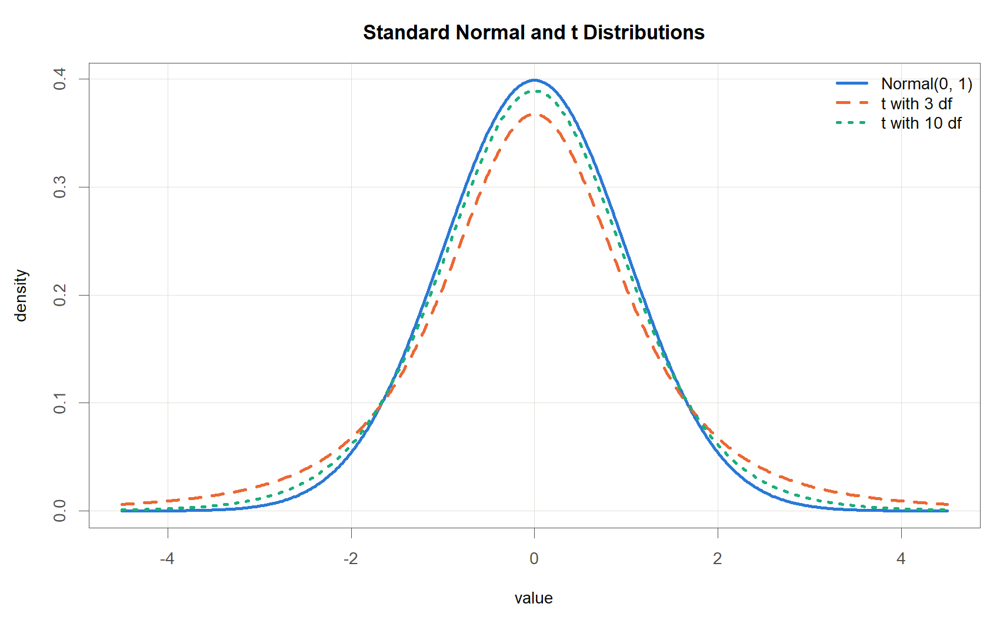{width=100%}
::::

:::: {.column width="42%"}
> $\sigma$를 모른 채 표본표준편차 $s$로 대신하면
> $$T=\frac{\bar X-\mu}{s/\sqrt{n}}$$
> 는 자유도 $n-1$의 **t분포**를 따른다.

<ul>
<li>정규분포보다 봉우리가 낮고 꼬리가 두꺼움</li>
<li>$\sigma$를 추정하는 불확실성이 더해졌기 때문임</li>
<li>자유도가 커지면 정규분포에 가까워짐</li>
</ul>
::::

:::

<ul>
<li><b>자유도</b> = 분산을 추정하는 데 쓸 수 있는 독립인 정보의 개수</li>
<li>자유도가 클수록 $s$가 $\sigma$에 가까워지므로 t분포는 $N(0,1)$에 수렴</li>
<li>양측 2.5% 임계값: 자유도 3에서 3.182, 자유도 10에서 2.228, 자유도 28에서 2.048, 정규분포는 1.960</li>
</ul>

::: {.callout-tip appearance="minimal"}
**회귀에서의 쓰임** · 계수 검정에 자유도 $n-(p+1)$의 t분포. 아이스크림 자료의 단순회귀는 $30-2=28$
:::

::: notes
t분포는 정규분포의 사촌쯤 됩니다. 왜 따로 필요할까요. 표준오차를 계산하려면 시그마가 있어야 하는데, 우리는 시그마를 모릅니다. 그래서 자료에서 추정한 s를 대신 넣습니다. 그런데 s 자체가 표본마다 흔들립니다. 불확실성이 하나 더 얹힌 것입니다. 그 대가로 꼬리가 두꺼워집니다. 그림에서 확인해 보십시오. 주황 점선이 자유도 3, 초록 점선이 자유도 10입니다. 자유도 3짜리는 봉우리가 눈에 띄게 낮고 양쪽 끝이 두툼합니다. 자유도 10은 벌써 파란 정규분포에 꽤 붙었습니다. 꼬리가 두껍다는 것은 극단적인 값이 나올 확률을 더 넉넉히 인정한다는 뜻입니다. t분포가 정규분포보다 조심스럽다고 이해하시면 됩니다. 자유도라는 말은 낯설 것입니다. 흩어진 정도를 재는 데 실제로 쓸 수 있는 정보가 몇 개냐로 생각하시면 됩니다.
:::

## F분포 {.smaller}

### <i class="fa-solid fa-bullseye"></i> 정의

::: columns

:::: {.column width="56%"}
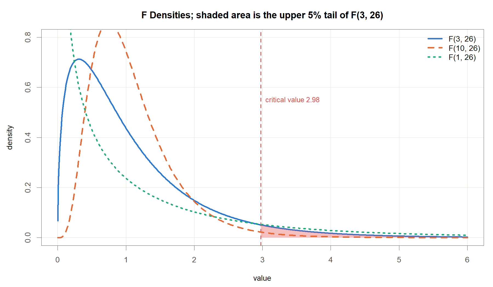{width=100%}
::::

:::: {.column width="44%"}
> 서로 독립인 두 카이제곱 $W_1\sim\chi^2(\nu_1)$, $W_2\sim\chi^2(\nu_2)$ 를 각자의 자유도로 나눈 뒤 비를 취하면
> $$F=\frac{W_1/\nu_1}{W_2/\nu_2}$$
> 은 자유도 $(\nu_1,\nu_2)$ 의 **F분포** 를 따른다.

<ul>
<li>두 분산의 비이므로 항상 0 이상</li>
<li>분자 쪽이 클수록 $F$ 가 커지므로 검정은 <b>오른쪽 꼬리만</b> 봄</li>
<li>$\nu_1=1$ 이면 $F(1,\nu_2)=\{t(\nu_2)\}^2$</li>
</ul>
::::

:::

::: {.callout-tip appearance="minimal"}
**회귀에서의 쓰임** · **두 분산 추정값의 비**. 모형이 설명한 몫과 남은 몫을 각자의 자유도로 나누어 견줌

$$F=\frac{\mathrm{SSR}/p}{\mathrm{SSE}/(n-p-1)}\sim F(p,\;n-p-1)$$

아이스크림 완전모형은 $F(3,26)$ 이고, 유의수준 5%의 기각역은 $F>2.98$
:::

::: notes
마지막 도구는 F분포입니다. 만드는 법은 카이제곱 두 개를 각자의 자유도로 나눈 뒤 비를 취하는 것입니다. 왜 비를 취할까요. 흩어짐 두 개를 견주기 위해서입니다. 어느 쪽이 더 큰가를 묻는 것이 F의 본업입니다. 여기서 t분포와 결정적으로 다른 점이 나옵니다. t는 양수와 음수를 모두 가지니 양쪽 꼬리를 봤습니다. F는 비이므로 음수가 없습니다. 분자가 분모보다 크면 클수록 값이 커집니다. 그래서 오른쪽 한쪽 꼬리만 봅니다. 그림의 빨간 영역이 자유도 3과 26짜리 F분포의 위쪽 5퍼센트이고, 경계값이 2.98입니다. 관측된 F가 이 선을 넘으면 기각합니다. 초록 점선도 봐 주십시오. 분자 자유도가 1인 경우인데, 이 분포는 t분포를 제곱한 것과 정확히 같습니다. 뒤에서 단순회귀의 t값 6.50을 제곱하면 F값이 그대로 나오는 것을 직접 확인하시게 됩니다. 회귀에서의 쓰임은 아래 상자에 있습니다. 설명한 몫과 남은 몫의 비. 이것이 다음 장의 분산분석표입니다.
:::

## 가설검정의 논리 {.smaller}

### <i class="fa-solid fa-bullseye"></i> 정의

> **귀무가설** $H_0$ : 반증되기 전까지 참이라고 두는 기본 가정. 보통 "효과가 없다", "차이가 없다" 쪽에 놓는다.
>
> **대립가설** $H_1$ : 자료로 입증하고자 하는 주장. 보통 "효과가 있다" 쪽이다.

### <i class="fa-solid fa-list-check"></i> 절차

<ol>
<li>$H_0$와 $H_1$을 자료를 보기 전에 확정</li>
<li>자료에서 검정통계량을 계산(예: $T=(\bar X-\mu_0)/(s/\sqrt{n})$)</li>
<li>$H_0$가 참일 때 그 통계량이 따르는 분포를 확인(예: 자유도 $n-1$의 t분포)</li>
<li>관측된 통계량이 그 분포에서 얼마나 드문 값인지를 측정</li>
</ol>

검정의 결론은 $H_0$의 **기각** 또는 **기각하지 못함** 두 가지뿐. "$H_0$를 채택한다"는 표현은 쓰지 않음

::: {.callout-tip appearance="minimal"}
**회귀에서의 쓰임** · 각 설명변수마다 $H_0:\beta_j=0$(그 변수의 기여가 없음) 대 $H_1:\beta_j\neq 0$의 검정
:::

::: notes
가설검정은 형사재판과 구조가 같습니다. 재판에서는 피고인을 일단 무죄로 놓습니다. 그것이 귀무가설입니다. 검사가 증거를 쌓아서 무죄라고 보기에는 너무 이상하다는 점을 보이면 유죄 판결이 납니다. 통계도 같습니다. 먼저 효과가 없다고 가정해 놓고, 그 가정 아래에서 지금 자료가 얼마나 이상한지를 잽니다. 순서가 중요합니다. 자료를 본 다음에 가설을 세우면 반칙입니다. 결론 표현에도 주의하셔야 합니다. 무죄 판결은 결백의 증명이 아니라 유죄를 입증하지 못했다는 뜻입니다. 마찬가지로 우리는 귀무가설을 기각하지 못했다까지만 말합니다. 효과가 없음을 증명했다고는 말하지 않습니다. 이 구분이 다음 슬라이드에서 아주 중요해집니다.
:::

## p-value: 정의 {.smaller}

### <i class="fa-solid fa-bullseye"></i> 꼬리 넓이로 읽는다

::: columns

:::: {.column width="58%"}
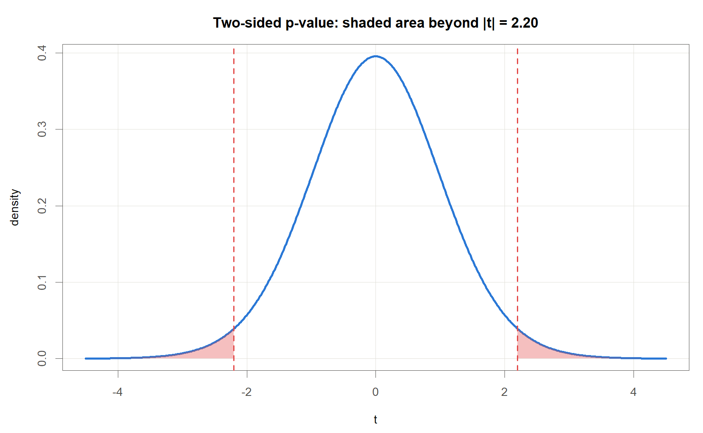{width=100%}
::::

:::: {.column width="42%"}
> **p-value** : 귀무가설이 참이라고 가정할 때, 실제로 관측된 것만큼 또는 그보다 더 극단적인 결과가 나올 확률.

$$
p=P\left(|T|\ge 2.20 \mid H_0\right)=0.0362
$$

여기서 $T$: 자유도 28의 t분포를 따르는 검정통계량. 계산은 `2 * pt(-2.20, 28) = 0.0362`
::::

:::

p가 작다 = 관측된 자료가 $H_0$ 아래에서 보기 드문 결과. 이때 $H_0$를 기각. 관례적 기준 $\alpha=0.05$는 학문 공동체의 약속일 뿐 자연법칙이 아님

::: {.callout-tip appearance="minimal"}
**회귀에서의 쓰임** · 계수표의 p-value 열이 각 계수에 대한 이 확률
:::

::: notes
p-value를 그림 하나로 이해해 보겠습니다. 귀무가설이 참이라면 검정통계량은 저 파란 종 모양 안에서 움직여야 합니다. 대부분 0 근처입니다. 그런데 우리가 실제로 얻은 값이 2.20이었습니다. 빨간 점선 자리입니다. 이 값보다 더 바깥으로 나갈 확률이 얼마인가. 그 분홍색 넓이가 p-value입니다. 양쪽을 다 재는 이유는 방향을 미리 정하지 않았기 때문입니다. 여기서는 0.0362, 약 3.6퍼센트. 귀무가설이 맞다면 이런 자료는 백 번에 서너 번 나오는 셈입니다. 드무니까 귀무가설을 의심합니다. 0.05라는 기준은 어디서 왔을까요. 자연법칙이 아닙니다. 스무 번에 한 번 정도면 드물다고 치자는 관습입니다. 그래서 다음 슬라이드가 필요합니다.
:::

## p-value: 해석의 함정 {.smaller}

### <i class="fa-solid fa-triangle-exclamation"></i> 네 가지 오독

::: {.callout-warning appearance="minimal"}
**p-value가 아닌 것**

<ol>
<li>**p는 귀무가설이 참일 확률이 아님.** $H_0$가 참이라는 조건을 붙이고 계산한 자료 쪽의 확률. 조건과 결론을 맞바꾸어 읽으면 안 됨</li>
<li>**p가 크다고 효과 없음이 증명되지는 않음.** 표본이 작거나 측정오차가 크면 실재하는 효과도 드러나지 않음. 증거 없음 $\neq$ 없음의 증거</li>
<li>**통계적 유의성 $\neq$ 실질적 중요성.** $n$이 매우 크면 실무적으로 무시할 만한 차이도 유의해짐. 효과의 크기를 함께 볼 것</li>
<li>**p = 0.049와 p = 0.051 사이에 질적 차이 없음.** 0.05는 연속적인 증거의 강도에 그은 임의의 선</li>
</ol>
:::

따라서 p-value는 추정값의 크기, 표준오차, 신뢰구간과 **함께** 보고할 것

::: {.aside}
American Statistical Association (2016), *Statement on Statistical Significance and P-Values*, The American Statistician 70(2), 129-133.
:::

::: notes
이 슬라이드가 오늘 전체에서 가장 중요할 수도 있습니다. p-value만큼 널리 쓰이면서 널리 오해받는 숫자가 없습니다. 첫째, p는 귀무가설이 참일 확률이 아닙니다. 방향이 반대입니다. 귀무가설이 참이라고 치고 계산한 자료 쪽의 확률입니다. 둘째, p가 크게 나왔다고 효과가 없다고 결론 내리시면 안 됩니다. 자료가 부족해서 못 본 것일 수도 있습니다. 어두운 방에서 아무것도 못 봤다고 방이 비었다고 말할 수는 없습니다. 셋째, 유의하다와 중요하다는 다른 말입니다. 자료를 십만 개 모으면 아무 의미 없는 0.001의 차이에도 별표가 세 개 붙습니다. 넷째, 0.049와 0.051 사이에 무슨 일이 벌어지지는 않습니다. 그러니 p 하나만 보고하지 마시고 추정값과 신뢰구간을 함께 보여 주십시오. 미국통계학회가 2016년에 공식 성명까지 낸 사안입니다.
:::

## 신뢰구간 {.smaller}

### <i class="fa-solid fa-bullseye"></i> 정의

> **95% 신뢰구간** : 같은 절차로 표본 추출과 구간 계산을 반복했을 때, 만들어진 구간들 가운데 약 95%가 참값을 포함하도록 설계된 구간.

$$
\hat\theta \pm t_{0.975,\;\nu}\times \operatorname{SE}(\hat\theta)
$$

여기서 $\hat\theta$: 관심 모수의 추정값, $\operatorname{SE}(\hat\theta)$: 그 표준오차, $t_{0.975,\nu}$: 자유도 $\nu$인 t분포의 상위 2.5% 지점(자유도 28이면 2.048)

::: {.callout-warning appearance="minimal"}
**주의**

<ul>
<li>확률은 **구간**에 붙지 참값에 붙지 않음. 참값은 고정된 미지의 상수이며 구간이 표본마다 움직임</li>
<li>"이 구간 안에 참값이 있을 확률이 95%"는 잘못된 서술임</li>
<li>구간이 좁으면 정밀한 추정, 넓으면 정보가 부족한 추정임</li>
</ul>
:::

95% 신뢰구간이 0을 포함하지 않는 것과 양측 검정의 $p<0.05$는 동일한 판정

::: notes
신뢰구간은 p-value보다 담고 있는 정보가 많습니다. 값이 어느 범위에 있을 법한지를 폭으로 보여 주기 때문입니다. 그런데 뜻을 정확히 말하기가 은근히 까다롭습니다. 흔한 오해부터 짚겠습니다. 이 구간에 참값이 있을 확률이 95퍼센트다. 틀린 문장입니다. 참값은 이미 정해진 하나의 숫자입니다. 흔들리는 것은 참값이 아니라 우리가 만든 구간입니다. 그물 던지기를 떠올려 보십시오. 물고기는 한 자리에 가만히 있고, 우리가 그물을 던집니다. 백 번 던지면 아흔다섯 번쯤 잡히도록 그물 크기를 맞춘 것. 그것이 95퍼센트 신뢰구간입니다. 지금 이 한 번의 던지기가 성공했는지는 알 수 없습니다. 마지막으로 실용적인 요령 하나. 95퍼센트 구간이 0을 걸치지 않으면 양측 p가 0.05보다 작습니다. 둘은 같은 판정입니다.
:::

## 이 장의 정리

### <i class="fa-solid fa-list-check"></i> Preliminary Knowledge

:::{style="font-size: 90%"}
<ul>
<li>행렬 표기: $n$개의 식을 $\mathbf{y}=\mathbf{X}\boldsymbol{\beta}+\boldsymbol{\varepsilon}$ 한 줄로 압축. $\mathbf{X}$의 1열은 절편의 자리</li>
<li>새로 배운 연산은 전치 $\mathbf{X}^\top$ 와 역행렬 $\mathbf{A}^{-1}$ 두 가지</li>
<li>최소제곱추정량 $\hat{\boldsymbol{\beta}}=(\mathbf{X}^\top\mathbf{X})^{-1}\mathbf{X}^\top\mathbf{y}$. 이후 모든 장이 이 한 줄의 특수한 경우</li>
<li>정규분포 $N(\mu,\sigma^2)$, 68-95-99.7 규칙. 회귀에서는 오차 $\varepsilon_i$ 의 가정</li>
<li>표집분포와 표준오차 $\sigma/\sqrt{n}$. 회귀에서는 계수표의 표준오차 열</li>
<li>정규분포에서 만들어지는 세 분포: $\chi^2$(제곱합), $t$(평균의 검정), $F$(두 분산의 비)</li>
<li>t분포(자유도 $n-(p+1)$)로 계수 검정, F분포 $F(p,\,n-p-1)$ 로 모형 전체 검정</li>
<li>p-value와 신뢰구간. 회귀에서는 계수 검정과 구간추정</li>
</ul>
:::

::: notes
연장통 정리를 마치겠습니다. 앞쪽에서는 서른 줄짜리 식을 한 줄로 줄이는 법을 배웠습니다. 새로 익힌 계산은 전치와 역행렬 두 개뿐이었습니다. 그리고 이 강의 전체의 주인공인 최소제곱 공식을 미리 보았습니다. 앞으로 나올 단순회귀, 다중회귀, 가변수회귀가 전부 그 한 줄의 특수한 경우입니다. 뒤쪽에서는 확률 쪽 도구를 챙겼습니다. 정규분포는 오차에 대한 가정으로, 표준오차는 계수가 얼마나 흔들리는지를 재는 자로 쓰입니다. 그다음 세 분포는 모두 정규분포에서 만들어집니다. 제곱해서 더하면 카이제곱, 시그마 대신 s를 넣으면 t, 카이제곱 두 개의 비를 취하면 F입니다. t는 계수 하나를 검정할 때, F는 모형 전체를 한꺼번에 검정할 때 씁니다. p-value와 신뢰구간은 그 결과를 보고하는 장치입니다. 각 슬라이드 끝에 회귀에서의 쓰임을 한 줄씩 붙여 둔 이유가 여기에 있습니다. 다음 장부터 이 도구들을 실제로 꺼내 쓰겠습니다. 설명변수 하나짜리 직선부터 시작합니다.
:::

# Simple Linear Regression

::: notes
이제 직선을 하나 그어 보겠습니다. 그 전에 물어볼 것이 하나 있습니다. 두 변수가 서로 관련이 있다는 말을 숫자로 어떻게 옮길까요. 이번 장은 그 숫자, 공분산과 상관계수에서 출발합니다. 그다음에 직선을 긋고, 그 직선이 쓸 만한지 따져 보는 순서로 가겠습니다. 눈여겨볼 대목은 앞부분의 상관계수와 뒷부분의 회귀 기울기가 사실 같은 이야기의 두 얼굴이라는 점입니다. 오늘 그것을 숫자로 직접 확인해 보겠습니다. 예제는 아이스크림 소비량 자료 하나로 끝까지 밀고 가겠습니다.
:::

## 두 변수 간 관계 측정

### <i class="fa-solid fa-question"></i> 두 변수 간 관계를 어떻게 재는가?

::: {.callout-note appearance="minimal"}
두 변수 사이의 관계는 **방향**과 **강도** 두 가지로 요약
:::

::: {.callout-tip appearance="minimal"}
<ul>
<li><b>방향</b>: $x$가 커질 때 $y$도 커지는가(양의 연관성), 반대로 작아지는가(음의 연관성)</li>
<li><b>강도</b>: 그 경향이 얼마나 또렷한가</li>
<li>재는 방법은 여럿이나, 이 강의에서는 Pearson의 공분산과 상관계수를 씀</li>
</ul>
:::

### <i class="fa-solid fa-bullseye"></i> 표기

> 관측 $n$개가 짝을 이루어 $(x_1,y_1),\dots,(x_n,y_n)$ 로 주어진다.
>
> $$\bar y=\frac{1}{n}\sum_{i=1}^{n} y_i,\qquad \bar x=\frac{1}{n}\sum_{i=1}^{n} x_i$$

여기서 $y_i$는 $i$번째 관측의 반응변수, $x_i$는 같은 관측의 설명변수, $n$은 관측 수, $\bar y$와 $\bar x$는 표본평균(값을 모두 더해 개수로 나눈 값)임.

::: {.callout-tip appearance="minimal"}
숫자 요약보다 **산점도**(관측 하나를 가로축 $x$, 세로축 $y$의 점 하나로 찍은 그림)를 먼저 볼 것
:::

::: notes
관계를 잰다고 할 때 우리가 알고 싶은 것은 두 가지입니다. 어느 쪽으로 가느냐, 그리고 얼마나 뚜렷하냐. 키와 몸무게는 같이 커집니다. 반대로 자동차 무게가 늘면 연비는 떨어집니다. 이것이 방향입니다. 강도는 그 경향이 점들 사이에서 얼마나 또렷하게 보이느냐의 문제입니다. 표기는 어렵지 않습니다. 관측 하나가 $x$와 $y$ 한 쌍이고, 그런 쌍이 $n$개 있습니다. 평균은 다 더해서 개수로 나눈 값, 초등학교에서 배운 그대로입니다. 한 가지만 부탁드리겠습니다. 숫자를 계산하기 전에 그림부터 그려 보십시오. 왜 그런지는 몇 장 뒤에 극적인 예로 보여 드리겠습니다.
:::

## 공분산의 착안: 편차를 곱해 보면 {.smaller}

### <i class="fa-solid fa-chart-line"></i> 점이 어느 사분면에 몰리는가

{width=100%}

:::: {.columns}

::: {.column width="40%"}

| Quadrant | $y_i-\bar y$ | $x_i-\bar x$ | Product |
|:--|:--:|:--:|:--:|
| 1 (upper right) | $+$ | $+$ | $+$ |
| 2 (upper left)  | $+$ | $-$ | $-$ |
| 3 (lower left)  | $-$ | $-$ | $+$ |
| 4 (lower right) | $-$ | $+$ | $-$ |

: Sign of the deviation product in each quadrant

:::

::: {.column width="60%"}

::: {.callout-tip appearance="minimal"}
**부호의 논리**

<ul>
<li>두 평균선이 평면을 넷으로 나눔</li>
<li>점 하나마다 두 편차를 곱하면 칸마다 부호가 정해짐</li>
<li>그림의 파란 $+$, 주황 $-$ 가 이 표의 마지막 열</li>
<li>두 그림에서 부호 배치는 <b>동일</b>. 다른 것은 점이 몰린 칸뿐</li>
</ul>
:::

:::

::::

::: notes
식을 적기 전에 그림부터 보겠습니다. 앞 장에서 말씀드린 대로입니다. 두 그림 모두 붉은 점선이 평균선입니다. 가로 평균선과 세로 평균선을 그으면 평면이 네 칸으로 갈립니다. 이제 점 하나를 잡고 두 가지를 재 보겠습니다. 이 점의 $x$ 가 평균에서 얼마나 벗어났나, 그리고 $y$ 가 평균에서 얼마나 벗어났나. 이 두 값을 곱하면 어떻게 될까요. 오른쪽 위 칸에서는 둘 다 평균보다 크니 양수 곱하기 양수, 결과는 양수입니다. 왼쪽 아래 칸은 음수 곱하기 음수라 역시 양수입니다. 반대로 왼쪽 위와 오른쪽 아래는 부호가 엇갈려 음수가 됩니다. 칸에 붙은 파란 플러스와 주황 마이너스가 그것입니다. 두 그림에서 부호 배치는 똑같다는 점을 눈여겨봐 주십시오. 달라지는 것은 점이 어느 칸에 몰려 있느냐뿐입니다. 왼쪽에서는 점들이 플러스 칸을 따라 대각선으로 늘어서 있으니 곱을 다 더하면 양수가 됩니다. 오른쪽은 정반대라 합이 음수가 됩니다. 곱셈 하나가 이 점은 같이 움직이는 쪽인가 엇갈리는 쪽인가를 자동으로 판정해 주는 셈입니다. 아래 표가 네 칸의 부호를 정리한 것입니다. 첫째 열이 칸 번호, 가운데 두 열이 각 편차의 부호, 마지막 열이 그 둘을 곱한 부호입니다. 그림의 파란 플러스와 주황 마이너스가 바로 이 마지막 열입니다. 그러면 이 아이디어를 식으로 적어 보겠습니다.
:::

## 공분산: 정의

### <i class="fa-solid fa-bullseye"></i> 앞 장의 관찰을 식 하나로

:::: {.columns}

::: {.column width="50%"}

::: {.callout-tip appearance="minimal"}
**양의 연관성**

<ul>
<li>1, 3사분면에 점이 많음</li>
<li>두 편차의 <b>곱이 양수</b>인 칸들</li>
<li>모두 더하면 <b>양수</b></li>
</ul>
:::

:::

::: {.column width="50%"}

::: {.callout-tip appearance="minimal"}
**음의 연관성**

<ul>
<li>2, 4사분면에 점이 많음</li>
<li>두 편차의 <b>곱이 음수</b>인 칸들</li>
<li>모두 더하면 <b>음수</b></li>
</ul>
:::

:::

::::

> **공분산(covariance)**
>
> $$\operatorname{cov}(y,x)=\frac{1}{n-1}\sum_{i=1}^{n}(y_i-\bar y)(x_i-\bar x)$$

::: {.callout-note appearance="minimal"}
<ul>
<li>$(y_i-\bar y)$ : $y$ 가 평균에서 떨어진 거리, $(x_i-\bar x)$ : $x$ 가 평균에서 떨어진 거리</li>
<li>두 편차의 곱을 모두 더해 $n-1$ 로 나눔. 모집단 공분산과 구별하여 <b>표본공분산</b>이라 부름</li>
</ul>
:::

::: notes
위쪽 두 상자가 앞 장에서 눈으로 확인한 내용입니다. 왼쪽 그림처럼 점이 1, 3사분면에 몰리면 곱이 양수인 항이 많아 합이 양수가 되고, 오른쪽 그림처럼 2, 4사분면에 몰리면 합이 음수가 됩니다. 그러면 이 합을 그대로 적으면 되겠습니다. 그것이 가운데 식입니다. 각 점마다 $y$가 평균에서 얼마나 벗어났나와 $x$가 평균에서 얼마나 벗어났나를 곱합니다. 그것을 전부 더한 다음 $n$ 빼기 1로 나눕니다. 그림에서 눈으로 세었던 것을 숫자 하나로 만든 것뿐입니다. 곱셈 하나가 이 점은 같이 움직이는 쪽인가 엇갈리는 쪽인가를 자동으로 판정해 주는 셈입니다. 앞 장 그림의 파란 플러스와 주황 마이너스가 표의 마지막 열 그대로입니다. 공분산의 부호는 점들이 어느 대각선 위에 앉아 있는가를 숫자 하나로 요약한 것입니다.
:::

## 공분산의 한계와 표준화

### <i class="fa-solid fa-triangle-exclamation"></i> 주의: 측정 단위에 따라 값이 달라진다

> 상수 $a,b,c,d$에 대해 $\operatorname{cov}(ay+b,\;cx+d)=ac\,\operatorname{cov}(y,x)$ 가 성립한다.

$y$의 단위를 바꾸어 값에 $a$를 곱하면 공분산도 $a$배. 키를 cm로 재느냐 inch로 재느냐에 따라 연관성의 크기가 달라진다면 곤란함. 공분산은 **부호는 믿을 수 있으나 크기는 단위에 좌우**되는 척도임

### <i class="fa-solid fa-pen-to-square"></i> 해결: 표준화

$$z_i=\frac{y_i-\bar y}{s_y},\qquad s_y=\sqrt{\frac{1}{n-1}\sum_{i=1}^{n}(y_i-\bar y)^2}$$

여기서 $s_y$: 표본표준편차(자료가 평균에서 떨어진 정도를 대표하는 값, 원자료와 단위가 같음), $z_i$: 표준화된 값. 편차를 흩어짐의 크기로 나누면 단위가 사라지고 $\bar z=0$, $s_z=1$

::: notes
공분산에는 불편한 점이 하나 있습니다. 단위를 바꾸면 값이 따라 바뀝니다. 아버지와 아들의 키가 얼마나 닮았는지를 재는데 센티미터로 재면 크게 나오고 인치로 재면 작게 나온다면 이상하지 않습니까. 닮은 정도가 자를 바꾼다고 달라질 리는 없습니다. 그래서 표준화를 합니다. 각 값에서 평균을 빼고, 흩어짐의 크기인 표준편차로 나눕니다. 시험 점수로 생각해 보십시오. 원점수 80점이 잘한 것인지 못한 것인지는 반 평균과 성적 분포를 알아야 판단이 됩니다. 표준화는 평균에서 표준편차 몇 개만큼 떨어져 있나로 바꿔 말하는 작업입니다. 이렇게 만든 값은 단위가 없어서 어느 자로 재든 똑같습니다. 이 표준화를 공분산에 적용한 것이 다음 슬라이드의 상관계수입니다.
:::

## 상관계수: 정의와 성질

### <i class="fa-solid fa-bullseye"></i> 표준화한 공분산

> $$r=\operatorname{corr}(y,x)=\frac{1}{n-1}\sum_{i=1}^{n}\left(\frac{y_i-\bar y}{s_y}\right)\left(\frac{x_i-\bar x}{s_x}\right)=\frac{\operatorname{cov}(y,x)}{s_y\,s_x}$$

여기서 $s_y$, $s_x$: 각각 $y$와 $x$의 표본표준편차. 표준화한 두 변수의 공분산이 곧 상관계수이며, 모집단 상관계수와 구별하여 **표본상관계수**라 부름

### <i class="fa-solid fa-lightbulb"></i> 성질

::: {.callout-tip appearance="minimal"}
<ul>
<li>측정 단위를 바꾸어도 값이 변하지 않음: $\operatorname{corr}(ay+b,\;cx+d)=\operatorname{corr}(y,x)$ ($ac>0$)</li>
<li>$-1\le r\le 1$ (Cauchy-Schwarz 부등식)</li>
<li>부호는 방향, 절댓값은 강도. $1$ 또는 $-1$에 가까울수록 강한 <b>선형</b>관계</li>
<li>$\operatorname{corr}(y,x)=\operatorname{corr}(x,y)$ : 두 변수의 역할 구분이 없음</li>
</ul>
:::

::: notes
상관계수는 공분산을 두 표준편차로 나눈 값입니다. 표준화한 두 변수의 공분산이라고 말해도 같은 뜻입니다. 나눗셈 한 번으로 단위가 사라집니다. cm로 재든 inch로 재든 값이 똑같아집니다. 그리고 편리한 성질이 하나 붙습니다. 값이 반드시 마이너스 1과 1 사이에 들어온다는 것. 그러니 0.8이라는 숫자를 보면 꽤 강하구나 하고 바로 감이 옵니다. 공분산은 값을 봐도 큰 것인지 작은 것인지 알 수 없었습니다. 마지막 성질도 짚고 넘어가겠습니다. 상관계수는 $x$와 $y$를 대칭으로 다룹니다. 누가 원인이고 누가 결과인지 구분하지 않습니다. 원인과 결과를 나누어 쓰고 싶으면 회귀분석으로 넘어가야 합니다.
:::

## 상관계수: $r=0$ 의 함정

### <i class="fa-solid fa-triangle-exclamation"></i> $r=0$ 이 무관을 뜻하지는 않는다

:::: {.columns}

::: {.column width="58%"}
{width=100%}
:::

::: {.column width="42%"}

> $y=50-x^2$ 는 $x$가 정해지면 $y$가 완전히 결정되는 관계이나, 표본상관계수는 $r=0$ 이다.

::: {.callout-tip appearance="minimal"}
<ul>
<li>상관계수는 <b>선형</b> 연관성만 재는 척도임</li>
<li>$r=0$ 은 "선형관계가 없다"는 뜻이지 "관계가 없다"는 뜻이 아님</li>
<li>따라서 숫자보다 산점도를 먼저 볼 것</li>
</ul>
:::

:::

::::

::: notes
이 그림이 오늘 가장 인상적인 장면일지도 모르겠습니다. 점들이 완벽한 포물선 위에 놓여 있습니다. $x$를 알면 $y$가 오차 하나 없이 결정됩니다. 이보다 더 강한 관계가 있을까요. 그런데 상관계수를 계산하면 0이 나옵니다. 이유는 단순합니다. 왼쪽 절반에서는 $x$가 커질수록 $y$도 커지고, 오른쪽 절반에서는 반대입니다. 양쪽이 정확히 상쇄되어 버립니다. 상관계수는 직선 관계만 잡아내는 도구라서 곡선 앞에서는 눈을 감아 버립니다. 계산기부터 두드리지 말라고 말씀드린 이유가 여기에 있습니다. 이 자료에서 $r$이 0이니 관계가 없다고 보고했다면 어떻게 됐을까요. 완전히 틀린 결론입니다. 그림 한 장이면 3초 만에 알 수 있는 사실입니다.
:::

## 예제 자료: 아이스크림 소비량 {.smaller}

### <i class="fa-solid fa-table"></i> 자료 구조

:::: {.columns}

::: {.column width="52%"}

| period | IC | price | income | temp | year |
|---:|---:|---:|---:|---:|---:|
| 1 | 0.386 | 0.270 | 78 | 41 | 0 |
| 2 | 0.374 | 0.282 | 79 | 56 | 0 |
| 3 | 0.393 | 0.277 | 81 | 63 | 0 |
| 4 | 0.425 | 0.280 | 80 | 68 | 0 |
| 5 | 0.406 | 0.272 | 76 | 69 | 0 |

: First five of n = 30 four-week periods; 6 variables in total

:::

::: {.column width="48%"}

| Variable | Meaning |
|:--|:--|
| period | Observation index (four-week period) |
| IC | Per-capita ice cream consumption (pints) |
| price | Price of ice cream |
| income | Income |
| temp | Mean temperature (°F) |
| year | Observation year code (0/1/2) |

: Variables of the ice cream data

:::

::::

한 행은 4주 기간 하나이며, 총 $n=30$개 기간. 이 장에서 쓰는 변수는 $y_i=$ IC, $x_i=$ temp 두 개

::: notes
자료를 다시 펼쳐 보겠습니다. 아이스크림 판매 기록이고, 한 줄이 4주짜리 기간 하나입니다. 하루도 아니고 사람 한 명도 아닙니다. 이런 분석 단위 확인이 의외로 중요하니 습관을 들여 주십시오. 왼쪽 표가 앞 다섯 줄이고, 실제로는 서른 줄까지 이어집니다. 변수는 여섯 개인데 이 장에서 쓸 것은 소비량과 온도 둘입니다. 가격과 소득은 다음 장에서 함께 넣어 보겠습니다. 맨 오른쪽 year는 헷갈리기 쉬운 변수입니다. 계절이 아니라 몇 번째 해에 관측했는지를 0, 1, 2로 적어 둔 값입니다. 가변수 장에서 다시 꺼내 쓰겠습니다. 온도 단위가 화씨라는 점도 기억해 두시면 나중에 계수를 읽을 때 편합니다.
:::

## 아이스크림 자료: 공분산과 상관계수 {.smaller}

### <i class="fa-solid fa-table"></i> 실제 수치로 확인

| Statistic | temp ($x$) | IC ($y$) |
|:--|--:|--:|
| Mean | 49.1 | 0.359 |
| Standard deviation | 16.4 | 0.0658 |

: Summary statistics of the two variables used in this chapter (n = 30)

$$\operatorname{cov}(y,x)=0.838,\qquad r=\frac{\operatorname{cov}(y,x)}{s_y\,s_x}=\frac{0.838}{0.0658\times 16.4}=\frac{0.838}{1.08}=0.776$$

::: {.callout-tip appearance="minimal"}
<ul>
<li>부호가 양수이므로 온도가 높은 기간에 소비량도 큼</li>
<li>$r=0.776$ 은 1에 비교적 가까우므로 선형관계가 뚜렷함</li>
<li>공분산 $0.838$ 자체의 크기는 단위에 좌우되므로 강도 판단에 쓰지 않음</li>
</ul>
:::

::: notes
표부터 보겠습니다. 온도는 평균 49도 근처에서 표준편차 16도 정도로 넓게 퍼져 있습니다. 소비량은 평균 0.36에 표준편차 0.066입니다. 두 변수의 눈금 자체가 완전히 다릅니다. 공분산은 0.838이 나왔습니다. 부호가 양수니 온도가 높은 기간에 아이스크림이 더 팔린다는 뜻입니다. 그런데 0.838이 큰 값일까요. 이것만 봐서는 판단할 수 없습니다. 온도를 섭씨로 바꾸는 순간 값이 달라지기 때문입니다. 그래서 두 표준편차로 나눠 상관계수를 만듭니다. 0.776. 이제는 판단이 됩니다. 최대가 1인데 0.78이니 꽤 강한 편입니다. 여기까지가 관계를 재는 이야기였습니다. 이제 직선을 그으러 가겠습니다.
:::

## 단순선형회귀모형

### <i class="fa-solid fa-bullseye"></i> 정의

> $$y_i=\beta_0+\beta_1 x_i+\varepsilon_i,\qquad i=1,\dots,n$$

여기서 $y_i$: 반응변수, $x_i$: 설명변수, $\beta_0$: 절편, $\beta_1$: 기울기, $\varepsilon_i$: 직선으로 설명되지 않는 오차(평균 0, 분산 $\sigma^2$). $\beta_0,\beta_1$ 은 값을 모르지만 고정된 상수이고, $y_i$ 가 흔들리는 원인은 오직 $\varepsilon_i$

### <i class="fa-solid fa-lightbulb"></i> 계수의 뜻

::: {.callout-tip appearance="minimal"}
<ul>
<li>$\beta_1$ (기울기): $x$가 1단위 커질 때 $y$가 <b>평균적으로</b> 변하는 양</li>
<li>$\beta_0$ (절편): $x=0$일 때 예측되는 $y$의 평균</li>
<li>적합된 직선은 조건부 기댓값 $E(y\mid x)=\beta_0+\beta_1x$의 추정이므로, 개별 관측이 아닌 <b>평균</b>에 관한 진술임</li>
<li>$x=0$이 자료 범위 밖이면 절편을 물리적으로 해석하지 않는 편이 안전함</li>
</ul>
:::

::: notes
모형은 두 조각으로 되어 있습니다. 직선 부분, 그리고 오차. $y$는 직선 더하기 오차라고 읽으시면 됩니다. 기울기는 $x$가 1만큼 커질 때 $y$가 평균적으로 얼마나 변하는지를 나타냅니다. 여러분이 하시는 계측기 검교정과 구조가 똑같습니다. 기준 입력을 1단위 올릴 때 지시값이 얼마나 변하는가가 기울기, 입력이 0일 때의 지시값이 절편 곧 영점입니다. 여기서 평균적으로라는 단서를 빼면 안 됩니다. 온도가 60도인 기간이 여러 번 있어도 판매량은 매번 다릅니다. 직선은 그 여러 값의 한가운데를 지나갈 뿐입니다. 그러면 그 직선을 어떻게 고르느냐. 다음 슬라이드입니다.
:::

## 후보 직선 비교: 어떤 직선이 최적인가

### <i class="fa-solid fa-circle-question"></i> 산점도 위에는 직선을 무수히 그을 수 있음

:::: {.columns}

::: {.column width="55%"}
{width=100%}
:::

::: {.column width="45%"}

> **임의의 직선과 잔차**
>
> $$r_i=y_i-(a_0+a_1x_i)$$

여기서 $a_0,a_1$: 아무렇게나 고른 직선의 절편과 기울기, $r_i$: 그 직선에서 $i$번째 점까지의 세로 간격

::: {.callout-tip appearance="minimal"}
<ul>
<li>직선을 하나 정할 때마다 잔차가 $n$개 생김. 좋은 직선은 이 $n$개가 <b>전체적으로 작은</b> 직선</li>
<li>두 직선의 우열을 가리려면 잔차 $n$개를 <b>하나의 수</b>로 요약해야 함. 이 요약값이 <b>기준</b>(criterion)</li>
<li>기준을 정해야 비로소 무수한 후보에 <b>순서</b>가 매겨지고 최적이라는 말이 정의됨</li>
</ul>
:::

:::

::::

::: notes
슬라이드에 점 열 개가 찍혀 있고 그 위로 회색 직선이 잔뜩 지나갑니다. 이 그림이 오늘 질문의 출발점입니다. 같은 산점도 위에 직선은 무수히 그을 수 있습니다. 회색 선은 그중 마흔다섯 개만 그려 본 것이고, 실제로는 절편과 기울기 두 숫자를 아무렇게나 고를 수 있으니 후보가 무한히 많습니다. 그중 초록 점선, 주황 일점쇄선, 파란 실선 세 개만 굵게 표시해 두었습니다. 여기서 질문을 드리겠습니다. 이 셋 중 어느 직선이 가장 좋습니까. 눈으로 보면 파란 선이 나아 보이실 겁니다. 그런데 왜 나은지를 말로 설명하려고 하면 막힙니다. 두 분이 서로 다른 직선을 좋다고 하면 판정할 방법이 없습니다. 그래서 필요한 것이 기준입니다. 빨간 짧은 선분 하나에 알 아이라고 적어 두었습니다. 어떤 직선을 정하면 점마다 이런 세로 간격이 하나씩 생깁니다. 이것이 잔차입니다. 직선이 바뀌면 잔차 열 개가 통째로 바뀝니다. 좋은 직선이란 이 열 개가 전체적으로 작은 직선일 텐데, 문제는 열 개짜리 묶음끼리는 크다 작다를 말할 수 없다는 점입니다. 그래서 열 개를 하나의 숫자로 줄여야 합니다. 그 줄이는 방법이 기준이고, 기준이 정해져야 비로소 모든 직선에 순서가 매겨집니다. 최적이라는 말은 그다음에야 뜻을 갖습니다. 여기서 기호를 하나 구분해 두겠습니다. 지금은 아무 직선이나 이야기하고 있으므로 절편과 기울기를 에이 제로, 에이 원이라 쓰고 간격을 알이라 썼습니다. 뒤에서 최종적으로 고른 직선의 간격은 이 아이라고 따로 부를 것입니다.
:::

## 최소제곱 기준 {.smaller}

### <i class="fa-solid fa-chart-line"></i> 그림으로 보기

:::: {.columns}

::: {.column width="60%"}
{width=100%}
:::

::: {.column width="40%"}

> **잔차** $e_i=y_i-\hat y_i$

여기서 $\hat y_i$: 직선이 예측한 값(적합값), $e_i$: 관측값과 적합값의 수직 간격

> **최소제곱 기준**
>
> $$\min_{\beta_0,\beta_1}\;\sum_{i=1}^{n}\left(y_i-\beta_0-\beta_1x_i\right)^2$$

이 제곱 합을 가장 작게 만드는 직선을 최적 직선으로 정의. 이를 **통상최소제곱법**(Ordinary Least Squares, OLS)이라 부름

:::

::::

::: notes
앞 장에서 남겨 둔 질문에 답할 차례입니다. 무수한 후보 가운데 하나를 고르는 기준을 이제 적어 보겠습니다. 그림의 빨간 수직 선분을 봐 주십시오. 각 점에서 직선까지의 세로 간격, 이것이 잔차입니다. 이 간격들을 제곱해서 전부 더한 값이 가장 작아지는 직선을 쓰기로 약속한 것이 최소제곱법입니다. 산점도 위에 막대기를 올려놓고 각 점과 용수철로 연결했다고 상상해 보십시오. 용수철 에너지는 늘어난 길이의 제곱에 비례합니다. 손을 놓으면 막대기가 흔들리다가 에너지 총합이 최소인 자리에서 멈춥니다. 그 자리가 최소제곱 직선입니다. 왜 하필 제곱이냐는 질문이 자주 나옵니다. 그것만 따로 다음 장에서 숫자로 확인하겠습니다. 수선의 발이 아니라 세로 간격을 쓰는 데도 이유가 있습니다. 우리 목적이 $x$를 알고 $y$를 맞히는 것이라, 틀리는 방향이 언제나 세로 방향이기 때문입니다.
:::

## 기준의 비교: 왜 제곱합인가 {.smaller}

### <i class="fa-solid fa-scale-balanced"></i> 같은 10개 점에 네 직선을 얹고 세 기준으로 채점

:::: {.columns}

::: {.column width="62%"}

| 후보 직선 | 식 | $\sum r_i$ | $\sum\lvert r_i\rvert$ | $\sum r_i^2$ |
|:---|:---|---:|---:|---:|
| A: 양 끝점을 이음 | $-0.0321+0.679x$ | −7.39 | 8.28 | 14.8 |
| B: 평균점을 지나되 완만 | $0.172+0.274x$ | 0.00 | 10.3 | 15.5 |
| C: 절대편차합 최소 | $-0.883+0.833x$ | −2.48 | **6.25** | 10.8 |
| **OLS: 제곱합 최소** | $-0.786+0.685x$ | 0.00 | 7.55 | **9.38** |

: Four candidate lines scored by three criteria on the same 10 points. Bold marks the minimum of each criterion.

::: {.callout-important appearance="minimal"}
<ul>
<li>$\sum r_i$ 는 <b>순서를 매기지 못함</b>. B와 OLS가 모두 0이며, 평균점 $(\bar x,\bar y)$ 를 지나는 직선은 예외 없이 0이므로 무수히 많은 직선이 동점</li>
<li>$\textstyle\sum(y_i-a_0-a_1x_i)=n(\bar y-a_0-a_1\bar x)$ 이므로, $a_0=\bar y-a_1\bar x$ 이면 기울기 $a_1$ 이 무엇이든 합은 0</li>
<li>기준이 바뀌면 답도 바뀜. $\sum\lvert r_i\rvert$ 의 최소는 C, $\sum r_i^2$ 의 최소는 OLS로 <b>서로 다른 직선</b></li>
</ul>
:::

:::

::: {.column width="38%"}
{width=100%}
:::

::::

::: {.callout-note appearance="minimal"}
**제곱합을 표준으로 삼는 근거**

<ul>
<li><b>해가 닫힌 형태로 존재</b>: $S(b)$ 가 $b$ 의 이차함수이자 아래로 볼록이므로 미분해 0으로 놓으면 유일한 최소점을 얻음(다음 장)</li>
<li><b>Gauss-Markov 정리</b>: 오차의 평균이 0이고 등분산·무상관이면, $y$ 의 선형결합으로 만든 불편추정량 가운데 분산이 가장 작음(BLUE)</li>
<li><b>정규오차에서 최대가능도와 일치</b>: $\varepsilon_i\sim N(0,\sigma^2)$ 이면 가능도를 최대화하는 것이 곧 제곱합을 최소화하는 것</li>
<li>다만 $\sum\lvert r_i\rvert$ 기준은 <b>이상점에 덜 민감</b>하여 로버스트 회귀에서 쓰임. 제곱합이 유일한 정답은 아님</li>
</ul>
:::

::: notes
앞 장의 기준을 실제로 적용해 채점표를 만들어 보았습니다. 같은 점 열 개 위에 직선 넷을 얹고 세 가지 기준으로 점수를 매긴 것이 왼쪽 표입니다. 위에서부터 보겠습니다. 첫째 줄 에이는 양 끝점을 그냥 이은 직선, 둘째 줄 비는 평균점을 지나지만 너무 완만한 직선, 셋째 줄 씨는 잠시 뒤에 설명드릴 절대편차 기준의 최적 직선, 마지막이 최소제곱 직선입니다. 셋째 열부터가 채점 결과입니다. 셋째 열은 잔차를 그냥 다 더한 값입니다. 여기서 첫 번째 교훈이 나옵니다. 비와 최소제곱이 똑같이 영입니다. 두 직선의 생김새는 전혀 다른데 점수가 같습니다. 이러면 순서를 매길 수가 없습니다. 우연이 아닙니다. 상자 둘째 줄에 한 줄로 적어 두었는데, 잔차의 합은 엔 곱하기 와이 평균 빼기 에이 제로 빼기 에이 원 곱하기 엑스 평균입니다. 절편을 와이 평균 빼기 기울기 곱하기 엑스 평균으로 잡기만 하면 기울기가 무엇이든 이 값은 영이 됩니다. 다시 말해 평균점을 지나는 직선은 전부 영점입니다. 무수히 많은 직선이 동점이니 이 기준은 쓸 수 없습니다. 부호가 상쇄되기 때문입니다. 그래서 부호를 없애야 합니다. 방법은 두 가지, 절댓값을 씌우거나 제곱하는 것입니다. 넷째 열이 절댓값, 다섯째 열이 제곱입니다. 여기서 두 번째 교훈이 나옵니다. 절댓값 기준으로는 씨가 6.25로 일등인데, 제곱 기준으로는 최소제곱이 9.38로 일등입니다. 등수가 뒤집힙니다. 최적의 직선이란 자료가 정해 주는 것이 아니라 우리가 고른 기준이 정해 주는 것입니다. 이 점을 분명히 해 두고 싶습니다. 오른쪽 그림은 제곱합 기준만 따로 그린 것입니다. 가로축이 후보 직선의 기울기, 세로축이 그 직선의 제곱합입니다. 매끈한 밥그릇 모양이고 바닥이 딱 한 군데입니다. 주황 점이 비, 파란 점이 최소제곱입니다. 모든 직선에 높이가 하나씩 대응되니 순서가 완전히 매겨지고, 바닥이 하나뿐이니 최적 직선도 하나뿐입니다. 그러면 절댓값 대신 제곱을 쓰는 이유는 무엇이냐. 아래 상자에 세 가지를 적었습니다. 첫째, 제곱합은 이차함수라 미분해서 영으로 놓으면 답이 공식으로 나옵니다. 절댓값은 뾰족한 점이 있어 미분이 안 되고 공식도 없습니다. 둘째, 가우스와 마르코프의 정리입니다. 등분산과 무상관이라는 조건 아래에서 최소제곱 추정량이 가장 덜 흔들린다는 것이 증명되어 있습니다. 오늘 뒤에서 다시 보겠습니다. 셋째, 오차가 정규분포를 따르면 가장 그럴듯한 값을 찾는 최대가능도 방법이 제곱합 최소화와 정확히 같은 답을 줍니다. 마지막 줄은 정직하게 덧붙인 단서입니다. 절댓값 기준은 이상점에 덜 끌려다니는 장점이 있어서 로버스트 회귀라는 이름으로 실제로 쓰입니다. 제곱합이 언제나 유일한 정답인 것은 아닙니다.
:::

## 최소제곱법의 해

### <i class="fa-solid fa-pen-to-square"></i> 유도와 해

::: panel-tabset

### 정규방정식

목적함수를 $S(\beta_0,\beta_1)=\sum_{i=1}^{n}(y_i-\beta_0-\beta_1x_i)^2$ 라 두면, 최소점에서 두 편미분이 모두 0

$$
\begin{aligned}
\frac{\partial S}{\partial\beta_0} &= -2\sum_{i=1}^{n}(y_i-\beta_0-\beta_1x_i)=0\\
\frac{\partial S}{\partial\beta_1} &= -2\sum_{i=1}^{n}x_i(y_i-\beta_0-\beta_1x_i)=0
\end{aligned}
$$

정리하면 미지수가 둘인 연립방정식, 곧 **정규방정식**

### 해

> $$\hat\beta_1=\frac{S_{xy}}{S_{xx}},\qquad \hat\beta_0=\bar y-\hat\beta_1\bar x$$
>
> $$S_{xy}=\sum_{i=1}^{n}(x_i-\bar x)(y_i-\bar y),\quad S_{xx}=\sum_{i=1}^{n}(x_i-\bar x)^2$$

여기서 $\hat\beta_0,\hat\beta_1$: 최소제곱 추정량(모자 기호는 자료로 계산한 추정값), $S_{xy}$: 편차 교차곱합, $S_{xx}$: $x$의 편차 제곱합

### 성질

::: {.callout-tip appearance="minimal"}
<ul>
<li>절편 식 $\hat\beta_0=\bar y-\hat\beta_1\bar x$ 는 적합 직선이 항상 평균점 $(\bar x,\bar y)$를 지남을 뜻함</li>
<li>첫 번째 정규방정식으로부터 잔차의 합은 항상 0: $\sum_{i=1}^{n}e_i=0$</li>
<li>따라서 잔차의 평균도 0이며, 직선은 자료의 한가운데를 지나감</li>
</ul>
:::

:::

::: notes
최소화 문제는 미분으로 풉니다. 제곱 합을 절편으로 한 번, 기울기로 한 번 미분해서 0으로 놓으면 됩니다. 아래로 볼록한 밥그릇에서 바닥을 찾는 일과 같습니다. 바닥에서는 어느 방향으로 봐도 기울기가 0입니다. 그렇게 얻은 두 식을 정규방정식이라 부릅니다. 여기서 정규는 정규분포와 아무 상관이 없으니 혼동하지 마십시오. 직교한다는 뜻에서 온 이름입니다. 두 번째 탭이 그 답입니다. 기울기는 $x$와 $y$가 함께 움직이는 정도를 $x$ 자체의 흩어짐으로 나눈 값입니다. 외우실 필요는 없습니다. 세 번째 탭의 성질 하나는 기억해 두시면 좋겠습니다. 이 직선은 반드시 $x$ 평균과 $y$ 평균이 만나는 점을 지나갑니다. 잔차를 다 더하면 0이 됩니다. 위로 벗어난 만큼 아래로도 벗어난다는 뜻입니다.
:::

## 공분산, 상관계수, 회귀계수의 관계 {.smaller}

### <i class="fa-solid fa-lightbulb"></i> 핵심: 세 표현은 모두 같다

::: panel-tabset

### 세 표현

> $$\hat\beta_1=\frac{S_{xy}}{S_{xx}}=\frac{\operatorname{cov}(y,x)}{\operatorname{var}(x)}=r\,\frac{s_y}{s_x}$$

여기서 $\operatorname{var}(x)=s_x^2$: $x$의 표본분산, $r$: 표본상관계수

<ul>
<li>기울기 = 상관계수 $\times$ 흩어짐 비율 $s_y/s_x$</li>
<li>방향과 강도는 상관계수가, 단위와 눈금은 표준편차 비율이 결정</li>
<li>따라서 상관계수는 무단위, 기울기의 단위는 ($y$의 단위)/($x$의 단위)</li>
</ul>

### 유도

$S_{xy}=(n-1)\operatorname{cov}(y,x)$, $S_{xx}=(n-1)\operatorname{var}(x)$ 이므로 분자와 분모의 $(n-1)$이 약분됨

$$\frac{S_{xy}}{S_{xx}}=\frac{(n-1)\operatorname{cov}(y,x)}{(n-1)\operatorname{var}(x)}=\frac{\operatorname{cov}(y,x)}{\operatorname{var}(x)}$$

또 $\operatorname{cov}(y,x)=r\,s_y s_x$ 이고 $\operatorname{var}(x)=s_x^2$ 이므로

$$\frac{\operatorname{cov}(y,x)}{\operatorname{var}(x)}=\frac{r\,s_y s_x}{s_x^2}=r\,\frac{s_y}{s_x}$$

### 수치 확인

| Route | Expression | Input values | Slope |
|:--|:--|:--|--:|
| (1) Sums of squares | $S_{xy}/S_{xx}$ | $(n-1)$ cancels out | 0.00311 |
| (2) Covariance | $\operatorname{cov}(y,x)/s_x^2$ | $s_x^2=16.4^2=269$ | 0.00311 |
| (3) Correlation | $r\,s_y/s_x$ | $0.776\times 0.0658 / 16.4$ | 0.00311 |
| (4) Normal equations | $\hat\beta_1$ from $\bar y=\hat\beta_0+\hat\beta_1\bar x$ | n.a. | 0.00311 |

: Four routes to the same slope estimate (ice cream data, IC on temp, n = 30)

계산 경로가 서로 다른데도 네 값이 모두 일치함. 우연이 아니라 항등식이 성립한 결과임.

:::

::: notes
이 슬라이드가 이 장의 앞부분과 뒷부분을 이어 주는 다리입니다. 앞에서 배운 공분산과 상관계수, 그리고 방금 구한 회귀 기울기가 사실 같은 것이었다는 이야기입니다. 유도라고 해 봐야 약분 두 번입니다. 첫 번째 등호는 위아래에서 $n$ 빼기 1이 똑같이 나오니 지워집니다. 두 번째 등호는 공분산 자리에 상관계수 곱하기 두 표준편차를 넣고 정리하면 나옵니다. 세 번째 탭을 보십시오. 계산 경로가 전혀 다른데 값이 똑같이 나옵니다. 우연이 아니라 항등식이 그대로 성립한 것입니다. 하나만 더 짚겠습니다. 상관계수는 0.776인데 기울기는 0.00311입니다. 왜 이렇게 차이가 날까요. 단위 때문입니다. 소비량의 흔들림이 0.066, 온도의 흔들림이 16.4니 비율이 아주 작습니다. 기울기 숫자가 작다고 관계가 약한 것이 아닙니다. 강도는 상관계수로, 변화량은 기울기로 읽으셔야 합니다.
:::

## 적합 결과: 아이스크림 자료 {.smaller}

### <i class="fa-solid fa-chart-line"></i> 적합값과 잔차

:::: {.columns}

::: {.column width="58%"}
{width=100%}
:::

::: {.column width="42%"}

> $$\hat y_i=\hat\beta_0+\hat\beta_1x_i,\qquad e_i=y_i-\hat y_i$$

$$\hat y=0.207+0.00311\,x$$

| Term | Estimate | Interpretation |
|:--|--:|:--|
| $\hat\beta_0$ | 0.207 | Fitted IC at temp = 0 |
| $\hat\beta_1$ | 0.00311 | Mean change in IC per 1°F |

: Fitted simple linear regression (IC on temp, n = 30)

:::

::::

온도가 1°F 오를 때 소비량의 평균이 약 0.00311 증가. 자료에 temp = 0 인 관측이 없으므로 절편은 직선의 높이를 맞추는 값으로 읽음

::: notes
그림의 파란 직선이 방금 공식으로 구한 그 직선입니다. 식은 화면 오른쪽에 있습니다. 온도가 화씨 1도 오를 때마다 1인당 소비량이 평균 0.00311씩 늘어납니다. 10도면 0.0311. 겨우 그것이냐고 하실 수 있습니다. 단위가 1인당 파인트라서 그렇습니다. 계절에 따라 온도는 수십 도씩 움직이고, 거기에 손님 수까지 곱해집니다. 가게 입장에서는 결코 작은 차이가 아닙니다. 절편 0.207은 어떻게 읽을까요. 형식적으로는 온도가 0일 때의 예측값입니다. 그런데 이 자료에는 온도가 0인 기간이 아예 없습니다. 자료가 없는 곳까지 직선을 늘여서 해석하면 위험합니다. 여기서는 직선의 높이를 맞추는 숫자 정도로 보시면 됩니다.
:::

## 결정계수 $R^2$

### <i class="fa-solid fa-bullseye"></i> 정의와 성질

::: panel-tabset

### 변동의 분해

> $$SST=SSR+SSE,\qquad R^2=\frac{SSR}{SST}=1-\frac{SSE}{SST}$$

여기서 $SST=\sum_{i=1}^{n}(y_i-\bar y)^2$: $y$의 총변동, $SSR=\sum_{i=1}^{n}(\hat y_i-\bar y)^2$: 회귀로 설명된 변동, $SSE=\sum_{i=1}^{n}(y_i-\hat y_i)^2$: 설명되지 않고 남은 변동

$R^2$ = 총변동 가운데 직선이 설명한 변동의 비율, $0\le R^2\le 1$. 1에 가까울수록 직선이 자료의 흩어짐을 많이 설명

### $R^2=r^2$

> 설명변수가 하나인 단순선형회귀에서 결정계수는 표본상관계수의 제곱과 같다.
>
> $$R^2=\left[\operatorname{corr}(y,x)\right]^2=\left[\operatorname{corr}(y,\hat y)\right]^2$$

| Quantity | Value |
|:--|--:|
| $r=\operatorname{corr}(y,x)$ | 0.776 |
| $r^2$ | 0.602 |
| $R^2$ of the fitted model | 0.602 |

: The coefficient of determination equals the squared correlation (IC on temp, n = 30)

### 주의

::: {.callout-note appearance="minimal"}
<ul>
<li>$R^2$의 적정 수준에는 절대 기준이 없고 분야와 자료 유형에 따라 다름</li>
<li>$R^2$만으로 모형의 좋고 나쁨을 단정하지 않으며, 잔차 진단과 함께 판단함</li>
<li>$R^2=r^2$ 라는 관계는 설명변수가 하나일 때의 성질이며, 설명변수가 여럿인 다중회귀에서는 $y$와 적합값 $\hat y$의 상관계수 제곱으로만 성립함</li>
</ul>
:::

:::

::: notes
직선을 그었으면 얼마나 쓸모 있는지 재야 합니다. 반 친구들의 시험 점수로 생각해 보겠습니다. 점수는 제각각입니다. 그 차이의 일부는 공부시간으로 설명되고, 나머지는 컨디션이나 운으로 설명됩니다. 점수 차이 전체가 SST, 공부시간으로 설명되는 몫이 SSR, 남는 몫이 SSE입니다. 설명된 비율이 결정계수입니다. 두 번째 탭에서 이 장의 앞부분과 뒷부분이 다시 만납니다. 상관계수를 제곱하면 결정계수가 나옵니다. 0.776을 제곱하면 0.602, 모형이 보고한 값도 0.602입니다. 우연의 일치가 아니라 단순회귀에서 늘 성립하는 사실입니다. 그러니 상관계수가 0.78이라는 말과 온도가 소비량 변동의 60퍼센트를 설명한다는 말은 같은 이야기입니다. 결정계수가 얼마나 커야 좋으냐는 질문이 꼭 나옵니다. 답은 분야마다 다릅니다. 잘 통제된 검교정 실험이라면 0.99 이상을 기대하지만, 사람의 행동이 섞인 자료라면 0.3도 의미가 있습니다.
:::

## 기울기의 표준오차

### <i class="fa-solid fa-bullseye"></i> 정의

> $$\hat\sigma^2=\frac{SSE}{n-2},\qquad \operatorname{se}(\hat\beta_1)=\frac{\hat\sigma}{\sqrt{S_{xx}}}$$

여기서 $\hat\sigma^2$: 오차분산 $\sigma^2$의 추정값, $\hat\sigma$: 잔차 표준오차, $n-2$: 자유도(관측 $n$개에서 추정한 계수 2개를 뺀 값), $\operatorname{se}(\hat\beta_1)$: **표준오차**, 곧 자료가 바뀔 때 $\hat\beta_1$ 이 흔들리는 폭의 추정값

::: {.callout-note appearance="minimal"}
**아이스크림 자료 계산**

$\hat\sigma^2=0.00179$, $\hat\sigma=0.0423$, $S_{xx}=(n-1)s_x^2=7820.7$

$$\operatorname{se}(\hat\beta_1)=\sqrt{\frac{\hat\sigma^2}{S_{xx}}}=\sqrt{\frac{0.00179}{7820.7}}=0.000478$$
:::

$S_{xx}$가 클수록, 곧 설명변수가 넓게 퍼져 있을수록 기울기를 정밀하게 추정함.

::: notes
같은 공정을 여러 번 측정하면 값이 조금씩 다릅니다. 그 자료로 그은 직선의 기울기도 매번 달라집니다. 그 흔들리는 폭을 숫자 하나로 나타낸 것이 표준오차입니다. 식은 두 조각으로 되어 있습니다. 위쪽은 측정이 얼마나 시끄러운가, 아래쪽은 $x$가 얼마나 넓게 퍼져 있는가. 아래쪽이 특히 중요합니다. 온도가 15도에서 25도 사이에만 몰려 있는 자료와 5도에서 35도까지 고루 퍼진 자료 가운데 어느 쪽이 기울기를 또렷하게 잡아낼까요. 뒤쪽입니다. 짧은 구간만 보면 직선이 조금 기울어져도 티가 나지 않지만, 넓게 보면 기울기 차이가 확연히 드러납니다. 실험을 설계하실 때 이 점을 꼭 활용하십시오. 관측 수를 늘리는 것 못지않게 조건을 넓게 잡는 일이 정밀도를 올립니다. 아래 계산은 아이스크림 자료로 직접 확인한 것입니다. 오차분산 0.00179를 제곱합 7820.7로 나누고 제곱근을 취하면 0.000478입니다.
:::

## 기울기 검정 {.smaller}

### <i class="fa-solid fa-bullseye"></i> 가설, 검정통계량, 유의확률

::: panel-tabset

### 가설과 검정통계량

> $$H_0:\beta_1=0\ (x\text{는 }y\text{를 설명하지 못함})\qquad\text{vs}\qquad H_1:\beta_1\neq 0$$
>
> $$t=\frac{\hat\beta_1}{\operatorname{se}(\hat\beta_1)}\ \sim\ t_{\,n-2}\quad(H_0\text{ 아래에서})$$

$H_0$: **귀무가설**(관측된 차이가 우연 때문이라고 보는 기본 가정), $H_1$: **대립가설**. $t$ 는 추정된 기울기를 그 표준오차로 나눈 값이며, 기울기가 흔들림의 몇 배인가로 읽음

$t$분포는 정규분포와 비슷하되 꼬리가 더 두꺼운 분포. 자유도가 커질수록 정규분포에 근접

### 결과

| Quantity | Value |
|:--|--:|
| $\hat\beta_1$ | 0.00311 |
| $\operatorname{se}(\hat\beta_1)$ | 0.000478 |
| $t=\hat\beta_1/\operatorname{se}(\hat\beta_1)$ | 6.50 |
| Degrees of freedom $n-2$ | 28 |
| $p$-value | $4.8\times10^{-7}$ |

: Test of H0: slope = 0 for the ice cream data (IC on temp, n = 30)

$t=\hat\beta_1/\operatorname{se}(\hat\beta_1)=6.50$. 자유도 28의 $t$분포에서 이 값의 양측 꼬리 면적이 $p$값

### $p$값 읽는 법

::: {.callout-note appearance="minimal"}
$p$값 = $H_0$가 참이라는 **가정 아래** 지금 관측된 것만큼 또는 그보다 더 극단적인 결과가 나올 확률

<ul>
<li>$4.8\times 10^{-7}$은 $1/(4.8\times10^{-7})\approx 2.1\times 10^{6}$, 곧 약 200만 번에 한 번꼴</li>
<li>따라서 $H_0$를 기각하고 온도가 소비량을 설명한다고 판단함</li>
<li><b>$p$값은 가설이 참일 확률이 아님</b></li>
</ul>
:::

:::

::: notes
결정계수가 얼마나 설명하는지를 쟀다면, 이번에는 정말로 관계가 있는지를 묻습니다. 재판의 무죄 추정과 비슷합니다. 일단 기울기가 0이다, 온도는 소비량과 무관하다고 가정하고 출발합니다. 이렇게 참이라고 두고 시작하는 기본 가정이 귀무가설입니다. 그 가정 아래에서 지금처럼 기울어진 자료가 우연히 나올 법한지를 따집니다. $t$ 값은 기울기를 그 흔들림으로 나눈 값입니다. 기울기가 커 보여도 흔들림이 그만큼 크면 $t$는 작아집니다. 여기서는 6.50이 나왔습니다. 흔들림의 여섯 배가 넘습니다. 세 번째 탭의 $p$값을 보십시오. 4.8 곱하기 10의 마이너스 7승, 역수를 취하면 약 200만입니다. 기울기가 정말 0이라면 이런 자료는 200만 번에 한 번쯤 나온다는 뜻입니다. 그래서 진짜 기울기가 있다고 판단합니다. 흔한 오해 하나만 짚고 가겠습니다. 이 확률은 기울기가 0일 확률이 아닙니다. 기울기가 0이라고 가정했을 때 이런 자료가 나올 확률입니다. 방향이 반대입니다.
:::

## 기울기의 신뢰구간

### <i class="fa-solid fa-bullseye"></i> 정의

> $$\hat\beta_1\pm t_{\alpha/2,\,n-2}\,\operatorname{se}(\hat\beta_1)$$

여기서 $t_{\alpha/2,\,n-2}$: 자유도 $n-2$인 $t$분포의 임계값. 이 구간이 $100(1-\alpha)\%$ **신뢰구간**

::: {.callout-note appearance="minimal"}
**아이스크림 자료의 95% 신뢰구간** ($\alpha=0.05$, 자유도 28, $t_{0.025,28}=2.048$)

$$0.00311\pm 2.048\times 0.000478=0.00311\pm 0.000979$$

$$\Rightarrow\quad (0.00213,\;0.00409)$$

구간이 0을 포함하지 않으므로 앞의 검정 결과와 일치함.
:::

::: {.callout-tip appearance="minimal"}
<ul>
<li>옳은 해석: 같은 절차를 반복해 만든 구간의 약 95%가 참값 $\beta_1$을 포함하도록 설계됨</li>
<li>틀린 해석: 이번에 계산한 구간 안에 $\beta_1$이 있을 확률이 95%임</li>
</ul>
:::

::: notes
표준오차가 흔들림을 숫자 하나로 요약한다면, 신뢰구간은 그 흔들림을 양쪽 경계가 있는 범위로 보여 줍니다. 가운데가 추정값이고 양옆으로 임계값 곱하기 표준오차만큼 펼친 것이 전부입니다. 아이스크림 자료로 계산하면 0.00213에서 0.00409 사이가 나옵니다. 이 구간이 0을 품고 있지 않다는 점이 중요합니다. 앞에서 $p$값으로 내린 판단과 정확히 같은 결론입니다. 두 방법은 동전의 양면입니다. 해석은 조심하셔야 합니다. 95퍼센트를 이 구간 안에 참값이 있을 확률로 읽으면 안 됩니다. 참값은 고정되어 있고, 표본이 바뀌면 움직이는 쪽은 구간입니다. 그물을 백 번 던지면 아흔다섯 번은 고기가 담기도록 그물을 짰다는 이야기입니다. 지금 던진 이 그물 안에 고기가 있을 확률이 아닙니다. 보고서를 쓰실 때는 계수만 던지지 마시고 표준오차나 신뢰구간을 꼭 함께 적어 주십시오.
:::

## 구간추정: 평균반응과 새 관측 {.smaller}

### <i class="fa-solid fa-screwdriver-wrench"></i> 두 구간의 구별

::: panel-tabset

### 신뢰구간 (평균반응)

새 조건 $x_0$ 에서 조건부 기댓값 $E(y\mid x=x_0)$ 을 잡는 구간

$$\hat y_0\pm t_{\alpha/2,\,n-2}\;\hat\sigma\sqrt{\frac{1}{n}+\frac{(x_0-\bar x)^2}{S_{xx}}}$$

여기서 $\hat y_0=\hat\beta_0+\hat\beta_1x_0$: 새 조건에서의 적합값, $\hat\sigma$: 잔차 표준오차

### 예측구간 (새 관측 하나)

새로 관측될 값 $y_0$ 자체를 잡는 구간

$$\hat y_0\pm t_{\alpha/2,\,n-2}\;\hat\sigma\sqrt{1+\frac{1}{n}+\frac{(x_0-\bar x)^2}{S_{xx}}}$$

근호 안에 $1$이 더해지는 이유는 개별 관측의 오차 $\varepsilon_0$ 이 추가로 실리기 때문. 따라서 **예측구간은 항상 신뢰구간보다 넓음**

### 수치 비교

::: {.callout-tip appearance="minimal"}
두 구간 모두 $(x_0-\bar x)^2$ 항 때문에 $x_0$ 가 $\bar x$ 에서 멀어질수록 넓어짐. 자료 범위 밖으로 외삽하면 구간이 급격히 넓어짐
:::

$x_0=65$ 에서 $\hat y_0=0.207+0.00311\times 65=0.409$, $\;\bar x=49.1$, $\;S_{xx}=7820.7$, $\;\hat\sigma=0.0423$, $\;t_{0.025,\,28}=2.048$

$$c=\frac{1}{n}+\frac{(x_0-\bar x)^2}{S_{xx}}=\frac{1}{30}+\frac{15.9^2}{7820.7}=0.0657$$

| Interval | Half-width | Result |
|:--|:--|:--|
| 신뢰구간 | $t\,\hat\sigma\sqrt{c}=0.0222$ | $(0.387,\;0.431)$ |
| 예측구간 | $t\,\hat\sigma\sqrt{1+c}=0.0893$ | $(0.319,\;0.498)$ |

: Two intervals for the ice cream data at temp = 65 (n = 30)

예측구간의 폭이 신뢰구간의 약 4.0배. 근호 안의 $1$ 이 $0.0657$ 보다 압도적으로 크기 때문

:::

::: notes
마지막 도구는 예측입니다. 비유부터 들겠습니다. 우리 반 평균 키를 추정하는 일과 다음에 전학 올 학생 한 명의 키를 맞히는 일은 난이도가 전혀 다릅니다. 평균은 개인차가 서로 상쇄되니 좁은 구간으로 잡힙니다. 한 명을 맞히려면 그 학생 고유의 개인차까지 떠안아야 하니 구간이 넓어집니다. 첫 번째 탭이 평균을 맞히는 쪽, 두 번째 탭이 한 명을 맞히는 쪽입니다. 수식의 차이는 근호 안에 1이 하나 더 붙느냐, 그것뿐입니다. 그 1이 개별 관측에 실리는 오차입니다. 세 번째 탭에서 온도 65도일 때의 값을 실제로 넣어 보았습니다. 두 구간의 중심은 0.409로 같습니다. 그런데 반너비가 하나는 0.0222, 다른 하나는 0.0893입니다. 네 배 차이입니다. 이유는 근호 안을 보시면 바로 보입니다. 평균 쪽 항이 0.0657인데 개별 관측 쪽에는 여기에 1이 더해집니다. 1이 0.0657을 압도합니다. 같은 탭에서 하나 더 봐 주십시오. 두 구간 모두 $x$의 평균에서 멀어질수록 넓어집니다. 자료가 없는 영역으로 나가면 예측이 급격히 불확실해진다는 뜻입니다. 검교정에서 다음 측정값 하나를 보증해야 한다면 어느 쪽일까요. 반드시 예측구간입니다.
:::

## 추정에서 검정까지: 계산 경로 {.smaller}

### <i class="fa-solid fa-pen-to-square"></i> 자료에서 t 통계량까지

::: panel-tabset

### 계산 경로

$$S_{xx}=\sum_{i=1}^{n}(x_i-\bar x)^2=7820.7,\qquad S_{xy}=\sum_{i=1}^{n}(x_i-\bar x)(y_i-\bar y)=24.3$$

$$\hat\beta_1=\frac{S_{xy}}{S_{xx}}=\frac{24.3}{7820.7}=0.00311,\qquad
\hat\beta_0=\bar y-\hat\beta_1\bar x=0.207$$

$$\hat\sigma^2=\frac{\mathrm{SSE}}{n-2}=\frac{0.0500}{28}=0.00179,\qquad \hat\sigma=0.0423$$

$$\mathrm{SE}(\hat\beta_1)=\sqrt{\frac{\hat\sigma^2}{S_{xx}}}=\sqrt{\frac{0.00179}{7820.7}}=0.000478,\qquad
t=\frac{\hat\beta_1}{\mathrm{SE}(\hat\beta_1)}=6.50$$

### 결과

| Term | Estimate | SE | $t$ | $p$-value |
|:--|--:|--:|--:|--:|
| (Intercept) | 0.207 | n.a. | n.a. | n.a. |
| temp | 0.00311 | 0.000478 | 6.50 | $4.8\times10^{-7}$ |

: Fitted model IC on temp; residual standard error 0.0423 on 28 degrees of freedom, R-squared 0.602

### 각 항의 뜻

::: {.callout-tip appearance="minimal"}
<ul>
<li><b>Estimate</b>: 최소제곱 정규방정식의 해 $\hat\beta_j$</li>
<li><b>SE</b>: $\hat\beta_1$ 의 표집분포의 표준편차 $\hat\sigma/\sqrt{S_{xx}}$. $S_{xx}$ 가 클수록 작아짐</li>
<li><b>$t$</b>: 추정값을 그 표준오차 단위로 잰 값. $H_0$ 아래에서 자유도 $n-2=28$ 의 t분포를 따름</li>
<li><b>$p$-value</b>: $H_0:\beta_1=0$ 에 대한 양측 검정의 유의확률</li>
<li><b>$R^2$</b>: $0.602=0.776^2$, 곧 상관계수의 제곱. 단순회귀에서만 성립하는 항등식</li>
</ul>
:::

:::

::: notes
이 장에서 배운 식들이 실제로 어떻게 이어지는지 한 화면에 모았습니다. 첫 탭을 위에서부터 따라가 보십시오. 출발점은 자료에서 바로 세는 두 값, $S_{xx}$ 와 $S_{xy}$ 입니다. 이 둘을 나누면 기울기 0.00311이 나옵니다. 그 기울기를 평균 관계식에 넣으면 절편 0.207이 나옵니다. 여기까지가 추정입니다. 다음이 불확도입니다. 잔차제곱합을 자유도 28로 나누면 오차분산 0.00179, 제곱근을 취하면 $\hat\sigma$ 0.0423입니다. 이것을 $S_{xx}$ 로 나눈 뒤 제곱근을 취하면 표준오차 0.000478입니다. 마지막에 추정값을 표준오차로 나누면 6.50, t 통계량입니다. 이 6.50이라는 숫자 하나에 앞의 모든 계산이 압축되어 있습니다. 세 번째 탭 맨 아래 줄을 특히 봐 주십시오. $R^2$ 0.602가 상관계수 0.776의 제곱과 같습니다. 이 장의 두 갈래가 만나는 지점입니다.
:::

## 이 장의 정리

### <i class="fa-solid fa-list-check"></i> Simple Linear Regression

> **관계를 잰다**(공분산과 상관계수로 방향과 강도) $\to$ **직선을 긋는다**(수직 간격의 제곱 합이 최소) $\to$ **계수를 읽는다**($x$ 1단위당 $y$의 평균 변화) $\to$ **불확실성을 확인한다**($R^2$, $t$검정, 구간).

| Concept | Formula | Ice cream data |
|:--|:--|--:|
| Covariance | $\frac{1}{n-1}\sum(y_i-\bar y)(x_i-\bar x)$ | 0.838 |
| Correlation | $\operatorname{cov}(y,x)/(s_ys_x)$ | 0.776 |
| Slope | $r\,s_y/s_x=S_{xy}/S_{xx}$ | 0.00311 |
| Coefficient of determination | $1-SSE/SST=r^2$ | 0.602 |

: Summary of the four quantities of simple linear regression

::: {.callout-tip appearance="minimal"}
상관계수와 회귀 기울기는 같은 정보를 다른 눈금으로 표현한 값. 계수는 언제나 표준오차 또는 구간과 함께 보고할 것

::: {.callout-note appearance="minimal"}
**다음 장** · Multiple Linear Regression: 온도만으로 60%를 설명했다면 나머지는? 설명변수를 여럿으로 늘린다
:::
:::

::: notes
한 장으로 묶어 보겠습니다. 먼저 공분산과 상관계수로 두 변수의 관계를 재고, 최소제곱으로 직선을 긋고, 기울기를 평균 변화량으로 읽고, 결정계수와 검정으로 확인했습니다. 표의 네 줄이 이 장의 전부입니다. 가장 중요한 것은 이 넷이 따로 노는 숫자가 아니라는 점입니다. 상관계수에 흩어짐 비율을 곱하면 기울기가 되고, 상관계수를 제곱하면 결정계수가 됩니다. 하나를 알면 나머지가 따라옵니다. 마지막으로 한 가지만 당부드리겠습니다. 계수 하나만 달랑 보고하지 마시고 표준오차나 신뢰구간을 꼭 붙여 주십시오. 그래야 읽는 사람이 정밀도를 스스로 판단할 수 있습니다. 자연스럽게 다음 질문이 나옵니다. 온도 하나로 60퍼센트를 설명했는데 나머지 40퍼센트는 무엇인가. 아이스크림 판매량은 가격과 소득에도 달려 있을 것입니다. 그때 필요한 것이 다음 장의 다중선형회귀입니다.
:::

# Multiple Linear Regression

::: notes
앞 장에서는 온도 하나만으로 아이스크림 소비량을 설명했습니다. 이번 장은 가격과 소득까지 한꺼번에 식에 넣습니다. 요리로 치면 지금까지 소금 하나로 맛을 설명하려 한 셈입니다. 재료가 늘면 요리가 풍성해지듯 모형도 좋아집니다. 대신 계수를 읽을 때 반드시 지켜야 할 규칙이 하나 생깁니다. 그 규칙과 함께, 계수가 얼마나 흔들리는지를 재는 방법까지 이 장에서 다루겠습니다. 중간에 모자행렬이라는 낯선 이름이 나옵니다. 겁내실 것 없습니다. 최소제곱이 왜 가장 가까운 점을 고르는지를 그림 한 장으로 보여 주는 도구입니다.
:::

## 설명변수가 여럿일 때

### <i class="fa-solid fa-question"></i> 질문

::: {.callout-note appearance="minimal"}
**앞 장에서 여기까지** · 온도 하나로 $R^2=0.602$. **이 장의 질문** · 설명변수를 여럿으로 늘리면 계수를 어떻게 읽고, 얼마나 믿을 수 있는가
:::

> 단순선형회귀의 적합 결과는 $R^2=0.602$ 였다. 소비량 변동의 약 40%는 온도 하나로 설명되지 않은 채 남아 있다.

| Variable | Meaning | Role in this chapter |
|:--|:--|:--|
| `IC` | Per-capita ice cream consumption (pints) | Response $y_i$ |
| `price` | Price of ice cream | Predictor $x_{i1}$ |
| `income` | Income | Predictor $x_{i2}$ |
| `temp` | Mean temperature (°F) | Predictor $x_{i3}$ |
| `period` | Index of the four-week period | Identifier |
| `year` | Observation year code (0/1/2) | Used in the Dummy Variable chapter |

: Ice cream data: n = 30 four-week periods, 6 variables

::: notes
앞 장에서 온도 하나로 R 제곱 0.602, 소비량 출렁임의 60% 정도를 설명했습니다. 뒤집으면 40%는 아직 설명하지 못한 채 남아 있습니다. 가게 사장님이라면 가격을 올리면 덜 팔리고 동네 손님 소득이 오르면 더 팔린다고 의심할 만합니다. 표를 보시면 자료에 열이 여섯 개 있습니다. 이번 장에서 실제로 식에 넣는 것은 소비량, 가격, 소득, 온도 네 개입니다. 맨 아래 year는 계절이 아니라 몇 번째 해에 관측했는지를 적어 둔 값이고, 뒤쪽 가변수 장에서 다시 꺼내 쓰겠습니다. 여러분이 다루시는 계측기도 비슷하지 않습니까. 지시값이 온도 하나가 아니라 전원 전압, 습도 같은 여러 요인의 영향을 동시에 받습니다. 회귀는 조건부 기댓값이라고 했던 정의를 떠올려 주십시오. 오늘은 그 조건 자리에 변수를 여러 개 넣는 것뿐입니다.
:::

## 설명변수 넷을 한눈에: 산점도 행렬

### <i class="fa-solid fa-chart-line"></i> 식을 세우기 전에 그림부터

:::: {.columns}

::: {.column width="58%"}
{width=100%}
:::

::: {.column width="42%"}
::: {.callout-tip appearance="minimal"}
**읽는 순서**

<ul>
<li>변수 4개의 모든 짝을 산점도로 그려 한 화면에 배치한 그림</li>
<li><code>temp</code>와 <code>IC</code>가 만나는 칸: 뚜렷한 우상향</li>
<li><code>price</code>, <code>income</code>과 <code>IC</code>가 만나는 칸: 방향이 흐릿함</li>
<li>설명변수끼리 만나는 칸도 함께 볼 것. 정보가 겹치는지 확인하기 위함</li>
</ul>
:::
:::

::::

::: notes
다중회귀에서는 변수가 여러 개라 산점도도 여러 장이 필요합니다. 이것을 바둑판처럼 한 화면에 모은 것이 산점도 행렬입니다. 화면에서 IC와 temp가 만나는 칸을 보시면 점들이 오른쪽 위로 또렷하게 올라갑니다. 앞 장에서 본 그 관계가 그대로 보입니다. 반면 IC와 price, IC와 income이 만나는 칸은 방향이 한눈에 들어오지 않을 만큼 흐릿합니다. 그림을 먼저 보는 이유는 단순합니다. 식을 세우기 전에 어떤 재료가 유망한지 감을 잡고, 이상한 점이 없는지 눈으로 확인하기 위해서입니다. 설명변수들끼리 만나는 칸도 봐 두십시오. 설명변수끼리 서로 닮아 있으면 정보가 겹쳐서 계수 해석이 흔들립니다. 그것을 숫자로 진단하는 방법은 다음 장에서 소개하겠습니다.
:::

## 다중선형회귀모형: 정의

### <i class="fa-solid fa-bullseye"></i> 조건 자리에 변수를 여럿

> 관측 $i=1,\dots,n$ 에 대하여
> $$y_i=\beta_0+\beta_1 x_{i1}+\beta_2 x_{i2}+\cdots+\beta_p x_{ip}+\varepsilon_i$$

여기서 $y_i$: $i$번째 반응변수(소비량), $x_{ij}$: $i$번째 관측의 $j$번째 설명변수 값, $\beta_0$: 절편, $\beta_1,\dots,\beta_p$: 각 설명변수의 회귀계수, $\varepsilon_i$: 평균 0, 분산 $\sigma^2$인 오차, $n$: 관측 수(30), $p$: 설명변수 개수(3)

::: {.callout-tip appearance="minimal"}
**조건부 기댓값으로 다시 쓰면**

$$E(Y\mid x_1,\dots,x_p)=\beta_0+\beta_1 x_1+\cdots+\beta_p x_p$$

회귀가 설명변수 조건 아래 반응변수의 평균이라는 정의는 그대로이고, 조건 자리에 놓이는 변수의 개수만 늘어남.
:::

::: {.aside}
Source: Kutner, Nachtsheim, Neter, Li (2005), *Applied Linear Statistical Models*, 5th ed.
:::

::: notes
식 자체는 앞 장의 직선 식에서 항이 몇 개 더 붙었을 뿐입니다. 요리로 치면 맛은 기본 간에 소금 효과, 설탕 효과, 불 조절 효과를 더하고 마지막에 그날의 운을 더한 것입니다. 각 계수 베타는 그 재료를 한 단위 더 넣었을 때 맛이 얼마나 변하는지를 나타냅니다. 맨 뒤의 엡실론이 그날의 운, 우리가 설명하지 못하는 나머지입니다. 아래 상자도 봐 주십시오. 회귀의 정의는 하나도 바뀌지 않았습니다. 조건 자리에 들어가는 변수만 하나에서 셋으로 늘었습니다. 우리 자료에서는 가격, 소득, 온도 세 개를 쓰니 p는 3, 관측이 30개이니 n은 30입니다.
:::

## 다중선형회귀모형: 행렬 표현

### <i class="fa-solid fa-pen-to-square"></i> 30줄을 한 줄로

> $$\mathbf y=\mathbf X\boldsymbol\beta+\boldsymbol\varepsilon$$

$$
\mathbf X=\begin{pmatrix}
1 & x_{11} & x_{12} & x_{13}\\
1 & x_{21} & x_{22} & x_{23}\\
\vdots & \vdots & \vdots & \vdots\\
1 & x_{n1} & x_{n2} & x_{n3}
\end{pmatrix}
$$

여기서 $\mathbf y$: 반응변수 $n$개를 쌓은 벡터, $\mathbf X$: 절편용 1의 열과 설명변수 열을 묶은 $n\times(p+1)$ 설계행렬, $\boldsymbol\beta$: 회귀계수 벡터($p+1$개), $\boldsymbol\varepsilon$: 오차 벡터. 이 자료에서 $\mathbf X$ 는 $30\times 4$

::: notes
관측이 서른 개면 방정식도 서른 줄입니다. 그것을 다 늘어놓으면 화면이 모자랍니다. 그래서 세로로 쌓아 한 덩어리로 묶습니다. 그것이 행렬 표기입니다. 왼쪽 맨 앞 열이 전부 1인 점이 눈에 띄실 것입니다. 이 열이 절편을 담당합니다. 절편은 어떤 설명변수에도 곱해지지 않고 항상 그대로 더해지니 곱하는 숫자가 1입니다. 우리 자료는 관측이 30개, 절편까지 세면 계수가 4개라서 설계행렬이 30행 4열입니다. 앞 장에서 행렬을 왜 배우는지 물으셨다면, 답이 이 화면입니다.
:::

## 최소제곱 해와 정규방정식 {.smaller}

### <i class="fa-solid fa-pen-to-square"></i> 유도

::: {.callout-note appearance="minimal"}
**잔차제곱합을 최소로 만드는 $\boldsymbol\beta$**

잔차제곱합 $S(\boldsymbol\beta)=\lVert\mathbf y-\mathbf X\boldsymbol\beta\rVert^2=(\mathbf y-\mathbf X\boldsymbol\beta)^\top(\mathbf y-\mathbf X\boldsymbol\beta)$

$\boldsymbol\beta$ 로 미분하면 $\dfrac{\partial S}{\partial\boldsymbol\beta}=-2\mathbf X^\top(\mathbf y-\mathbf X\boldsymbol\beta)$. 이를 $\mathbf 0$ 으로 놓으면 **정규방정식**

$$\mathbf X^\top\mathbf X\boldsymbol\beta=\mathbf X^\top\mathbf y$$

$\mathbf X$ 가 full rank이면 $(\mathbf X^\top\mathbf X)^{-1}$ 가 존재. 양변 왼쪽에 곱하면 해를 얻음

$$\hat{\boldsymbol\beta}=(\mathbf X^\top\mathbf X)^{-1}\mathbf X^\top\mathbf y$$
:::

설명변수가 몇 개이든 최소제곱 해는 이 한 식으로 주어짐. 어떤 설명변수가 다른 설명변수들의 정확한 선형결합이면 $\mathbf X$ 는 full rank가 아니고 역행렬이 존재하지 않음.

::: notes
유도의 뼈대는 앞 장과 똑같습니다. 잔차를 제곱해 다 더한 값, 곧 용수철들이 잡아당기는 힘의 총합을 가장 작게 만드는 지점을 찾습니다. 그 지점은 미분해서 0으로 놓으면 나옵니다. 다만 이번에는 미지수가 여러 개라 결과가 연립방정식 모양이 되고, 그것을 행렬로 정리한 것이 정규방정식입니다. 정규방정식이라는 이름의 정규는 정규분포와 아무 상관이 없습니다. 수직이라는 뜻의 normal에서 온 말입니다. 왜 수직인가. 다음다음 화면에서 그림으로 보여 드리겠습니다. 변수가 3개든 30개든 계산은 마지막 한 줄로 끝납니다. 역행렬이 늘 구해지느냐 하면, 어떤 설명변수가 다른 설명변수들의 정확한 조합으로 표현되는 완전한 중복만 없으면 구해집니다.
:::

## 모자행렬: 정의

### <i class="fa-solid fa-bullseye"></i> $\mathbf y$ 에 모자를 씌우는 행렬

> $$\mathbf H=\mathbf X(\mathbf X^\top\mathbf X)^{-1}\mathbf X^\top,\qquad \hat{\mathbf y}=\mathbf X\hat{\boldsymbol\beta}=\mathbf H\mathbf y$$

여기서 $\mathbf H$는 설계행렬 $\mathbf X$ 만으로 결정되는 $n\times n$ 행렬, $\hat{\mathbf y}$는 적합값 벡터임. $\mathbf y$ 에 곱해 주면 $\mathbf y$ 가 모자를 쓴 $\hat{\mathbf y}$ 가 된다고 해서 **모자행렬(hat matrix)** 이라 부름.

::: {.callout-tip appearance="minimal"}
**잔차도 같은 방식으로 얻는다**

$$\mathbf e=\mathbf y-\hat{\mathbf y}=(\mathbf I-\mathbf H)\mathbf y$$

$\mathbf I$는 $n\times n$ 항등행렬, $\mathbf e$는 잔차 벡터($e_i=y_i-\hat y_i$)임. 적합값과 잔차가 모두 $\mathbf y$ 의 선형변환으로 표현됨.
:::

::: {.aside}
Source: Hoaglin, D. C., & Welsch, R. E. (1978). The hat matrix in regression and ANOVA. *The American Statistician*, 32(1), 17-22.
:::

::: notes
이름이 정직합니다. y에 곱해 주면 y가 모자를 쓴다고 해서 모자행렬입니다. 미국 통계학자 두 사람이 1978년 논문에서 이 이름을 널리 퍼뜨렸습니다. 중요한 것은 이 행렬이 무엇으로 만들어졌는가입니다. 오른쪽 식을 보시면 재료가 설계행렬 X뿐입니다. 반응변수 y는 한 번도 등장하지 않습니다. 무슨 뜻일까요. 아이스크림이 얼마나 팔렸는지와 무관하게, 우리가 언제 어떤 조건에서 자료를 모았는가만으로 이 행렬이 정해진다는 뜻입니다. 아래 상자에서는 잔차도 같은 방식으로 나온다는 점을 보여 드립니다. 적합값과 잔차, 회귀의 두 주인공이 모두 y에 행렬 하나를 곱한 모양이라는 사실만 챙겨 가시면 됩니다.
:::

## 모자행렬: 직교사영

### <i class="fa-solid fa-chart-line"></i> 최소제곱은 가장 가까운 점을 고른다

:::: {.columns}

::: {.column width="58%"}
{width=100%}
:::

::: {.column width="42%"}
::: {.callout-tip appearance="minimal"}
**그림이 말하는 것**

<ul>
<li>$\hat{\mathbf y}=\mathbf H\mathbf y$ 는 $\mathbf y$ 를 $\mathbf X$ 의 열공간(column space)에 수직으로 내린 그림자</li>
<li>잔차 $\mathbf e=(\mathbf I-\mathbf H)\mathbf y$ 는 그 열공간에 직교: $\mathbf X^\top\mathbf e=\mathbf 0$</li>
<li>직교하므로 $\hat{\mathbf y}$ 는 열공간 위의 점 가운데 $\mathbf y$ 에 가장 가까운 점</li>
</ul>
:::
:::

::::

::: notes
최소제곱이 무엇을 하는 계산인지 이 그림 한 장이 다 말해 줍니다. 바닥에 깔린 가로선을 설계행렬이 만들 수 있는 모든 값의 세계라고 생각해 보십시오. 우리 모형으로 도달 가능한 지점들입니다. 실제 관측값 y는 파란 화살표처럼 그 바닥 위에 떠 있습니다. 모형으로는 완벽하게 재현할 수 없다는 뜻입니다. 그러면 바닥 위에서 y와 가장 가까운 점은 어디일까요. 발을 수직으로 내린 자리, 초록 화살표입니다. 전등을 바로 위에서 비췄을 때 생기는 그림자라고 생각하셔도 좋습니다. 주황색 잔차가 바닥과 정확히 직각을 이루는 것이 보이십니까. 조금 전 정규방정식의 정규가 이 직각입니다. 최소제곱은 가장 가까운 점을 고르는 계산이고, 그 답이 수직으로 내린 그림자입니다.
:::

## 모자행렬: 성질과 확인 {.smaller}

### <i class="fa-solid fa-table"></i> 대칭, 멱등, 대각합

:::: panel-tabset

### 성질

| Property | Expression | Ice cream full model |
|:--|:--|:--|
| Size | $n\times n$ | $30\times 30$ |
| Symmetry | $\mathbf H^\top=\mathbf H$ | 성립 |
| Idempotence | $\mathbf H\mathbf H=\mathbf H$ | 성립 |
| Trace | $\operatorname{tr}(\mathbf H)=p+1$ | 4 |
| Mean leverage | $(p+1)/n$ | 0.133 |

: Properties of the hat matrix verified on the full model (n = 30, p = 3)

멱등은 이미 사영한 것을 다시 사영해도 그대로라는 뜻임. 대각합 $\operatorname{tr}(\mathbf H)$ 는 대각원소의 합이며 추정한 계수의 개수 $p+1=4$ 와 일치함.

### 증명

$\mathbf X^\top\mathbf X$ 가 대칭이므로 그 역행렬도 대칭. 이 사실만으로 세 성질이 모두 나옴

$$
\begin{aligned}
\mathbf H^\top &=\big\{\mathbf X(\mathbf X^\top\mathbf X)^{-1}\mathbf X^\top\big\}^\top
=\mathbf X\big\{(\mathbf X^\top\mathbf X)^{-1}\big\}^\top\mathbf X^\top=\mathbf H\\[6pt]
\mathbf H\mathbf H &=\mathbf X(\mathbf X^\top\mathbf X)^{-1}
\underbrace{\mathbf X^\top\mathbf X\,(\mathbf X^\top\mathbf X)^{-1}}_{=\;\mathbf I}\mathbf X^\top=\mathbf H\\[6pt]
\operatorname{tr}(\mathbf H)&=\operatorname{tr}\big\{(\mathbf X^\top\mathbf X)^{-1}\mathbf X^\top\mathbf X\big\}
=\operatorname{tr}(\mathbf I_{p+1})=p+1
\end{aligned}
$$

셋째 줄에는 $\operatorname{tr}(\mathbf{AB})=\operatorname{tr}(\mathbf{BA})$ 를 사용

### 다음 장 예고

::: {.callout-tip appearance="minimal"}
<ul>
<li>대각원소 $h_{ii}$ = <strong>레버리지(leverage)</strong>, 곧 $i$번째 관측이 자기 적합값을 끌어당기는 힘의 크기</li>
<li>이 자료의 평균 레버리지 $4/30=0.133$, 최댓값 0.278(관측 9)</li>
<li>레버리지가 큰 관측이 결과를 좌우하는지 판정하는 기준은 다음 장에서</li>
</ul>
:::

::::

::: notes
성질 탭부터 보겠습니다. 대칭은 행과 열을 바꿔도 같다는 뜻이고, 멱등은 한 번 그림자를 만든 뒤 다시 그림자를 만들어도 똑같다는 뜻입니다. 이미 바닥에 붙어 있으니 당연한 성질입니다. 대각합이 4라는 점이 흥미롭습니다. 우리가 추정한 계수가 절편 포함 네 개인데, 그 숫자가 행렬의 대각선 합으로 정확히 튀어나옵니다. 이 값은 모형이 자료에서 써 버린 정보의 양이라고 이해하시면 됩니다. 증명 탭을 보시면 세 성질이 모두 한 가지 사실에서 나옵니다. $\mathbf X^\top\mathbf X$ 가 대칭이니 그 역행렬도 대칭이라는 것, 그것뿐입니다. 두 번째 식에서는 가운데의 $\mathbf X^\top\mathbf X$ 와 그 역행렬이 만나 사라지면서 원래 모양으로 돌아옵니다. 세 번째 식에서는 대각합의 순서를 바꿔도 된다는 성질을 써서 항등행렬을 만들어 냅니다. 그래서 대각합이 계수의 개수가 됩니다. 마지막 탭이 중요합니다. 대각선에 놓인 숫자 하나하나를 레버리지라고 부릅니다. 관측 하나가 자기 적합값을 얼마나 세게 끌어당기는지를 나타냅니다. 평균은 0.133이고 이 자료에서 가장 큰 값은 0.278입니다. 이 숫자로 영향점을 어떻게 판정하는지는 다음 장에서 이어 가겠습니다.
:::

## 회귀계수의 해석: 정의

### <i class="fa-solid fa-bullseye"></i> 다른 변수를 고정한 채

> $\beta_j$ 는 **다른 설명변수를 모두 고정한 채** $x_j$ 만 한 단위 증가시켰을 때 반응변수 평균의 변화량이다.
>
> $$\beta_j=E(Y\mid x_j+1,\ \text{나머지 고정})-E(Y\mid x_j,\ \text{나머지 고정})$$

::: {.callout-tip appearance="minimal"}
**해석에 반드시 붙는 조건절**

<ul>
<li>"다른 변수를 고정했을 때"를 빼면 다중회귀 계수의 해석은 성립하지 않음</li>
<li>같은 설명변수라도 모형에 함께 들어간 변수가 달라지면 계수 추정값도 달라짐</li>
</ul>
:::

::: notes
다중회귀 계수를 읽는 규칙은 하나입니다. 다른 변수를 고정했을 때라는 조건을 반드시 붙이십시오. 왜 필요한지는 요리로 생각하면 쉽습니다. 설탕을 한 숟갈 더 넣었을 때 맛이 얼마나 달라지는지 말하려면 소금과 불 조절은 그대로 두어야 공정한 비교가 되지 않겠습니까. 소금도 같이 바꿔 버리면 맛의 변화가 설탕 때문인지 소금 때문인지 구분할 수 없습니다. 계수 하나를 말할 때는 항상 나머지를 붙잡아 둔 상태를 상상하셔야 합니다. 두 번째 항목도 중요합니다. 같은 온도 변수라도 혼자 들어갔을 때와 가격, 소득과 함께 들어갔을 때의 계수는 달라집니다. 겹치는 몫을 다시 나누어 계산하기 때문입니다. 다음 화면에서 실제 숫자로 확인해 보겠습니다.
:::

## 회귀계수의 해석: full model 적합 {.smaller}

### <i class="fa-solid fa-table"></i> 가격, 소득, 온도를 한꺼번에

::: panel-tabset

### 추정 경로

설계행렬 $\mathbf X$ 의 네 열은 절편, price, income, temp

$$
\mathbf X=\begin{pmatrix}
1 & x_{11} & x_{12} & x_{13}\\
1 & x_{21} & x_{22} & x_{23}\\
\vdots & \vdots & \vdots & \vdots\\
1 & x_{30,1} & x_{30,2} & x_{30,3}
\end{pmatrix}_{30\times 4},
\qquad
\hat{\boldsymbol\beta}=(\mathbf X^\top\mathbf X)^{-1}\mathbf X^\top\mathbf y
=\begin{pmatrix}0.193\\ -1.03\\ 0.00331\\ 0.00346\end{pmatrix}
$$

단순회귀와 달라진 것은 열의 개수뿐. 공식 자체는 그대로

### 적합식

$$\hat y_i = 0.193 - 1.03\,x_{i1} + 0.00331\,x_{i2} + 0.00346\,x_{i3}$$

여기서 $\hat y_i$: $i$번째 기간 소비량의 적합값, $x_{i1}$: 가격, $x_{i2}$: 소득, $x_{i3}$: 온도

### 계수표

| Term | Estimate | p-value |
|:--|---:|---:|
| (Intercept) | 0.193 | n.a. |
| price ($x_{i1}$) | $-1.03$ | 0.226 |
| income ($x_{i2}$) | 0.00331 | 0.0090 |
| temp ($x_{i3}$) | 0.00346 | $3.0\times 10^{-8}$ |

: Full model fit (n = 30, $R^2$ = 0.719, adjusted $R^2$ = 0.686)

절편의 p-value는 해석 대상이 아니므로 `n.a.` 로 표기함.

:::

::: notes
탭을 차례로 보겠습니다. 첫 탭에서 앞 장과 달라진 점은 설계행렬의 열이 두 개에서 네 개로 늘어난 것뿐입니다. 추정 공식은 글자 하나 바뀌지 않습니다. 그 결과가 오른쪽의 계수 네 개입니다. 두 번째 탭이 그것을 식으로 옮긴 적합식입니다. 맨 앞 0.193이 절편, 그 뒤 세 숫자가 가격, 소득, 온도의 계수입니다. 세 번째 탭을 눈여겨봐 주십시오. 계수 추정값과 p-값이 나란히 있습니다. 온도는 p-값이 3 곱하기 10의 마이너스 8승, 0.00000003 수준으로 아주 작습니다. 소득은 0.009로 역시 작습니다. 가격만 0.226으로 큽니다. 이 숫자들을 어떻게 읽는지는 다음 화면에서 정리하겠습니다.
:::

## 회귀계수의 해석: 계수와 p-value

### <i class="fa-solid fa-lightbulb"></i> 숫자를 문장으로 옮기면

> $\hat\beta_3=0.00346$ (temp): 가격과 소득을 고정한 채 온도만 1도(°F) 상승할 때의 평균 소비량 증가분

::: {.callout-tip appearance="minimal"}
**p-value의 뜻**

<ul>
<li>"이 계수는 사실 0이다"라는 주장이 옳다고 가정했을 때, 지금 자료에서 얻은 것만큼 또는 그보다 더 극단적인 추정값이 나올 확률</li>
<li>값이 작을수록 그 주장을 우연으로 설명하기 어려움. 흔히 0.05를 기준으로 삼고, 그보다 작으면 <strong>유의하다</strong>고 말함</li>
<li>단순회귀의 기울기 0.00311이 여기서 0.00346으로 바뀐 이유: 다른 변수가 들어오며 온도의 몫을 다시 나누었기 때문</li>
</ul>
:::

::: notes
temp의 계수 0.00346은 가격과 소득이 그대로일 때 온도만 화씨 1도 오르면 소비량이 평균 0.00346만큼 늘어난다는 뜻입니다. 앞 장 단순회귀에서는 기울기가 0.00311이었는데 여기서는 0.00346으로 달라졌습니다. 다른 변수들이 식에 들어오면서 온도의 몫을 다시 나누어 계산했기 때문입니다. p-값은 처음 들으시면 어렵게 느껴집니다. 뜻은 의외로 단순합니다. 이 계수가 사실은 0인데도 순전히 우연으로 이만한 숫자가 나올 확률이 얼마인가를 재는 것입니다. 확률이 아주 작다면 우연으로 보기 어렵습니다. 그때 유의하다고 말합니다. 겨우 0.00346이면 너무 작은 것 아니냐고 하실 수 있습니다. 단위가 1인당 파인트라서 그렇습니다. 온도가 수십 도 움직이고 거기에 손님 수까지 곱해진다고 생각해 보십시오.
:::

## 회귀계수의 해석: 유의하지 않은 계수

### <i class="fa-solid fa-triangle-exclamation"></i> 증거 부족과 효과 없음의 구별

::: {.callout-tip appearance="minimal"}
**p-value가 큰 계수를 읽는 법**

<ul>
<li>price: $\hat\beta_1=-1.03$, $p=0.226$</li>
<li>부호는 예상과 일치하나, 이 자료에서 효과를 뒷받침할 증거는 부족</li>
<li>"증거 부족"은 "효과가 없다"는 증명이 아님</li>
<li>가격이 움직인 범위가 좁으면 효과가 있어도 잡아내기 어려움</li>
</ul>
:::

가격을 식에서 뺄 것인지는 Diagnosis & Variable Selection 장의 변수선택에서 판단함.

::: notes
price를 보십시오. 계수는 마이너스 1.03으로 사장님의 직감과 방향은 같습니다. 가격이 오르면 덜 팔린다는 뜻입니다. 그런데 p-값이 0.226이라 유의하지 않습니다. 그러면 가격은 소비량과 무관할까요. 아닙니다. 이 자료에서 가격이 움직인 범위 안에서는 효과를 확인할 증거가 부족하다는 뜻이지, 효과가 없다는 증명이 아닙니다. 법정의 무죄 판결이 결백의 증명이 아니라 증거 부족이라는 뜻인 것과 같습니다. 이 구분은 실무에서 특히 중요합니다. 유의하지 않았다는 이유로 그 인자를 무시했다가 낭패를 보는 경우가 적지 않습니다. 가격을 식에서 뺄지 말지는 다음 장의 변수선택에서 정식으로 따져 보겠습니다.
:::

## 모형의 설명력: 수정 $R^2$ 가 필요한 이유

### <i class="fa-solid fa-triangle-exclamation"></i> $R^2$ 는 넣기만 하면 오른다

> 설명변수를 추가하면 $R^2$ 는 결코 감소하지 않는다. 설명변수 개수가 다른 모형을 $R^2$ 만으로 비교할 수 없는 이유다.

### <i class="fa-solid fa-bullseye"></i> 정의

$$\bar R^2 = 1-\frac{SSE/(n-p-1)}{SST/(n-1)}$$

여기서 $SSE=\sum_{i=1}^n e_i^2$: 잔차제곱합($e_i=y_i-\hat y_i$), $SST=\sum_{i=1}^n(y_i-\bar y)^2$: 총제곱합($\bar y$는 $y$의 평균), $n$: 관측 수, $p$: 설명변수 개수. $p$가 커지면 나누는 수 $n-p-1$ 이 작아져 벌점이 붙으므로, 쓸모없는 변수를 넣으면 $\bar R^2$ 는 오히려 내려감

::: notes
여행 가방에 물건을 하나 더 넣으면 쓸모가 있든 없든 혹시 필요할지 모른다며 든든해 보입니다. R 제곱이 그렇습니다. 설명변수를 넣기만 하면 절대 내려가지 않고 항상 조금은 오릅니다. 그러니 변수 개수가 다른 두 모형을 R 제곱만으로 견주면 언제나 변수가 많은 쪽이 이깁니다. 공정한 비교가 아닙니다. 그래서 변수 하나당 사용료를 물린 점수를 만들었습니다. 수정 R 제곱입니다. 수식에서 p가 커지면 n 빼기 p 빼기 1이 작아지고, 그러면 분수 값이 커져서 점수가 깎입니다. 잔차가 그 벌점을 이길 만큼 충분히 줄어야 비로소 값이 올라가는 구조입니다.
:::

## 모형의 설명력: 세 모형 비교

### <i class="fa-solid fa-table"></i> 벌점을 물리고도 오르는가

| Model | $R^2$ | Adjusted $R^2$ |
|:--|---:|---:|
| IC ~ temp | 0.602 | 0.587 |
| IC ~ income + temp | 0.702 | 0.680 |
| IC ~ price + income + temp | 0.719 | 0.686 |

: $R^2$ and adjusted $R^2$ for three nested models (n = 30)

::: {.callout-tip appearance="minimal"}
**읽기**

<ul>
<li>$R^2$ 는 변수를 넣을수록 0.602, 0.702, 0.719로 계속 오름. 상승 자체는 당연</li>
<li>수정 $R^2$ 는 0.587, 0.680, 0.686. 벌점을 물리고도 상승</li>
<li>모형끼리 비교할 때 보는 값은 수정 $R^2$. 두 변수 모형과 세 변수 모형의 차이는 0.006으로 작음</li>
</ul>
:::

::: notes
표를 보시면 온도만 있을 때 0.602였던 R 제곱이 소득을 더하니 0.702, 가격까지 더하니 0.719로 올랐습니다. 앞서 말씀드린 대로 이 상승 자체는 의미가 없습니다. 넣기만 하면 오르는 값이기 때문입니다. 봐야 할 것은 오른쪽 열입니다. 수정 R 제곱도 0.587에서 0.680으로 크게 올랐습니다. 소득은 확실히 값어치를 했습니다. 그런데 가격을 더할 때는 0.680에서 0.686, 겨우 0.006 올랐습니다. 사용료를 간신히 벌어들인 수준입니다. 이 애매한 차이를 어떻게 판정할지가 다음 장 변수선택의 주제입니다. 수정 R 제곱이 조금이라도 오르면 무조건 넣어야 할까요. 그렇지는 않습니다. 최종 판단은 AIC 같은 다른 기준과 함께 내리는 편이 안전합니다.
:::

## 제곱합의 분해 {.smaller}

### <i class="fa-solid fa-bullseye"></i> 총변동을 두 조각으로

> $$\underbrace{\sum_{i=1}^{n}(y_i-\bar y)^2}_{\mathrm{SST}}
> =\underbrace{\sum_{i=1}^{n}(\hat y_i-\bar y)^2}_{\mathrm{SSR}}
> +\underbrace{\sum_{i=1}^{n}(y_i-\hat y_i)^2}_{\mathrm{SSE}}$$

::: panel-tabset

### 유도

$y_i-\bar y$ 를 적합값이 설명한 조각과 잔차로 쪼갠 뒤 제곱하면 교차항이 하나 생김

$$\sum(y_i-\bar y)^2=\sum\big\{(\hat y_i-\bar y)+e_i\big\}^2
=\mathrm{SSR}+\mathrm{SSE}+2\sum(\hat y_i-\bar y)\,e_i$$

앞 장의 성질 $\mathbf X^\top\mathbf e=\mathbf 0$ 에서 $\sum e_i=0$ 이고 $\hat{\mathbf y}^\top\mathbf e=\hat{\boldsymbol\beta}^\top\mathbf X^\top\mathbf e=0$ 이므로

$$\sum(\hat y_i-\bar y)\,e_i=\underbrace{\sum \hat y_i e_i}_{=\,0}-\;\bar y\underbrace{\sum e_i}_{=\,0}=0$$

교차항이 사라져 제곱합이 그대로 둘로 나뉨. 두 조각이 **직교**하기 때문이며, 직각삼각형에서 빗변의 제곱이 두 변의 제곱의 합이 되는 것과 같은 구조

### 자유도의 분해

| Source | Sum of squares | df |
|:--|:--|--:|
| Regression | SSR | $p$ |
| Residual | SSE | $n-p-1$ |
| Total | SST | $n-1$ |

: Decomposition of variation and of degrees of freedom

제곱합과 마찬가지로 자유도도 정확히 나뉨

$$p+(n-p-1)=n-1$$

::: {.callout-tip appearance="minimal"}
<ul>
<li>총 자유도가 $n$ 이 아니라 $n-1$ 인 이유: $\bar y$ 를 구하는 데 정보 하나를 이미 씀</li>
<li>잔차 자유도 $n-p-1$ 은 앞 장의 $\operatorname{tr}(\mathbf I-\mathbf H)$ 와 같은 값. 아이스크림 완전모형은 $30-3-1=26$</li>
<li>$R^2=\mathrm{SSR}/\mathrm{SST}$ 도 이 분해에서 바로 나옴</li>
</ul>
:::

:::

::: notes
분산분석의 출발점입니다. 아이디어는 한 문장으로 끝납니다. $y$ 가 흩어진 전체 양을 모형이 설명한 몫과 설명하지 못한 몫, 둘로 정확히 쪼갤 수 있다. 첫 탭이 그 증명입니다. 관측값에서 평균을 뺀 것을 두 조각으로 나눠 씁니다. 적합값이 평균에서 얼마나 벗어났는지, 그리고 관측값이 적합값에서 얼마나 벗어났는지. 이 둘을 더하면 원래대로 돌아옵니다. 문제는 제곱할 때입니다. 제곱하면 보통 교차항이 남습니다. 그런데 여기서는 그 교차항이 정확히 0이 됩니다. 앞 장에서 배운 성질 덕분입니다. 설명변수와 잔차를 곱해 더하면 0, 절편 열이 전부 1이니 잔차의 합도 0. 그래서 교차항의 두 조각이 모두 사라집니다. 기하로 보면 더 분명합니다. 두 조각이 직각을 이루고 있어서 피타고라스 정리가 그대로 성립합니다. 두 번째 탭도 중요합니다. 제곱합만 나뉘는 것이 아니라 자유도까지 정확히 나뉩니다. 3 더하기 26은 29. 총 자유도가 30이 아니라 29인 이유는 평균을 구하는 데 정보 하나를 이미 썼기 때문입니다.
:::

## 모형 전체의 유의성: 무엇을 묻는가

### <i class="fa-solid fa-question"></i> 개별 계수보다 먼저

> 개별 계수를 하나씩 따지기 전에 먼저 물어야 할 것: 설명변수를 모두 합쳐도 반응변수를 설명하지 못하는 것은 아닌가?

### <i class="fa-solid fa-bullseye"></i> 가설

> $H_0:\ \beta_1=\beta_2=\cdots=\beta_p=0$ (절편을 제외한 모든 회귀계수가 0)
>
> $H_1:$ 적어도 하나의 $\beta_j$ 는 0이 아니다

여기서 $H_0$: 귀무가설(기각 대상이 되는 기본 주장), $H_1$: 대립가설

::: notes
개별 선수의 기록을 따지기 전에 팀 전체가 경기를 뛸 실력이 되는지부터 확인해야 합니다. F-검정이 그 팀 전체의 실력 테스트입니다. 귀무가설은 절편을 뺀 모든 회귀계수가 0, 세 재료가 몽땅 무의미하다는 극단적인 주장입니다. 귀무가설이라는 말이 낯설 수 있습니다. 뒤집어엎을 대상으로 일단 세워 두는 기본 주장이라고 생각하시면 됩니다. 대립가설은 그 반대인데, 전부 의미 있다가 아니라 적어도 하나는 의미 있다입니다. 이 차이가 중요합니다. F-검정을 통과했다고 모든 변수가 쓸모 있다는 뜻은 아니라는 결론이 여기서 나옵니다. 순서가 중요한 이유는 단순합니다. 팀이 아예 경기를 못 뛸 수준이면 개별 선수 기록을 따지는 일 자체가 의미 없습니다.
:::

## 모형 전체의 유의성: F 통계량 {.smaller}

### <i class="fa-solid fa-pen-to-square"></i> 설명한 몫과 남은 몫의 비

$$F=\frac{SSR/p}{SSE/(n-p-1)}$$

여기서 $SSR=\sum_{i=1}^n(\hat y_i-\bar y)^2$: 회귀제곱합(모형이 설명한 부분), $SSE=\sum_{i=1}^n e_i^2$: 잔차제곱합(설명하지 못한 부분). 나누는 수 $p$ 와 $n-p-1$ 은 **자유도**, 곧 자료가 담은 정보 가운데 그 몫에 배정된 개수. 관측 $n$개에서 계수 $p+1$개를 추정하는 데 정보를 쓰고 남은 것이 잔차의 자유도이며, 이 자료에서는 $30-3-1=26$

::: {.callout-tip appearance="minimal"}
<ul>
<li>$H_0$ 가 참이면 분자와 분모가 모두 $\sigma^2$ 의 불편추정량이 되어 $F$ 는 1 근처. 설명한 부분이 커질수록 $F$ 가 커져 $H_0$ 를 기각</li>
<li>$H_0$ 아래에서 $F\sim F(p,\;n-p-1)$. 아이스크림 완전모형은 $F(3,26)$</li>
<li>점검 순서: 모형 전체(F-검정) 통과 $\to$ 개별 계수(t-검정)</li>
</ul>
:::

::: {.callout-note appearance="minimal"}
**$R^2$ 로 다시 쓰면** · 분자와 분모를 $\mathrm{SST}$ 로 나누면 $F$ 가 결정계수만의 함수가 됨

$$F=\frac{R^2/p}{(1-R^2)/(n-p-1)}$$

$R^2$ 가 같아도 $p$ 가 크면 $F$ 는 작아짐. **설명력과 모형의 크기를 함께 보는 통계량**
:::

::: notes
분자는 모형이 설명한 부분을 변수 개수로 나눈 값입니다. 분모는 설명하지 못한 부분을 자유도로 나눈 값입니다. 자유도라는 말이 또 나왔습니다. 자료 서른 개가 가진 정보를 계수 네 개 추정하는 데 먼저 쓰고 나면 스물여섯 개어치가 남습니다. 그 남은 몫이 잔차의 자유도입니다. 30 빼기 3 빼기 1은 26. 여기서 눈여겨볼 것이 있습니다. 귀무가설이 참이라면, 그러니까 설명변수가 정말 아무 쓸모가 없다면 분자와 분모가 둘 다 같은 오차분산을 추정하게 됩니다. 그러면 비는 1 근처에서 놀게 됩니다. 반대로 설명한 쪽이 훨씬 크면 F가 1보다 한참 커지고, 팀 전체가 무의미하다는 주장을 기각합니다. 얼마나 커야 큰 것이냐. 그 기준을 주는 것이 앞 장에서 본 F분포입니다. 자유도 3과 26이니 경계값은 2.98입니다. 아래 상자도 봐 주십시오. 같은 F를 결정계수만으로 다시 쓴 식입니다. 설명력이 같아도 변수를 많이 쓴 모형은 F가 작아집니다. F가 설명력과 모형의 크기를 함께 저울질하는 통계량이라는 뜻입니다. 계측에 비유하면 시스템 전체 점검을 먼저 통과한 다음 채널별 점검으로 넘어가는 순서입니다. F-검정은 통과했는데 개별 t-검정이 하나도 유의하지 않으면 어떻게 하느냐. 변수끼리 정보가 심하게 겹칠 때 실제로 나타나는 현상이고, 다음 장에서 다시 만나겠습니다.
:::

## 회귀분산분석표 {.smaller}

### <i class="fa-solid fa-table"></i> 아이스크림 완전모형

| Source | Df | Sum Sq | Mean Sq | $F$ | $p$-value |
|:--|--:|--:|--:|--:|--:|
| Regression | 3 | 0.0902 | 0.0301 | 22.1 | $2.5\times10^{-7}$ |
| Residual | 26 | 0.0353 | 0.00136 | n.a. | n.a. |
| Total | 29 | 0.126 | n.a. | n.a. | n.a. |

: Analysis of variance for the ice cream full model (n = 30, p = 3)

::: {.callout-tip appearance="minimal"}
**표 읽는 법**

<ul>
<li><b>Mean Sq</b> = Sum Sq를 Df로 나눈 값, 곧 <b>자유도 하나당 변동</b>. 크기가 다른 두 제곱합을 공평하게 견주기 위한 눈금 맞추기</li>
<li>$F=\mathrm{MSR}/\mathrm{MSE}=0.0301/0.00136=22.1$. $F(3,26)$ 의 5% 임계값 2.98을 크게 넘으므로 $H_0$ 기각</li>
<li>$\mathrm{MSE}=0.00136$ 이 오차분산 $\sigma^2$ 의 추정값이고, 그 제곱근 $\hat\sigma=0.0369$ 가 완전모형의 잔차 표준오차</li>
<li>세로 방향으로 제곱합과 자유도가 각각 더해짐: $0.0902+0.0353=0.126$, $3+26=29$</li>
</ul>
:::

::: {.callout-note appearance="minimal"}
**단순회귀에서는 t검정과 같은 결론** · 설명변수가 하나면 $F(1,n-2)=\{t(n-2)\}^2$ 이므로 두 검정이 완전히 일치. 온도만 넣은 단순회귀에서 $t=6.50$, 그 제곱 $6.50^2=42.3$ 이 그대로 $F$ 값
:::

::: notes
앞의 두 슬라이드를 한 장의 표로 모은 것이 분산분석표입니다. 표 읽는 순서를 알려 드리겠습니다. 왼쪽 위에서 오른쪽 아래로 갑니다. 먼저 Sum Sq 열입니다. 전체 0.126이 설명한 몫 0.0902와 남은 몫 0.0353으로 나뉘어 있습니다. 더해 보시면 정확히 맞습니다. Df 열도 마찬가지입니다. 3 더하기 26은 29. 다음이 Mean Sq 열인데, 여기가 핵심입니다. 제곱합을 자유도로 나눕니다. 왜 나눌까요. 설명한 몫은 변수 세 개가 만들어 낸 것이고 남은 몫은 스물여섯 개어치입니다. 크기가 다른 둘을 그냥 비교하면 불공평합니다. 그래서 각자의 자유도로 나눠 한 개당 얼마인지로 바꿉니다. 0.0301 대 0.00136. 스물두 배 넘게 차이가 납니다. 그 비가 F값 22.1입니다. 경계값 2.98을 한참 넘으니 세 변수가 모두 무의미하다는 주장은 기각됩니다. p값이 10의 마이너스 7제곱 수준입니다. 잔차 쪽 Mean Sq도 그냥 지나치지 마십시오. 이것이 바로 오차분산의 추정값입니다. 제곱근을 취한 0.0369가 우리가 계속 써 온 잔차 표준오차입니다. 마지막 상자는 앞 장의 F분포에서 예고한 내용입니다. 설명변수가 하나뿐이면 F검정과 t검정이 같은 결론을 냅니다. 단순회귀의 t값 6.50을 제곱해 보십시오. 42.3, 정확히 F값입니다.
:::

## 회귀계수의 표집분포: 추정량은 확률변수

### <i class="fa-solid fa-lightbulb"></i> 진짜 계수 + 오차가 전달된 몫

> 한 번의 자료에서 계산한 $\hat{\boldsymbol\beta}$ 는 미지 계수 $\boldsymbol\beta$ 를 추정한 표본 결과이며, 자료가 바뀌면 값이 달라지는 **확률변수**이다.

$$
\hat{\boldsymbol\beta}
=(\mathbf X^\top\mathbf X)^{-1}\mathbf X^\top\mathbf y
=\boldsymbol\beta+(\mathbf X^\top\mathbf X)^{-1}\mathbf X^\top\boldsymbol\varepsilon
$$

둘째 등호는 추정량이 **진짜 계수**와 **오차가 전달된 부분**의 합임을 보여 줌. 자료를 다시 모아 같은 계산을 반복하면 추정값이 조금씩 달라지며, 그 값들이 이루는 분포가 **표집분포(sampling distribution)**

::: notes
같은 공정을 여러 번 측정하면 측정값이 조금씩 달라집니다. 그 값으로 그은 직선의 기울기도 매번 달라집니다. 같은 실험을 다시 해도 점이 똑같은 자리에 찍히지는 않기 때문입니다. 그렇게 반복했을 때 나오는 추정값들을 모아 그린 분포가 표집분포입니다. 화면의 모자 쓴 베타는 진짜 값이 아니라 이번 표본에서 얻은 한 번의 결과입니다. 식의 두 번째 등호를 보시면 추정값이 진짜 계수에 무언가를 더한 모양이라는 점을 알 수 있습니다. 앞부분은 우리가 알고 싶은 고정된 값, 뒷부분은 이번 자료에 우연히 섞여 들어온 잡음이 계수 쪽으로 전달된 몫입니다. 이 두 조각으로 나눠 보는 것이 이야기의 출발점입니다.
:::

## 회귀계수의 표집분포: 불편성

### <i class="fa-solid fa-bullseye"></i> 평균적으로 과녁을 맞힌다

::: {.callout-tip appearance="minimal"}
**전제 조건**

<ul>
<li>$\mathbf X$ 를 고정된 것으로 두고 조건부로 생각</li>
<li>$E(\boldsymbol\varepsilon\mid\mathbf X)=\mathbf 0$ : 오차의 평균이 0</li>
<li>$\operatorname{Var}(\boldsymbol\varepsilon\mid\mathbf X)=\sigma^2\mathbf I$ : 오차의 분산이 모두 $\sigma^2$ 로 같고 서로 무관</li>
</ul>
:::

> $E(\hat{\boldsymbol\beta}\mid\mathbf X)=\boldsymbol\beta$ : 최소제곱 추정량은 평균적으로 진짜 계수를 맞힌다(불편추정량).

| Symbol | Nature | Meaning |
|:--|:--|:--|
| $\boldsymbol\beta$ | Fixed unknown constant | 모집단의 참 회귀계수 |
| $\hat{\boldsymbol\beta}$ | Random variable | 표본이 바뀌면 달라지는 추정량 |

: Population coefficient versus its estimator

::: notes
오차의 평균이 0이라는 조건은 자료를 여러 번 반복해서 얻었을 때 오차가 계수를 한쪽으로만 밀지는 않는다는 뜻입니다. 그러면 평균적으로는 진짜 계수를 맞히게 되고, 이것을 불편성이라고 부릅니다. 여기서 꼭 구분하실 것이 표의 두 줄입니다. 베타는 모르지만 고정되어 있는 값, 모자 베타는 표본이 바뀌면 흔들리는 값입니다. 과녁은 가만히 있고 화살이 매번 다른 자리에 꽂힌다고 생각해 보십시오. 불편성은 화살들의 평균 위치가 과녁 중심과 맞는다는 뜻입니다. 화살 하나하나가 중심에 꽂힌다는 말은 결코 아닙니다. 그러면 화살이 얼마나 넓게 퍼지느냐. 그 퍼짐을 재는 것이 다음 화면의 분산입니다.
:::

## 회귀계수의 분산: 분산-공분산 행렬 {.smaller}

### <i class="fa-solid fa-bullseye"></i> 오차분산과 설계행렬만으로 결정

> 앞의 전제 조건 아래에서 최소제곱 추정량의 분산-공분산 행렬은 오차분산과 설계행렬만으로 결정된다.

$$
\operatorname{Var}(\hat{\boldsymbol\beta}\mid\mathbf X)=\sigma^2(\mathbf X^\top\mathbf X)^{-1}
$$

여기서 $\sigma^2$: 오차분산, $(\mathbf X^\top\mathbf X)^{-1}$: 설계정보 행렬의 역행렬. 대각 원소가 각 계수의 분산 $\operatorname{Var}(\hat\beta_j\mid\mathbf X)$, 비대각 원소가 계수 사이의 공분산

::: notes
이 한 줄이 계수의 흔들림을 무엇이 결정하는지 전부 말해 줍니다. 오른쪽에 등장하는 재료는 두 가지뿐입니다. 측정이 얼마나 시끄러운가를 나타내는 오차분산, 그리고 우리가 자료를 어떻게 모았는가를 담은 설계행렬. 사람의 취향이나 소프트웨어의 임의 설정이 끼어들 자리는 없습니다. 행렬의 대각선에 놓인 숫자가 각 계수의 분산이고, 대각선 바깥은 두 계수가 함께 움직이는 정도입니다. 결과표의 표준오차가 어디서 나온 숫자냐고 물으시면, 이 행렬의 대각선 원소에 제곱근을 취한 값이라고 답하시면 됩니다.
:::

## 회귀계수의 분산: 무엇이 불확도를 좌우하는가 {.smaller}

### <i class="fa-solid fa-lightbulb"></i> 잡음의 크기와 설계의 정보량

::: panel-tabset

### 오차의 크기

- 잡음이 클수록 $\sigma^2$ 가 커지고 계수의 불확도가 **증가**
- 같은 설계에서 잡음이 두 배면 분산도 두 배

### 설계의 정보량

- 설명변수의 변동이 크고 서로 겹치지 않을수록 $(\mathbf X^\top\mathbf X)^{-1}$ 가 작아져 불확도가 **감소**
- 설명변수끼리 정보가 겹치면 역행렬이 커지고 표준오차도 커짐

### 실제 계산

- 오차분산은 알 수 없으므로 잔차로 추정: $\hat\sigma^2=SSE/(n-p-1)$
- $j$번째 계수의 표준오차: $\operatorname{se}(\hat\beta_j)=\sqrt{\widehat{\operatorname{Var}}(\hat\beta_j)}$
- $SSE$는 잔차제곱합, $n$은 관측 수, $p$는 설명변수 개수, $n-p-1$은 잔차의 자유도

:::

::: notes
탭을 하나씩 보겠습니다. 첫째, 측정 자체가 시끄러우면 계수를 정확히 알기 어렵습니다. 둘째, 설명변수가 넓게 퍼져 있고 서로 비슷한 이야기를 반복하지 않으면 계수의 흔들림이 작아집니다. 앞 장에서 확인한 그 성질이 다변수에서도 그대로 성립합니다. 반대로 두 설명변수가 거의 같은 정보를 담고 있으면 역행렬이 커지면서 표준오차가 부풀어 오릅니다. 셋째, 실제 계산에서는 진짜 오차분산을 모르니 잔차 제곱합을 자유도로 나눈 값을 대신 씁니다. 행렬을 손으로 계산하실 일은 없습니다. 다만 표준오차가 측정오차와 실험 설계에서 나온 숫자라는 점은 기억해 주십시오.
:::

## 분산식의 유도: 세 단계 {.smaller}

### <i class="fa-solid fa-pen-to-square"></i> 전달 $\to$ 선형변환 $\to$ 정리

::: {.callout-note appearance="minimal"}
### *1단계: 오차를 계수로 전달하는 변환*

$$
\hat{\boldsymbol\beta}=\boldsymbol\beta+\mathbf A\boldsymbol\varepsilon,
\qquad
\mathbf A=(\mathbf X^\top\mathbf X)^{-1}\mathbf X^\top
$$

### *2단계: 선형변환의 분산 성질*

$$
\operatorname{Var}(\mathbf A\boldsymbol\varepsilon)=\mathbf A\operatorname{Var}(\boldsymbol\varepsilon)\mathbf A^\top
$$

### *3단계: 대입과 정리*

$$
\begin{aligned}
\operatorname{Var}(\hat{\boldsymbol\beta}\mid\mathbf X)
&=\mathbf A(\sigma^2\mathbf I)\mathbf A^\top\\
&=\sigma^2(\mathbf X^\top\mathbf X)^{-1}\mathbf X^\top\,\mathbf X(\mathbf X^\top\mathbf X)^{-1}\\
&=\sigma^2(\mathbf X^\top\mathbf X)^{-1}
\end{aligned}
$$
:::

여기서 $\mathbf A$: 오차를 계수로 전달하는 변환행렬, $\mathbf I$: $n\times n$ 항등행렬, $\mathbf A^\top$: $\mathbf A$의 전치

::: notes
공식을 외우는 대신 왜 그렇게 되는지 한 줄씩 따라가 보겠습니다. 1단계에서 추정값은 진짜 계수에 오차를 변환한 것을 더한 모양이고, 그 변환을 담당하는 것이 A라는 행렬입니다. 2단계는 확률변수를 선형변환하면 분산이 어떻게 변하는지 알려 주는 기본 성질입니다. 변환행렬, 원래 분산, 변환행렬의 전치를 차례로 곱해 주면 됩니다. 3단계에서 오차의 분산 자리에 시그마 제곱 곱하기 항등행렬을 넣고 정리하면 앞 화면의 식이 그대로 나옵니다. 가운데 줄에서 X 전치 곱하기 X가 만들어지고, 그것이 양옆의 역행렬 하나와 상쇄되면서 마지막 줄이 됩니다. 손으로 계산하실 필요는 없습니다. 다만 오차가 설계행렬을 거쳐 계수의 불확도로 전파된다는 구조는 기억해 두십시오.
:::

## 분산식의 유도: 결과 읽기

### <i class="fa-solid fa-lightbulb"></i> 세 줄이 각각 뜻하는 것

::: {.callout-tip appearance="minimal"}
**세 줄 읽기**

<ul>
<li>첫 줄: 계수의 흔들림은 오차를 $\mathbf A$ 로 변환한 결과</li>
<li>둘째 줄: $(\mathbf X^\top\mathbf X)^{-1}$ 가 대칭행렬이므로 $\mathbf A^\top=\mathbf X(\mathbf X^\top\mathbf X)^{-1}$, 가운데에서 $\mathbf X^\top\mathbf X$ 가 생성</li>
<li>셋째 줄: 그 $\mathbf X^\top\mathbf X$ 가 역행렬 하나와 상쇄되어 $\sigma^2(\mathbf X^\top\mathbf X)^{-1}$ 만 잔존</li>
</ul>
:::

표준오차, 계수 간 공분산, 신뢰구간이 모두 이 한 식에서 도출됨

::: notes
유도의 세 줄을 각각 무엇으로 읽어야 하는지 정리하겠습니다. 첫 줄은 계수의 흔들림이 결국 오차의 흔들림을 A라는 통로로 통과시킨 결과라는 뜻입니다. 둘째 줄은 A의 전치를 풀어쓰면 가운데에 X 전치 곱하기 X가 만들어진다는 계산상의 사실입니다. 셋째 줄에서 그것이 역행렬과 만나 사라지면서 식이 깔끔해집니다. 결과만 놓고 보면 한 줄짜리 공식입니다. 그런데 그 한 줄에서 표준오차도 나오고, 계수들 사이의 공분산도 나오고, 신뢰구간도 나옵니다. 앞으로 어떤 결과표에서 보실 표준오차든 예외 없이 이 식으로 계산된 숫자입니다. 이 유도가 이론과 보고값을 잇는 다리인 셈입니다.
:::

## Gauss-Markov 정리: 가정

### <i class="fa-solid fa-list-check"></i> 정리가 성립할 조건

::: {.callout-tip appearance="minimal"}
**정리가 성립하기 위한 조건**

<ul>
<li><strong>선형모형</strong>: $\mathbf y=\mathbf X\boldsymbol\beta+\boldsymbol\varepsilon$</li>
<li><strong>오차 평균 0</strong>: $E(\boldsymbol\varepsilon\mid\mathbf X)=\mathbf 0$</li>
<li><strong>등분산</strong>: 모든 $i$ 에 대해 $\operatorname{Var}(\varepsilon_i\mid\mathbf X)=\sigma^2$</li>
<li><strong>무상관</strong>: $i\neq j$ 에 대해 $\operatorname{Cov}(\varepsilon_i,\varepsilon_j\mid\mathbf X)=0$</li>
<li><strong>full rank</strong>: $\mathbf X$ 의 열들이 선형독립, 즉 $(\mathbf X^\top\mathbf X)^{-1}$ 가 존재</li>
</ul>
:::

등분산과 무상관을 함께 쓰면 $\operatorname{Var}(\boldsymbol\varepsilon\mid\mathbf X)=\sigma^2\mathbf I$. **정규성은 이 목록에 없음**

::: notes
정리를 말하기 전에 조건부터 확인하겠습니다. 오차의 평균이 0이라는 것은 모형이 체계적으로 한쪽으로 치우쳐 있지 않다는 뜻입니다. 등분산은 첫 번째 관측이든 서른 번째 관측이든 흔들리는 폭이 같다는 뜻이고, 무상관은 한 관측의 오차를 안다고 해서 다른 관측의 오차를 짐작할 수 없다는 뜻입니다. 이 둘을 합치면 오차의 분산 행렬이 시그마 제곱 곱하기 항등행렬이라는 한 줄로 정리됩니다. 마지막 full rank 조건은 설명변수들이 서로 완전히 겹치지 않아야 역행렬을 만들 수 있다는 계산상의 요구입니다. 두 열이 똑같은 정보를 담고 있으면 계수를 나눠 가질 방법이 무수히 많아져 답이 하나로 정해지지 않습니다. 그런데 여기까지 오는 동안 정규분포 이야기가 한 번도 나오지 않았습니다. 이 점을 눈여겨봐 주십시오.
:::

## Gauss-Markov 정리: BLUE

### <i class="fa-solid fa-bullseye"></i> 선형 불편 추정량 중 최소분산

Theorem (Gauss-Markov)

:   앞의 가정이 성립하면, 최소제곱 추정량 $\hat{\boldsymbol\beta}=(\mathbf X^\top\mathbf X)^{-1}\mathbf X^\top\mathbf y$ 는 $\mathbf y$ 의 선형함수이면서 불편인 모든 추정량 가운데 분산이 가장 작다.

::: {.callout-tip appearance="minimal"}
**BLUE 네 글자의 뜻**

<ul>
<li><strong>B</strong>est: 같은 부류의 추정량 중 분산이 가장 작음</li>
<li><strong>L</strong>inear: 관측값 $\mathbf y$ 의 선형함수</li>
<li><strong>U</strong>nbiased: $E(\hat{\boldsymbol\beta})=\boldsymbol\beta$</li>
<li><strong>E</strong>stimator: 추정량</li>
</ul>
:::

::: notes
BLUE는 색깔 이름이 아니라 네 단어의 앞글자입니다. 여러 개의 자를 나란히 놓고 비교한다고 생각해 보십시오. 눈금이 한쪽으로 치우친 자는 불편이라는 조건에서 이미 탈락합니다. 남은 자들은 모두 평균적으로 진짜 위치를 가리킵니다. 그중에서 잴 때마다 가장 덜 흔들리는 자가 무엇이냐. 그 답이 최소제곱 추정량이라는 것이 이 정리입니다. 비교 대상이 관측값의 선형함수로 만든 추정량들로 제한되어 있다는 점도 함께 기억해 주십시오. 조건만 만족되면 굳이 더 복잡한 방법을 찾을 이유가 없다고 이 정리가 보장해 줍니다.
:::

## Gauss-Markov 정리: 결론별 필요 가정 {.smaller}

### <i class="fa-solid fa-triangle-exclamation"></i> 정규성은 어디에 쓰이는가

| Conclusion | Required assumptions |
|:--|:--|
| $\hat{\boldsymbol\beta}$ is BLUE | 평균 0, 등분산, 무상관, full rank |
| Exact $t$, $F$ tests and interval estimation | 위 조건에 오차의 **정규성**을 추가 |

: Assumptions required for each inferential conclusion (Kutner et al., 2005; Faraway, 2015)

::: {.callout-tip appearance="minimal"}
<ul>
<li>정규분포는 평균을 중심으로 좌우대칭인 종 모양 분포. 오차가 이 분포를 따른다는 가정이 정규성</li>
<li>정규성은 BLUE 자체에 필수가 아니며, 정확한 $t$, $F$ 검정과 구간 추론에 추가로 쓰임</li>
<li><strong>등분산이 깨지면 최소제곱은 더 이상 BLUE가 아님</strong>: Weighted Regression 장으로 이어지는 지점</li>
</ul>
:::

::: notes
정규분포 가정이 없어도 BLUE라는 결론은 그대로 유지됩니다. 정규성은 계수의 정확한 t검정과 신뢰구간을 만들 때 비로소 더해지는 조건입니다. 이 구분을 놓치면 곤란합니다. 회귀 가정이 하나의 묶음처럼 보이지만, 어떤 결론을 얻으려는가에 따라 필요한 가정이 다르기 때문입니다. 잔차가 정규분포에서 조금 벗어났다고 계수 추정 자체가 무너지지는 않는다는 이야기이기도 합니다. 등분산이 깨지면 사정이 달라집니다. 그때는 최소제곱이 최소분산 추정량 자리를 내주고, 관측마다 다른 무게를 주는 가중최소제곱이 필요해집니다. 이 강의 뒷부분의 가중회귀가 여기서 출발합니다.
:::

## 표준오차에서 신뢰구간으로

### <i class="fa-solid fa-bullseye"></i> 자유도 $n-p-1$ 의 $t$ 분포

> 정규오차 가정 아래에서 표준화된 계수 추정량은 자유도 $n-p-1$ 인 $t$ 분포를 따른다.

$$
\frac{\hat\beta_j-\beta_j}{\operatorname{se}(\hat\beta_j)}\sim t_{\,n-p-1}
\qquad\Longrightarrow\qquad
\hat\beta_j\pm t_{\alpha/2,\,n-p-1}\operatorname{se}(\hat\beta_j)
$$

$t$ 분포는 정규분포처럼 좌우대칭인 종 모양이나 꼬리가 더 두꺼우며, 자유도가 커질수록 정규분포에 근접. 여기서 $\operatorname{se}(\hat\beta_j)$: 표준오차, $t_{\alpha/2,\,n-p-1}$: 자유도 $n-p-1$ 인 $t$ 분포의 임계값. 오른쪽 식이 $100(1-\alpha)\%$ 신뢰구간

::: notes
표준오차가 흔들림의 크기를 숫자 하나로 요약한다면, 신뢰구간은 그 흔들림을 양쪽 경계가 있는 범위로 보여 줍니다. 가운데가 추정값이고 양옆으로 임계값과 표준오차를 곱한 만큼 펼친 것이 전부입니다. t 분포는 정규분포와 생김새가 비슷한데 꼬리가 조금 더 두껍습니다. 자료가 적을수록 극단적인 값이 나올 여지를 더 넉넉히 잡아 준다고 이해하시면 됩니다. 자유도가 커지면 두 분포는 사실상 같아집니다. 임계값도 자유도에 따라 달라집니다. 자료가 적을수록 값이 커져서 구간이 넓어집니다. 아는 것이 적으면 조심스럽게 넓게 말한다고 이해하시면 자연스럽습니다.
:::

## 신뢰구간 해석의 주의

### <i class="fa-solid fa-triangle-exclamation"></i> 확률은 구간에 붙는다

::: {.callout-tip appearance="minimal"}
**95% 신뢰구간을 읽는 법**

<ul>
<li>옳은 해석: 같은 절차를 반복해 만든 구간의 약 95%가 진짜 $\beta_j$ 를 포함하도록 설계됨</li>
<li>틀린 해석: 이번에 계산한 구간 안에 $\beta_j$ 가 있을 확률이 95%</li>
<li>확률은 계수가 아니라 구간을 만드는 절차에 붙음</li>
</ul>
:::

### <i class="fa-solid fa-screwdriver-wrench"></i> 실무 적용

보고 항목: 추정값, 표준오차, 95% 신뢰구간, 분석에 쓴 가정과 표본 범위. 구간은 $\hat\beta_j\pm t_{\alpha/2,\,n-p-1}\,\mathrm{SE}(\hat\beta_j)$ 로 계산

::: notes
95퍼센트라는 표현을 계수가 이 구간 안에 있을 확률로 읽으시면 안 됩니다. 진짜 계수는 고정되어 있고, 표본이 바뀌면 움직이는 쪽은 구간입니다. 확률은 계수가 아니라 구간을 만드는 절차에 붙어 있습니다. 올바른 뜻은 이렇습니다. 같은 방식으로 표본을 반복해 구간을 만들면 그중 약 95퍼센트가 진짜 계수를 포함하도록 절차를 설계했다는 것. 그물을 백 번 던져 아흔다섯 번은 고기를 담도록 그물을 짰다는 이야기이지, 지금 던진 이 그물 안에 고기가 있을 확률이 아닙니다. 보고서를 쓰실 때는 계수만 던지지 마시고 표준오차나 신뢰구간을 함께 제시해 주십시오. 그래야 읽는 사람이 결과의 정밀도를 스스로 판단할 수 있습니다.
:::

## 이 장의 정리

### <i class="fa-solid fa-list-check"></i> 정리

::: {.callout-tip appearance="minimal"}
<ul>
<li>원인이 여럿이면 조건도 여럿으로: $E(Y\mid x_1,\dots,x_p)=\beta_0+\beta_1x_1+\cdots+\beta_px_p$</li>
<li>최소제곱 해는 변수 개수와 무관하게 정규방정식 $\mathbf X^\top\mathbf X\boldsymbol\beta=\mathbf X^\top\mathbf y$ 에서 $\hat{\boldsymbol\beta}=(\mathbf X^\top\mathbf X)^{-1}\mathbf X^\top\mathbf y$ 하나로 정리됨</li>
<li>모자행렬 $\mathbf H=\mathbf X(\mathbf X^\top\mathbf X)^{-1}\mathbf X^\top$ 는 $\mathbf y$ 를 설계행렬의 열공간에 수직으로 내리는 사영</li>
<li>계수는 "다른 변수를 고정했을 때"라는 조건절과 함께 읽을 것</li>
<li>계수의 흔들림은 $\operatorname{Var}(\hat{\boldsymbol\beta}\mid\mathbf X)=\sigma^2(\mathbf X^\top\mathbf X)^{-1}$ 이 결정. 등분산이 깨지지 않는 한 최소제곱은 BLUE</li>
</ul>
:::

::: {.callout-note appearance="minimal"}
**다음 장** · Diagnosis & Variable Selection: 이렇게 세운 모형을 그대로 믿어도 되는가. 잔차로 가정을 점검하고 변수를 고른다
:::

::: notes
이번 장을 한 문장으로 줄이면, 여러 원인을 한 모형에 담되 계수는 반드시 다른 변수를 고정했을 때라는 조건으로 읽는다는 것입니다. 계산은 행렬 한 줄로 끝났고, 그 한 줄이 기하학적으로는 y의 그림자를 내리는 일이었습니다. 모자행렬의 대각선이 레버리지라는 것, 이것은 다음 장에서 바로 쓰게 됩니다. 그리고 계수 하나를 얻고 끝내지 말고 얼마나 흔들리는지 함께 보고하라는 원칙도 챙겨 가십시오. 그런데 여기까지는 모두 모형이 잘 세워졌다면이라는 전제 위에 있습니다. 이렇게 세운 모형을 그대로 믿어도 될까요. 다음 장에서 모형의 건강검진, 회귀진단과 변수선택으로 넘어가겠습니다.
:::

# Diagnosis & Variable Selection

::: notes
여기까지 오면서 회귀직선을 구하는 법, 설명변수를 여러 개 넣는 법까지 배웠습니다. 그런데 나온 숫자를 그냥 믿어도 될까요. 이번 장은 두 가지를 한꺼번에 다룹니다. 앞부분은 만들어 놓은 모형이 자료와 맞는지 확인하는 회귀진단, 뒷부분은 여러 설명변수 가운데 무엇을 남길지 고르는 변수선택입니다. 두 주제를 붙여 놓은 이유가 있습니다. 진단으로 문제를 찾고, 변수를 골라 모형을 고치고, 고친 모형을 다시 진단합니다. 한 바퀴 도는 작업입니다. 계측기도 검교정을 마쳐야 현장에 내보내지 않습니까. 모형도 다르지 않습니다.
:::

## 같은 숫자, 다른 그림 {.smaller}

### <i class="fa-solid fa-chart-line"></i> 그림으로 보기

::: {.callout-note appearance="minimal"}
**앞 장에서 여기까지** · full model 적합과 계수 해석까지 마침. **이 장의 질문** · 이 모형을 믿어도 되는가, 변수를 다 남겨야 하는가
:::

:::: {.columns}

::: {.column width="55%"}
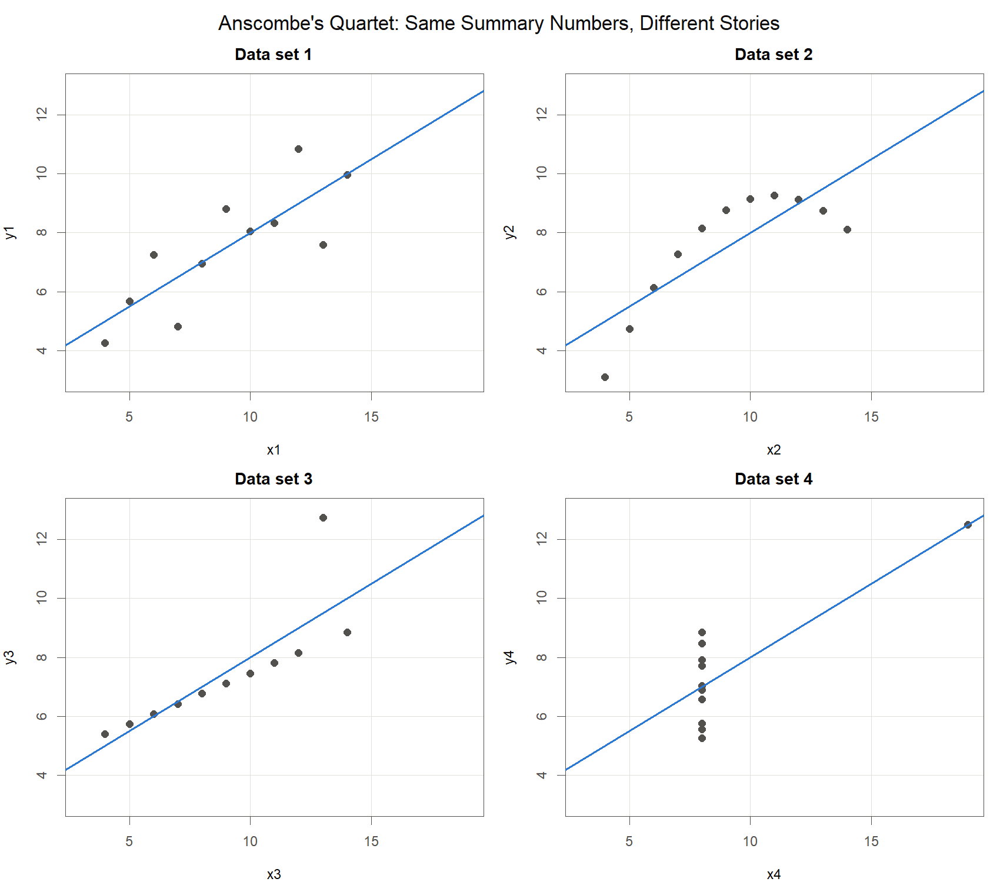{width=100%}
:::

::: {.column width="45%"}
> 서로 다른 네 자료에 최소제곱 직선을 적합하면 네 경우 모두 같은 직선이 나온다.
>
> $$\hat y_i = 3.00 + 0.500\,x_i$$

여기서 $\hat y_i$: $i$번째 관측의 적합값, $x_i$: 설명변수 값, $3.00$: 절편 추정값 $\hat\beta_0$, $0.500$: 기울기 추정값 $\hat\beta_1$

::: {.callout-tip appearance="minimal"}
<ul>
<li>요약 숫자만으로는 네 자료를 구분할 수 없음</li>
<li>그림에서는 네 자료의 구조가 서로 전혀 다름 (Anscombe, 1973)</li>
<li>회귀분석은 계수 계산과 그림 확인을 함께 수행함</li>
</ul>
:::
:::

::::

::: notes
화면의 수식부터 봐 주십시오. 서로 다른 네 자료에 직선을 그었는데 넷 다 절편 3.00, 기울기 0.500으로 똑같습니다. 그런데 산점도는 어떻습니까. 왼쪽 위만 우리가 흔히 생각하는 직선 관계입니다. 오른쪽 위는 매끄러운 곡선입니다. 왼쪽 아래는 점 하나가 직선을 위로 끌어당겼습니다. 오른쪽 아래는 아예 점 하나가 기울기를 통째로 만들어 냈습니다. 숫자가 같으니 결론도 같지 않겠느냐고 물으실 수 있습니다. 아닙니다. 오른쪽 아래 자료에 이 직선으로 예측하면 엉뚱한 값이 나옵니다. Anscombe가 1973년에 이 네 자료를 일부러 만든 이유가 여기 있습니다. 계산 결과만 보고 끝내면 절반만 한 것입니다.
:::

## 회귀모형의 네 가지 가정

### <i class="fa-solid fa-bullseye"></i> 정의

> $$y_i = \beta_0 + \beta_1 x_{i1} + \cdots + \beta_p x_{ip} + \varepsilon_i, \qquad \varepsilon_i \overset{iid}{\sim} N(0,\ \sigma^2)$$

여기서 $y_i$: 반응변수, $x_{ij}$: $i$번째 관측의 $j$번째 설명변수, $\beta_0,\dots,\beta_p$: 회귀계수, $\varepsilon_i$: 오차, $\sigma^2$: 오차의 분산. $N(0,\sigma^2)$: 0을 중심으로 좌우대칭인 종 모양 분포, $iid$: 오차들이 서로 영향을 주지 않으며(독립) 모두 같은 분포를 따름

::: {.callout-tip appearance="minimal"}
**네 가지 가정**

<ul>
<li><b>선형성</b> : $x$와 $y$의 관계가 직선으로 표현됨</li>
<li><b>독립성</b> : 오차 $\varepsilon_i$끼리 서로 독립</li>
<li><b>정규성</b> : 오차가 정규분포 $N(0,\sigma^2)$을 따름</li>
<li><b>등분산성</b> : 오차의 분산이 어디서나 같은 $\sigma^2$</li>
</ul>
:::

::: {.callout-note appearance="minimal"}
**Remark**

네 가정 중 하나라도 크게 위반되면 회귀계수의 표준오차(추정값이 자료가 바뀔 때마다 얼마나 흔들리는지를 나타내는 값), 유의성 검정, 신뢰구간이 모두 함께 흔들림 (Kutner et al., 2005)
:::

::: notes
회귀모형을 다리가 넷인 의자라고 생각해 보십시오. 선형성, 독립성, 정규성, 등분산성이 그 네 다리입니다. 수식에서 오차가 평균 0, 분산 시그마 제곱인 정규분포를 서로 독립적으로 따른다고 적은 부분이 네 다리를 한 줄로 압축한 문장입니다. 다리 하나가 부러지면 의자가 기우뚱합니다. 가정이 깨지면 계수 자체보다 그 계수의 불확실성을 재는 값들이 먼저 망가집니다. 독립성은 그림으로 어떻게 보는가. 그림보다는 자료가 어떻게 모였는지를 보고 판단하는 경우가 많습니다. 아이스크림 자료처럼 시간 순서로 쌓인 자료라면 잔차를 시간 순으로 늘어놓고 무늬가 있는지 봅니다. 나머지 세 다리는 잠시 뒤 진단 그림으로 하나씩 점검하겠습니다.
:::

## 잔차: 모형이 설명하지 못한 나머지 {.smaller}

### <i class="fa-solid fa-bullseye"></i> 정의

> $$e_i = y_i - \hat y_i, \qquad \mathbf e = \mathbf y - \hat{\mathbf y} = (\mathbf I - \mathbf H)\,\mathbf y$$

여기서 $e_i$: 잔차, $y_i$: 관측값, $\hat y_i$: 적합값, $\mathbf H = \mathbf X(\mathbf X^{\top}\mathbf X)^{-1}\mathbf X^{\top}$: 앞 장의 모자행렬, $\mathbf I$: 대각원소가 모두 1인 단위행렬. 적합값이 $\hat{\mathbf y}=\mathbf H\mathbf y$ 이므로, 잔차는 $\mathbf y$ 에서 $\mathbf H$ 가 잡아낸 부분을 뺀 나머지

::: panel-tabset

### 잔차의 역할

::: {.callout-tip appearance="minimal"}
<ul>
<li>오차 $\varepsilon_i$는 관측할 수 없으나 잔차 $e_i$는 자료에서 직접 계산됨</li>
<li>가정이 모두 성립하면 잔차는 0 주위에 <b>패턴 없이</b> 흩어짐</li>
<li>요약 숫자가 양호해도 잔차 그림에서 모형의 문제가 드러나기도 함</li>
</ul>
:::

### 잔차의 대수적 성질

$\mathbf M=\mathbf I-\mathbf H$ 도 대칭이고 멱등. 여기서 $\mathbf M$: 잔차를 만들어 내는 행렬

$$
\mathbf X^\top\mathbf e=\mathbf X^\top(\mathbf I-\mathbf H)\mathbf y=(\mathbf X^\top-\mathbf X^\top)\mathbf y=\mathbf 0
\;\Longrightarrow\;\sum_{i=1}^{n}e_i=0
$$

$$
E(\mathbf e)=\mathbf 0,\qquad \operatorname{Var}(\mathbf e)=\sigma^2(\mathbf I-\mathbf H)
\;\Longrightarrow\;\operatorname{Var}(e_i)=\sigma^2(1-h_{ii})
$$

$$
\operatorname{tr}(\mathbf I-\mathbf H)=n-(p+1)=30-4=26\;=\;\text{잔차의 자유도}
$$

::: {.callout-tip appearance="minimal"}
$\operatorname{Var}(e_i)$ 가 관측마다 다르므로, 잔차를 그대로 비교하지 않고 크기를 맞춘 <b>표준화잔차</b> $r_i=e_i/\big(\hat\sigma\sqrt{1-h_{ii}}\big)$ 를 사용
:::

:::

::: notes
오차는 모형 속에만 있는 이론적인 양이라 우리 눈에 보이지 않습니다. 대신 관측값에서 적합값을 뺀 잔차는 자료에서 바로 계산되고, 오차가 남긴 발자국 노릇을 합니다. 수식의 두 번째 줄을 봐 주십시오. 앞 장에서 적합값을 만들던 모자행렬이 그대로 다시 등장합니다. 모자행렬이 $\mathbf y$에서 설명 가능한 부분을 잡아채고, 남은 찌꺼기가 잔차입니다. 그래서 잔차는 모형이 손대지 못한 부분만 담고 있습니다. 의사가 청진기로 몸속 소리를 듣듯, 우리는 잔차로 모형 속을 듣습니다. 지금 진단할 대상은 가격, 소득, 온도를 모두 넣은 완전모형입니다. 변수를 고르는 일은 이 장 뒷부분에서 합니다. 손대지 않은 모형이 자료와 맞는지부터 봐야 뒤의 선택 결과를 믿을 수 있기 때문입니다. 두 번째 탭에 잔차의 성질을 정리했습니다. 첫 식은 설명변수와 잔차를 곱해 더하면 반드시 0이 된다는 뜻이고, 절편 열이 전부 1이므로 잔차의 합도 0이 됩니다. 세 번째 식의 26은 자료 서른 개의 정보에서 계수 네 개를 추정하는 데 쓰고 남은 몫입니다. 가장 중요한 것은 두 번째 식입니다. 잔차의 분산이 관측마다 다릅니다. 레버리지가 큰 관측일수록 잔차의 분산이 작아집니다. 그래서 잔차를 눈으로 비교하실 때는 크기를 맞춰 준 표준화잔차를 보셔야 합니다.
:::

## 진단 그림 4종 읽는 법

### <i class="fa-solid fa-chart-line"></i> 그림으로 보기

:::: {.columns}

::: {.column width="62%"}
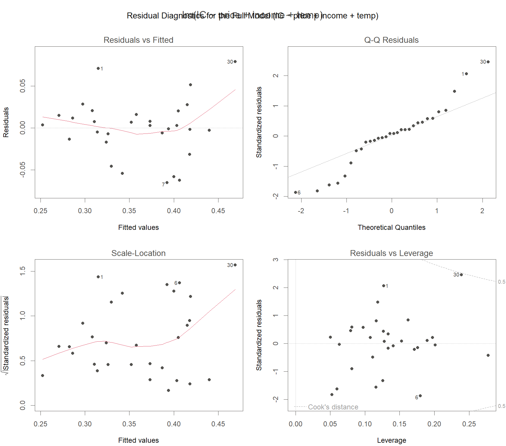{width=100%}
:::

::: {.column width="38%"}

::: {.callout-tip appearance="minimal"}
**읽는 법**

<ul>
<li><b>좌상 Residuals vs Fitted</b> : 곡선 패턴이 보이면 선형성 위반 신호</li>
<li><b>우상 Normal Q-Q</b> : 잔차를 크기순으로 늘어놓고 정규분포에서 기대되는 값과 짝지은 그림. 점들이 대각선에서 크게 벗어나면 정규성 의심</li>
<li><b>좌하 Scale-Location</b> : 오른쪽으로 갈수록 깔때기처럼 퍼지면 등분산성 위반</li>
<li><b>우하 Residuals vs Leverage</b> : 오른쪽 구석의 외딴 점은 영향점 후보</li>
</ul>
:::
:::

::::

::: notes
방금 말씀드린 plot 한 줄의 결과가 이 그림입니다. 왼쪽 위부터 보겠습니다. 점들이 0 근처에 수평으로 흩어져 있으면 합격입니다. U자나 아치가 보이면 직선으로 놓은 설정 자체가 틀린 것입니다. 오른쪽 위 Q-Q 그림은 이름이 낯설 것입니다. 잔차를 작은 것부터 줄 세우고, 정규분포라면 이쯤 나와야 한다는 값과 짝지어 찍은 그림입니다. 점들이 대각선 위에 얹혀 있으면 정규성에 큰 문제가 없다고 봅니다. 왼쪽 아래에서 퍼짐이 오른쪽으로 갈수록 넓어지면 등분산이 깨진 신호입니다. 오른쪽 아래에서 구석에 뚝 떨어진 점은 직선을 크게 흔드는 후보입니다. 곡선이 보이면 어떻게 하는가. 처방은 이 장 앞부분 마지막에 표로 정리해 드리겠습니다.
:::

## 레버리지 $h_{ii}$ {.smaller}

### <i class="fa-solid fa-bullseye"></i> 정의

> 레버리지 $h_{ii}$는 모자행렬 $\mathbf H$의 $i$번째 대각원소이며, $i$번째 관측이 설명변수 공간에서 얼마나 바깥에 놓여 있는지를 나타낸다.
>
> $$\sum_{i=1}^{n} h_{ii} = \operatorname{tr}(\mathbf H) = p+1, \qquad \bar h = \frac{p+1}{n}$$

여기서 $\operatorname{tr}(\mathbf H)$: 대각원소의 합, $n$: 관측 수, $p$: 설명변수 개수, $p+1$: 절편을 포함한 회귀계수의 개수. 레버리지의 평균이 $(p+1)/n$ 으로 고정되므로, 이 값의 2배를 넘는 관측을 주목 대상으로 삼는 관례 (Kutner et al., 2005)

### <i class="fa-solid fa-table"></i> 결과: 아이스크림 자료 full model

| Quantity | Value |
|:------------------------------------|------:|
| $\operatorname{tr}(\mathbf H) = p+1$ | 4 |
| Average leverage $(p+1)/n$ | 0.133 |
| Rule of thumb $2(p+1)/n$ | 0.267 |
| Largest $h_{ii}$ (observation 9) | 0.278 |

: Leverage summary for the full model, n = 30

::: notes
놀이터 시소를 떠올려 보십시오. 회전축 근처에 앉은 아이는 아무리 눌러도 시소가 별로 움직이지 않습니다. 끝에 앉은 아이는 살짝만 눌러도 전체가 기웁니다. 레버리지가 그 앉은 자리입니다. 설명변수 값이 평균 근처면 축 가까이, 끄트머리면 시소 끝자락입니다. 눈여겨볼 성질이 하나 있습니다. 레버리지를 전부 더하면 모자행렬의 대각합이 되고, 그 값이 회귀계수 개수와 정확히 같습니다. 아이스크림 완전모형에서는 4. 관측이 30개니 평균은 0.133입니다. 그 두 배인 0.267을 넘는 관측을 눈여겨보자는 관례가 있습니다. 표의 마지막 줄을 보시면 9번 관측이 0.278로 기준을 아슬아슬하게 넘습니다. 그렇다고 이 점이 결과를 지배한다는 뜻은 아직 아닙니다. 왜 그런지는 다음 두 슬라이드에서 이어집니다.
:::

## 이상치, 레버리지, 영향점: 정의

### <i class="fa-solid fa-bullseye"></i> 세 용어의 구별

> **이상치(outlier)** : $y$ 방향으로 동떨어진 점, 즉 잔차 $e_i$가 큰 관측
>
> **레버리지(leverage)** : $x$ 방향으로 얼마나 끝자리에 있는지를 나타내는 값 $h_{ii}$
>
> **영향점(influential point)** : 그 한 점을 제외하면 회귀직선이 크게 움직이는 점

### <i class="fa-solid fa-lightbulb"></i> 핵심

::: {.callout-tip appearance="minimal"}
<ul>
<li>$y$ 방향의 이탈(큰 잔차)과 $x$ 방향의 이탈(큰 레버리지)이 <b>결합될 때</b> 회귀직선이 실제로 움직임</li>
<li>잔차만 크거나 레버리지만 큰 점은 직선을 크게 흔들지 못하는 경우가 있음</li>
<li>따라서 두 값은 따로 보지 않고 함께 평가함</li>
</ul>
:::

::: notes
용어 세 개를 구분해 보겠습니다. 이상치는 세로 방향으로 튄 점, 레버리지가 큰 점은 가로 방향으로 멀리 나간 점입니다. 영향점은 그 점을 빼면 직선이 확 달라지는 점입니다. 셋이 같은 말처럼 들리지만 다릅니다. 시소 비유로 돌아가면, 축 근처에 앉은 아이가 아무리 힘껏 눌러도 시소는 잘 기울지 않습니다. 잔차가 커도 레버리지가 작은 경우입니다. 반대로 끝에 앉았는데 얌전히 있으면 역시 기울지 않습니다. 레버리지가 커도 잔차가 작은 경우입니다. 끝에 앉은 아이가 힘껏 누를 때, 그때가 진짜 문제입니다. 그래서 둘을 하나로 묶어 보는 숫자가 필요합니다. 다음 화면에서 확인하겠습니다.
:::

## 이상치, 레버리지, 영향점: Cook 거리 {.smaller}

### <i class="fa-solid fa-pen-to-square"></i> 잔차와 레버리지를 한 숫자로

::: {.callout-note appearance="minimal"}
**정의와 기호**

$$D_i = \frac{r_i^{2}}{p+1}\cdot\frac{h_{ii}}{1-h_{ii}}$$

여기서 $r_i$: $i$번째 표준화잔차(잔차 $e_i$ 를 그 표준오차로 나누어 서로 견줄 수 있게 만든 값), $h_{ii}$: 레버리지, $p+1$: 절편을 포함한 회귀계수의 개수. 두 요소가 곱해지므로 잔차와 레버리지가 함께 클 때 $D_i$ 가 특히 커짐 (Cook, 1977)
:::

### <i class="fa-solid fa-table"></i> 결과: 아이스크림 자료 full model

| Diagnostic statistic | Largest value | Observation |
|:-----------------------------------|--------------:|------------:|
| Standardized residual (absolute) | 2.46 | 30 |
| Leverage $h_{ii}$ | 0.278 | 9 |
| Cook's distance $D_i$ | 0.475 | 30 |

: Largest diagnostic values in the full model, n = 30

::: {.callout-tip appearance="minimal"}
Cook 거리 최댓값 0.475는 흔히 쓰는 기준값 1보다 작음 : 한 관측이 결과를 좌우한다고 볼 근거는 없음
:::

::: notes
Cook 거리는 잔차와 레버리지를 한 숫자로 묶은 값입니다. 식을 보시면 표준화잔차의 제곱에 레버리지 항을 곱해 두었습니다. 곱이라는 점이 중요합니다. 둘 중 하나가 0에 가까우면 전체가 작아지기 때문입니다. 표준화잔차라는 말이 낯설 수 있습니다. 잔차를 그 표준오차로 나눠서 서로 비교 가능하게 만든 값이라고 보시면 됩니다. 아이스크림 완전모형의 실제 수치가 표에 있습니다. 표준화잔차가 가장 큰 것은 30번 관측으로 2.46, 레버리지가 가장 큰 것은 9번으로 0.278, Cook 거리가 가장 큰 것도 30번으로 0.475입니다. 흔히 1을 넘으면 위험 신호로 보는데 0.475면 그 아래입니다. 눈여겨볼 관측은 9번과 30번이지만, 어느 한 점이 결과를 끌고 간다고 볼 정도는 아닙니다. 실무에서는 절대적인 합격선을 긋기보다 다른 점들보다 유난히 튀는 관측을 골라 그날 무슨 일이 있었는지 되짚어 보는 편이 훨씬 쓸모 있습니다.
:::

## 다중공선성과 VIF: 정의

### <i class="fa-solid fa-bullseye"></i> 설명변수끼리 정보가 겹칠 때

> 설명변수끼리 정보가 겹치는 현상을 다중공선성이라 하며, 이때 회귀계수 추정값 $\hat\beta_j$가 불안정해진다.
>
> $$\mathrm{VIF}_j = \frac{1}{1-R_j^{2}}$$

여기서 $R_j^{2}$: $j$번째 설명변수를 **나머지 설명변수들로 회귀**했을 때의 결정계수, 곧 그 변수의 변동 중 나머지 변수들이 설명한 비율. 겹침이 없으면 $R_j^{2}=0$ 이라 $\mathrm{VIF}_j=1$, 겹침이 심해 $R_j^{2}$ 가 1에 가까워질수록 값이 급격히 증가

::: {.callout-tip appearance="minimal"}
**판정 기준**

<ul>
<li>관례적으로 $\mathrm{VIF}_j$가 10, 문헌에 따라 5를 넘으면 심각한 다중공선성을 의심 (Kutner et al., 2005)</li>
</ul>
:::

::: notes
이번에는 관측이 아니라 설명변수들 사이의 문제입니다. 발표자 두 사람이 같은 내용을 동시에 말하면 청중은 누가 무슨 정보를 줬는지 구분하지 못합니다. 설명변수 둘이 거의 같은 정보를 담고 있을 때 모형이 그 상태가 됩니다. 공을 누구에게 돌려야 할지 몰라 계수 추정값이 이리저리 흔들립니다. VIF는 이것을 재는 도구입니다. 관심 변수 하나를 나머지 변수들로 회귀해서 얼마나 잘 설명되는지를 봅니다. 하나도 설명이 안 되면 값이 1, 거의 다 설명되면 값이 훌쩍 뜁니다. 보통 10, 엄격하게는 5를 경계선으로 삼습니다. 그러면 우리 자료는 어떨까요. 다음 화면에서 확인하겠습니다.
:::

## 다중공선성과 VIF: 아이스크림 자료

### <i class="fa-solid fa-table"></i> full model의 VIF

::: panel-tabset

### VIF 표

| Variable | VIF |
|:---------|----:|
| price    | 1.03 |
| income   | 1.14 |
| temp     | 1.14 |

: VIF for the full model IC ~ price + income + temp

::: {.callout-tip appearance="minimal"}
세 변수 모두 1에 가까움 : 이 자료에서는 다중공선성 **문제 없음**
:::

### 계산 절차

설명변수 하나를 나머지 설명변수로 회귀했을 때의 결정계수 $R_j^2$ 로 계산

$$\mathrm{VIF}_j=\frac{1}{1-R_j^2}$$

| Regression | $R_j^2$ | $\mathrm{VIF}_j=1/(1-R_j^2)$ |
|:--|--:|:--|
| price on income, temp | 0.0331 | $1/0.967=1.03$ |
| income on price, temp | 0.126 | $1/0.874=1.14$ |
| temp on price, income | 0.125 | $1/0.875=1.14$ |

: Derivation of the VIF values for the full model (n = 30)

$R_j^2=0$ 이면 $\mathrm{VIF}_j=1$ 로 최솟값. $R_j^2\to 1$ 이면 분모가 0에 가까워져 $\mathrm{VIF}_j\to\infty$

:::

::: notes
표를 보시면 price가 1.03, income과 temp가 각각 1.14입니다. 기준선 10이나 5와 견주면 아주 작은 값입니다. 설명변수끼리 겹치는 정보가 거의 없다는 뜻이고, 이 자료에서는 다중공선성 걱정을 접어도 됩니다. 오른쪽 탭에 계산 과정을 적어 두었습니다. 생각보다 단순합니다. price를 income과 temp로 회귀해서 결정계수를 구하면 0.0331입니다. 1에서 빼면 0.967, 그 역수가 1.03입니다. 이 숫자의 뜻을 한 줄로 옮기면 이렇습니다. price가 가진 정보 중 나머지 두 변수로 설명되는 몫이 3퍼센트뿐이다. 겹침이 거의 없으니 벌점도 거의 없습니다. 표 아래 줄을 봐 주십시오. $R_j^2$ 가 1에 가까워지면 분모가 0으로 가면서 VIF가 무한히 커집니다. VIF가 크게 나오면 어떻게 하는가. 겹치는 변수 중 하나를 빼거나, 두 변수를 합쳐 하나로 만드는 방법이 있습니다. 무엇을 뺄지 고르는 이야기가 이 장의 뒷부분입니다.
:::

## 진단 후 처방 {.smaller}

### <i class="fa-solid fa-screwdriver-wrench"></i> 실무 적용

| Diagnostic signal | Suspected violation | Remedy |
|:--------------------------|:----------------|:----------------------------------------|
| 잔차 그림의 곡선 패턴 | 선형성 | 변수 변환($\log$, 제곱근) 또는 곡선 항 추가 |
| 잔차 퍼짐의 깔때기 모양 | 등분산성 | 가중회귀로 보정 : Weighted Regression 장에서 다룸 |
| Q-Q 그림에서 대각선 이탈 | 정규성 | 반응변수 변환 검토 |
| 유난히 큰 Cook 거리 | 특정 관측의 과도한 영향 | 원자료 확인 후 민감도 분석 |

: Diagnostic signals and corresponding remedies

### <i class="fa-solid fa-triangle-exclamation"></i> 주의: 이상 관측의 처리

::: {.callout-tip appearance="minimal"}
<ul>
<li>먼저 <b>원인을 조사</b> : 기록 오류인지, 실제 신호인지 확인</li>
<li>원인을 모르는 채 관측을 삭제하는 일은 금지</li>
<li>결론이 한 점에 좌우되면 포함, 제외 두 분석을 모두 보고</li>
</ul>
:::

::: notes
신호가 잡혔을 때의 처방을 표 하나로 모았습니다. 곡선 무늬가 보이면 로그나 제곱근 변환, 아니면 곡선 항을 넣습니다. 잔차 퍼짐이 깔때기 모양이면 관측마다 정밀도가 다르다는 뜻입니다. 정밀한 관측에 더 큰 가중치를 주는 가중회귀가 정석이고, 뒤에 따로 한 장을 잡아 두었습니다. Q-Q에서 크게 벗어나면 반응변수 변환을 검토합니다. 아래 주의사항이 오늘 강의에서 가장 실무적인 대목일지도 모르겠습니다. 튀는 점이 보인다고 바로 지우지 마십시오. 기록 오류로 확인되면 고치거나 빼도 됩니다. 하지만 원인을 모른 채 지우면 마음에 안 드는 측정값을 골라 버리는 셈이라 결과가 왜곡됩니다. 그래도 한 점 때문에 결론이 뒤집히면 어떻게 하는가. 넣은 분석과 뺀 분석을 둘 다 보고하는 것이 정직한 답입니다. 진단은 신호를 읽는 일, 보정은 원인을 확인한 뒤에 하는 조치입니다.
:::

## 왜 변수를 고르는가

### <i class="fa-solid fa-bullseye"></i> 정의

> **과적합(overfitting)** : 자료에 들어 있는 우연한 변동인 잡음까지 모형이 반영하여, 지금 가진 자료에는 잘 맞지만 새로운 자료의 예측에는 실패하는 현상.

### <i class="fa-solid fa-triangle-exclamation"></i> 주의: $R^2$만으로는 비교할 수 없음

::: {.callout-note appearance="minimal"}
설명변수를 추가하면 결정계수 $R^{2}$, 곧 반응변수의 변동 중 모형이 설명한 비율은 **절대 감소하지 않음**. $R^{2}$ 만 보면 변수를 모두 포함한 모형이 언제나 우수해 보이며, 이것이 "다 넣자"는 잘못된 판단의 원인 (Kutner et al., 2005)
:::

### <i class="fa-solid fa-list-check"></i> 정리

::: {.callout-tip appearance="minimal"}
<ul>
<li>필요한 것은 모수 개수만큼 <b>벌점을 부과하는 모형 선택 기준</b></li>
<li>대표적인 기준 : 수정 $R^{2}$, AIC</li>
</ul>
:::

::: notes
기출문제 답안을 이해 없이 통째로 외운 학생을 떠올려 보십시오. 기출을 다시 풀면 100점입니다. 숫자만 살짝 바꾼 새 시험에서는 낙제합니다. 모형도 똑같습니다. 변수를 넣을수록 결정계수는 수학적으로 절대 내려가지 않습니다. 그러니 지금 자료 점수만 보면 다 넣는 쪽이 항상 이득처럼 보입니다. 그런데 그렇게 만든 모형은 자료 속 우연한 흔들림까지 외워 버립니다. 정작 새 자료가 오면 성적이 뚝 떨어집니다. 이것을 과적합이라고 부릅니다. 과적합인지 아닌지 어떻게 아는가. 새 자료로 직접 검증하는 방법이 가장 확실합니다. 다만 자료가 30개뿐일 때는 그럴 여유가 없습니다. 그래서 변수 개수만큼 벌점을 매기는 지표로 비교합니다. 대표 선수가 다음에 나올 AIC입니다.
:::

## 모형 선택 기준: AIC의 정의

### <i class="fa-solid fa-bullseye"></i> 적합도 + 모수 개수의 벌점

> **AIC (Akaike Information Criterion)** : 모형의 적합도 항과 모수 개수에 매기는 벌점 항을 더한 모형 선택 기준. 같은 자료로 적합한 모형들 사이에서 값이 **작을수록 선호**된다 (Akaike, 1974).
>
> $$\mathrm{AIC} = -2\log\hat L + 2k$$

여기서 $\hat L$: 적합한 모형이 지금의 자료를 얼마나 그럴듯하게 만들어 내는지를 나타내는 값(최대가능도)으로 잘 맞을수록 증가, $\log$: 자연로그, $k$: 추정하는 모수의 개수로 회귀계수 $p+1$개에 오차분산 $\sigma^{2}$ 하나를 더한 $p+2$

::: notes
벌점이 붙은 성적표, AIC를 소개합니다. 수식이 나왔지만 구조는 단순합니다. 앞항은 모형이 자료에 얼마나 잘 맞는지, 뒷항은 모수를 몇 개나 추정했는지에 매기는 벌금입니다. 앞항에 있는 최대가능도라는 말이 낯설 것입니다. 이 모형이 맞다고 치면 지금 우리가 손에 든 자료가 나올 법한 정도, 그 그럴듯함의 크기라고 보시면 됩니다. 잘 맞을수록 커지고, 앞에 마이너스가 붙어 있으니 잘 맞을수록 앞항 전체는 작아집니다. 모수 개수 k를 셀 때는 회귀계수에 오차분산 하나를 꼭 더해 주십시오. 완전모형이면 계수 넷에 분산 하나, 다섯입니다. 아카이케가 1974년에 낸 아이디어인데 반세기가 지난 지금도 표준 도구로 쓰입니다.
:::

## AIC의 두 항 읽기

### <i class="fa-solid fa-lightbulb"></i> 적합도는 줄고 벌점은 늘고

::: {.callout-tip appearance="minimal"}
<ul>
<li>앞항 $-2\log\hat L$ : <b>적합도</b> 부분으로, 자료에 잘 맞을수록 작아짐</li>
<li>뒷항 $2k$ : <b>벌점</b> 부분으로, 추정하는 모수가 하나 늘 때마다 2가 더해짐</li>
<li>변수를 추가하면 앞항은 줄고 뒷항은 늘어남 : 두 항의 합이 작은 모형이 균형이 좋은 모형임</li>
</ul>
:::

### <i class="fa-solid fa-triangle-exclamation"></i> 주의

::: {.callout-note appearance="minimal"}
AIC의 절댓값 자체에는 의미가 없음. 같은 자료로 적합한 모형들 사이의 **상대적 크기**만 의미를 가지므로 값이 음수여도 무방. 수정 $R^{2}$ 도 변수 개수를 반영해 $R^{2}$ 를 깎는다는 점에서 같은 정신의 지표
:::

::: notes
AIC를 읽는 법을 정리하겠습니다. 변수를 하나 더 넣으면 모형이 자료에 더 잘 맞으니 앞항이 줄어듭니다. 대신 벌금인 뒷항이 2만큼 늡니다. 이 둘을 합친 값이 작을수록 균형이 좋다고 봅니다. 잠시 뒤 표를 보시면 AIC가 마이너스 107 같은 음수로 나옵니다. 계산이 틀린 것 아니냐는 질문을 자주 받습니다. 그렇지 않습니다. AIC는 절댓값에 의미가 없습니다. 같은 자료에서 어느 모형이 더 작은지, 그 순위만 봅니다. 마이너스 107.48이 마이너스 107.21보다 작으니 앞쪽이 이깁니다. 수정 R 제곱도 같은 정신입니다. 변수 개수만큼 R 제곱을 깎아서 벌점을 매깁니다.
:::

## 아이스크림 자료: 후보 모형 비교 {.smaller}

### <i class="fa-solid fa-table"></i> 결과

::: panel-tabset

### 결과

| Model | Predictors | $R^2$ | Adjusted $R^2$ | AIC |
|:--|:--|:-----:|:-----:|:-------:|
| $M_1$ (full) | price, income, temp | 0.719 | 0.686 | -107.21 |
| $M_2$ | income, temp | 0.702 | 0.680 | **-107.48** |
| $M_3$ | temp | 0.602 | 0.587 | -100.77 |

: Candidate models for the ice cream data, n = 30

### AIC 계산

오차가 정규분포를 따르면 최대가능도가 잔차제곱합만의 함수가 되어 다음과 같이 정리됨

$$\mathrm{AIC}=-2\ln\hat L+2k=n\ln\!\Big(\frac{\mathrm{SSE}}{n}\Big)+2k+n\{1+\ln 2\pi\}$$

여기서 $k$: 추정한 모수의 개수(회귀계수 $p+1$ 개와 $\sigma^2$ 하나를 합해 $k=p+2$), $n\{1+\ln 2\pi\}=85.136$: 모형에 무관한 상수

$$\mathrm{AIC}(M_1)=30\ln\frac{0.0353}{30}+2\times 5+85.136=-202.35+10+85.136=-107.21$$

$$\mathrm{AIC}(M_2)=30\ln\frac{0.0374}{30}+2\times 4+85.136=-200.62+8+85.136=-107.48$$

:::

::: {.callout-tip appearance="minimal"}
**판단** : $R^2$ 는 full 모형이 가장 크지만 AIC 최솟값은 `IC ~ income + temp`. full 모형의 `price` 계수는 p-value가 0.226으로, 효과가 없다고 가정했을 때 이 정도 결과가 우연히 나올 확률이 작지 않음. 두 근거를 함께 보아 `price` 를 제외
:::

::: notes
후보 모형 세 개의 성적표입니다. R 제곱 열부터 보겠습니다. 변수가 셋인 full 모형이 0.719로 가장 높습니다. 방금 말씀드린 대로 변수를 넣으면 올라가기만 하기 때문입니다. 그런데 벌점을 반영한 AIC 열에서는 price를 뺀 모형이 마이너스 107.48로 가장 작습니다. 승자가 바뀐 셈입니다. 여기서 솔직하게 짚고 갈 것이 하나 있습니다. 수정 R 제곱은 full이 0.686으로 근소하게 더 높습니다. 두 지표가 벌점을 매기는 방식이 달라서, 차이가 이렇게 작을 때는 결론이 엇갈릴 수 있습니다. 그래서 세 번째 근거를 봅니다. price 계수의 p-value가 0.226입니다. 가격 효과가 없다고 쳐도 이만한 결과는 심심찮게 나온다는 뜻입니다. 그러면 가격은 판매량과 무관한 것일까요. 그 말은 아닙니다. 이 자료로는 가격 효과를 구분해 낼 증거가 부족하다, 거기까지입니다.
:::

## 후진제거법: 탐색 경로 {.smaller}

### <i class="fa-solid fa-table"></i> 한 번에 하나씩 빼 보기

::: {.callout-tip appearance="minimal"}
완전모형에서 출발하여 변수를 하나씩 제거해 보고, AIC가 가장 작아지는 방향으로 한 걸음씩 이동
:::

::: panel-tabset

### 탐색 경로

| Candidate | $\mathrm{AIC}^{*}$ | Decision |
|:--|:-------:|:--|
| 출발점: price, income, temp | -194.34 | starting point |
| price 제거 | -194.62 | smaller: price 제외 |
| income 제거 | -188.31 | larger: income 유지 |
| temp 제거 | -160.31 | larger: temp 유지 |

: Backward elimination path by AIC on the ice cream data

### 두 AIC 눈금의 관계

탐색에는 상수를 뺀 간이 정의를 쓰기도 함

$$\mathrm{AIC}^{*}=n\ln\!\Big(\frac{\mathrm{SSE}}{n}\Big)+2(p+1),\qquad
\mathrm{AIC}-\mathrm{AIC}^{*}=2+n\{1+\ln 2\pi\}=87.136$$

절댓값은 다르지만 상수를 더한 것뿐이므로 **모형 간 차이는 동일**

$$-194.62-(-194.34)=-0.28,\qquad -107.48-(-107.21)=-0.27$$

두 값의 차이는 표에 적은 반올림 자릿수 때문. AIC는 절댓값이 아니라 모형 사이의 차이로만 읽음

:::

::: {.callout-tip appearance="minimal"}
**결과** : price 제외, income 과 temp 는 유지. 앞 슬라이드의 수동 비교와 같은 결론
:::

::: notes
앞에서는 후보 세 개를 한꺼번에 늘어놓고 비교했습니다. 후진제거법은 순서를 정해 한 번에 하나씩만 빼 봅니다. 경로 표를 위에서부터 따라가 보겠습니다. 전체 모형에서 출발할 때 마이너스 194.34, 여기서 price를 빼면 마이너스 194.62로 더 작아집니다. 성적이 좋아졌으니 빼는 것이 이득입니다. 반면 income을 빼면 마이너스 188.31, temp를 빼면 마이너스 160.31로 확 나빠집니다. 특히 온도를 뺐을 때 손해가 큽니다. 그래서 둘은 남깁니다. 앞 화면에서는 AIC가 마이너스 107 근처였는데 여기서는 왜 마이너스 194인가. 좋은 질문입니다. 두 번째 탭에 답을 적어 두었습니다. 탐색에 쓰는 간이 정의는 모형과 무관한 상수 87.136을 빼고 계산합니다. 그래서 눈금 전체가 통째로 내려앉습니다. 중요한 것은 그 다음 줄입니다. 상수를 뺐을 뿐이니 모형 사이의 차이는 그대로입니다. 두 눈금에서 각각 계산해 보면 0.28과 0.27, 반올림 자릿수만큼만 다릅니다. 그러니 AIC는 절댓값을 외우실 필요가 없습니다. 같은 표 안에서 차이로만 읽으시면 됩니다.
:::

## 선택 후 재진단

### <i class="fa-solid fa-chart-line"></i> 그림으로 확인

> 선택된 축소 모형식
>
> $$\hat y_i = -0.113 + 0.00353\,x_{i2} + 0.00354\,x_{i3}$$

여기서 $x_{i2}$: 소득, $x_{i3}$: 온도. $R^2 = 0.702$, 수정 $R^2 = 0.680$

:::: {.columns}

::: {.column width="58%"}
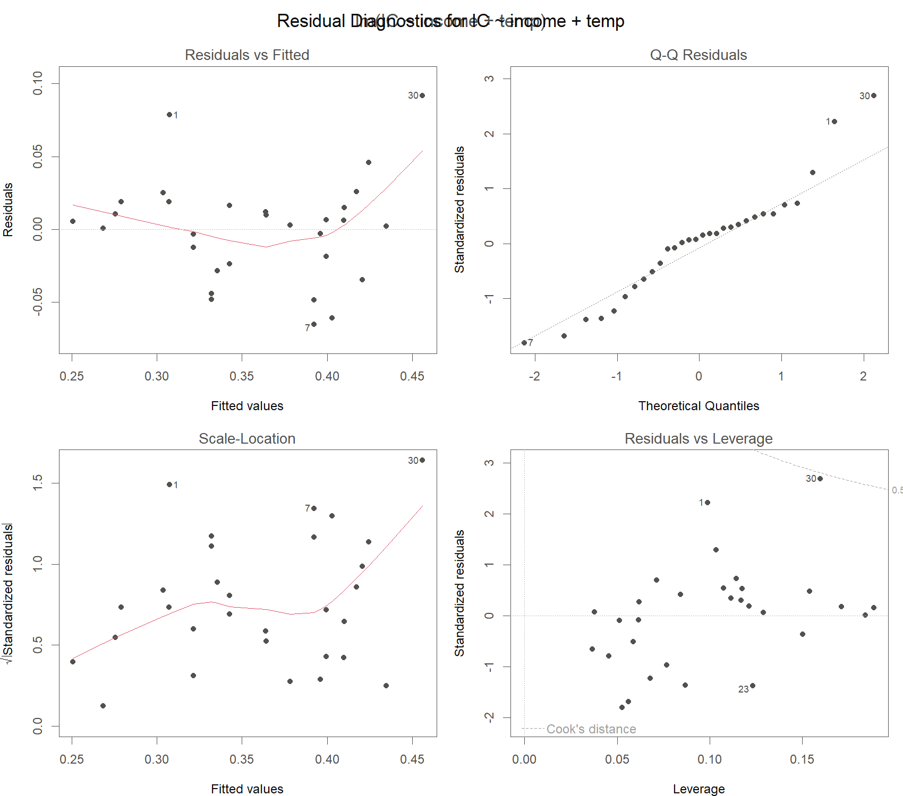{width=100%}
:::

::: {.column width="42%"}
::: {.callout-tip appearance="minimal"}
<ul>
<li>변수선택으로 모형이 바뀌면 잔차도 바뀜</li>
<li>따라서 선택된 모형에 대해 진단을 <b>다시</b> 수행함</li>
<li>진단과 선택은 한 번에 끝내는 순서가 아니라 <b>순환</b>하는 과정임</li>
</ul>
:::
:::

::::

::: notes
변수를 골랐다고 끝이 아닙니다. 모형이 바뀌면 적합값이 바뀌고, 적합값이 바뀌면 잔차도 전부 새로 계산됩니다. 그러니 진단을 처음부터 다시 해야 합니다. 화면의 네 그림이 소득과 온도만 남긴 축소모형의 진단 결과입니다. 앞서 본 완전모형 진단과 견주어 보시면 큰 차이가 없습니다. 가격을 뺐는데도 잔차 구조가 무너지지 않았다는 뜻이고, 좋은 신호입니다. 축소모형의 결정계수는 0.702, 수정 결정계수는 0.680입니다. 변수를 하나 덜었는데 설명력이 거의 그대로입니다. 이번 장 첫 부분에서 진단을 배우고 뒷부분에서 선택을 배웠지만, 실제 작업은 진단과 선택 사이를 왔다 갔다 하는 순환입니다. 한 번 지나가는 체크리스트가 아니라는 점을 꼭 기억해 주십시오.
:::

## 자동 선택의 한계

### <i class="fa-solid fa-triangle-exclamation"></i> 주의

::: {.callout-note appearance="minimal"}
<ul>
<li>자동 탐색은 <b>후보를 제안</b>할 뿐이며 최종 결정은 연구자의 몫임</li>
<li><b>도메인 지식이 우선</b> : 이론상 반드시 필요한 변수는 정보기준 값만으로 제외하지 않음</li>
<li>같은 자료를 여러 번 들여다보며 모형을 고른 뒤 계산한 p-value와 신뢰구간은 <b>액면 그대로 믿기 어려움</b>. 선택 과정 자체가 결과에 유리한 쪽으로 작용하기 때문임</li>
<li>선택된 모형의 성능을 정직하게 평가하려면 <b>선택에 쓰지 않은 자료</b>가 필요함</li>
</ul>
:::

::: notes
마지막 주의사항입니다. step은 자동차 내비게이션과 같습니다. 괜찮은 길을 제안해 주지만 운전대는 여전히 여러분이 잡고 있습니다. 통계 기준보다 도메인 지식이 앞섭니다. 계측기를 다루실 때 자동 교정 기능이 있어도 최종 확인은 담당자가 직접 하십니다. 같은 이치입니다. 세 번째 항목이 특히 중요한데, 조금 불편한 이야기입니다. 우리는 방금 같은 자료로 모형을 여러 개 만들어 비교하고 그중 제일 좋아 보이는 것을 골랐습니다. 그런 다음 그 모형의 p-value를 읽었습니다. 여러 번 던진 주사위 중에 제일 잘 나온 판을 골라 놓고 이 주사위 참 잘 나온다고 말하는 것과 비슷합니다. 값이 실제보다 좋아 보이기 쉽습니다. 그래서 최종 성능은 선택에 쓰지 않은 새 자료로 확인하는 것이 원칙입니다. 그러면 price는 영영 버리는 것인가. 아닙니다. 이번 자료에서 근거가 약했을 뿐, 가격이 중요하다는 이론이 있다면 다른 자료로 다시 봐야 합니다.
:::

## 이 장의 정리

### <i class="fa-solid fa-list-check"></i> Diagnosis & Variable Selection

> 진단은 모형이 자료와 맞는지 확인하는 절차이고, 변수선택은 설명력과 단순함의 균형점을 찾는 절차이며, 두 절차는 번갈아 반복된다.

::: {.callout-tip appearance="minimal"}
**이 장의 도구**

<ul>
<li>가정 네 가지 : 선형성, 독립성, 정규성, 등분산성</li>
<li>진단 : 잔차 $e_i$, 진단 그림 4종, 레버리지 $h_{ii}$, Cook 거리 $D_i$, VIF</li>
<li>선택 : $\mathrm{AIC} = -2\log\hat L + 2k$, 수정 $R^2$, 후진제거법</li>
<li>아이스크림 자료의 결론 : `IC ~ income + temp`</li>
</ul>
:::

::: {.callout-note appearance="minimal"}
**다음 장** · Weighted Regression: 진단에서 잔차가 깔때기 모양으로 퍼졌을 때, 곧 등분산이 깨졌을 때의 처방
:::

::: notes
이 장을 한 문장으로 줄이면 화면의 인용문입니다. 진단은 모형이 자료와 맞는지 보는 일, 선택은 잘 맞으면서도 가벼운 모형을 찾는 일, 그리고 이 둘은 번갈아 반복됩니다. 아래 상자에 이 장에서 꺼낸 도구를 모아 두었습니다. 이름이 많아 보이지만 하는 일은 두 가지입니다. 하나는 튀는 관측을 찾는 것, 다른 하나는 군더더기 변수를 덜어 내는 것. 아이스크림 자료의 결론은 소득과 온도 두 변수 모형이었습니다. 그런데 진단 그림에서 잔차가 깔때기처럼 퍼지는 경우, 처방 표에서 가중회귀라고 적어 두었던 그 경우는 어떻게 할까요. 다음 장에서 그 이야기를 시작하겠습니다.
:::

# Weighted Regression

::: notes
특강 제목에도 들어 있는 가중회귀에 도착했습니다. 지금까지는 모든 관측값을 똑같이 믿는다는 전제로 직선을 맞춰 왔습니다. 이번 장은 다릅니다. 더 믿을 만한 측정에 더 큰 발언권을 주는 방법을 배웁니다. 여러분 실험실 데이터와 가장 가까운 장이기도 합니다. 앞 장에서 최소제곱법이 왜 최선이라고 말할 수 있었는지, 그 근거가 무너지면 무엇으로 갈아타야 하는지를 차례로 보겠습니다.
:::

## 이 장의 출발점

### <i class="fa-solid fa-question"></i> 질문

::: {.callout-note appearance="minimal"}
**앞 장에서 여기까지** · 진단에서 잔차가 깔때기 모양으로 퍼지면 등분산 위반. **이 장의 질문** · 그때 무엇으로 갈아타는가
:::

> 모든 관측값을 동일한 신뢰도로 취급해야 하는가?

### <i class="fa-solid fa-lightbulb"></i> 핵심

::: {.callout-tip appearance="minimal"}
<ul>
<li>계측기마다 교정 성적서에 적힌 <b>측정 불확도</b>가 다름</li>
<li>관측값이 서로 다른 횟수의 반복 측정을 평균한 값일 수 있음</li>
<li>관측별 신뢰도를 모형에 반영하는 장치가 필요함: 가중치 $w_i$</li>
<li>추정 대상인 조건부 기댓값 $E(y \mid x)$ 자체는 바뀌지 않음. 관측마다 주는 가중치만 달라짐</li>
</ul>
:::

여기서 $w_i$는 $i$번째 관측에 부여하는 가중치로, 그 관측이 추정에 미치는 영향의 크기를 조절하는 값임

::: notes
같은 시료 하나를 세 가지 저울로 재는 상황을 상상해 보십시오. 정밀 분석저울, 주방 저울, 그리고 낡은 체중계입니다. 세 숫자가 나왔을 때 이 셋을 그냥 산술평균하는 분은 없으실 것입니다. 정밀한 저울 쪽을 더 믿으시겠지요. 여러분 실험실에서도 계측기마다 교정 성적서에 적힌 측정 불확도가 전부 다릅니다. 이 상식을 수식으로 옮긴 것이 가중치, 각 관측값에 주는 발언권입니다. 그러면 낡은 체중계 값은 버리면 되지 않느냐고 물으실 수 있습니다. 버리는 것은 발언권을 0으로 만드는 극단적인 선택입니다. 정보가 조금이라도 있다면 작은 발언권이라도 주는 쪽이 대개 손해가 적습니다. 하나만 더 짚겠습니다. 우리가 찾는 대상은 조건부 기댓값, $x$가 주어졌을 때 $y$의 평균이었습니다. 가중치를 준다고 그 과녁이 옮겨 가지는 않습니다. 과녁은 그대로 두고, 회의실에서 누구 말을 더 크게 들을지만 다시 정하는 것입니다.
:::

## 등분산과 이분산: 정의

### <i class="fa-solid fa-bullseye"></i> 아래첨자 $i$ 하나의 차이

> **등분산(homoscedasticity)**: 모든 $i=1,\dots,n$에 대해 $\operatorname{Var}(\varepsilon_i)=\sigma^2$. 오차의 분산이 공통
>
> **이분산(heteroscedasticity)**: $\operatorname{Var}(\varepsilon_i)=\sigma_i^2$. 오차의 분산이 관측마다 다름

여기서 $\varepsilon_i$는 $i$번째 관측의 오차, 곧 참 직선에서 그 관측이 위아래로 벗어난 양임. $\operatorname{Var}$는 분산으로 값들이 평균에서 흩어진 정도를 재는 수치이고, $\sigma^2$는 모든 관측에 공통인 오차 분산, $\sigma_i^2$는 관측마다 달라지는 오차 분산, $n$은 관측 수임

::: {.callout-tip appearance="minimal"}
두 식의 차이는 아래첨자 $i$ 하나뿐이지만, 뒤에서 볼 결과의 차이는 작지 않음
:::

::: notes
지금까지 우리는 오차의 퍼짐이 어디에서나 같다는 약속을 깔고 왔습니다. 이것을 등분산이라고 부릅니다. 이 약속이 깨진 상황, 곧 오차의 퍼짐이 관측마다 달라지는 상황이 이분산입니다. 기호로 보면 차이가 아주 작습니다. 시그마 제곱에 아래첨자 $i$가 붙었을 뿐입니다. 그 한 글자가 관측마다 퍼짐이 다르다는 뜻입니다. 분산이라는 말이 낯설면 이렇게 생각해 보십시오. 과녁에 화살을 여러 발 쐈을 때 탄착군이 얼마나 넓게 퍼졌는가, 그 넓이가 분산입니다. 등분산은 어느 자리에서 쏘든 탄착군 크기가 같다는 뜻입니다.
:::

## 등분산과 이분산: 깔때기 신호

### <i class="fa-solid fa-chart-line"></i> 잔차 그림으로 확인

:::: {.columns}

::: {.column width="60%"}
{width=100%}
:::

::: {.column width="40%"}
::: {.callout-tip appearance="minimal"}
**이분산의 전형적 신호**

<ul>
<li>산점도: $x$가 커질수록 점들이 직선 주위로 넓게 퍼짐</li>
<li>잔차 그림: 왼쪽은 좁고 오른쪽은 넓은 <b>깔때기 모양</b></li>
<li>등분산이면 잔차가 위아래로 고른 띠를 이룸</li>
</ul>
:::
:::

::::

등분산은 자료가 저절로 만족해 주는 성질이 아니라 분석자가 걸어 둔 가정이므로, Diagnosis 장의 잔차 그림으로 확인해야 함

::: notes
왼쪽 그림을 보시면 $x$가 커질수록 점들이 직선 주위에서 점점 넓게 퍼집니다. 오른쪽 잔차 그림에서는 같은 현상이 왼쪽은 좁고 오른쪽은 넓은 깔때기 모양으로 나타납니다. 이 깔때기가 이분산의 대표적인 신호입니다. 반대로 잔차가 위아래로 고르게 띠를 이루고 있다면 등분산 가정에 큰 문제는 없다고 보셔도 됩니다. 실무에서 이분산을 어떻게 알아채는가. 검정 통계량보다 그림이 먼저입니다. 앞 장에서 배운 잔차 그림을 그려서 눈으로 확인하는 방법이 가장 빠릅니다. 눈에 깔때기가 보인다면, 그다음에 무엇을 해야 하는지가 이 장의 나머지 내용입니다.
:::

## 등분산이 깨지면: Gauss-Markov 복습

### <i class="fa-solid fa-lightbulb"></i> OLS가 최선이었던 근거

> **Gauss-Markov 정리**: 다음 두 조건이 성립하면 통상최소제곱 추정량 $\hat{\boldsymbol\beta}_{OLS}$는 BLUE이다.
>
> $$E(\boldsymbol\varepsilon \mid \mathbf X)=\mathbf 0, \qquad \operatorname{Var}(\boldsymbol\varepsilon \mid \mathbf X)=\sigma^2\mathbf I$$

여기서 $\boldsymbol\varepsilon$은 오차를 세로로 쌓은 $n\times 1$ 벡터, $\mathbf X$는 절편열을 포함한 $n\times(p+1)$ 설계행렬, $\mathbf I$는 $n\times n$ 항등행렬임. 둘째 조건은 "모든 오차의 분산이 $\sigma^2$로 같고(등분산), 서로 다른 관측의 오차가 함께 움직이지 않는다(무상관)"를 한 줄로 쓴 것임

::: {.callout-tip appearance="minimal"}
**BLUE(Best Linear Unbiased Estimator)**: $y$의 선형결합으로 만든 불편 추정량 가운데 분산이 가장 작은 것. **불편**은 같은 실험을 무수히 반복했을 때 추정값의 평균이 참값과 일치한다는 뜻임
:::

::: notes
잠깐 앞 장으로 돌아가겠습니다. 최소제곱법이 최선이라고 말할 수 있었던 근거가 Gauss-Markov 정리였습니다. 조건은 두 줄입니다. 첫째, 오차의 평균이 0. 모형이 체계적으로 위나 아래로 치우쳐 있지 않다는 뜻입니다. 둘째 줄이 오늘의 주인공인데, 여기에 두 가지가 함께 들어 있습니다. 모든 오차의 퍼짐이 같다는 등분산, 그리고 서로 다른 관측의 오차가 함께 움직이지 않는다는 무상관입니다. 이 두 조건 아래에서 최소제곱 추정량은 BLUE, 곧 y의 선형결합으로 만든 편향 없는 추정량 가운데 가장 덜 흔들리는 추정량이 됩니다. 불편이라는 말은 어렵지 않습니다. 같은 실험을 수없이 반복하면 추정값들의 평균이 참값에 맞는다는 뜻입니다.
:::

## 등분산이 깨지면: 무엇이 무너지는가

### <i class="fa-solid fa-triangle-exclamation"></i> 편향은 없으나 최소분산이 아님

> 이분산에서는 $\operatorname{Var}(\boldsymbol\varepsilon)=\sigma^2\mathbf I$가 성립하지 않으므로 Gauss-Markov 정리의 전제가 무너진다. $\hat{\boldsymbol\beta}_{OLS}$는 **여전히 불편추정량이지만 더 이상 최소분산이 아니다**.

::: {.callout-tip appearance="minimal"}
<ul>
<li>편향은 생기지 않음: $E(\hat\beta_1)=\beta_1$이 그대로 성립함</li>
<li>최소분산이 아님: 분산이 더 작은 선형 불편 추정량이 존재함</li>
<li>표준오차가 왜곡됨: 등분산을 전제로 유도한 공식이기 때문임</li>
<li>따라서 $t$-검정, $p$-값, 신뢰구간이 모두 틀어짐 (Kutner et al., 2005)</li>
</ul>
:::

여기서 $\hat\beta_1$은 기울기의 추정량, $\beta_1$은 그 참값임. **표준오차**는 추정값이 표본마다 얼마나 흔들리는지를 재는 수치이고, **$p$-값**은 "기울기가 0이다"라는 가정이 옳다고 볼 때 지금 자료만큼 극단적인 결과가 나올 확률임

::: notes
좋은 소식과 나쁜 소식이 있습니다. 좋은 소식은 기울기 추정에 편향이 없다는 것. 평균적으로는 과녁 중심을 맞힙니다. 나쁜 소식은 둘입니다. 첫째, 화살의 흔들림이 필요 이상으로 큽니다. 분산이 더 작은 선형 불편 추정량이 어딘가에 있다는 뜻입니다. 둘째가 더 골치입니다. 표준오차 공식 자체가 등분산을 전제로 만들어져 있어서 조준경 눈금이 틀어진 상태가 됩니다. 표준오차는 추정값이 표본을 바꿔 가며 얼마나 흔들리는지를 재는 숫자이고, p-값과 신뢰구간은 전부 이 숫자를 밟고 서 있습니다. 밑돌이 틀어지면 그 위도 전부 틀어집니다. 그러면 OLS 결과를 다 버려야 하는가. 계수 값 자체는 참고하셔도 됩니다. 다만 검정과 구간은 믿지 마시고, 지금부터 배울 가중최소제곱으로 다시 적합하시는 편이 정석입니다.
:::

## 가중최소제곱(WLS): 목적함수 {.smaller}

### <i class="fa-solid fa-bullseye"></i> 정의

> 가중최소제곱(weighted least squares)은 다음 **가중 잔차제곱합**을 최소화하는 값을 추정량으로 택한다.
>
> $$\min_{\beta_0,\,\beta_1}\ \sum_{i=1}^{n} w_i\left(y_i-\beta_0-\beta_1 x_i\right)^2$$

여기서 $y_i$는 반응변수, $x_i$는 설명변수, $\beta_0$과 $\beta_1$은 절편과 기울기, $w_i$는 $i$번째 관측의 가중치, $n$은 관측 수임

### <i class="fa-solid fa-lightbulb"></i> 핵심

::: {.callout-tip appearance="minimal"}
<ul>
<li>이론적 최적 가중치는 오차 분산의 역수: $w_i = 1/\sigma_i^2$</li>
<li>분산이 작은(정밀한) 관측일수록 큰 $w_i$를 받음</li>
<li>모든 $w_i=1$이면 통상최소제곱과 같음: <b>OLS는 WLS의 특수한 경우</b></li>
<li>가중치는 비율만 의미를 가짐. 전체에 같은 상수를 곱해도 추정값은 불변임</li>
</ul>
:::

::: notes
아이디어는 하나입니다. 제곱오차를 더할 때 각 항 앞에 발언권을 곱합니다. 가중치가 큰 점은 오차의 벌점이 크게 매겨지니, 직선이 그 점 가까이 지나가려고 애쓰게 됩니다. 반대로 가중치가 작은 점은 조금 멀리 지나가도 벌점이 작습니다. 이론적으로 가장 좋은 가중치는 그 관측이 가진 오차 분산의 역수입니다. 정밀한 저울일수록 발언권을 크게 주자는 상식이 그대로 수식이 된 셈입니다. 가중치의 절대 크기도 중요하냐는 질문이 자주 나옵니다. 아닙니다. 비율만 중요합니다. 모든 가중치에 10을 곱해도 직선은 그대로입니다.
:::

## 가중최소제곱(WLS): 행렬 해

### <i class="fa-solid fa-bullseye"></i> OLS 공식에 $\mathbf W$ 를 끼운 형태

> $$\hat{\boldsymbol\beta}_W=(\mathbf X^\top \mathbf W \mathbf X)^{-1}\mathbf X^\top \mathbf W \mathbf y$$

여기서 $\mathbf y$는 반응변수를 세로로 쌓은 $n\times 1$ 벡터, $\mathbf X$는 절편열을 포함한 $n\times(p+1)$ 설계행렬, $\mathbf W=\operatorname{diag}(w_1,\dots,w_n)$은 가중치를 대각선에 놓고 나머지 자리를 0으로 채운 대각행렬, $\hat{\boldsymbol\beta}_W$는 가중최소제곱 추정량임

::: {.callout-tip appearance="minimal"}
OLS 공식 $(\mathbf X^\top\mathbf X)^{-1}\mathbf X^\top\mathbf y$와 비교하면 $\mathbf X$와 $\mathbf y$ 사이에 $\mathbf W$가 끼어든 형태임. $\mathbf W=\mathbf I$이면 OLS로 되돌아감
:::

::: notes
앞의 최소화 문제를 풀면 답이 한 줄로 나옵니다. OLS 공식과 나란히 놓고 보시면 $\mathbf X$와 $\mathbf y$ 사이사이에 가중치 행렬 $\mathbf W$가 끼어든 것뿐입니다. $\mathbf W$는 대각선에 발언권 $w_1$부터 $w_n$까지를 나란히 적고 나머지 칸은 전부 0으로 채운 행렬입니다. 모든 발언권이 1이면 어떻게 될까요. $\mathbf W$가 항등행렬이 되면서 공식이 정확히 OLS로 돌아갑니다. 새 공식을 외우실 필요는 없습니다. OLS에 발언권을 끼워 넣었다, 이렇게만 기억하시면 됩니다. 이 역행렬 계산을 직접 해야 하나 걱정하실 수 있습니다. 그렇지 않습니다. 계산은 프로그램이 합니다. 여러분이 정하실 것은 $\mathbf W$ 의 대각선에 무엇을 넣을지, 그 하나뿐입니다.
:::

## 가중최소제곱(WLS): 해의 유도

### <i class="fa-solid fa-pen-to-square"></i> 절차는 OLS와 동일

::: {.callout-note appearance="minimal"}
가중 잔차제곱합을 행렬로 쓰면

$$S_W(\boldsymbol\beta)=\sum_{i=1}^{n} w_i\left(y_i-\mathbf x_i^\top\boldsymbol\beta\right)^2=(\mathbf y-\mathbf X\boldsymbol\beta)^\top\mathbf W(\mathbf y-\mathbf X\boldsymbol\beta)$$

$\boldsymbol\beta$로 미분해 $\mathbf 0$으로 놓으면 정규방정식을 얻음

$$\frac{\partial S_W}{\partial\boldsymbol\beta}=-2\,\mathbf X^\top\mathbf W(\mathbf y-\mathbf X\boldsymbol\beta)=\mathbf 0
\ \Longrightarrow\ \mathbf X^\top\mathbf W\mathbf X\,\hat{\boldsymbol\beta}_W=\mathbf X^\top\mathbf W\mathbf y$$

$\mathbf X^\top\mathbf W\mathbf X$ 가 가역이면 앞 슬라이드의 해
:::

여기서 $\mathbf x_i^\top$은 설계행렬 $\mathbf X$의 $i$번째 행, $S_W(\boldsymbol\beta)$는 가중 잔차제곱합임

::: notes
유도 절차는 앞 장에서 하셨던 것과 완전히 같습니다. 제곱합을 베타로 미분해서 0으로 놓으면 정규방정식이 나오고, 역행렬을 곱하면 끝납니다. 달라진 것은 식 가운데에 $\mathbf W$가 하나 들어간 것뿐입니다. 미분 과정이 눈에 들어오지 않으셔도 괜찮습니다. 결론만 가져가시면 됩니다. 가중치를 넣어도 푸는 방식은 그대로, 답의 모양도 그대로. 이 두 가지입니다.
:::

## 가중치를 정하는 규칙 {.smaller}

### <i class="fa-solid fa-table"></i> 실무 규칙

| Situation | Weight $w_i$ |
|:---|:---|
| 측정 분산 $\sigma_i^2$를 아는 경우(교정 성적서, 반복 측정) | $w_i = 1/\sigma_i^2$ |
| $y_i$가 $n_i$개 측정값의 평균인 경우 | $w_i = n_i$ |
| 퍼짐이 $x_i$에 비례해 커지는 경우 | $w_i \propto 1/x_i$ |

: Practical rules for choosing weights (Kutner et al., 2005)

여기서 $\sigma_i^2$는 $i$번째 관측의 오차 분산, $n_i$는 $y_i$를 만들 때 평균한 측정 횟수, $\propto$는 "비례한다"는 기호임

### <i class="fa-solid fa-lightbulb"></i> 핵심

> 세 규칙은 모두 하나의 원리에서 나온다: **가중치는 분산의 역수**. $n_i$개 측정값을 평균하면 그 평균의 분산이 $\sigma^2/n_i$이므로, 역수를 취하면 $w_i \propto n_i$가 된다.

::: notes
그러면 실무에서 가중치를 어떻게 정할까요. 규칙은 하나입니다. 그 관측값의 분산을 알아내서 역수를 취한다. 이것이 전부입니다. 첫째 줄, 교정 성적서나 반복 측정으로 분산을 이미 알고 있다면 그대로 역수를 쓰시면 됩니다. 둘째 줄, $y_i$가 여러 번 측정한 값의 평균이라면 평균의 분산은 측정 횟수만큼 나눠져 작아지니, 가중치는 측정 횟수에 비례하게 줍니다. 다섯 번 잰 평균이 한 번 잰 값보다 다섯 배 믿을 만하다는 뜻입니다. 셋째 줄, 앞의 깔때기 그림처럼 퍼짐이 $x$에 비례해 커진다면 가중치는 $x$의 역수에 비례하게 잡습니다. 분산 정보가 아예 없으면 어떻게 하는가. 그때는 잔차 그림으로 분산이 어느 변수를 따라 커지는지 구조를 먼저 추정하고, 그것으로 가중치를 만들어 다시 적합합니다. 요점은 하나입니다. 가중치에는 근거가 있어야 합니다.
:::

## 가중치의 실무 적용: 감마선 검교정

### <i class="fa-solid fa-screwdriver-wrench"></i> 분산을 이미 아는 경우

::: {.callout-tip appearance="minimal"}
Introduction 장에서 소개한 사례가 앞 표의 첫째 줄에 해당함

<ul>
<li>검출기의 검출 효율 곡선을 적합하는 검교정 문제임</li>
<li>각 측정점의 분산이 <b>계수 통계(counting statistics)</b>로 이미 알려져 있음</li>
<li>따라서 가중치를 추정하지 않고 곧바로 계산함: $w_i = 1/\sigma_i^2$</li>
<li>오차 분산을 알고 오차가 서로 무상관이면, 역분산 가중이 선형 불편 추정량 가운데 최소분산을 줌</li>
</ul>
:::

여기서 $\sigma_i$는 $i$번째 측정점 계수율의 표준편차로, 계수 통계에서 계산되는 값임

::: {.aside}
*Analytical Chemistry* 91(7) (2019), doi:10.1021/acs.analchem.9b00119. / INMM Annual Meeting Proceedings, "Weighted Least Squares Fitting of Gamma Spectroscopy Efficiency Functions".
:::

::: notes
첫 장에서 잠깐 보여 드린 감마선 분광 효율 검교정으로 돌아가겠습니다. 이 문제가 가중회귀의 교과서적인 사례입니다. 각 측정점의 분산을 따로 추정할 필요가 없기 때문입니다. 계수 통계에서 이미 나와 있습니다. 방사선 계수는 세는 횟수 자체가 확률적으로 흔들리는데, 그 흔들림의 크기가 이론적으로 알려져 있습니다. 그래서 곧장 분산의 역수를 가중치로 넣습니다. 추정 단계가 하나 통째로 빠지니 깔끔합니다. 그리고 이렇게 분산을 아는 상황에서는 역분산 가중이 최선이라는 사실이 이론으로 보장됩니다. 여러분 현장의 계측 자료 중에 이런 성격을 가진 것이 꽤 많을 것입니다.
:::

## 예제 physics 자료: 자료 구조 {.smaller}

### <i class="fa-solid fa-table"></i> $w$ 는 가중치가 아니라 분산에 비례

| x | y | w |
|---:|---:|---:|
| 0.345 | 367 | 17 |
| 0.287 | 311 | 9 |
| 0.251 | 295 | 9 |

: First 3 rows of the physics data. n = 10 observations, 3 variables (CNU lecture note, Example 8.1)

::: {.callout-tip appearance="minimal"}
<ul>
<li>양자충돌 실험 자료, $n=10$</li>
<li>$x$는 설명변수, $y$는 반응변수인 측정값</li>
<li>$w$는 각 $y$의 <b>측정 분산에 비례</b>하는 값임. 분산 자체가 아니라 분산에 비례하는 값임</li>
<li>따라서 가중치는 그 역수인 $1/w$가 됨. $w$가 클수록 덜 믿을 만한 점임</li>
</ul>
:::

::: notes
이제 실제 자료로 해 보겠습니다. 관측이 열 개뿐인 작은 자료이고, 표에는 앞의 세 줄만 보여 드렸습니다. 변수는 셋입니다. 설명변수 $x$, 반응변수 $y$, 그리고 $w$. 이 $w$가 핵심인데 여기서 한 번 헷갈리기 쉬운 지점이 나옵니다. $w$는 가중치가 아니라 측정 분산에 비례하는 값입니다. 그러니 $w$가 큰 점은 흔들림이 큰, 덜 믿을 만한 점입니다. 첫 줄의 17이 가장 큰 값입니다. 가중치는 분산의 역수이므로 $1/w$를 씁니다. 이름이 $w$라고 해서 그대로 가중치 자리에 넣으시면 정반대 결과가 나옵니다. 믿을 수 없는 점에 가장 큰 발언권을 주게 되기 때문입니다. 실무에서 자주 나오는 실수라 한 번 더 강조드립니다.
:::

## 예제 physics 자료: OLS와 WLS 비교

### <i class="fa-solid fa-chart-line"></i> 두 직선이 갈라지는 이유

:::: {.columns}

::: {.column width="60%"}
{width=100%}
:::

::: {.column width="40%"}
::: {.callout-tip appearance="minimal"}
**읽는 법**

<ul>
<li>점의 크기가 가중치 $1/w$에 비례함</li>
<li>큰 점일수록 정밀하게 측정된 점임</li>
<li>실선은 모든 점을 동일하게 취급한 OLS</li>
<li>점선은 가중치를 반영한 WLS</li>
<li>두 직선이 갈라지는 이유는 WLS가 큰 점 쪽으로 더 기울기 때문임</li>
</ul>
:::
:::

::::

::: notes
그림에서 점의 크기가 가중치에 비례합니다. 큰 점일수록 정밀하게 측정된, 발언권이 큰 점입니다. 파란 실선이 모든 점을 똑같이 대접한 OLS이고, 주황 점선이 발언권을 반영한 WLS입니다. 두 직선이 서로 다른 이유는 하나입니다. WLS가 큰 점들의 말을 더 들어주었기 때문입니다. 그림만 봐서는 차이가 크지 않아 보이실 수도 있습니다. 다음 슬라이드에서 숫자로 확인해 보겠습니다.
:::

## 예제 physics 자료: 추정 결과

### <i class="fa-solid fa-table"></i> 계수와 표준오차의 변화

::: panel-tabset

### 추정 경로

자료에 기록된 $w_i$ 는 각 $y_i$ 의 **측정분산**. 가중치는 그 역수이므로

$$
\mathbf W=\operatorname{diag}\!\Big(\frac{1}{w_1},\dots,\frac{1}{w_{10}}\Big),
\qquad
\hat{\boldsymbol\beta}_{\mathrm{WLS}}=(\mathbf X^\top\mathbf W\mathbf X)^{-1}\mathbf X^\top\mathbf W\mathbf y
$$

$$
\operatorname{Var}(\hat{\boldsymbol\beta}_{\mathrm{WLS}})=\sigma^2(\mathbf X^\top\mathbf W\mathbf X)^{-1}
$$

$\mathbf W=\mathbf I$ 로 두면 두 식이 그대로 OLS의 $(\mathbf X^\top\mathbf X)^{-1}\mathbf X^\top\mathbf y$ 와 $\sigma^2(\mathbf X^\top\mathbf X)^{-1}$ 이 됨. OLS는 모든 관측에 같은 발언권을 준 WLS

### 추정 결과

| Estimate | OLS | WLS |
|:---|:---|:---|
| $\hat\beta_0$ (intercept) | 136.6 (SE 11.9) | 144.8 (SE 10.3) |
| $\hat\beta_1$ (slope) | 602.4 (SE 55.6) | 549.5 (SE 53.6) |

: OLS vs WLS estimates on the physics data (n = 10). WLS $R^2 = 0.929$

### 결과 읽기

::: {.callout-tip appearance="minimal"}
<ul>
<li>기울기 추정: 602.4에서 549.5로 이동함</li>
<li>표준오차: 절편은 11.9에서 10.3으로, 기울기는 55.6에서 53.6으로 감소함</li>
<li>WLS 적합의 결정계수는 $R^2 = 0.929$임</li>
<li>표준오차의 감소 폭보다, 분산 구조를 반영한 표준오차를 쓰게 되었다는 점이 중요함</li>
</ul>
:::

:::

::: notes
첫 탭에서 OLS와 달라진 곳은 한 군데뿐입니다. $\mathbf X$ 와 $\mathbf y$ 사이사이에 $\mathbf W$ 가 끼어든 것, 그것이 전부입니다. 자료에 적힌 $w$ 는 측정분산이라서, 발언권은 그 역수라는 점만 주의하십시오. 정밀한 측정일수록 분산이 작고, 역수를 취하니 발언권이 커집니다. 두 번째 탭을 보시면 기울기가 602.4에서 549.5로 움직였고, 표준오차는 절편이 11.9에서 10.3으로, 기울기가 55.6에서 53.6으로 줄었습니다. 결정계수는 0.929입니다. 표준오차가 조금밖에 줄지 않았는데 의미가 있느냐고 물으실 수 있습니다. 관측이 열 개뿐이라 감소 폭이 작아 보이는 것은 맞습니다. 하지만 핵심은 폭이 아닙니다. 애초에 잘못 계산되던 표준오차 대신 실제 분산 구조를 반영한 표준오차를 이제 쓴다는 것. 그 숫자를 믿고 신뢰구간을 그릴 수 있게 되었다는 점이 진짜 소득입니다.
:::

## 감쇠 곡선: 왜 가중회귀인가 {.smaller}

### <i class="fa-solid fa-bullseye"></i> 가중치를 추정할 필요가 없는 문제

::: {.callout-note appearance="minimal"}
**유도**

감쇠는 Beer-Lambert 형태로, 로그를 취하면 선형이 되고 **기울기의 음수가 감쇠계수** $\mu$

$$N(x)=N_0\,e^{-\mu x}\qquad\Longrightarrow\qquad \ln N(x)=\ln N_0-\mu x$$

계수는 Poisson을 따르므로 $\operatorname{Var}(N)=N$. 여기에 델타법을 적용하면

$$\operatorname{Var}(\ln N)\;\approx\;\Big(\frac{d\ln N}{dN}\Big)^{2}\operatorname{Var}(N)=\frac{1}{N^{2}}\cdot N=\frac{1}{N}$$

여기서 델타법: 함수 $g(N)$ 의 분산을 $\{g'(N)\}^2\operatorname{Var}(N)$ 로 근사하는 방법
:::

::: {.callout-tip appearance="minimal"}
<ul>
<li>흡수체가 두꺼워져 계수가 줄수록 $\ln N$ 의 분산이 <b>커짐</b>. 로그 변환이 이분산을 만들어 냄</li>
<li>그 크기가 이론으로 이미 알려져 있으므로 가중치는 곧바로 $w_i=1/\operatorname{Var}(\ln N_i)=N_i$</li>
<li>앞의 규칙 표 첫째 줄(분산을 아는 경우)에 그대로 해당</li>
</ul>
:::

::: notes
기관에서 관심을 두고 계신 감쇠 곡선을 가져왔습니다. 결론부터 말씀드리면 이것은 가중회귀의 교과서적 사례이고, 심지어 가중치를 추정할 필요조차 없습니다. 위 상자를 따라가 보겠습니다. 감쇠는 지수함수입니다. 양변에 로그를 취하면 직선이 되고, 기울기에 마이너스를 붙인 것이 우리가 구하려는 감쇠계수입니다. 여기까지는 익숙하실 것입니다. 문제는 그다음입니다. 계수는 Poisson을 따르므로 분산이 계수값 자체와 같습니다. 만 번 셌으면 분산도 만입니다. 그런데 우리가 회귀를 돌리는 대상은 계수가 아니라 로그를 취한 값입니다. 로그를 취하면 분산이 어떻게 바뀌느냐. 델타법으로 계산하면 정확히 계수의 역수가 됩니다. 이 한 줄이 핵심입니다. 흡수체가 두꺼워지면 계수가 줄고, 계수가 줄면 로그값의 분산이 커집니다. 즉 로그 변환 자체가 이분산을 만들어 냅니다. 다행인 것은 그 크기를 우리가 이미 안다는 점입니다. 분산이 1 나누기 N이니 가중치는 그냥 N입니다. 추정 단계가 통째로 빠집니다.
:::

## 감쇠 곡선: 분산이 얼마나 벌어지는가

### <i class="fa-solid fa-chart-line"></i> 모의실험 $\mu=1.25\ \mathrm{cm^{-1}}$, $N_0=20000$

{width=100%}

| Thickness (cm) | 0.0 | 1.2 | 2.4 | 3.6 | 4.0 |
|:--|--:|--:|--:|--:|--:|
| Counts $N$ | 19920 | 4449 | 1046 | 216 | 139 |
| $\operatorname{Var}(\ln N)=1/N$ | 0.000050 | 0.000225 | 0.000956 | 0.004630 | 0.007194 |

: One simulated attenuation experiment; the error variance grows 143-fold across the range

::: notes
숫자로 보시는 편이 빠릅니다. 감쇠계수를 1.25로 두고 흡수체 없이 이만 번 세는 상황을 모의했습니다. 표의 둘째 줄을 보십시오. 두께가 0일 때 이만 번 가까이 세지만, 4센티미터에서는 139번밖에 세지 못합니다. 셋째 줄이 그 결과입니다. 로그값의 분산이 0.00005에서 0.0072로 커집니다. 143배입니다. 왼쪽 그림의 오차막대가 오른쪽으로 갈수록 길어지는 것이 바로 이 이야기이고, 오른쪽 그림은 그 분산만 따로 그린 것입니다. 앞 장에서 보신 깔때기 모양이 여기서는 이론적으로 예측된 형태로 나타납니다. 이 상황에서 모든 점에 같은 발언권을 주면 어떻게 될까요. 가장 덜 믿을 만한 오른쪽 끝 점이 직선의 기울기를 부당하게 끌어당깁니다. 다음 화면에서 그 대가가 얼마인지 보겠습니다.
:::

## 감쇠 곡선: OLS와 WLS 비교 {.smaller}

### <i class="fa-solid fa-chart-line"></i> 2000회 반복에서 $\hat\mu$ 가 얼마나 흔들리는가

{width=100%}

| Method | Bias | SD | RMSE |
|:--|--:|--:|--:|
| 로그 계수에 OLS | +0.0005 | 0.0124 | 0.0124 |
| **로그 계수에 WLS** ($w_i=N_i$) | −0.0002 | **0.0060** | **0.0060** |

: Recovery of the true attenuation coefficient over 2000 simulated experiments

::: {.callout-tip appearance="minimal"}
둘 다 편향은 없으나 **WLS의 분산이 4.3배 작음**. 같은 측정으로 $\mu$ 를 두 배 이상 정밀하게 얻는다는 뜻
:::

::: notes
왼쪽 그림부터 보겠습니다. 한 번의 실험에서 두 직선이 거의 겹칩니다. 그래서 한 번 적합해 보고는 어느 쪽이 나은지 알 수 없습니다. 이 점을 먼저 말씀드리는 이유가 있습니다. 실무에서 가중치를 넣어 보고 계수가 별로 안 바뀌길래 의미 없다고 판단하시는 경우가 많기 때문입니다. 차이는 한 번의 값이 아니라 흔들림의 폭에서 납니다. 오른쪽 그림이 그것입니다. 같은 실험을 이천 번 반복해서 얻은 감쇠계수의 분포입니다. 주황색이 OLS, 파란색이 WLS입니다. 중심은 둘 다 참값에 맞아 있습니다. 편향은 없다는 뜻입니다. 그런데 폭이 확연히 다릅니다. 표준편차가 0.0124 대 0.0060, 분산으로는 4.3배 차이입니다. 같은 측정 자료로 감쇠계수를 두 배 이상 정밀하게 얻는다는 뜻입니다. 측정 시간을 늘리지 않고 정밀도를 올리는 방법이라고 생각하시면 됩니다.
:::

## 감쇠 곡선: 계수가 적을 때의 한계 {.smaller}

### <i class="fa-solid fa-triangle-exclamation"></i> WLS에서 최대가능도로 넘어가는 지점

::: {.callout-tip appearance="minimal"}
가중치로 쓰는 $N_i$ 가 **관측값 자체**이므로, 계수가 적으면 가중치와 자료가 음의 상관을 갖게 되어 편향이 생김
:::

| 가장 얇은 신호의 기대계수 | OLS 편향 | WLS 편향 | Poisson GLM 편향 |
|--:|--:|--:|--:|
| 135 | +0.0005 | −0.0002 | +0.0001 |
| 13.5 | +0.0090 | −0.0026 | −0.0000 |
| **1.3** | +0.0034 | **−0.0286** | −0.0083 |

: Bias in the estimated attenuation coefficient as the weakest signal gets smaller (2000 repeats each)

::: {.callout-note appearance="minimal"}
**실무 지침**

<ul>
<li>계수가 수십 이상 : 로그 변환 후 $w_i=N_i$ 로 <b>WLS</b></li>
<li>계수가 한 자리로 떨어짐 : 로그를 취하지 말고 <b>Poisson 최대가능도</b>(로그연결 GLM)로 직접 적합</li>
<li>계수가 0인 점 : 로그가 정의되지 않으므로 WLS 자체가 불가능. GLM은 그대로 처리 가능</li>
</ul>
:::

::: notes
정직하게 한계도 말씀드리겠습니다. 가중치로 쓰는 N이 참값이 아니라 관측값입니다. 계수가 넉넉할 때는 문제가 안 되지만, 계수가 적어지면 우연히 크게 나온 점이 큰 가중치를 함께 받게 됩니다. 자료와 가중치가 얽히면서 편향이 생깁니다. 표를 위에서 아래로 보십시오. 가장 약한 신호의 기대계수가 135일 때는 WLS 편향이 0.0002로 없는 것이나 마찬가지입니다. 13.5로 내려가면 0.0026, 1.3까지 떨어지면 0.0286으로 확 커집니다. 마지막 줄에서는 오히려 OLS보다 나쁩니다. 그럼 어떻게 하느냐. 오른쪽 열을 보십시오. Poisson 최대가능도, 즉 로그연결 GLM은 같은 상황에서 편향이 0.0083으로 훨씬 작습니다. 로그를 취해서 선형회귀로 바꾸는 대신 계수 자체를 Poisson으로 직접 모형화하기 때문입니다. 실무 지침은 아래 상자에 세 줄로 정리해 두었습니다. 계수가 0인 점이 있으면 로그를 아예 취할 수 없다는 것도 기억해 두십시오. 그때는 선택의 여지가 없습니다.
:::

## 일반화최소제곱(GLS): 정의

### <i class="fa-solid fa-bullseye"></i> 오차 사이의 상관까지 담으면

> 오차의 공분산행렬이 $\operatorname{Var}(\boldsymbol\varepsilon)=\boldsymbol\Sigma$인 선형모형 $\mathbf y=\mathbf X\boldsymbol\beta+\boldsymbol\varepsilon$에서, 일반화최소제곱 추정량은 다음과 같다.
>
> $$\hat{\boldsymbol\beta}_{GLS}=(\mathbf X^\top\boldsymbol\Sigma^{-1}\mathbf X)^{-1}\mathbf X^\top\boldsymbol\Sigma^{-1}\mathbf y$$

여기서 $\boldsymbol\Sigma$는 오차 벡터 $\boldsymbol\varepsilon$의 공분산행렬로 대칭이고 양정치임. 대각 원소는 각 오차의 분산이고, 비대각 원소는 두 오차가 함께 움직이는 정도인 공분산임. 나머지 기호는 앞 슬라이드와 같음

::: {.callout-tip appearance="minimal"}
WLS 공식에서 $\mathbf W$ 자리에 $\boldsymbol\Sigma^{-1}$이 들어간 형태임
:::

::: notes
마지막으로 한 걸음만 더 나가 보겠습니다. 지금까지는 오차들이 서로 남남이라고, 독립이라고 가정했습니다. 그런데 시간 순서로 쌓이는 자료에서는 어제의 오차와 오늘의 오차가 닮아 있는 경우가 많습니다. 온도 드리프트나 장비 노후가 그런 패턴을 만듭니다. 이 닮음까지 담으려면 오차의 공분산행렬 전체를 공식에 넣어야 합니다. 공분산행렬은 대각선에 각 오차의 분산을, 나머지 칸에 오차 쌍이 함께 움직이는 정도를 적어 둔 표라고 생각하시면 됩니다. 그 결과가 일반화최소제곱, GLS입니다. 공식 모양을 보십시오. WLS와 골격이 똑같습니다. $\mathbf W$ 자리에 시그마의 역행렬이 들어갔을 뿐입니다.
:::

## 일반화최소제곱(GLS): 유도

### <i class="fa-solid fa-pen-to-square"></i> 자료를 펴서 OLS로 되돌리기

::: {.callout-note appearance="minimal"}
$\boldsymbol\Sigma^{-1}=\mathbf P^\top\mathbf P$를 만족하는 대칭행렬 $\mathbf P$를 잡아 모형의 양변에 곱하면

$$\mathbf P\mathbf y=\mathbf P\mathbf X\boldsymbol\beta+\mathbf P\boldsymbol\varepsilon,\qquad
\operatorname{Var}(\mathbf P\boldsymbol\varepsilon)=\mathbf P\boldsymbol\Sigma\mathbf P^\top=\mathbf I$$

변환된 자료는 등분산과 무상관을 모두 만족. 여기에 **통상최소제곱**을 그대로 적용하면 앞 슬라이드의 GLS 해
:::

여기서 $\mathbf P$는 $\boldsymbol\Sigma^{-1}$을 분해해 얻는 변환행렬, $\mathbf I$는 항등행렬임

::: notes
그러면 이 공식은 왜 이렇게 생겼을까요. 유도 상자가 답입니다. 자료를 적절한 행렬 $\mathbf P$로 한 번 변환해 주면 뒤틀려 있던 오차 구조가 반듯하게 펴집니다. 펴진 자료에는 우리가 아는 보통의 최소제곱을 그대로 쓸 수 있습니다. 안경을 바꿔 끼고 나서 원래 방법대로 본다, 이렇게 생각하시면 됩니다. 실제로 GLS 소프트웨어가 내부에서 하는 일이 정확히 이 변환입니다. 새로운 방법을 발명한 것이 아니라, 자료의 좌표만 바꿔서 익숙한 방법으로 돌려놓는 것입니다.
:::

## 일반화최소제곱(GLS): WLS와의 관계

### <i class="fa-solid fa-lightbulb"></i> 핵심

::: {.callout-tip appearance="minimal"}
<ul>
<li>WLS는 $\boldsymbol\Sigma$가 <b>대각행렬</b>인 특수한 경우임. 오차 사이의 상관을 나타내는 비대각 원소가 모두 0임</li>
<li>$\boldsymbol\Sigma=\sigma^2\mathbf I$이면 GLS와 WLS와 OLS가 모두 일치함</li>
<li>$\boldsymbol\Sigma$를 알 때 GLS가 BLUE라는 결과가 Gauss-Markov 정리의 일반화임(Aitken 정리)</li>
</ul>
:::

### <i class="fa-solid fa-table"></i> 자기상관 구조의 예

시간 순서로 이웃한 오차가 서로 닮아 있는 성질을 **자기상관**이라 함. 한 칸 멀어질 때마다 상관이 $\rho$ 배로 줄어드는 구조가 가장 단순한 예

$$
\boldsymbol\Sigma=\sigma^2\begin{pmatrix}
1 & \rho & \rho^2 & \cdots & \rho^{\,n-1}\\
\rho & 1 & \rho & \cdots & \rho^{\,n-2}\\
\rho^2 & \rho & 1 & \cdots & \rho^{\,n-3}\\
\vdots & \vdots & \vdots & \ddots & \vdots\\
\rho^{\,n-1} & \rho^{\,n-2} & \rho^{\,n-3} & \cdots & 1
\end{pmatrix},\qquad |\rho|<1
$$

$\rho=0$ 이면 비대각 원소가 모두 사라져 $\boldsymbol\Sigma=\sigma^2\mathbf I$, 곧 OLS로 되돌아감

::: notes
$\boldsymbol\Sigma$가 대각행렬이면 GLS가 곧 WLS가 됩니다. 오늘 배운 WLS는 GLS라는 큰 가족의 한 식구인 셈입니다. 하나 덧붙이면, 앞 장에서 등분산일 때 OLS가 BLUE라고 했던 그 정리를 일반화한 것이 GLS입니다. 오차 구조를 알고 있다면 그 안에서 최선은 GLS다. 이것을 Aitken 정리라고 부릅니다. 오른쪽에 가장 단순한 자기상관 구조를 적어 두었습니다. 대각선은 전부 1입니다. 자기 자신과의 상관이니 당연합니다. 한 칸 옆으로 가면 $\rho$, 두 칸 가면 $\rho$ 의 제곱. 멀어질수록 닮은 정도가 빠르게 줄어듭니다. 연속 계측처럼 시간 순서가 있는 자료에서 자연스러운 모양입니다. 맨 아래 줄을 봐 주십시오. $\rho$ 가 0이면 비대각 원소가 전부 사라지고 우리가 아는 OLS로 돌아옵니다. 우리 실험실 연속 계측 자료가 여기 해당되는지 궁금하시다면 이렇게 확인해 보십시오. 잔차를 시간 순서로 그려 보시고, 이웃한 잔차가 비슷하게 움직이는 패턴이 보이면 GLS를 고려하실 때입니다.
:::

## 이 장의 정리

### <i class="fa-solid fa-list-check"></i> 정리

::: {.callout-tip appearance="minimal"}
<ul>
<li>이분산이면 OLS는 편향은 없지만 <b>최소분산이 아니고, 표준오차가 틀어짐</b></li>
<li>처방은 WLS: $\min\sum w_i(y_i-\beta_0-\beta_1x_i)^2$, 해는 $(\mathbf X^\top\mathbf W\mathbf X)^{-1}\mathbf X^\top\mathbf W\mathbf y$</li>
<li>이론적 최적 가중치는 분산의 역수 $w_i=1/\sigma_i^2$이며, 가중치에는 근거가 있어야 함</li>
<li>오차 사이의 상관까지 있으면 GLS로 확장함: $\mathbf W$ 자리에 $\boldsymbol\Sigma^{-1}$</li>
</ul>
:::

### <i class="fa-solid fa-screwdriver-wrench"></i> 실무 적용

> 측정 불확도가 기록되어 있다면 그 분산의 역수를 가중치 $w_i=1/\sigma_i^2$ 로 삼는다.

기호는 이 장에서 정의한 것과 같음($w_i$ 가중치, $\sigma_i^2$ 관측별 오차 분산, $\mathbf W$ 가중치 대각행렬, $\boldsymbol\Sigma$ 오차 공분산행렬)

::: {.callout-note appearance="minimal"}
**다음 장** · Dummy Variable: 아이스크림 자료의 관측 연차처럼 숫자로 계산하면 안 되는 정보를 모형에 넣는 방법
:::

::: notes
정리하겠습니다. 오차의 퍼짐이 한결같지 않은 이분산 상황에서 OLS는 편향은 없지만 최적이 아니고, 무엇보다 표준오차가 틀어져서 검정과 구간을 믿을 수 없게 됩니다. 처방은 믿을 만한 점에 큰 발언권을 주는 가중최소제곱이고, 이론적 최적 가중치는 분산의 역수입니다. 여러분 현장에는 교정 성적서와 측정 불확도 기록이 이미 있습니다. 그 분산의 역수를 가중치로 삼기만 하면 오늘 내용을 바로 적용하실 수 있습니다. 오차끼리 상관까지 있는 시계열이라면 GLS로 넓히면 됩니다. 가중치를 잘못 정하면 어떻게 되느냐는 질문도 자주 받습니다. 미리 정한 가중치를 쓰는 한 편향은 생기지 않지만 효율이 떨어질 수 있습니다. 그러니 불확도 기록이나 잔차 그림처럼 근거를 갖고 정하시는 편이 안전합니다. 다음 장에서는 다시 아이스크림 자료로 돌아갑니다. 관측 연차처럼 숫자로 계산하면 안 되는 정보를 모형에 어떻게 집어넣는지 보겠습니다.
:::

# Dummy Variable

::: notes
마지막 방법론 장입니다. 지금까지 모형에 넣은 설명변수는 온도, 가격, 소득처럼 전부 숫자였습니다. 그런데 현장 자료를 떠올려 보십시오. 계측기가 어느 제조사 제품인지, 설비가 운전 중인지 정지 중인지, 시험편이 용접재인지 판재인지. 숫자가 아닌 정보가 오히려 더 많습니다. 이번 장에서는 이런 정보를 회귀모형에 넣는 방법을 배웁니다. 방법 자체는 허무할 만큼 단순합니다. 전등 스위치처럼 켜면 1, 끄면 0인 변수를 새로 만들면 됩니다. 다만 스위치를 몇 개 만들어야 하는지, 왜 하나를 일부러 빼야 하는지에 함정이 하나 숨어 있습니다. 오늘은 그 부분을 특히 꼼꼼히 보겠습니다. 그리고 앞 장까지 남겨 두었던 아이스크림 자료의 마지막 변수를 드디어 쓰게 됩니다.
:::

## 질적 설명변수를 모형에 넣는 문제

### <i class="fa-solid fa-lightbulb"></i> Introduction 장 복습: 변수의 유형

::: {.callout-note appearance="minimal"}
**앞 장에서 여기까지** · 관측별 신뢰도를 가중치로 반영. **이 장의 질문** · 숫자가 아닌 범주 정보를 설계행렬에 어떻게 넣는가
:::

::: {.callout-tip appearance="minimal"}
**Types of variables**

<ul>
<li>양적 변수(quantitative): 온도, 가격, 소득처럼 수치로 측정되어 크기와 간격이 정의되는 변수</li>
<li>질적 변수(qualitative): 관측 연차, 계측기 제조사, 운전/정지 상태, 제품 형태처럼 범주로만 구분되는 변수</li>
<li>회귀분석에서 <b>반응변수는 양적 변수</b>, <b>설명변수는 양적과 질적 모두 가능</b></li>
</ul>
:::

### <i class="fa-solid fa-question"></i> 질문

> 질적 변수의 범주에는 덧셈과 곱셈이 정의되지 않는다. 이 정보를 어떻게 $\mathbf y=\mathbf X\boldsymbol\beta+\boldsymbol\varepsilon$의 설계행렬 $\mathbf X$의 열로 만들 것인가?

여기서 $\mathbf X$: 절편열을 포함한 $n\times(p+1)$ 설계행렬, $n$: 관측 수, $p$: 설명변수의 개수. $\mathbf X$ 의 원소는 모두 숫자여야 하므로 범주 이름을 그대로 넣을 수 없음

::: notes
Introduction 장에서 변수를 두 종류로 나눴던 것을 떠올려 주십시오. 숫자로 재는 양적 변수, 종류만 나누는 질적 변수. 회귀분석에서 반응변수는 반드시 양적이어야 하지만 설명변수 쪽은 둘 다 괜찮다고 말씀드렸습니다. 그때는 질적 변수는 0과 1로 바꿔서 넣는다고 한 줄만 하고 넘어갔습니다. 오늘 그 한 줄을 펼칩니다. 문제부터 분명히 하겠습니다. 설계행렬은 숫자로 된 표입니다. 그 칸에 용접재라고 적어 넣을 수는 없습니다. 곱하고 더할 수가 없기 때문입니다. 제조사 이름을 어떻게 곱하겠습니까. 그러니 질문은 이렇게 정리됩니다. 범주라는 정보를 어떻게 숫자 열로 바꿔 담을 것인가.
:::

## 가변수의 정의

### <i class="fa-solid fa-bullseye"></i> 정의

> **가변수(dummy variable, indicator variable)**: 질적 설명변수의 특정 범주에 대해
> $$
> d_i=\begin{cases} 1, & i\text{번째 관측이 그 범주에 속할 때}\\\ 0, & \text{그 외}\end{cases}
> $$
> 로 정의되는 0/1 지시변수.

여기서 $d_i$: $i$번째 관측이 그 범주에 속하는지를 나타내는 값($i=1,\dots,n$). 값이 0 또는 1인 숫자이므로 설계행렬 $\mathbf X$ 의 한 열이 될 수 있음

### <i class="fa-solid fa-lightbulb"></i> 핵심

::: {.callout-tip appearance="minimal"}
<ul>
<li>범주 자체를 수치화하는 것이 아니라, <b>범주에 속하는지 여부</b>를 0과 1로 기록</li>
<li>가변수가 들어간 모형도 여전히 $\mathbf y=\mathbf X\boldsymbol\beta+\boldsymbol\varepsilon$ 형태의 선형모형. 추정과 검정 절차는 앞 장과 동일</li>
</ul>
:::

::: notes
해결책은 의외로 단순합니다. 방마다 달린 전등 스위치를 떠올려 보십시오. 해당하면 켜서 1, 아니면 꺼서 0. 이렇게 만든 변수를 가변수, 영어로 더미 변수라고 부릅니다. 여기서 중요한 것은 범주에 번호를 매기는 작업이 아니라는 점입니다. 용접재를 1, 판재를 2, 단조재를 3으로 적는 것이 아닙니다. 그 문제는 뒤에서 다시 이야기하겠습니다. 지금은 속하느냐 마느냐만 기록한다는 것, 그것만 잡아 주십시오. 한 가지 안심하실 점이 있습니다. 스위치를 넣었다고 해서 새로운 이론이 필요하지는 않습니다. 열 하나가 늘어난 것뿐이니, 지금까지 배운 최소제곱법이 그대로 돌아갑니다.
:::

## 예제 자료: ice cream의 관측 연차 {.smaller}

### <i class="fa-solid fa-table"></i> 자료 구조

| period | IC | price | income | temp | year |
|---:|---:|---:|---:|---:|---:|
| 1 | 0.386 | 0.270 | 78 | 41 | 0 |
| 2 | 0.374 | 0.282 | 79 | 56 | 0 |
| 3 | 0.393 | 0.277 | 81 | 63 | 0 |
| 4 | 0.425 | 0.280 | 80 | 68 | 0 |
| 5 | 0.406 | 0.272 | 76 | 69 | 0 |

: First 5 rows of the ice cream data. n = 30 four-week periods, 6 variables.

### <i class="fa-solid fa-lightbulb"></i> 핵심

::: {.callout-tip appearance="minimal"}
<ul>
<li><code>year</code>는 0/1/2 값을 가지는 <b>관측 연차</b>, 곧 몇 년째 기록인지를 나타내는 질적 변수. 계절 구분이 아님</li>
<li>앞 장까지는 <code>price</code>, <code>income</code>, <code>temp</code>만 사용하고 <code>year</code>는 보류</li>
<li><code>year</code>의 범주 수는 $k=3$</li>
</ul>
:::

::: notes
자료를 다시 꺼내 보겠습니다. 4주를 한 기간으로 묶어서 총 서른 개 기간, 변수는 여섯 개입니다. 화면에는 앞 다섯 줄만 실었습니다. 맨 왼쪽 period는 몇 번째 기간인지를 적은 번호이고, 그다음 소비량, 가격, 소득, 온도가 이어집니다. 여기까지는 앞 장에서 쓰던 그대로입니다. 오늘의 주인공은 맨 오른쪽 year입니다. 값이 0, 1, 2로 들어 있는데 이것을 계절 표시로 오해하시면 안 됩니다. 몇 년째 기록인지, 곧 관측 연차입니다. 0이 1년차, 1이 2년차, 2가 3년차. 앞 다섯 줄이 전부 0인 이유는 처음 다섯 기간이 모두 첫해 기록이기 때문입니다. 여기서 자연스러운 질문이 하나 나옵니다. 0, 1, 2면 이미 숫자인데 그냥 넣으면 안 되는가. 좋은 질문이고, 답은 잠시 뒤에 하겠습니다.
:::

## 가변수 코딩: 범주 $k$개에 가변수 $k-1$개

### <i class="fa-solid fa-table"></i> 코딩 규칙

| year (observation year) | $d_{i1}$ | $d_{i2}$ |
|:-------------:|:--------:|:--------:|
| 0 (baseline)  | 0        | 0        |
| 1             | 1        | 0        |
| 2             | 0        | 1        |

: Dummy coding for the observation year. k = 3 categories require only k - 1 = 2 indicator columns.

여기서 $d_{i1}$: 관측 연차가 year = 1이면 1, 아니면 0인 가변수, $d_{i2}$: 관측 연차가 year = 2이면 1, 아니면 0인 가변수

### <i class="fa-solid fa-lightbulb"></i> 핵심

::: {.callout-tip appearance="minimal"}
<ul>
<li>범주가 $k$개면 가변수는 $k-1$개. <code>year</code>는 $k=3$이므로 가변수 2개로 충분</li>
<li>모든 가변수가 0인 상태가 <b>기준 범주</b>(baseline, 여기서는 year = 0)이며, 그 수준은 절편 $\beta_0$ 가 담당</li>
</ul>
:::

::: notes
표를 보겠습니다. 연차는 세 가지인데 스위치는 두 개뿐입니다. year가 1이면 첫 번째 스위치만 켜지고, 2면 두 번째만 켜집니다. 0이면 둘 다 꺼집니다. 그러면 0은 어디로 갔는가. 사라진 것이 아닙니다. 둘 다 꺼진 상태가 곧 0이라는 정보입니다. 두 개만 보고도 세 가지를 완벽하게 구분할 수 있습니다. 이 기준 범주의 평균 수준은 절편이 대신 맡아 줍니다. 이제 앞에서 미뤄 둔 질문에 답하겠습니다. 0, 1, 2를 숫자 하나로 그냥 넣으면 어떻게 될까요. 1년차에서 2년차로 갈 때의 효과와 2년차에서 3년차로 갈 때의 효과가 정확히 같다고 못을 박아 버리는 셈이 됩니다. 그럴 이유가 있습니까. 없습니다. 가변수를 쓰면 각 연차의 효과를 각자 알아서 추정하게 둘 수 있습니다. 훨씬 자유롭습니다.
:::

## 가변수 코딩: dummy trap {.smaller}

### <i class="fa-solid fa-triangle-exclamation"></i> 가변수를 $k$개 모두 넣으면

::: {.callout-note appearance="minimal"}
**유도**

범주 수만큼 가변수를 만들어 year = 0을 나타내는 $d_{i0}$까지 설계행렬에 넣으면, 모든 관측에서

$$
d_{i0}+d_{i1}+d_{i2}=1,\qquad i=1,\dots,n
$$

가 항상 성립. 여기서 $d_{i0}$: year = 0이면 1, 아니면 0인(실제로는 만들지 않는) 세 번째 가변수. 우변의 1은 절편에 대응하는 열, 곧 모든 원소가 1인 $\mathbf X$ 의 첫 열과 동일. 한 열이 다른 열들의 합으로 그대로 재현되므로 **완전 공선성**(설명변수 열 사이에 정확한 선형 관계가 성립하는 상태)이 발생. 이때 $\mathbf X^\top\mathbf X$ 의 역행렬이 존재하지 않아 최소제곱해가 유일하게 결정되지 않으며, 이를 dummy trap이라 부름
:::

### <i class="fa-solid fa-screwdriver-wrench"></i> 해결: 기준범주를 절편에 흡수

$d_{i0}$ 을 만들지 않고 빼면 열 사이의 선형관계가 사라져 $\mathbf X^\top\mathbf X$ 의 역행렬이 존재

$$
\mathbf X=\big[\;\underbrace{\mathbf 1}_{\text{절편}}\;\;\underbrace{\mathbf x}_{\text{temp}}\;\;\underbrace{\mathbf d_1\;\;\mathbf d_2}_{k-1=2\,\text{개}}\;\big]_{30\times 4},
\qquad \operatorname{rank}(\mathbf X)=4
$$

빠진 범주 year = 0 은 사라진 것이 아니라 절편 $\beta_0$ 이 대신 나타냄. 그래서 이 범주를 **기준범주(baseline)** 라 부름

::: notes
스위치를 범주 수만큼, 그러니까 세 개를 다 만들면 문제가 생깁니다. 세 스위치를 더해 보십시오. 어느 관측에서나 정확히 1이 됩니다. 셋 중 하나는 반드시 켜져 있기 때문입니다. 그런데 절편이 쓰는 열도 전부 1로 채워진 열입니다. 두 개가 완전히 겹칩니다. 앞에서 다중공선성을 배울 때 나왔던 상황인데, 여기서는 정도가 아니라 아예 완벽하게 겹칩니다. 열 하나가 다른 열들의 합으로 그대로 만들어지면 최소제곱법은 답을 하나로 정하지 못합니다. 무한히 많은 답이 전부 똑같이 잘 맞기 때문입니다. 이 함정을 dummy trap이라고 부릅니다. 피하는 법은 단순합니다. 스위치 하나를 일부러 빼고 그 자리를 절편에게 맡기면 됩니다. 아래 상자가 그렇게 고친 설계행렬입니다. 열이 네 개이고 계수도 네 개, 어느 열도 다른 열들의 합으로 만들어지지 않습니다. 빠진 범주는 사라진 것이 아닙니다. 절편이 그 자리를 대신합니다. 그래서 이 범주를 기준범주라고 부릅니다. 왜 하나가 빠져 있는지를 아셔야 결과 표가 제대로 읽힙니다.
:::

## 평행선 모형: 정의

### <i class="fa-solid fa-bullseye"></i> 기울기는 공통, 절편만 이동

:::: {.columns}

::: {.column width="56%"}

$$
y_i = \beta_0 + \beta_1 x_i + \beta_2 d_{i1} + \beta_3 d_{i2} + \varepsilon_i
$$

여기서 $y_i$: $i$번째 기간의 아이스크림 소비량(IC), $x_i$: 온도(temp), $d_{i1}, d_{i2}$: 관측 연차가 각각 year = 1, year = 2일 때 1이 되는 가변수, $\beta_0$: 기준 연차(year = 0)의 절편, $\beta_1$: 세 연차가 공유하는 온도의 기울기, $\beta_2, \beta_3$: 기준 연차 대비 절편의 차이, $\varepsilon_i$: 평균 0, 분산 $\sigma^2$ 인 오차

:::

::: {.column width="44%"}

{width=100%}

:::

::::

::: {.aside}
Kutner, Nachtsheim, Neter & Li (2005), *Applied Linear Statistical Models*, 5th ed., McGraw-Hill.
:::

::: notes
그림부터 보겠습니다. 색이 다른 점 세 무리가 각각 세 관측 연차의 자료입니다. 직선도 세 개인데 기울기가 전부 똑같아서 나란히 평행합니다. 수식과 맞춰 보겠습니다. 온도 앞에 붙은 기울기 베타1은 하나뿐입니다. 연차 스위치가 켜질 때마다 베타2나 베타3만큼 직선이 통째로 위아래로 옮겨 갈 뿐입니다. 그래서 평행선 모형이라고 부릅니다. 계측기 검교정으로 비유해 보겠습니다. 제조사마다 영점은 조금씩 다른데 감도는 같은 상황입니다. 눈금이 시작하는 자리만 다르고, 한 눈금이 뜻하는 크기는 동일합니다. 세 직선의 기울기가 정말 같다고 봐도 되는가. 당연히 나올 질문입니다. 그것이 이 모형이 세운 가정입니다. 의심스러우면 잠시 뒤에 배울 상호작용 항으로 기울기까지 풀어 줄 수 있습니다.
:::

## 평행선 모형: 연차별 반응함수

### <i class="fa-solid fa-bullseye"></i> 조건부 기댓값으로 다시 쓰면

> 회귀를 조건부 기댓값 $E(Y\mid X=x)$로 정의하였으므로, 가변수를 포함한 모형도 연차별 조건부 기댓값으로 읽는다.
>
> $$
> \begin{aligned}
> E(y_i \mid x_i,\ \text{year}=0) &= \beta_0 + \beta_1 x_i\\
> E(y_i \mid x_i,\ \text{year}=1) &= (\beta_0+\beta_2) + \beta_1 x_i\\
> E(y_i \mid x_i,\ \text{year}=2) &= (\beta_0+\beta_3) + \beta_1 x_i
> \end{aligned}
> $$

### <i class="fa-solid fa-lightbulb"></i> 핵심

::: {.callout-tip appearance="minimal"}
<ul>
<li>연차별 절편: year = 0은 $\beta_0$, year = 1은 $\beta_0+\beta_2$, year = 2는 $\beta_0+\beta_3$</li>
<li>기울기 $\beta_1$ 은 세 연차가 공통이므로, 가변수는 직선을 <b>위아래로 평행이동</b>만 시킴</li>
<li>$\beta_2$ = 온도를 같은 값으로 고정했을 때 year = 1과 year = 0의 평균 소비량 차이</li>
</ul>
:::

::: notes
같은 모형을 조건부 기댓값으로 다시 써 보겠습니다. 회귀란 X가 주어졌을 때 Y의 평균을 알아내는 일이라고 처음에 말씀드렸습니다. 가변수가 들어가도 달라질 것은 없습니다. 스위치가 다 꺼진 기준 연차에서는 평균이 베타0 더하기 베타1 곱하기 온도입니다. 첫 번째 스위치가 켜지면 어떻게 되는가. 앞의 상수항만 베타2만큼 올라가고 온도 앞의 계수는 그대로입니다. 세 줄을 나란히 놓고 보십시오. 괄호 안의 상수항만 다르고 온도 항은 완전히 똑같습니다. 세 직선이 평행한 이유가 여기 있습니다. 그래서 베타2와 베타3을 읽을 때는 반드시 온도를 같은 값으로 고정했을 때라는 단서를 붙여야 합니다. 그 단서를 빼면 해석이 틀립니다.
:::

## 평행선 모형: 적합 결과

### <i class="fa-solid fa-bullseye"></i> 추정한 모형

$$
y_i=\beta_0+\beta_1 x_i+\beta_2 d_{i1}+\beta_3 d_{i2}+\varepsilon_i,\qquad i=1,\dots,30
$$

여기서 $x_i$: temp, $d_{i1}$: year = 1이면 1 아니면 0, $d_{i2}$: year = 2이면 1 아니면 0. 추정할 계수는 네 개

### <i class="fa-solid fa-table"></i> 결과

| Term | Estimate | p-value |
|:--|---------:|--------:|
| $\hat\beta_0$ (intercept, year = 0) | 0.169 | n.a. |
| $\hat\beta_1$ (temp) | 0.00339 | 1.0e-09 |
| $\hat\beta_2$ ($d_1$: year = 1) | 0.0165 | 0.232 |
| $\hat\beta_3$ ($d_2$: year = 2) | 0.0743 | 8.2e-05 |

: Coefficients of the parallel-lines model. R-squared = 0.790, adjusted R-squared = 0.765, n = 30.

p-value = 해당 계수가 실제로는 0이라고 가정했을 때 지금 얻은 것만큼 큰 계수가 우연히 나올 확률. 작을수록 계수가 0이 아니라는 근거가 강함

::: notes
위쪽에 추정한 모형을 적어 두었습니다. 앞 장의 단순회귀에 항이 두 개 붙었을 뿐이고, 붙은 항은 스위치 두 개입니다. 추정할 계수는 네 개입니다. 표의 이름부터 읽어 보겠습니다. 베타2가 우리가 d1이라 부른 스위치의 계수, 베타3이 d2의 계수입니다. year = 0 줄은 표에 따로 없습니다. 사라진 것이 아니라 절편 안으로 흡수되었습니다. 결과 표에서 기준 범주를 찾으실 때는 절편 줄을 보시면 됩니다. p값의 뜻은 아래 한 줄에 다시 적어 두었습니다. 계수가 진짜로 0인데도 우연히 이만큼 큰 값이 나올 확률입니다. 이 확률이 아주 작으면 우연이라고 보기 어렵다고 판단합니다. 숫자 해석은 다음 화면에서 하나씩 하겠습니다.
:::

## 평행선 모형: 결과 해석 {.smaller}

### <i class="fa-solid fa-lightbulb"></i> 온도를 고정해도 관측 연차 효과가 남는다

::: {.callout-tip appearance="minimal"}
<ul>
<li>온도의 기울기 0.00339는 세 연차 공통. $p = 1.0\times10^{-9}$ 로 매우 유의</li>
<li>같은 온도에서 3년차(year = 2)의 평균 소비량은 1년차(year = 0)보다 <b>0.0743 높음</b> ($p = 8.2\times10^{-5}$)</li>
<li>2년차(year = 1)의 차이 0.0165는 $p = 0.232$. 1년차와 다르다고 보기 어려움</li>
<li>연차별 절편: year = 0은 $\hat\beta_0=0.169$, year = 1은 $\hat\beta_0+\hat\beta_2=0.185$, year = 2는 $\hat\beta_0+\hat\beta_3=0.243$</li>
<li>온도만 사용한 단순회귀의 $R^2 = 0.602$에서 가변수 추가 후 $R^2 = 0.790$으로 상승 (adj. $R^2 = 0.765$)</li>
</ul>
:::

::: notes
계수를 하나씩 읽어 보겠습니다. 온도 기울기는 0.00339, p값이 10의 마이너스 9제곱 수준이니 여전히 압도적으로 유의합니다. 다음이 이 장의 핵심입니다. 3년차 스위치 계수가 플러스 0.0743이고 p값이 0.0001보다 작습니다. 같은 온도인데도 3년차에는 평균 소비가 그만큼 높다는 뜻입니다. 날씨 탓이 아니라 시간이 지나면서 소비 수준 자체가 올라갔습니다. 온도를 고정했는데도 남는 차이이기 때문입니다. 반면 2년차의 플러스 0.0165는 p값이 0.232라서 첫해와 다르다고 말하기 어렵습니다. 절편은 기준 연차에 각 스위치 계수를 더하면 됩니다. 1년차 0.169, 2년차 0.185, 3년차 0.243입니다. 그림의 세 직선이 정확히 이 높이에 있습니다. 결정계수도 0.602에서 0.790으로 꽤 올랐습니다. 2년차가 유의하지 않으니 그 스위치만 빼면 되지 않느냐고 물으실 수 있습니다. 보통은 한 범주형 변수에 딸린 스위치들을 한 묶음으로 넣거나 뺍니다. 묶음 전체가 도움이 되는지는 F 검정이라는 방법으로 한꺼번에 판단합니다.
:::

## 상호작용 모형: 기울기까지 달라지는 경우

### <i class="fa-solid fa-triangle-exclamation"></i> 주의: 평행선 모형의 숨은 가정

> 평행선 모형은 관측 연차가 **절편만** 바꾼다고 가정한다. 온도에 대한 민감도, 즉 기울기는 세 연차가 동일하다고 강제한다.

### <i class="fa-solid fa-bullseye"></i> 상호작용 모형

$$
y_i = \beta_0 + \beta_1 x_i + \beta_2 d_{i1} + \beta_3 d_{i2} + \beta_4 x_i d_{i1} + \beta_5 x_i d_{i2} + \varepsilon_i
$$

여기서 $x_i d_{i1}$, $x_i d_{i2}$: 온도와 연차 가변수를 곱한 상호작용 항, $\beta_4, \beta_5$: year = 1, year = 2에서 기울기가 기준 연차보다 달라지는 양. 나머지 기호는 앞 슬라이드와 동일

::: notes
한 걸음만 더 나가 보겠습니다. 평행선 모형은 연차가 절편만 바꾼다고 가정했습니다. 그런데 온도에 대한 민감도 자체가 해마다 다를 수도 있지 않을까요. 어떤 해에는 기온이 1도 오를 때 소비가 더 가파르게 늘 수도 있습니다. 그럴 때는 온도와 스위치를 곱한 항을 추가합니다. 이것을 상호작용 항이라고 부릅니다. 곱한다는 말이 낯설게 들리시면 이렇게 생각해 보십시오. 스위치가 꺼져 있으면 0을 곱한 것이라 그 항은 통째로 사라집니다. 켜져 있으면 온도가 그대로 살아나서 기울기에 얹힙니다. 스위치가 켜지는 순간 절편은 베타2만큼, 기울기는 베타4만큼 함께 달라집니다.
:::

## 상호작용 모형: 연차별 직선의 분리

### <i class="fa-solid fa-pen-to-square"></i> 0과 1을 대입해 보면

::: {.callout-note appearance="minimal"}
가변수에 0과 1을 대입하면 연차별 회귀직선이 분리됨

$$
\begin{aligned}
\text{year}=0:\quad & y_i = \beta_0 + \beta_1 x_i + \varepsilon_i\\
\text{year}=1:\quad & y_i = (\beta_0+\beta_2) + (\beta_1+\beta_4) x_i + \varepsilon_i\\
\text{year}=2:\quad & y_i = (\beta_0+\beta_3) + (\beta_1+\beta_5) x_i + \varepsilon_i
\end{aligned}
$$

year = 1의 기울기는 $\beta_1+\beta_4$. 절편뿐 아니라 기울기까지 연차별로 달라지므로 세 직선은 더 이상 평행하지 않음
:::

### <i class="fa-solid fa-bullseye"></i> 상호작용항을 포함한 모형식

$$
y_i=\beta_0+\beta_1 x_i+\beta_2 d_{i1}+\beta_3 d_{i2}
+\beta_4\,(x_i d_{i1})+\beta_5\,(x_i d_{i2})+\varepsilon_i
$$

여기서 $x_i d_{i1}$, $x_i d_{i2}$: 설명변수와 가변수를 곱해 만든 **상호작용항**. 추정할 계수가 평행선 모형의 4개에서 6개로 늘어남

::: notes
가변수에 0과 1을 대입해서 세 연차의 식을 각각 써 보면 무슨 일이 벌어지는지 분명해집니다. 기준 연차는 원래 식 그대로입니다. 스위치가 켜진 연차는 절편에 베타2가 더해지는 동시에 온도 앞의 계수에도 베타4가 더해집니다. 이제 세 직선은 평행하지 않습니다. 앞의 검교정 비유로 돌아가면, 영점만 다르면 평행선 모형이고 감도까지 다르면 상호작용 모형입니다. 아래 상자의 모형식을 보십시오. 새로 붙은 두 항은 온도와 스위치를 그냥 곱한 것입니다. 스위치가 꺼져 있으면 0이 곱해져 사라지고, 켜져 있을 때만 온도 앞의 계수에 더해집니다. 추정할 계수는 네 개에서 여섯 개로 늘어납니다. 오늘은 개념까지만 보겠습니다. 그러면 상호작용을 항상 넣는 편이 낫지 않느냐. 그렇지는 않습니다. 추정할 계수가 늘어나면 지금 있는 자료에는 잘 맞지만 새 자료에는 오히려 못 맞는 일이 생깁니다. 과적합이라고 부르는 현상입니다. 필요한지 아닌지는 계수의 유의성과 앞 장에서 배운 AIC 같은 기준으로 판단하시면 됩니다.
:::

## 실무 적용: 원자로압력용기 조사취화 예측식 {.smaller}

### <i class="fa-solid fa-screwdriver-wrench"></i> ASTM E900-15

::: {.callout-tip appearance="minimal"}
**Variables in the ASTM E900-15 embrittlement trend curve**

<ul>
<li>반응변수: 중성자 조사에 따른 샤르피 41 J 천이온도 변화량(transition temperature shift, TTS)</li>
<li>양적 설명변수: 구리, 니켈, 인, 망간 함량, 중성자 조사량(fluence)과 조사율(flux), 조사 온도</li>
<li><b>질적 설명변수: 제품 형태(용접재, 판재, 단조재)를 지시변수로 투입</b></li>
</ul>
:::

::: {.callout-tip appearance="minimal"}
<ul>
<li>자료: 상용 원전 감시시험 1878건, 결정계수 $R^2 = 0.875$</li>
<li>이 장의 코딩 규칙 그대로: 제품 형태가 $k$개 범주이면 지시변수는 $k-1$개, 나머지 한 범주는 기준</li>
<li>지시변수 계수는 조성과 조사 조건을 고정했을 때 제품 형태에 따른 TTS의 평균 차이로 해석</li>
</ul>
:::

::: {.aside}
ASTM E900-21e1. / *Metals* 12(3), 481 (2022), doi:10.3390/met12030481.
:::

::: notes
Introduction 장 첫머리에서 보여 드린 조사취화 예측식으로 돌아가겠습니다. 그때는 제품 형태를 지시변수로 넣는다고만 하고 넘어갔습니다. 이제 그 문장이 무슨 뜻인지 정확히 아실 것입니다. 구리, 니켈, 인, 망간 함량에 조사량과 조사 온도까지, 여기까지는 전부 숫자입니다. 그런데 용접재냐 판재냐 단조재냐는 숫자가 아닙니다. 오늘 배운 그대로 스위치로 바꿔서 넣었습니다. 범주가 셋이면 스위치는 둘, 남은 하나는 기준이 되어 상수항에 흡수됩니다. 계수를 읽는 법도 똑같습니다. 조성과 조사 조건을 전부 같은 값으로 고정했을 때, 판재와 용접재의 천이온도 상승이 평균 몇 도나 차이 나는가. 이렇게 읽으시면 됩니다. 감시시험 1878건에 적합해서 결정계수 0.875를 얻은 식입니다. 여러분이 현장에서 쓰시는 이 식 안에 오늘 배운 가변수가 들어 있습니다.
:::

## 이 장의 정리

### <i class="fa-solid fa-list-check"></i> Dummy Variable

> **한 줄 요약**: 범주 정보는 0/1 가변수 $k-1$개로 모형에 들어간다. 가변수는 절편을 바꾸고(평행선 모형), $x$와 곱해 넣으면 기울기까지 바꾼다(상호작용 모형).

::: {.callout-tip appearance="minimal"}
<ul>
<li>질적 설명변수 $\rightarrow$ 가변수 $k-1$개 $\rightarrow$ 설계행렬 $\mathbf X$ 의 열. 회귀분석 8단계 중 4단계(모형 설정)의 확장</li>
<li>기준 범주는 절편 $\beta_0$ 가 담당. 가변수를 $k$개 모두 넣으면 완전 공선성으로 dummy trap</li>
<li>가변수 계수는 다른 설명변수를 고정했을 때의 조건부 기댓값 차이로 해석</li>
<li>ice cream 자료: 온도를 고정해도 3년차는 1년차보다 평균 소비가 0.0743 높음</li>
</ul>
:::

::: {.callout-note appearance="minimal"}
**다음 장** · Summary: 여덟 장을 관통한 공식과 기호를 한자리에 모으고, 내일부터 쓸 실무 체크리스트로 정리
:::

::: notes
이 장의 요약입니다. 범주는 가변수 k 빼기 1개로 모형에 들어가고, 그 가변수가 범주별 차이를 절편에서, 필요하면 기울기에서까지 표현합니다. 기억하실 것은 두 가지입니다. 기준 범주의 몫은 절편이 대신 맡고 있다는 것, 그리고 스위치를 범주 수만큼 다 넣으면 dummy trap에 빠진다는 것. 이 둘만 잡고 계시면 결과 표를 잘못 읽는 일은 없습니다. 계수 해석은 언제나 같은 문장 틀로 하시면 됩니다. 다른 설명변수를 같은 값으로 고정했을 때의 평균 차이. 아이스크림 자료에서는 온도가 같아도 3년차가 첫해보다 0.0743 높았습니다. 계측기 제조사, 운전 상태, 시험 로트, 방금 본 제품 형태까지. 여러분 현장의 범주 정보 대부분에 오늘 배운 내용이 그대로 쓰입니다.
:::

# Summary

::: notes
본론은 여기까지입니다. 남은 몇 장은 새로 배우는 내용이 아니라 지금까지 지나온 길을 한 번 더 훑어보는 자리입니다. 오늘 우리는 답하고 싶은 질문을 한 문장으로 적는 데서 출발했습니다. 변수를 고르고, 자료를 모으고, 모형을 세우고, 적합 방법을 정하고, 실제로 맞추고, 검증하고, 마지막에 그 모형을 썼습니다. 여덟 걸음입니다. 그 순서만 기억하셔도 오늘 강의의 절반은 챙기신 셈입니다. 남은 슬라이드에는 공식 일곱 개, 체크리스트 여덟 줄, 그리고 참고문헌이 들어 있습니다. 외우실 필요는 전혀 없습니다. 나중에 막혔을 때 어느 장을 펴면 되는지, 그것만 알아 두시면 충분합니다.
:::

## 핵심 공식 정리: 적합의 뼈대 {.smaller}

### <i class="fa-solid fa-list-check"></i> 식 1에서 4까지

| # | 이름 | 식 | 의미 |
|:--:|:--|:--|:--|
| 1 | 최소제곱 목적함수 | $Q(\beta_0,\beta_1)=\sum_{i=1}^{n}\left(y_i-\beta_0-\beta_1 x_i\right)^2$ | 점과 직선 사이 세로 거리의 제곱합 |
| 2 | 최소제곱(OLS) 해 | $\hat{\boldsymbol{\beta}}=(\mathbf{X}^\top \mathbf{X})^{-1}\mathbf{X}^\top \mathbf{y}$ | $Q$를 가장 작게 만드는 계수 |
| 3 | 모자행렬 | $\mathbf{H}=\mathbf{X}(\mathbf{X}^\top \mathbf{X})^{-1}\mathbf{X}^\top$ | 관측 $\mathbf{y}$를 적합값 $\hat{\mathbf{y}}=\mathbf{H}\mathbf{y}$로 보내는 직교사영 |
| 4 | 계수의 분산 | $\operatorname{Var}(\hat{\boldsymbol{\beta}})=\sigma^2(\mathbf{X}^\top \mathbf{X})^{-1}$ | 추정한 계수가 자료에 따라 흔들리는 정도 |

: Core formulas for fitting a linear model

여기서 $\mathbf{X}$: 절편열을 포함한 $n\times(p+1)$ 설계행렬, $\sigma^2$: 오차 $\varepsilon_i$ 의 분산으로 관측이 참값 주위에 흩어진 정도. 4번 식의 대각원소에 제곱근을 취한 값이 각 계수의 표준오차(추정값의 흔들림 크기)

::: notes
공식 일곱 개면 오늘 여정이 다 담깁니다. 그중 앞의 네 개가 모형을 맞추는 뼈대입니다. 첫 번째 식은 직선을 어디에 그을까라는 질문의 답입니다. 점과 직선 사이 세로 거리를 제곱해서 다 더한 값을 벌점으로 삼고, 그 벌점을 가장 작게 만들자는 약속이었습니다. 두 번째 식은 그 벌점을 최소로 만드는 계수를 행렬 계산 한 번으로 뽑아 줍니다. 세 번째 모자행렬은 관측값 $y$에 모자를 씌워 적합값으로 바꿔 주는 장치라 이름이 그렇습니다. 관측 30개가 놓인 자리를 설명변수가 만드는 낮은 차원의 공간 위로 수직으로 눌러 내리는 그림자 만들기라고 보시면 됩니다. 네 번째는 그렇게 얻은 계수가 얼마나 믿을 만한지를 알려 줍니다. 자료를 다시 모으면 계수도 조금씩 달라지는데, 그 흔들림의 크기가 여기서 나옵니다. 이 값이 작아야 기울기가 0은 아니라고 자신 있게 말할 수 있습니다.
:::

## 핵심 공식 정리: 평가와 확장 {.smaller}

### <i class="fa-solid fa-list-check"></i> 식 5에서 7까지

| # | 이름 | 식 | 의미 |
|:--:|:--|:--|:--|
| 5 | 결정계수 | $R^2 = 1-\dfrac{\sum_{i=1}^{n} e_i^2}{\sum_{i=1}^{n}\left(y_i-\bar{y}\right)^2}$ | 반응변수의 변동 중 모형이 설명한 비율 |
| 6 | 가중최소제곱(WLS) 해 | $\hat{\boldsymbol{\beta}}_{W}=(\mathbf{X}^\top \mathbf{W} \mathbf{X})^{-1}\mathbf{X}^\top \mathbf{W} \mathbf{y}$ | 관측마다 다른 가중치 $w_i$를 반영한 적합 |
| 7 | AIC | $\mathrm{AIC}=-2\log \hat{L} + 2k$ | 적합도와 모수 개수의 절충을 한 값으로 비교 (Akaike, 1974) |

: Formulas for evaluating and extending the fitted model

여기서 $e_i=y_i-\hat{y}_i$: 잔차, $\mathbf{W}=\operatorname{diag}(w_1,\dots,w_n)$: 가중행렬로 오차분산이 큰 관측일수록 작은 $w_i$ 를 부여. $\hat{L}$: 최대가능도, 곧 모형이 지금의 자료를 설명하는 그럴듯함의 최댓값, $k$: 추정하는 모수의 개수. AIC는 값이 작을수록 선호

::: notes
뒤의 세 개는 맞춘 모형을 평가하고 넓히는 도구입니다. 다섯 번째 결정계수는 성적표입니다. 자료의 출렁임 중 몇 퍼센트를 직선이 설명했는지 알려 줍니다. 단순회귀에서는 이 값이 상관계수의 제곱과 정확히 같았습니다. 아이스크림 자료에서 상관 0.776을 제곱하면 0.602, 회귀에서 나온 $R^2$와 일치했습니다. 우연이 아니라 항등식입니다. 여섯 번째가 오늘 특히 강조한 가중회귀입니다. 정밀한 측정에는 큰 발언권, 흔들리는 측정에는 작은 발언권. 계측 자료를 다루시는 분들께는 이 한 줄이 가장 실용적일 것입니다. 일곱 번째 AIC는 저울입니다. 변수를 자꾸 넣으면 겉보기 성적은 계속 올라가지만 모형은 무거워집니다. 그 둘을 한 숫자로 견주게 해 주는 장치입니다. 이것을 다 외워야 하는가. 아닙니다. 계산은 프로그램이 합니다. 각 식이 무엇을 하려는 물건인지, 그 뜻만 남기시면 됩니다.
:::

## 기호 정리 {.smaller}

### <i class="fa-solid fa-bullseye"></i> 표기

> 기호는 각 장에서 정의한 것과 같다.

| 기호 | 뜻 |
|:--|:--|
| $y_i$, $\hat{y}_i$ | $i$번째 관측의 반응변수와 적합값 |
| $x_i$ 또는 $x_{ij}$ | $i$번째 관측의 설명변수, $j=1,\dots,p$ |
| $\beta_0,\beta_1,\dots,\beta_p$ | 회귀계수, 모자를 쓰면 자료로 추정한 값 |
| $\varepsilon_i$ | 오차, 분산은 $\sigma^2$ |
| $e_i=y_i-\hat{y}_i$ | 잔차, 관측값과 적합값의 차이 |
| $\mathbf{X}$ | 설계행렬, 절편열을 포함해 $n\times(p+1)$ |
| $\mathbf{W}=\operatorname{diag}(w_1,\dots,w_n)$ | 가중치를 대각에 놓은 가중행렬 |
| $\hat{L}$, $k$ | 최대가능도와 추정 모수의 개수 |
| $n$, $p$ | 관측 수와 설명변수 개수 |

: Notation used throughout the lecture

::: notes
공식에 나온 기호를 한자리에 모았습니다. 하루 종일 쓴 약속이라 새로울 것은 없습니다. 다만 나중에 슬라이드를 다시 펴실 때 이 한 장만 옆에 두시면 나머지가 다 읽힙니다. $y$는 맞히고 싶은 값, $x$는 그것을 설명해 줄 후보입니다. 베타는 우리가 모르는 참값이고, 모자를 쓴 베타는 자료로 추정한 값입니다. 잔차는 관측값에서 적합값을 뺀 것, 곧 모형이 놓친 부분입니다. 진단 그림에서 계속 들여다본 주인공이었습니다. 대문자 X는 설명변수를 표처럼 한 덩어리로 묶은 것인데, 맨 앞에 1로만 채운 절편열이 하나 붙기 때문에 열 개수가 $p+1$이 됩니다. W는 관측마다 다른 발언권을 대각선에 늘어놓은 행렬입니다. 발언권이 모두 1이면 그냥 최소제곱이 됩니다. 첫 장에서 회귀를 조건부 기댓값으로 정의했던 것을 떠올려 보십시오. 오늘 나온 모든 식은 결국 그 조건부 평균선을 자료에서 그려 내는 방법이었습니다.
:::

## 강의 구성 요약 {.smaller}

### <i class="fa-solid fa-list-check"></i> 정리

| 장 | 주제 | 핵심 결과 |
|:--:|:--|:--|
| 1 | Introduction | 회귀는 조건부 기댓값 $E(Y\mid X=x)$, 회귀분석 8단계 |
| 2 | Preliminary Knowledge | 공분산과 상관, 행렬 표현. ice 자료 $\operatorname{cov}=0.838$, $r=0.776$ |
| 3 | Simple Linear Regression | $\hat{y}=0.207+0.00311\,\text{temp}$, $R^2=0.602=r^2$ |
| 4 | Multiple Linear Regression | full model $R^2=0.719$, adj. $R^2=0.686$ |
| 5 | Diagnosis and Variable Selection | 진단 4패널, 최대 Cook 거리 0.475. 최종 모형 `IC ~ income + temp` |
| 6 | Weighted Regression | physics 자료 WLS $\hat{y}=144.8+549.5x$, $R^2=0.929$ |
| 7 | Dummy Variable | 관측 연차 가변수 2개 투입, $R^2=0.790$, adj. $R^2=0.765$ |

: Structure of the lecture and the main result of each chapter

::: notes
오늘 걸어온 순서를 한 표에 담았습니다. 1장에서 회귀가 무엇인지 정의했습니다. 조건부 기댓값, 곧 $x$를 고정했을 때 $y$의 평균이라는 정의였습니다. 2장에서는 그 정의를 계산으로 옮기기 위한 준비물, 공분산과 상관 그리고 행렬을 다뤘습니다. 3장에서 설명변수 하나짜리 직선을 그었습니다. 온도만으로 소비량 변동의 약 60퍼센트를 설명했습니다. 4장에서 변수를 늘렸더니 약 72퍼센트까지 올라갔습니다. 5장은 그 모형이 건강한지 진단하고 필요 없는 변수를 걸러 내는 자리였습니다. 가격이 여기서 빠졌습니다. 6장은 관측마다 정밀도가 다를 때 쓰는 가중회귀, 7장은 숫자가 아닌 범주를 스위치로 바꿔 넣는 가변수였습니다. 표의 오른쪽 숫자는 복습용 표지판 정도로 보시면 됩니다. 값 자체를 외우실 필요는 없습니다. 어느 장에서 무엇을 했는지가 떠오르면 충분합니다.
:::

## 실무 체크리스트: 1~4단계 {.smaller}

### <i class="fa-solid fa-screwdriver-wrench"></i> 자료를 만들기까지

| 단계 | 점검 항목 | 근거 |
|:--|:--|:--|
| **1** 문제의 진술 | 답하려는 질문을 한 문장으로 적을 것. 예측이 목적인지 효과 확인이 목적인지 먼저 정할 것 | 제1장 |
| **2** 관련 변수의 선택 | 반응변수는 하나, 설명변수는 측정 가능하고 기록이 남는 것만 후보로 | 제1장 |
| **3** 자료 수집 | $n$행 직사각형 표로 정리하고 단위와 결측을 먼저 확인할 것 | 제1장 |
| **4** 모형 설정 | 적합하기 전에 산점도부터 그릴 것. 요약 수치가 같아도 자료 모양은 전혀 다를 수 있음 | Anscombe (1973) |

: Practical checklist, steps 1 to 4 of regression analysis

::: notes
이제 내일 아침 연구실에서 바로 쓰실 체크리스트입니다. 오늘의 8단계 순서 그대로 배열했으니 위에서 아래로 읽으시면 그것이 곧 분석 순서입니다. 1단계, 답하려는 질문을 한 문장으로 적어 보십시오. 이것이 써지지 않으면 어떤 기법을 써도 소용이 없습니다. 분석이 실패하는 가장 흔한 이유는 계산 실수가 아니라 흐릿한 질문입니다. 2단계에서는 변수를 고릅니다. 재고 싶지만 못 재는 변수는 후보가 될 수 없습니다. 3단계, 자료는 한 행이 한 관측, 한 열이 한 변수인 직사각형 표로 만드십시오. 단위가 섞여 있거나 빈칸이 있으면 여기서 잡아야 합니다. 4단계가 특히 중요합니다. 모형을 돌리기 전에 반드시 그림을 그려 보십시오. 앤스컴이 만든 네 자료는 모두 절편 3.00, 기울기 0.500이라는 똑같은 직선을 줍니다. 그런데 그려 보면 네 개가 완전히 딴판이었습니다. 숫자만 믿으면 이런 자료를 놓칩니다.
:::

## 실무 체크리스트: 5~8단계 {.smaller}

### <i class="fa-solid fa-screwdriver-wrench"></i> 적합에서 사용까지

| 단계 | 점검 항목 | 근거 |
|:--|:--|:--|
| **5** 적합 방법의 선택 | 관측마다 측정 불확도가 다르면 가중치 $w_i$ 를 반영할 것 (가중회귀) | 제6장 |
| **6** 모형 적합 | 계수만 보지 말고 표준오차를 함께 볼 것 | 제3장, 제4장 |
| **7** 모형 검증과 비판 | 진단 4패널을 확인하고, 변수선택으로 모형이 바뀌면 진단을 다시 할 것 | Cook (1977), 제5장 |
| **8** 선택된 모형의 사용 | 다중회귀 계수는 다른 설명변수를 고정했을 때의 효과로 읽을 것. 자료 범위 밖은 예측하지 말 것 | 제4장, 제7장 |

: Practical checklist, steps 5 to 8 of regression analysis

::: notes
5단계가 오늘 강의의 핵심 중 하나였습니다. 어떤 방법으로 맞출지 고르는 자리인데, 관측마다 측정 불확도가 다르면 가중치를 넣으십시오. 그 가중치는 어디서 얻을까요. 반복 측정의 분산이나 계측기 사양서의 불확도에서 얻는 경우가 많고, 분산의 역수를 쓰는 것이 기본이었습니다. 6단계에서는 계수만 보고 결론 내리지 마십시오. 옆에 붙은 표준오차, 곧 그 계수가 얼마나 흔들리는지를 함께 봐야 합니다. 7단계는 건강검진입니다. 잔차 그림 네 장을 반드시 확인하십시오. 여기서 자주 놓치는 것이 하나 있습니다. 변수선택으로 모형이 바뀌었으면 진단을 처음부터 다시 해야 한다는 점입니다. 모형이 바뀌면 잔차도 함께 바뀝니다. 예전 진단 결과를 그대로 믿으시면 안 됩니다. 마지막 8단계, 다중회귀 계수는 반드시 다른 변수를 고정했을 때라는 조건을 붙여 읽으십시오. 그리고 자료가 없던 범위까지 직선을 늘여서 예측하는 일은 피하시는 편이 안전합니다. 이 여덟 줄만 지키셔도 흔한 함정 대부분은 피하실 수 있습니다.
:::

## 참고문헌: 원전과 교과서 {.smaller}

### <i class="fa-solid fa-list-check"></i> 회귀라는 이름의 출발점

::: {.callout-tip appearance="minimal"}
<ul>
<li>Galton, F. (1877). Typical laws of heredity. <em>Proceedings of the Royal Institution</em>, 8, 282-301. (완두콩 실험, 용어는 아직 <em>reversion</em>)</li>
<li>Galton, F. (1885). Presidential address, Section H (Anthropology). British Association for the Advancement of Science. (<em>regression</em> 이 처음 등장, 중간부모 기울기 2/3)</li>
<li>Galton, F. (1886). Regression towards mediocrity in hereditary stature. <em>Journal of the Anthropological Institute</em>, 15, 246-263. (성인 자녀 928명, 205가족)</li>
<li>Pearson, K., &amp; Lee, A. (1903). On the laws of inheritance in man. <em>Biometrika</em>, 2, 357-462.</li>
</ul>
:::

### <i class="fa-solid fa-clock-rotate-left"></i> 이름의 유래를 다룬 문헌

::: {.callout-tip appearance="minimal"}
<ul>
<li>Gorroochurn, P. (2016). On Galton's change from "reversion" to "regression". <em>The American Statistician</em>, 70(2), 227-231. doi:10.1080/00031305.2015.1087876</li>
<li>Stanton, J. M. (2001). Galton, Pearson, and the peas: A brief history of linear regression for statistics instructors. <em>Journal of Statistics Education</em>, 9(3).</li>
</ul>
:::

### <i class="fa-solid fa-lightbulb"></i> 교과서

::: {.callout-tip appearance="minimal"}
<ul>
<li>Kutner, M. H., Nachtsheim, C. J., Neter, J., &amp; Li, W. (2005). <em>Applied Linear Statistical Models</em>, 5th ed. McGraw-Hill.</li>
<li>Faraway, J. J. (2015). <em>Linear Models with R</em>, 2nd ed. CRC Press.</li>
</ul>
:::

::: notes
오늘 강의가 기댄 문헌들입니다. 위쪽 네 편이 회귀라는 이름이 태어난 자리입니다. 순서가 중요합니다. 1877년 완두콩 논문에서 골턴이 쓴 말은 reversion이었고, regression이라는 말이 처음 등장한 것은 1885년 강연입니다. 1886년 논문은 그 결과를 정식으로 발표한 것이고, 제목에 regression이 박혀 있어 흔히 이 논문이 출발점으로 소개되지만 용어 자체는 그 전 해에 나왔습니다. 피어슨과 리는 1903년에 아버지와 아들의 키를 짝지어 모은 자료로 그 관계를 산점도와 직선으로 정리했습니다. 첫 장에서 보신 부자 키 그림이 그 계보에 있습니다. 한 가지는 다시 말씀드리겠습니다. 첫 장의 그림은 피어슨과 리의 1078쌍이 아니라 골턴 자신의 가족 기록에서 아들 465명을 뽑아 그린 것입니다. 두 자료 모두 같은 현상을 보여 주지만 표본이 다르니 계수도 다릅니다. 가운데 두 편은 이름이 바뀐 과정을 따로 추적한 문헌입니다. 첫 장에서 들려드린 reversion에서 regression으로의 이야기가 여기서 나왔습니다. 아래 두 권은 표준 교과서입니다. 쿠트너의 책은 이론과 사례가 촘촘한 대사전 같은 책이고, 패러웨이의 책은 이론과 실제 분석 절차가 나란히 나오는 실전형입니다. 두 권을 다 사실 필요는 없습니다. 손에 잡히는 쪽부터 펴 보시면 됩니다.
:::

## 참고문헌: 사례의 출처 {.smaller}

### <i class="fa-solid fa-atom"></i> 원자력과 측정 현장

::: {.callout-tip appearance="minimal"}
<ul>
<li>ASTM E900-21e1. <em>Standard Guide for Predicting Radiation-Induced Transition Temperature Shift in Reactor Vessel Materials</em>. ASTM International.</li>
<li><em>Metals</em>, 12(3), 481 (2022). doi:10.3390/met12030481</li>
<li><em>Analytical Chemistry</em>, 91(7) (2019). doi:10.1021/acs.analchem.9b00119</li>
<li>Summary of radiation effects on incidence of solid cancers in the Life Span Study of atomic bomb survivors: 1958-2009. <em>Carcinogenesis</em> (2025).</li>
</ul>
:::

::: notes
첫 장에서 인용한 원자력과 측정 현장의 문헌들입니다. 표준 가이드 한 건에 논문 세 편입니다. ASTM E900은 원자로 압력용기 재료의 조사취화, 곧 중성자를 맞은 재료의 천이온도가 얼마나 올라가는지를 예측하는 표준 가이드입니다. 그 예측식 자체가 조사 조건을 설명변수로 놓은 회귀식입니다. 여러분의 업무와 가장 가까운 문헌일 것입니다. 나머지 세 편은 각각 금속 재료, 분석화학, 방사선 역학 쪽 자료입니다. 슬라이드에서는 스치듯 지나갔을 것입니다. 회귀가 실제 현장에서 어떤 모습으로 쓰이는지 궁금하시면 DOI를 그대로 검색창에 넣어 보십시오. 원문으로 바로 연결됩니다.
:::

## 참고문헌: 방법론과 강의자료 {.smaller}

### <i class="fa-solid fa-list-check"></i> 방법론 논문

::: {.callout-tip appearance="minimal"}
<ul>
<li>Akaike, H. (1974). A new look at the statistical model identification. <em>IEEE Transactions on Automatic Control</em>, 19(6), 716-723.</li>
<li>Anscombe, F. J. (1973). Graphs in statistical analysis. <em>The American Statistician</em>, 27(1), 17-21.</li>
<li>Cook, R. D. (1977). Detection of influential observation in linear regression. <em>Technometrics</em>, 19(1), 15-18.</li>
</ul>
:::

### <i class="fa-solid fa-lightbulb"></i> 강의자료

::: {.callout-tip appearance="minimal"}
<ul>
<li>정재환. <em>회귀분석: Introduction</em>. Data Science Summer Institute (DSSI) 강의자료. (본 특강의 회귀분석 8단계 틀)</li>
<li>CNU 회귀분석 강의노트 (본 특강의 뼈대 교재)</li>
</ul>
:::

::: notes
위 세 편은 오늘 체크리스트의 근거가 된 논문입니다. 아카이케는 AIC를, 앤스컴은 숫자만 믿지 말고 그림을 보라는 교훈을, 쿡은 영향점을 찾아내는 거리를 남겼습니다. 셋 다 짧은 논문입니다. 아래 두 자료가 오늘 강의의 뼈대입니다. 강의 전체를 관통한 회귀분석 8단계는 정재환 선생님의 DSSI 강의자료를 따랐고, 장 구성과 예제는 CNU 회귀분석 강의노트를 따랐습니다. 복습하실 때 이 둘을 함께 펴 놓으시면 오늘 흐름이 그대로 되살아납니다. 어떤 책부터 보면 좋겠느냐고 물으신다면, 직접 분석을 해 보실 분께는 이론과 실제 절차가 나란히 나오는 패러웨이의 책을 먼저 권해 드립니다. 긴 시간 끝까지 함께해 주셔서 감사합니다. 질문은 지금 이 자리에서도, 강의가 끝난 뒤에도 언제든 환영합니다.
:::
