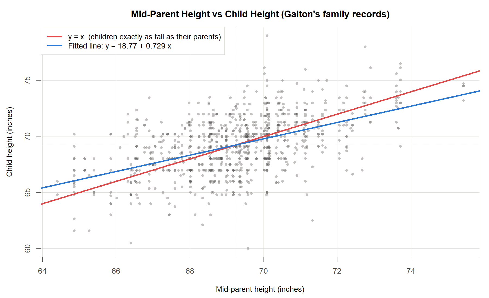
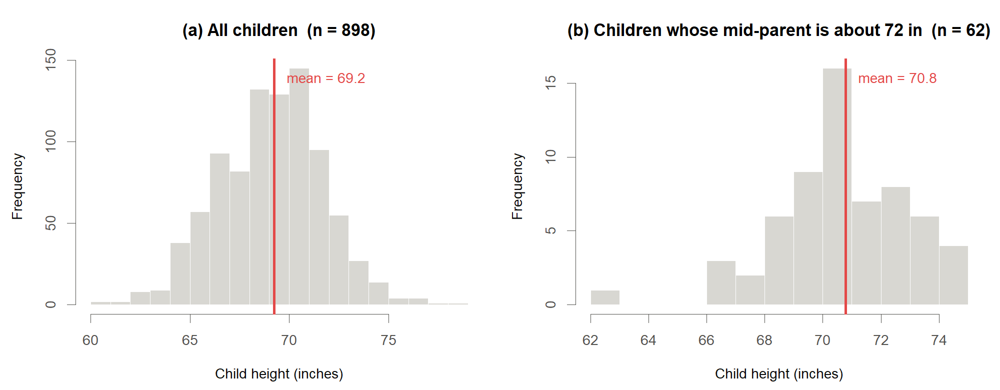
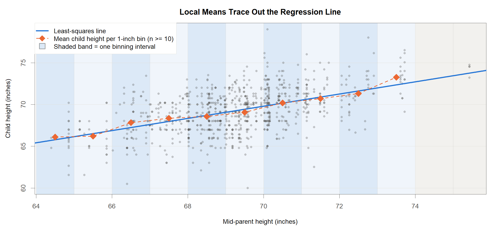
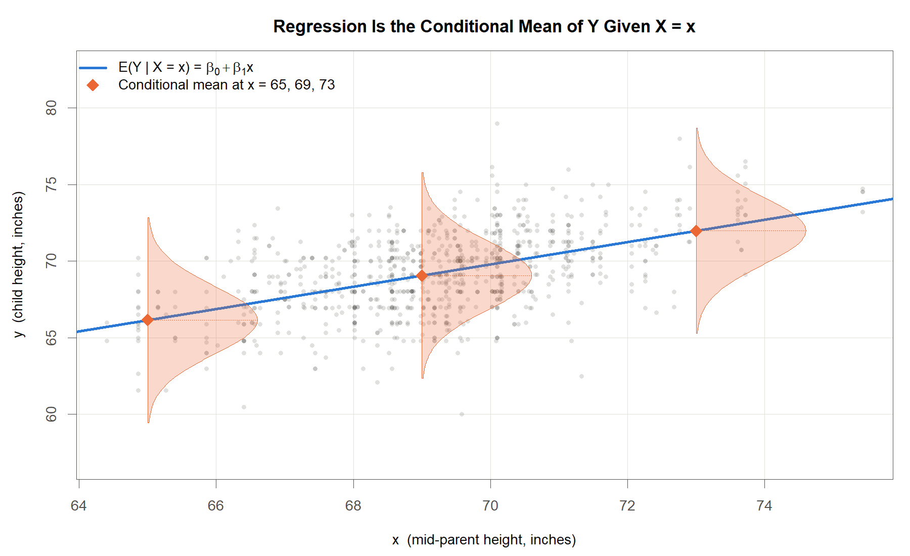
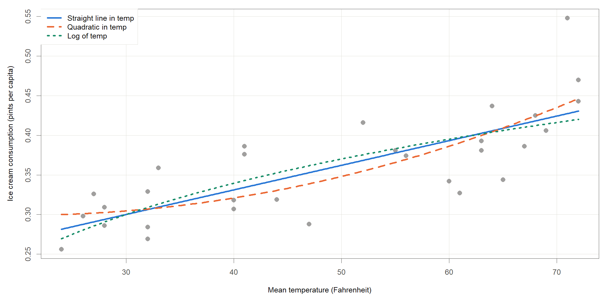
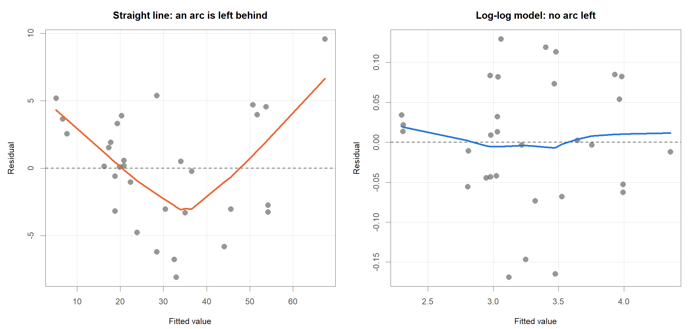

<!-- Date: 2026-08-26 | Purpose: chapter 1 of the KINS regression lecture, split from regression-lecture-note.qmd. Generated by code/agent/2026-08-26/split-chapters.py - edit the master, not this file. | File: 01-introduction.qmd -->

# Introduction

::: notes
지금부터 회귀분석 특강을 시작하겠습니다. 아마 여러분들은 연구현장에서 이미 회귀분석을 수행한 경험이 모두 있으실 것이라고 생각합니다. 현재 여기 계신 분들은 어떤 문제를 해결하기 위해 회귀분석이라는 도구를 연구 분석에 사용하고 계신가요? 

사실 회귀분석에서 사용하는 아이디어는 매우 다양한 분야에 적용되기 때문에, 통계학을 전공하지 않은 연구자들도 이미 회귀분석을 수행한 경험이 있을 수 있습니다. 특히 의학, 생명과학, 공학 분야에서 회귀분석은 두 변수 사이의 관계를 기술하고 예측하는 도구로 널리 사용되고 있고, 최근에는 인공지능과 기계학습 분야에서도 회귀분석의 아이디어가 활용되고 있습니다. 오늘 강의는 회귀분석의 기본 개념과 절차를 이해하는 데 초점을 맞추고 있습니다. 굉장히 많은 슬라이드를 준비했는데 사실 2-3시간 동안 이 내용을 모두 상세하게 다루기는 어렵기 때문에 오늘 강의는 회귀분석의 기본 개념과 절차를 이해하는 데 초점을 맞도록 하겠습니다.
:::

## 회귀분석이란

### <i class="fa-solid fa-question"></i> 연구 질문

::: {.callout-note appearance="minimal"}
<i class="fa-solid fa-circle-question"></i> **이 장의 질문**: 회귀분석이란 무엇이며, 어떤 절차로 수행하는가?
:::

::: {.callout-tip appearance="minimal"}
<i class="fa-solid fa-circle-question"></i> **연구 질문**

<ul>
<li>구리 함량과 중성자 조사량이 이 정도일 때 압력용기의 천이온도는 평균적으로 얼마나 올라가는가</li>
<li>특정 에너지 대역에서 검출기의 계수 효율은 평균 얼마인가</li>
<li>1 Gy를 받은 집단에서 암 위험도는 평균적으로 얼마나 커지는가</li>
</ul>
:::

::: {.highlight-box}
세 질문의 공통 형태: **특정 조건이 주어졌을 때의 평균**
:::

<ul>
<li>측정 반복으로는 답이 나오지 않음. 조건이 같아도 결과는 매번 다름</li>
<li>회귀분석 = 흩어짐을 인정한 채 조건과 결과의 관계를 하나의 식으로 요약</li>
</ul>

::: notes
먼저 여러분들한데 질문을 하나 드리겠습니다. 여러분들이 어떤 값을 맞혀야 하는데 아무 정보가 없다면, 상식적으로 어떤 값을 말하는 것이 최선일까요? 예를 들어 대한민국 사람의 키를 이야기 할 때 우리는 자연스럽게 전체 평균을 말합니다. 아무 정보가 없으면 170cm 정도라고 말하는 것이 최선입니다. 그런데 어떤 정보가 하나 주어지면 어떻게 될까요? 예를 들어 아버지의 키가 180cm라는 힌트를 받으면, 우리는 그 힌트에 해당하는 대상만 골라내서 그 안의 평균을 말하는 편이 낫습니다. 아버지가 180cm인 집안의 자식들의 평균 키는 전체 평균보다 조금 더 클 것입니다. 오늘 배울 내용은 방금 말씀 드린 내용을 조금 더 정밀하게 다루는 것입니다. 

슬라이드에 적어 놓은 연구 질문은 제가 주로 다루는 분야는 아니지만 인터넷 검색을 통해 본 기관과 연관성이 있을 것 같은 연구 질문을 세 가지 골라서 가져왔습니다. 

이 질문은 보시면 내용은 다르지만 한 가지 공통적인 내용을 담고 있습니다. 즉, 특정 조건이 주어졌을 때 결과의 평균을 알고 싶어 한다는 점입니다. 여기서 한 가지 질문을 드리겠습니다. 왜 평균일까요? 왜 특정 조건이 주어졌을 때 결과의 평균을 알고 싶어 하는 것일까요? 그 이유는 조건이 아무리 같아도 결과는 매번 조금씩 다르게 나오기 때문입니다. 같은 재료, 같은 조사량이라도 시험 또는 관찰 값이 변동합니다. 그래서 답 하나를 콕 집어 말할 수가 없습니다. 대신 그 흔들림의 무게중심은 우리가 해당 조건이 주어졌을 때의 평균으로 말할 수 있습니다. 즉, 회귀분석은 측정 및 관찰에서 발생할 수 있는 오차를 인정하고, 특정 조건이 주어졌을 때 결과의 평균을 추정하는 방법입니다.
:::

## 회귀의 의미 {.smaller}

### <i class="fa-solid fa-bullseye"></i> 용어의 기원

::: {.highlight-box}
회귀(regression, 回歸)는 본래 이전 상태로 되돌아감을 뜻하며, 통계학에서는 **평균(mean)으로의 회귀**을 의미

회귀분석은 변수들 사이의 함수 관계를 자료로부터 탐색
:::

::: {style="font-size: 120%; margin-top: 1em; margin-bottom: 1em;"}
| Role | Symbol | 분야별 다른 이름 |
|:---------------------------|:----:|:---------------------------------------------------------|
| **반응변수** response variable | $y$ | 종속변수(dependent), 출력변수(output), target |
| **설명변수** explanatory variable | $x$ | 독립변수(independent), 입력변수(input), 예측변수(predictor), covariate, regressor, factor, carrier |
: The two roles in a regression model, and the names used for them across fields
:::

::: {.callout-tip appearance="minimal" style="font-size: 120%"}
<i class="fa-solid fa-list-check"></i> **응용 분야**

<ul>
<li><b>자연·공학</b> &nbsp; 물리학, 화학, 공학, 기상학</li>
<li><b>생명·의학</b> &nbsp; 의학, 생물학</li>
<li><b>사회·경제</b> &nbsp; 경제학, 재무, 법학, 사회학, 심리학</li>
<li><b>교육·기타</b> &nbsp; 교육학, 스포츠과학, 역사학</li>
</ul>
:::

::: notes
아마 여러분들은 도대체 회귀라는 용어가 어떻게 유래되었는지 궁금하실 수 있을 것 같습니다. 회귀는 우리말로 직역하면 "되돌아간다" 라는 의미입니다. 그렇다면 회귀분석은 아까 전 슬라이드에서 설명 드렸던 것 처럼 단순히 특정 조건이 주어졌을 때 관심 특징의 결과를 추정하는 것과 어떤 관계가 있을까요? 통계학에서 회귀는 평균으로 되돌아간다는 의미를 가지고 있습니다. 개념 상으로는 변수들 사이의 함수 관계를 자료로부터 탐색하는 것이 회귀분석입니다. 즉, 관심이 있는 특정 변수가 다른 변수와 어떤 관계를 갖고 있고, 그 관계를 도식화 하거나 수식으로 나타내는 것이 회귀분석입니다.

그럼 여기에서 관심이 있는 특정 변수를 통계학에서는 반응변수라고 표현합니다. 이 반응변수와 관계를 갖고 있는 다른 변수를 설명변수라고 합니다. 그런데 이 두 변수의 이름이 분야마다 조금씩 다릅니다. 여기 테이블에 보시는 것 처럼 반응변수는 종속변수, 출력변수, 목표변수 등으로 불리고, 설명변수는 독립변수, 입력변수, 예측변수, 공변량(covariate), 회귀자(regressor), 요인(factor), 운반체(carrier) 등으로 불립니다. 

앞서 말씀드린 것처럼 회귀분석은 다양한 분야에서 활용되고 있습니다. 자연과학, 공학, 생명과학, 의학, 사회과학, 경제학, 교육학 등 다양한 분야에서 회귀분석이 활용되고 있습니다. 따라서 이 강의에서는 반응변수와 설명변수라는 이름을 사용하겠습니다. 

이 회귀라는 용어를 처음 사용한 사람은 진화론으로 유명한 찰스 다윈의 사촌인 프랜시스 골턴이라는 사람입니다. 아시다시피 진화론이 처음 대두되었던 1800년대 중후반은 유전학이 막 시작되던 시기였고, 이를 계기로 우생학이라는 분야가 생겨났습니다. 골턴은 우생학의 선구자이자 통계학의 선구자이기도 했습니다. 골턴은 부모와 자식의 신체적 특징이 어떻게 이어지는지에 대해 관심을 가지고 연구를 진행했습니다. 

:::

## Galton과 회귀의 기원

### <i class="fa-solid fa-chart-line"></i> 중간부모의 키와 자녀의 키

:::: {.columns style="font-size: 80%"}
::: {.column width="58%"}
{width=100%}
:::

::: {.column width="42%"}
::: {.callout-tip appearance="minimal" style="margin-top: 1.5em;"}
<i class="fa-solid fa-book"></i> **Sir Francis Galton (England, 1822-1911)**

<ul>
<li>회귀(regression)라는 이름을 처음 붙인 사람</li>
<li>부모와 자식의 신체 특성이 어떻게 이어지는지를 자료로 따져 본 사람</li>
</ul>
:::

::: {.callout-note appearance="minimal" style="margin-top: 0.6em;"}
<i class="fa-solid fa-triangle-exclamation"></i> **자료에 관한 주의**

<ul>
<li>골턴이 직접 모은 <b>가족 기록</b>. 197개 가족의 자녀 898명</li>
<li>가로축은 <b>중간부모</b> = (아버지 + 1.08 × 어머니) ÷ 2</li>
<li>빨간 선 $y=x$ 보다 파란 적합선이 <b>완만함</b></li>
<li><b>이 기울기 차이가 회귀의 근거</b></li>
</ul>
:::
:::
::::

::: {.aside}
Galton, F. (1886). Regression towards mediocrity in hereditary stature. *Journal of the Anthropological Institute of Great Britain and Ireland*, 15, 246-263. / Pearson, K. and Lee, A. (1903). On the laws of inheritance in man. *Biometrika*, 2, 357-462. All female statures (mothers and daughters) are multiplied by 1.08.
:::

::: notes
아까 프랜시스 골턴은 우생학의 선구자라고 말씀 드렸습니다. 골턴이 관심을 가졌던 질문은 인간에게서 지능과 성격, 신체적 특징이 부모로부터 자녀로 전달될까? 그리고 전달된다면 어느 정도로 전달될까? 였습니다. 골턴이 특히 관심을 가졌던 것은 천재성이 유전되는가 였었고 그 관계를 숫자와 데이터로 확인하고자 했습니다. 하지만 당시만 하더라도 지능을 측정할만한 지표가 없었기 때문에, 골턴은 지능보다는 신체적 특징을 먼저 살펴보기로 했습니다. 그 중에서도 가장 쉽게 측정할 수 있는 것이 바로 키였습니다. 키는 측정이 쉬울 뿐 아니라 성인이 되면 안정적이고 부모와 자녀 사이의 유전적 관계를 살펴보기에도 적합한 특징이었습니다.

골턴의 논문에는 205쌍의 부모와 그 부모의 자녀 928명의 키를 조사했습니다. 현재 슬라이드에 사용한 자료는 전체 205쌍 928명의 자녀가 아니라 197쌍 898명의 자녀만을 사용했습니다. 31명의 자녀는 아버지와 어머니의 키가 모두 기록되어 있지 않아서 제외했습니다. 골턴이 본인의 연구 가설을 검증하기 위해 사용한 자료로부터 제일 먼저 한 일은 어머니의 키에 1.08을 곱해서 아버지와 같은 척도로 맞춘 후 중간부모라는 값을 계산하는 것이었습니다. 예를 들어 
아버지의 키가 70인치이고 어머니의 키가 60인치라면, 중간부모는 (70 + 60*1.08)/2 = 68.4인치가 됩니다. 여기에서 골턴이 관심을 가졌던 것은 단순히 키 자체가 아니라 키가 전체 평균에서 얼마나 벗어나 있는가, 즉 편차였습니다. 예를 들어 부모세대의 전체 평균이 68 인치라고 하고 어떤 부모의 중간 부모키가 72 인치였다면, 이 부모는 평균보다 4인치 더 큰 부모입니다. 골턴의 질문은 이 부모의 자녀들들은 평균보다 얼마나 더 클까? 만약 부모의 키가 그대로 자녀에게 전달된다면, 자녀의 키도 평균보다 4인치 더 클 것입니다. 하지만 골턴은 실제로는 그렇지 않다는 것을 발견했습니다. 부모가 평균보다 4인치 더 크다면, 자녀는 평균보다 2.7인치 더 큰 정도였습니다. 만약 부모를 닮는 정도가 1이라면 키가 큰 부모의 자녀는 부모만큼 크고, 키가 작은 부모의 자녀는 부모만큼 작을 것입니다. 이렇게 되면 몇세대만 지나도 키가 극단적으로 커지거나 작아질 것입니다. 하지만 슬라이드의 그래프에서 보이는 것 처럼 빨간 선이 나타내는 1:1 대응 관계보다는 완만한 기울기를 갖는 파란 선이 나타내는 관계가 실제로 관찰되었습니다. 즉, 
실제로는 부모를 닮는 정도가 1보다 작기 때문에, 키가 큰 부모의 자녀는 부모만큼 크지는 않고, 키가 작은 부모의 자녀는 부모만큼 작지 않습니다. 그래서 평균으로 되돌아간다는 의미에서 회귀라는 이름이 붙었습니다.
:::

## 주변분포와 조건부분포 {.smaller}

### <i class="fa-solid fa-chart-line"></i> 조건에 따른 분포 이동

{width=100%}

:::: {.columns}

::: {.column width="50%"}
::: {.callout-tip appearance="minimal"}
<i class="fa-solid fa-circle-question"></i> **질문 1. 아무 정보 없이 자식 한 명의 키를 예측한다면**

전체 평균 69.2인치 = 조건을 걸지 않은 **주변분포(marginal distribution)** 의 평균 $E(Y)$

<ul>
<li>기호 $E(\cdot)$ 는 기댓값(expectation), 곧 이론적인 평균</li>
</ul>
:::
:::

::: {.column width="50%"}
::: {.callout-tip appearance="minimal"}
<i class="fa-solid fa-circle-question"></i> **질문 2. 중간부모의 키가 72인치라는 조건이 있다면**

조건을 만족하는 집단 안의 평균 = **조건부분포(conditional distribution)** 의 평균 $E(Y \mid X = 72)$

<ul>
<li>해당 구간(72 ± 0.75인치, 62명)의 표본평균: 70.8인치</li>
<li>회귀직선 $\hat y = 18.8 + 0.729\,x$ 가 $x = 72$ 일 때 71.3인치</li>
</ul>
:::
:::

::::

::: {.highlight-box}
질문 1 (marginal)에서 질문 2 (conditional)로의 전환이 회귀분석의 시작
:::

::: notes
이번에는 같은 자료를 조금 다른 각도에서 보겠습니다. 왼쪽 히스토그램은 부모가 누구인지는 전혀 따지지 않고 자녀 898명의 키만 모아 놓은 것인데, 전체 평균이 69.2인치입니다. 오른쪽은 여기에 조건을 하나 걸었습니다. 중간부모 키가 대략 72인치인 집안만 골라낸 것이니, 왼쪽 그림에서 세로로 얇은 조각을 하나 잘라 낸 셈입니다. 그런데 이 조각 안의 평균은 70.8인치로 올라가 있습니다. 무엇이 달라진 것일까요? 조건을 하나 걸었더니 분포가 통째로 옮겨 간 것입니다.

이것을 예측 문제로 바꾸어 보겠습니다. 아무 정보 없이 자녀 한 명의 키를 맞혀야 한다면 아까 말씀 드린 것 처럼 전체 평균인 69인치를 말하는 것이 최선입니다. 그런데 중간부모가 72인치라는 힌트를 받고도 여전히 69인치라고 답하시겠습니까? 아마 70인치대 초반으로 고쳐 말씀하시는 편이 나을 것입니다. 즉, 앞에서 말씀드린 조건부 평균이 바로 이런 상황을 말합니다.

여기에서 숫자가 두 개 나오는데 이 둘은 구분해 두시면 좋겠습니다. 구간 안에 실제로 들어온 자녀들의 평균이 70.8인치이고, 자료 전체로 그은 직선에서 읽은 값이 71.3인치입니다. 앞의 값은 62명만 평균 낸 것이라 흔들림이 있고, 뒤의 값은 자녀 898명 전체를 사용해서 그은 선 위에서 읽은 값입니다.
:::

## 국소평균과 회귀직선 {.fig-led}

### <i class="fa-solid fa-chart-line"></i> 조건의 세분화

{width=100% .nostretch}

::: {.callout-tip appearance="minimal"}
<ul>
<li>중간부모 키를 <b>1인치 구간</b>으로 나누어 조건이 여러 개로 확장</li>
<li>구간마다 구한 자녀 키의 평균은 <b>국소평균(local mean)</b></li>
<li>관측이 10명 미만인 구간(회색 띠)은 평균의 흔들림이 커서 제외</li>
</ul>
:::

::: {.highlight-box}
국소평균들이 거의 하나의 직선 위에 놓임 $\rightarrow$ **최소제곱 회귀직선**
:::

::: notes
조건을 하나만 걸면 점이 하나만 찍히기 때문에, 그 점이 우연인지 아닌지 알 수가 없습니다. 그래서 이번에는 조건을 여러 개로 늘려 보겠습니다. 중간부모 키를 1인치 단위로 잘라 칸을 여러 개 만들고, 각 칸에 속한 자녀들의 평균 키를 하나씩 구했습니다. 슬라이드 그림에서 주황색 마름모가 그 값이고, 이것을 국소평균이라고 부릅니다.

결과가 어떻게 나왔을까요? 따로따로 계산한 이 평균들이 흩어지지 않고 거의 일직선 위에 줄을 서 있습니다. 파란 직선은 자료 전체에 맞춘 회귀직선인데 마름모들 사이를 잘 지나가고 있습니다. 즉, 조건부 평균이 중간부모 키에 따라 직선으로 움직인다는 뜻입니다. 회귀직선을 왜 직선으로 그리는지, 그리고 그 직선이 무엇을 이어 놓은 선인지를 한 장으로 보여 주는 그림입니다.
:::

## 회귀의 정의 {.smaller}

### <i class="fa-solid fa-bullseye"></i> 정의

::: {.highlight-box}
**회귀(regression)** 란 설명변수 $X = x$ 가 주어졌을 때 반응변수 $Y$ 의 조건부 기댓값이다.
$$E(Y \mid X = x)$$
:::

:::: {.columns style="font-size: 90%; margin-top: 1em;"}
::: {.column width="55%"}
{width=100%}
:::

::: {.column width="45%"}
<ul>
<li>$Y$: 반응변수</li>
<li>$X$: 설명변수</li>
<li>$x$: 설명변수가 갖는 특정한 값 하나</li>
<li>$E(Y \mid X = x)$: $X = x$ 일때 조건부 평균</li>
</ul>

::: {.callout-tip appearance="minimal" style="font-size: 120%"}
<i class="fa-solid fa-chart-line"></i> **그림 읽는 법**

<ul>
<li>각 $x$ 마다 $Y$ 의 분포가 하나씩 존재</li>
<li>그 분포의 중심이 회귀직선 위에 위치</li>
<li>회귀직선은 그 중심들을 이은 선</li>
</ul>
:::
:::
::::

:::{.callout-note appearance="minimal" style="font-size: 120%; margin-top: 1em; margin-bottom: 1em;"}
두 변수가 함께 종 모양의 좌우대칭 분포(이변량 정규분포)를 이루면, 이 조건부 기댓값은 정확히 직선
:::

::: notes
오늘 강의를 한 문장으로 나타낸다면 이렇게 말할 수 있습니다. 회귀란 설명변수가 특정 값으로 주어졌을 때 반응변수의 평균입니다. 조건부 기댓값이라는 다소 어려운 이름이 붙어 있지만, 그 뜻은 방금 히스토그램에서 보신 그대로 조건을 걸고 나서 구한 평균입니다.

그림을 보시면 파란 직선 위에 종 모양 곡선이 세 개 얹혀 있습니다. 각각 중간부모 키가 65인치, 69인치, 73인치일 때 자녀의 키가 어떻게 퍼지는지를 나타낸 것입니다. 그런데 세 곡선의 봉우리가 모두 파란 직선 위에 정확히 올라앉아 있습니다. 즉, 회귀직선은 바로 이 봉우리들을 이어 놓은 선입니다.

방금 종 모양이라는 말을 썼는데, 평균을 중심으로 좌우가 대칭이고 가운데가 가장 높은 이 모양을 정규분포라고 부릅니다. 두 변수가 함께 이 모양을 이루면 봉우리들이 정확히 직선을 이룬다는 사실이 수학적으로 증명되어 있습니다. 앞으로 회귀라는 말이 나올 때마다 머릿속에서 이 그림으로 돌아오시면 좋겠습니다.
:::

## 회귀모형과 선형회귀모형 {.smaller}

### <i class="fa-solid fa-bullseye"></i> 회귀모형 (regression model)

::: {.callout-tip appearance="minimal" style="font-size: 120%; margin-top: 1em; margin-bottom: 1em;"}
$$X_1, \; X_2, \; \dots, \; X_p \;\; \longrightarrow \;\; Y, \qquad Y = f(X_1, X_2, \dots, X_p) + \varepsilon$$

<ul>
<li>$Y$: 반응변수</li>
<li>$X_1, \dots, X_p$: $p$ 개의 설명변수</li>
<li>$\varepsilon$: 확률오차(random error)</li>
<li>$f$: 설명변수 값이 주어졌을 때 $Y$ 의 조건부 평균, 곧 $f(x) = E(Y \mid X = x)$</li>
</ul>
:::

### <i class="fa-solid fa-bullseye"></i> 선형회귀모형 (linear regression model)

::: {.callout-tip appearance="minimal" style="font-size: 120%; margin-top: 1em; margin-bottom: 1em;"}
$$Y = \beta_0 + \beta_1 X_1 + \beta_2 X_2 + \dots + \beta_p X_p + \varepsilon$$

<ul>
<li>$\beta_0, \beta_1, \dots, \beta_p$: 회귀모수(regression parameters), 회귀계수(coefficients)</li>
<li>$f$ 의 모양을 모르므로 <b>가장 단순한 형태</b>인 일차식으로 가정</li>
</ul>
:::

::: {.callout-note appearance="minimal" style="font-size: 120%"}
<i class="fa-solid fa-circle-info"></i> **Remark**

<ul>
<li>회귀모수 = 자료에서 추정해야 할 <b>미지의 상수(unknown constants)</b></li>
<li>자료가 바뀌면 추정값은 바뀌나, 추정 대상인 모수 자체는 고정</li>
</ul>
:::

::: notes
방금 정의한 조건부 평균에 이름을 붙여 함수 f라고 쓰겠습니다. 그러면 반응변수는 이 함수에 오차를 더한 것으로 적을 수 있습니다. f가 신호이고 엡실론이 잡음이라고 생각하시면 됩니다. 즉, 우리가 얻는 관측값은 항상 신호와 잡음의 합입니다.

그런데 문제는 f의 모양을 우리가 모른다는 점입니다. 세상의 모든 함수를 다 시도해 볼 수는 없기 때문에, 가장 단순한 모양부터 가정해 보는 것이 자연스럽습니다. 그 단순한 모양이 각 설명변수에 계수를 곱해서 더하는 형태이고, 이것을 선형회귀모형이라고 부릅니다.

여기 등장하는 베타들은 우리가 모르는 값입니다. 그렇지만 자료를 새로 뽑는다고 해서 변하지는 않는 고정된 상수입니다. 자료마다 다르게 얻는 것은 그 상수에 대한 추정값이지 상수 자체가 아닙니다. 이 구분은 오늘 뒤에서 계속 필요하니 꼭 기억해 주시기 바랍니다.
:::

## Galton 자료: 모형 적합 {.smaller}

### <i class="fa-solid fa-table"></i> 결과

::: {style="font-size: 110%; width: 72%; margin: 1em auto;"}
| Term | Estimate | SE | $t$ value | $p$-value |
|:---------------------------------------|--------------:|------------:|---------------:|---------------:|
| (Intercept) $\hat\beta_0$ | 18.8 | 2.84 | 6.61 | < 0.001 |
| $x$ (mid-parent height) $\hat\beta_1$ | 0.729 | 0.0410 | 17.8 | < 0.001 |

: Least-squares fit of child's height on mid-parent height, n = 898, from Galton's family records.
:::

::: {style="font-size: 110%; margin-top: 1em; margin-bottom: 1em;"}
| Source | Df | Sum Sq | Mean Sq | $F$ value | $p$-value |
|:---|---:|---:|---:|---:|---:|
| $x$ | 1 | 1575 | 1575 | 316 | < 0.001 |
| Residuals | 896 | 4469 | 4.99 | n.a. | n.a. |

: Analysis of variance for the fitted simple linear model. R-squared = 0.261, residual SD = 2.23 inches.
:::

### <i class="fa-solid fa-table"></i> **표의 용어**

::: {.callout-note appearance="minimal" style="font-size: 120%; margin-top: 1em; margin-bottom: 1em;"}

<ul>
<li>표준오차(SE): 같은 조사를 되풀이할 때 추정값이 얼마나 흔들리는지를 재는 값</li>
<li>$t$ 값: 추정값을 그 표준오차로 나눈 값. 절댓값이 클수록 추정값이 0에서 멀다</li>
<li>$p$ 값: 참값이 0이라고 할 때, 지금 자료에서 나온 것만큼 크거나 더 큰 값이 우연히 나올 확률</li>
</ul>

**Preliminary Knowledge** 참고
:::

::: notes
방금 세운 모형을 골턴의 자료에 실제로 맞춘 결과입니다. 위 표에서 두 줄만 보시면 됩니다. 절편이 18.8이고 기울기가 0.729입니다. 그러면 기울기 0.729는 무슨 뜻일까요? 중간부모 키가 1인치 더 큰 집안으로 옮겨 가면 자녀 키의 평균은 0.729인치만 더 크다는 뜻입니다. 1인치를 그대로 따라오는 것이 아니라 4분의 3 정도만 따라옵니다. 바로 이 현상 때문에 골턴이 회귀, 곧 평균으로 되돌아간다는 이름을 붙였습니다. 즉, 키가 큰 부모의 자녀는 여전히 큰 편이지만 부모만큼은 아니고 전체 평균 쪽으로 조금 끌려오는 것입니다.

아까 골턴이 발표한 값이 3분의 2라고 말씀 드렸는데, 이 표의 0.729는 그 값과 같은 계열의 숫자입니다. 골턴이 사용한 계산 방법과 오늘 우리가 쓰는 최소제곱법이 다르기 때문에 두 값이 정확히 같지는 않습니다. 그런데 여기에서 한 가지 더 확인해 보실 것이 있습니다. 만약 설명변수를 중간부모가 아니라 아버지 한 사람의 키로 바꾸면 어떻게 될까요? 같은 파일로 계산해 보면 기울기가 0.448까지 내려갑니다. 왜 이렇게 차이가 날까요? 중간부모는 두 사람을 평균한 값이라 개인차가 상쇄되어 정보가 더 정확하고, 그만큼 자녀의 키를 더 강하게 끌어당기기 때문입니다. 즉, 설명변수를 무엇으로 두느냐가 기울기를 바꾼다는 뜻입니다.

나머지 칸의 용어는 아래 상자에 풀어 두었습니다. 표준오차는 이 추정값이 얼마나 흔들리는 값인지를 알려 줍니다. t 값은 추정값을 그 흔들림으로 나눈 것이니, 흔들림에 비해 추정값이 얼마나 큰지를 재는 셈입니다. p 값은 기울기가 사실은 0인데 우연히 이런 결과가 나올 확률인데 0.001보다도 작습니다. 즉, 우연으로 보기는 어렵다는 뜻입니다. 아래 표는 전체 변동을 직선으로 설명된 부분과 남은 부분으로 쪼갠 것인데, 자세한 해석은 Simple Linear Regression 장에서 하겠습니다.
:::

## 회귀분석의 8단계 {.smaller .fig-led}

### <i class="fa-solid fa-list-check"></i> 전체 흐름

{width=100% .nostretch}

::: {.callout-tip appearance="minimal" style="font-size: 150%; margin-top: 1em; margin-bottom: 1em;"}
<i class="fa-solid fa-bullseye"></i> **1단계, 연구 가설과 문제 설정이 가장 중요**
:::

::: notes
이제 절차로 넘어가겠습니다. 회귀분석은 여덟 단계로 정리할 수 있는데, 순서를 외우실 필요는 없고 화면의 세 덩어리만 보시면 됩니다. 왼쪽 파란 묶음은 자료를 만들기 전의 일이고, 가운데 초록 묶음은 모형을 세우고 맞추는 일이고, 오른쪽 주황 묶음은 검증하고 사용하는 일입니다.

여기에서 제가 강조하고 싶은 것은 1단계입니다. 연구 현장에서 분석이 실패하는 가장 흔한 이유가 무엇일까요? 계산을 틀려서가 아니라 애초에 답하려는 질문이 흐릿했기 때문인 경우가 많습니다. 무엇을 알고 싶은지가 한 문장으로 나오지 않으면 어떤 기법을 쓰더라도 소용이 없습니다. 즉, 목적지를 정하지 않고 출발하면 아무리 빨리 달려도 도착할 수 없는 것과 같습니다.

그리고 이 여덟 단계는 직선이 아니라 고리라는 점도 함께 봐 주시면 좋겠습니다. 화면 아래를 크게 돌아 올라가는 주황 점선이 있는데, 7단계 검증에서 문제가 나오면 이 화살표를 따라 4단계 모형 설정으로 되돌아가서 다시 내려옵니다. 파란 화살표만 있는 일방통행이 아니라는 뜻입니다.
:::

## 1·2단계: 연구 질문과 변수 선택 {.smaller}

### <i class="fa-solid fa-circle-question"></i> 예시: 기온과 판매량

::: {.callout-note appearance="minimal" style="font-size: 120%; margin-top: 1em; margin-bottom: 1em;"}
### <i class="fa-solid fa-pen-to-square"></i> **1단계: 문제의 진술**

<ul>
<li>답해야 할 질문을 한 문장으로 확정: <b>기온이 오르면 1인당 소비량의 평균이 올라가는가</b></li>
<li>묻는 대상은 개별 소비량이 아니라 <b>평균</b>. 같은 기온의 기간이 여러 번 있어도 소비량은 매번 다름</li>
</ul>
:::

:::{.callout-note appearance="minimal" style="font-size: 120%; margin-top: 1em; margin-bottom: 1em;"}
### <i class="fa-solid fa-list-check"></i> **2단계: 관련 변수의 선택** 

- 기온만으로 충분한가? 
- 소비량에 영향을 줄 수 있는 다른 요인이 있을까? 
:::

:::{style="font-size: 120%; margin-top: 1em; margin-bottom: 1em;"}
| 요인 | 변수 | 유형 | 함께 재는 이유 |
|:--|:--|:--|:--|
| 날씨 | `temp` 평균기온 | 양적 | 질문의 주인공 |
| 가격 | `price` 아이스크림 가격 | 양적 | 비싸지면 덜 사 먹을 것 |
| 소득 | `income` 가족 월수입 | 양적 | 여유가 있으면 더 사 먹을 것 |
| 시기 | `year` 관측 연차 | 질적 | 해가 바뀌며 생긴 전반적 변화 |

: Candidate drivers of ice cream consumption, and the reason each one was collected
:::

::: notes
여덟 단계를 말로만 들으면 손에 잡히지 않습니다. 그래서 자료를 하나 골라서 끝까지 끌고 가 보겠습니다. 오늘 강의 내내 따라다닐 아이스크림 소비량 자료입니다.

1단계는 무엇을 알고 싶은가입니다. 질문은 날씨가 더워지면 아이스크림이 정말 더 팔릴까 하는 것입니다. 소박해 보이지만 이 한 문장을 정확히 적는 일이 분석의 출발점입니다. 여기서 한 가지만 짚고 가겠습니다. 우리가 묻는 것은 개별 소비량이 아니라 평균입니다. 왜 평균일까요? 기온이 똑같이 20도인 기간이 여러 번 있어도 소비량은 매번 다르게 나오기 때문입니다. 그러니 20도일 때 얼마나 팔리느냐가 아니라, 20도일 때 평균 얼마나 팔리느냐를 묻는 것입니다. 즉, 앞에서 정의한 조건부 기댓값이 바로 이 질문의 형태입니다.

다음은 2단계입니다. 기온만 재면 될까요? 잠깐만 생각해 보아도 그렇지 않습니다. 예를 들어 아이스크림 값이 오르면 덜 사 먹을 것이고, 주머니 사정이 넉넉하면 더 사 먹을 것입니다. 해가 바뀌면서 입맛이나 유행이 달라졌을 수도 있습니다. 그래서 표에 있는 네 가지를 함께 재기로 했습니다. 기온, 가격, 소득, 그리고 몇 년째인지입니다.

여기에서 순서를 눈여겨봐 주시기 바랍니다. 자료를 먼저 모아 놓고 무엇을 넣을까 고민한 것이 아니라, 무엇이 소비량을 바꿀 만한지 먼저 따져 보고 그것을 재러 나간 것입니다. 마지막 연차는 성격이 조금 다릅니다. 0, 1, 2라는 숫자가 붙어 있지만 크기를 재는 값이 아니라 종류를 나누는 값이기 때문입니다. 이런 변수를 어떻게 다루는지는 가변수 장에서 따로 배우겠습니다.
:::

## 3단계 자료 수집: 아이스크림 자료 {.smaller}

### <i class="fa-solid fa-table"></i> 30개 기간, 변수 6개

:::: {.columns}

::: {.column width="38%"}

| period | IC | price | income | temp | year |
|---:|---:|---:|---:|---:|---:|
| 1 | 0.386 | 0.270 | 78 | 41 | 0 |
| 2 | 0.374 | 0.282 | 79 | 56 | 0 |
| 3 | 0.393 | 0.277 | 81 | 63 | 0 |
| 4 | 0.425 | 0.280 | 80 | 68 | 0 |
| 5 | 0.406 | 0.272 | 76 | 69 | 0 |
| 6 | 0.344 | 0.262 | 78 | 65 | 0 |

: First six of the n = 30 four-week periods

:::

::: {.column width="3%"}
&nbsp;
:::

::: {.column width="59%"}

| Variable | Symbol | 설명 (단위) | Range | 역할 |
|:--|:--|:--|--:|:--|
| period | | 기간 번호 | 1 – 30 | 식별자 |
| IC | $y_i$ | 섭취량 (pint) | 0.256 – 0.548 | 반응변수 |
| price | $x_{i1}$ | 가격 (dollar) | 0.260 – 0.292 | 설명변수 |
| income | $x_{i2}$ | 월수입 (dollar) | 76 – 96 | 설명변수 |
| temp | $x_{i3}$ | 평균기온 ($^\circ$F) | 24 – 72 | 설명변수 |
| year | | 연차 (0, 1, 2) | 0 – 2 | 질적 설명변수 |

: Variables of the ice cream consumption data

:::

::::

- 행 = 관측(4주 단위의 한 기간), 
- 열 = 변수. 관측 하나는 네 값의 묶음 $(y_i,\;x_{i1},\;x_{i2},\;x_{i3})$, $i=1,\dots,30$
- $y$ 는 IC, $x_1,x_2,x_3$ 은 각각 price, income, temp 를 가리킴

### <i class="fa-solid fa-triangle-exclamation"></i>  **주의 사항**

::: {.callout-note appearance="minimal" style="font-size: 120%; margin-top: 1em; margin-bottom: 1em;"}

- `year` 는 계절이 아니라 **관측 연차**(0, 1, 2). 30개 기간이 세 해에 걸쳐 수집되었음을 뜻함. 
-  숫자처럼 보이지만 종류를 나누는 변수라 변수 처리 필요 $\rightarrow$ **Dummy Variable**
:::

::: notes
오늘 강의에서 예제로 계속 사용할 자료입니다. 실생활과 관련한 간단한 예제라 회귀분석을 소개하는 강의에서 매우 널리 쓰이는 자료 가운데 하나입니다.

왼쪽이 자료의 앞 다섯 줄입니다. 가로 한 줄이 4주짜리 기간 하나이고, 이런 기간이 모두 30개 있습니다. 세로 한 칸은 변수 하나이고, 오른쪽 표에 그 여섯 열이 각각 무엇인지 정리해 두었습니다. 우리가 알고 싶은 값은 아이스크림 섭취량이고 단위는 파인트입니다. 이것을 설명할 재료로는 가격, 가족의 월수입, 평균기온을 사용합니다. 즉, 관측 하나는 네 값의 묶음이고, $y$ 라고 쓰면 아이스크림 섭취량, $x$ 에 아래첨자 1, 2, 3이 붙으면 각각 가격, 수입, 기온을 가리킵니다.

마지막 year는 조심하셔야 합니다. 우리가 흔히 쓰는 연도가 아니라 조사 연차를 뜻하며 0, 1, 2 세 값을 갖습니다. 숫자처럼 보이지만 사실은 종류를 나누는 변수라서 그대로 넣으면 안 됩니다. 어떻게 넣는지는 Dummy Variable 장에서 다루겠습니다.
:::

## 변수의 유형

### <i class="fa-solid fa-bullseye"></i> 양적 변수와 질적 변수

::: {.callout-tip appearance="minimal" style="margin-bottom: 0.9em"}
<ul style="margin: 0; padding-left: 1.5em; font-size: 0.88em">
<li style="margin-bottom: 0.55em"><b>양적 변수</b>(quantitative): 수치로 측정되는 변수
<ul style="margin: 0.15em 0 0 0; padding-left: 1.4em; font-size: 0.95em">
<li>일반 예: 가격, 소득, 기온, 조사량</li>
<li>아이스크림 자료: <code>price</code>, <code>income</code>, <code>temp</code></li>
</ul>
</li>
<li><b>질적 변수</b>(qualitative): 범주로 측정되는 변수
<ul style="margin: 0.15em 0 0 0; padding-left: 1.4em; font-size: 0.95em">
<li>일반 예: 제품 형태(용접재/판재/단조재), 성별(남/여)</li>
<li>아이스크림 자료: <code>year</code></li>
<li>지시변수(indicator) 또는 가변수(dummy variable)로 바꾸어 모형에 넣음</li>
</ul>
</li>
</ul>
:::

::: {style="margin-bottom: 1.0em"}

::: {.highlight-box}
회귀분석에서 **반응변수는 양적**, **설명변수는 양적 또는 질적** 모두 가능.
:::

:::

### <i class="fa-solid fa-circle-info"></i> 참고: 변수 유형별 모형의 이름 {style="margin-top: 0.6em"}

| Method | 반응변수 | 설명변수 |
|:---|:---|:---|
| 분산분석 (analysis of variance) | 양적 | 질적 |
| 공분산분석 (analysis of covariance) | 양적 | 양적, 질적 혼합 |
| 로지스틱회귀 (logistic regression) | 질적 (보통 이항) | 양적, 질적 |

: Special names for regression models by the type of the response and the predictors.

::: notes
방금 본 아이스크림 자료의 열을 다시 보겠습니다. 기온, 가격, 소득은 숫자로 재는 값입니다. 그런데 마지막 year는 0, 1, 2라는 숫자가 붙어 있어도 크기를 재는 값이 아닙니다. 1년째와 2년째 사이의 간격이 얼마라고 말할 수 없기 때문입니다. 즉, 종류를 나누는 값일 뿐입니다.

변수는 이렇게 두 종류로 나뉩니다. 숫자로 재는 양적 변수와 종류를 나누는 질적 변수입니다. 기온이나 가격은 양적 변수이고, 제품 형태나 합격 여부는 질적 변수입니다. 질적 변수도 회귀모형에 넣을 수 있는데, 다만 그대로는 넣지 못하고 0과 1로 바꾸어 넣습니다. 이것을 가변수라고 부르고, 뒤에서 따로 한 장을 할애해서 다루겠습니다.

여기에서 기억해 두실 것은 한 줄입니다. 회귀분석에서 반응변수는 반드시 양적 변수여야 하고, 설명변수 쪽은 양적이든 질적이든 상관없다는 것입니다.

아래 표는 참고로만 보시면 되고 오늘 다루는 내용은 아닙니다. 다만 여러분들이 통계학에서 다른 이름으로 배우셨던 방법들이, 알고 보면 변수의 유형을 어떻게 조합하느냐에 따라 붙은 이름일 뿐이라는 점은 알아 두시면 도움이 됩니다. 예를 들어 설명변수가 전부 질적이면 분산분석, 양적과 질적이 섞여 있으면 공분산분석이라고 부르고, 반응변수가 질적이면 로지스틱 회귀가 됩니다. 즉, 이름은 달라 보여도 뿌리는 하나입니다.
:::

## 4단계 모형 설정: 선의 후보 {.smaller .fig-led}

:::{style="font-size: 120%; margin-top: 0.6em; margin-bottom: 1em; font-weight: bold"}
<i class="fa-solid fa-circle-question"></i> 같은 산점도 위에 그을 수 있는 선은 무한함
:::

::: {.callout-tip appearance="minimal" style="margin-bottom: 0.6em; font-size: 120%"}

<ul style="margin-bottom: 0">
<li style="margin-bottom: 0.15em"><b>직선</b> $E(\text{IC}\mid \text{temp}) = \beta_0 + \beta_1\,\text{temp}$: 기온이 1도 오를 때마다 소비량의 평균이 <b>늘 같은 폭</b>으로 증가</li>
<li style="margin-bottom: 0.15em"><b>곡선, 이차항</b> $\beta_0 + \beta_1\,\text{temp} + \beta_2\,\text{temp}^2$: 어느 기온부터 증가가 <b>완만해지거나 꺾임</b></li>
<li><b>곡선, 로그</b> $\beta_0 + \beta_1 \log(\text{temp})$: 낮은 기온에서 민감하고 높은 기온에서 둔해짐</li>
</ul>
:::

{width=100% .nostretch}

::: notes
여기서 잠깐 멈추어 보겠습니다. 자료는 손에 들어왔습니다. 서른 개 기간에 대한 소비량과 기온과 가격과 소득이 있습니다. 이제 여러분들이 분석자라고 생각해 보시기 바랍니다. 무엇부터 정하시겠습니까?

4단계는 모형 설정입니다. 기온이 올라가면 소비량이 올라간다고 했는데, 그러면 그 관계를 어떤 모양으로 그리시겠습니까? 화면에 후보를 세 가지 적어 두었습니다.

첫째는 직선입니다. 기온이 1도 오를 때마다 소비량 평균이 늘 같은 폭으로 늘어난다는 뜻입니다. 예를 들어 20도에서 21도로 갈 때나 30도에서 31도로 갈 때나 증가 폭이 똑같다는 이야기인데, 과연 그럴까요?

둘째는 이차항을 넣은 곡선입니다. 어느 기온을 넘어서면 더는 늘지 않거나 오히려 줄어드는 모양을 그릴 수 있습니다. 너무 더우면 밖에 나가지 않을 테니까요.

셋째는 로그를 씌운 곡선입니다. 서늘할 때는 1도만 올라도 많이 늘고, 이미 더운 상태에서는 1도 더 올라 봐야 별 차이가 없는 모양입니다.

정답을 지금 말씀드리지는 않겠습니다. 여러분들이라면 어느 쪽을 고르시겠습니까? 잠깐 생각해 보시기 바랍니다.

아직 정하지 않은 것이 더 있습니다. 기온 하나만 쓰시겠습니까? 앞에서 힘들게 모은 가격과 소득은 어떻게 하시겠습니까? 그리고 연차 변수, 숫자가 아니라 종류를 나누는 그 변수는 어떤 형태로 집어넣어야 할까요?

아래 그림을 보시면 서른 개 점 위에 방금 말씀드린 세 모양을 실제로 얹어 놓았습니다. 파란 실선이 직선, 주황 파선이 이차항, 초록 점선이 로그입니다. 어느 것이 맞아 보이십니까?

사실 눈으로는 고를 수가 없습니다. 세 곡선이 자료가 있는 구간 안에서는 거의 붙어 있기 때문입니다. 이 대목에서 제가 드리고 싶은 말씀이 바로 그것입니다. 모양을 눈대중으로 고를 수는 없고, 어느 것이 더 낫다고 말하려면 좋고 나쁨을 재는 잣대가 먼저 있어야 합니다. 즉, 그 잣대를 정하는 일이 5단계이고 조금 뒤에 나옵니다.

한 가지만 주의를 드리겠습니다. 세 곡선이 붙어 있는 것은 자료가 있는 구간, 그러니까 화씨 24도에서 72도 사이에서만 그렇습니다. 그 바깥으로 나가면 세 곡선은 전혀 다른 방향으로 갈라집니다. 자료 범위를 벗어난 예측을 조심하라는 말이 이래서 나오는 것입니다.

마지막으로 한 가지만 미리 답을 드리겠습니다. 곡선으로 적합하셔도 그것은 여전히 선형모형입니다. 지금은 말이 안 되는 것처럼 들리실 텐데, 왜 그런지는 다음 슬라이드에서 보겠습니다.
:::

## 4단계 모형 설정: 모형의 분류 {.smaller}

### <i class="fa-solid fa-bullseye"></i> 분류의 세 기준

::: {style="margin: 0.6em 0 1.7em 0"}
4단계는 $E(Y \mid X = x)$ 를 **어떤 형태의 식으로 적을지** 정하는 일. 아이스크림 자료에서 고른 일차식은 여러 선택지 중 하나이며, 모형은 아래 세 기준으로 나뉨
:::

::: {#model-class-table style="font-size: 110%; margin-bottom: 2.2em"}
| 무엇을 보는가 | 부르는 이름 | 판정하는 방법 |
|:--------------------|:----------------------|:------------------------------------------------------------|
| 모수가 들어간 방식 | 선형 / 비선형 linear / nonlinear | $\beta_j$ 가 설명항에 **곱해져 더해지면** 선형, 아니면 비선형 |
| 설명항의 개수 | 단순 / 다중 simple / multiple | 모형에 들어간 설명항이 하나면 단순, 둘 이상이면 다중 |
| 반응변수의 개수 | 일변량 / 다변량 univariate / multivariate | 좌변의 $Y$ 가 하나면 일변량, 둘 이상이면 다변량 |

: Three criteria for classifying a regression model.
:::

### <i class="fa-solid fa-triangle-exclamation"></i> **주의 사항**

::: {.callout-note appearance="minimal" style="font-size: 110%"}

<ul style="margin-bottom: 0">
<li style="margin-bottom: 0.5em">선형인지는 <b>그래프 모양이 아니라 $\beta_j$ 가 들어간 방식</b>으로 판정. 곡선을 그려도 선형모형일 수 있음</li>
<li style="margin-bottom: 0.5em">$\log X$, $X^2$ 처럼 변환한 항은 <b>각각 별개의 설명항</b>으로 간주</li>
<li>따라서 단순과 다중은 원변수의 개수가 아니라 <b>모형에 들어간 항의 개수</b>로 가름</li>
</ul>
:::

::: notes
아까 4단계가 모형 설정이라고 말씀드렸습니다. 그런데 모형을 세운다는 것이 구체적으로 무엇을 정하는 일일까요? 조건부 기댓값을 어떤 형태의 식으로 적을지 정하는 일입니다. 아이스크림 자료에서는 일차식을 골랐습니다만, 고를 수 있는 형태가 그것뿐일 리는 없습니다.

그래서 모형을 세 가지 잣대로 나누어 보겠습니다. 첫째는 선형이냐 아니냐입니다. 여기에서 오해가 가장 많이 생기는데, 선형이라는 말은 그림이 직선이라는 뜻이 아닙니다. 모수 베타가 들어가는 방식이 곱하고 더하는 형태냐를 묻는 것입니다. 둘째 잣대는 모형에 들어간 설명항이 몇 개냐이고, 셋째 잣대는 반응변수가 몇 개냐입니다. 설명항이 하나면 단순, 둘 이상이면 다중이라고 부르고, 반응변수가 하나면 일변량, 여럿이면 다변량이라고 부릅니다.

여기에 단서를 하나 달아 두겠습니다. 같은 원변수를 변환한 항도 별개의 설명항으로 셉니다. 예를 들어 로그를 씌운 항과 제곱을 한 항이 각각 하나씩입니다. 이 약속을 다음 슬라이드의 여섯 문제에 그대로 적용해 보시기 바랍니다.
:::

## 모형의 분류: 연습

### <i class="fa-solid fa-question"></i> 모형 6개 분류

<ol>
<li>$Y = \beta_0 + \beta_1 X_1 + \varepsilon$</li>
<li>$Y = \beta_0 + e^{\beta_1 X_1} + \varepsilon$</li>
<li>$Y = \beta_0 + \beta_1 X_1 + \beta_2 X_2 + \varepsilon$</li>
<li>$Y_1 = \beta_0 + \beta_1 X_1 + \beta_2 X_2 + \varepsilon_1$ 이고 $Y_2 = \gamma_0 + \gamma_1 X_1 + \gamma_2 X_2 + \varepsilon_2$</li>
<li>$Y = \beta_0 + \beta_1 \log X_1 + \varepsilon$</li>
<li>$Y = \beta_0 + \beta_1 X + \beta_2 X^2 + \varepsilon$</li>
</ol>

::: {.callout-tip appearance="minimal"}
판정 순서: 선형성 → 설명항의 개수 → 반응변수의 개수
:::

::: notes
이번에는 여러분들이 직접 해 보실 차례입니다. 여섯 개 모형을 앞의 세 기준으로 하나씩 판정해 보시기 바랍니다. 순서를 정해 두시면 헷갈리지 않습니다. 먼저 베타가 어디에 어떻게 들어가 있는지를 보고 선형인지 비선형인지 정하고, 그다음 더해진 설명항이 몇 개인지 세고, 마지막으로 좌변의 반응변수가 몇 개인지 보시면 됩니다.

2번을 특히 눈여겨보시기 바랍니다. 베타 1이 어디에 앉아 있습니까? 지수 안에 갇혀 있습니다. 6번도 함정입니다. 원변수는 X 하나뿐인데 항은 몇 개일까요? 30초 드리겠습니다.
:::

## 모형의 분류: 정답과 해설

### <i class="fa-solid fa-circle-check"></i> 판정 결과

| 기준 | 해당 모형 |
|:---|:---|
| 선형 (linear) | 1, 3, 4, 5, 6 |
| 비선형 (nonlinear) | 2 |
| 단순 (simple) | 1, 2, 5 |
| 다중 (multiple) | 3, 4, 6 |
| 일변량 (univariate) | 1, 2, 3, 5, 6 |
| 다변량 (multivariate) | 4 |

: Classification of the six example models.

### <i class="fa-solid fa-lightbulb"></i> **해설**

::: {.callout-tip appearance="minimal"}

<ul>
<li>2번은 $\beta_1$ 이 지수 안에 들어가 있어 비선형</li>
<li>5번의 $\log X_1$, 6번의 $X^2$ 는 변환된 항이지만 $\beta_j$ 가 곱해져 더해지므로 선형</li>
<li>6번은 원변수가 $X$ 하나여도 설명항이 $X$ 와 $X^2$ 로 두 개이므로 다중</li>
<li>모형이 선형이면 통상적인 회귀 소프트웨어를 그대로 사용. 1, 3, 4, 5, 6은 모두 같은 절차로 모수를 추정</li>
</ul>
:::

::: notes
답을 맞추어 보겠습니다. 비선형은 2번 하나입니다. 베타 1이 지수 안에 갇혀 있어서 곱하고 더하는 형태로 풀어낼 수가 없기 때문입니다.

5번은 로그가 붙어 있어서 비선형처럼 보이지만, 변환된 것은 설명변수이지 모수가 아니기 때문에 선형입니다. 6번도 마찬가지입니다. 그림을 그리면 포물선이 나오는데도 선형모형입니다. 대신 6번은 설명항이 X와 X 제곱 두 개이므로 다중으로 분류합니다. 아까 말씀 드린 것처럼 원변수 개수가 아니라 항의 개수를 센다는 점을 여기에서 확인해 두시기 바랍니다. 4번은 좌변에 Y가 두 개라 유일한 다변량 모형입니다.

그런데 이 구분이 왜 중요할까요? 선형이기만 하면 우리가 아는 표준 절차 하나로 전부 처리되기 때문입니다.
:::

## 5·6단계 적합 방법과 모형 적합 {.smaller}

### <i class="fa-solid fa-circle-question"></i> 기준과 해법의 구분

::: {.callout-tip appearance="minimal" style="font-size: 120%; margin: 0.8em 0 1.5em 0"}
<i class="fa-solid fa-bullseye"></i> **5단계: 무엇을 가장 좋게 만들 것인가 (기준)**

<ul style="margin-bottom: 0; padding-left: 1.5em">
<li style="margin-bottom: 0.4em"><b>최소제곱법</b>(least squares): 잔차의 <b>제곱합</b>을 최소로
<ul style="margin: 0.12em 0 0 0; padding-left: 1.4em; font-size: 0.95em">
<li>가장 보편적이며 이 강의에서 주로 다룰 내용</li>
</ul>
</li>
<li style="margin-bottom: 0.4em"><b>최대가능도법</b>(maximum likelihood): 지금 자료가 관측될 <b>가능도</b>를 최대로 만드는 해
<ul style="margin: 0.12em 0 0 0; padding-left: 1.4em; font-size: 0.95em">
<li>오차가 정규분포를 따른다고 두면 <b>최소제곱과 같은 추정값</b></li>
</ul>
</li>
<li><b>최소절대편차</b>(least absolute deviations): 잔차의 <b>절댓값 합</b>을 최소
<ul style="margin: 0.12em 0 0 0; padding-left: 1.4em; font-size: 0.95em">
<li>튀는 관측에 덜 흔들림</li>
</ul>
</li>
</ul>
:::

::: {.callout-note appearance="minimal" style="font-size: 120%"}
<i class="fa-solid fa-pen-to-square"></i> **6단계: 그 기준의 최적점을 어떻게 찾을 것인가 (계산)**

<ul style="margin-bottom: 0; padding-left: 1.5em">
<li style="margin-bottom: 0.4em"><b>닫힌 해(closed solution)</b>: 정규방정식을 풀어 한 번에
<ul style="margin: 0.12em 0 0 0; padding-left: 1.4em; font-size: 0.95em">
<li>$\hat{\boldsymbol\beta} = (\mathbf X^\top\mathbf X)^{-1}\mathbf X^\top\mathbf y$</li>
</ul>
</li>
<li style="margin-bottom: 0.4em"><b>경사하강법</b>(gradient descent): 기울기를 따라 조금씩 내려가며 <b>반복</b>
<ul style="margin: 0.12em 0 0 0; padding-left: 1.4em; font-size: 0.95em">
<li>닫힌 해가 없거나 자료가 아주 클 때</li>
</ul>
</li>
<li>두 방법은 <b>같은 최적점</b>을 향하는 서로 다른 경로
<ul style="margin: 0.12em 0 0 0; padding-left: 1.4em; font-size: 0.95em">
<li>오차제곱합은 아래로 볼록한 이차함수</li>
<li>$\mathbf X^\top\mathbf X$ 의 역행렬이 존재하면 최솟값은 하나뿐</li>
<li>따라서 어느 길로 계산하든 <b>도달하는 해는 동일</b></li>
</ul>
</li>
</ul>
:::

::: notes
5단계는 적합 방법의 선택입니다. 점 서른 개를 종이에 찍어 놓고 자를 대 보시면, 그럴듯한 선이 몇 개나 그어질까요? 무수히 많습니다. 그중 하나를 골라야 하는데 무엇을 기준으로 고르시겠습니까?

가장 흔한 답이 최소제곱법입니다. 점과 선 사이의 어긋남을 제곱해서 다 더한 값, 그것을 가장 작게 만드는 선을 고릅니다. 그런데 왜 그냥 더하지 않고 제곱을 할까요? 위로 벗어난 점과 아래로 벗어난 점이 서로 상쇄되어 버리기 때문입니다. 그러면 절댓값을 쓰면 되지 않느냐고 하실 수 있는데 물론 됩니다. 그것이 세 번째 줄의 최소절대편차이고, 튀는 관측 하나에 덜 휘둘린다는 장점도 있습니다. 다만 계산이 까다롭고 이론이 덜 깔끔합니다.

두 번째 줄이 최대가능도법입니다. 발상이 조금 다릅니다. 어긋남을 재는 대신, 지금 내 손에 있는 이 자료가 나올 확률이 가장 높아지는 계수를 고르자는 것입니다. 그런데 여기에서 두 방법이 만납니다. 오차가 정규분포를 따른다고 가정하면 최대가능도로 구한 값과 최소제곱으로 구한 값이 정확히 같아집니다. 즉, 출발점이 다른 두 방법이 같은 답에 도착하는 것입니다. 앞에서 보여 드린 원자로압력용기 조사취화 예측식이 최대가능도로 모수 스물여섯 개를 적합한 사례입니다.

이제 6단계입니다. 여기에서 많이들 헷갈리시는 대목을 하나 짚고 가겠습니다. 흔히 최소제곱법과 경사하강법을 나란히 놓고 어느 쪽을 쓰느냐고 묻습니다. 그런데 이 둘은 같은 층위의 물음이 아닙니다. 최소제곱은 무엇을 가장 좋게 만들 것이냐, 곧 기준이고, 경사하강은 그 기준의 최적점을 어떻게 찾아갈 것이냐, 곧 계산 방법입니다.

선형모형은 운이 좋습니다. 답을 한 번에 주는 공식이 있기 때문입니다. 화면의 저 행렬식이 그것인데, 지금은 낯설겠지만 두 장 뒤면 익숙해지실 것입니다. 공식이 있으니 굳이 더듬어 내려갈 필요가 없습니다. 그런데 공식이 없는 모형도 많고, 자료가 지나치게 커서 저 역행렬을 구하지 못하는 경우도 있습니다. 그럴 때 기울기를 따라 조금씩 내려가며 답을 찾아가는 것이 경사하강법이고, 최근 딥러닝에서 사용하는 방법이 바로 이것입니다.
:::

## 7단계 모형 검증과 비판 {.smaller .fig-led}

### <i class="fa-solid fa-circle-question"></i> 적합 이후의 점검

::: {.callout-tip appearance="minimal" style="font-size: 120%; margin: 0.8em 0 1.5em 0"}
<i class="fa-solid fa-list-check"></i> **확인해야 할 사항**

<ul style="margin-bottom: 0">
<li style="margin-bottom: 0.45em"><b>모형이 자료에 맞는가</b>: 잔차에 굽은 자국이 남아 있지 않은가. 퍼짐이 한쪽에서만 커지지 않는가</li>
<li style="margin-bottom: 0.45em"><b>한두 관측이 결과를 좌우하지 않는가</b>: 멀리 떨어진 점, 그 점 하나를 빼면 기울기가 달라지는 점</li>
<li><b>모형에 사용한 변수 모두가 필요한가</b>: 힘들게 모았더라도 설명에 보탬이 없다면 빼는 편이 나은가</li>
</ul>
:::

{width=100% .nostretch}

::: notes
7단계입니다. 어떻게든 선을 하나 그었습니다. 그러면 이제 끝일까요? 아닙니다. 사실 여기서부터가 이 강의의 본론이라고 생각합니다. 만든 모형을 그대로 믿지 않고 뜯어보는 단계입니다.

물음은 세 갈래입니다. 첫째, 이 모형이 자료에 맞기는 한가입니다. 무엇을 보고 판정하시겠습니까? 답은 남은 것을 보는 것입니다. 선으로 설명하고 남은 부분, 곧 잔차를 그려 봅니다. 거기에 아직도 굽은 자국이 보인다면 곧은 선으로는 부족했다는 뜻이고, 한쪽으로 갈수록 점들이 넓게 퍼진다면 그것도 그냥 넘길 일이 아닙니다.

화면의 두 그림이 바로 그 이야기입니다. 같은 자료이고, 벚나무 서른한 그루의 둘레와 높이와 부피를 잰 실측 자료입니다. 바뀐 것은 모형뿐입니다. 왼쪽은 부피를 둘레의 일차식으로 놓고 직선을 그은 것인데, 결정계수가 0.935나 나옵니다. 숫자만 보면 잘 맞은 것 같습니다. 그런데 잔차를 그려 보면 이렇게 뚜렷한 활 모양이 남습니다. 양 끝이 위로, 가운데가 아래로 향합니다. 즉, 직선으로는 잡아내지 못한 굽음이 그대로 남아 있다는 뜻입니다.

오른쪽은 같은 자료에 로그를 씌운 모형인데 활 모양이 사라졌습니다. 그런데 왜 하필 로그일까요? 나무줄기를 원기둥이라고 보면 부피는 둘레의 제곱 곱하기 높이에 비례하고, 양변에 로그를 씌우면 곱셈이 덧셈이 되어 일차식이 되기 때문입니다. 실제로 이 자료에서 둘레 항의 계수가 1.98, 높이 항이 1.12로 나오는데 이론에서 기대한 2와 1에 거의 맞아떨어집니다.

눈이 아니라 숫자로 확인하고 싶으시면 잔차 부호가 몇 번 바뀌는지를 세어 보시면 됩니다. 무늬가 없다면 서른한 개에서 열여섯 번쯤 바뀌어야 하는데, 왼쪽은 열한 번이고 오른쪽은 열여섯 번입니다.

둘째, 이 결과가 몇몇 관측에 휘둘리고 있지는 않은가입니다. 예를 들어 서른 개 중 한 점을 빼고 다시 계산했더니 기울기가 크게 달라진다면, 그 결론은 자료 전체가 아니라 그 한 점이 만든 것입니다.

셋째는 조금 불편한 질문입니다. 힘들게 모은 변수 중에 실은 필요 없는 것이 섞여 있다면 어떻게 알아채시겠습니까? 앞의 두 물음이 모형 진단이고 세 번째가 변수 선택인데, 이 두 가지를 Diagnosis and Variable Selection 장에서 함께 다루겠습니다.

마지막으로 하나만 더 말씀드리겠습니다. 만약 여기에서 문제가 드러나면 그다음에는 어디로 가야 할까요? 앞으로 갈 수는 없고 4단계로 되돌아가서 모형을 다시 세워야 합니다. 아까 보신 그림의 주황 점선, 그 되먹임 고리가 실제로 도는 자리가 바로 여기입니다.
:::

## 8단계 선택된 모형의 사용

### <i class="fa-solid fa-bullseye"></i> 적합값과 예측값의 구분

6단계에서 얻은 계수를 $\hat\beta_0, \hat\beta_1, \dots, \hat\beta_p$ 라 하면, 8단계는 이 식에 설명변수 값을 넣어 답을 얻는 일

$$\hat y_i = \hat\beta_0 + \hat\beta_1 x_{i1} + \dots + \hat\beta_p x_{ip}, \qquad i = 1, \dots, n$$

- $\hat y_i$: $i$ 번째 관측의 적합값
- $x_{ij}$: $i$ 번째 관측의 $j$ 번째 설명변수 값

::: {.callout-note appearance="minimal" style="margin-top: 1em;"}
<i class="fa-solid fa-circle-question"></i> **언제 적합값이고 언제 예측값인가**

<ul>
<li>적합값(fitted value): <b>모형을 적합할 때 쓴 그 자료</b>의 설명변수 값을 다시 넣어 얻은 값 $\hat y_i$</li>
<li>예측값(predicted value): <b>다른 표본, 다른 자료</b>의 설명변수 값을 넣어 얻은 값 $\hat Y$</li>
</ul>

<ul>
<li>두 값의 계산식은 동일</li>
<li>넣은 설명변수 값이 자료 안의 관측이면 적합값, 자료 밖의 새 값이면 예측값</li>
<li>잔차 $e_i = y_i - \hat y_i$ 는 적합값에서만 정의됨</li>
</ul>
:::

::: notes
마지막 8단계입니다. 검증까지 통과한 모형을 이제 사용합니다. 그런데 사용한다는 것이 무슨 뜻일까요? 두 가지로 나뉩니다.

하나는 모형을 만들 때 썼던 그 자료를 다시 식에 넣는 경우입니다. 예를 들어 서른 개 기간의 기온과 소득을 그대로 넣어 소비량을 계산해 보는 것인데, 이렇게 나온 값을 적합값이라고 부릅니다. 말하자면 답을 아는 문제를 다시 풀어 본 셈입니다. 실제 관측값이 있으니 비교할 수 있고, 그 차이가 잔차입니다.

다른 하나는 이 모형을 다른 자료에 가져다 쓰는 경우입니다. 내년 여름의 기온이나 다른 지역의 소득처럼 우리 자료에는 없던 값입니다. 이렇게 나온 값은 예측값이라고 부르고, 맞았는지는 지금 알 수가 없습니다.

계산식은 똑같고 무엇을 집어넣었느냐만 다릅니다. 그런데 이 구분이 왜 중요할까요? 모형이 얼마나 좋은지 평가할 때 적합값만 보면 지나치게 낙관하게 되기 때문입니다. 이미 본 문제를 다시 푸는 일은 원래 쉽습니다. 그리고 예측할 때는 자료의 범위를 크게 벗어난 곳까지 함부로 나가지 않는 것이 원칙입니다. 얼마나 빗나갈 수 있는지를 구간으로 말하는 방법은 단순선형회귀 장에서 다루겠습니다.
:::

## 원자력 분야의 회귀분석 사례 {.smaller}

### <i class="fa-solid fa-link"></i> 세 사례의 공통 구조

::: {#field-cases style="font-size: 115%; margin: 1.1em 0 1.6em 0"}
| Case | 분야 | 반응변수 $Y$ | 어느 장에서 다루는가 |
|:-------------------------------|:--------|:--------------------------|:------------------------------|
| 조사취화 예측식 (ASTM E900) | 재료 | 천이온도 변화량 TTS | Dummy Variable |
| 감마선 효율 검교정 | 계측 | 검출 효율 | Weighted Regression |
| 원폭 생존자 선량-반응 (LSS) | 역학 | 고형암 초과상대위험 ERR | Diagnosis & Variable Selection |

: Three regression problems from the nuclear field and the chapter that supplies the tool for each.
:::

::: {.highlight-box}
세 사례는 재료, 계측, 역학으로 분야가 다르지만 모두 설명변수가 주어졌을 때 반응변수의 조건부 기댓값 $E(Y \mid X = x)$ 를 추정하는 문제임
:::

::: notes
여기까지 아이스크림 자료만 붙들고 왔습니다. 그러면 이런 생각이 드실 것입니다. 우리가 다루는 자료는 이렇게 만만하지 않은데, 하는 생각입니다.

맞습니다. 사실 예제를 일부러 그렇게 골랐습니다. 원자력과 아무 상관이 없어야 전문 지식 없이도 결과가 말이 되는지 안 되는지 바로 판단하실 수 있기 때문입니다. 그렇다고 절차가 달라지지는 않습니다. 화면에 여러분들 분야의 사례 세 건을 적어 두었는데, 모두 오늘 배운 여덟 단계를 그대로 밟는 문제입니다.

첫째는 원자로압력용기 조사취화 예측식입니다. 중성자를 오래 맞으면 취성이 커지는데 그 정도를 샤르피 41줄 천이온도로 잽니다. 화학 조성과 조사량이 설명변수로 들어가고, 용접재냐 판재냐 하는 제품 형태도 들어갑니다. 숫자가 아닌 변수를 어떻게 넣느냐는 문제인데, 오늘 배울 가변수 장의 내용입니다.

둘째는 감마선 분광기 효율 검교정입니다. 이 사례에는 특별한 점이 있습니다. 계수 통계로 각 측정점의 분산을 이미 알고 있다는 점입니다. 즉, 관측마다 신뢰도가 다르다는 뜻이니 같은 무게로 다루면 안 됩니다. 가중회귀 장의 문제입니다.

셋째는 원폭 생존자 수명연구입니다. 방사선방호 선량한도의 근거가 되는 자료인데, 여성은 직선이 잘 맞고 남성은 선형-이차가 더 잘 맞습니다. 같은 자료인데 집단에 따라 세워야 할 모형이 달라지는 것입니다. 어느 모형을 고를 것이냐는 문제이고, 진단과 변수선택 장의 내용입니다.

반응변수 칸만 다시 보시기 바랍니다. 천이온도 변화량, 검출 효율, 초과상대위험입니다. 학회도 저널도 쓰는 용어도 모두 다릅니다. 그런데 묻고 있는 것은 하나같이 똑같습니다. 조건이 이러이러할 때 이 값의 평균이 얼마인가입니다. 즉, 오늘 첫머리에 세워 둔 조건부 기댓값 한 문장입니다.

세 건 모두 해당 장의 실무 적용 슬라이드에서 자료와 수치를 갖추어 다시 보겠습니다. 지금은 오늘 배울 도구가 어디에 가서 쓰이는지만 확인해 두시면 충분합니다.
:::

## 강의의 구성 {.smaller}

### <i class="fa-solid fa-list-check"></i> 장별 담당 단계

| Step | 단계 | 다루는 장 |
|:--:|:--|:--|
| 1~3 | 문제의 진술, 관련 변수의 선택, 자료 수집 | Introduction |
| 4 | 모형 설정 | Preliminary Knowledge (행렬 표현), Simple Linear Regression, Multiple Linear Regression, Dummy Variable |
| 5 | 적합 방법의 선택 | Simple Linear Regression (최소제곱), Weighted Regression (가중최소제곱) |
| 6 | 모형 적합 | Simple Linear Regression, Multiple Linear Regression |
| 7 | 모형 검증과 비판 | Diagnosis & Variable Selection |
| 8 | 선택된 모형의 사용 | Simple Linear Regression (구간추정), Multiple Linear Regression (예측) |

: Mapping of the eight steps of regression analysis onto the chapters of this lecture.

::: notes
왼쪽이 여덟 단계이고 오른쪽이 그 단계를 실제로 다루는 장입니다. 앞의 세 단계, 그러니까 문제를 진술하고 변수를 고르고 자료를 모으는 일은 지금 이 장에서 이야기했습니다.

4단계 모형 설정은 여러 장에 걸쳐 나옵니다. 행렬로 적는 법을 익히고, 설명변수가 하나일 때와 여럿일 때를 차례로 보고, 마지막에 범주형 변수를 넣습니다. 5단계, 어떤 방법으로 맞출지는 보통 최소제곱입니다. 관측마다 신뢰도가 다르면 가중최소제곱을 쓰고 그것이 Weighted Regression 장입니다. 7단계 검증은 Diagnosis 장이 통째로 담당하고, 마지막 8단계 만든 모형을 사용하는 일은 구간추정과 예측에서 나옵니다.

강의를 따라오시다가 길을 잃었다 싶으시면 이 표로 돌아오시면 됩니다. 방금 아이스크림 자료로 여덟 단계를 한 바퀴 돌아 보았으니, 어느 단계가 어느 장에 들어 있는지가 이제 눈에 들어오실 것입니다. 즉, 오늘 남은 시간은 이 표의 오른쪽 칸을 위에서 아래로 하나씩 채워 나가는 일이 되겠습니다.
:::

<!-- ## 이 장의 정리

### <i class="fa-solid fa-list-check"></i> Introduction

::: {style="font-size: 90%; margin: 1.1em 0 1.6em 0"}
<ul>
<li>회귀 = 조건부 기댓값 $E(Y \mid X = x)$. 조건에 따라 분포의 위치가, 그 중심을 이은 선이 회귀직선</li>
<li>회귀모형 $Y = f(X_1, \dots, X_p) + \varepsilon$. 선형회귀모형은 $f$ 가 $\beta_j$ 의 일차결합인 경우</li>
<li>회귀분석 8단계. 1단계 문제의 진술이 가장 중요하고, 7단계에서 4단계로 되먹임</li>
<li>예제 자료는 아이스크림 소비량. 기간 $n = 30$, 변수 6개</li>
<li>현장 사례 3건(조사취화, 효율 검교정, 선량-반응)은 모두 $E(Y \mid X = x)$ 의 추정 문제</li>
</ul>
:::

::: {.callout-note appearance="minimal"}
<i class="fa-solid fa-link"></i> **다음 장**: Preliminary Knowledge에서 조건부 기댓값을 계산으로 옮기는 데 필요한 도구(공분산과 상관계수, 확률분포와 검정, 행렬 표기)
:::

::: notes
1장을 정리하겠습니다. 오늘 붙잡아야 할 문장은 하나입니다. 회귀란 조건이 주어졌을 때 결과의 평균이다. 골턴의 자료에서 아버지 키라는 조건을 걸자 아들 키의 분포가 통째로 옮겨 갔고, 구간마다 구한 평균들이 직선 위에 늘어섰습니다. 그 선이 회귀직선입니다. 여기에 오차를 더하면 회귀모형이 되고, 계수를 곱해서 더하는 가장 단순한 형태가 선형회귀모형입니다. 절차는 여덟 단계로 정리했습니다. 계산보다 1단계, 그러니까 무엇을 묻고 있는가가 더 중요합니다. 검증에서 문제가 나오면 모형 설정으로 되돌아간다는 점도 함께 기억해 주십시오. 앞으로 아이스크림 자료가 계속 따라다닙니다. 마지막에 보신 현장 사례 세 건은 분야가 전부 다른데도 묻는 형태가 같았습니다. 다음 장에서는 이 정의를 실제 계산으로 옮기는 데 필요한 도구를 챙기겠습니다.
::: -->

## 참고문헌 {.smaller}

### <i class="fa-solid fa-book"></i> 회귀라는 이름의 출발점

::: {.callout-tip appearance="minimal"}
<ul>
<li>Galton, F. (1877). Typical laws of heredity. <em>Proceedings of the Royal Institution</em>, 8, 282-301. (완두콩 실험, 용어는 아직 <em>reversion</em>)</li>
<li>Galton, F. (1885). Presidential address, Section H (Anthropology). British Association for the Advancement of Science. (<em>regression</em> 이 처음 등장, 중간부모 기울기 2/3)</li>
<li>Galton, F. (1886). Regression towards mediocrity in hereditary stature. <em>Journal of the Anthropological Institute</em>, 15, 246-263. (성인 자녀 928명, 205가족)</li>
<li>Pearson, K., &amp; Lee, A. (1903). On the laws of inheritance in man. <em>Biometrika</em>, 2, 357-462.</li>
<li>Gorroochurn, P. (2016). On Galton's change from "reversion" to "regression". <em>The American Statistician</em>, 70(2), 227-231. doi:10.1080/00031305.2015.1087876</li>
<li>Stanton, J. M. (2001). Galton, Pearson, and the peas. <em>Journal of Statistics Education</em>, 9(3).</li>
</ul>
:::

### <i class="fa-solid fa-atom"></i> 현장 사례의 출처

::: {.callout-tip appearance="minimal"}
<ul>
<li>ASTM E900-21e1. <em>Standard Guide for Predicting Radiation-Induced Transition Temperature Shift in Reactor Vessel Materials</em>. ASTM International.</li>
<li><em>Metals</em>, 12(3), 481 (2022). doi:10.3390/met12030481</li>
<li><em>Analytical Chemistry</em>, 91(7) (2019). doi:10.1021/acs.analchem.9b00119</li>
<li>INMM Annual Meeting Proceedings. Weighted least squares fitting of gamma spectroscopy efficiency functions.</li>
<li>Summary of radiation effects on incidence of solid cancers in the Life Span Study of atomic bomb survivors: 1958-2009. <em>Carcinogenesis</em> (2025).</li>
</ul>
:::

### <i class="fa-solid fa-lightbulb"></i> 교과서

::: {.callout-tip appearance="minimal"}
<ul>
<li>Kutner, M. H., Nachtsheim, C. J., Neter, J., &amp; Li, W. (2005). <em>Applied Linear Statistical Models</em>, 5th ed. McGraw-Hill.</li>
<li>Faraway, J. J. (2015). <em>Linear Models with R</em>, 2nd ed. CRC Press.</li>
</ul>
:::

