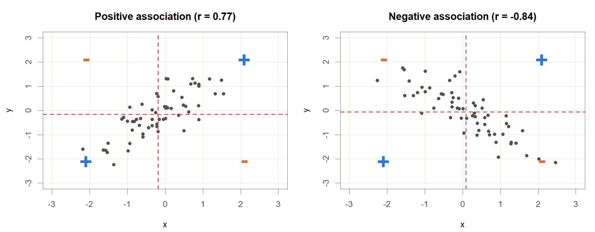
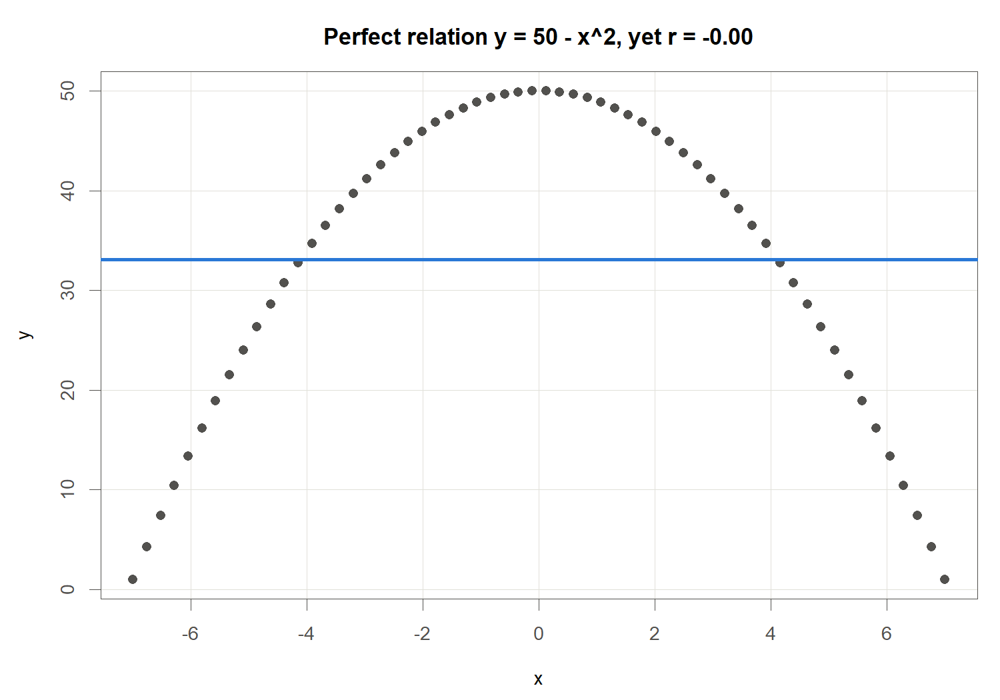
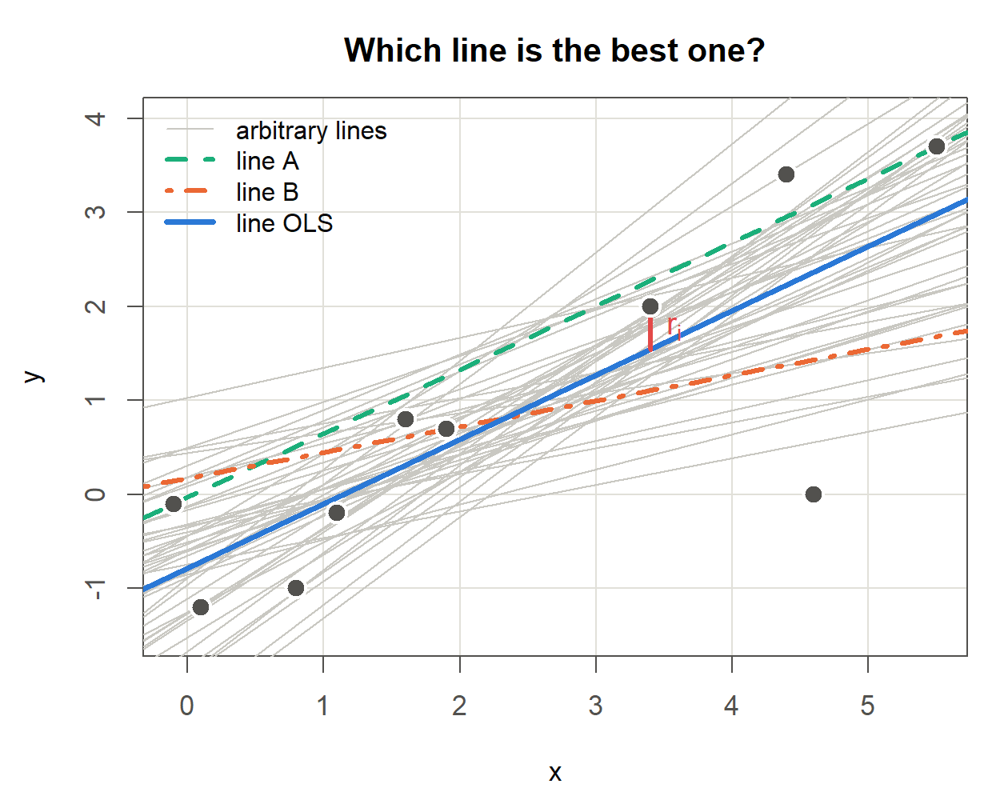
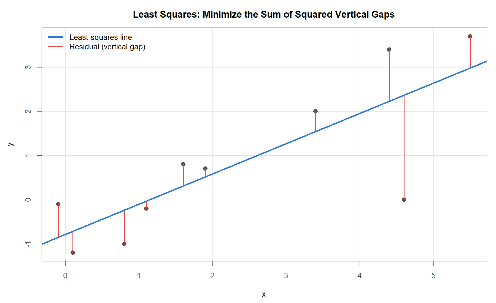
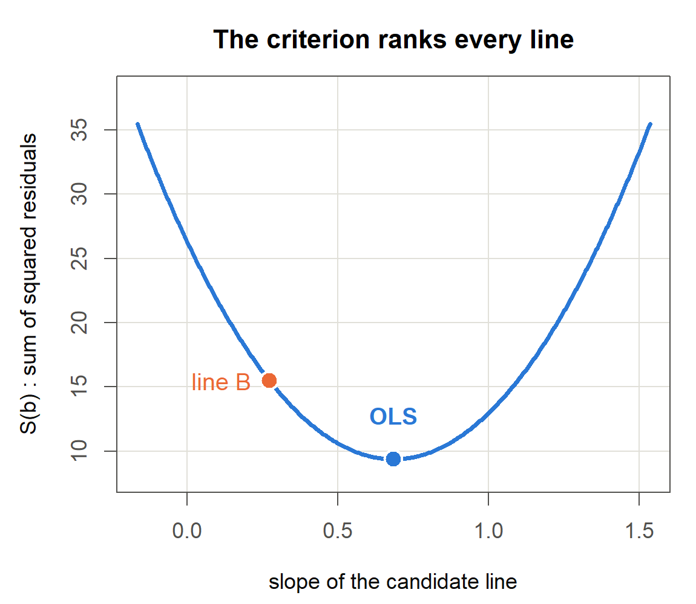
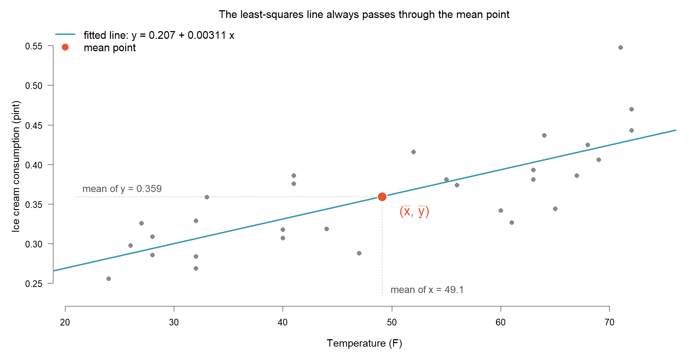
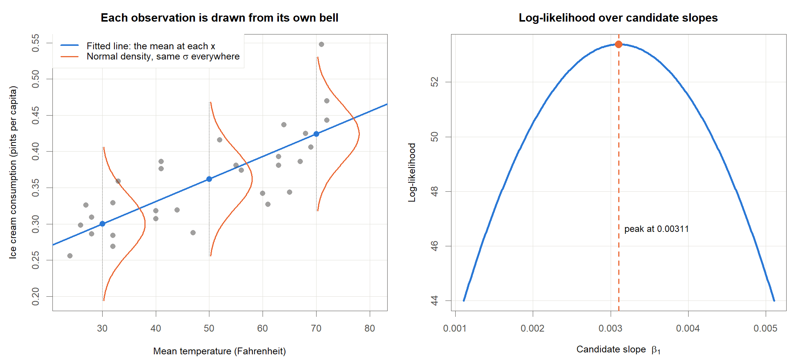
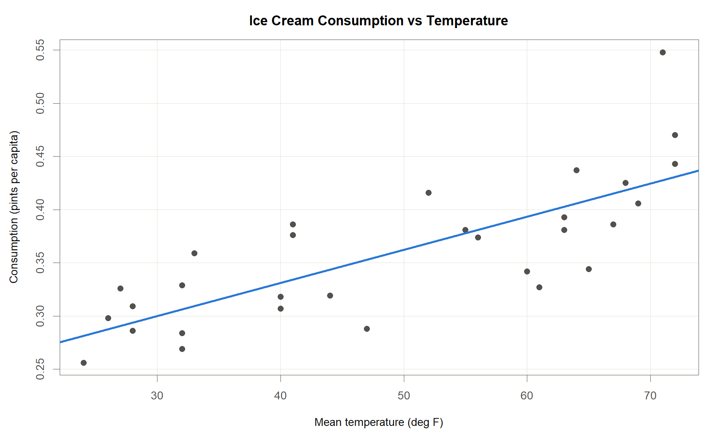
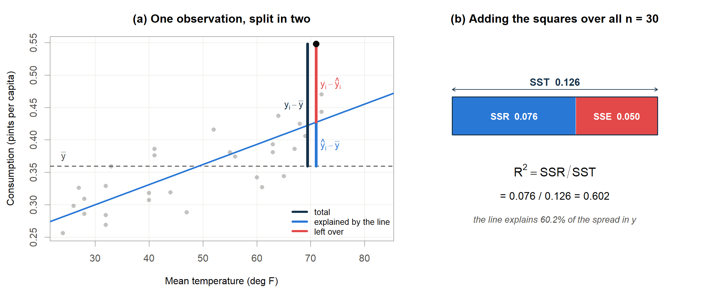

<!-- Date: 2026-08-26 | Purpose: chapter 3 of the KINS regression lecture, split from regression-lecture-note.qmd. Generated by code/agent/2026-08-26/split-chapters.py - edit the master, not this file. | File: 03-simple-linear-regression.qmd -->

# Simple Linear Regression

::: notes
이제 직선을 하나 그어 보겠습니다. 그 전에 물어볼 것이 하나 있습니다. 두 변수가 서로 관련이 있다는 말을 숫자로 어떻게 옮길까요. 이번 장은 그 숫자, 공분산과 상관계수에서 출발합니다. 그다음에 직선을 긋고, 그 직선이 쓸 만한지 따져 보는 순서로 가겠습니다. 눈여겨볼 대목은 앞부분의 상관계수와 뒷부분의 회귀 기울기가 사실 같은 이야기의 두 얼굴이라는 점입니다. 오늘 그것을 숫자로 직접 확인해 보겠습니다. 예제는 아이스크림 소비량 자료 하나로 끝까지 밀고 가겠습니다.
:::

## 두 변수 간 관계 측정

### <i class="fa-solid fa-question"></i> 관계의 측도

::: {.callout-note appearance="minimal"}
두 변수 사이의 관계는 **방향**과 **강도** 두 가지로 요약
:::

::: {.callout-tip appearance="minimal"}
<ul>
<li><b>방향</b>: $x$가 커질 때 $y$도 커지는가(양의 연관성), 반대로 작아지는가(음의 연관성)</li>
<li><b>강도</b>: 그 경향이 얼마나 또렷한가</li>
<li>재는 방법은 여럿이나, 이 강의에서는 Pearson의 공분산과 상관계수를 씀</li>
</ul>
:::

### <i class="fa-solid fa-bullseye"></i> 표기

:::{.highlight-box}
관측 $n$개가 짝을 이루어 $(x_1,y_1),\dots,(x_n,y_n)$ 로 나타남

$$\bar y=\frac{1}{n}\sum_{i=1}^{n} y_i,\qquad \bar x=\frac{1}{n}\sum_{i=1}^{n} x_i$$
:::

::: {style="font-size: 0.72em; line-height: 1.2"}

<ul>
<li>$y_i$: $i$번째 관측의 반응변수, $x_i$: 같은 관측의 설명변수</li>
<li>$n$: 관측 수, $\bar y,\bar x$: 표본평균(값을 모두 더해 개수로 나눈 값)</li>
</ul>

:::

::: {.callout-tip appearance="minimal"}
숫자 요약보다 **산점도**(관측 하나를 가로축 $x$, 세로축 $y$의 점 하나로 찍은 그림)를 먼저 볼 것
:::

::: notes
관계를 잰다고 할 때 우리가 알고 싶은 것은 두 가지입니다. 어느 쪽으로 가느냐, 그리고 얼마나 뚜렷하냐. 키와 몸무게는 같이 커집니다. 반대로 자동차 무게가 늘면 연비는 떨어집니다. 이것이 방향입니다. 강도는 그 경향이 점들 사이에서 얼마나 또렷하게 보이느냐의 문제입니다. 표기는 어렵지 않습니다. 관측 하나가 $x$와 $y$ 한 쌍이고, 그런 쌍이 $n$개 있습니다. 평균은 다 더해서 개수로 나눈 값, 초등학교에서 배운 그대로입니다. 한 가지만 부탁드리겠습니다. 숫자를 계산하기 전에 그림부터 그려 보십시오. 왜 그런지는 몇 장 뒤에 극적인 예로 보여 드리겠습니다.
:::

## 공분산의 착안: 편차의 곱 {.smaller}

### <i class="fa-solid fa-chart-line"></i> 사분면의 쏠림

{width=100%}

:::: {.columns}

::: {.column width="40%"}

| Quadrant | $y_i-\bar y$ | $x_i-\bar x$ | Product |
|:--|:--:|:--:|:--:|
| 1 (upper right) | $+$ | $+$ | $+$ |
| 2 (upper left)  | $+$ | $-$ | $-$ |
| 3 (lower left)  | $-$ | $-$ | $+$ |
| 4 (lower right) | $-$ | $+$ | $-$ |

: Sign of the deviation product in each quadrant

:::

::: {.column width="60%"}

::: {.callout-tip appearance="minimal"}
<i class="fa-solid fa-lightbulb"></i> **부호의 논리**

<ul>
<li>두 평균선이 평면을 넷으로 나눔</li>
<li>점 하나마다 두 편차를 곱하면 칸마다 부호가 정해짐</li>
<li>그림의 파란 $+$, 주황 $-$ 가 이 표의 마지막 열</li>
<li>두 그림에서 부호 배치는 <b>동일</b>. 다른 것은 점이 몰린 칸뿐</li>
</ul>
:::

:::

::::

::: notes
식을 적기 전에 그림부터 보겠습니다. 앞 장에서 말씀드린 대로입니다. 두 그림 모두 붉은 점선이 평균선입니다. 가로 평균선과 세로 평균선을 그으면 평면이 네 칸으로 갈립니다. 이제 점 하나를 잡고 두 가지를 재 보겠습니다. 이 점의 $x$ 가 평균에서 얼마나 벗어났나, 그리고 $y$ 가 평균에서 얼마나 벗어났나. 이 두 값을 곱하면 어떻게 될까요. 오른쪽 위 칸에서는 둘 다 평균보다 크니 양수 곱하기 양수, 결과는 양수입니다. 왼쪽 아래 칸은 음수 곱하기 음수라 역시 양수입니다. 반대로 왼쪽 위와 오른쪽 아래는 부호가 엇갈려 음수가 됩니다. 칸에 붙은 파란 플러스와 주황 마이너스가 그것입니다. 두 그림에서 부호 배치는 똑같다는 점을 눈여겨봐 주십시오. 달라지는 것은 점이 어느 칸에 몰려 있느냐뿐입니다. 왼쪽에서는 점들이 플러스 칸을 따라 대각선으로 늘어서 있으니 곱을 다 더하면 양수가 됩니다. 오른쪽은 정반대라 합이 음수가 됩니다. 곱셈 하나가 이 점은 같이 움직이는 쪽인가 엇갈리는 쪽인가를 자동으로 판정해 주는 셈입니다. 아래 표가 네 칸의 부호를 정리한 것입니다. 첫째 열이 칸 번호, 가운데 두 열이 각 편차의 부호, 마지막 열이 그 둘을 곱한 부호입니다. 그림의 파란 플러스와 주황 마이너스가 바로 이 마지막 열입니다. 그러면 이 아이디어를 식으로 적어 보겠습니다.
:::

## 공분산: 정의

### <i class="fa-solid fa-bullseye"></i> 관찰의 수식화

:::: {.columns}

::: {.column width="50%"}

::: {.callout-tip appearance="minimal"}
<i class="fa-solid fa-chart-line"></i> **양의 연관성**

<ul>
<li>1, 3사분면에 점이 많음</li>
<li>두 편차의 <b>곱이 양수</b>인 칸들</li>
<li>모두 더하면 <b>양수</b></li>
</ul>
:::

:::

::: {.column width="50%"}

::: {.callout-tip appearance="minimal"}
<i class="fa-solid fa-chart-line"></i> **음의 연관성**

<ul>
<li>2, 4사분면에 점이 많음</li>
<li>두 편차의 <b>곱이 음수</b>인 칸들</li>
<li>모두 더하면 <b>음수</b></li>
</ul>
:::

:::

::::

::: {.highlight-box}
**공분산(covariance)**

$$\operatorname{cov}(y,x)=\frac{1}{n-1}\sum_{i=1}^{n}(y_i-\bar y)(x_i-\bar x)$$
:::

::: {.callout-note appearance="minimal"}
<ul>
<li>$(y_i-\bar y)$: $y$ 가 평균에서 떨어진 거리, $(x_i-\bar x)$: $x$ 가 평균에서 떨어진 거리</li>
<li>두 편차의 곱을 모두 더해 $n-1$ 로 나눔. 모집단 공분산과 구별하여 <b>표본공분산</b>이라 부름</li>
</ul>
:::

::: notes
위쪽 두 상자가 앞 장에서 눈으로 확인한 내용입니다. 왼쪽 그림처럼 점이 1, 3사분면에 몰리면 곱이 양수인 항이 많아 합이 양수가 되고, 오른쪽 그림처럼 2, 4사분면에 몰리면 합이 음수가 됩니다. 그러면 이 합을 그대로 적으면 되겠습니다. 그것이 가운데 식입니다. 각 점마다 $y$가 평균에서 얼마나 벗어났나와 $x$가 평균에서 얼마나 벗어났나를 곱합니다. 그것을 전부 더한 다음 $n$ 빼기 1로 나눕니다. 그림에서 눈으로 세었던 것을 숫자 하나로 만든 것뿐입니다. 곱셈 하나가 이 점은 같이 움직이는 쪽인가 엇갈리는 쪽인가를 자동으로 판정해 주는 셈입니다. 앞 장 그림의 파란 플러스와 주황 마이너스가 표의 마지막 열 그대로입니다. 공분산의 부호는 점들이 어느 대각선 위에 앉아 있는가를 숫자 하나로 요약한 것입니다.
:::

## 공분산의 한계와 표준화

### <i class="fa-solid fa-triangle-exclamation"></i> 주의: 단위 의존성

::: {.highlight-box}
상수 $a,b,c,d$에 대해 $\operatorname{cov}(ay+b,\;cx+d)=ac\,\operatorname{cov}(y,x)$ 가 성립한다.
:::

:::{style="font-size: 90%; margin-top: 1em; margin-bottom: 1em;"}

<ul>
<li>$y$ 의 단위를 바꾸어 값에 $a$ 를 곱하면 공분산도 $a$ 배</li>
<li>키를 cm로 재느냐 inch로 재느냐에 따라 연관성의 크기가 달라진다면 곤란</li>
<li>공분산은 <b>부호는 믿을 수 있으나 크기는 단위에 좌우</b>되는 척도</li>
</ul>

:::

### <i class="fa-solid fa-pen-to-square"></i> 해결: 표준화

$$z_i=\frac{y_i-\bar y}{s_y},\qquad s_y=\sqrt{\frac{1}{n-1}\sum_{i=1}^{n}(y_i-\bar y)^2}$$

::: {style="font-size: 0.85em"}

<ul>
<li>$s_y$: 표본표준편차(자료가 평균에서 떨어진 정도를 대표하는 값, 원자료와 단위가 같음)</li>
<li>$z_i$: 표준화된 값. 편차를 흩어짐의 크기로 나누면 단위가 사라지고 $\bar z=0$, $s_z=1$</li>
</ul>

:::

::: notes
공분산에는 불편한 점이 하나 있습니다. 단위를 바꾸면 값이 따라 바뀝니다. 아버지와 아들의 키가 얼마나 닮았는지를 재는데 센티미터로 재면 크게 나오고 인치로 재면 작게 나온다면 이상하지 않습니까. 닮은 정도가 자를 바꾼다고 달라질 리는 없습니다. 그래서 표준화를 합니다. 각 값에서 평균을 빼고, 흩어짐의 크기인 표준편차로 나눕니다. 시험 점수로 생각해 보십시오. 원점수 80점이 잘한 것인지 못한 것인지는 반 평균과 성적 분포를 알아야 판단이 됩니다. 표준화는 평균에서 표준편차 몇 개만큼 떨어져 있나로 바꿔 말하는 작업입니다. 이렇게 만든 값은 단위가 없어서 어느 자로 재든 똑같습니다. 이 표준화를 공분산에 적용한 것이 다음 슬라이드의 상관계수입니다.
:::

## 상관계수: 정의와 성질

### <i class="fa-solid fa-bullseye"></i> 표준화한 공분산

::: {.highlight-box}
$$r=\operatorname{corr}(y,x)=\frac{1}{n-1}\sum_{i=1}^{n}\left(\frac{y_i-\bar y}{s_y}\right)\left(\frac{x_i-\bar x}{s_x}\right)=\frac{\operatorname{cov}(y,x)}{s_y\,s_x}$$
:::

:::{style="margin-top: 1em; margin-bottom: 1em;"}
<ul>
<li>$s_y$, $s_x$: 각각 $y$와 $x$의 표본표준편차</li>
<li>표준화한 두 변수의 공분산이 곧 상관계수</li>
<li>모집단 상관계수와 구별하여 <b>표본상관계수</b>라 부름</li>
</ul>
:::

### <i class="fa-solid fa-lightbulb"></i> 성질

::: {.callout-tip appearance="minimal"}
<ul>
<li>측정 단위를 바꾸어도 값이 변하지 않음: $\operatorname{corr}(ay+b,\;cx+d)=\operatorname{corr}(y,x)$ ($ac>0$)</li>
<li>$-1\le r\le 1$</li>
<li>부호는 방향, 절댓값은 강도. $1$ 또는 $-1$에 가까울수록 강한 <b>선형</b>관계</li>
<li>$\operatorname{corr}(y,x)=\operatorname{corr}(x,y)$</li>
</ul>
:::

::: notes
상관계수는 공분산을 두 표준편차로 나눈 값입니다. 표준화한 두 변수의 공분산이라고 말해도 같은 뜻입니다. 나눗셈 한 번으로 단위가 사라집니다. cm로 재든 inch로 재든 값이 똑같아집니다. 그리고 편리한 성질이 하나 붙습니다. 값이 반드시 마이너스 1과 1 사이에 들어온다는 것. 그러니 0.8이라는 숫자를 보면 꽤 강하구나 하고 바로 감이 옵니다. 공분산은 값을 봐도 큰 것인지 작은 것인지 알 수 없었습니다. 마지막 성질도 짚고 넘어가겠습니다. 상관계수는 $x$와 $y$를 대칭으로 다룹니다. 누가 원인이고 누가 결과인지 구분하지 않습니다. 원인과 결과를 나누어 쓰고 싶으면 회귀분석으로 넘어가야 합니다.
:::

## 상관계수: $r=0$ 의 함정

### <i class="fa-solid fa-triangle-exclamation"></i> $r=0$ 과 독립의 구분

:::: {.columns}

::: {.column width="58%"}
{width=100%}
:::

::: {.column width="42%"}

::: {.highlight-box}
$y=50-x^2$ 는 $x$가 정해지면 $y$가 완전히 결정되는 관계이나, 표본상관계수는 $r=0$ 이다.
:::

::: {.callout-tip appearance="minimal"}
<ul>
<li>상관계수는 <b>선형</b> 연관성만 재는 척도</li>
<li>$r=0$ 은 "선형관계가 없다"는 뜻이지 "관계가 없다"는 뜻이 아님</li>
<li>따라서 숫자보다 산점도를 먼저 볼 것</li>
</ul>
:::

:::

::::

::: notes
이 그림이 오늘 가장 인상적인 장면일지도 모르겠습니다. 점들이 완벽한 포물선 위에 놓여 있습니다. $x$를 알면 $y$가 오차 하나 없이 결정됩니다. 이보다 더 강한 관계가 있을까요. 그런데 상관계수를 계산하면 0이 나옵니다. 이유는 단순합니다. 왼쪽 절반에서는 $x$가 커질수록 $y$도 커지고, 오른쪽 절반에서는 반대입니다. 양쪽이 정확히 상쇄되어 버립니다. 상관계수는 직선 관계만 잡아내는 도구라서 곡선 앞에서는 눈을 감아 버립니다. 계산기부터 두드리지 말라고 말씀드린 이유가 여기에 있습니다. 이 자료에서 $r$이 0이니 관계가 없다고 보고했다면 어떻게 됐을까요. 완전히 틀린 결론입니다. 그림 한 장이면 3초 만에 알 수 있는 사실입니다.
:::

## 예제 자료: 아이스크림 소비량 {.smaller}

### <i class="fa-solid fa-table"></i> 자료 구조

:::: {.columns}

::: {.column width="52%"}

| period | IC | price | income | temp | year |
|---:|---:|---:|---:|---:|---:|
| 1 | 0.386 | 0.270 | 78 | 41 | 0 |
| 2 | 0.374 | 0.282 | 79 | 56 | 0 |
| 3 | 0.393 | 0.277 | 81 | 63 | 0 |
| 4 | 0.425 | 0.280 | 80 | 68 | 0 |
| 5 | 0.406 | 0.272 | 76 | 69 | 0 |

: First five of n = 30 four-week periods; 6 variables in total

:::

::: {.column width="48%"}

| Variable | Meaning |
|:--|:--|
| period | Observation index (four-week period) |
| IC | Per-capita ice cream consumption (pints) |
| price | Price of ice cream |
| income | Income |
| temp | Mean temperature (°F) |
| year | Observation year code (0/1/2) |

: Variables of the ice cream data

:::

::::

한 행은 4주 기간 하나이며, 총 $n=30$개 기간. 이 장에서 쓰는 변수는 $y_i=$ IC, $x_i=$ temp 두 개

::: notes
자료를 다시 펼쳐 보겠습니다. 아이스크림 판매 기록이고, 한 줄이 4주짜리 기간 하나입니다. 하루도 아니고 사람 한 명도 아닙니다. 이런 분석 단위 확인이 의외로 중요하니 습관을 들여 주십시오. 왼쪽 표가 앞 다섯 줄이고, 실제로는 서른 줄까지 이어집니다. 변수는 여섯 개인데 이 장에서 쓸 것은 소비량과 온도 둘입니다. 가격과 소득은 다음 장에서 함께 넣어 보겠습니다. 맨 오른쪽 year는 헷갈리기 쉬운 변수입니다. 계절이 아니라 몇 번째 해에 관측했는지를 0, 1, 2로 적어 둔 값입니다. 가변수 장에서 다시 꺼내 쓰겠습니다. 온도 단위가 화씨라는 점도 기억해 두시면 나중에 계수를 읽을 때 편합니다.
:::

## 아이스크림 자료: 공분산과 상관계수 {.smaller}

### <i class="fa-solid fa-table"></i> 실제 수치로 확인

| Statistic | temp ($x$) | IC ($y$) |
|:--|--:|--:|
| Mean | 49.1 | 0.359 |
| Standard deviation | 16.4 | 0.0658 |

: Summary statistics of the two variables used in this chapter (n = 30)

$$\operatorname{cov}(y,x)=0.838,\qquad r=\frac{\operatorname{cov}(y,x)}{s_y\,s_x}=\frac{0.838}{0.0658\times 16.4}=\frac{0.838}{1.08}=0.776$$

::: {.callout-tip appearance="minimal"}
<ul>
<li>부호가 양수이므로 온도가 높은 기간에 소비량도 큼</li>
<li>$r=0.776$ 은 1에 비교적 가까우므로 선형관계가 뚜렷함</li>
<li>공분산 $0.838$ 자체의 크기는 단위에 좌우되므로 강도 판단에 쓰지 않음</li>
</ul>
:::

::: notes
표부터 보겠습니다. 온도는 평균 49도 근처에서 표준편차 16도 정도로 넓게 퍼져 있습니다. 소비량은 평균 0.36에 표준편차 0.066입니다. 두 변수의 눈금 자체가 완전히 다릅니다. 공분산은 0.838이 나왔습니다. 부호가 양수니 온도가 높은 기간에 아이스크림이 더 팔린다는 뜻입니다. 그런데 0.838이 큰 값일까요. 이것만 봐서는 판단할 수 없습니다. 온도를 섭씨로 바꾸는 순간 값이 달라지기 때문입니다. 그래서 두 표준편차로 나눠 상관계수를 만듭니다. 0.776. 이제는 판단이 됩니다. 최대가 1인데 0.78이니 꽤 강한 편입니다. 여기까지가 관계를 재는 이야기였습니다. 이제 직선을 그으러 가겠습니다.
:::

## 단순선형회귀모형

### <i class="fa-solid fa-bullseye"></i> 정의

::: {.highlight-box}
$$y_i=\beta_0+\beta_1 x_i+\varepsilon_i,\qquad i=1,\dots,n$$
:::

<ul>
<li>$y_i$: 반응변수, $x_i$: 설명변수, $\beta_0$: 절편, $\beta_1$: 기울기</li>
<li>$\varepsilon_i$: 직선으로 설명되지 않는 오차(평균 0, 분산 $\sigma^2$)</li>
<li>$\beta_0,\beta_1$ 은 값을 모르지만 <b>고정된 상수</b>. $y_i$ 가 흔들리는 원인은 오직 $\varepsilon_i$</li>
</ul>

### <i class="fa-solid fa-lightbulb"></i> 계수의 뜻

::: {.callout-tip appearance="minimal"}
<ul>
<li>$\beta_1$ (기울기): $x$가 1단위 커질 때 $y$가 <b>평균적으로</b> 변하는 양</li>
<li>$\beta_0$ (절편): $x=0$일 때 예측되는 $y$의 평균</li>
<li>적합된 직선은 조건부 기댓값 $E(y\mid x)=\beta_0+\beta_1x$의 추정이므로, 개별 관측이 아닌 <b>평균</b>에 관한 진술</li>
<li>$x=0$이 자료 범위 밖이면 절편을 물리적으로 해석하지 않는 편이 안전함</li>
</ul>
:::

::: notes
모형은 두 조각으로 되어 있습니다. 직선 부분, 그리고 오차. $y$는 직선 더하기 오차라고 읽으시면 됩니다. 기울기는 $x$가 1만큼 커질 때 $y$가 평균적으로 얼마나 변하는지를 나타냅니다. 여러분이 하시는 계측기 검교정과 구조가 똑같습니다. 기준 입력을 1단위 올릴 때 지시값이 얼마나 변하는가가 기울기, 입력이 0일 때의 지시값이 절편 곧 영점입니다. 여기서 평균적으로라는 단서를 빼면 안 됩니다. 온도가 60도인 기간이 여러 번 있어도 판매량은 매번 다릅니다. 직선은 그 여러 값의 한가운데를 지나갈 뿐입니다. 그러면 그 직선을 어떻게 고르느냐. 다음 슬라이드입니다.
:::

## 후보 직선의 비교

### <i class="fa-solid fa-circle-question"></i> 무수히 많은 후보 직선

:::: {.columns}

::: {.column width="55%"}
{width=100%}
:::

::: {.column width="45%"}

::: {.highlight-box}
**임의의 직선과 잔차**

$$r_i=y_i-(a_0+a_1x_i)$$
:::

::: {style="font-size: 0.78em"}

<ul>
<li>$a_0,a_1$: 임의로 정한 직선의 절편과 기울기</li>
<li>$r_i$: 그 직선에서 $i$번째 점까지의 세로 간격</li>
</ul>

:::

::: {.callout-tip appearance="minimal"}
<ul>
<li>직선을 하나 정할 때마다 잔차가 $n$개 생김. 좋은 직선은 이 $n$개가 <b>전체적으로 작은</b> 직선</li>
<li>두 직선의 우열을 가리려면 잔차 $n$개를 <b>하나의 수</b>로 요약해야 함. 이 요약값이 <b>기준</b>(criterion)</li>
<li>기준을 정해야 비로소 무수한 후보에 <b>순서</b>가 매겨지고 최적이라는 말이 정의됨</li>
</ul>
:::

:::

::::

::: notes
슬라이드에 점 열 개가 찍혀 있고 그 위로 회색 직선이 잔뜩 지나갑니다. 이 그림이 오늘 질문의 출발점입니다. 같은 산점도 위에 직선은 무수히 그을 수 있습니다. 회색 선은 그중 마흔다섯 개만 그려 본 것이고, 실제로는 절편과 기울기 두 숫자를 아무렇게나 고를 수 있으니 후보가 무한히 많습니다. 그중 초록 점선, 주황 일점쇄선, 파란 실선 세 개만 굵게 표시해 두었습니다. 여기서 질문을 드리겠습니다. 이 셋 중 어느 직선이 가장 좋습니까. 눈으로 보면 파란 선이 나아 보이실 겁니다. 그런데 왜 나은지를 말로 설명하려고 하면 막힙니다. 두 분이 서로 다른 직선을 좋다고 하면 판정할 방법이 없습니다. 그래서 필요한 것이 기준입니다. 빨간 짧은 선분 하나에 알 아이라고 적어 두었습니다. 어떤 직선을 정하면 점마다 이런 세로 간격이 하나씩 생깁니다. 이것이 잔차입니다. 직선이 바뀌면 잔차 열 개가 통째로 바뀝니다. 좋은 직선이란 이 열 개가 전체적으로 작은 직선일 텐데, 문제는 열 개짜리 묶음끼리는 크다 작다를 말할 수 없다는 점입니다. 그래서 열 개를 하나의 숫자로 줄여야 합니다. 그 줄이는 방법이 기준이고, 기준이 정해져야 비로소 모든 직선에 순서가 매겨집니다. 최적이라는 말은 그다음에야 뜻을 갖습니다. 여기서 기호를 하나 구분해 두겠습니다. 지금은 아무 직선이나 이야기하고 있으므로 절편과 기울기를 에이 제로, 에이 원이라 쓰고 간격을 알이라 썼습니다. 뒤에서 최종적으로 고른 직선의 간격은 이 아이라고 따로 부를 것입니다.
:::

## 최소제곱 기준 {.smaller}

### <i class="fa-solid fa-chart-line"></i> 그림으로 보기

:::: {.columns}

::: {.column width="60%"}
{width=100%}
:::

::: {.column width="40%"}

::: {.highlight-box}
**잔차** $e_i=y_i-\hat y_i$
:::

**기호**

<ul>
<li>$\hat y_i$: 직선이 예측한 값(적합값)</li>
<li>$e_i$: 관측값과 적합값의 수직 간격</li>
</ul>

::: {.highlight-box}
**최소제곱 기준**

$$\min_{\beta_0,\beta_1}\;\sum_{i=1}^{n}\left(y_i-\beta_0-\beta_1x_i\right)^2$$
:::

이 제곱 합을 가장 작게 만드는 직선을 최적 직선으로 정의. 이를 **통상최소제곱법**(Ordinary Least Squares, OLS)이라 부름

:::

::::

::: notes
앞 장에서 남겨 둔 질문에 답할 차례입니다. 무수한 후보 가운데 하나를 고르는 기준을 이제 적어 보겠습니다. 그림의 빨간 수직 선분을 봐 주십시오. 각 점에서 직선까지의 세로 간격, 이것이 잔차입니다. 이 간격들을 제곱해서 전부 더한 값이 가장 작아지는 직선을 쓰기로 약속한 것이 최소제곱법입니다. 산점도 위에 막대기를 올려놓고 각 점과 용수철로 연결했다고 상상해 보십시오. 용수철 에너지는 늘어난 길이의 제곱에 비례합니다. 손을 놓으면 막대기가 흔들리다가 에너지 총합이 최소인 자리에서 멈춥니다. 그 자리가 최소제곱 직선입니다. 왜 하필 제곱이냐는 질문이 자주 나옵니다. 그것만 따로 다음 장에서 숫자로 확인하겠습니다. 수선의 발이 아니라 세로 간격을 쓰는 데도 이유가 있습니다. 우리 목적이 $x$를 알고 $y$를 맞히는 것이라, 틀리는 방향이 언제나 세로 방향이기 때문입니다.
:::

## 제곱합을 기준으로 삼는 이유 {.smaller}

### <i class="fa-solid fa-scale-balanced"></i> 네 직선, 세 기준

:::: {.columns}

::: {.column width="62%"}

| 후보 직선 | 식 | $\sum r_i$ | $\sum\lvert r_i\rvert$ | $\sum r_i^2$ |
|:---|:---|---:|---:|---:|
| A: 양 끝점을 이음 | $-0.0321+0.679x$ | −7.39 | 8.28 | 14.8 |
| B: 평균점을 지나되 완만 | $0.172+0.274x$ | 0.00 | 10.3 | 15.5 |
| C: 절대편차합 최소 | $-0.883+0.833x$ | −2.48 | **6.25** | 10.8 |
| **OLS: 제곱합 최소** | $-0.786+0.685x$ | 0.00 | 7.55 | **9.38** |

: Four candidate lines scored by three criteria on the same 10 points. Bold marks the minimum of each criterion.

::: {.callout-important appearance="minimal"}
<ul>
<li>$\sum r_i$ 는 <b>순서를 매기지 못함</b>. B와 OLS가 모두 0이며, 평균점 $(\bar x,\bar y)$ 를 지나는 직선은 예외 없이 0이므로 무수히 많은 직선이 동점</li>
<li>$\textstyle\sum(y_i-a_0-a_1x_i)=n(\bar y-a_0-a_1\bar x)$ 이므로, $a_0=\bar y-a_1\bar x$ 이면 기울기 $a_1$ 이 무엇이든 합은 0</li>
<li>기준이 바뀌면 답도 바뀜. $\sum\lvert r_i\rvert$ 의 최소는 C, $\sum r_i^2$ 의 최소는 OLS로 <b>서로 다른 직선</b></li>
</ul>
:::

:::

::: {.column width="38%"}
{width=100%}
:::

::::

::: {.callout-note appearance="minimal"}
<i class="fa-solid fa-lightbulb"></i> **제곱합을 표준으로 삼는 근거**

<ul>
<li><b>해가 닫힌 형태로 존재</b>: $S(b)$ 가 $b$ 의 이차함수이자 아래로 볼록이므로 미분해 0으로 놓으면 유일한 최소점을 얻음(다음 장)</li>
<li><b>Gauss-Markov 정리</b>: 오차의 평균이 0이고 등분산·무상관이면, $y$ 의 선형결합으로 만든 불편추정량 가운데 분산이 가장 작음(BLUE)</li>
<li><b>정규오차에서 최대가능도와 일치</b>: $\varepsilon_i\sim N(0,\sigma^2)$ 이면 가능도를 최대화하는 것이 곧 제곱합을 최소화하는 것(두 슬라이드 뒤에서 유도)</li>
<li>다만 $\sum\lvert r_i\rvert$ 기준은 <b>이상점에 덜 민감</b>하여 로버스트 회귀에서 쓰임. 제곱합이 유일한 정답은 아님</li>
</ul>
:::

::: notes
앞 장의 기준을 실제로 적용해 채점표를 만들어 보았습니다. 같은 점 열 개 위에 직선 넷을 얹고 세 가지 기준으로 점수를 매긴 것이 왼쪽 표입니다. 위에서부터 보겠습니다. 첫째 줄 에이는 양 끝점을 그냥 이은 직선, 둘째 줄 비는 평균점을 지나지만 너무 완만한 직선, 셋째 줄 씨는 잠시 뒤에 설명드릴 절대편차 기준의 최적 직선, 마지막이 최소제곱 직선입니다. 셋째 열부터가 채점 결과입니다. 셋째 열은 잔차를 그냥 다 더한 값입니다. 여기서 첫 번째 교훈이 나옵니다. 비와 최소제곱이 똑같이 영입니다. 두 직선의 생김새는 전혀 다른데 점수가 같습니다. 이러면 순서를 매길 수가 없습니다. 우연이 아닙니다. 상자 둘째 줄에 한 줄로 적어 두었는데, 잔차의 합은 엔 곱하기 와이 평균 빼기 에이 제로 빼기 에이 원 곱하기 엑스 평균입니다. 절편을 와이 평균 빼기 기울기 곱하기 엑스 평균으로 잡기만 하면 기울기가 무엇이든 이 값은 영이 됩니다. 다시 말해 평균점을 지나는 직선은 전부 영점입니다. 무수히 많은 직선이 동점이니 이 기준은 쓸 수 없습니다. 부호가 상쇄되기 때문입니다. 그래서 부호를 없애야 합니다. 방법은 두 가지, 절댓값을 씌우거나 제곱하는 것입니다. 넷째 열이 절댓값, 다섯째 열이 제곱입니다. 여기서 두 번째 교훈이 나옵니다. 절댓값 기준으로는 씨가 6.25로 일등인데, 제곱 기준으로는 최소제곱이 9.38로 일등입니다. 등수가 뒤집힙니다. 최적의 직선이란 자료가 정해 주는 것이 아니라 우리가 고른 기준이 정해 주는 것입니다. 이 점을 분명히 해 두고 싶습니다. 오른쪽 그림은 제곱합 기준만 따로 그린 것입니다. 가로축이 후보 직선의 기울기, 세로축이 그 직선의 제곱합입니다. 매끈한 밥그릇 모양이고 바닥이 딱 한 군데입니다. 주황 점이 비, 파란 점이 최소제곱입니다. 모든 직선에 높이가 하나씩 대응되니 순서가 완전히 매겨지고, 바닥이 하나뿐이니 최적 직선도 하나뿐입니다. 그러면 절댓값 대신 제곱을 쓰는 이유는 무엇이냐. 아래 상자에 세 가지를 적었습니다. 첫째, 제곱합은 이차함수라 미분해서 영으로 놓으면 답이 공식으로 나옵니다. 절댓값은 뾰족한 점이 있어 미분이 안 되고 공식도 없습니다. 둘째, 가우스와 마르코프의 정리입니다. 등분산과 무상관이라는 조건 아래에서 최소제곱 추정량이 가장 덜 흔들린다는 것이 증명되어 있습니다. 오늘 뒤에서 다시 보겠습니다. 셋째, 오차가 정규분포를 따르면 가장 그럴듯한 값을 찾는 최대가능도 방법이 제곱합 최소화와 정확히 같은 답을 줍니다. 마지막 줄은 정직하게 덧붙인 단서입니다. 절댓값 기준은 이상점에 덜 끌려다니는 장점이 있어서 로버스트 회귀라는 이름으로 실제로 쓰입니다. 제곱합이 언제나 유일한 정답인 것은 아닙니다.
:::

## 최소제곱법: 정규방정식 {.smaller}

### <i class="fa-solid fa-pen-to-square"></i> 두 편미분을 0으로

목적함수를 $S(\beta_0,\beta_1)=\sum_{i=1}^{n}(y_i-\beta_0-\beta_1x_i)^2$ 라 두면, 최소점에서 두 편미분이 모두 0

$$
\begin{aligned}
\frac{\partial S}{\partial\beta_0} &= -2\sum_{i=1}^{n}(y_i-\beta_0-\beta_1x_i)=0\\
\frac{\partial S}{\partial\beta_1} &= -2\sum_{i=1}^{n}x_i(y_i-\beta_0-\beta_1x_i)=0
\end{aligned}
$$

정리하면 미지수가 둘인 연립방정식, 곧 **정규방정식**

::: notes
최소화 문제는 미분으로 풉니다. 제곱 합을 절편으로 한 번, 기울기로 한 번 미분해서 0으로 놓으면 됩니다. 아래로 볼록한 밥그릇에서 바닥을 찾는 일과 같습니다. 바닥에서는 어느 방향으로 봐도 기울기가 0입니다. 그렇게 얻은 두 식을 정규방정식이라 부릅니다. 여기서 정규는 정규분포와 아무 상관이 없으니 혼동하지 마십시오. 직교한다는 뜻에서 온 이름입니다. 다음 슬라이드에서 이 연립방정식을 풀겠습니다.
:::

## 최소제곱법: 해의 유도 {.smaller .stepped}

### <i class="fa-solid fa-pen-to-square"></i> 두 식, 두 미지수

<ol>
<li><b>첫 식에서 절편이 바로 나온다.</b> 괄호를 풀어 항별로 더하면 $\sum y_i=n\beta_0+\beta_1\sum x_i$. 양변을 $n$ 으로 나누면 평균끼리의 관계가 되고, 이것이 곧 절편의 식
$$\sum_{i=1}^{n}(y_i-\beta_0-\beta_1x_i)=0\;\Longrightarrow\;\bar y=\beta_0+\beta_1\bar x\;\Longrightarrow\;\hat\beta_0=\bar y-\hat\beta_1\bar x$$</li>
<li><b>그 절편을 둘째 식에 대입한다.</b> 둘째 식은 $\sum x_iy_i=\beta_0\sum x_i+\beta_1\sum x_i^2$. 여기에 $\beta_0=\bar y-\beta_1\bar x$ 와 $\sum x_i=n\bar x$ 를 넣고 $\beta_1$ 이 든 항만 한쪽으로 모음
$$\sum x_iy_i-n\bar x\bar y=\beta_1\!\left(\sum x_i^2-n\bar x^2\right)$$</li>
<li><b>양변이 편차의 제곱합이다.</b> 괄호를 전개하면 $\sum x_iy_i-n\bar x\bar y=S_{xy}$, $\;\sum x_i^2-n\bar x^2=S_{xx}$ 이므로 양변을 $S_{xx}$ 로 나누면 기울기가 나옴</li>
</ol>

::: {.callout-note appearance="minimal"}
$$\hat\beta_1=\frac{S_{xy}}{S_{xx}},\qquad \hat\beta_0=\bar y-\hat\beta_1\bar x$$
:::

::: notes
연립방정식 둘을 실제로 풀어 보겠습니다. 새로운 기법은 하나도 없습니다. 중학교에서 배운 대입법 그대로입니다. 첫 단계입니다. 첫 식의 괄호를 풀어 항별로 더하면 시그마 y가 n 곱하기 절편 더하기 기울기 곱하기 시그마 x가 됩니다. 양변을 n으로 나누면 y의 평균이 절편 더하기 기울기 곱하기 x의 평균과 같다는 식이 됩니다. 이 한 줄이 곧 절편의 공식입니다. 그리고 이 식이 오늘 이 장에서 가장 여러 번 다시 나올 식입니다. 두 번째 단계입니다. 방금 얻은 절편을 둘째 식에 그대로 대입합니다. 시그마 x를 n 곱하기 x 평균으로 바꿔 주고, 기울기가 들어 있는 항만 한쪽으로 모으면 화면의 식이 됩니다. 세 번째 단계입니다. 왼쪽에 남은 덩어리와 괄호 안의 덩어리를 보십시오. 각각 편차의 곱을 더한 것과 편차의 제곱을 더한 것입니다. 전개해 보면 정확히 일치합니다. 이름을 붙여 S xy와 S xx라고 씁니다. 양변을 S xx로 나누면 기울기가 나옵니다. 맨 아래 띠가 오늘 계속 쓸 두 공식입니다.
:::

## 최소제곱법: 해의 성질 {.smaller .fig-led}

### <i class="fa-solid fa-chart-line"></i> 평균점 통과

{width=100% .nostretch style="max-height: 620px"}

::: {.callout-tip appearance="minimal"}
<ul>
<li>절편 식 $\hat\beta_0=\bar y-\hat\beta_1\bar x$ 를 옮기면 $\bar y=\hat\beta_0+\hat\beta_1\bar x$, 곧 $x=\bar x$ 에서의 적합값이 정확히 $\bar y$. 확인 $0.207+0.00311\times 49.1=0.359=\bar y$</li>
<li>첫 번째 정규방정식으로부터 잔차의 합은 항상 0: $\sum_{i=1}^{n}e_i=0$. 따라서 잔차의 평균도 0이며, 직선은 자료의 한가운데를 지나감</li>
</ul>
:::

::: notes
앞에서 얻은 두 공식 가운데 절편 쪽을 그림으로 확인하겠습니다. 절편 공식을 옮겨 쓰면 y의 평균이 x의 평균에서의 적합값과 같다는 뜻입니다. 화면의 주황색 점이 그 평균점입니다. 가로로 x의 평균 49.1, 세로로 y의 평균 0.359인 자리인데, 파란 직선이 정확히 그 위를 지나갑니다. 눈으로만 보시면 우연 같으니 숫자로도 확인해 두겠습니다. 절편 0.207에 기울기 0.00311 곱하기 49.1을 더하면 0.359, y의 평균과 소수점 아래까지 같습니다. 이 자료라서 그런 것이 아닙니다. 최소제곱으로 직선을 그으면 어떤 자료에서든 반드시 이렇게 됩니다. 아래 두 번째 줄도 같은 이야기를 다르게 말한 것입니다. 잔차를 전부 더하면 0이 됩니다. 직선 위로 벗어난 만큼 아래로도 벗어난다는 뜻이고, 그래서 직선이 점구름의 한가운데를 지나갑니다. 시소의 받침점을 떠올리시면 됩니다. 평균점이 그 받침점입니다.
:::

## 최대가능도법의 착안 {.smaller .fig-led}

### <i class="fa-solid fa-bullseye"></i> 정의

::: {.highlight-box}
**최대가능도법**(maximum likelihood, 최대우도법): 지금 손에 있는 자료가 나올 법함을 가장 크게 만드는 모수값을 추정값으로 삼는 방법.
:::

확률을 말하려면 오차에 분포가 필요. $\varepsilon_i\stackrel{\text{iid}}{\sim}N(0,\sigma^2)$ 이면 $y_i\sim N(\beta_0+\beta_1x_i,\;\sigma^2)$ (iid: 서로 독립이고 같은 분포)

{width=100% .nostretch}

::: {.callout-tip appearance="minimal"}
왼쪽은 관측마다 종이 하나씩 있고 중심만 직선을 따라 움직인다는 가정. 오른쪽 곡선의 꼭대기 $\hat\beta_1=0.00311$ 은 앞서 본 제곱합 곡선의 바닥과 같은 자리. **위아래로 뒤집은 모양**
:::

::: notes
최소제곱과는 출발점이 다른 두 번째 길을 소개하겠습니다. 최소제곱은 간격을 줄이자는 기준이었습니다. 이번 기준은 이렇습니다. 지금 우리가 실제로 얻은 이 자료가 가장 나올 법하게 만드는 값을 고르자. 이것이 최대가능도법입니다. 최대우도법이라고도 부르는데 같은 말입니다. 그런데 나올 법하다고 말하려면 확률이 있어야 합니다. 확률이 있으려면 분포가 있어야 하고요. 그래서 지금까지 평균 0, 분산 시그마 제곱이라고만 해 두었던 오차에 정규분포라는 이름을 붙입니다. 여기서 처음으로 가정이 하나 늘어납니다. 왼쪽 그림이 그 가정을 그린 것입니다. 온도 30도, 50도, 70도 자리에 종 모양이 하나씩 서 있습니다. 종의 중심은 파란 직선을 따라 올라가지만 폭은 세 군데가 똑같습니다. 이것이 등분산 가정입니다. 관측 하나하나가 자기 자리의 종에서 뽑힌 값이라고 보는 것입니다. 오른쪽 그림을 봐 주십시오. 기울기 후보를 하나씩 넣어 보면서 그 값이 지금 자료를 얼마나 그럴듯하게 만드는지를 잰 곡선입니다. 봉우리가 하나이고 꼭대기가 0.00311입니다. 어디서 본 모양이지요. 아까 제곱합 곡선은 밥그릇 모양이었고 바닥이 있었습니다. 이 곡선은 그것을 위아래로 뒤집은 산봉우리입니다. 한쪽의 바닥과 다른 쪽의 꼭대기가 같은 자리에 있습니다. 다음 슬라이드에서 왜 그런지를 식으로 확인하겠습니다.
:::

## 최대가능도 추정: 유도 {.smaller .stepped}

### <i class="fa-solid fa-pen-to-square"></i> 가능도에서 정규방정식까지

<ol>
<li><b>밀도를 모두 곱한다.</b> 관측이 서로 독립이므로 정규밀도 $n$개의 곱이 <b>가능도</b>. 자료를 고정하고 모수를 변수로 본 함수이며, 지수를 모으면 앞 슬라이드의 제곱합 $S(\beta_0,\beta_1)=\sum_{i=1}^{n}(y_i-\beta_0-\beta_1x_i)^2$ 이 저절로 등장
$$\begin{aligned}
L(\beta_0,\beta_1,\sigma^2)&=\prod_{i=1}^{n}\frac{1}{\sqrt{2\pi\sigma^2}}
\exp\!\left\{-\frac{(y_i-\beta_0-\beta_1x_i)^2}{2\sigma^2}\right\}\\[2pt]
&=(2\pi\sigma^2)^{-n/2}\exp\!\left\{-\frac{S(\beta_0,\beta_1)}{2\sigma^2}\right\}
\end{aligned}$$</li>
<li><b>로그를 취한다.</b> 로그는 증가함수이므로 최대점의 위치가 바뀌지 않음. $\beta_0,\beta_1$ 이 들어 있는 항은 마지막 하나뿐
$$\ell(\beta_0,\beta_1,\sigma^2)=-\frac{n}{2}\ln(2\pi)-\frac{n}{2}\ln\sigma^2-\frac{1}{2\sigma^2}S(\beta_0,\beta_1)$$</li>
<li><b>계수 앞의 부호를 본다.</b> 그 계수 $-\dfrac{1}{2\sigma^2}$ 는 항상 <b>음수</b>이므로, $\ell$ 을 $\beta_0,\beta_1$ 로 미분해 0으로 놓으면 앞 슬라이드의 <b>정규방정식이 그대로 나옴</b></li>
</ol>

::: {.callout-note appearance="minimal"}
$$\ell \text{ 을 최대화}\;\Longleftrightarrow\;S(\beta_0,\beta_1)\text{ 을 최소화}$$
:::

::: notes
이제 식으로 확인하겠습니다. 첫 단계입니다. 관측이 서로 독립이니 확률을 모두 곱하면 됩니다. 정규분포 밀도를 서른 개 곱한 것, 그것이 가능도입니다. 곱해 놓고 보시면 지수 자리에 잔차의 제곱합이 저절로 모입니다. 우리가 억지로 끼워 넣은 것이 아니라 계산하다 보니 나온 것입니다. 여기서 중요한 구분이 하나 있습니다. 식의 생김새는 확률밀도와 똑같은데 보는 방향이 반대입니다. 밀도는 모수를 고정하고 자료가 변수인 함수이고, 가능도는 자료를 고정하고 모수가 변수인 함수입니다. 자료는 이미 관측했으니 고정입니다. 두 번째 단계입니다. 곱셈은 다루기 불편하니 로그를 씌웁니다. 로그는 커지면 커지는 함수라 꼭대기 위치가 바뀌지 않습니다. 그러면 세 덩어리가 나옵니다. 앞의 두 덩어리에는 베타가 없습니다. 베타가 들어 있는 것은 마지막 덩어리뿐이고, 그 앞에 붙은 계수가 마이너스입니다. 세 번째 단계가 핵심입니다. 마이너스가 붙어 있으니 이 덩어리를 크게 만들려면 제곱합을 작게 만들어야 합니다. 가능도를 최대화하는 것과 제곱합을 최소화하는 것이 정확히 같은 일이 됩니다. 앞 슬라이드에서 곡선을 뒤집으면 겹친다고 말씀드린 것이 이 마이너스 부호 하나 때문입니다. 미분해서 0으로 놓으면 조금 전에 본 정규방정식이 글자 하나 다르지 않게 나옵니다. 맨 아래 띠가 이 슬라이드의 결론입니다. 그러면 실제 숫자로도 같은 답이 나오는지, 다음 슬라이드에서 확인하겠습니다.
:::

## 최대가능도 추정: 결과 {.smaller}

### <i class="fa-solid fa-table"></i> 최소제곱과의 비교

$\sigma^2$ 에 대해서는 $\dfrac{\partial\ell}{\partial\sigma^2}=-\dfrac{n}{2\sigma^2}+\dfrac{S}{2(\sigma^2)^2}=0$ 이므로 $\hat\sigma^2_{ML}=S(\hat\beta_0,\hat\beta_1)/n$

| Quantity | Least squares | Maximum likelihood |
|:------------|:-----------------------|:-----------------------|
| $\hat\beta_1$ | 0.003107 | 0.003107 |
| $\hat\beta_0$ | 0.206862 | 0.206862 |
| $\hat\sigma^2$ | $S/(n-2)=0.0500/28=0.001786$ | $S/n=0.0500/30=0.001667$ |

: Simple regression of IC on temp, n = 30. The two criteria give the same line.

**회귀계수는 완전히 같고 오차분산 추정만 다름**. $E(\hat\sigma^2_{ML})=\frac{n-2}{n}\sigma^2$ 이므로 최대가능도 쪽은 참값보다 작게 나오는 편향추정량. 이 자료에서는 $28/30=0.933$ 배

::: {.callout-important appearance="minimal"}
<ul>
<li>정규가정이 있으면 최소제곱은 <b>가장 그럴듯한 직선</b>이기도 함. 앞서 제곱합을 택한 세 번째 근거가 여기서 증명됨</li>
<li>표준오차·검정·신뢰구간에는 자유도를 반영한 불편추정량 $S/(n-2)$ 를 씀. $\hat\sigma^2_{ML}$ 은 뒤의 AIC 계산에 쓰임</li>
<li>정규가정이 깨지면 두 기준은 <b>갈라짐</b>. 이때는 가정에 맞는 가능도를 세워 최대화(일반화선형모형)</li>
</ul>
:::

::: notes
표를 보십시오. 기울기도 절편도 소수점 아래까지 완전히 같습니다. 그런데 마지막 줄이 다릅니다. 오차분산을 최소제곱 쪽은 28로 나누고 최대가능도 쪽은 30으로 나눕니다. 왜 다를까요. 최대가능도는 추정하느라 써 버린 자유도를 셈에 넣지 않기 때문입니다. 그래서 참값보다 작게 나옵니다. 편향이 있다고 말합니다. 이 자료에서는 0.933배, 약 7퍼센트 작습니다. 그래서 표준오차와 검정에는 28로 나눈 값을 씁니다. 다만 30으로 나눈 값이 쓸모없는 것은 아닙니다. 뒤에 변수선택에서 AIC를 계산할 때 바로 이 값이 들어갑니다. 마지막으로 정직하게 덧붙이겠습니다. 두 방법이 같은 답을 주는 것은 오차가 정규분포라는 가정 아래에서입니다. 그 가정이 깨지면 둘은 갈라집니다. 그때는 자료에 맞는 분포로 가능도를 다시 세우면 되고, 그것이 일반화선형모형입니다.
:::

## 공분산, 상관계수, 회귀계수의 관계 {.smaller}

### <i class="fa-solid fa-lightbulb"></i> 핵심: 아래 세 표현은 모두동일

::: {.highlight-box}
$$\hat\beta_1=\frac{S_{xy}}{S_{xx}}=\frac{\operatorname{cov}(y,x)}{\operatorname{var}(x)}=r\,\frac{s_y}{s_x}$$
:::

<ul>
<li>$\operatorname{var}(x)=s_x^2$: $x$의 표본분산</li>
<li>$r$: 표본상관계수</li>
</ul>

<i class="fa-solid fa-pen-to-square"></i> **유도**

<ul>
<li>$S_{xy}=(n-1)\operatorname{cov}(y,x)$, $S_{xx}=(n-1)\operatorname{var}(x)$ 이므로 $(n-1)$ 이 약분
$$\frac{S_{xy}}{S_{xx}}=\frac{(n-1)\operatorname{cov}(y,x)}{(n-1)\operatorname{var}(x)}=\frac{\operatorname{cov}(y,x)}{\operatorname{var}(x)}$$</li>
<li>$\operatorname{cov}(y,x)=r\,s_y s_x$, $\operatorname{var}(x)=s_x^2$ 이므로 $s_x$ 가 한 번 더 약분
$$\frac{\operatorname{cov}(y,x)}{\operatorname{var}(x)}=\frac{r\,s_y s_x}{s_x^2}=r\,\frac{s_y}{s_x}$$</li>
</ul>

:::{.callout}
<i class="fa-solid fa-book"></i> **해석**

<ul>
<li>기울기 = 상관계수 $\times$ 흩어짐 비율 $s_y/s_x$</li>
<li>방향과 강도는 상관계수가, 단위와 눈금은 표준편차 비율이 결정</li>
<li>상관계수는 무단위, 기울기의 단위는 ($y$의 단위)/($x$의 단위)</li>
</ul>
:::

::: notes
이 슬라이드가 이 장의 앞부분과 뒷부분을 이어 주는 다리입니다. 앞에서 배운 공분산과 상관계수, 그리고 방금 구한 회귀 기울기가 사실은 같은 것이었다는 이야기입니다. 세 표현이 나란히 적혀 있지만 전부 같은 값입니다. 유도라고 해 봐야 약분 두 번입니다. 첫 줄은 위아래에서 $n$ 빼기 1이 똑같이 나오니 지워집니다. 둘째 줄은 공분산 자리에 상관계수 곱하기 두 표준편차를 넣고 정리하면 $s_x$ 가 하나 더 지워집니다. 새로 배우는 계산은 없고, 이미 아는 세 가지를 서로 바꿔 쓴 것뿐입니다. 마지막으로 하나만 짚겠습니다. 상관계수는 0.776인데 기울기는 0.00311입니다. 왜 이렇게 차이가 날까요. 단위 때문입니다. 소비량의 흔들림이 0.066, 온도의 흔들림이 16.4니 비율이 아주 작습니다. 기울기 숫자가 작다고 관계가 약한 것은 아닙니다. 강도는 상관계수로, 변화량은 기울기로 읽으셔야 합니다.
:::

## 세 표현의 동일성: 수치 확인 {.smaller}

### <i class="fa-solid fa-table"></i> 네 경로, 같은 값

| Route | Expression | Input values | Slope |
|:--|:--|:--|--:|
| (1) Sums of squares | $S_{xy}/S_{xx}$ | $(n-1)$ cancels out | 0.00311 |
| (2) Covariance | $\operatorname{cov}(y,x)/s_x^2$ | $s_x^2=16.4^2=269$ | 0.00311 |
| (3) Correlation | $r\,s_y/s_x$ | $0.776\times 0.0658 / 16.4$ | 0.00311 |
| (4) Normal equations | $\hat\beta_1$ from $\bar y=\hat\beta_0+\hat\beta_1\bar x$ | n.a. | 0.00311 |

: Four routes to the same slope estimate (ice cream data, IC on temp, n = 30)

계산 경로가 서로 다른데도 네 값이 모두 일치함. 우연이 아니라 항등식이 성립한 결과

::: notes
표를 보십시오. 계산 경로가 전혀 다른데 값이 똑같이 나옵니다. 우연이 아니라 앞 슬라이드의 항등식이 그대로 성립한 것입니다. 네 번째 줄은 경로가 조금 다릅니다. 정규방정식의 첫 식, 곧 직선이 평균점을 지난다는 성질에서 바로 기울기를 얻은 것입니다. 어느 길로 가도 같은 곳에 도착합니다.
:::

## 적합 결과: 아이스크림 자료 {.smaller}

### <i class="fa-solid fa-chart-line"></i> 적합값과 잔차

:::: {.columns}

::: {.column width="58%"}
{width=100%}
:::

::: {.column width="42%"}

::: {.highlight-box}
$$\hat y_i=\hat\beta_0+\hat\beta_1x_i,\qquad e_i=y_i-\hat y_i$$
:::

$$\hat y=0.207+0.00311\,x$$

| Term | Estimate | Interpretation |
|:--|--:|:--|
| $\hat\beta_0$ | 0.207 | Fitted IC at temp = 0 |
| $\hat\beta_1$ | 0.00311 | Mean change in IC per 1°F |

: Fitted simple linear regression (IC on temp, n = 30)

:::

::::

온도가 1°F 오를 때 소비량의 평균이 약 0.00311 증가. 자료에 temp = 0 인 관측이 없으므로 절편은 직선의 높이를 맞추는 값으로 읽음

::: notes
그림의 파란 직선이 방금 공식으로 구한 그 직선입니다. 식은 화면 오른쪽에 있습니다. 온도가 화씨 1도 오를 때마다 1인당 소비량이 평균 0.00311씩 늘어납니다. 10도면 0.0311. 겨우 그것이냐고 하실 수 있습니다. 단위가 1인당 파인트라서 그렇습니다. 계절에 따라 온도는 수십 도씩 움직이고, 거기에 손님 수까지 곱해집니다. 가게 입장에서는 결코 작은 차이가 아닙니다. 절편 0.207은 어떻게 읽을까요. 형식적으로는 온도가 0일 때의 예측값입니다. 그런데 이 자료에는 온도가 0인 기간이 아예 없습니다. 자료가 없는 곳까지 직선을 늘여서 해석하면 위험합니다. 여기서는 직선의 높이를 맞추는 숫자 정도로 보시면 됩니다.
:::

## 결정계수 $R^2$: 변동의 분해 {.smaller .fig-led}

### <i class="fa-solid fa-bullseye"></i> 총변동의 분해

::: {.highlight-box}
$$SST=SSR+SSE,\qquad R^2=\frac{SSR}{SST}=1-\frac{SSE}{SST}$$
:::

{width=100% fig-align="center" .nostretch}

::: {.callout-note appearance="minimal"}
<ul>
<li>$SST=\sum(y_i-\bar y)^2$ 총변동 · $SSR=\sum(\hat y_i-\bar y)^2$ 회귀로 설명된 변동 · $SSE=\sum(y_i-\hat y_i)^2$ 남은 변동</li>
<li>$R^2$ = 총변동 가운데 직선이 설명한 비율, $0\le R^2\le 1$. 1에 가까울수록 직선이 흩어짐을 많이 설명</li>
</ul>
:::

::: notes
직선을 그었으면 얼마나 쓸모 있는지 재야 합니다. 그림에서 점 하나만 따라가 보겠습니다. 가로 파선이 소비량의 전체 평균입니다. 검은 막대가 이 점이 평균에서 얼마나 떨어져 있는가, 곧 총변동입니다. 이제 이 검은 막대를 둘로 자릅니다. 평균선에서 파란 직선까지가 파란 막대인데, 이만큼은 온도가 높다는 사실로 설명이 됩니다. 직선에서 점까지 남은 빨간 막대는 온도로는 설명되지 않는 몫입니다. 모든 점에서 이 두 조각을 각각 제곱해 더한 것이 오른쪽 막대입니다. 파란 칸이 SSR, 빨간 칸이 SSE, 둘을 합한 전체가 SST입니다. 이 중 파란 칸의 비율이 결정계수입니다. 반 친구들의 시험 점수로 바꿔 말하면, 점수 차이 전체가 SST, 공부시간으로 설명되는 몫이 SSR, 컨디션이나 운으로 남는 몫이 SSE입니다.
:::

## 결정계수와 상관계수 {.smaller}

### <i class="fa-solid fa-lightbulb"></i> $R^2=r^2$

::: {.highlight-box}
설명변수가 하나인 단순선형회귀에서 결정계수는 표본상관계수의 제곱과 같다.

$$R^2=\left[\operatorname{corr}(y,x)\right]^2=\left[\operatorname{corr}(y,\hat y)\right]^2$$
:::

| Quantity | Value |
|:--|--:|
| $r=\operatorname{corr}(y,x)$ | 0.776 |
| $r^2$ | 0.602 |
| $R^2$ of the fitted model | 0.602 |

: The coefficient of determination equals the squared correlation (IC on temp, n = 30)

<i class="fa-solid fa-triangle-exclamation"></i> **주의**

::: {.callout-note appearance="minimal" style="font-size: 125%"}
<ul>
<li>$R^2$의 적정 수준에는 절대 기준이 없고 분야와 자료 유형에 따라 다름</li>
<li>$R^2$만으로 모형의 좋고 나쁨을 단정하지 않으며, 잔차 진단과 함께 판단</li>
<li>$R^2=r^2$ 라는 관계는 설명변수가 하나일 때의 성질이며, 다중회귀에서는 $y$와 적합값 $\hat y$의 상관계수 제곱으로만 성립</li>
</ul>
:::

::: notes
여기서 이 장의 앞부분과 뒷부분이 다시 만납니다. 상관계수를 제곱하면 결정계수가 나옵니다. 0.776을 제곱하면 0.602, 모형이 보고한 값도 0.602입니다. 우연의 일치가 아니라 단순회귀에서 늘 성립하는 사실입니다. 그러니 상관계수가 0.78이라는 말과 온도가 소비량 변동의 60퍼센트를 설명한다는 말은 같은 이야기입니다. 결정계수가 얼마나 커야 좋으냐는 질문이 꼭 나옵니다. 답은 분야마다 다릅니다. 잘 통제된 검교정 실험이라면 0.99 이상을 기대하지만, 사람의 행동이 섞인 자료라면 0.3도 의미가 있습니다. 아래 상자의 마지막 줄은 다중회귀 장으로 넘어가는 예고입니다. 설명변수가 여럿이면 상관계수의 제곱이라는 말이 더 이상 성립하지 않고, $y$와 적합값 사이의 상관계수로 바꿔야 합니다.
:::

## 회귀계수의 불편성: 증명 {.smaller .stepped}

### <i class="fa-solid fa-pen-to-square"></i> 기울기의 가중합 표현

<ol>
<li><b>$\hat\beta_1$ 을 $y$ 의 가중합으로 고쳐 쓴다.</b> $S_{xy}$ 에서 $\bar y$ 가 붙은 항은 $\sum(x_i-\bar x)=0$ 이라 사라짐. 남은 가중치 $c_i$ 는 $x$ 만으로 정해지는 <b>상수</b>
$$\hat\beta_1=\frac{S_{xy}}{S_{xx}}=\frac{\sum(x_i-\bar x)y_i}{S_{xx}}=\sum_{i=1}^{n}c_iy_i,
\qquad c_i=\frac{x_i-\bar x}{S_{xx}}$$</li>
<li><b>가중치의 두 성질을 확인한다.</b> 이 두 줄이 증명의 전부이며, 둘째 등식은 $\sum(x_i-\bar x)x_i=\sum x_i^2-n\bar x^2=S_{xx}$ 에서 나옴
$$\sum c_i=\frac{\sum(x_i-\bar x)}{S_{xx}}=0,\qquad
\sum c_ix_i=\frac{\sum(x_i-\bar x)x_i}{S_{xx}}=\frac{S_{xx}}{S_{xx}}=1$$</li>
<li><b>기댓값을 취한다.</b> 모형이 $E(y_i)=\beta_0+\beta_1x_i$ 이므로 두 성질이 그대로 대입됨
$$E(\hat\beta_1)=\sum c_iE(y_i)
=\beta_0\underbrace{\sum c_i}_{=\,0}+\beta_1\underbrace{\sum c_ix_i}_{=\,1}=\beta_1$$</li>
<li><b>절편은 따라 나온다.</b> $\hat\beta_0=\bar y-\hat\beta_1\bar x$ 이고 $E(\bar y)=\beta_0+\beta_1\bar x$ 이므로
$$E(\hat\beta_0)=E(\bar y)-\bar x\,E(\hat\beta_1)=(\beta_0+\beta_1\bar x)-\bar x\beta_1=\beta_0$$</li>
</ol>

::: {.callout-note appearance="minimal"}
$$E(\hat\beta_0)=\beta_0,\qquad E(\hat\beta_1)=\beta_1$$
:::

::: notes
앞에서 얻은 두 공식이 평균적으로 참값을 맞히는지 확인하겠습니다. 증명이라고 하면 겁부터 나실 텐데, 실제로 하는 일은 기울기 공식을 모양만 바꿔 쓰는 것뿐입니다. 첫 단계입니다. 분자를 풀어 보면 y 평균이 붙은 항이 통째로 사라집니다. x에서 평균을 뺀 것을 전부 더하면 0이기 때문입니다. 그러면 기울기는 y들에 정해진 무게를 곱해 더한 값이 됩니다. 무게에는 x만 들어 있고 y는 없다는 점이 중요합니다. 실험 조건은 우리가 정한 것이니 무게는 고정된 숫자입니다. 두 번째 단계에서 그 무게의 성질 둘을 확인합니다. 전부 더하면 0, x를 곱해서 더하면 1. 이 두 줄이 증명의 전부입니다. 세 번째 단계에서 기댓값을 씌웁니다. 모형에 따르면 각 y의 평균은 절편 더하기 기울기 곱하기 x입니다. 이것을 넣으면 절편 쪽에는 첫 성질이 붙어 0이 되고, 기울기 쪽에는 둘째 성질이 붙어 1이 됩니다. 남는 것은 베타 1 하나뿐입니다. 절편은 더 간단합니다. 절편 공식이 y 평균 빼기 기울기 곱하기 x 평균이니, 기댓값을 씌우면 기울기 항이 서로 지워지고 베타 0만 남습니다. 과녁과 화살로 비유하면, 화살이 매번 다른 자리에 꽂히더라도 그 평균 위치는 과녁 중심과 정확히 일치한다는 뜻입니다. 화살 하나가 중심에 꽂힌다는 말은 아닙니다.
:::

## 회귀계수의 분산과 공분산 {.smaller}

### <i class="fa-solid fa-bullseye"></i> 같은 가중치의 활용

::: {.highlight-box}
$$\operatorname{Var}(\hat\beta_1)=\frac{\sigma^2}{S_{xx}},\qquad
\operatorname{Var}(\hat\beta_0)=\sigma^2\!\left(\frac1n+\frac{\bar x^2}{S_{xx}}\right),\qquad
\operatorname{Cov}(\hat\beta_0,\hat\beta_1)=-\frac{\sigma^2\bar x}{S_{xx}}$$
:::

**유도**: 관측이 서로 무관하고 분산이 모두 $\sigma^2$ 이므로 $\operatorname{Var}(\sum c_iy_i)=\sigma^2\sum c_i^2$ 이고, $\sum c_i^2=\sum(x_i-\bar x)^2/S_{xx}^2=1/S_{xx}$. 절편은 $\operatorname{Cov}(\bar y,\hat\beta_1)=\sigma^2\sum c_i/n=0$ 이라 두 항의 분산이 그대로 더해짐

| Quantity | Formula | Ice cream (IC on temp) |
|:--|:--|--:|
| $\hat\sigma^2$ | $SSE/(n-2)$ | 0.0017860 |
| $\operatorname{se}(\hat\beta_1)$ | $\hat\sigma/\sqrt{S_{xx}}$ | 0.000478 |
| $\operatorname{se}(\hat\beta_0)$ | $\hat\sigma\sqrt{1/n+\bar x^2/S_{xx}}$ | 0.0247 |
| $\widehat{\operatorname{Cov}}(\hat\beta_0,\hat\beta_1)$ | $-\hat\sigma^2\bar x/S_{xx}$ | $-1.121\times10^{-5}$ |

: Estimated variability of the two coefficients (n = 30, x-bar = 49.1, Sxx = 7820.7)

::: {.callout-tip appearance="minimal"}
<ul>
<li>$S_{xx}$ 가 클수록 기울기의 분산이 작아짐. <b>설명변수를 넓게 잡으라</b>는 설계 지침이 여기서 나옴</li>
<li>절편의 분산에 $\bar x^2$ 이 들어 있는 이유: 절편은 $x=0$ 에서의 값인데 자료가 그 지점에서 멀수록 불확실. 이 자료의 온도 범위는 24~72 $^\circ$F 로 0을 포함하지 않음</li>
<li>공분산이 <b>음수</b>: 직선이 평균점 $(\bar x,\bar y)$ 를 반드시 지나므로, 기울기를 크게 잡으면 절편은 작게 잡힘</li>
</ul>
:::

::: notes
불편성이 화살의 평균 위치를 말했다면, 분산은 화살이 얼마나 넓게 퍼지는가를 말합니다. 유도는 앞 슬라이드에서 만든 무게를 그대로 다시 씁니다. 서로 무관한 값들을 더할 때는 분산도 그냥 더해집니다. 무게가 곱해져 있으니 무게의 제곱이 붙습니다. 그 제곱합을 계산하면 정확히 S xx 분의 1이 됩니다. 그래서 기울기의 분산이 시그마 제곱 나누기 S xx입니다. 이 식에서 실험 설계에 관한 교훈이 바로 나옵니다. 분모의 S xx는 x가 얼마나 넓게 퍼져 있는가입니다. 온도를 좁은 구간에서만 측정하면 기울기를 정확히 잡을 수 없습니다. 관측 수를 늘리는 것 못지않게 조건을 넓게 잡는 일이 중요합니다. 절편 쪽 식에 x 평균의 제곱이 들어 있는 것도 이유가 있습니다. 절편은 x가 0일 때의 값인데, 이 자료의 온도는 24도에서 72도 사이입니다. 0도는 관측한 적이 없는 자리이니 그만큼 불확실합니다. 마지막 줄의 공분산이 음수인 것도 그림으로 이해하실 수 있습니다. 직선은 반드시 평균점을 지나야 합니다. 그 점을 축으로 직선을 조금 더 세우면 왼쪽 끝은 내려가고, 조금 더 눕히면 왼쪽 끝은 올라갑니다. 기울기와 절편이 서로 반대로 움직인다는 뜻입니다.
:::

## Gauss-Markov 정리 {.smaller}

### <i class="fa-solid fa-bullseye"></i> 최소분산 선형 불편추정량

::: {.highlight-box}
오차의 평균이 0이고, 분산이 모두 $\sigma^2$ 로 같으며, 서로 무관하면, 최소제곱 추정량은 **선형 불편추정량 가운데 분산이 가장 작다**(BLUE, Best Linear Unbiased Estimator).
:::

같은 자료로 만든 다른 선형 불편추정량과 견주면 차이가 눈에 보임. 아래는 $x$ 의 중앙값으로 두 집단을 나눠 $(\bar y_H-\bar y_L)/(\bar x_H-\bar x_L)$ 로 기울기를 추정한 것이며, $\sum a_i=0$, $\sum a_ix_i=1$ 이므로 **불편추정량이 맞음**

| Estimator of the slope | Estimate | Standard error | Variance ratio |
|:--|--:|--:|--:|
| Least squares | 0.0031074 | 0.000478 | 1.000 |
| Two group means, split at the median of x | 0.0030767 | 0.000523 | 1.196 |

: Any linear unbiased competitor has larger variance (ice cream data, n = 30)

::: {.callout-note appearance="minimal"}
<i class="fa-solid fa-triangle-exclamation"></i> **정리가 말하지 않는 것**

<ul>
<li>'선형'은 $y$ 의 가중합으로 쓸 수 있다는 뜻. 비선형 추정량까지 포함해 최소라는 주장은 아님</li>
<li>'불편' 조건을 풀면 분산이 더 작은 <b>편향</b>추정량이 있을 수 있음(능형회귀 등)</li>
<li><b>정규분포 가정은 필요 없음</b>. 정규성은 $t$·$F$ 검정과 구간추정에서 비로소 필요</li>
<li>등분산이 깨지면 최소제곱은 여전히 불편이지만 최소분산은 아님 $\to$ 6장 가중회귀</li>
</ul>
:::

::: notes
최소제곱을 왜 쓰느냐는 질문에 대한 정식 답이 이 정리입니다. 조건은 셋뿐입니다. 오차의 평균이 0, 분산이 모두 같음, 서로 무관함. 이 셋만 있으면 최소제곱이 선형 불편추정량 가운데 분산이 가장 작습니다. 표를 보시면 말뿐이 아니라는 것을 아실 수 있습니다. 온도를 중앙값으로 갈라 위쪽 집단의 평균과 아래쪽 집단의 평균을 잇는 방법으로도 기울기를 추정할 수 있습니다. 이 방법도 y의 가중합이고 불편추정량입니다. 추정값도 0.00308로 최소제곱의 0.00311과 비슷합니다. 그런데 표준오차가 0.000523으로 더 큽니다. 분산으로 보면 약 20퍼센트 큽니다. 같은 자료를 쓰고도 손해를 보는 셈입니다. 아래 상자가 더 중요합니다. 이 정리가 말하지 않는 것들입니다. 첫째, 선형이라는 울타리 안에서만 최소입니다. 둘째, 불편이라는 울타리를 벗어나면 분산이 더 작은 방법이 있을 수 있습니다. 셋째, 여기 어디에도 정규분포가 없습니다. 정규성은 나중에 검정과 구간을 만들 때 필요하지, 최소제곱이 좋은 추정량이라는 사실 자체와는 무관합니다. 넷째가 6장의 예고입니다. 분산이 서로 다르면 이 정리의 조건이 깨지고, 그때 쓰는 것이 가중회귀입니다.
:::

## Gauss-Markov 정리: 증명 {.smaller .stepped}

### <i class="fa-solid fa-pen-to-square"></i> 경쟁자의 손해 $\sum d_i^2$

<ol>
<li><b>경쟁자가 만족해야 할 조건을 적는다.</b> 다른 선형추정량 $\tilde\beta_1=\sum a_iy_i$ 가 <b>불편</b>이려면 $E(\tilde\beta_1)=\beta_0\sum a_i+\beta_1\sum a_ix_i=\beta_1$ 이어야 하므로
$$\sum a_i=0,\qquad \sum a_ix_i=1$$</li>
<li><b>최소제곱과의 차이를 $d_i$ 로 둔다.</b> $a_i=c_i+d_i$ 로 쓰면 위 조건에서 $\sum d_i=0$, $\sum d_ix_i=0$ 이 되고, 그 결과 교차항이 사라짐
$$\sum c_id_i=\frac{\sum d_i(x_i-\bar x)}{S_{xx}}
=\frac{\sum d_ix_i-\bar x\sum d_i}{S_{xx}}=0$$</li>
<li><b>분산을 전개한다.</b> 교차항이 0이라 제곱합이 그대로 갈라지고, 뒤에 더해지는 몫은 제곱합이므로 <b>항상 0 이상</b>
$$\operatorname{Var}(\tilde\beta_1)=\sigma^2\sum a_i^2=\sigma^2\Big(\sum c_i^2+\sum d_i^2\Big)
=\operatorname{Var}(\hat\beta_1)+\sigma^2\sum d_i^2$$</li>
</ol>

::: {.callout-note appearance="minimal"}
$$\operatorname{Var}(\tilde\beta_1)\ \ge\ \operatorname{Var}(\hat\beta_1),
\qquad \text{등호는 모든 } d_i=0,\ \text{곧 } \tilde\beta_1=\hat\beta_1 \text{ 일 때뿐}$$
:::

::: notes
증명은 세 줄입니다. 먼저 경쟁자를 하나 데려옵니다. y들에 아무 무게나 곱해 더한 값이면 무엇이든 좋습니다. 다만 불편이어야 한다는 조건을 붙입니다. 기댓값을 씌워 보면 그 조건이 무게에 관한 두 식으로 바뀝니다. 전부 더하면 0, x를 곱해 더하면 1. 앞에서 최소제곱의 무게가 만족하던 바로 그 두 식입니다. 두 번째 단계가 요령입니다. 경쟁자의 무게를 최소제곱의 무게에 차이를 더한 것으로 씁니다. 그러면 방금 두 조건에서 차이 쪽 무게도 전부 더하면 0, x를 곱해 더해도 0이 됩니다. 이 두 가지 때문에 교차항이 정확히 0으로 사라집니다. 세 번째 단계에서 분산을 전개하면 최소제곱의 분산에 차이의 제곱합이 더해진 모양이 됩니다. 제곱을 더한 값은 절대 음수가 될 수 없습니다. 그러니 어떤 경쟁자를 데려와도 분산이 최소제곱보다 작아질 수 없습니다. 같아지는 경우는 차이가 전부 0일 때, 곧 그 경쟁자가 사실은 최소제곱과 같은 것일 때뿐입니다. 앞 슬라이드의 두 집단 평균 방법도 이 계산의 한 예입니다. 차이의 제곱합이 0이 아니었기에 분산이 20퍼센트 컸던 것입니다.
:::

## 기울기의 표준오차

### <i class="fa-solid fa-bullseye"></i> 정의

::: {.highlight-box}
$$\hat\sigma^2=\frac{SSE}{n-2},\qquad \operatorname{se}(\hat\beta_1)=\frac{\hat\sigma}{\sqrt{S_{xx}}}$$
:::

:::{style="font-size: 90%; margin-top: 0.7em"}
<ul>
<li>$\hat\sigma^2$: 오차분산 $\sigma^2$ 의 추정값, $\hat\sigma$: 잔차 표준오차</li>
<li>$n-2$: 자유도. 관측 $n$ 개에서 추정한 계수 2개를 뺀 값</li>
<li>$\operatorname{se}(\hat\beta_1)$: <b>표준오차</b>. 자료가 바뀔 때 $\hat\beta_1$ 이 흔들리는 폭의 추정값</li>
</ul>
:::

::: {.callout-note appearance="minimal"}
<i class="fa-solid fa-pen-to-square"></i> **아이스크림 자료 계산**

$\hat\sigma^2=0.00179$, $\hat\sigma=0.0423$, $S_{xx}=(n-1)s_x^2=7820.7$

$$\operatorname{se}(\hat\beta_1)=\sqrt{\frac{\hat\sigma^2}{S_{xx}}}=\sqrt{\frac{0.00179}{7820.7}}=0.000478$$
:::

$S_{xx}$가 클수록, 곧 설명변수가 넓게 퍼져 있을수록 기울기를 정밀하게 추정함.

::: notes
같은 공정을 여러 번 측정하면 값이 조금씩 다릅니다. 그 자료로 그은 직선의 기울기도 매번 달라집니다. 그 흔들리는 폭을 숫자 하나로 나타낸 것이 표준오차입니다. 식은 두 조각으로 되어 있습니다. 위쪽은 측정이 얼마나 시끄러운가, 아래쪽은 $x$가 얼마나 넓게 퍼져 있는가. 아래쪽이 특히 중요합니다. 온도가 15도에서 25도 사이에만 몰려 있는 자료와 5도에서 35도까지 고루 퍼진 자료 가운데 어느 쪽이 기울기를 또렷하게 잡아낼까요. 뒤쪽입니다. 짧은 구간만 보면 직선이 조금 기울어져도 티가 나지 않지만, 넓게 보면 기울기 차이가 확연히 드러납니다. 실험을 설계하실 때 이 점을 꼭 활용하십시오. 관측 수를 늘리는 것 못지않게 조건을 넓게 잡는 일이 정밀도를 올립니다. 아래 계산은 아이스크림 자료로 직접 확인한 것입니다. 오차분산 0.00179를 제곱합 7820.7로 나누고 제곱근을 취하면 0.000478입니다.
:::

## 기울기 검정: 가설과 검정통계량 {.smaller}

### <i class="fa-solid fa-bullseye"></i> 정의

::: {.highlight-box}
$$H_0:\beta_1=0\ (x\text{는 }y\text{를 설명하지 못함})\qquad\text{vs}\qquad H_1:\beta_1\neq 0$$

$$t=\frac{\hat\beta_1}{\operatorname{se}(\hat\beta_1)}\ \sim\ t_{\,n-2}\quad(H_0\text{ 아래에서})$$
:::

$H_0$: **귀무가설**(관측된 차이가 우연 때문이라고 보는 기본 가정), $H_1$: **대립가설**. $t$ 는 추정된 기울기를 그 표준오차로 나눈 값이며, 기울기가 흔들림의 몇 배인가로 읽음

$t$분포는 정규분포와 비슷하되 꼬리가 더 두꺼운 분포. 자유도가 커질수록 정규분포에 근접

::: notes
결정계수가 얼마나 설명하는지를 쟀다면, 이번에는 정말로 관계가 있는지를 묻습니다. 재판의 무죄 추정과 비슷합니다. 일단 기울기가 0이다, 온도는 소비량과 무관하다고 가정하고 출발합니다. 이렇게 참이라고 두고 시작하는 기본 가정이 귀무가설입니다. 그 가정 아래에서 지금처럼 기울어진 자료가 우연히 나올 법한지를 따집니다. $t$ 값은 기울기를 그 흔들림으로 나눈 값입니다. 기울기가 커 보여도 흔들림이 그만큼 크면 $t$는 작아집니다. 분모에 흔들림이 들어간다는 점만 기억해 주십시오. 다음 슬라이드에서 아이스크림 자료의 실제 값을 넣어 보겠습니다.
:::

## 기울기 검정: 결과와 $p$값 {.smaller}

### <i class="fa-solid fa-table"></i> 아이스크림 자료

| Quantity | Value |
|:--|--:|
| $\hat\beta_1$ | 0.00311 |
| $\operatorname{se}(\hat\beta_1)$ | 0.000478 |
| $t=\hat\beta_1/\operatorname{se}(\hat\beta_1)$ | 6.50 |
| Degrees of freedom $n-2$ | 28 |
| $p$-value | $4.8\times10^{-7}$ |

: Test of H0: slope = 0 for the ice cream data (IC on temp, n = 30)

$t=\hat\beta_1/\operatorname{se}(\hat\beta_1)=6.50$. 자유도 28의 $t$분포에서 이 값의 양측 꼬리 면적이 $p$값

::: {.callout-note appearance="minimal"}
<i class="fa-solid fa-lightbulb"></i> **$p$값 읽는 법**: $H_0$가 참이라는 **가정 아래** 지금 관측된 것만큼 또는 그보다 더 극단적인 결과가 나올 확률

<ul>
<li>$4.8\times 10^{-7}$은 $1/(4.8\times10^{-7})\approx 2.1\times 10^{6}$, 곧 약 200만 번에 한 번꼴</li>
<li>따라서 $H_0$를 기각하고 온도가 소비량을 설명한다고 판단함</li>
<li><b>$p$값은 가설이 참일 확률이 아님</b></li>
</ul>
:::

::: notes
표의 세 번째 줄을 보십시오. $t$ 값이 6.50입니다. 흔들림의 여섯 배가 넘습니다. 맨 아래 $p$값은 4.8 곱하기 10의 마이너스 7승, 역수를 취하면 약 200만입니다. 기울기가 정말 0이라면 이런 자료는 200만 번에 한 번쯤 나온다는 뜻입니다. 그래서 진짜 기울기가 있다고 판단합니다. 흔한 오해 하나만 짚고 가겠습니다. 이 확률은 기울기가 0일 확률이 아닙니다. 기울기가 0이라고 가정했을 때 이런 자료가 나올 확률입니다. 방향이 반대입니다.
:::

## 회귀분산분석: 표의 구조 {.smaller}

### <i class="fa-solid fa-table"></i> 제곱합과 자유도

::: {.highlight-box}
앞의 $SST=SSR+SSE$ 를 자유도와 함께 표로 정리하면, 모형 전체를 한꺼번에 검정하는 통계량이 나온다.
:::

| Source | df | Sum of squares | Mean square | $F$ |
|:--|:--|:--|:--|:--|
| Regression | 1 | $SSR$ | $MSR=SSR/1$ | $MSR/MSE$ |
| Residual | $n-2$ | $SSE$ | $MSE=SSE/(n-2)$ | |
| Total | $n-1$ | $SST$ | | |

: Analysis of variance for simple linear regression

**평균제곱(Mean square)** 은 제곱합을 자유도로 나눈 값, 곧 **자유도 하나당 변동**. 크기가 다른 두 제곱합을 견줄 수 있게 척도를 맞추는 작업이며, $MSE=\hat\sigma^2$ 은 앞에서 쓴 오차분산 추정값과 같은 것

::: {.callout-tip appearance="minimal"}
<ul>
<li>가설은 $H_0:\beta_1=0$ 대 $H_1:\beta_1\neq 0$ 로 $t$ 검정과 같음. 단순회귀에서는 설명변수가 하나뿐이라 <b>모형 전체의 검정</b>과 <b>기울기 하나의 검정</b>이 같은 질문</li>
<li>$H_0$ 가 참이면 $MSR$ 과 $MSE$ 가 모두 $\sigma^2$ 의 불편추정량이 되어 $F$ 는 1 근처. 설명한 몫이 커질수록 $F$ 가 커짐</li>
<li>$H_0$ 아래에서 $F\sim F(1,\;n-2)$ 이며, 비이므로 <b>오른쪽 한쪽 꼬리만</b> 봄</li>
</ul>
:::

::: notes
같은 자료를 다른 각도에서 한 번 더 보겠습니다. 앞에서 총변동을 설명한 몫과 남은 몫으로 갈랐습니다. 그 두 제곱합에 자유도를 나란히 적어 표로 만든 것이 분산분석표입니다. 자유도부터 보시면 회귀 쪽이 1입니다. 추정한 기울기가 하나이기 때문입니다. 잔차 쪽은 n 빼기 2입니다. 관측 서른 개에서 절편과 기울기 둘을 추정하는 데 정보를 썼기 때문입니다. 둘을 더하면 n 빼기 1, 총 자유도가 됩니다. 세 번째 열의 평균제곱은 제곱합을 자유도로 나눈 값입니다. 왜 나누느냐. 제곱합끼리는 크기를 바로 견줄 수 없기 때문입니다. 자유도 하나당 변동으로 바꿔 놓아야 공정한 비교가 됩니다. 여기서 눈여겨볼 것이 잔차 쪽 평균제곱입니다. 이것이 바로 조금 전에 표준오차를 만들 때 쓴 오차분산 추정값입니다. 새로운 양이 아닙니다. 마지막 열이 두 평균제곱의 비입니다. 귀무가설이 참이라면, 그러니까 온도가 정말 무의미하다면 위아래가 모두 같은 오차분산을 추정하게 되어 비가 1 근처에 머뭅니다. 설명한 몫이 크면 비가 커집니다. 그래서 오른쪽 꼬리만 봅니다.
:::

## 회귀분산분석표: $F=t^2$ 확인 {.smaller}

### <i class="fa-solid fa-table"></i> 두 검정의 일치

| Source | df | Sum Sq | Mean Sq | $F$ | $p$-value |
|:--|--:|--:|--:|--:|--:|
| Regression | 1 | 0.075514 | 0.075514 | 42.28 | $4.8\times10^{-7}$ |
| Residual | 28 | 0.050009 | 0.001786 | | |
| Total | 29 | 0.125523 | | | |

: Analysis of variance for the ice cream data (IC on temp, n = 30)

::: {.callout-note appearance="minimal"}
<i class="fa-solid fa-circle-check"></i> **설명변수가 하나면 두 검정이 완전히 같다**

$$F=t^2:\qquad 6.5023^2=42.280,\qquad
F(0.95;1,28)=2.0484^2=4.196=\big[t(0.975;28)\big]^2$$

통계량도 임계값도 $p$값$(4.8\times10^{-7})$ 도 모두 일치. 설명변수가 둘 이상이면 이 관계는 깨지고, $F$ 는 계수 전체를 한꺼번에 묻는 별도의 검정이 됨
:::

::: {.callout-tip appearance="minimal"}
<ul>
<li>세로로 더해짐: $0.075514+0.050009=0.125523$, $1+28=29$</li>
<li>$MSE=0.001786=\hat\sigma^2$ 이고 $\sqrt{MSE}=0.04226=\hat\sigma$ 가 잔차 표준오차</li>
<li>$R^2=SSR/SST=0.075514/0.125523=0.6016$ 도 이 표에서 바로 읽힘</li>
</ul>
:::

::: notes
표에 실제 숫자를 넣었습니다. 회귀 쪽 제곱합이 0.0755, 잔차 쪽이 0.0500, 합해서 0.1255가 총제곱합입니다. 자유도도 1 더하기 28은 29로 딱 맞습니다. 평균제곱을 구해 비를 취하면 F가 42.28입니다. 자유도 1과 28짜리 F분포에서 5퍼센트 임계값이 4.196이니 크게 넘어섭니다. 그래서 기각합니다. 여기서 재미있는 것이 가운데 상자입니다. 앞 슬라이드에서 t 값이 6.50이었습니다. 이것을 제곱해 보십시오. 42.28, 방금 구한 F와 정확히 같습니다. 임계값도 마찬가지입니다. t의 임계값 2.048을 제곱하면 4.196, F의 임계값과 같습니다. p값도 둘 다 4.8 곱하기 10의 마이너스 7승입니다. 우연이 아닙니다. 설명변수가 하나뿐이면 모형 전체를 묻는 질문과 그 하나의 기울기를 묻는 질문이 같은 질문이기 때문입니다. 그러니 단순회귀에서는 둘 중 아무거나 쓰셔도 됩니다. 다만 다음 장으로 넘어가면 달라집니다. 설명변수가 여럿이면 F는 계수 전체를 한꺼번에 묻고, t는 하나씩 묻습니다. 그때부터 두 검정은 서로 다른 질문이 되고, F는 통과했는데 개별 t는 하나도 유의하지 않은 상황도 생깁니다.
:::

## 기울기의 신뢰구간

### <i class="fa-solid fa-bullseye"></i> 정의

::: {.highlight-box}
$$\hat\beta_1\pm t_{\alpha/2,\,n-2}\,\operatorname{se}(\hat\beta_1)$$
:::

<ul>
<li>$t_{\alpha/2,\,n-2}$: 자유도 $n-2$인 $t$분포의 임계값</li>
<li>이 구간이 $100(1-\alpha)\%$ <b>신뢰구간</b></li>
</ul>

::: {.callout-note appearance="minimal"}
<i class="fa-solid fa-pen-to-square"></i> **아이스크림 자료의 95% 신뢰구간** ($\alpha=0.05$, 자유도 28, $t_{0.025,28}=2.048$)

$$0.00311\pm 2.048\times 0.000478=0.00311\pm 0.000979$$

$$\Rightarrow\quad (0.00213,\;0.00409)$$

구간이 0을 포함하지 않으므로 앞의 검정 결과와 일치함.
:::

::: {.callout-tip appearance="minimal"}
<ul>
<li>옳은 해석: 같은 절차를 반복해 만든 구간의 약 95%가 참값 $\beta_1$을 포함하도록 설계됨</li>
<li>틀린 해석: "이번에 계산한 구간 안에 $\beta_1$이 있을 확률이 95%"</li>
</ul>
:::

::: notes
표준오차가 흔들림을 숫자 하나로 요약한다면, 신뢰구간은 그 흔들림을 양쪽 경계가 있는 범위로 보여 줍니다. 가운데가 추정값이고 양옆으로 임계값 곱하기 표준오차만큼 펼친 것이 전부입니다. 아이스크림 자료로 계산하면 0.00213에서 0.00409 사이가 나옵니다. 이 구간이 0을 품고 있지 않다는 점이 중요합니다. 앞에서 $p$값으로 내린 판단과 정확히 같은 결론입니다. 두 방법은 동전의 양면입니다. 해석은 조심하셔야 합니다. 95퍼센트를 이 구간 안에 참값이 있을 확률로 읽으면 안 됩니다. 참값은 고정되어 있고, 표본이 바뀌면 움직이는 쪽은 구간입니다. 그물을 백 번 던지면 아흔다섯 번은 고기가 담기도록 그물을 짰다는 이야기입니다. 지금 던진 이 그물 안에 고기가 있을 확률이 아닙니다. 보고서를 쓰실 때는 계수만 던지지 마시고 표준오차나 신뢰구간을 꼭 함께 적어 주십시오.
:::

## 구간추정: 평균반응과 새 관측 {.smaller}

### <i class="fa-solid fa-screwdriver-wrench"></i> 두 구간의 차이

#### **신뢰구간 (평균반응)**

:::{.highlight-box}
새 조건 $x_0$ 에서 조건부 기댓값 $E(y\mid x=x_0)$ 을 잡는 구간

$$\hat y_0\pm t_{\alpha/2,\,n-2}\;\hat\sigma\sqrt{\frac{1}{n}+\frac{(x_0-\bar x)^2}{S_{xx}}}$$

<ul>
<li>$\hat y_0=\hat\beta_0+\hat\beta_1x_0$: 새 조건에서의 적합값</li>
<li>$\hat\sigma$: 잔차 표준오차</li>
</ul>
:::

#### **예측구간 (새 관측 하나)**

새로 관측될 값 $y_0$ 자체를 잡는 구간

$$\hat y_0\pm t_{\alpha/2,\,n-2}\;\hat\sigma\sqrt{1+\frac{1}{n}+\frac{(x_0-\bar x)^2}{S_{xx}}}$$

근호 안에 $1$이 더해지는 이유는 개별 관측의 오차 $\varepsilon_0$ 가 추가되기 때문. 따라서 **예측구간은 항상 신뢰구간보다 넓음**

::: notes
마지막 도구는 예측입니다. 비유부터 들겠습니다. 우리 반 평균 키를 추정하는 일과 다음에 전학 올 학생 한 명의 키를 맞히는 일은 난이도가 전혀 다릅니다. 평균은 개인차가 서로 상쇄되니 좁은 구간으로 잡힙니다. 한 명을 맞히려면 그 학생 고유의 개인차까지 떠안아야 하니 구간이 넓어집니다. 위쪽이 평균을 맞히는 쪽, 아래쪽이 한 명을 맞히는 쪽입니다. 수식의 차이는 근호 안에 1이 하나 더 붙느냐, 그것뿐입니다. 그 1이 개별 관측에 실리는 오차입니다. 다음 슬라이드에서 온도 65도일 때의 값을 실제로 넣어 보겠습니다.
:::

## 두 구간의 수치 비교 {.smaller}

### <i class="fa-solid fa-table"></i> 아이스크림 자료, $x_0=65$

$\hat y_0=0.207+0.00311\times 65=0.409$, $\;\bar x=49.1$, $\;S_{xx}=7820.7$, $\;\hat\sigma=0.0423$, $\;t_{0.025,\,28}=2.048$

$$c=\frac{1}{n}+\frac{(x_0-\bar x)^2}{S_{xx}}=\frac{1}{30}+\frac{15.9^2}{7820.7}=0.0657$$

| Interval | Half-width | Result |
|:--|:--|:--|
| 신뢰구간 | $t\,\hat\sigma\sqrt{c}=0.0222$ | $(0.387,\;0.431)$ |
| 예측구간 | $t\,\hat\sigma\sqrt{1+c}=0.0893$ | $(0.319,\;0.498)$ |

: Two intervals for the ice cream data at temp = 65 (n = 30)

예측구간의 폭이 신뢰구간의 약 4.0배. 근호 안의 $1$ 이 $0.0657$ 보다 압도적으로 크기 때문

::: {.callout-tip appearance="minimal"}
두 구간 모두 $(x_0-\bar x)^2$ 항 때문에 $x_0$ 가 $\bar x$ 에서 멀어질수록 넓어짐. 자료 범위 밖으로 외삽하면 구간이 급격히 넓어짐
:::

::: notes
두 구간의 중심은 0.409로 같습니다. 그런데 반너비가 하나는 0.0222, 다른 하나는 0.0893입니다. 네 배 차이입니다. 이유는 근호 안을 보시면 바로 보입니다. 평균 쪽 항이 0.0657인데 개별 관측 쪽에는 여기에 1이 더해집니다. 1이 0.0657을 압도합니다. 아래 상자도 하나 봐 주십시오. 두 구간 모두 $x$의 평균에서 멀어질수록 넓어집니다. 자료가 없는 영역으로 나가면 예측이 급격히 불확실해진다는 뜻입니다. 검교정에서 다음 측정값 하나를 보증해야 한다면 어느 쪽일까요. 반드시 예측구간입니다.
:::

## 추정에서 검정까지: 계산 경로 {.smaller}

### <i class="fa-solid fa-pen-to-square"></i> 자료에서 $t$ 통계량까지

$$S_{xx}=\sum_{i=1}^{n}(x_i-\bar x)^2=7820.7,\qquad S_{xy}=\sum_{i=1}^{n}(x_i-\bar x)(y_i-\bar y)=24.3$$

$$\hat\beta_1=\frac{S_{xy}}{S_{xx}}=\frac{24.3}{7820.7}=0.00311,\qquad
\hat\beta_0=\bar y-\hat\beta_1\bar x=0.207$$

$$\hat\sigma^2=\frac{\mathrm{SSE}}{n-2}=\frac{0.0500}{28}=0.00179,\qquad \hat\sigma=0.0423$$

$$\mathrm{SE}(\hat\beta_1)=\sqrt{\frac{\hat\sigma^2}{S_{xx}}}=\sqrt{\frac{0.00179}{7820.7}}=0.000478,\qquad
t=\frac{\hat\beta_1}{\mathrm{SE}(\hat\beta_1)}=6.50$$

::: notes
이 장에서 배운 식들이 실제로 어떻게 이어지는지 한 화면에 모았습니다. 위에서부터 따라가 보십시오. 출발점은 자료에서 바로 세는 두 값, $S_{xx}$ 와 $S_{xy}$ 입니다. 이 둘을 나누면 기울기 0.00311이 나옵니다. 그 기울기를 평균 관계식에 넣으면 절편 0.207이 나옵니다. 여기까지가 추정입니다. 다음이 불확도입니다. 잔차제곱합을 자유도 28로 나누면 오차분산 0.00179, 제곱근을 취하면 $\hat\sigma$ 0.0423입니다. 이것을 $S_{xx}$ 로 나눈 뒤 제곱근을 취하면 표준오차 0.000478입니다. 마지막에 추정값을 표준오차로 나누면 6.50, t 통계량입니다. 이 6.50이라는 숫자 하나에 앞의 모든 계산이 압축되어 있습니다.
:::

## 계산 경로: 결과표와 각 항의 뜻 {.smaller}

### <i class="fa-solid fa-table"></i> 프로그램 출력표

| Term | Estimate | SE | $t$ | $p$-value |
|:--|--:|--:|--:|--:|
| (Intercept) | 0.207 | n.a. | n.a. | n.a. |
| temp | 0.00311 | 0.000478 | 6.50 | $4.8\times10^{-7}$ |

: Fitted model IC on temp; residual standard error 0.0423 on 28 degrees of freedom, R-squared 0.602

::: {.callout-tip appearance="minimal"}
<i class="fa-solid fa-lightbulb"></i> **각 항의 뜻**

<ul>
<li><b>Estimate</b>: 최소제곱 정규방정식의 해 $\hat\beta_j$</li>
<li><b>SE</b>: $\hat\beta_1$ 의 표집분포의 표준편차 $\hat\sigma/\sqrt{S_{xx}}$. $S_{xx}$ 가 클수록 작아짐</li>
<li><b>$t$</b>: 추정값을 그 표준오차 단위로 잰 값. $H_0$ 아래에서 자유도 $n-2=28$ 의 t분포를 따름</li>
<li><b>$p$-value</b>: $H_0:\beta_1=0$ 에 대한 양측 검정의 유의확률</li>
<li><b>$R^2$</b>: $0.602=0.776^2$, 곧 상관계수의 제곱. 단순회귀에서만 성립하는 항등식</li>
</ul>
:::

::: notes
앞 슬라이드의 계산을 통계 프로그램이 내놓으면 이 표가 됩니다. 어느 프로그램을 쓰시든 열 이름은 거의 같습니다. 아래 상자에 각 열이 앞의 어느 식에서 나온 것인지 대응시켜 두었습니다. 맨 아래 줄을 특히 봐 주십시오. $R^2$ 0.602가 상관계수 0.776의 제곱과 같습니다. 이 장의 두 갈래, 곧 관계를 재는 쪽과 직선을 긋는 쪽이 만나는 지점입니다.
:::

## 이 장의 정리

### <i class="fa-solid fa-list-check"></i> Simple Linear Regression

::: {.highlight-box}
**관계를 잰다**(공분산과 상관계수로 방향과 강도) $\to$ **직선을 긋는다**(수직 간격의 제곱 합이 최소) $\to$ **계수를 읽는다**($x$ 1단위당 $y$의 평균 변화) $\to$ **불확실성을 확인한다**($R^2$, $t$검정, 구간).
:::

| Concept | Formula | Ice cream data |
|:--|:--|--:|
| Covariance | $\frac{1}{n-1}\sum(y_i-\bar y)(x_i-\bar x)$ | 0.838 |
| Correlation | $\operatorname{cov}(y,x)/(s_ys_x)$ | 0.776 |
| Slope | $r\,s_y/s_x=S_{xy}/S_{xx}$ | 0.00311 |
| Coefficient of determination | $1-SSE/SST=r^2$ | 0.602 |

: Summary of the four quantities of simple linear regression

::: {.callout-tip appearance="minimal"}
상관계수와 회귀 기울기는 같은 정보를 다른 눈금으로 표현한 값. 계수는 언제나 표준오차 또는 구간과 함께 보고할 것

오차에 정규분포를 가정하면 최소제곱 직선이 곧 **최대가능도 추정**. 회귀계수는 같고 오차분산만 $S/(n-2)$ 와 $S/n$ 으로 갈림

::: {.callout-note appearance="minimal"}
<i class="fa-solid fa-link"></i> **다음 장**: Multiple Linear Regression: 온도 하나로 설명한 60% 외에 남은 40%는 무엇이 설명하는가. 설명변수를 여럿으로 확장
:::
:::

::: notes
한 장으로 묶어 보겠습니다. 먼저 공분산과 상관계수로 두 변수의 관계를 재고, 최소제곱으로 직선을 긋고, 기울기를 평균 변화량으로 읽고, 결정계수와 검정으로 확인했습니다. 표의 네 줄이 이 장의 전부입니다. 가장 중요한 것은 이 넷이 따로 노는 숫자가 아니라는 점입니다. 상관계수에 흩어짐 비율을 곱하면 기울기가 되고, 상관계수를 제곱하면 결정계수가 됩니다. 하나를 알면 나머지가 따라옵니다. 마지막으로 한 가지만 당부드리겠습니다. 계수 하나만 달랑 보고하지 마시고 표준오차나 신뢰구간을 꼭 붙여 주십시오. 그래야 읽는 사람이 정밀도를 스스로 판단할 수 있습니다. 자연스럽게 다음 질문이 나옵니다. 온도 하나로 60퍼센트를 설명했는데 나머지 40퍼센트는 무엇인가. 아이스크림 판매량은 가격과 소득에도 달려 있을 것입니다. 그때 필요한 것이 다음 장의 다중선형회귀입니다.
:::

## 참고문헌 {.smaller}

### <i class="fa-solid fa-book"></i> 교과서

::: {.callout-tip appearance="minimal"}
<ul>
<li>Kutner, M. H., Nachtsheim, C. J., Neter, J., &amp; Li, W. (2005). <em>Applied Linear Statistical Models</em>, 5th ed. McGraw-Hill.</li>
<li>Faraway, J. J. (2015). <em>Linear Models with R</em>, 2nd ed. CRC Press.</li>
</ul>
:::

