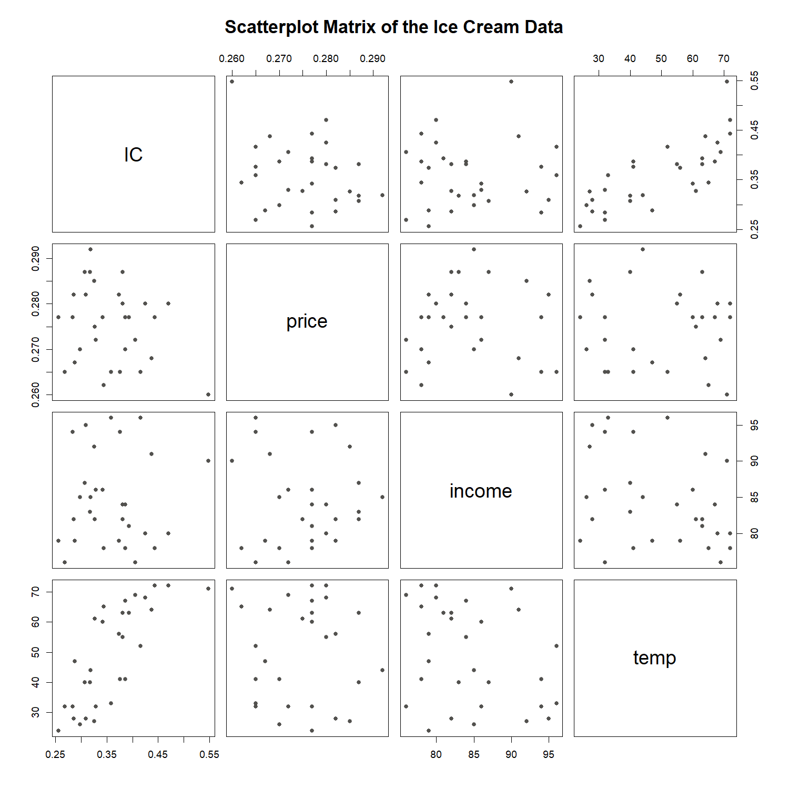
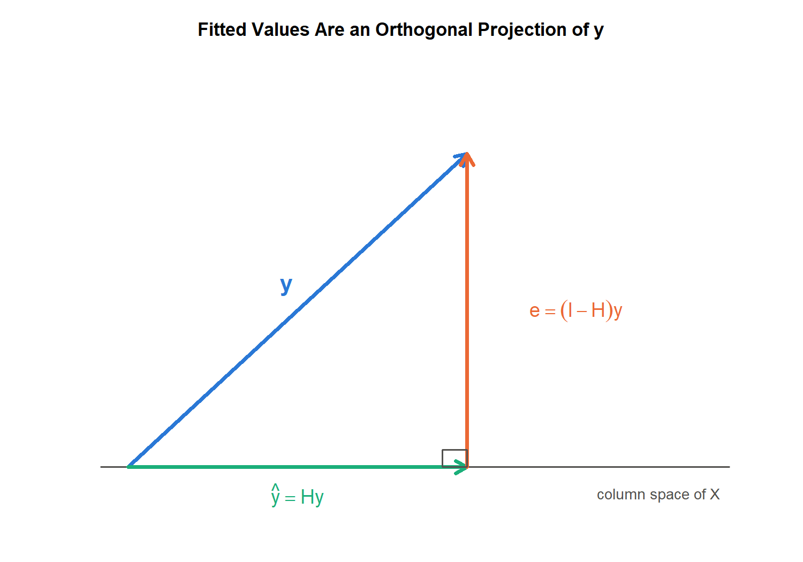
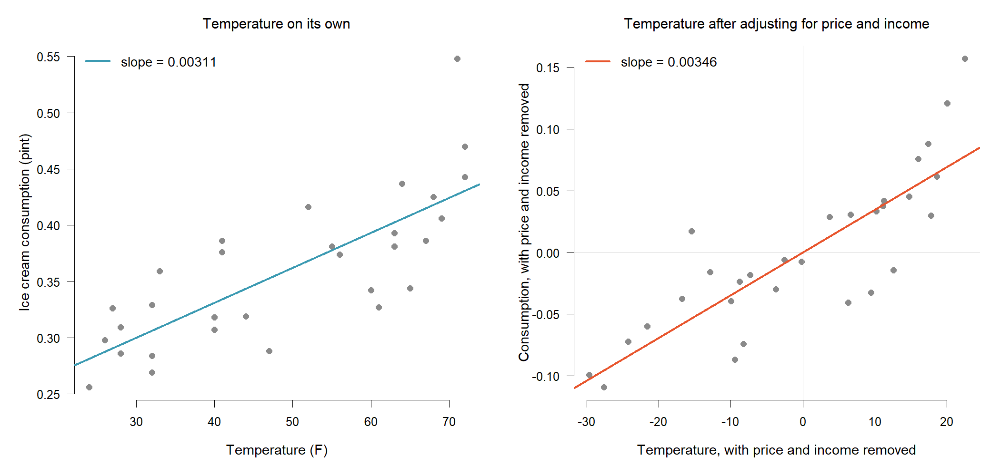
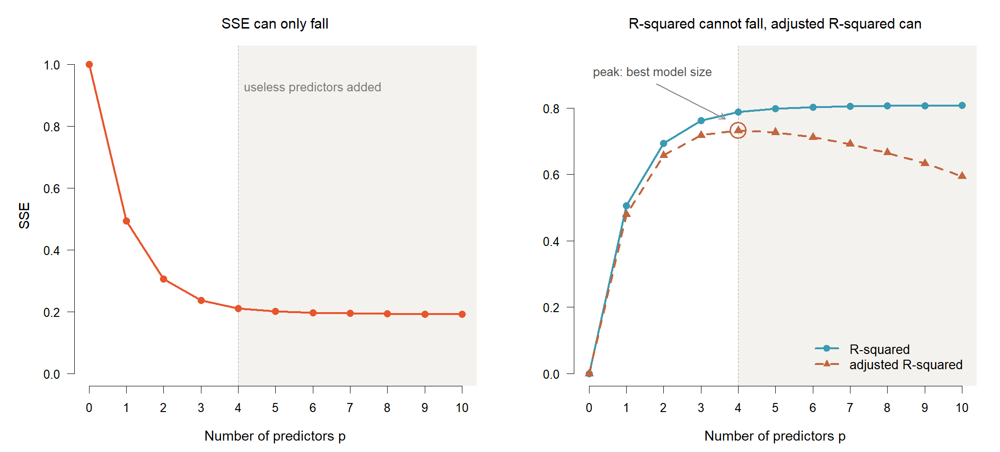
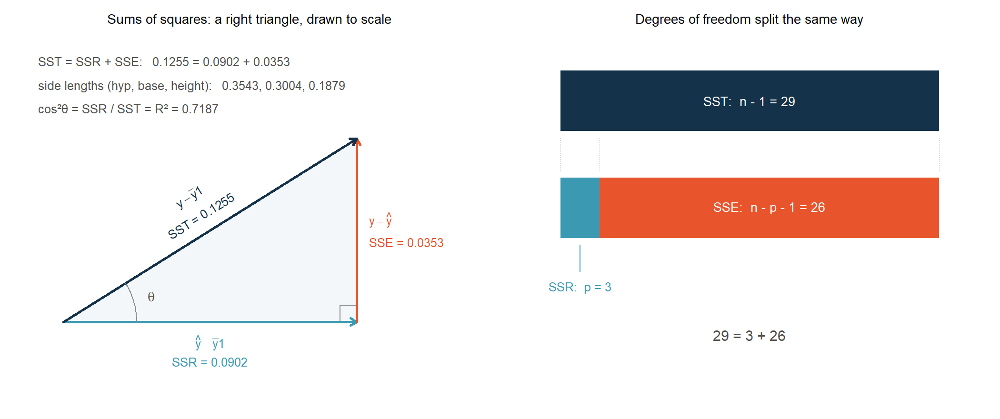

<!-- Date: 2026-08-26 | Purpose: chapter 4 of the KINS regression lecture, split from regression-lecture-note.qmd. Generated by code/agent/2026-08-26/split-chapters.py - edit the master, not this file. | File: 04-multiple-linear-regression.qmd -->

# Multiple Linear Regression

::: notes
앞 장에서는 온도 하나만으로 아이스크림 소비량을 설명했습니다. 이번 장은 가격과 소득까지 한꺼번에 식에 넣습니다. 요리로 치면 지금까지 소금 하나로 맛을 설명하려 한 셈입니다. 재료가 늘면 요리가 풍성해지듯 모형도 좋아집니다. 대신 계수를 읽을 때 반드시 지켜야 할 규칙이 하나 생깁니다. 그 규칙과 함께, 계수가 얼마나 흔들리는지를 재는 방법까지 이 장에서 다루겠습니다. 중간에 모자행렬이라는 낯선 이름이 나옵니다. 겁내실 것 없습니다. 최소제곱이 왜 가장 가까운 점을 고르는지를 그림 한 장으로 보여 주는 도구입니다.
:::

## 설명변수가 여럿일 때

### <i class="fa-solid fa-question"></i> 질문

::: {.callout-note appearance="minimal"}
<i class="fa-solid fa-link"></i> **앞 장에서 여기까지**: 온도 하나로 $R^2=0.602$. <i class="fa-solid fa-circle-question"></i> **이 장의 질문**: 설명변수를 여럿으로 늘리면 계수를 어떻게 읽고, 얼마나 믿을 수 있는가
:::

::: {.highlight-box}
단순선형회귀의 적합 결과는 $R^2=0.602$ 였다. 소비량 변동의 약 40%는 온도 하나로 설명되지 않은 채 남아 있다.
:::

| Variable | Meaning | Role in this chapter |
|:--|:--|:--|
| `IC` | Per-capita ice cream consumption (pints) | Response $y_i$ |
| `price` | Price of ice cream | Predictor $x_{i1}$ |
| `income` | Income | Predictor $x_{i2}$ |
| `temp` | Mean temperature (°F) | Predictor $x_{i3}$ |
| `period` | Index of the four-week period | Identifier |
| `year` | Observation year code (0/1/2) | Used in the Dummy Variable chapter |

: Ice cream data: n = 30 four-week periods, 6 variables

::: notes
앞 장에서 온도 하나로 R 제곱 0.602, 소비량 출렁임의 60% 정도를 설명했습니다. 뒤집으면 40%는 아직 설명하지 못한 채 남아 있습니다. 가게 사장님이라면 가격을 올리면 덜 팔리고 동네 손님 소득이 오르면 더 팔린다고 의심할 만합니다. 표를 보시면 자료에 열이 여섯 개 있습니다. 이번 장에서 실제로 식에 넣는 것은 소비량, 가격, 소득, 온도 네 개입니다. 맨 아래 year는 계절이 아니라 몇 번째 해에 관측했는지를 적어 둔 값이고, 뒤쪽 가변수 장에서 다시 꺼내 쓰겠습니다. 여러분이 다루시는 계측기도 비슷하지 않습니까. 지시값이 온도 하나가 아니라 전원 전압, 습도 같은 여러 요인의 영향을 동시에 받습니다. 회귀는 조건부 기댓값이라고 했던 정의를 떠올려 주십시오. 오늘은 그 조건 자리에 변수를 여러 개 넣는 것뿐입니다.
:::

## 설명변수 간 관계 파악: 산점도 행렬

### <i class="fa-solid fa-chart-line"></i> 사전 자료 탐색

:::: {.columns}

::: {.column width="58%"}
{width=100%}
:::

::: {.column width="42%"}
::: {.callout-tip appearance="minimal"}
<i class="fa-solid fa-list-check"></i> **읽는 순서**

<ul>
<li>변수 4개의 모든 짝을 산점도로 그려 한 화면에 배치한 그림</li>
<li><code>temp</code>와 <code>IC</code>가 만나는 칸: 뚜렷한 우상향</li>
<li><code>price</code>, <code>income</code>과 <code>IC</code>가 만나는 칸: 방향이 흐릿함</li>
<li>설명변수끼리 만나는 칸도 함께 볼 것. 정보가 겹치는지 확인하기 위함</li>
</ul>
:::
:::

::::

::: notes
다중회귀에서는 변수가 여러 개라 산점도도 여러 장이 필요합니다. 이것을 바둑판처럼 한 화면에 모은 것이 산점도 행렬입니다. 화면에서 IC와 temp가 만나는 칸을 보시면 점들이 오른쪽 위로 또렷하게 올라갑니다. 앞 장에서 본 그 관계가 그대로 보입니다. 반면 IC와 price, IC와 income이 만나는 칸은 방향이 한눈에 들어오지 않을 만큼 흐릿합니다. 그림을 먼저 보는 이유는 단순합니다. 식을 세우기 전에 어떤 재료가 유망한지 감을 잡고, 이상한 점이 없는지 눈으로 확인하기 위해서입니다. 설명변수들끼리 만나는 칸도 봐 두십시오. 설명변수끼리 서로 닮아 있으면 정보가 겹쳐서 계수 해석이 흔들립니다. 그것을 숫자로 진단하는 방법은 다음 장에서 소개하겠습니다.
:::

## 다중선형회귀모형: 정의 {.smaller}

### <i class="fa-solid fa-bullseye"></i> 설명변수의 확장

::: {.highlight-box}
관측 $i=1,\dots,n$ 에 대하여
$$y_i=\beta_0+\beta_1 x_{i1}+\beta_2 x_{i2}+\cdots+\beta_p x_{ip}+\varepsilon_i$$
:::

**기호**

<ul>
<li>$y_i$: $i$번째 반응변수(소비량), $x_{ij}$: $i$번째 관측의 $j$번째 설명변수 값</li>
<li>$\beta_0$: 절편, $\beta_1,\dots,\beta_p$: 각 설명변수의 회귀계수</li>
<li>$\varepsilon_i$: 평균 0, 분산 $\sigma^2$ 인 오차</li>
<li>$n$: 관측 수(30), $p$: 설명변수 개수(3)</li>
</ul>

::: {.callout-tip appearance="minimal"}
<i class="fa-solid fa-pen-to-square"></i> **조건부 기댓값으로 다시 쓰면**

$$E(Y\mid x_1,\dots,x_p)=\beta_0+\beta_1 x_1+\cdots+\beta_p x_p$$

회귀가 설명변수 조건 아래 반응변수의 평균이라는 정의는 그대로이고, 조건 자리에 놓이는 변수의 개수만 늘어남
:::

::: {.aside}
Source: Kutner, Nachtsheim, Neter, Li (2005), *Applied Linear Statistical Models*, 5th ed.
:::

::: notes
식 자체는 앞 장의 직선 식에서 항이 몇 개 더 붙었을 뿐입니다. 요리로 치면 맛은 기본 간에 소금 효과, 설탕 효과, 불 조절 효과를 더하고 마지막에 그날의 운을 더한 것입니다. 각 계수 베타는 그 재료를 한 단위 더 넣었을 때 맛이 얼마나 변하는지를 나타냅니다. 맨 뒤의 엡실론이 그날의 운, 우리가 설명하지 못하는 나머지입니다. 아래 상자도 봐 주십시오. 회귀의 정의는 하나도 바뀌지 않았습니다. 조건 자리에 들어가는 변수만 하나에서 셋으로 늘었습니다. 우리 자료에서는 가격, 소득, 온도 세 개를 쓰니 p는 3, 관측이 30개이니 n은 30입니다.
:::

## 다중선형회귀모형: 행렬 표현

### <i class="fa-solid fa-pen-to-square"></i> 관측 30개의 한 식 표현

::: {.highlight-box}
$$\mathbf y=\mathbf X\boldsymbol\beta+\boldsymbol\varepsilon$$
:::

$$
\mathbf X=\begin{pmatrix}
1 & x_{11} & x_{12} & x_{13}\\
1 & x_{21} & x_{22} & x_{23}\\
\vdots & \vdots & \vdots & \vdots\\
1 & x_{n1} & x_{n2} & x_{n3}
\end{pmatrix}
$$

**기호**

<ul>
<li>$\mathbf y$: 반응변수 $n$ 개를 쌓은 벡터, $\boldsymbol\varepsilon$: 오차 벡터</li>
<li>$\mathbf X$: 절편용 1의 열과 설명변수 열을 묶은 $n\times(p+1)$ 설계행렬</li>
<li>$\boldsymbol\beta$: 회귀계수 벡터($p+1$ 개). 이 자료에서 $\mathbf X$ 는 $30\times 4$</li>
</ul>

::: notes
관측이 서른 개면 방정식도 서른 줄입니다. 그것을 다 늘어놓으면 화면이 모자랍니다. 그래서 세로로 쌓아 한 덩어리로 묶습니다. 그것이 행렬 표기입니다. 왼쪽 맨 앞 열이 전부 1인 점이 눈에 띄실 것입니다. 이 열이 절편을 담당합니다. 절편은 어떤 설명변수에도 곱해지지 않고 항상 그대로 더해지니 곱하는 숫자가 1입니다. 우리 자료는 관측이 30개, 절편까지 세면 계수가 4개라서 설계행렬이 30행 4열입니다. 앞 장에서 행렬을 왜 배우는지 물으셨다면, 답이 이 화면입니다.
:::

## 최소제곱 해와 정규방정식 {.smaller .stepped}

### <i class="fa-solid fa-pen-to-square"></i> 벡터 미분

<ol>
<li><b>목적함수를 전개한다.</b> 잔차제곱합은 스칼라이므로 전치를 취해도 같은 값. 가운데 두 항이 서로 전치 관계라 하나로 묶임
$$S(\boldsymbol\beta)=(\mathbf y-\mathbf X\boldsymbol\beta)^\top(\mathbf y-\mathbf X\boldsymbol\beta)
=\mathbf y^\top\mathbf y-2\boldsymbol\beta^\top\mathbf X^\top\mathbf y+\boldsymbol\beta^\top\mathbf X^\top\mathbf X\boldsymbol\beta$$</li>
<li><b>2장의 미분 공식 둘을 그대로 쓴다.</b> $\dfrac{\partial(\boldsymbol\beta^\top\mathbf a)}{\partial\boldsymbol\beta}=\mathbf a$ 와 $\dfrac{\partial(\boldsymbol\beta^\top\mathbf A\boldsymbol\beta)}{\partial\boldsymbol\beta}=2\mathbf A\boldsymbol\beta$ ($\mathbf A$ 가 대칭일 때). 첫 항은 $\boldsymbol\beta$ 가 없으므로 사라짐
$$\frac{\partial S}{\partial\boldsymbol\beta}=-2\mathbf X^\top\mathbf y+2\mathbf X^\top\mathbf X\boldsymbol\beta$$</li>
<li><b>$\mathbf 0$ 으로 놓으면 정규방정식.</b> $\mathbf X$ 가 full rank이면 $(\mathbf X^\top\mathbf X)^{-1}$ 가 존재하므로 양변 왼쪽에 곱해 해를 얻음
$$\mathbf X^\top\mathbf X\boldsymbol\beta=\mathbf X^\top\mathbf y$$</li>
</ol>

::: {.callout-note appearance="minimal"}
$$\therefore\hat{\boldsymbol\beta}=(\mathbf X^\top\mathbf X)^{-1}\mathbf X^\top\mathbf y$$
:::

::: notes
유도의 뼈대는 앞 장과 똑같습니다. 잔차를 제곱해 다 더한 값을 가장 작게 만드는 지점을 찾고, 그 지점은 미분해서 0으로 놓으면 나옵니다. 다만 이번에는 미지수가 여러 개라 하나씩 미분하는 대신 벡터째로 미분합니다. 첫 단계는 괄호를 푸는 것뿐입니다. 가운데 두 항이 서로 전치 관계인데 스칼라라서 값이 같으니 하나로 묶어 2를 붙였습니다. 두 번째 단계에서 2장에서 챙겨 둔 미분 공식 두 개를 씁니다. 베타 전치 곱하기 상수벡터를 미분하면 그 상수벡터가 남고, 베타 전치 A 베타를 미분하면 2 A 베타가 남습니다. 여기서 A 자리에 X 전치 X가 들어가는데, 이 행렬이 대칭이라는 사실은 2장 전치 슬라이드에서 확인해 두었습니다. 세 번째 단계에서 0으로 놓으면 정규방정식입니다. 이름의 정규는 정규분포와 아무 상관이 없고 수직이라는 뜻의 normal에서 왔습니다. 왜 수직인지는 곧 그림으로 보여 드리겠습니다. 맨 아래 띠가 오늘 이 장에서 계속 쓸 한 줄입니다. 변수가 3개든 30개든 계산은 이 한 줄로 끝납니다.
:::

## 최소제곱 해가 존재할 조건 {.smaller}

### <i class="fa-solid fa-bullseye"></i> $\mathbf X$ 의 full rank 조건

::: {.highlight-box}
$\mathbf X$ 가 $n\times(p+1)$ 이고 $\operatorname{rank}(\mathbf X)=p+1\;(\le n)$ 일 때, 그리고 그때만 $(\mathbf X^\top\mathbf X)^{-1}$ 가 존재하고 최소제곱 해가 유일하게 정해진다.
:::

<ul>
<li>2장에서 본 사슬 그대로. $\operatorname{rank}(\mathbf X^\top\mathbf X)=\operatorname{rank}(\mathbf X)$ 이므로, $\mathbf X$ 가 full rank가 아니면 $\det(\mathbf X^\top\mathbf X)=0$ 이고 역행렬이 없음</li>
<li>깨지는 경우 둘. 어떤 설명변수가 다른 설명변수들의 <b>정확한 선형결합</b>일 때(예: 섭씨와 화씨를 함께 투입), 그리고 <b>$n<p+1$</b> 로 관측이 계수보다 적을 때</li>
</ul>

::: {.callout-note appearance="minimal"}
<i class="fa-solid fa-table"></i> **아이스크림 완전모형**: $n=30$, $p=3$ 이므로 $\mathbf X$ 는 $30\times 4$. $\operatorname{rank}(\mathbf X)=4=p+1$ 로 full rank이며 해가 유일하게 정해짐

잔차제곱합은 두 가지로 같게 계산됨: $\mathbf e^\top\mathbf e=\mathbf y^\top\mathbf y-\hat{\boldsymbol\beta}^\top\mathbf X^\top\mathbf y=0.035313$
:::

::: notes
역행렬이 늘 구해지느냐. 조건이 하나 붙습니다. 설계행렬이 full rank여야 합니다. 2장에서 배운 계수 이야기가 여기서 그대로 쓰입니다. 계수가 모자라면 행렬식이 0이 되고, 행렬식이 0이면 역행렬이 없습니다. 2장에서 아이스크림 설계행렬에 섭씨 온도를 덧붙여 봤던 것을 기억하십니까. 화씨와 섭씨는 일차식으로 서로 바꿀 수 있으니 열이 하나 늘어도 계수는 그대로 4였고, 행렬식이 46만에서 사실상 0으로 떨어졌습니다. 그것이 바로 이 조건이 깨진 경우입니다. 깨지는 두 번째 경우는 관측 수가 추정할 계수보다 적을 때입니다. 미지수가 식보다 많으면 답이 하나로 정해지지 않는 것과 같은 이야기입니다. 아래 상자의 마지막 줄도 봐 주십시오. 잔차제곱합을 세 가지 방식으로 계산했는데 값이 정확히 같습니다. 어느 길로 계산해도 같은 곳에 도착합니다.
:::

## 모자행렬: 정의

### <i class="fa-solid fa-bullseye"></i> 적합값을 만드는 행렬

::: {.highlight-box}
$$\mathbf H=\mathbf X(\mathbf X^\top\mathbf X)^{-1}\mathbf X^\top,\qquad \hat{\mathbf y}=\mathbf X\hat{\boldsymbol\beta}=\mathbf H\mathbf y$$
:::

**기호**

<ul>
<li>$\mathbf H$: 설계행렬 $\mathbf X$ 만으로 결정되는 $n\times n$ 행렬, $\hat{\mathbf y}$: 적합값 벡터</li>
<li>$\mathbf y$ 에 곱해 주면 $\mathbf y$ 가 모자를 쓴 $\hat{\mathbf y}$ 가 된다고 해서 <b>모자행렬(hat matrix)</b></li>
</ul>

::: {.callout-tip appearance="minimal"}
<i class="fa-solid fa-pen-to-square"></i> **잔차도 같은 방식으로 얻는다**

$$\mathbf e=\mathbf y-\hat{\mathbf y}=(\mathbf I-\mathbf H)\mathbf y$$

$\mathbf I$: $n\times n$ 항등행렬, $\mathbf e$: 잔차 벡터($e_i=y_i-\hat y_i$). 적합값과 잔차가 모두 $\mathbf y$ 의 선형변환으로 표현됨
:::

::: {.aside}
Source: Hoaglin, D. C., & Welsch, R. E. (1978). The hat matrix in regression and ANOVA. *The American Statistician*, 32(1), 17-22.
:::

::: notes
이름이 정직합니다. y에 곱해 주면 y가 모자를 쓴다고 해서 모자행렬입니다. 미국 통계학자 두 사람이 1978년 논문에서 이 이름을 널리 퍼뜨렸습니다. 중요한 것은 이 행렬이 무엇으로 만들어졌는가입니다. 오른쪽 식을 보시면 재료가 설계행렬 X뿐입니다. 반응변수 y는 한 번도 등장하지 않습니다. 무슨 뜻일까요. 아이스크림이 얼마나 팔렸는지와 무관하게, 우리가 언제 어떤 조건에서 자료를 모았는가만으로 이 행렬이 정해진다는 뜻입니다. 아래 상자에서는 잔차도 같은 방식으로 나온다는 점을 보여 드립니다. 적합값과 잔차, 회귀의 두 주인공이 모두 y에 행렬 하나를 곱한 모양이라는 사실만 챙겨 가시면 됩니다.
:::

## 모자행렬: 직교사영

### <i class="fa-solid fa-chart-line"></i> 최소제곱의 기하학적 의미

:::: {.columns}

::: {.column width="58%"}
{width=100%}
:::

::: {.column width="42%"}
::: {.callout-tip appearance="minimal"}
<i class="fa-solid fa-chart-line"></i> **그림이 말하는 것**

<ul>
<li>$\hat{\mathbf y}=\mathbf H\mathbf y$ 는 $\mathbf y$ 를 $\mathbf X$ 의 열공간(column space)에 수직으로 내린 사영</li>
<li>잔차 $\mathbf e=(\mathbf I-\mathbf H)\mathbf y$ 는 그 열공간에 직교: $\mathbf X^\top\mathbf e=\mathbf 0$</li>
<li>직교하므로 $\hat{\mathbf y}$ 는 열공간 위의 점 가운데 $\mathbf y$ 에 가장 가까운 점</li>
</ul>
:::
:::

::::

::: notes
최소제곱이 무엇을 하는 계산인지 이 그림 한 장이 다 말해 줍니다. 바닥에 깔린 가로선을 설계행렬이 만들 수 있는 모든 값의 세계라고 생각해 보십시오. 우리 모형으로 도달 가능한 지점들입니다. 실제 관측값 y는 파란 화살표처럼 그 바닥 위에 떠 있습니다. 모형으로는 완벽하게 재현할 수 없다는 뜻입니다. 그러면 바닥 위에서 y와 가장 가까운 점은 어디일까요. 발을 수직으로 내린 자리, 초록 화살표입니다. 전등을 바로 위에서 비췄을 때 생기는 그림자라고 생각하셔도 좋습니다. 주황색 잔차가 바닥과 정확히 직각을 이루는 것이 보이십니까. 조금 전 정규방정식의 정규가 이 직각입니다. 최소제곱은 가장 가까운 점을 고르는 계산이고, 그 답이 수직으로 내린 그림자입니다.
:::

## 모자행렬: 성질과 확인 {.smaller}

### <i class="fa-solid fa-table"></i> 대칭, 멱등, 대각합

**성질**

| Property | Expression | Ice cream full model |
|:--|:--|:--|
| Size | $n\times n$ | $30\times 30$ |
| Symmetry | $\mathbf H^\top=\mathbf H$ | 성립 |
| Idempotence | $\mathbf H\mathbf H=\mathbf H$ | 성립 |
| Trace | $\operatorname{tr}(\mathbf H)=p+1$ | 4 |
| Mean leverage | $(p+1)/n$ | 0.133 |

: Properties of the hat matrix verified on the full model (n = 30, p = 3)

멱등은 이미 사영한 것을 다시 사영해도 그대로라는 뜻. 대각합 $\operatorname{tr}(\mathbf H)$ 는 대각원소의 합이며 추정한 계수의 개수 $p+1=4$ 와 일치

**다음 장 예고**

::: {.callout-tip appearance="minimal"}
<ul>
<li>대각원소 $h_{ii}$ = <strong>레버리지(leverage)</strong>, 곧 $i$번째 관측이 자기 적합값을 끌어당기는 힘의 크기</li>
<li>이 자료의 평균 레버리지 $4/30=0.133$, 최댓값 0.278(관측 9)</li>
<li>레버리지가 큰 관측이 결과를 좌우하는지 판정하는 기준은 다음 장에서</li>
</ul>
:::

::: notes
성질 표부터 보겠습니다. 대칭은 행과 열을 바꿔도 같다는 뜻이고, 멱등은 한 번 그림자를 만든 뒤 다시 그림자를 만들어도 똑같다는 뜻입니다. 이미 바닥에 붙어 있으니 당연한 성질입니다. 대각합이 4라는 점이 흥미롭습니다. 우리가 추정한 계수가 절편 포함 네 개인데, 그 숫자가 행렬의 대각선 합으로 정확히 튀어나옵니다. 이 값은 모형이 자료에서 써 버린 정보의 양이라고 이해하시면 됩니다. 마지막 상자가 중요합니다. 대각선에 놓인 숫자 하나하나를 레버리지라고 부릅니다. 관측 하나가 자기 적합값을 얼마나 세게 끌어당기는지를 나타냅니다. 평균은 0.133이고 이 자료에서 가장 큰 값은 0.278입니다. 이 숫자로 영향점을 어떻게 판정하는지는 다음 장에서 이어 가겠습니다. 세 성질이 왜 성립하는지는 다음 슬라이드에서 한 번에 보이겠습니다.
:::

## 모자행렬: 세 성질의 증명 {.smaller}

### <i class="fa-solid fa-pen-to-square"></i> 대칭성에서 나오는 셋

$\mathbf X^\top\mathbf X$ 가 대칭이므로 그 역행렬도 대칭. 이 사실만으로 세 성질이 모두 나옴

$$
\begin{aligned}
\mathbf H^\top &=\big\{\mathbf X(\mathbf X^\top\mathbf X)^{-1}\mathbf X^\top\big\}^\top
=\mathbf X\big\{(\mathbf X^\top\mathbf X)^{-1}\big\}^\top\mathbf X^\top=\mathbf H\\[6pt]
\mathbf H\mathbf H &=\mathbf X(\mathbf X^\top\mathbf X)^{-1}
\underbrace{\mathbf X^\top\mathbf X\,(\mathbf X^\top\mathbf X)^{-1}}_{=\;\mathbf I}\mathbf X^\top=\mathbf H\\[6pt]
\operatorname{tr}(\mathbf H)&=\operatorname{tr}\big\{(\mathbf X^\top\mathbf X)^{-1}\mathbf X^\top\mathbf X\big\}
=\operatorname{tr}(\mathbf I_{p+1})=p+1
\end{aligned}
$$

셋째 줄에는 $\operatorname{tr}(\mathbf{AB})=\operatorname{tr}(\mathbf{BA})$ 를 사용

::: notes
증명을 보시면 세 성질이 모두 한 가지 사실에서 나옵니다. $\mathbf X^\top\mathbf X$ 가 대칭이니 그 역행렬도 대칭이라는 것, 그것뿐입니다. 첫 줄은 전치를 취하면 순서가 뒤집히는데 양 끝이 $\mathbf X$ 와 $\mathbf X^\top$ 로 대칭이라 결국 제자리로 돌아옵니다. 두 번째 식에서는 가운데의 $\mathbf X^\top\mathbf X$ 와 그 역행렬이 만나 사라지면서 원래 모양으로 돌아옵니다. 세 번째 식에서는 대각합의 순서를 바꿔도 된다는 성질을 써서 항등행렬을 만들어 냅니다. 그래서 대각합이 계수의 개수가 됩니다.
:::

## 우도함수를 이용한 추정: 유도 {.smaller .stepped}

### <i class="fa-solid fa-pen-to-square"></i> 최소제곱과의 일치

<ol>
<li><b>결합가능도를 행렬로 적는다.</b> 오차가 서로 독립인 정규분포를 따른다고 가정하면 밀도 $n$개의 곱이 가능도. 지수에 모인 것이 앞 슬라이드의 $S(\boldsymbol\beta)$
$$L(\boldsymbol\beta,\sigma^2)=(2\pi\sigma^2)^{-n/2}
\exp\!\left\{-\frac{(\mathbf y-\mathbf X\boldsymbol\beta)^\top(\mathbf y-\mathbf X\boldsymbol\beta)}{2\sigma^2}\right\}$$</li>
<li><b>로그를 취한다.</b> 로그는 증가함수라 최대점의 위치가 바뀌지 않음. $\boldsymbol\beta$ 가 들어 있는 항은 마지막 하나뿐
$$\ell(\boldsymbol\beta,\sigma^2)=-\frac{n}{2}\ln(2\pi)-\frac{n}{2}\ln\sigma^2-\frac{1}{2\sigma^2}S(\boldsymbol\beta)$$</li>
<li><b>계수의 부호를 본다.</b> 그 항의 계수 $-\dfrac{1}{2\sigma^2}$ 는 항상 <b>음수</b>이므로, $\ell$ 을 크게 만드는 일과 $S(\boldsymbol\beta)$ 를 작게 만드는 일이 같은 문제가 됨</li>
</ol>

::: {.callout-note appearance="minimal"}
$$\therefore\hat{\boldsymbol\beta}_{ML}=(\mathbf X^\top\mathbf X)^{-1}\mathbf X^\top\mathbf y=\hat{\boldsymbol\beta}_{LS}$$
:::

::: notes
3장에서 설명변수가 하나일 때 했던 이야기를 그대로 행렬로 옮긴 것입니다. 새로 배우는 것은 없습니다. 첫 단계에서 관측 서른 개의 확률밀도를 모두 곱합니다. 곱해 놓고 보면 지수 자리에 앞 슬라이드의 잔차제곱합이 통째로 들어와 앉습니다. 우리가 끼워 넣은 것이 아니라 계산하다 보니 나온 것입니다. 두 번째 단계에서 로그를 씌우면 덩어리가 셋으로 갈라지는데 베타가 들어 있는 것은 마지막 하나뿐입니다. 세 번째 단계가 핵심입니다. 그 앞에 붙은 계수가 마이너스입니다. 마이너스가 곱해져 있으니 전체를 크게 만들려면 잔차제곱합을 작게 만들어야 합니다. 그래서 최대가능도 추정량과 최소제곱 추정량이 글자 하나 다르지 않게 같아집니다. 서로 다른 출발점에서 같은 답에 도착한다는 점이 중요합니다. 최소제곱은 기하학적으로 거리를 줄이자는 발상이고, 최대가능도는 확률적으로 가장 그럴듯한 값을 고르자는 발상입니다.
:::

## 우도함수를 이용한 추정: $\sigma^2$ 의 차이 {.smaller}

### <i class="fa-solid fa-triangle-exclamation"></i> 분산추정량만 다름

$\ell$ 을 $\sigma^2$ 로 미분해 0으로 놓으면 최대가능도 분산추정량이 나옴. 최소제곱에서 쓰는 불편추정량과 분모가 다름

$$\hat\sigma^2_{ML}=\frac{1}{n}\,\mathbf y^\top(\mathbf I-\mathbf H)\mathbf y=\frac{SSE}{n},
\qquad
\hat\sigma^2=\frac{SSE}{n-p-1}$$

| Quantity | Formula | Ice cream full model |
|:--|:--|--:|
| $SSE$ | $\mathbf y^\top(\mathbf I-\mathbf H)\mathbf y$ | 0.035313 |
| $\hat\sigma^2_{ML}$ | $SSE/n$ | 0.0011771 |
| $\hat\sigma^2$ (불편) | $SSE/(n-p-1)$ | 0.0013582 |
| Ratio | $(n-p-1)/n=26/30$ | 0.8667 |

: Two variance estimators for the ice cream full model (n = 30, p = 3)

::: {.callout-important appearance="minimal"}
$E(\hat\sigma^2_{ML})=\dfrac{n-p-1}{n}\sigma^2$ 로 **과소추정**. 표준오차·검정·구간에는 항상 불편추정량 $\hat\sigma^2=SSE/(n-p-1)$ 을 씀
:::

::: notes
회귀계수는 두 방법이 같은 답을 주지만 분산은 다릅니다. 이 차이가 실무에서 중요합니다. 최대가능도 쪽은 잔차제곱합을 관측 수 서른으로 나눕니다. 최소제곱 쪽은 스물여섯으로 나눕니다. 스물여섯은 서른에서 추정한 계수 네 개를 뺀 값, 곧 잔차의 자유도입니다. 표를 보시면 값이 0.0011771과 0.0013582로 다릅니다. 비율이 정확히 30분의 26, 0.8667입니다. 최대가능도 쪽이 늘 작게 나온다는 뜻이고, 이것을 과소추정이라고 합니다. 분산을 작게 잡으면 표준오차도 작아지고 신뢰구간도 좁아집니다. 실제보다 정밀한 것처럼 보이게 된다는 말입니다. 그래서 표준오차와 검정, 구간을 계산할 때는 반드시 자유도로 나눈 불편추정량을 씁니다. 최대가능도 쪽 값은 뒤 장에서 AIC를 계산할 때 다시 나옵니다. 거기서는 일부러 이 값을 씁니다.
:::

## 회귀계수의 해석: 정의

### <i class="fa-solid fa-bullseye"></i> 다른 변수 고정

::: {.highlight-box}
$\beta_j$ 는 **다른 설명변수를 모두 고정한 채** $x_j$ 만 한 단위 증가시켰을 때 반응변수 평균의 변화량이다.

$$\beta_j=E(Y\mid x_j+1,\ \text{나머지 고정})-E(Y\mid x_j,\ \text{나머지 고정})$$
:::

::: {.callout-tip appearance="minimal"}
<i class="fa-solid fa-triangle-exclamation"></i> **해석에 반드시 붙는 조건절**

<ul>
<li>"다른 변수를 고정했을 때"를 빼면 다중회귀 계수의 해석은 성립하지 않음</li>
<li>같은 설명변수라도 모형에 함께 들어간 변수가 달라지면 계수 추정값도 달라짐</li>
</ul>
:::

::: notes
다중회귀 계수를 읽는 규칙은 하나입니다. 다른 변수를 고정했을 때라는 조건을 반드시 붙이십시오. 왜 필요한지는 요리로 생각하면 쉽습니다. 설탕을 한 숟갈 더 넣었을 때 맛이 얼마나 달라지는지 말하려면 소금과 불 조절은 그대로 두어야 공정한 비교가 되지 않겠습니까. 소금도 같이 바꿔 버리면 맛의 변화가 설탕 때문인지 소금 때문인지 구분할 수 없습니다. 계수 하나를 말할 때는 항상 나머지를 붙잡아 둔 상태를 상상하셔야 합니다. 두 번째 항목도 중요합니다. 같은 온도 변수라도 혼자 들어갔을 때와 가격, 소득과 함께 들어갔을 때의 계수는 달라집니다. 겹치는 몫을 다시 나누어 계산하기 때문입니다. 다음 화면에서 실제 숫자로 확인해 보겠습니다.
:::

## 회귀계수의 해석: full model 적합 {.smaller}

### <i class="fa-solid fa-table"></i> 가격·소득·온도

**추정 경로**

설계행렬 $\mathbf X$ 의 네 열은 절편, price, income, temp

$$
\mathbf X=\begin{pmatrix}
1 & x_{11} & x_{12} & x_{13}\\
1 & x_{21} & x_{22} & x_{23}\\
\vdots & \vdots & \vdots & \vdots\\
1 & x_{30,1} & x_{30,2} & x_{30,3}
\end{pmatrix}_{30\times 4},
\qquad
\hat{\boldsymbol\beta}=(\mathbf X^\top\mathbf X)^{-1}\mathbf X^\top\mathbf y
=\begin{pmatrix}0.193\\ -1.03\\ 0.00331\\ 0.00346\end{pmatrix}
$$

단순회귀와 달라진 것은 열의 개수뿐. 공식 자체는 그대로

**적합식**

$$\hat y_i = 0.193 - 1.03\,x_{i1} + 0.00331\,x_{i2} + 0.00346\,x_{i3}$$

::: {style="font-size: 0.62em; line-height: 1.2"}

**기호**

<ul>
<li>$\hat y_i$: $i$번째 기간 소비량의 적합값</li>
<li>$x_{i1}$: 가격, $x_{i2}$: 소득, $x_{i3}$: 온도</li>
</ul>

:::

**계수표**

| Term | Estimate | p-value |
|:--|---:|---:|
| (Intercept) | 0.193 | n.a. |
| price ($x_{i1}$) | $-1.03$ | 0.226 |
| income ($x_{i2}$) | 0.00331 | 0.0090 |
| temp ($x_{i3}$) | 0.00346 | $3.0\times 10^{-8}$ |

: Full model fit (n = 30, $R^2$ = 0.719, adjusted $R^2$ = 0.686)

절편의 p-value는 해석 대상이 아니므로 `n.a.` 로 표기함.

::: notes
위에서부터 차례로 보겠습니다. 추정 경로에서 앞 장과 달라진 점은 설계행렬의 열이 두 개에서 네 개로 늘어난 것뿐입니다. 추정 공식은 글자 하나 바뀌지 않습니다. 그 결과가 오른쪽의 계수 네 개입니다. 그 아래가 그것을 식으로 옮긴 적합식입니다. 맨 앞 0.193이 절편, 그 뒤 세 숫자가 가격, 소득, 온도의 계수입니다. 맨 아래 계수표를 눈여겨봐 주십시오. 계수 추정값과 p-값이 나란히 있습니다. 온도는 p-값이 3 곱하기 10의 마이너스 8승, 0.00000003 수준으로 아주 작습니다. 소득은 0.009로 역시 작습니다. 가격만 0.226으로 큽니다. 이 숫자들을 어떻게 읽는지는 다음 화면에서 정리하겠습니다.
:::

## 회귀계수의 해석: 계수와 p-value

### <i class="fa-solid fa-lightbulb"></i> 추정 결과의 서술

::: {.highlight-box}
$\hat\beta_3=0.00346$ (temp): 가격과 소득을 고정한 채 온도만 1도(°F) 상승할 때의 평균 소비량 증가분
:::

::: {.callout-tip appearance="minimal"}
<i class="fa-solid fa-lightbulb"></i> **p-value의 뜻**

<ul>
<li>"이 계수는 사실 0이다"라는 주장이 옳다고 가정했을 때, 지금 자료에서 얻은 것만큼 또는 그보다 더 극단적인 추정값이 나올 확률</li>
<li>값이 작을수록 그 주장을 우연으로 설명하기 어려움. 흔히 0.05를 기준으로 삼고, 그보다 작으면 <strong>유의하다</strong>고 말함</li>
<li>단순회귀의 기울기 0.00311이 여기서 0.00346으로 바뀐 이유: 다른 변수가 들어오며 온도의 몫을 다시 나누었기 때문</li>
</ul>
:::

::: notes
temp의 계수 0.00346은 가격과 소득이 그대로일 때 온도만 화씨 1도 오르면 소비량이 평균 0.00346만큼 늘어난다는 뜻입니다. 앞 장 단순회귀에서는 기울기가 0.00311이었는데 여기서는 0.00346으로 달라졌습니다. 다른 변수들이 식에 들어오면서 온도의 몫을 다시 나누어 계산했기 때문입니다. 이 다시 나눈다는 말이 정확히 무슨 뜻인지는 다음 두 슬라이드에서 계산으로 보여 드리겠습니다. p-값은 처음 들으시면 어렵게 느껴집니다. 뜻은 의외로 단순합니다. 이 계수가 사실은 0인데도 순전히 우연으로 이만한 숫자가 나올 확률이 얼마인가를 재는 것입니다. 확률이 아주 작다면 우연으로 보기 어렵습니다. 그때 유의하다고 말합니다. 겨우 0.00346이면 너무 작은 것 아니냐고 하실 수 있습니다. 단위가 1인당 파인트라서 그렇습니다. 온도가 수십 도 움직이고 거기에 손님 수까지 곱해진다고 생각해 보십시오.
:::

## '보정'의 의미: 두 단계 {.smaller .stepped}

### <i class="fa-solid fa-lightbulb"></i> 고정의 계산적 정의

<ol>
<li><b>반응변수에서 다른 변수의 몫을 뺀다.</b> $y$ 를 가격과 소득에만 회귀시키고 남은 잔차 $e_{y\cdot(\text{price},\,\text{income})}$, 곧 가격과 소득으로는 설명되지 않는 소비량 부분</li>
<li><b>관심 변수에서도 똑같이 뺀다.</b> $x_{\text{temp}}$ 를 가격과 소득에 회귀시키고 남은 잔차 $e_{\text{temp}\cdot(\text{price},\,\text{income})}$, 곧 가격과 소득으로는 설명되지 않는 온도 부분</li>
<li><b>남은 것끼리 단순회귀한다.</b> 두 잔차를 산점도에 찍고 직선을 그으면, 그 기울기가 <b>다중회귀의 $\hat\beta_{\text{temp}}$ 와 정확히 일치</b></li>
</ol>

::: {.callout-note appearance="minimal"}
$$\hat\beta_j=\frac{\sum e_{y\cdot\text{others}}\;e_{x_j\cdot\text{others}}}{\sum e_{x_j\cdot\text{others}}^{2}}$$
:::

::: notes
다른 변수를 고정한다는 말을 계산으로 옮기면 무엇인가. 이 세 단계가 그 답입니다. 먼저 소비량에서 가격과 소득으로 설명되는 부분을 빼냅니다. 남은 것이 가격과 소득으로는 설명이 안 되는 소비량입니다. 다음으로 온도에서도 똑같이 가격과 소득의 몫을 빼냅니다. 남은 것이 가격과 소득과 겹치지 않는 순수한 온도의 변동입니다. 이제 남은 것끼리만 놓고 단순회귀를 합니다. 그 기울기가 다중회귀에서 나온 온도 계수와 소수점 끝까지 같습니다. 이것을 보정한다, 통제한다, 조정한다고 부릅니다. 세탁에 비유해 보겠습니다. 흰 옷에 묻은 얼룩이 커피 때문인지 김칫국 때문인지 알고 싶습니다. 커피 자국을 먼저 지우고 남은 얼룩만 보면 김칫국의 몫이 드러납니다. 다중회귀 계수가 하는 일이 정확히 그것입니다. 맨 아래 식이 세 단계를 한 줄로 적은 것입니다. 분자도 분모도 원래 변수가 아니라 잔차라는 점만 보시면 됩니다.
:::

## '보정'의 의미: 직접 확인 {.fig-led}

### <i class="fa-solid fa-chart-line"></i> 보정 전후의 기울기

{width=100% .nostretch style="max-height: 560px"}

::: {.callout-tip appearance="minimal" style="margin-top: 1em"}
<ul>
<li>왼쪽 기울기 $0.003107$ = 온도만 넣은 <b>단순회귀</b>의 계수. 오른쪽 기울기 $0.003462$ = 가격·소득의 몫을 양쪽에서 걷어 낸 뒤의 기울기이며, 완전모형의 $\hat\beta_{\text{temp}}$ 와 일치(차이 $8.7\times10^{-19}$)</li>
<li>오른쪽 직선은 반드시 원점을 지남. 두 축이 모두 잔차라 평균이 0이기 때문</li>
</ul>
:::

::: notes
왼쪽이 온도 하나만 넣었을 때입니다. 기울기가 0.003107입니다. 오른쪽은 방금 말씀드린 두 단계를 거친 그림입니다. 가로축은 가격과 소득으로 설명되지 않는 온도, 세로축은 가격과 소득으로 설명되지 않는 소비량입니다. 여기에 직선을 그으면 기울기가 0.003462, 완전모형의 온도 계수와 같습니다. 컴퓨터로 확인해 보니 차이가 10의 마이너스 19승 수준, 사실상 0입니다. 우연이 아니라 항상 이렇게 됩니다. 두 그림을 나란히 놓고 보시면 다중회귀가 무슨 일을 하는지 눈으로 보입니다. 변수를 여러 개 넣는다는 것은 각 변수에서 다른 변수와 겹치는 부분을 걷어 내고 남은 몫만으로 계수를 매긴다는 뜻입니다. 오른쪽 그림에서 직선이 원점을 지나는 것도 눈여겨봐 주십시오. 양쪽 축이 다 잔차라서 평균이 0이고, 3장에서 배웠듯 직선은 반드시 평균점을 지나기 때문입니다.
:::

## 회귀계수의 해석: 유의하지 않은 계수

### <i class="fa-solid fa-triangle-exclamation"></i> 증거 부족과 효과 없음

::: {.callout-tip appearance="minimal"}
<i class="fa-solid fa-lightbulb"></i> **p-value가 큰 계수를 읽는 법**

<ul>
<li>price: $\hat\beta_1=-1.03$, $p=0.226$</li>
<li>부호는 예상과 일치하나, 이 자료에서 효과를 뒷받침할 증거는 부족</li>
<li>"증거 부족"은 "효과가 없다"는 증명이 아님</li>
<li>가격이 움직인 범위가 좁으면 효과가 있어도 잡아내기 어려움</li>
</ul>
:::

가격을 식에서 뺄 것인지는 Diagnosis & Variable Selection 장의 변수선택에서 판단

::: notes
price를 보십시오. 계수는 마이너스 1.03으로 사장님의 직감과 방향은 같습니다. 가격이 오르면 덜 팔린다는 뜻입니다. 그런데 p-값이 0.226이라 유의하지 않습니다. 그러면 가격은 소비량과 무관할까요. 아닙니다. 이 자료에서 가격이 움직인 범위 안에서는 효과를 확인할 증거가 부족하다는 뜻이지, 효과가 없다는 증명이 아닙니다. 법정의 무죄 판결이 결백의 증명이 아니라 증거 부족이라는 뜻인 것과 같습니다. 이 구분은 실무에서 특히 중요합니다. 유의하지 않았다는 이유로 그 인자를 무시했다가 낭패를 보는 경우가 적지 않습니다. 가격을 식에서 뺄지 말지는 다음 장의 변수선택에서 정식으로 따져 보겠습니다.
:::

## 모형의 설명력: 수정 $R^2$

### <i class="fa-solid fa-triangle-exclamation"></i> $R^2$ 의 단조 증가

::: {.highlight-box}
설명변수를 추가하면 $R^2$ 는 결코 감소하지 않는다. 설명변수 개수가 다른 모형을 $R^2$ 만으로 비교할 수 없는 이유다.
:::

### <i class="fa-solid fa-bullseye"></i> 정의

$$\bar R^2 = 1-\frac{SSE/(n-p-1)}{SST/(n-1)}$$

**기호**

<ul>
<li>$SSE=\sum_{i=1}^n e_i^2$: 잔차제곱합($e_i=y_i-\hat y_i$), $n$: 관측 수, $p$: 설명변수 개수</li>
<li>$SST=\sum_{i=1}^n(y_i-\bar y)^2$: 총제곱합($\bar y$ 는 $y$ 의 평균)</li>
<li>$p$ 가 커지면 나누는 수 $n-p-1$ 이 작아져 벌점이 붙음. 쓸모없는 변수를 넣으면 $\bar R^2$ 는 오히려 내려감</li>
</ul>

::: notes
여행 가방에 물건을 하나 더 넣으면 쓸모가 있든 없든 혹시 필요할지 모른다며 든든해 보입니다. R 제곱이 그렇습니다. 설명변수를 넣기만 하면 절대 내려가지 않고 항상 조금은 오릅니다. 그러니 변수 개수가 다른 두 모형을 R 제곱만으로 견주면 언제나 변수가 많은 쪽이 이깁니다. 공정한 비교가 아닙니다. 그래서 변수 하나당 사용료를 물린 점수를 만들었습니다. 수정 R 제곱입니다. 수식에서 p가 커지면 n 빼기 p 빼기 1이 작아지고, 그러면 분수 값이 커져서 점수가 깎입니다. 잔차가 그 벌점을 이길 만큼 충분히 줄어야 비로소 값이 올라가는 구조입니다. 다음 슬라이드에서 이 자료로 실제 그런 일이 일어나는지 보겠습니다.
:::

## $R^2$, 수정 $R^2$, SSE의 관계 {.smaller .fig-led}

### <i class="fa-solid fa-chart-line"></i> 세 값의 이동 방향

{width=100% .nostretch style="max-height: 560px"}

::: {.callout-tip appearance="minimal"}
<ul>
<li>$SST$ 가 고정이므로 $R^2=1-SSE/SST$ 는 SSE를 뒤집은 값일 뿐. 왼쪽이 내려가면 파란 선은 반드시 올라감. <b>$R^2$ 는 변수 추가에 반대할 수 없는 지표</b></li>
<li>수정 $R^2$ 는 두 제곱합을 각자의 자유도로 나누므로, 새 변수가 자유도 하나 값을 못 벌면 <b>내려감</b>. 회색 구간이 그런 변수들이 들어간 자리이고, 꺾이는 지점이 적정 모형 크기</li>
</ul>
:::

::: notes
이 그림은 자료를 적합한 결과가 아니라 개념도입니다. R 제곱 곡선만 그럴듯하게 정해 두고, SSE와 수정 R 제곱은 정의 그대로 계산해서 그린 것입니다. 그러니 세 곡선의 관계는 임의로 그린 것이 아니라 공식이 강제한 모양입니다. 왼쪽부터 보십시오. 변수를 더할 때마다 잔차제곱합은 내려가거나 그대로입니다. 절대 올라가지 않습니다. 변수를 더 준 상태에서 최적화하는데 더 나빠질 수는 없으니까요. 오른쪽 파란 선은 그것을 뒤집어 놓은 것에 지나지 않습니다. 총제곱합이 고정이니 SSE가 내려가면 R 제곱은 반드시 올라갑니다. 그래서 R 제곱은 변수를 넣지 말라고 말할 수 없습니다. 주황색 점선이 수정 R 제곱입니다. 처음에는 파란 선을 바짝 따라 오르다가 회색 구간에 들어서면서 꺾여 내려옵니다. 회색 구간은 쓸모없는 변수들이 들어간 자리입니다. 왼쪽 그림에서 같은 구간을 보시면 SSE가 사실상 평평합니다. 얻은 것은 거의 없는데 자유도는 하나씩 내주었으니 벌점이 이깁니다. 꺾이는 지점이 적정 모형 크기이고, 변수선택은 결국 이 꼭짓점을 찾는 일입니다. 다음 장에서 다시 다룹니다. 한 가지 덧붙이면, 우리 아이스크림 자료에서는 이 꺾임이 나타나지 않습니다. 설명변수 세 개가 모두 소비량과 관련이 있어서 무엇을 더해도 수정 R 제곱이 같이 올라갑니다. 꺾임을 보려면 쓸모없는 변수가 섞여 있어야 하는데, 그런 상황을 그린 것이 이 개념도입니다.
:::

## 모형의 설명력: 세 모형 비교

### <i class="fa-solid fa-table"></i> 벌점을 적용한 비교

| Model | $R^2$ | Adjusted $R^2$ |
|:--|---:|---:|
| IC ~ temp | 0.602 | 0.587 |
| IC ~ income + temp | 0.702 | 0.680 |
| IC ~ price + income + temp | 0.719 | 0.686 |

: $R^2$ and adjusted $R^2$ for three nested models (n = 30)

::: {.callout-tip appearance="minimal"}
<i class="fa-solid fa-lightbulb"></i> **읽기**

<ul>
<li>$R^2$ 는 변수를 넣을수록 0.602, 0.702, 0.719로 계속 오름. 상승 자체는 당연</li>
<li>수정 $R^2$ 는 0.587, 0.680, 0.686. 벌점을 적용해도 상승</li>
<li>모형끼리 비교할 때 보는 값은 수정 $R^2$. 두 변수 모형과 세 변수 모형의 차이는 0.006으로 작음</li>
</ul>
:::

::: notes
표를 보시면 온도만 있을 때 0.602였던 R 제곱이 소득을 더하니 0.702, 가격까지 더하니 0.719로 올랐습니다. 앞서 말씀드린 대로 이 상승 자체는 의미가 없습니다. 넣기만 하면 오르는 값이기 때문입니다. 봐야 할 것은 오른쪽 열입니다. 수정 R 제곱도 0.587에서 0.680으로 크게 올랐습니다. 소득은 확실히 값어치를 했습니다. 그런데 가격을 더할 때는 0.680에서 0.686, 겨우 0.006 올랐습니다. 사용료를 간신히 벌어들인 수준입니다. 이 애매한 차이를 어떻게 판정할지가 다음 장 변수선택의 주제입니다. 수정 R 제곱이 조금이라도 오르면 무조건 넣어야 할까요. 그렇지는 않습니다. 최종 판단은 AIC 같은 다른 기준과 함께 내리는 편이 안전합니다.
:::

## 제곱합의 분해 {.smaller}

### <i class="fa-solid fa-bullseye"></i> 총변동의 분해

::: {.highlight-box}
$$\underbrace{\sum_{i=1}^{n}(y_i-\bar y)^2}_{\mathrm{SST}}
=\underbrace{\sum_{i=1}^{n}(\hat y_i-\bar y)^2}_{\mathrm{SSR}}
+\underbrace{\sum_{i=1}^{n}(y_i-\hat y_i)^2}_{\mathrm{SSE}}$$
:::

**유도**

$y_i-\bar y$ 를 적합값이 설명한 조각과 잔차로 쪼갠 뒤 제곱하면 교차항이 하나 생김

$$\sum(y_i-\bar y)^2=\sum\big\{(\hat y_i-\bar y)+e_i\big\}^2
=\mathrm{SSR}+\mathrm{SSE}+2\sum(\hat y_i-\bar y)\,e_i$$

앞 장의 성질 $\mathbf X^\top\mathbf e=\mathbf 0$ 에서 $\sum e_i=0$ 이고 $\hat{\mathbf y}^\top\mathbf e=\hat{\boldsymbol\beta}^\top\mathbf X^\top\mathbf e=0$ 이므로

$$\sum(\hat y_i-\bar y)\,e_i=\underbrace{\sum \hat y_i e_i}_{=\,0}-\;\bar y\underbrace{\sum e_i}_{=\,0}=0$$

교차항이 사라져 제곱합이 그대로 둘로 나뉨. 두 조각이 **직교**하기 때문이며, 직각삼각형에서 빗변의 제곱이 두 변의 제곱의 합이 되는 것과 같은 구조

::: notes
분산분석의 출발점입니다. 아이디어는 한 문장으로 끝납니다. $y$ 가 흩어진 전체 양을 모형이 설명한 몫과 설명하지 못한 몫, 둘로 정확히 쪼갤 수 있다. 위쪽이 그 증명입니다. 관측값에서 평균을 뺀 것을 두 조각으로 나눠 씁니다. 적합값이 평균에서 얼마나 벗어났는지, 그리고 관측값이 적합값에서 얼마나 벗어났는지. 이 둘을 더하면 원래대로 돌아옵니다. 문제는 제곱할 때입니다. 제곱하면 보통 교차항이 남습니다. 그런데 여기서는 그 교차항이 정확히 0이 됩니다. 앞 장에서 배운 성질 덕분입니다. 설명변수와 잔차를 곱해 더하면 0, 절편 열이 전부 1이니 잔차의 합도 0. 그래서 교차항의 두 조각이 모두 사라집니다. 기하로 보면 더 분명합니다. 두 조각이 직각을 이루고 있어서 피타고라스 정리가 그대로 성립합니다. 그 그림을 다음 슬라이드에서 실제 숫자로 그려 놓았습니다.
:::

## 자유도의 분해 {.smaller .fig-led}

### <i class="fa-solid fa-chart-simple"></i> 자유도의 동반 분해

제곱합만 나뉘는 것이 아니라 자유도도 정확히 나뉨: $p+(n-p-1)=n-1$

{width=100% .nostretch style="max-height: 560px"}

::: {.callout-tip appearance="minimal"}
<ul>
<li>왼쪽 두 변이 <b>직각</b>인 것이 곧 $\sum(\hat y_i-\bar y)e_i=0$. 그래서 $\mathrm{SST}=\mathrm{SSR}+\mathrm{SSE}$ 는 피타고라스 정리 그 자체이며, 세 변의 길이는 각 제곱합의 제곱근</li>
<li>빗변과 밑변이 이루는 각 $\theta$ 에 대해 $\cos^2\theta=\mathrm{SSR}/\mathrm{SST}=R^2=0.719$. 각이 작을수록 설명력이 큼</li>
<li>총 자유도가 $n$ 이 아니라 $n-1$ 인 이유: $\bar y$ 를 구하는 데 정보 하나를 이미 씀. 잔차 자유도 $n-p-1$ 은 앞 장의 $\operatorname{tr}(\mathbf I-\mathbf H)$ 와 같은 값이고 $30-3-1=26$</li>
</ul>
:::

::: notes
왼쪽 그림이 앞 슬라이드의 식을 그대로 그린 것입니다. 축척까지 실제 숫자에 맞췄습니다. 밑변이 모형이 설명한 몫, 세로변이 설명하지 못한 몫, 빗변이 전체 변동입니다. 두 변이 직각인 것이 핵심입니다. 교차항이 0이라는 계산이 그림에서는 직각으로 나타납니다. 그래서 SST 등호 SSR 더하기 SSE가 중학교에서 배운 피타고라스 정리와 완전히 같은 식이 됩니다. 각도 하나만 더 봐 주십시오. 빗변과 밑변이 이루는 각이 32도인데, 이 각의 코사인을 제곱하면 0.719, 바로 결정계수입니다. 설명력이 좋다는 말은 빗변이 밑변 쪽으로 눕는다는 말과 같습니다. 오른쪽이 오늘 새로 보실 부분입니다. 제곱합만 나뉘는 것이 아니라 자유도도 똑같이 나뉩니다. 위 막대가 전체 29, 아래가 3과 26으로 갈라진 것이고 길이 비율도 실제 값에 맞춰 그렸습니다. 총 자유도가 30이 아니라 29인 이유는 평균을 구하는 데 정보 하나를 이미 썼기 때문입니다. 잔차 쪽 26은 앞 장에서 본 대각합과 같은 값입니다. 이 두 줄이 다음 장 분산분석표의 뼈대가 됩니다.
:::

## 모형 전체의 유의성: 검정의 목적

### <i class="fa-solid fa-question"></i> 개별 계수에 앞선 검정

::: {.highlight-box}
개별 계수를 하나씩 따지기 전에 먼저 물어야 할 것: 설명변수를 모두 합쳐도 반응변수를 설명하지 못하는 것은 아닌가?
:::

### <i class="fa-solid fa-bullseye"></i> 가설

::: {.highlight-box}
$H_0:\ \beta_1=\beta_2=\cdots=\beta_p=0$ (절편을 제외한 모든 회귀계수가 0)

$H_1:$ 적어도 하나의 $\beta_j$ 는 0이 아니다
:::

**기호**

<ul>
<li>$H_0$: 귀무가설(기각 대상이 되는 기본 주장)</li>
<li>$H_1$: 대립가설</li>
</ul>

::: notes
개별 선수의 기록을 따지기 전에 팀 전체가 경기를 뛸 실력이 되는지부터 확인해야 합니다. F-검정이 그 팀 전체의 실력 테스트입니다. 귀무가설은 절편을 뺀 모든 회귀계수가 0, 세 재료가 몽땅 무의미하다는 극단적인 주장입니다. 귀무가설이라는 말이 낯설 수 있습니다. 뒤집어엎을 대상으로 일단 세워 두는 기본 주장이라고 생각하시면 됩니다. 대립가설은 그 반대인데, 전부 의미 있다가 아니라 적어도 하나는 의미 있다입니다. 이 차이가 중요합니다. F-검정을 통과했다고 모든 변수가 쓸모 있다는 뜻은 아니라는 결론이 여기서 나옵니다. 순서가 중요한 이유는 단순합니다. 팀이 아예 경기를 못 뛸 수준이면 개별 선수 기록을 따지는 일 자체가 의미 없습니다.
:::

## 모형 전체의 유의성: F 통계량 {.smaller}

### <i class="fa-solid fa-pen-to-square"></i> 설명한 몫과 남은 몫

$$F=\frac{SSR/p}{SSE/(n-p-1)}$$

**기호**

<ul>
<li>$SSR=\sum_{i=1}^n(\hat y_i-\bar y)^2$: 회귀제곱합. 모형이 설명한 부분</li>
<li>$SSE=\sum_{i=1}^n e_i^2$: 잔차제곱합. 설명하지 못한 부분</li>
<li>나누는 수 $p$ 와 $n-p-1$: <b>자유도</b>. 자료가 담은 정보 가운데 그 몫에 배정된 개수</li>
<li>관측 $n$ 개에서 계수 $p+1$ 개를 추정하는 데 쓰고 남은 것이 잔차의 자유도. 이 자료에서는 $30-3-1=26$</li>
</ul>

::: {.callout-tip appearance="minimal"}
<ul>
<li>$H_0$ 가 참이면 분자와 분모가 모두 $\sigma^2$ 의 불편추정량이 되어 $F$ 는 1 근처. 설명한 부분이 커질수록 $F$ 가 커져 $H_0$ 를 기각</li>
<li>$H_0$ 아래에서 $F\sim F(p,\;n-p-1)$. 아이스크림 완전모형은 $F(3,26)$</li>
<li>점검 순서: 모형 전체(F-검정) 통과 $\to$ 개별 계수(t-검정)</li>
</ul>
:::

::: {.callout-note appearance="minimal"}
<i class="fa-solid fa-pen-to-square"></i> **$R^2$ 로 다시 쓰면**: 분자와 분모를 $\mathrm{SST}$ 로 나누면 $F$ 가 결정계수만의 함수가 됨

$$F=\frac{R^2/p}{(1-R^2)/(n-p-1)}$$

$R^2$ 가 같아도 $p$ 가 크면 $F$ 는 작아짐. **설명력과 모형의 크기를 함께 보는 통계량**
:::

::: notes
분자는 모형이 설명한 부분을 변수 개수로 나눈 값입니다. 분모는 설명하지 못한 부분을 자유도로 나눈 값입니다. 자유도라는 말이 또 나왔습니다. 자료 서른 개가 가진 정보를 계수 네 개 추정하는 데 먼저 쓰고 나면 스물여섯 개어치가 남습니다. 그 남은 몫이 잔차의 자유도입니다. 30 빼기 3 빼기 1은 26. 여기서 눈여겨볼 것이 있습니다. 귀무가설이 참이라면, 그러니까 설명변수가 정말 아무 쓸모가 없다면 분자와 분모가 둘 다 같은 오차분산을 추정하게 됩니다. 그러면 비는 1 근처에서 놀게 됩니다. 반대로 설명한 쪽이 훨씬 크면 F가 1보다 한참 커지고, 팀 전체가 무의미하다는 주장을 기각합니다. 얼마나 커야 큰 것이냐. 그 기준을 주는 것이 앞 장에서 본 F분포입니다. 자유도 3과 26이니 경계값은 2.98입니다. 아래 상자도 봐 주십시오. 같은 F를 결정계수만으로 다시 쓴 식입니다. 설명력이 같아도 변수를 많이 쓴 모형은 F가 작아집니다. F가 설명력과 모형의 크기를 함께 저울질하는 통계량이라는 뜻입니다. 계측에 비유하면 시스템 전체 점검을 먼저 통과한 다음 채널별 점검으로 넘어가는 순서입니다. F-검정은 통과했는데 개별 t-검정이 하나도 유의하지 않으면 어떻게 하느냐. 변수끼리 정보가 심하게 겹칠 때 실제로 나타나는 현상이고, 다음 장에서 다시 만나겠습니다.
:::

## 회귀분산분석표 {.smaller}

### <i class="fa-solid fa-table"></i> 아이스크림 완전모형

| Source | Df | Sum Sq | Mean Sq | $F$ | $p$-value |
|:--|--:|--:|--:|--:|--:|
| Regression | 3 | 0.0902 | 0.0301 | 22.1 | $2.5\times10^{-7}$ |
| Residual | 26 | 0.0353 | 0.00136 | n.a. | n.a. |
| Total | 29 | 0.126 | n.a. | n.a. | n.a. |

: Analysis of variance for the ice cream full model (n = 30, p = 3)

::: {.callout-tip appearance="minimal"}
<i class="fa-solid fa-table"></i> **표 읽는 법**

<ul>
<li><b>Mean Sq</b> = Sum Sq를 Df로 나눈 값, 곧 <b>자유도 하나당 변동</b>. 크기가 다른 두 제곱합을 비교할 수 있게 만드는 척도 조정</li>
<li>$F=\mathrm{MSR}/\mathrm{MSE}=0.0301/0.00136=22.1$. $F(3,26)$ 의 5% 임계값 2.98을 크게 넘으므로 $H_0$ 기각</li>
<li>$\mathrm{MSE}=0.00136$ 이 오차분산 $\sigma^2$ 의 추정값이고, 그 제곱근 $\hat\sigma=0.0369$ 가 완전모형의 잔차 표준오차</li>
<li>세로 방향으로 제곱합과 자유도가 각각 더해짐: $0.0902+0.0353=0.126$, $3+26=29$</li>
</ul>
:::

::: {.callout-note appearance="minimal"}
<i class="fa-solid fa-circle-check"></i> **단순회귀에서는 t검정과 같은 결론**: 설명변수가 하나면 $F(1,n-2)=\{t(n-2)\}^2$ 이므로 두 검정이 완전히 일치. 온도만 넣은 단순회귀에서 $t=6.50$, 그 제곱 $6.50^2=42.3$ 이 그대로 $F$ 값
:::

::: notes
앞의 두 슬라이드를 한 장의 표로 모은 것이 분산분석표입니다. 표 읽는 순서를 알려 드리겠습니다. 왼쪽 위에서 오른쪽 아래로 갑니다. 먼저 Sum Sq 열입니다. 전체 0.126이 설명한 몫 0.0902와 남은 몫 0.0353으로 나뉘어 있습니다. 더해 보시면 정확히 맞습니다. Df 열도 마찬가지입니다. 3 더하기 26은 29. 다음이 Mean Sq 열인데, 여기가 핵심입니다. 제곱합을 자유도로 나눕니다. 왜 나눌까요. 설명한 몫은 변수 세 개가 만들어 낸 것이고 남은 몫은 스물여섯 개어치입니다. 크기가 다른 둘을 그냥 비교하면 불공평합니다. 그래서 각자의 자유도로 나눠 한 개당 얼마인지로 바꿉니다. 0.0301 대 0.00136. 스물두 배 넘게 차이가 납니다. 그 비가 F값 22.1입니다. 경계값 2.98을 한참 넘으니 세 변수가 모두 무의미하다는 주장은 기각됩니다. p값이 10의 마이너스 7제곱 수준입니다. 잔차 쪽 Mean Sq도 그냥 지나치지 마십시오. 이것이 바로 오차분산의 추정값입니다. 제곱근을 취한 0.0369가 우리가 계속 써 온 잔차 표준오차입니다. 마지막 상자는 앞 장의 F분포에서 예고한 내용입니다. 설명변수가 하나뿐이면 F검정과 t검정이 같은 결론을 냅니다. 단순회귀의 t값 6.50을 제곱해 보십시오. 42.3, 정확히 F값입니다.
:::

## 회귀계수 일부에 대한 검정 {.smaller}

### <i class="fa-solid fa-bullseye"></i> 여러 변수의 동시 제거

::: {.highlight-box}
완전모형(FM)에서 계수 $k$ 개를 0으로 놓은 축소모형(RM)을 세우고, 두 모형의 잔차제곱합 차이를 완전모형의 오차분산으로 잰다.

$$F=\frac{\{SSE(\text{RM})-SSE(\text{FM})\}/k}{SSE(\text{FM})/(n-p-1)}\ \sim\ F(k,\ n-p-1)\quad(H_0\text{ 아래에서})$$
:::

**기호**

<ul>
<li>$k$: 0으로 놓은 계수의 개수</li>
<li>$SSE(\text{RM})\ge SSE(\text{FM})$ 은 항상 성립하므로 분자는 음수가 될 수 없음</li>
<li>분자는 <b>뺀 변수들이 실제로 설명한 몫</b>을 뜻함</li>
</ul>

| Quantity | Value |
|:--|--:|
| $SSE$ (RM: temp only) | 0.050009 |
| $SSE$ (FM: price + income + temp) | 0.035313 |
| 차이 $/\,k=2$ | 0.007348 |
| $\hat\sigma^2=SSE(\text{FM})/26$ | 0.0013582 |
| $F$ | 5.410 |
| $p$-value | 0.0109 |

: Test of H0: price and income coefficients are both zero (ice cream data, n = 30)

::: notes
지금까지 두 가지 검정을 봤습니다. 계수 하나에 대한 t검정, 그리고 전부 다 0이냐는 F검정입니다. 실무에서는 그 사이가 필요할 때가 많습니다. 변수 몇 개를 묶어서 한꺼번에 뺄 수 있는지 묻는 경우입니다. 방법은 단순합니다. 빼기 전 모형과 뺀 뒤 모형을 각각 적합해서 잔차제곱합을 견줍니다. 변수를 빼면 잔차제곱합은 반드시 늘거나 그대로입니다. 늘어난 양이 곧 뺀 변수들이 설명하고 있던 몫입니다. 그 몫을 뺀 변수 개수로 나누고, 완전모형의 오차분산으로 나눕니다. 표를 보시겠습니다. 온도만 남긴 모형의 잔차제곱합이 0.0500, 세 변수를 다 넣은 모형이 0.0353입니다. 차이 0.0147을 변수 두 개로 나누면 0.00735, 이것을 오차분산 0.00136으로 나누면 F값 5.41입니다. p값이 0.0109로 0.05보다 작습니다. 가격과 소득이 둘 다 필요 없다는 주장은 기각된다는 뜻입니다. 여기서 흥미로운 점이 있습니다. 앞에서 가격의 t검정 p값은 0.226으로 유의하지 않았습니다. 하나씩 보면 뺄 만해 보여도 둘을 묶어서 보면 뺄 수 없다는 결론이 나올 수 있습니다. 개별 검정과 묶음 검정은 다른 질문이라는 뜻입니다.
:::

## 회귀계수의 표집분포: 추정량은 확률변수 {.smaller .stepped}

### <i class="fa-solid fa-lightbulb"></i> 참값과 오차의 몫

::: {.highlight-box}
한 번의 자료에서 계산한 $\hat{\boldsymbol\beta}$ 는 미지 계수 $\boldsymbol\beta$ 를 추정한 표본 결과이며, 자료가 바뀌면 값이 달라지는 **확률변수**이다. 자료를 다시 모아 같은 계산을 반복하면 추정값이 조금씩 달라지며, 그 값들이 이루는 분포가 **표집분포(sampling distribution)**
:::

<ol>
<li><b>정의에서 출발한다.</b> 관측한 $\mathbf y$ 만으로 계산하는 식이며, 이 단계에는 미지의 참값이 아직 등장하지 않음
$$\hat{\boldsymbol\beta}=(\mathbf X^\top\mathbf X)^{-1}\mathbf X^\top\mathbf y$$</li>
<li><b>$\mathbf y$ 를 모형으로 바꿔 쓴다.</b> 참 모형 $\mathbf y=\mathbf X\boldsymbol\beta+\boldsymbol\varepsilon$ 를 대입. 관측값 안에 <b>참값이 만든 부분</b>과 <b>오차</b>가 함께 들어 있음을 드러내는 단계
$$\hat{\boldsymbol\beta}=(\mathbf X^\top\mathbf X)^{-1}\mathbf X^\top(\mathbf X\boldsymbol\beta+\boldsymbol\varepsilon)$$</li>
<li><b>분배한 뒤 상쇄시킨다.</b> 두 항으로 가르면 앞 항에서 $(\mathbf X^\top\mathbf X)^{-1}$ 와 $\mathbf X^\top\mathbf X$ 가 만나 항등행렬이 되므로 $\boldsymbol\beta$ 만 남음
$$\hat{\boldsymbol\beta}=\underbrace{(\mathbf X^\top\mathbf X)^{-1}\mathbf X^\top\mathbf X}_{=\;\mathbf I}\boldsymbol\beta
+(\mathbf X^\top\mathbf X)^{-1}\mathbf X^\top\boldsymbol\varepsilon$$</li>
</ol>

::: {.callout-note appearance="minimal"}
$$\hat{\boldsymbol\beta}=\underbrace{\boldsymbol\beta}_{\textstyle \text{고정된 참값}}
+\underbrace{(\mathbf X^\top\mathbf X)^{-1}\mathbf X^\top\boldsymbol\varepsilon}_{\textstyle \text{자료마다 달라지는 몫}}$$
:::

::: notes
같은 공정을 여러 번 측정하면 측정값이 조금씩 달라집니다. 그 값으로 그은 직선의 기울기도 매번 달라집니다. 같은 실험을 다시 해도 점이 똑같은 자리에 찍히지는 않기 때문입니다. 그렇게 반복했을 때 나오는 추정값들을 모아 그린 분포가 표집분포입니다. 화면의 모자 쓴 베타는 진짜 값이 아니라 이번 표본에서 얻은 한 번의 결과입니다. 아래 세 줄이 그 사실을 식으로 보인 것입니다. 첫 줄은 우리가 실제로 계산하는 식입니다. 여기에는 관측값만 들어 있고 진짜 계수는 보이지 않습니다. 두 번째 줄에서 관측값 자리에 참 모형을 그대로 대입합니다. 관측값이란 참값이 만든 부분에 오차가 얹힌 것이라는 뜻이니, 이렇게 바꿔 써도 아무것도 달라지지 않습니다. 세 번째 줄이 핵심입니다. 괄호를 풀어 두 항으로 가르면 앞쪽에서 역행렬과 원래 행렬이 만나 서로 지워집니다. 항등행렬이 남으니 앞 항은 그냥 베타가 됩니다. 그래서 마지막 띠처럼 추정값은 고정된 참값에 오차가 계수 쪽으로 전달된 몫을 더한 모양이 됩니다. 앞 조각은 자료를 다시 모아도 그대로이고, 뒤 조각만 매번 달라집니다. 추정값이 흔들리는 이유가 오직 뒤 조각 하나라는 것, 이것이 다음 두 화면에서 평균과 분산을 계산할 때 그대로 쓰입니다.
:::

## 회귀계수의 표집분포: 불편성

### <i class="fa-solid fa-bullseye"></i> 참값과의 일치

::: {.callout-tip appearance="minimal"}
<i class="fa-solid fa-list-check"></i> **전제 조건**

<ul>
<li>$\mathbf X$ 를 고정된 것으로 두고 조건부로 생각</li>
<li>$E(\boldsymbol\varepsilon\mid\mathbf X)=\mathbf 0$: 오차의 평균이 0</li>
<li>$\operatorname{Var}(\boldsymbol\varepsilon\mid\mathbf X)=\sigma^2\mathbf I$: 오차의 분산이 모두 $\sigma^2$ 로 같고 서로 무관</li>
</ul>
:::

::: {.highlight-box}
$E(\hat{\boldsymbol\beta}\mid\mathbf X)=\boldsymbol\beta$: 최소제곱 추정량의 기댓값은 참값과 일치한다(불편추정량).
:::

| Symbol | Nature | Meaning |
|:--|:--|:--|
| $\boldsymbol\beta$ | Fixed unknown constant | 모집단의 참 회귀계수 |
| $\hat{\boldsymbol\beta}$ | Random variable | 표본이 바뀌면 달라지는 추정량 |

: Population coefficient versus its estimator

::: notes
오차의 평균이 0이라는 조건은 자료를 여러 번 반복해서 얻었을 때 오차가 계수를 한쪽으로만 밀지는 않는다는 뜻입니다. 그러면 평균적으로는 진짜 계수를 맞히게 되고, 이것을 불편성이라고 부릅니다. 여기서 꼭 구분하실 것이 표의 두 줄입니다. 베타는 모르지만 고정되어 있는 값, 모자 베타는 표본이 바뀌면 흔들리는 값입니다. 과녁은 가만히 있고 화살이 매번 다른 자리에 꽂힌다고 생각해 보십시오. 불편성은 화살들의 평균 위치가 과녁 중심과 맞는다는 뜻입니다. 화살 하나하나가 중심에 꽂힌다는 말은 결코 아닙니다. 그러면 화살이 얼마나 넓게 퍼지느냐. 그 퍼짐을 재는 것이 다음 화면의 분산입니다.
:::

## 회귀계수의 분산: 분산-공분산 행렬 {.smaller}

### <i class="fa-solid fa-bullseye"></i> 오차분산과 설계행렬

::: {.highlight-box}
앞의 전제 조건 아래에서 최소제곱 추정량의 분산-공분산 행렬은 오차분산과 설계행렬만으로 결정된다.
:::

$$
\operatorname{Var}(\hat{\boldsymbol\beta}\mid\mathbf X)=\sigma^2(\mathbf X^\top\mathbf X)^{-1}
$$

**기호**

<ul>
<li>$\sigma^2$: 오차분산</li>
<li>$(\mathbf X^\top\mathbf X)^{-1}$: 설계정보 행렬의 역행렬</li>
<li>대각 원소가 각 계수의 분산 $\operatorname{Var}(\hat\beta_j\mid\mathbf X)$, 비대각 원소가 계수 사이의 공분산</li>
</ul>

::: notes
이 한 줄이 계수의 흔들림을 무엇이 결정하는지 전부 말해 줍니다. 오른쪽에 등장하는 재료는 두 가지뿐입니다. 측정이 얼마나 시끄러운가를 나타내는 오차분산, 그리고 우리가 자료를 어떻게 모았는가를 담은 설계행렬. 사람의 취향이나 소프트웨어의 임의 설정이 끼어들 자리는 없습니다. 행렬의 대각선에 놓인 숫자가 각 계수의 분산이고, 대각선 바깥은 두 계수가 함께 움직이는 정도입니다. 결과표의 표준오차가 어디서 나온 숫자냐고 물으시면, 이 행렬의 대각선 원소에 제곱근을 취한 값이라고 답하시면 됩니다.
:::

## 회귀계수의 분산: 불확도의 결정 요인 {.smaller}

### <i class="fa-solid fa-lightbulb"></i> 잡음의 크기와 설계의 정보량

**오차의 크기**

- 잡음이 클수록 $\sigma^2$ 가 커지고 계수의 불확도가 **증가**
- 같은 설계에서 잡음이 두 배면 분산도 두 배

**설계의 정보량**

- 설명변수의 변동이 크고 서로 겹치지 않을수록 $(\mathbf X^\top\mathbf X)^{-1}$ 가 작아져 불확도가 **감소**
- 설명변수끼리 정보가 겹치면 역행렬이 커지고 표준오차도 커짐

**실제 계산**

- 오차분산은 알 수 없으므로 잔차로 추정: $\hat\sigma^2=SSE/(n-p-1)$
- $j$번째 계수의 표준오차: $\operatorname{se}(\hat\beta_j)=\sqrt{\widehat{\operatorname{Var}}(\hat\beta_j)}$
- $SSE$는 잔차제곱합, $n$은 관측 수, $p$는 설명변수 개수, $n-p-1$은 잔차의 자유도

::: notes
세 항목을 하나씩 보겠습니다. 첫째, 측정 자체가 시끄러우면 계수를 정확히 알기 어렵습니다. 둘째, 설명변수가 넓게 퍼져 있고 서로 비슷한 이야기를 반복하지 않으면 계수의 흔들림이 작아집니다. 앞 장에서 확인한 그 성질이 다변수에서도 그대로 성립합니다. 반대로 두 설명변수가 거의 같은 정보를 담고 있으면 역행렬이 커지면서 표준오차가 부풀어 오릅니다. 셋째, 실제 계산에서는 진짜 오차분산을 모르니 잔차 제곱합을 자유도로 나눈 값을 대신 씁니다. 행렬을 손으로 계산하실 일은 없습니다. 다만 표준오차가 측정오차와 실험 설계에서 나온 숫자라는 점은 기억해 주십시오.
:::

## 분산식의 유도: 세 단계 {.smaller .stepped}

### <i class="fa-solid fa-pen-to-square"></i> 전달 $\to$ 선형변환 $\to$ 상쇄

<ol>
<li><b>추정량을 오차의 함수로 바꾼다.</b> $\hat{\boldsymbol\beta}$ 의 정의에 모형 $\mathbf y=\mathbf X\boldsymbol\beta+\boldsymbol\varepsilon$ 를 대입하면 앞의 두 항이 상쇄되어 $\boldsymbol\beta$ 만 남음. 흔들리는 부분은 오차가 통로 $\mathbf A$ 를 지나온 것뿐
$$\hat{\boldsymbol\beta}=(\mathbf X^\top\mathbf X)^{-1}\mathbf X^\top(\mathbf X\boldsymbol\beta+\boldsymbol\varepsilon)
=\boldsymbol\beta+\underbrace{(\mathbf X^\top\mathbf X)^{-1}\mathbf X^\top}_{\textstyle \mathbf A}\boldsymbol\varepsilon$$
$E(\boldsymbol\varepsilon)=\mathbf 0$ 이므로 이 한 줄이 <b>불편성</b> $E(\hat{\boldsymbol\beta})=\boldsymbol\beta$ 도 함께 증명</li>
<li><b>선형변환의 분산 성질을 쓴다.</b> 상수행렬 $\mathbf A$ 와 확률벡터 $\mathbf z$ 에 대해 $\operatorname{Var}(\mathbf A\mathbf z)=\mathbf A\operatorname{Var}(\mathbf z)\mathbf A^\top$. $\mathbf X$ 를 고정으로 보므로 $\mathbf A$ 가 상수행렬이 됨
$$\operatorname{Var}(\hat{\boldsymbol\beta}\mid\mathbf X)=\operatorname{Var}(\mathbf A\boldsymbol\varepsilon)=\mathbf A\operatorname{Var}(\boldsymbol\varepsilon)\mathbf A^\top$$</li>
<li><b>대입하면 저절로 상쇄된다.</b> $\operatorname{Var}(\boldsymbol\varepsilon)=\sigma^2\mathbf I$ 를 넣고, $(\mathbf X^\top\mathbf X)^{-1}$ 가 대칭이라 $\mathbf A^\top=\mathbf X(\mathbf X^\top\mathbf X)^{-1}$ 임을 쓰면 가운데에 $\mathbf X^\top\mathbf X$ 가 생겨 역행렬 하나와 사라짐
$$\mathbf A(\sigma^2\mathbf I)\mathbf A^\top
=\sigma^2(\mathbf X^\top\mathbf X)^{-1}\underbrace{\mathbf X^\top\mathbf X}_{\textstyle \text{상쇄}}(\mathbf X^\top\mathbf X)^{-1}$$</li>
</ol>

::: {.callout-note appearance="minimal"}
$$\operatorname{Var}(\hat{\boldsymbol\beta}\mid\mathbf X)=\sigma^2(\mathbf X^\top\mathbf X)^{-1}$$
:::

::: notes
공식을 외우는 대신 왜 그렇게 되는지 한 줄씩 따라가 보겠습니다. 1단계가 이 유도의 전부라고 해도 지나치지 않습니다. 추정량의 정의에 모형을 그대로 대입합니다. 그러면 X 전치 X의 역행렬과 X 전치 X가 만나 사라지면서 베타가 통째로 남고, 뒤에 오차를 A라는 행렬로 변환한 항이 붙습니다. 이 한 줄에서 두 가지가 동시에 나옵니다. 오차의 평균이 0이니 기댓값을 취하면 추정량의 평균이 진짜 베타가 됩니다. 앞 슬라이드에서 본 불편성이 바로 여기서 나온 것입니다. 그리고 흔들리는 부분이 오직 뒤쪽 항뿐이라는 것도 보입니다. 그러니 계수의 분산은 오차의 분산을 A라는 통로로 통과시킨 결과일 수밖에 없습니다. 2단계는 확률벡터를 선형변환하면 분산이 어떻게 변하는지 알려 주는 기본 성질입니다. 변환행렬, 원래 분산, 변환행렬의 전치를 차례로 곱합니다. 여기서 X를 고정으로 본다는 조건이 붙습니다. 설계행렬이 확률변수가 아니어야 A를 상수처럼 밖으로 빼낼 수 있습니다. 3단계에서 오차의 분산 자리에 시그마 제곱 곱하기 항등행렬을 넣습니다. 이 자리가 등분산과 독립 가정이 실제로 쓰이는 유일한 곳입니다. 대각선이 전부 같은 시그마 제곱이라는 것이 등분산이고, 대각선 밖이 전부 0이라는 것이 독립입니다. A의 전치는 2장에서 확인한 대칭성 덕분에 깔끔하게 정리되고, 가운데에서 X 전치 X가 만들어져 역행렬 하나와 상쇄됩니다. 맨 아래 띠가 결과입니다. 손으로 계산하실 필요는 없지만, 오차가 설계행렬을 거쳐 계수의 불확도로 전파된다는 구조는 기억해 두십시오.
:::

## 분산식의 유도: 결과 읽기 {.smaller}

### <i class="fa-solid fa-lightbulb"></i> 단계별로 쓰인 가정

| Step | 사용한 가정 | 깨지면 생기는 일 |
|:--|:--|:--|
| 1. 오차의 함수로 | 모형이 옳음 ($E(\boldsymbol\varepsilon)=\mathbf 0$) | 추정량이 **편향**됨. 분산 이전의 문제 |
| 2. 선형변환 | $\mathbf X$ 는 고정 (확률변수 아님) | 조건부가 아닌 분산은 더 복잡해짐 |
| 3. $\operatorname{Var}(\boldsymbol\varepsilon)=\sigma^2\mathbf I$ | **등분산**(대각원소가 모두 같음) + **독립**(대각 밖이 0) | 계수 추정값은 그대로여도 **표준오차가 틀림** |

: Where each assumption enters the variance derivation

::: {.callout-tip appearance="minimal"}
<ul>
<li>결과가 $\sigma^2\times(\mathbf X^\top\mathbf X)^{-1}$ 로 <b>깔끔히 분리</b>됨. 앞은 측정의 잡음, 뒤는 설계가 담은 정보. 실험을 설계할 때 손댈 수 있는 쪽은 뒤쪽</li>
<li>$j$번째 계수의 표준오차 $\operatorname{se}(\hat\beta_j)=\hat\sigma\sqrt{c_{jj}}$, 계수 사이 공분산은 비대각원소 $\sigma^2c_{jk}$. 결과표의 표준오차와 신뢰구간이 모두 이 한 식에서 나옴</li>
</ul>
:::

::: notes
유도를 다시 훑는 대신, 각 단계가 무엇에 기대고 있는지를 정리했습니다. 이 표가 다음 슬라이드의 가우스-마코프 정리로 넘어가는 다리입니다. 1단계는 모형이 옳다는 것, 곧 오차의 평균이 0이라는 데 기댑니다. 이것이 깨지면 분산을 논하기 전에 추정값 자체가 한쪽으로 치우칩니다. 2단계는 설계행렬을 고정으로 본다는 조건입니다. 실험실에서 온도나 농도를 우리가 정해서 넣는 상황을 떠올리시면 됩니다. 3단계가 실무에서 가장 자주 깨지는 곳입니다. 오차의 분산행렬이 시그마 제곱 곱하기 항등행렬이라는 것은 두 가지를 한꺼번에 말합니다. 대각선이 전부 같다는 것이 등분산이고, 대각선 밖이 전부 0이라는 것이 독립입니다. 여기가 깨지면 어떻게 되느냐. 이 점이 중요합니다. 회귀계수 추정값 자체는 여전히 편향되지 않습니다. 대신 표준오차가 틀립니다. 그러면 t 값도 p 값도 신뢰구간도 전부 어긋납니다. 계수는 맞는데 그 계수를 얼마나 믿을지에 대한 판단이 틀어지는 것입니다. 이 상황을 다루는 방법이 6장 가중회귀입니다. 아래 상자도 봐 주십시오. 결과가 두 조각으로 깔끔히 갈라집니다. 앞의 시그마 제곱은 측정이 얼마나 시끄러운가, 뒤의 역행렬은 설계가 정보를 얼마나 담고 있는가입니다. 측정 장비를 바꾸기는 어렵지만 어디서 몇 번 측정할지는 우리가 정할 수 있습니다. 실험 설계가 중요한 이유가 이 식 안에 들어 있습니다.
:::

## Gauss-Markov 정리: 가정

### <i class="fa-solid fa-list-check"></i> 정리가 성립할 조건

::: {.callout-tip appearance="minimal"}
<i class="fa-solid fa-list-check"></i> **정리가 성립하기 위한 조건**

<ul>
<li><strong>선형모형</strong>: $\mathbf y=\mathbf X\boldsymbol\beta+\boldsymbol\varepsilon$</li>
<li><strong>오차 평균 0</strong>: $E(\boldsymbol\varepsilon\mid\mathbf X)=\mathbf 0$</li>
<li><strong>등분산</strong>: 모든 $i$ 에 대해 $\operatorname{Var}(\varepsilon_i\mid\mathbf X)=\sigma^2$</li>
<li><strong>무상관</strong>: $i\neq j$ 에 대해 $\operatorname{Cov}(\varepsilon_i,\varepsilon_j\mid\mathbf X)=0$</li>
<li><strong>full rank</strong>: $\mathbf X$ 의 열들이 선형독립, 즉 $(\mathbf X^\top\mathbf X)^{-1}$ 가 존재</li>
</ul>
:::

등분산과 무상관을 함께 쓰면 $\operatorname{Var}(\boldsymbol\varepsilon\mid\mathbf X)=\sigma^2\mathbf I$. **정규성은 이 목록에 없음**

::: notes
정리를 말하기 전에 조건부터 확인하겠습니다. 오차의 평균이 0이라는 것은 모형이 체계적으로 한쪽으로 치우쳐 있지 않다는 뜻입니다. 등분산은 첫 번째 관측이든 서른 번째 관측이든 흔들리는 폭이 같다는 뜻이고, 무상관은 한 관측의 오차를 안다고 해서 다른 관측의 오차를 짐작할 수 없다는 뜻입니다. 이 둘을 합치면 오차의 분산 행렬이 시그마 제곱 곱하기 항등행렬이라는 한 줄로 정리됩니다. 마지막 full rank 조건은 설명변수들이 서로 완전히 겹치지 않아야 역행렬을 만들 수 있다는 계산상의 요구입니다. 두 열이 똑같은 정보를 담고 있으면 계수를 나눠 가질 방법이 무수히 많아져 답이 하나로 정해지지 않습니다. 그런데 여기까지 오는 동안 정규분포 이야기가 한 번도 나오지 않았습니다. 이 점을 눈여겨봐 주십시오.
:::

## Gauss-Markov 정리: BLUE

### <i class="fa-solid fa-bullseye"></i> 최소분산 선형 불편추정량

Theorem (Gauss-Markov)

:   앞의 가정이 성립하면, 최소제곱 추정량 $\hat{\boldsymbol\beta}=(\mathbf X^\top\mathbf X)^{-1}\mathbf X^\top\mathbf y$ 는 $\mathbf y$ 의 선형함수이면서 불편인 모든 추정량 가운데 분산이 가장 작다.

::: {.callout-tip appearance="minimal"}
<i class="fa-solid fa-lightbulb"></i> **BLUE 네 글자의 뜻**

<ul>
<li><strong>B</strong>est: 같은 부류의 추정량 중 분산이 가장 작음</li>
<li><strong>L</strong>inear: 관측값 $\mathbf y$ 의 선형함수</li>
<li><strong>U</strong>nbiased: $E(\hat{\boldsymbol\beta})=\boldsymbol\beta$</li>
<li><strong>E</strong>stimator: 추정량</li>
</ul>
:::

::: notes
BLUE는 색깔 이름이 아니라 네 단어의 앞글자입니다. 여러 개의 자를 나란히 놓고 비교한다고 생각해 보십시오. 눈금이 한쪽으로 치우친 자는 불편이라는 조건에서 이미 탈락합니다. 남은 자들은 모두 평균적으로 진짜 위치를 가리킵니다. 그중에서 잴 때마다 가장 덜 흔들리는 자가 무엇이냐. 그 답이 최소제곱 추정량이라는 것이 이 정리입니다. 비교 대상이 관측값의 선형함수로 만든 추정량들로 제한되어 있다는 점도 함께 기억해 주십시오. 조건만 만족되면 굳이 더 복잡한 방법을 찾을 이유가 없다고 이 정리가 보장해 줍니다.
:::

## Gauss-Markov 정리: 결론별 필요 가정 {.smaller}

### <i class="fa-solid fa-triangle-exclamation"></i> 정규성의 역할

| Conclusion | Required assumptions |
|:--|:--|
| $\hat{\boldsymbol\beta}$ is BLUE | 평균 0, 등분산, 무상관, full rank |
| Exact $t$, $F$ tests and interval estimation | 위 조건에 오차의 **정규성**을 추가 |

: Assumptions required for each inferential conclusion (Kutner et al., 2005; Faraway, 2015)

::: {.callout-tip appearance="minimal"}
<ul>
<li>정규분포는 평균을 중심으로 좌우대칭인 종 모양 분포. 오차가 이 분포를 따른다는 가정이 정규성</li>
<li>정규성은 BLUE 자체에 필수가 아니며, 정확한 $t$, $F$ 검정과 구간 추론에 추가로 쓰임</li>
<li><strong>등분산이 깨지면 최소제곱은 더 이상 BLUE가 아님</strong>: Weighted Regression 장으로 이어지는 지점</li>
</ul>
:::

::: notes
정규분포 가정이 없어도 BLUE라는 결론은 그대로 유지됩니다. 정규성은 계수의 정확한 t검정과 신뢰구간을 만들 때 비로소 더해지는 조건입니다. 이 구분을 놓치면 곤란합니다. 회귀 가정이 하나의 묶음처럼 보이지만, 어떤 결론을 얻으려는가에 따라 필요한 가정이 다르기 때문입니다. 잔차가 정규분포에서 조금 벗어났다고 계수 추정 자체가 무너지지는 않는다는 이야기이기도 합니다. 등분산이 깨지면 사정이 달라집니다. 그때는 최소제곱이 최소분산 추정량 자리를 내주고, 관측마다 다른 무게를 주는 가중최소제곱이 필요해집니다. 이 강의 뒷부분의 가중회귀가 여기서 출발합니다.
:::

## 표준오차에서 신뢰구간으로

### <i class="fa-solid fa-bullseye"></i> 자유도 $n-p-1$ 의 $t$ 분포

::: {.highlight-box}
정규오차 가정 아래에서 표준화된 계수 추정량은 자유도 $n-p-1$ 인 $t$ 분포를 따른다.
:::

$$
\frac{\hat\beta_j-\beta_j}{\operatorname{se}(\hat\beta_j)}\sim t_{\,n-p-1}
\qquad\Longrightarrow\qquad
\hat\beta_j\pm t_{\alpha/2,\,n-p-1}\operatorname{se}(\hat\beta_j)
$$

<ul>
<li>$t$ 분포는 정규분포처럼 좌우대칭인 종 모양이나 꼬리가 더 두꺼움. 자유도가 커질수록 정규분포에 근접</li>
<li>$\operatorname{se}(\hat\beta_j)$: 표준오차, $t_{\alpha/2,\,n-p-1}$: 자유도 $n-p-1$ 인 $t$ 분포의 임계값</li>
<li>오른쪽 식이 $100(1-\alpha)\%$ 신뢰구간</li>
</ul>

::: notes
표준오차가 흔들림의 크기를 숫자 하나로 요약한다면, 신뢰구간은 그 흔들림을 양쪽 경계가 있는 범위로 보여 줍니다. 가운데가 추정값이고 양옆으로 임계값과 표준오차를 곱한 만큼 펼친 것이 전부입니다. t 분포는 정규분포와 생김새가 비슷한데 꼬리가 조금 더 두껍습니다. 자료가 적을수록 극단적인 값이 나올 여지를 더 넉넉히 잡아 준다고 이해하시면 됩니다. 자유도가 커지면 두 분포는 사실상 같아집니다. 임계값도 자유도에 따라 달라집니다. 자료가 적을수록 값이 커져서 구간이 넓어집니다. 아는 것이 적으면 조심스럽게 넓게 말한다고 이해하시면 자연스럽습니다.
:::

## 회귀계수에 대한 검정과 신뢰구간 {.smaller}

### <i class="fa-solid fa-bullseye"></i> $(\mathbf X^\top\mathbf X)^{-1}$ 의 대각원소

::: {.highlight-box}
$$\operatorname{se}(\hat\beta_j)=\hat\sigma\sqrt{c_{jj}},\qquad
t=\frac{\hat\beta_j}{\operatorname{se}(\hat\beta_j)}\sim t_{\,n-p-1},\qquad
\hat\beta_j\pm t_{\alpha/2,\,n-p-1}\,\hat\sigma\sqrt{c_{jj}}$$
:::

**기호**

<ul>
<li>$c_{jj}$: $(\mathbf X^\top\mathbf X)^{-1}$ 의 $j$번째 대각원소</li>
<li>$\hat\sigma^2=SSE/(n-p-1)=0.0013582$, $t_{0.025,\,26}=2.0555$</li>
</ul>

| Term | $\hat\beta_j$ | $c_{jj}$ | $\operatorname{se}$ | $t$ | $p$-value | 95% CI |
|:--|--:|--:|--:|--:|--:|:--|
| (Intercept) | 0.19270 | 53.3248 | 0.26912 | 0.72 | 0.480 | $(-0.360,\ 0.746)$ |
| price | −1.02906 | 507.6785 | 0.83037 | −1.24 | 0.226 | $(-2.736,\ 0.678)$ |
| income | 0.00331 | 0.001011 | 0.00117 | 2.83 | 0.0089 | $(0.00090,\ 0.00572)$ |
| temp | 0.00346 | 0.000146 | 0.00045 | 7.77 | < 0.001 | $(0.00255,\ 0.00438)$ |

: Coefficient tests and 95% confidence intervals for the ice cream full model (n = 30, p = 3)

::: notes
앞 슬라이드의 식에 실제 숫자를 넣은 것이 이 표입니다. 표준오차가 어디서 오는지부터 보십시오. 오차분산의 추정값에 X 전치 X 역행렬의 대각원소를 곱하고 제곱근을 취합니다. 그 대각원소가 표의 세 번째 열입니다. 가격의 값이 507로 유독 큽니다. 그래서 가격의 표준오차만 0.83으로 다른 것보다 훨씬 큽니다. 이 숫자가 큰 이유는 뒤 장에서 다중공선성으로 다시 다룹니다. t 값은 추정값을 그 표준오차로 나눈 것입니다. 온도는 7.77, 흔들림의 여덟 배 가까이 됩니다. 소득은 2.83, 가격은 마이너스 1.24입니다. 임계값이 2.0555이니 온도와 소득은 넘고 가격은 못 넘습니다. 맨 오른쪽이 신뢰구간입니다. 여기서 규칙 하나를 알려 드리겠습니다. 신뢰구간이 0을 품고 있으면 그 계수는 유의하지 않습니다. 가격의 구간을 보십시오. 마이너스 2.7에서 플러스 0.68까지, 0을 포함합니다. p값 0.226과 정확히 같은 이야기입니다. 검정과 구간은 같은 계산을 두 가지로 표현한 것일 뿐입니다.
:::

## 신뢰구간 해석의 주의

### <i class="fa-solid fa-triangle-exclamation"></i> 확률이 붙는 대상

::: {.callout-tip appearance="minimal"}
<i class="fa-solid fa-lightbulb"></i> **95% 신뢰구간을 읽는 법**

<ul>
<li>옳은 해석: 같은 절차를 반복해 만든 구간의 약 95%가 진짜 $\beta_j$ 를 포함하도록 설계됨</li>
<li>틀린 해석: "이번에 계산한 구간 안에 $\beta_j$ 가 있을 확률이 95%</li>
<li>확률은 계수가 아니라 구간을 만드는 절차에 붙음</li>
</ul>
:::

### <i class="fa-solid fa-screwdriver-wrench"></i> 실무 적용

보고 항목: 추정값, 표준오차, 95% 신뢰구간, 분석에 쓴 가정과 표본 범위. 구간은 $\hat\beta_j\pm t_{\alpha/2,\,n-p-1}\,\mathrm{SE}(\hat\beta_j)$ 로 계산

::: notes
95퍼센트라는 표현을 계수가 이 구간 안에 있을 확률로 읽으시면 안 됩니다. 진짜 계수는 고정되어 있고, 표본이 바뀌면 움직이는 쪽은 구간입니다. 확률은 계수가 아니라 구간을 만드는 절차에 붙어 있습니다. 올바른 뜻은 이렇습니다. 같은 방식으로 표본을 반복해 구간을 만들면 그중 약 95퍼센트가 진짜 계수를 포함하도록 절차를 설계했다는 것. 그물을 백 번 던져 아흔다섯 번은 고기를 담도록 그물을 짰다는 이야기이지, 지금 던진 이 그물 안에 고기가 있을 확률이 아닙니다. 보고서를 쓰실 때는 계수만 던지지 마시고 표준오차나 신뢰구간을 함께 제시해 주십시오. 그래야 읽는 사람이 결과의 정밀도를 스스로 판단할 수 있습니다.
:::

## 반응평균의 신뢰구간과 예측구간: 정의 {.smaller}

### <i class="fa-solid fa-bullseye"></i> 평균과 개별 관측

::: {.highlight-box}
새 설명변수 조합 $\mathbf x_0=(1,\ x_{01},\dots,x_{0p})^\top$ 에서 적합값은 $\hat y_0=\mathbf x_0^\top\hat{\boldsymbol\beta}$ 로 같으나, 목표가 **조건부 평균**인지 **새 관측 하나**인지에 따라 구간의 폭이 달라진다.

$$\text{신뢰구간}:\ \hat y_0\pm t_{\alpha/2,\,n-p-1}\,\hat\sigma\sqrt{\mathbf x_0^\top(\mathbf X^\top\mathbf X)^{-1}\mathbf x_0}$$

$$\text{예측구간}:\ \hat y_0\pm t_{\alpha/2,\,n-p-1}\,\hat\sigma\sqrt{1+\mathbf x_0^\top(\mathbf X^\top\mathbf X)^{-1}\mathbf x_0}$$
:::

<ul>
<li>근호 안의 $1$ 이 두 구간을 가르는 전부. 새 관측에는 개별 오차 $\varepsilon_0$ 이 추가로 실리기 때문. 따라서 <b>예측구간이 항상 더 넓음</b></li>
<li>$\mathbf x_0^\top(\mathbf X^\top\mathbf X)^{-1}\mathbf x_0$ 는 $\mathbf x_0$ 가 자료의 중심에서 멀수록 커짐. 자료 범위 밖으로 외삽하면 두 구간 모두 급격히 넓어짐</li>
</ul>

::: notes
3장에서 설명변수가 하나일 때 봤던 두 구간이 여기서는 행렬로 표현됩니다. 비유는 그대로입니다. 우리 반 평균 키를 맞히는 일과 다음에 전학 올 학생 한 명의 키를 맞히는 일은 난이도가 다릅니다. 평균은 개인차가 상쇄되어 좁게 잡히고, 한 명은 그 학생 고유의 편차까지 떠안아야 하니 넓어집니다. 두 식을 나란히 놓고 보시면 다른 곳이 딱 한 군데입니다. 근호 안에 1이 더 붙느냐 아니냐. 그 1이 새 관측에 실리는 오차입니다. 근호 안의 나머지 덩어리도 봐 주십시오. 새로 넣을 설명변수 값이 자료의 중심에서 멀어질수록 이 값이 커집니다. 3장에서 x가 평균에서 멀어질수록 구간이 넓어진다고 했던 것이 다변수에서는 이 이차형식으로 나타납니다. 자료가 없는 영역으로 나가면 예측이 급격히 불확실해진다는 경고가 식 안에 이미 들어 있는 셈입니다. 다음 슬라이드에서 실제 숫자로 확인하겠습니다.
:::

## 반응평균의 신뢰구간과 예측구간: 수치 {.smaller}

### <i class="fa-solid fa-table"></i> 아이스크림 자료, 새 조건

$\mathbf x_0=(1,\ 0.280,\ 85,\ 65)^\top$ 에서 $\hat y_0=0.19270-1.02906\times0.280+0.00331\times85+0.00346\times65=0.41107$

$$\mathbf x_0^\top(\mathbf X^\top\mathbf X)^{-1}\mathbf x_0=0.089095,\qquad
\hat\sigma=0.036853,\qquad t_{0.025,\,26}=2.0555$$

| Interval | Half-width | Result | Width |
|:--|:--|:--|--:|
| 신뢰구간 (평균반응) | $t\hat\sigma\sqrt{0.089095}=0.02261$ | $(0.38846,\ 0.43368)$ | 0.0452 |
| 예측구간 (새 관측) | $t\hat\sigma\sqrt{1.089095}=0.07906$ | $(0.33201,\ 0.49013)$ | 0.1581 |

: Two intervals at price = 0.280, income = 85, temp = 65 (ice cream full model, n = 30)

::: {.callout-tip appearance="minimal"}
예측구간의 폭이 신뢰구간의 **3.50배**. 근호 안의 $1$ 이 $0.0891$ 을 압도하기 때문이며, 검교정에서 **다음 측정값 하나를 보증**해야 한다면 반드시 예측구간을 씀
:::

::: notes
가격 0.280, 소득 85, 온도 65라는 새 조건을 하나 잡았습니다. 세 값 모두 관측 범위 안입니다. 적합값은 0.41107, 두 구간의 중심이 같습니다. 이제 폭을 보십시오. 신뢰구간의 반너비가 0.0226, 예측구간은 0.0791입니다. 3.5배 차이입니다. 이유는 근호 안을 보시면 바로 보입니다. 평균 쪽은 0.0891인데 개별 관측 쪽은 여기에 1이 더해져 1.0891이 됩니다. 1이 0.0891을 압도합니다. 이 배율은 자료가 아무리 많아져도 크게 줄지 않습니다. 관측을 늘리면 평균에 대한 불확실성은 줄어들지만 개별 관측이 흔들리는 정도, 곧 오차분산 자체는 줄어들지 않기 때문입니다. 실무에서 어느 쪽을 써야 하는지는 질문이 무엇이냐로 갈립니다. 이 조건에서 평균적으로 얼마나 소비되는가를 묻는다면 신뢰구간입니다. 다음 한 번의 측정이 어느 범위에 들어올지를 보증해야 한다면 예측구간입니다. 검교정 업무에서는 대개 후자입니다.
:::

## 이 장의 정리

### <i class="fa-solid fa-list-check"></i> 정리

::: {.callout-tip appearance="minimal"}
<ul>
<li>원인이 여럿이면 조건도 여럿으로: $E(Y\mid x_1,\dots,x_p)=\beta_0+\beta_1x_1+\cdots+\beta_px_p$</li>
<li>최소제곱 해는 변수 개수와 무관하게 정규방정식 $\mathbf X^\top\mathbf X\boldsymbol\beta=\mathbf X^\top\mathbf y$ 에서 $\hat{\boldsymbol\beta}=(\mathbf X^\top\mathbf X)^{-1}\mathbf X^\top\mathbf y$ 하나로 정리됨</li>
<li>모자행렬 $\mathbf H=\mathbf X(\mathbf X^\top\mathbf X)^{-1}\mathbf X^\top$ 는 $\mathbf y$ 를 설계행렬의 열공간에 수직으로 내리는 사영</li>
<li>계수는 "다른 변수를 고정했을 때"라는 조건절과 함께 읽을 것</li>
<li>계수의 흔들림은 $\operatorname{Var}(\hat{\boldsymbol\beta}\mid\mathbf X)=\sigma^2(\mathbf X^\top\mathbf X)^{-1}$ 이 결정. 등분산이 깨지지 않는 한 최소제곱은 BLUE</li>
</ul>
:::

::: {.callout-note appearance="minimal"}
<i class="fa-solid fa-link"></i> **다음 장**: Diagnosis & Variable Selection: 이렇게 세운 모형을 그대로 믿어도 되는가. 잔차로 가정을 점검하고 변수를 고른다
:::

::: notes
이번 장을 한 문장으로 줄이면, 여러 원인을 한 모형에 담되 계수는 반드시 다른 변수를 고정했을 때라는 조건으로 읽는다는 것입니다. 계산은 행렬 한 줄로 끝났고, 그 한 줄이 기하학적으로는 y의 그림자를 내리는 일이었습니다. 모자행렬의 대각선이 레버리지라는 것, 이것은 다음 장에서 바로 쓰게 됩니다. 그리고 계수 하나를 얻고 끝내지 말고 얼마나 흔들리는지 함께 보고하라는 원칙도 챙겨 가십시오. 그런데 여기까지는 모두 모형이 잘 세워졌다면이라는 전제 위에 있습니다. 이렇게 세운 모형을 그대로 믿어도 될까요. 다음 장에서 모형의 건강검진, 회귀진단과 변수선택으로 넘어가겠습니다.
:::

## 참고문헌 {.smaller}

### <i class="fa-solid fa-book"></i> 이 장에서 인용한 문헌

::: {.callout-tip appearance="minimal"}
<ul>
<li>Hoaglin, D. C., &amp; Welsch, R. E. (1978). The hat matrix in regression and ANOVA. <em>The American Statistician</em>, 32(1), 17-22.</li>
<li>Kutner, M. H., et al. (2005). <em>Applied Linear Statistical Models</em>, 5th ed. McGraw-Hill. (계수 해석, 추론에 필요한 가정)</li>
<li>Faraway, J. J. (2015). <em>Linear Models with R</em>, 2nd ed. CRC Press. (결론별 필요 가정)</li>
</ul>
:::

### <i class="fa-solid fa-atom"></i> 교과서

::: {.callout-tip appearance="minimal"}
<ul>
<li>Kutner, M. H., Nachtsheim, C. J., Neter, J., &amp; Li, W. (2005). <em>Applied Linear Statistical Models</em>, 5th ed. McGraw-Hill.</li>
<li>Faraway, J. J. (2015). <em>Linear Models with R</em>, 2nd ed. CRC Press.</li>
</ul>
:::

