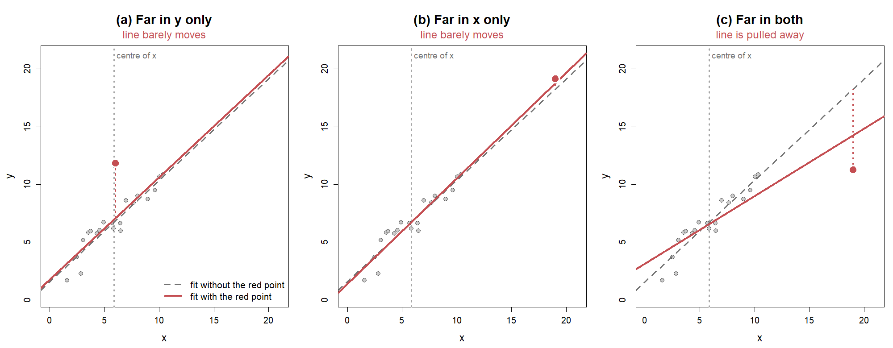
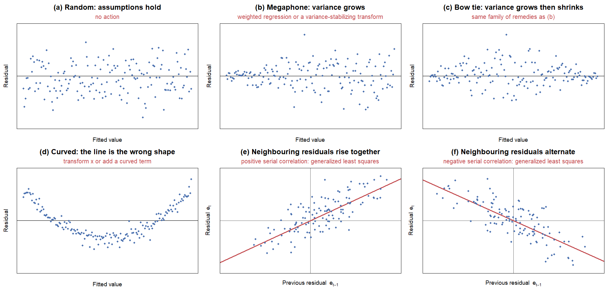
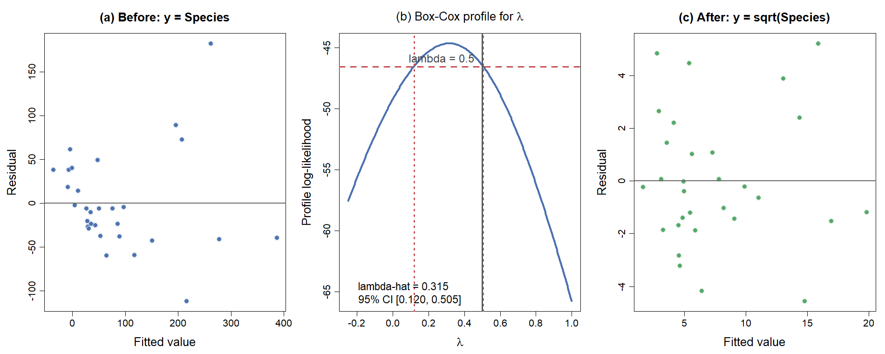

<!-- Date: 2026-08-26 | Purpose: chapter 5 of the KINS regression lecture, split from regression-lecture-note.qmd. Generated by code/agent/2026-08-26/split-chapters.py - edit the master, not this file. | File: 05-diagnosis-variable-selection.qmd -->

# Diagnosis & Variable Selection

::: notes
여기까지 오면서 회귀직선을 구하는 법, 설명변수를 여러 개 넣는 법까지 배웠습니다. 그런데 나온 숫자를 그냥 믿어도 될까요. 이번 장은 두 가지를 한꺼번에 다룹니다. 앞부분은 만들어 놓은 모형이 자료와 맞는지 확인하는 회귀진단, 뒷부분은 여러 설명변수 가운데 무엇을 남길지 고르는 변수선택입니다. 두 주제를 붙여 놓은 이유가 있습니다. 진단으로 문제를 찾고, 변수를 골라 모형을 고치고, 고친 모형을 다시 진단합니다. 한 바퀴 도는 작업입니다. 계측기도 검교정을 마쳐야 현장에 내보내지 않습니까. 모형도 다르지 않습니다.
:::

## 요약통계량이 같은 네 자료 {.smaller}

### <i class="fa-solid fa-chart-line"></i> 그림으로 보기

::: {.callout-note appearance="minimal"}
<i class="fa-solid fa-link"></i> **앞 장에서 여기까지**: full model 적합과 계수 해석까지 마침. <i class="fa-solid fa-circle-question"></i> **이 장의 질문**: 이 모형을 믿어도 되는가, 변수를 다 남겨야 하는가
:::

:::: {.columns}

::: {.column width="55%"}
{width=100%}
:::

::: {.column width="45%"}

::: {.highlight-box}
서로 다른 네 자료에 최소제곱 직선을 적합하면 네 경우 모두 같은 직선이 나온다.

$$\hat y_i = 3.00 + 0.500\,x_i$$
:::

**기호**

<ul>
<li>$\hat y_i$: $i$번째 관측의 적합값, $x_i$: 설명변수 값</li>
<li>$3.00$: 절편 추정값 $\hat\beta_0$, $0.500$: 기울기 추정값 $\hat\beta_1$</li>
</ul>

::: {.callout-tip appearance="minimal"}
<ul>
<li>요약 숫자만으로는 네 자료를 구분할 수 없음</li>
<li>그림에서는 네 자료의 구조가 서로 전혀 다름 (Anscombe, 1973)</li>
<li>회귀분석은 계수 계산과 그림 확인을 함께 수행함</li>
</ul>
:::
:::

::::

::: notes
화면의 수식부터 봐 주십시오. 서로 다른 네 자료에 직선을 그었는데 넷 다 절편 3.00, 기울기 0.500으로 똑같습니다. 그런데 산점도는 어떻습니까. 왼쪽 위만 우리가 흔히 생각하는 직선 관계입니다. 오른쪽 위는 매끄러운 곡선입니다. 왼쪽 아래는 점 하나가 직선을 위로 끌어당겼습니다. 오른쪽 아래는 아예 점 하나가 기울기를 통째로 만들어 냈습니다. 숫자가 같으니 결론도 같지 않겠느냐고 물으실 수 있습니다. 아닙니다. 오른쪽 아래 자료에 이 직선으로 예측하면 엉뚱한 값이 나옵니다. Anscombe가 1973년에 이 네 자료를 일부러 만든 이유가 여기 있습니다. 계산 결과만 보고 끝내면 절반만 한 것입니다.
:::

## 회귀모형의 네 가지 가정 {.smaller}

### <i class="fa-solid fa-bullseye"></i> 정의

::: {.highlight-box}
$$y_i = \beta_0 + \beta_1 x_{i1} + \cdots + \beta_p x_{ip} + \varepsilon_i, \qquad \varepsilon_i \overset{iid}{\sim} N(0,\ \sigma^2)$$
:::

**기호**

<ul>
<li>$y_i$: 반응변수, $x_{ij}$: $i$번째 관측의 $j$번째 설명변수</li>
<li>$\beta_0,\dots,\beta_p$: 회귀계수, $\varepsilon_i$: 오차, $\sigma^2$: 오차의 분산</li>
<li>$N(0,\sigma^2)$: 0을 중심으로 좌우대칭인 종 모양 분포</li>
<li>$iid$: 오차들이 서로 영향을 주지 않으며(독립) 모두 같은 분포를 따름</li>
</ul>

::: {.callout-tip appearance="minimal"}
<i class="fa-solid fa-list-check"></i> **네 가지 가정**

<ul>
<li><b>선형성</b>: $x$와 $y$의 관계가 직선으로 표현됨</li>
<li><b>독립성</b>: 오차 $\varepsilon_i$끼리 서로 독립</li>
<li><b>정규성</b>: 오차가 정규분포 $N(0,\sigma^2)$을 따름</li>
<li><b>등분산성</b>: 오차의 분산이 어디서나 같은 $\sigma^2$</li>
</ul>
:::

::: {.callout-note appearance="minimal"}
<i class="fa-solid fa-circle-info"></i> **Remark**

네 가정 중 하나라도 크게 위반되면 회귀계수의 표준오차(추정값이 자료가 바뀔 때마다 얼마나 흔들리는지를 나타내는 값), 유의성 검정, 신뢰구간이 모두 함께 흔들림 (Kutner et al., 2005)
:::

::: notes
회귀모형을 다리가 넷인 의자라고 생각해 보십시오. 선형성, 독립성, 정규성, 등분산성이 그 네 다리입니다. 수식에서 오차가 평균 0, 분산 시그마 제곱인 정규분포를 서로 독립적으로 따른다고 적은 부분이 네 다리를 한 줄로 압축한 문장입니다. 다리 하나가 부러지면 의자가 기우뚱합니다. 가정이 깨지면 계수 자체보다 그 계수의 불확실성을 재는 값들이 먼저 망가집니다. 독립성은 그림으로 어떻게 보는가. 그림보다는 자료가 어떻게 모였는지를 보고 판단하는 경우가 많습니다. 아이스크림 자료처럼 시간 순서로 쌓인 자료라면 잔차를 시간 순으로 늘어놓고 무늬가 있는지 봅니다. 나머지 세 다리는 잠시 뒤 진단 그림으로 하나씩 점검하겠습니다.
:::

## 잔차: 모형이 설명하지 못한 나머지 {.smaller}

### <i class="fa-solid fa-bullseye"></i> 정의

::: {.highlight-box}
$$e_i = y_i - \hat y_i, \qquad \mathbf e = \mathbf y - \hat{\mathbf y} = (\mathbf I - \mathbf H)\,\mathbf y$$
:::

<ul>
<li>$e_i$: 잔차, $y_i$: 관측값, $\hat y_i$: 적합값, $\mathbf I$: 단위행렬</li>
<li>$\mathbf H = \mathbf X(\mathbf X^{\top}\mathbf X)^{-1}\mathbf X^{\top}$: 앞 장의 모자행렬. 적합값이 $\hat{\mathbf y}=\mathbf H\mathbf y$ 이므로, 잔차는 $\mathbf y$ 에서 $\mathbf H$ 가 설명한 부분을 뺀 나머지</li>
</ul>

**잔차의 역할**

::: {.callout-tip appearance="minimal"}
<ul>
<li>오차 $\varepsilon_i$는 관측할 수 없으나 잔차 $e_i$는 자료에서 직접 계산됨</li>
<li>가정이 모두 성립하면 잔차는 0 주위에 <b>패턴 없이</b> 흩어짐</li>
<li>요약 숫자가 양호해도 잔차 그림에서 모형의 문제가 드러나기도 함</li>
</ul>
:::

**잔차의 대수적 성질**

::: {style="font-size: 0.78em; line-height: 1.2"}

<ul>
<li>$\mathbf M=\mathbf I-\mathbf H$ 도 대칭이고 멱등. $\mathbf M$: 잔차를 만들어 내는 행렬</li>
</ul>

:::

$$
\mathbf X^\top\mathbf e=\mathbf X^\top(\mathbf I-\mathbf H)\mathbf y=(\mathbf X^\top-\mathbf X^\top)\mathbf y=\mathbf 0
\;\Longrightarrow\;\sum_{i=1}^{n}e_i=0
$$

$$
E(\mathbf e)=\mathbf 0,\qquad \operatorname{Var}(\mathbf e)=\sigma^2(\mathbf I-\mathbf H)
\;\Longrightarrow\;\operatorname{Var}(e_i)=\sigma^2(1-h_{ii})
$$

$$
\operatorname{tr}(\mathbf I-\mathbf H)=n-(p+1)=30-4=26\;=\;\text{잔차의 자유도}
$$

::: {.callout-tip appearance="minimal"}
$\operatorname{Var}(e_i)$ 가 관측마다 다르므로, 잔차를 그대로 비교하지 않고 크기를 맞춘 <b>표준화잔차</b> $r_i=e_i/\big(\hat\sigma\sqrt{1-h_{ii}}\big)$ 를 사용
:::

::: notes
오차는 모형 속에만 있는 이론적인 양이라 우리 눈에 보이지 않습니다. 대신 관측값에서 적합값을 뺀 잔차는 자료에서 바로 계산되고, 오차가 남긴 발자국 노릇을 합니다. 수식의 두 번째 줄을 봐 주십시오. 앞 장에서 적합값을 만들던 모자행렬이 그대로 다시 등장합니다. 모자행렬이 $\mathbf y$에서 설명 가능한 부분을 잡아채고, 남은 찌꺼기가 잔차입니다. 그래서 잔차는 모형이 손대지 못한 부분만 담고 있습니다. 의사가 청진기로 몸속 소리를 듣듯, 우리는 잔차로 모형 속을 듣습니다. 지금 진단할 대상은 가격, 소득, 온도를 모두 넣은 완전모형입니다. 변수를 고르는 일은 이 장 뒷부분에서 합니다. 손대지 않은 모형이 자료와 맞는지부터 봐야 뒤의 선택 결과를 믿을 수 있기 때문입니다. 아래쪽에 잔차의 성질을 정리했습니다. 첫 식은 설명변수와 잔차를 곱해 더하면 반드시 0이 된다는 뜻이고, 절편 열이 전부 1이므로 잔차의 합도 0이 됩니다. 세 번째 식의 26은 자료 서른 개의 정보에서 계수 네 개를 추정하는 데 쓰고 남은 몫입니다. 가장 중요한 것은 두 번째 식입니다. 잔차의 분산이 관측마다 다릅니다. 레버리지가 큰 관측일수록 잔차의 분산이 작아집니다. 그래서 잔차를 눈으로 비교하실 때는 크기를 맞춰 준 표준화잔차를 보셔야 합니다.
:::

## 진단 그림 4종 읽는 법

### <i class="fa-solid fa-chart-line"></i> 그림으로 보기

:::: {.columns}

::: {.column width="62%"}
{width=100%}
:::

::: {.column width="38%"}

::: {.callout-tip appearance="minimal"}
<i class="fa-solid fa-lightbulb"></i> **읽는 법**

<ul>
<li><b>좌상 Residuals vs Fitted</b>: 곡선 패턴이 보이면 선형성 위반 신호</li>
<li><b>우상 Normal Q-Q</b>: 잔차를 크기순으로 늘어놓고 정규분포에서 기대되는 값과 짝지은 그림. 점들이 대각선에서 크게 벗어나면 정규성 의심</li>
<li><b>좌하 Scale-Location</b>: 오른쪽으로 갈수록 깔때기처럼 퍼지면 등분산성 위반</li>
<li><b>우하 Residuals vs Leverage</b>: 오른쪽 구석의 외딴 점은 영향점 후보</li>
</ul>
:::
:::

::::

::: notes
방금 말씀드린 plot 한 줄의 결과가 이 그림입니다. 왼쪽 위부터 보겠습니다. 점들이 0 근처에 수평으로 흩어져 있으면 합격입니다. U자나 아치가 보이면 직선으로 놓은 설정 자체가 틀린 것입니다. 오른쪽 위 Q-Q 그림은 이름이 낯설 것입니다. 잔차를 작은 것부터 줄 세우고, 정규분포라면 이쯤 나와야 한다는 값과 짝지어 찍은 그림입니다. 점들이 대각선 위에 얹혀 있으면 정규성에 큰 문제가 없다고 봅니다. 왼쪽 아래에서 퍼짐이 오른쪽으로 갈수록 넓어지면 등분산이 깨진 신호입니다. 오른쪽 아래에서 구석에 뚝 떨어진 점은 직선을 크게 흔드는 후보입니다. 곡선이 보이면 어떻게 하는가. 처방은 이 장 앞부분 마지막에 표로 정리해 드리겠습니다.
:::

## 레버리지 $h_{ii}$ {.smaller}

### <i class="fa-solid fa-bullseye"></i> 정의

::: {.highlight-box}
레버리지 $h_{ii}$는 모자행렬 $\mathbf H$의 $i$번째 대각원소이며, $i$번째 관측이 설명변수 공간에서 얼마나 바깥에 놓여 있는지를 나타낸다.

$$\sum_{i=1}^{n} h_{ii} = \operatorname{tr}(\mathbf H) = p+1, \qquad \bar h = \frac{p+1}{n}$$
:::

**기호**

<ul>
<li>$\operatorname{tr}(\mathbf H)$: 대각원소의 합, $n$: 관측 수, $p$: 설명변수 개수</li>
<li>$p+1$: 절편을 포함한 회귀계수의 개수</li>
<li>레버리지의 평균이 $(p+1)/n$ 으로 고정되므로, 이 값의 2배를 넘는 관측을 주목 대상으로 삼는 관례 (Kutner et al., 2005)</li>
</ul>

### <i class="fa-solid fa-table"></i> 결과: full model

| Quantity | Value |
|:------------------------------------|------:|
| $\operatorname{tr}(\mathbf H) = p+1$ | 4 |
| Average leverage $(p+1)/n$ | 0.133 |
| Rule of thumb $2(p+1)/n$ | 0.267 |
| Largest $h_{ii}$ (observation 9) | 0.278 |

: Leverage summary for the full model, n = 30

::: notes
놀이터 시소를 떠올려 보십시오. 회전축 근처에 앉은 아이는 아무리 눌러도 시소가 별로 움직이지 않습니다. 끝에 앉은 아이는 살짝만 눌러도 전체가 기웁니다. 레버리지가 그 앉은 자리입니다. 설명변수 값이 평균 근처면 축 가까이, 끄트머리면 시소 끝자락입니다. 눈여겨볼 성질이 하나 있습니다. 레버리지를 전부 더하면 모자행렬의 대각합이 되고, 그 값이 회귀계수 개수와 정확히 같습니다. 아이스크림 완전모형에서는 4. 관측이 30개니 평균은 0.133입니다. 그 두 배인 0.267을 넘는 관측을 눈여겨보자는 관례가 있습니다. 표의 마지막 줄을 보시면 9번 관측이 0.278로 기준을 아슬아슬하게 넘습니다. 그렇다고 이 점이 결과를 지배한다는 뜻은 아직 아닙니다. 왜 그런지는 다음 두 슬라이드에서 이어집니다.
:::

## 스튜던트화 잔차 {.smaller}

### <i class="fa-solid fa-bullseye"></i> 정의

::: {.highlight-box}
잔차의 분산이 관측마다 다르므로 그대로 비교할 수 없다. 각자의 표준편차로 나눈 값이 **스튜던트화 잔차**다.

$$\operatorname{Var}(e_i)=\sigma^2(1-h_{ii}),\qquad r_i=\frac{e_i}{\hat\sigma\sqrt{1-h_{ii}}}$$
:::

**기호**

<ul>
<li>$e_i$: $i$번째 잔차, $h_{ii}$: 레버리지, $\hat\sigma$: 잔차 표준오차</li>
<li>$r_i$: 스튜던트화 잔차. $E(r_i)=0$ 이지만 $\operatorname{Var}(r_i)$ 가 정확히 1은 아님</li>
<li>같은 값을 <b>표준화 잔차</b>라 부르는 문헌도 많음. 이름이 둘인 것이지 다른 값이 아님</li>
</ul>

::: {.callout-tip appearance="minimal"}
<i class="fa-solid fa-lightbulb"></i> **읽는 법**

<ul>
<li>$-2\le r_i\le 2$ 안에 들고, 무늬가 없고, 퍼짐이 고르면 오차 가정을 만족한다고 봄</li>
<li>레버리지가 큰 관측일수록 $1-h_{ii}$ 가 작아, <b>같은 $e_i$ 라도 $r_i$ 가 커짐</b>. 시소 끝에 앉은 점의 이탈을 놓치지 않으려는 보정</li>
<li>정확히 정규분포를 따르지는 않으나 실무에서는 정규분포로 보고 판단</li>
</ul>
:::

::: notes
앞에서 잔차의 분산이 관측마다 다르다고 말씀드렸습니다. 시그마 제곱 곱하기 괄호 1 빼기 h. 레버리지가 클수록 이 값이 작아집니다. 무슨 뜻인가 하면, 시소 끝에 앉은 점은 회귀직선이 자기 쪽으로 끌려오기 때문에 잔차가 애초에 작게 나온다는 것입니다. 그러니 잔차 크기를 그대로 늘어놓고 누가 제일 튀는지 고르면 불공정합니다. 끝에 앉은 점이 손해를 봅니다. 그래서 각자의 표준편차로 나눠 줍니다. 이렇게 크기를 맞춘 값을 스튜던트화 잔차라고 부릅니다. 이름 이야기를 하나 하겠습니다. 같은 값을 표준화 잔차라고 부르는 책도 아주 많습니다. 어느 쪽을 만나셔도 같은 값이니 당황하지 마십시오. 읽는 법은 간단합니다. 마이너스 2에서 2 사이에 들어와 있고, 그림에 무늬가 없고, 퍼짐이 고르면 합격입니다. 왜 하필 2인가. 정규분포라면 95퍼센트가 그 안에 들어오기 때문입니다. 다만 이 값이 정확히 정규분포를 따르지는 않습니다. 근사로 쓰는 것이니 2를 살짝 넘었다고 곧바로 이상점이라 단정하지는 마십시오. 제대로 된 판정 기준은 두 화면 뒤에 나옵니다.
:::

## 외적 스튜던트화 잔차 {.smaller}

### <i class="fa-solid fa-triangle-exclamation"></i> $\hat\sigma$ 부풀림 문제

::: {.highlight-box}
$i$번째 관측을 **빼고** 추정한 오차분산 $\hat\sigma_{(i)}^2$ 로 나눈 값을 **외적 스튜던트화 잔차**(스튜던트화 제외 잔차)라 한다.

$$t_i=\frac{e_i}{\hat\sigma_{(i)}\sqrt{1-h_{ii}}}$$
:::

**기호**

<ul>
<li>$\hat\sigma_{(i)}^2$: $i$번째 관측을 제외한 $n-1$개로 추정한 오차분산. 자유도는 $n-p-2$</li>
<li>$t_i$: 외적 스튜던트화 잔차. 앞 슬라이드의 $r_i$ 와 분모만 다름</li>
</ul>

::: {.callout-tip appearance="minimal"}
<i class="fa-solid fa-lightbulb"></i> **왜 굳이 빼고 재는가**

<ul>
<li>$\hat\sigma$ 는 <b>모든 관측으로</b> 계산되므로 이상점 자신이 $\hat\sigma$ 를 부풀림</li>
<li>부풀어난 분모로 나누면 자기 잔차가 작아 보임. 이상점이 <b>스스로를 감추는</b> 셈</li>
<li>자기를 빼고 만든 자로 재면 이 자기지시가 사라짐. 그래서 이상점 <b>검정</b>은 $r_i$ 가 아니라 $t_i$ 로 함</li>
</ul>
:::

::: notes
한 걸음 더 들어가겠습니다. 방금 본 스튜던트화 잔차에는 숨은 문제가 하나 있습니다. 분모의 시그마 햇이 어떻게 계산되는지 떠올려 보십시오. 서른 개 관측 전부의 잔차제곱합에서 나옵니다. 그런데 그중 하나가 이상점이라면, 그 이상점의 큰 잔차가 시그마 햇을 끌어올립니다. 자기가 자기를 재는 자를 늘려 놓는 것입니다. 늘어난 자로 재면 자기 키가 작아 보이겠지요. 이상점이 스스로를 감추는 현상입니다. 해결책은 단순합니다. 그 관측을 빼고 시그마를 다시 구해서, 그 자로 잽니다. 이렇게 만든 값을 외적 스튜던트화 잔차, 또는 스튜던트화 제외 잔차라고 부릅니다. 앞의 값과 분모만 다릅니다. 서른 개를 전부 빼 보면서 서른 번 계산해야 하느냐고 걱정하실 수 있는데, 그럴 필요 없습니다. 한 번 적합한 결과만으로 전부 계산되는 공식이 있습니다. 계산은 프로그램이 하고, 여러분은 이 값을 이상점 검정에 쓰신다는 것만 기억하시면 됩니다.
:::

## 이상치, 레버리지, 영향점: 정의

### <i class="fa-solid fa-bullseye"></i> 세 용어의 구별

::: {.highlight-box}
**이상치(outlier)**: $y$ 방향으로 동떨어진 점, 즉 잔차 $e_i$가 큰 관측

**레버리지(leverage)**: $x$ 방향으로 얼마나 끝자리에 있는지를 나타내는 값 $h_{ii}$

**영향점(influential point)**: 그 한 점을 제외하면 회귀직선이 크게 움직이는 점
:::

### <i class="fa-solid fa-lightbulb"></i> 핵심

::: {.callout-tip appearance="minimal"}
<ul>
<li>$y$ 방향의 이탈(큰 잔차)과 $x$ 방향의 이탈(큰 레버리지)이 <b>결합될 때</b> 회귀직선이 실제로 움직임</li>
<li>잔차만 크거나 레버리지만 큰 점은 직선을 크게 흔들지 못하는 경우가 있음</li>
<li>따라서 두 값은 따로 보지 않고 함께 평가함</li>
</ul>
:::

::: notes
용어 세 개를 구분해 보겠습니다. 이상치는 세로 방향으로 튄 점, 레버리지가 큰 점은 가로 방향으로 멀리 나간 점입니다. 영향점은 그 점을 빼면 직선이 확 달라지는 점입니다. 셋이 같은 말처럼 들리지만 다릅니다. 시소 비유로 돌아가면, 축 근처에 앉은 아이가 아무리 힘껏 눌러도 시소는 잘 기울지 않습니다. 잔차가 커도 레버리지가 작은 경우입니다. 반대로 끝에 앉았는데 얌전히 있으면 역시 기울지 않습니다. 레버리지가 커도 잔차가 작은 경우입니다. 끝에 앉은 아이가 힘껏 누를 때, 그때가 진짜 문제입니다. 그래서 둘을 하나로 묶어 보는 숫자가 필요합니다. 다음 화면에서 확인하겠습니다.
:::

## 이상치, 레버리지, 영향점: 그림 비교 {.smaller .fig-led}

### <i class="fa-solid fa-chart-line"></i> 점 하나를 더한 세 경우

{width=100% .nostretch}

| 추가한 점 | $x$ 방향 이탈 (레버리지) | $y$ 방향 이탈 (잔차) | 직선이 움직이는가 |
|:--|:--|:--|:--|
| (a) 이상치 | 작음 | 큼 | 거의 그대로 |
| (b) 레버리지가 큰 점 | 큼 | 작음 | 거의 그대로 |
| (c) 영향점 | 큼 | 큼 | **크게 꺾임** |

: What moves the fitted line: not either deviation alone, but the two together

::: {style="font-size: 0.8em; line-height: 1.2"}

<ul>
<li>(b)와 (c)의 붉은 점은 $x$ 방향으로 <b>같은 자리</b>. 차이를 만든 것은 직선에서 벗어난 정도</li>
<li>잔차와 레버리지 중 하나만 커서는 직선이 흔들리지 않음. <b>둘이 겹칠 때만 영향점</b></li>
</ul>

:::

::: notes
말로 한 구분을 그림으로 확인해 보겠습니다. 세 그림의 회색 점 스무 개는 전부 같은 자료입니다. 붉은 점 하나씩만 다르게 얹었습니다. 점선이 붉은 점을 빼고 그은 직선, 실선이 붉은 점을 넣고 그은 직선입니다. 두 선이 얼마나 벌어지는지만 보시면 됩니다. 왼쪽부터 보겠습니다. 붉은 점이 한가운데에서 위로 튀어 있습니다. 세로로는 크게 벗어났지요. 그런데 두 직선이 거의 겹칩니다. 가로로는 평균 근처, 그러니까 회색 점선 바로 옆에 있기 때문입니다. 시소 축 바로 옆에서는 아무리 힘껏 눌러도 시소가 기울지 않습니다. 가운데는 반대입니다. 붉은 점이 오른쪽 끝으로 멀리 나가 있습니다. 그런데 직선 근처에 얌전히 앉아 있어서, 역시 두 선이 거의 겹칩니다. 시소 끝에 앉았지만 힘을 주지 않는 경우입니다. 오른쪽이 문제입니다. 가로로도 멀고 세로로도 벗어났습니다. 가운데 그림과 가로 위치는 똑같습니다. 그런데 이번에는 직선이 확 꺾입니다. 회색 점들은 손도 대지 않았는데 붉은 점 하나가 직선을 끌고 내려간 것입니다. 여기서 가져가실 것은 한 문장입니다. 잔차가 크다고 곧바로 문제 삼지 마시고, 레버리지가 크다고 곧바로 문제 삼지도 마십시오. 둘이 함께 클 때 직선이 움직입니다. 그러면 둘이 함께 큰지를 매번 눈으로 봐야 하느냐. 그렇지 않습니다. 그 둘을 한 숫자로 묶어 주는 값이 있고, 그것이 다음 화면의 Cook 거리입니다.
:::

## 이상치, 레버리지, 영향점: Cook 거리 {.smaller}

### <i class="fa-solid fa-pen-to-square"></i> 잔차와 레버리지의 결합

::: {.callout-note appearance="minimal"}
<i class="fa-solid fa-bullseye"></i> **정의와 기호**

$$D_i = \frac{r_i^{2}}{p+1}\cdot\frac{h_{ii}}{1-h_{ii}}$$

**기호**

<ul>
<li>$r_i$: $i$번째 표준화잔차. 잔차 $e_i$ 를 그 표준오차로 나누어 서로 견줄 수 있게 만든 값</li>
<li>$h_{ii}$: 레버리지, $p+1$: 절편을 포함한 회귀계수의 개수</li>
<li>두 요소가 곱해지므로 잔차와 레버리지가 함께 클 때 $D_i$ 가 특히 커짐 (Cook, 1977)</li>
</ul>
:::

### <i class="fa-solid fa-table"></i> 결과: full model

| Diagnostic statistic | Largest value | Observation |
|:-----------------------------------|--------------:|------------:|
| Standardized residual (absolute) | 2.46 | 30 |
| Leverage $h_{ii}$ | 0.278 | 9 |
| Cook's distance $D_i$ | 0.475 | 30 |

: Largest diagnostic values in the full model, n = 30

::: {.callout-tip appearance="minimal"}
Cook 거리 최댓값 0.475는 흔히 쓰는 기준값 1보다 작음: 한 관측이 결과를 좌우한다고 볼 근거는 없음
:::

::: notes
Cook 거리는 잔차와 레버리지를 한 숫자로 묶은 값입니다. 식을 보시면 표준화잔차의 제곱에 레버리지 항을 곱해 두었습니다. 곱이라는 점이 중요합니다. 둘 중 하나가 0에 가까우면 전체가 작아지기 때문입니다. 표준화잔차라는 말이 낯설 수 있습니다. 잔차를 그 표준오차로 나눠서 서로 비교 가능하게 만든 값이라고 보시면 됩니다. 아이스크림 완전모형의 실제 수치가 표에 있습니다. 표준화잔차가 가장 큰 것은 30번 관측으로 2.46, 레버리지가 가장 큰 것은 9번으로 0.278, Cook 거리가 가장 큰 것도 30번으로 0.475입니다. 흔히 1을 넘으면 위험 신호로 보는데 0.475면 그 아래입니다. 눈여겨볼 관측은 9번과 30번이지만, 어느 한 점이 결과를 끌고 간다고 볼 정도는 아닙니다. 실무에서는 절대적인 합격선을 긋기보다 다른 점들보다 유난히 튀는 관측을 골라 그날 무슨 일이 있었는지 되짚어 보는 편이 훨씬 쓸모 있습니다.
:::

## 영향점 측도: DFFITS {.smaller}

### <i class="fa-solid fa-bullseye"></i> 정의

::: {.highlight-box}
$i$번째 관측을 빼면 **그 관측의 적합값**이 얼마나 움직이는가를 표준화한 값

$$\mathrm{DFFITS}_i=\frac{\hat y_i-\hat y_{(i)}}{\hat\sigma_{(i)}\sqrt{h_{ii}}}
=t_i\sqrt{\frac{h_{ii}}{1-h_{ii}}}$$
:::

**기호**

<ul>
<li>$\hat y_{(i)}$: $i$번째를 빼고 적합한 모형이 주는 $i$번째 적합값</li>
<li>$t_i$: 외적 스튜던트화 잔차, $h_{ii}$: 레버리지</li>
</ul>

::: {.callout-tip appearance="minimal"}
<i class="fa-solid fa-lightbulb"></i> **Cook 거리와의 관계**

<ul>
<li>두 측도 모두 <b>잔차 $\times$ 레버리지</b> 구조. 앞에서 본 두 요소가 함께 커야 값이 커진다는 성질이 같음</li>
<li>보는 대상이 다름: Cook 거리는 적합값 <b>$n$개 전체</b>가 움직인 양, DFFITS는 <b>그 관측 하나</b>의 적합값이 움직인 양</li>
<li>판정 기준: $|\mathrm{DFFITS}_i|>2\sqrt{(p+1)/n}$</li>
<li>$h_{ii}$ 가 1에 가까우면 $\sqrt{h_{ii}/(1-h_{ii})}$ 가 발산. 레버리지가 극단이면 작은 잔차로도 값이 커짐</li>
</ul>
:::

::: notes
영향력을 재는 측도가 Cook 거리 하나만 있는 것은 아닙니다. 실무에서 함께 보는 값이 DFFITS입니다. 이름이 어렵게 생겼는데 뜻은 그대로입니다. Difference in FITS, 적합값의 차이라는 말입니다. 그 관측을 빼면 그 관측의 적합값이 얼마나 움직이는가. 그것을 표준편차로 나눠 놓은 값입니다. 오른쪽 표현을 보십시오. 조금 전에 배운 외적 스튜던트화 잔차에 레버리지로 만든 계수를 곱한 모양입니다. Cook 거리와 뼈대가 같습니다. 잔차와 레버리지의 곱. 두 측도의 차이는 무엇을 보느냐입니다. Cook 거리는 그 점을 빼면 서른 개 적합값이 통째로 얼마나 움직이는가를 보고, DFFITS는 그 점 자신의 적합값만 봅니다. 전체에 미친 영향과 자기에게 미친 영향, 이렇게 나눠서 보시면 됩니다. 판정 기준은 아래에 적어 두었습니다. 마지막 줄만 짚겠습니다. 레버리지가 1에 아주 가까워지면 곱해지는 계수가 무한대로 갑니다. 설명변수 공간에서 혼자 뚝 떨어진 점은 잔차가 작아도 위험하다는 뜻입니다.
:::

## 이상점 검정 {.smaller .stepped}

### <i class="fa-solid fa-pen-to-square"></i> 제외 후 예측

<ol>
<li><b>그 관측을 빼고 적합한다.</b> $i$번째를 제외한 $n-1$개로 $\hat{\boldsymbol\beta}_{(i)}$ 와 $\hat\sigma_{(i)}^2$ 을 구함. 자유도는 $n-p-2$</li>
<li><b>뺀 관측을 예측한다.</b> $\hat y_{(i)}=\mathbf x_i^\top\hat{\boldsymbol\beta}_{(i)}$. 적합에 쓰이지 않았으므로 $y_i$ 와 서로 <b>독립</b>이며, 이 독립성이 다음 단계의 $t$분포를 성립시킴</li>
<li><b>예측오차를 표준화한다.</b> $y_i$ 가 이상점이 아니라면 $E(y_i-\hat y_{(i)})=0$ 이므로
$$t_i=\frac{y_i-\hat y_{(i)}}{\hat\sigma_{(i)}\sqrt{1+\mathbf x_i^\top(\mathbf X_{(i)}^\top\mathbf X_{(i)})^{-1}\mathbf x_i}}
=\frac{e_i}{\hat\sigma_{(i)}\sqrt{1-h_{ii}}}\ \sim\ t(n-p-2)$$</li>
</ol>

::: {.callout-note appearance="minimal"}
$|t_i|\ge t_{\alpha/2,\,n-p-2}$ 이면 이상점으로 판정. 단, $n$개를 모두 검정하므로 유의수준을 $\alpha/n$ 으로 낮추는 **Bonferroni 보정**을 함께 씀
:::

::: notes
이제 이상점을 판정하는 정식 절차입니다. 발상이 재미있습니다. 의심스러운 관측 하나를 재판정에 세운다고 생각해 보십시오. 그 관측을 빼고 나머지로만 모형을 만듭니다. 그 모형에게 묻습니다. 네가 보지 못한 이 조건에서 값이 얼마나 나와야 하겠느냐. 모형이 예측값을 내놓습니다. 그 예측값과 실제 관측값의 차이가 크면 이상점입니다. 핵심은 두 번째 단계에 있습니다. 뺀 관측은 모형을 만드는 데 쓰이지 않았으므로 모형과 독립입니다. 이 독립성 덕분에 세 번째 줄의 t분포가 정확하게 성립합니다. 자유도가 n 빼기 p 빼기 2인 이유도 여기 있습니다. 관측을 하나 뺐으니 자유도가 하나 더 줄어든 것입니다. 가운데 식과 오른쪽 식은 같은 값입니다. 왼쪽이 뜻을 보여 주는 형태, 오른쪽이 실제로 계산하는 형태입니다. 마지막 상자가 중요합니다. 우리는 서른 개를 전부 검정합니다. 유의수준 5퍼센트로 서른 번 검정하면, 진짜 이상점이 하나도 없어도 하나쯤은 걸릴 확률이 상당히 높습니다. 그래서 유의수준을 검정 횟수로 나눠 씁니다. Bonferroni 보정이라고 부릅니다.
:::

## 이상점: 유의점과 대처 {.smaller}

### <i class="fa-solid fa-triangle-exclamation"></i> 함정과 절차

:::: {.columns}

::: {.column width="50%"}

::: {.callout-tip appearance="minimal"}
<i class="fa-solid fa-triangle-exclamation"></i> **검정을 그대로 믿으면 안 되는 네 경우**

<ul>
<li><b>이상점끼리 서로를 가림</b>: 두 개 이상이 이웃해 있으면 서로의 효과를 상쇄해 어느 쪽도 잡히지 않을 수 있음</li>
<li><b>모형이 바뀌면 이상점도 바뀜</b>: 어떤 모형에서의 이상점이 변수변환 뒤에는 이상점이 아닐 수 있음. <b>모형을 바꿀 때마다 이상점을 다시 조사</b></li>
<li><b>정규분포가 아닐 때</b>: 오차 분포의 꼬리가 두꺼우면 큰 잔차가 나오는 것이 자연스러움. 이상점이 아니라 분포 특성일 수 있음</li>
<li><b>이상점이 무리를 이룰 때</b>: 큰 자료에서 한두 개는 문제가 되지 않지만, 그룹을 형성하면 모형 설정 자체를 의심해야 함</li>
</ul>
:::

:::

::: {.column width="50%"}

::: {.callout-note appearance="minimal"}
<i class="fa-solid fa-screwdriver-wrench"></i> **이 순서로 확인**

<ol>
<li><b>데이터 입력 오류를 검사한다.</b> 단위, 소수점, 자릿수 밀림처럼 기록 단계의 잘못인지 원자료와 대조</li>
<li><b>그 관측이 나온 상황을 알아본다.</b> 그날의 장비 상태, 시료, 작업 조건처럼 표에 적히지 않은 사정을 확인</li>
<li><b>제거하고 분석하되 반드시 밝힌다.</b> 어떤 관측을 왜 뺐는지를 결과에 함께 적음. <b>새 모형을 적합할 때는 뺐던 관측을 되돌려 넣고 다시 판단</b></li>
<li><b>실제로 가능한 값이면 제거하지 않는다.</b> 이상점을 포함한 채 견딜 수 있는 모형, 예를 들어 로버스트 회귀를 찾음</li>
</ol>
:::

:::

::::

::: {.callout-tip appearance="minimal"}
<i class="fa-solid fa-triangle-exclamation"></i> **주의**: 원인을 모르는 채 관측을 삭제하는 일은 금지. 결론이 한 점에 좌우되면 포함한 분석과 제외한 분석을 **둘 다 보고**
:::

::: notes
검정을 배웠으니 이제 그 검정을 믿지 말라는 이야기를 하겠습니다. 왼쪽이 찾을 때 조심할 것, 오른쪽이 찾은 뒤에 할 일입니다. 왼쪽부터 보겠습니다. 네 가지 함정이 있습니다. 첫째가 가장 골치 아픕니다. 이상점이 둘 이상 이웃해 있으면 서로를 숨겨 줍니다. 하나를 빼고 봐도 옆에 있는 다른 하나가 여전히 회귀선을 끌어당기고 있으니, 뺀 쪽이 정상으로 보입니다. 반대도 마찬가지고요. 그래서 둘 다 안 걸립니다. 마스킹이라고 부릅니다. 하나씩 빼 보는 방식의 한계입니다. 둘째, 이상점은 모형에 딸린 개념입니다. 자료의 성질이 아닙니다. 뒤에서 배울 변수변환을 하고 나면 방금까지 이상점이던 관측이 멀쩡해지는 일이 자주 있습니다. 그러니 모형을 바꾸실 때마다 이상점 조사를 다시 하셔야 합니다. 셋째, 오차 분포의 꼬리가 두꺼우면 큰 잔차는 원래 나옵니다. 정규분포를 가정한 판정 기준을 그대로 들이대면 멀쩡한 값을 이상점으로 몰게 됩니다. 넷째, 이상점이 한둘이 아니라 무리를 이루고 있다면 그것은 이상점 문제가 아닙니다. 모형이 틀렸다는 신호로 읽으셔야 합니다. 이제 오른쪽입니다. 찾았으면 무엇을 해야 하는가. 네 단계이고 순서가 중요합니다. 첫째, 입력 오류부터 봅니다. 실무에서 이상점의 상당수가 여기서 끝납니다. 단위를 잘못 적었거나, 소수점이 밀렸거나, 엑셀에서 한 칸 밀려 들어갔거나. 원자료와 대조하면 바로 드러납니다. 둘째, 기록 밖의 사정을 알아봅니다. 그날 장비를 교정했는지, 시료가 달랐는지, 다른 사람이 측정했는지. 표에는 안 적혀 있지만 실험 노트에는 있을 수 있습니다. 셋째, 빼기로 했다면 뺐다고 밝힙니다. 어떤 관측을 왜 뺐는지 보고서에 남기지 않으면 그것은 분석이 아니라 편집입니다. 그리고 굵게 표시한 부분을 봐 주십시오. 새 모형을 적합할 때는 뺐던 관측을 다시 넣고 처음부터 판단하셔야 합니다. 왼쪽 둘째 항목과 같은 이야기입니다. 이상점은 모형에 딸린 개념이기 때문입니다. 넷째, 물리적으로 충분히 가능한 값이라면 빼면 안 됩니다. 그때는 자료를 고치는 대신 모형을 바꿉니다. 이상점에 덜 흔들리는 로버스트 회귀 같은 방법이 있습니다. 맨 아래 상자는 오늘 강의에서 가장 실무적인 한 줄일지도 모르겠습니다. 원인을 모르면 지우지 마십시오. 마음에 안 드는 측정값을 골라내는 일이 되어 버립니다.
:::

## 다중공선성과 VIF: 정의 {.smaller}

### <i class="fa-solid fa-bullseye"></i> 설명변수 간 정보 중복

::: {.highlight-box}
설명변수끼리 정보가 겹치는 현상을 다중공선성이라 하며, 이때 회귀계수 추정값 $\hat\beta_j$가 불안정해진다.

$$\mathrm{VIF}_j = \frac{1}{1-R_j^{2}}$$
:::

**기호**

<ul>
<li>$R_j^{2}$: $j$번째 설명변수를 <b>나머지 설명변수들로 회귀</b>했을 때의 결정계수, 곧 그 변수의 변동 중 나머지 변수들이 설명한 비율</li>
<li>겹침이 없으면 $R_j^{2}=0$ 이라 $\mathrm{VIF}_j=1$</li>
<li>겹침이 심해 $R_j^{2}$ 가 1에 가까워질수록 값이 급격히 증가</li>
</ul>

::: {.callout-tip appearance="minimal"}
<i class="fa-solid fa-scale-balanced"></i> **판정 기준**

<ul>
<li>관례적으로 $\mathrm{VIF}_j$가 10, 문헌에 따라 5를 넘으면 심각한 다중공선성을 의심 (Kutner et al., 2005)</li>
</ul>
:::

::: notes
이번에는 관측이 아니라 설명변수들 사이의 문제입니다. 발표자 두 사람이 같은 내용을 동시에 말하면 청중은 누가 무슨 정보를 줬는지 구분하지 못합니다. 설명변수 둘이 거의 같은 정보를 담고 있을 때 모형이 그 상태가 됩니다. 공을 누구에게 돌려야 할지 몰라 계수 추정값이 이리저리 흔들립니다. VIF는 이것을 재는 도구입니다. 관심 변수 하나를 나머지 변수들로 회귀해서 얼마나 잘 설명되는지를 봅니다. 하나도 설명이 안 되면 값이 1, 거의 다 설명되면 값이 훌쩍 뜁니다. 보통 10, 엄격하게는 5를 경계선으로 삼습니다. 그러면 우리 자료는 어떨까요. 다음 화면에서 확인하겠습니다.
:::

## 다중공선성과 VIF: 아이스크림 자료 {.smaller}

### <i class="fa-solid fa-table"></i> full model의 VIF

**VIF 표**

| Variable | VIF |
|:---------|----:|
| price    | 1.03 |
| income   | 1.14 |
| temp     | 1.14 |

: VIF for the full model IC ~ price + income + temp

::: {.callout-tip appearance="minimal"}
세 변수 모두 1에 가까움: 이 자료에서는 다중공선성 **문제 없음**
:::

**계산 절차**

설명변수 하나를 나머지 설명변수로 회귀했을 때의 결정계수 $R_j^2$ 로 계산

$$\mathrm{VIF}_j=\frac{1}{1-R_j^2}$$

| Regression | $R_j^2$ | $\mathrm{VIF}_j=1/(1-R_j^2)$ |
|:--|--:|:--|
| price on income, temp | 0.0331 | $1/0.967=1.03$ |
| income on price, temp | 0.126 | $1/0.874=1.14$ |
| temp on price, income | 0.125 | $1/0.875=1.14$ |

: Derivation of the VIF values for the full model (n = 30)

$R_j^2=0$ 이면 $\mathrm{VIF}_j=1$ 로 최솟값. $R_j^2\to 1$ 이면 분모가 0에 가까워져 $\mathrm{VIF}_j\to\infty$

::: notes
표를 보시면 price가 1.03, income과 temp가 각각 1.14입니다. 기준선 10이나 5와 견주면 아주 작은 값입니다. 설명변수끼리 겹치는 정보가 거의 없다는 뜻이고, 이 자료에서는 다중공선성 걱정을 접어도 됩니다. 표 아래에 계산 과정을 적어 두었습니다. 생각보다 단순합니다. price를 income과 temp로 회귀해서 결정계수를 구하면 0.0331입니다. 1에서 빼면 0.967, 그 역수가 1.03입니다. 이 숫자의 뜻을 한 줄로 옮기면 이렇습니다. price가 가진 정보 중 나머지 두 변수로 설명되는 몫이 3퍼센트뿐이다. 겹침이 거의 없으니 벌점도 거의 없습니다. 표 아래 줄을 봐 주십시오. $R_j^2$ 가 1에 가까워지면 분모가 0으로 가면서 VIF가 무한히 커집니다. VIF가 크게 나오면 어떻게 하는가. 겹치는 변수 중 하나를 빼거나, 두 변수를 합쳐 하나로 만드는 방법이 있습니다. 무엇을 뺄지 고르는 이야기가 이 장의 뒷부분입니다.
:::

## 진단 후 처방 {.smaller}

### <i class="fa-solid fa-screwdriver-wrench"></i> 실무 적용

| Diagnostic signal | Suspected violation | Remedy |
|:--------------------------|:----------------|:----------------------------------------|
| 잔차 그림의 곡선 패턴 | 선형성 | 변수 변환($\log$, 제곱근) 또는 곡선 항 추가 |
| 잔차 퍼짐의 깔때기 모양 | 등분산성 | 가중회귀로 보정: Weighted Regression 장에서 다룸 |
| Q-Q 그림에서 대각선 이탈 | 정규성 | 반응변수 변환 검토 |
| 유난히 큰 Cook 거리 | 특정 관측의 과도한 영향 | 원자료 확인 후 민감도 분석 |

: Diagnostic signals and corresponding remedies

### <i class="fa-solid fa-link"></i> 관련 슬라이드

::: {.callout-note appearance="minimal"}
<ul>
<li>이상 관측의 처리 절차는 앞의 <b>이상점: 유의점과 대처</b> 슬라이드에 정리</li>
<li>표의 <b>Remedy</b> 열에 있는 변수 변환은 이어지는 네 슬라이드에서 하나씩 펼침</li>
<li>가중회귀는 Weighted Regression 장이 통째로 담당</li>
</ul>
:::

::: notes
신호가 잡혔을 때의 처방을 표 하나로 모았습니다. 곡선 무늬가 보이면 로그나 제곱근 변환, 아니면 곡선 항을 넣습니다. 잔차 퍼짐이 깔때기 모양이면 관측마다 정밀도가 다르다는 뜻입니다. 정밀한 관측에 더 큰 가중치를 주는 가중회귀가 정석이고, 뒤에 따로 한 장을 잡아 두었습니다. Q-Q에서 크게 벗어나면 반응변수 변환을 검토합니다. Cook 거리가 유난히 크면 그 관측의 원자료로 돌아갑니다. 이 표가 이 장 전반부의 요약입니다. 진단은 신호를 읽는 일이고, 보정은 원인을 확인한 뒤에 하는 조치입니다. 이상 관측을 어떻게 다룰지는 조금 전에 네 단계로 정리해 드렸습니다. 이제 남은 것은 표의 오른쪽 열, 변수 변환입니다. 어떤 그림이 나왔을 때 어떤 변환을 쓰는지, 그리고 그 변환을 어떻게 정하는지를 다음 네 화면에서 차례로 보겠습니다.
:::

## 잔차그림과 가정 위반 {.smaller .fig-led}

### <i class="fa-solid fa-chart-line"></i> 여섯 가지 유형

{width=100% .nostretch}

::: {style="font-size: 0.80em; line-height: 1.22"}

<ul>
<li>세로축은 <b>스튜던트화 잔차</b>. (a)~(d)의 가로축은 적합값 $\hat y_i$ 이고, 가정이 성립하면 (a)처럼 0을 중심으로 무늬 없이 흩어져야 함</li>
<li>(e)~(f)는 <b>시차산점도</b>. 점 하나가 이웃한 잔차 한 쌍 $(e_{t-1},\,e_t)$ 이고, 구름이 기운 방향이 <b>잔차 간 상관의 부호</b>. 기울기는 1차 자기상관계수 $r_1$ (가중회귀 장의 Durbin-Watson 통계량이 요약하는 값). 자료가 모인 <b>순서</b>가 있어야 그릴 수 있음</li>
<li>자기상관은 잔차 대 적합값 그림에서 <b>볼 수 없음</b>. 최소제곱에서 $\mathbf e^\top\hat{\mathbf y}=\mathbf y^\top(\mathbf I-\mathbf H)\mathbf H\mathbf y=0$ 이므로 $\operatorname{cor}(e,\hat y)=0$ 이 자료와 무관하게 항상 성립</li>
<li>설명변수마다 같은 그림을 따로 그려 보면 <b>어느 변수가 원인인지</b> 좁힐 수 있음</li>
</ul>

:::

::: notes
잔차그림을 읽는 훈련을 해 보겠습니다. 여섯 가지 모양을 모아 두었습니다. 위 왼쪽 (a)가 합격입니다. 0을 중심으로 아무 무늬 없이 고르게 흩어져 있습니다. 이런 그림이 나오면 손댈 일이 없습니다. (b)는 오른쪽으로 갈수록 퍼지는 메가폰 모양입니다. 적합값이 클수록 오차가 커진다는 뜻이니 등분산이 깨진 것입니다. 처방은 가중회귀이거나, 오늘 배울 분산안정화 변환입니다. (c)는 가운데가 넓고 양끝이 좁은 나비넥타이 모양입니다. 역시 등분산 위반이고 처방도 같은 계열입니다. 아래 왼쪽 (d)가 특히 중요합니다. 잔차가 U자를 그립니다. 이것은 퍼짐의 문제가 아니라 모양의 문제입니다. 직선을 그어야 할 자리에 직선을 그은 것이 아니라는 뜻입니다. 변수를 변환하거나 제곱 항을 넣어야 합니다. (e)와 (f)는 앞의 네 개와 그림의 성격이 다릅니다. 가로축이 적합값이 아니라 바로 앞 잔차입니다. 점 하나가 이웃한 잔차 한 쌍이라고 생각하시면 됩니다. 첫 번째 잔차와 두 번째 잔차를 짝지어 점 하나, 두 번째와 세 번째를 짝지어 또 점 하나, 이렇게 찍은 것입니다. 그러면 잔차끼리 상관이 있는지가 보통 산점도를 읽는 방식 그대로 드러납니다. (e)는 구름이 오른쪽 위로 기울었습니다. 앞 잔차가 크면 다음 잔차도 크다는 뜻이니 양의 자기상관입니다. (f)는 반대로 왼쪽 위에서 오른쪽 아래로 기울었습니다. 앞이 크면 다음은 작다, 음의 자기상관입니다. 빨간 직선의 기울기가 1차 자기상관계수이고, 가중회귀 장에서 만나실 Durbin-Watson 통계량이 바로 이 값을 요약한 것입니다. 여기서 한 가지 짚고 넘어가겠습니다. 자기상관을 잔차 대 적합값 그림에서 찾으려 하시면 안 됩니다. 최소제곱으로 적합하면 잔차와 적합값의 상관은 언제나 정확히 0입니다. 자료가 어떻든 0입니다. 슬라이드 셋째 줄에 그 이유를 적어 두었습니다. 잔차 벡터와 적합값 벡터를 곱하면 대수적으로 0이 되어 버립니다. 그러니 (a)에서 (d)까지의 그림은 등분산과 선형성은 잡아 주지만 독립성은 원리적으로 잡지 못합니다. 독립성을 보시려면 자료가 모인 순서가 반드시 필요하고, 그 순서를 한 번 써서 만든 그림이 (e)와 (f)입니다. 둘 다 독립성 위반이고 처방은 GLS입니다. 마지막 줄을 봐 주십시오. 적합값에 대해서만 그리지 마시고 설명변수 하나하나에 대해서도 그려 보십시오. 어느 변수가 말썽인지 그때 드러납니다.
:::

## 보정 1: Box-Cox 변환 {.smaller}

### <i class="fa-solid fa-bullseye"></i> 거듭제곱의 선택

::: {.highlight-box}
**Box-Cox 변환**: 반응변수를 아래 형태로 바꾸어, 변환 뒤의 오차가 정규분포에 가까워지도록 하는 $\lambda$ 를 찾는다.

$$y^{(\lambda)}=\begin{cases}\dfrac{y^{\lambda}-1}{\lambda}, & \lambda\neq 0\\[4pt] \ln y, & \lambda=0\end{cases}$$
:::

**기호**

<ul>
<li>$\lambda$: 찾아야 할 하나의 상수. $\lambda=1$ 이면 변환하지 않은 것과 같고, $\lambda=0.5$ 는 제곱근, $\lambda=0$ 은 로그</li>
<li>$y>0$ 이어야 함. 0이나 음수가 있으면 상수를 더한 뒤 적용</li>
</ul>

::: {.callout-note appearance="minimal"}
<i class="fa-solid fa-pen-to-square"></i> **$\lambda$ 를 정하는 법**

<ul>
<li>각 $\lambda$ 마다 변환 후 모형의 <b>로그가능도</b> $L(\lambda)$ 를 계산해 가장 큰 값을 주는 $\hat\lambda$ 를 택함</li>
<li>$95\%$ 신뢰구간은 $\{\lambda:\ L(\lambda)>L(\hat\lambda)-\tfrac{1}{2}\chi^2_{0.95,\,1}\}$. 구간 안에 $1$ 이 들어 있으면 <b>변환할 근거가 없음</b></li>
<li>$H_0:\lambda=\lambda_0$ 검정은 $2\{L(\hat\lambda)-L(\lambda_0)\}\ \sim\ \chi^2(1)$</li>
</ul>
:::

::: {.callout-tip appearance="minimal"}
<i class="fa-solid fa-triangle-exclamation"></i> **주의**: 반응변수를 변환하면 계수의 뜻이 원래 단위에서 벗어나 **해석이 어려워짐**. 구간 안에 $0.5$, $0$, $1$ 같은 값이 있으면 $\hat\lambda$ 대신 그 값을 쓰는 편이 설명하기 쉬움

:::

::: notes
정규성이 깨졌을 때의 처방입니다. 발상은 단순합니다. 반응변수에 거듭제곱을 씌워서 오차가 정규분포에 가까워지게 만들자. 문제는 몇 제곱을 씌우느냐입니다. 그것을 자료가 정하게 하는 방법이 Box-Cox 변환입니다. 위 식이 낯설어 보이지만 겁먹으실 것 없습니다. 람다가 1이면 아무것도 안 한 것, 0.5면 제곱근, 0이면 로그입니다. 딱 이 세 개만 기억하셔도 실무의 대부분이 해결됩니다. 람다를 정하는 방법은 가운데 상자에 있습니다. 람다를 조금씩 바꿔 가며 매번 모형을 적합해 보고, 자료를 가장 그럴듯하게 설명하는 람다를 고릅니다. 3장에서 배운 최대가능도가 여기서 다시 쓰입니다. 중요한 것은 둘째 줄입니다. 점 추정값 하나만 보지 마시고 신뢰구간을 보십시오. 구간 안에 1이 들어 있으면 변환하지 않아도 된다는 뜻입니다. 굳이 자료를 건드릴 이유가 없습니다. 마지막 상자가 실무 감각입니다. 람다가 0.315로 나왔다고 해서 0.315제곱을 쓰시면 안 됩니다. 그 계수를 어떻게 설명하시겠습니까. 구간 안에 0.5가 들어 있으면 제곱근을 쓰십시오. 설명할 수 있는 변환이 좋은 변환입니다.
:::

## 보정 1: Box-Cox 적용 예 {.smaller .fig-led}

### <i class="fa-solid fa-chart-line"></i> Galapagos 자료: 종 수 모형

{width=100% .nostretch}

| Check | $y=\text{Species}$ | $y=\sqrt{\text{Species}}$ |
|:--|--:|--:|
| $R^2$ | 0.766 | 0.783 |
| 잔차 정규성 $p$ (Shapiro-Wilk) | **0.018** | 0.287 |
| 등분산 $p$ (Breusch-Pagan) | 0.081 | 0.246 |
| 잔차 표준편차의 비 (적합값 상위 절반 / 하위 절반) | **2.32** | 1.08 |

: Galapagos species data (n = 30). $\hat\lambda=0.315$, 95% CI $[0.120,\ 0.505]$: 1 is outside, 0.5 is inside at the boundary.

::: notes
실제 자료로 확인해 보겠습니다. 갈라파고스 제도 서른 개 섬에서 식물 종 수를 세고, 섬의 면적과 고도, 이웃 섬까지의 거리로 설명하는 문제입니다. 왼쪽 그림이 변환하기 전입니다. 두 가지가 눈에 띕니다. 적합값이 커질수록 잔차가 넓게 퍼집니다. 그리고 위쪽으로 크게 튄 점이 몇 개 있습니다. 표의 셋째 줄을 보시면 잔차의 정규성 검정 p값이 0.018입니다. 정규분포로 보기 어렵다는 뜻입니다. 마지막 줄은 적합값 상위 절반과 하위 절반에서 잔차의 표준편차를 각각 구해 비율을 낸 것입니다. 2.32배 차이가 납니다. 가운데 그림이 Box-Cox입니다. 람다를 마이너스 0.25에서 1까지 훑으면서 가능도를 그린 곡선이고, 꼭대기가 0.315입니다. 붉은 점선 두 개 사이가 95퍼센트 신뢰구간, 0.120부터 0.505까지입니다. 여기서 두 가지를 읽으십시오. 첫째, 1이 구간 밖에 있습니다. 변환하지 않는 선택은 자료가 지지하지 않습니다. 둘째, 0.5가 구간 안에 있습니다. 다만 정직하게 말씀드리면 0.505가 상한이니 딱 경계에 걸쳐 있습니다. 그래도 설명 가능한 값이므로 제곱근을 택합니다. 오른쪽 그림이 제곱근을 씌운 뒤입니다. 퍼짐이 고르게 펴졌습니다. 표의 오른쪽 열을 보시면 정규성 p값이 0.287로 올라가 문제가 사라졌고, 표준편차 비도 2.32에서 1.08로 내려왔습니다. 결정계수도 조금 올랐습니다만, 그것은 덤입니다. 우리가 고친 것은 설명력이 아니라 가정입니다.
:::

## 보정 2: 분산안정화 변환 {.smaller}

### <i class="fa-solid fa-pen-to-square"></i> 분산과 평균의 관계

::: {.callout-note appearance="minimal"}
<i class="fa-solid fa-pen-to-square"></i> **유도**

$\mu=E(y)$ 이고 분산이 평균의 함수 $\operatorname{Var}(y)=g(\mu)$ 라 하자. 함수 $h$ 를 씌운 뒤의 분산을 델타법으로 근사하면

$$\operatorname{Var}\{h(y)\}\ \approx\ \{h'(\mu)\}^2\,g(\mu)$$

이 값이 $\mu$ 와 무관해지려면 $h'(\mu)\propto 1/\sqrt{g(\mu)}$, 곧 $h(\mu)=\displaystyle\int \frac{d\mu}{\sqrt{g(\mu)}}$
:::

| $\operatorname{Var}(y)$ | 변환 $h(y)$ | 적용 상황 |
|:--|:--|:--|
| $\propto\mu$ | $\sqrt{y}$ | 분산이 기댓값에 비례. 계수 자료 |
| $\propto\mu$, $y$ 에 0 존재 | $\sqrt{y}+\sqrt{y+1}$ | 값이 0이거나 0에 가까운 경우 |
| $\propto\mu^2$ | $\ln y$ | **가장 많이 쓰임**. $y$ 의 범위가 큰 경우 |
| $\propto\mu^2$, $y$ 에 0 존재 | $\ln(y+1)$ | 0이 존재하는 경우 |
| $\propto\mu^3$ | $y^{-1/2}$ | 작은 값을 많이 갖는 경우 |
| $\propto\mu(1-\mu)$ | $\arcsin\sqrt{y}$ | $y$ 가 비율인 경우 |

: Variance-stabilizing transformations, each obtained from the integral above

가중회귀(Weighted Regression 장)와 이 표는 **같은 문제에 대한 두 처방**. 분산 구조를 알면 가중치로, 모르면 변환으로 대응

::: notes
등분산이 깨졌을 때의 처방입니다. 두 가지 길이 있는데, 하나는 가중회귀이고 다른 하나가 오늘 볼 변환입니다. 위 상자의 유도를 따라가 보겠습니다. 분산이 평균에 따라 달라진다고 합시다. 여기에 어떤 함수를 씌우면 분산이 어떻게 바뀔까요. 델타법을 쓰면 도함수의 제곱을 곱한 값이 됩니다. 이 델타법은 가중회귀 장의 감쇠 곡선에서 이미 쓰셨습니다. 로그를 씌운 계수의 분산을 구할 때 썼던 그 도구입니다. 이제 이 값이 평균과 무관해지기를 원합니다. 그러려면 도함수가 분산의 제곱근에 반비례해야 하고, 양변을 적분하면 씌워야 할 함수가 바로 나옵니다. 표는 이 적분을 몇 가지 경우에 대해 실제로 계산한 결과입니다. 첫 줄부터 보십시오. 분산이 평균에 비례하면, 적분하면 제곱근이 나옵니다. 방사선 계수 자료가 정확히 여기 해당합니다. 세 번째 줄이 실무에서 가장 많이 쓰입니다. 분산이 평균의 제곱에 비례하면 로그입니다. 값의 범위가 몇 자릿수에 걸쳐 있는 자료라면 대개 이쪽입니다. 0이 섞여 있으면 로그를 못 씌우니 1을 더하고 씌웁니다. 맨 아래는 비율 자료입니다. 마지막 한 줄을 봐 주십시오. 이 표와 가중회귀는 같은 문제에 대한 두 가지 처방입니다. 분산 구조를 이미 알고 있으면 가중치로 넣는 편이 낫고, 모르면 변환으로 눌러 주는 편이 간단합니다.
:::

## 보정 3: 선형화 변환 {.smaller}

### <i class="fa-solid fa-pen-to-square"></i> 곡선을 직선으로

| 원래 형태 | 변환 | 선형모형 |
|:--|:--|:--|
| $y=\beta_0\,x^{\beta_1}\varepsilon$ | 양변에 $\ln$ | $\ln y=\ln\beta_0+\beta_1\ln x+\ln\varepsilon$ |
| $y=\beta_0\,e^{\beta_1 x}\varepsilon$ | 양변에 $\ln$ | $\ln y=\ln\beta_0+\beta_1 x+\ln\varepsilon$ |
| $y=\beta_0+\beta_1\ln x+\varepsilon$ | $x$ 만 $\ln$ | $y=\beta_0+\beta_1 x^{*}+\varepsilon$, $x^{*}=\ln x$ |
| $y=\dfrac{1}{\beta_0+\beta_1 x+\varepsilon}$ | 양변의 역수 | $y^{*}=\beta_0+\beta_1 x+\varepsilon$, $y^{*}=1/y$ |

: Linearizing transformations. Multiple regression extends each row by adding the remaining terms.

::: {.callout-tip appearance="minimal"}
<i class="fa-solid fa-triangle-exclamation"></i> **주의**

<ul>
<li>위 첫 두 줄은 오차가 <b>곱셈형</b>($y=f(x)\cdot\varepsilon$)일 때만 로그 후 덧셈형이 됨. 덧셈형 오차 $y=f(x)+\varepsilon$ 에 로그를 씌우면 오차 구조가 바뀜</li>
<li>설명변수만 변환하면 계수 해석이 그대로 남지만, <b>반응변수를 변환하면 원래 단위의 뜻이 사라짐</b></li>
<li>변환 뒤에는 잔차그림과 이상점 조사를 <b>처음부터 다시</b> 수행</li>
</ul>
:::

::: notes
마지막은 곡선 문제입니다. 잔차그림에서 U자가 보였을 때의 처방이지요. 표의 첫 줄부터 보겠습니다. 지수가 붙은 곱셈 형태입니다. 양변에 로그를 씌우면 로그 y가 로그 x의 일차식이 됩니다. 익숙한 선형모형으로 돌아왔습니다. 둘째 줄은 지수함수인데, 가중회귀 장의 감쇠 곡선이 바로 이 형태였습니다. 로그를 씌우니 두께에 대한 직선이 되었지요. 셋째 줄은 설명변수만 로그를 씌우는 경우이고, 넷째 줄은 역수를 취하는 경우입니다. 아래 주의 상자가 중요합니다. 첫째 줄을 잘 봐 주십시오. 표의 위 두 줄에서 오차가 곱하기로 붙어 있습니다. 우연이 아닙니다. 로그를 씌워서 덧셈형 오차가 되려면 원래 오차가 곱셈형이어야 합니다. 원래 모형의 오차가 더하기로 붙어 있는데 로그를 씌우면, 오차 구조가 우리가 원하지 않는 방향으로 바뀝니다. 감쇠 곡선에서 계수가 아주 적을 때 로그 변환 대신 Poisson 모형을 쓰라고 말씀드린 것이 같은 이야기입니다. 둘째, 설명변수를 바꾸는 것과 반응변수를 바꾸는 것은 무게가 다릅니다. 설명변수만 바꾸면 계수를 여전히 원래 단위로 설명할 수 있지만, 반응변수를 바꾸면 그 뜻이 사라집니다. 셋째, 변환하고 나면 진단을 처음부터 다시 하십시오. 앞에서 말씀드린 대로 이상점은 모형에 딸린 개념입니다.
:::

## 변수선택의 필요성

### <i class="fa-solid fa-bullseye"></i> 정의

::: {.highlight-box}
**과적합(overfitting)**: 자료에 들어 있는 우연한 변동인 잡음까지 모형이 반영하여, 지금 가진 자료에는 잘 맞지만 새로운 자료의 예측에는 실패하는 현상.
:::

### <i class="fa-solid fa-triangle-exclamation"></i> 주의: $R^2$ 비교의 한계

::: {.callout-note appearance="minimal"}
설명변수를 추가하면 결정계수 $R^{2}$, 곧 반응변수의 변동 중 모형이 설명한 비율은 **절대 감소하지 않음**. $R^{2}$ 만 보면 변수를 모두 포함한 모형이 언제나 우수해 보이며, 이것이 설명변수를 모두 포함하려는 잘못된 판단의 원인 (Kutner et al., 2005)
:::

### <i class="fa-solid fa-list-check"></i> 정리

::: {.callout-tip appearance="minimal"}
<ul>
<li>필요한 것은 모수 개수만큼 <b>벌점을 부과하는 모형 선택 기준</b></li>
<li>대표적인 기준: 수정 $R^{2}$, AIC</li>
</ul>
:::

::: notes
기출문제 답안을 이해 없이 통째로 외운 학생을 떠올려 보십시오. 기출을 다시 풀면 100점입니다. 숫자만 살짝 바꾼 새 시험에서는 낙제합니다. 모형도 똑같습니다. 변수를 넣을수록 결정계수는 수학적으로 절대 내려가지 않습니다. 그러니 지금 자료 점수만 보면 다 넣는 쪽이 항상 이득처럼 보입니다. 그런데 그렇게 만든 모형은 자료 속 우연한 흔들림까지 외워 버립니다. 정작 새 자료가 오면 성적이 뚝 떨어집니다. 이것을 과적합이라고 부릅니다. 과적합인지 아닌지 어떻게 아는가. 새 자료로 직접 검증하는 방법이 가장 확실합니다. 다만 자료가 30개뿐일 때는 그럴 여유가 없습니다. 그래서 변수 개수만큼 벌점을 매기는 지표로 비교합니다. 대표 선수가 다음에 나올 AIC입니다.
:::

## 모형 선택 기준: AIC의 정의

### <i class="fa-solid fa-bullseye"></i> 적합도와 벌점

::: {.highlight-box}
**AIC (Akaike Information Criterion)**: 모형의 적합도 항과 모수 개수에 매기는 벌점 항을 더한 모형 선택 기준. 같은 자료로 적합한 모형들 사이에서 값이 **작을수록 선호**된다 (Akaike, 1974).

$$\mathrm{AIC} = -2\log\hat L + 2k$$
:::

**기호**

<ul>
<li>$\hat L$: 적합한 모형이 지금의 자료를 얼마나 그럴듯하게 만들어 내는지를 나타내는 값(최대가능도). 잘 맞을수록 증가</li>
<li>$\log$: 자연로그</li>
<li>$k$: 추정하는 모수의 개수. 회귀계수 $p+1$개에 오차분산 $\sigma^{2}$ 하나를 더한 $p+2$</li>
</ul>

::: notes
벌점이 붙은 성적표, AIC를 소개합니다. 수식이 나왔지만 구조는 단순합니다. 앞항은 모형이 자료에 얼마나 잘 맞는지, 뒷항은 모수를 몇 개나 추정했는지에 매기는 벌금입니다. 앞항에 있는 최대가능도라는 말이 낯설 것입니다. 이 모형이 맞다고 치면 지금 우리가 손에 든 자료가 나올 법한 정도, 그 그럴듯함의 크기라고 보시면 됩니다. 잘 맞을수록 커지고, 앞에 마이너스가 붙어 있으니 잘 맞을수록 앞항 전체는 작아집니다. 모수 개수 k를 셀 때는 회귀계수에 오차분산 하나를 꼭 더해 주십시오. 완전모형이면 계수 넷에 분산 하나, 다섯입니다. 아카이케가 1974년에 낸 아이디어인데 반세기가 지난 지금도 표준 도구로 쓰입니다.
:::

## AIC의 두 항 읽기

### <i class="fa-solid fa-lightbulb"></i> 두 항의 상충

::: {.callout-tip appearance="minimal"}
<ul>
<li>앞항 $-2\log\hat L$: <b>적합도</b> 부분으로, 자료에 잘 맞을수록 작아짐</li>
<li>뒷항 $2k$: <b>벌점</b> 부분으로, 추정하는 모수가 하나 늘 때마다 2가 더해짐</li>
<li>변수를 추가하면 앞항은 줄고 뒷항은 늘어남: 두 항의 합이 작은 모형이 균형이 좋은 모형</li>
</ul>
:::

### <i class="fa-solid fa-triangle-exclamation"></i> 주의

::: {.callout-note appearance="minimal"}
AIC의 절댓값 자체에는 의미가 없음. 같은 자료로 적합한 모형들 사이의 **상대적 크기**만 의미를 가지므로 값이 음수여도 무방. 수정 $R^{2}$ 도 변수 개수를 반영해 $R^{2}$ 를 깎는다는 점에서 같은 취지의 지표
:::

::: notes
AIC를 읽는 법을 정리하겠습니다. 변수를 하나 더 넣으면 모형이 자료에 더 잘 맞으니 앞항이 줄어듭니다. 대신 벌금인 뒷항이 2만큼 늡니다. 이 둘을 합친 값이 작을수록 균형이 좋다고 봅니다. 잠시 뒤 표를 보시면 AIC가 마이너스 107 같은 음수로 나옵니다. 계산이 틀린 것 아니냐는 질문을 자주 받습니다. 그렇지 않습니다. AIC는 절댓값에 의미가 없습니다. 같은 자료에서 어느 모형이 더 작은지, 그 순위만 봅니다. 마이너스 107.48이 마이너스 107.21보다 작으니 앞쪽이 이깁니다. 수정 R 제곱도 같은 정신입니다. 변수 개수만큼 R 제곱을 깎아서 벌점을 매깁니다.
:::

## 아이스크림 자료: 후보 모형 비교 {.smaller}

### <i class="fa-solid fa-table"></i> 결과

**결과**

| Model | Predictors | $R^2$ | Adjusted $R^2$ | AIC |
|:--|:--|:-----:|:-----:|:-------:|
| $M_1$ (full) | price, income, temp | 0.719 | 0.686 | -107.21 |
| $M_2$ | income, temp | 0.702 | 0.680 | **-107.48** |
| $M_3$ | temp | 0.602 | 0.587 | -100.77 |

: Candidate models for the ice cream data, n = 30

**AIC 계산**

오차가 정규분포를 따르면 최대가능도가 잔차제곱합만의 함수가 되어 다음과 같이 정리됨

$$\mathrm{AIC}=-2\ln\hat L+2k=n\ln\!\Big(\frac{\mathrm{SSE}}{n}\Big)+2k+n\{1+\ln 2\pi\}$$

::: {style="font-size: 0.80em"}

**기호**

<ul>
<li>$k$: 추정한 모수의 개수(회귀계수 $p+1$ 개와 $\sigma^2$ 하나를 합해 $k=p+2$)</li>
<li>$n\{1+\ln 2\pi\}=85.136$: 모형에 무관한 상수</li>
</ul>

:::

$$\mathrm{AIC}(M_1)=30\ln\frac{0.0353}{30}+2\times 5+85.136=-202.35+10+85.136=-107.21$$

$$\mathrm{AIC}(M_2)=30\ln\frac{0.0374}{30}+2\times 4+85.136=-200.62+8+85.136=-107.48$$

::: {.callout-tip appearance="minimal"}
<i class="fa-solid fa-scale-balanced"></i> **판단**: $R^2$ 는 full 모형이 가장 크지만 AIC 최솟값은 `IC ~ income + temp`. full 모형의 `price` 계수는 p-value가 0.226으로, 효과가 없다고 가정했을 때 이 정도 결과가 우연히 나올 확률이 작지 않음. 두 근거를 함께 보아 `price` 를 제외
:::

::: notes
후보 모형 세 개의 성적표입니다. R 제곱 열부터 보겠습니다. 변수가 셋인 full 모형이 0.719로 가장 높습니다. 방금 말씀드린 대로 변수를 넣으면 올라가기만 하기 때문입니다. 그런데 벌점을 반영한 AIC 열에서는 price를 뺀 모형이 마이너스 107.48로 가장 작습니다. 승자가 바뀐 셈입니다. 여기서 솔직하게 짚고 갈 것이 하나 있습니다. 수정 R 제곱은 full이 0.686으로 근소하게 더 높습니다. 두 지표가 벌점을 매기는 방식이 달라서, 차이가 이렇게 작을 때는 결론이 엇갈릴 수 있습니다. 그래서 세 번째 근거를 봅니다. price 계수의 p-value가 0.226입니다. 가격 효과가 없다고 쳐도 이만한 결과는 심심찮게 나온다는 뜻입니다. 그러면 가격은 판매량과 무관한 것일까요. 그 말은 아닙니다. 이 자료로는 가격 효과를 구분해 낼 증거가 부족하다, 거기까지입니다.
:::

## 후진제거법: 탐색 경로 {.smaller}

### <i class="fa-solid fa-table"></i> 한 번에 하나씩 제거

::: {.callout-tip appearance="minimal"}
완전모형에서 출발하여 변수를 하나씩 제거해 보고, AIC가 가장 작아지는 방향으로 한 걸음씩 이동
:::

**탐색 경로**

| Candidate | $\mathrm{AIC}^{*}$ | Decision |
|:--|:-------:|:--|
| 출발점: price, income, temp | -194.34 | starting point |
| price 제거 | -194.62 | smaller: price 제외 |
| income 제거 | -188.31 | larger: income 유지 |
| temp 제거 | -160.31 | larger: temp 유지 |

: Backward elimination path by AIC on the ice cream data

**두 AIC 눈금의 관계**

탐색에는 상수를 뺀 간이 정의를 쓰기도 함

$$\mathrm{AIC}^{*}=n\ln\!\Big(\frac{\mathrm{SSE}}{n}\Big)+2(p+1),\qquad
\mathrm{AIC}-\mathrm{AIC}^{*}=2+n\{1+\ln 2\pi\}=87.136$$

절댓값은 다르지만 상수를 더한 것뿐이므로 **모형 간 차이는 동일**

$$-194.62-(-194.34)=-0.28,\qquad -107.48-(-107.21)=-0.27$$

두 값의 차이는 표에 적은 반올림 자릿수 때문. AIC는 절댓값이 아니라 모형 사이의 차이로만 읽음

::: {.callout-tip appearance="minimal"}
<i class="fa-solid fa-circle-check"></i> **결과**: price 제외, income 과 temp 는 유지. 앞 슬라이드의 수동 비교와 같은 결론
:::

::: notes
앞에서는 후보 세 개를 한꺼번에 늘어놓고 비교했습니다. 후진제거법은 순서를 정해 한 번에 하나씩만 빼 봅니다. 경로 표를 위에서부터 따라가 보겠습니다. 전체 모형에서 출발할 때 마이너스 194.34, 여기서 price를 빼면 마이너스 194.62로 더 작아집니다. 성적이 좋아졌으니 빼는 것이 이득입니다. 반면 income을 빼면 마이너스 188.31, temp를 빼면 마이너스 160.31로 확 나빠집니다. 특히 온도를 뺐을 때 손해가 큽니다. 그래서 둘은 남깁니다. 앞 화면에서는 AIC가 마이너스 107 근처였는데 여기서는 왜 마이너스 194인가. 좋은 질문입니다. 아래쪽에 답을 적어 두었습니다. 탐색에 쓰는 간이 정의는 모형과 무관한 상수 87.136을 빼고 계산합니다. 그래서 눈금 전체가 통째로 내려앉습니다. 중요한 것은 그 다음 줄입니다. 상수를 뺐을 뿐이니 모형 사이의 차이는 그대로입니다. 두 눈금에서 각각 계산해 보면 0.28과 0.27, 반올림 자릿수만큼만 다릅니다. 그러니 AIC는 절댓값을 외우실 필요가 없습니다. 같은 표 안에서 차이로만 읽으시면 됩니다.
:::

## 선택 후 재진단

### <i class="fa-solid fa-chart-line"></i> 그림으로 확인

::: {.highlight-box}
선택된 축소 모형식

$$\hat y_i = -0.113 + 0.00353\,x_{i2} + 0.00354\,x_{i3}$$
:::

::: {style="font-size: 0.68em; line-height: 1.2"}

**기호**

<ul>
<li>$x_{i2}$: 소득, $x_{i3}$: 온도</li>
<li>$R^2 = 0.702$, 수정 $R^2 = 0.680$</li>
</ul>

:::

:::: {.columns}

::: {.column width="58%"}
{height=440}
:::

::: {.column width="42%"}
::: {.callout-tip appearance="minimal"}
<ul>
<li>변수선택으로 모형이 바뀌면 잔차도 바뀜</li>
<li>따라서 선택된 모형에 대해 진단을 <b>다시</b> 수행함</li>
<li>진단과 선택은 한 번에 끝내는 순서가 아니라 <b>순환</b>하는 과정</li>
</ul>
:::
:::

::::

::: notes
변수를 골랐다고 끝이 아닙니다. 모형이 바뀌면 적합값이 바뀌고, 적합값이 바뀌면 잔차도 전부 새로 계산됩니다. 그러니 진단을 처음부터 다시 해야 합니다. 화면의 네 그림이 소득과 온도만 남긴 축소모형의 진단 결과입니다. 앞서 본 완전모형 진단과 견주어 보시면 큰 차이가 없습니다. 가격을 뺐는데도 잔차 구조가 무너지지 않았다는 뜻이고, 좋은 신호입니다. 축소모형의 결정계수는 0.702, 수정 결정계수는 0.680입니다. 변수를 하나 덜었는데 설명력이 거의 그대로입니다. 이번 장 첫 부분에서 진단을 배우고 뒷부분에서 선택을 배웠지만, 실제 작업은 진단과 선택 사이를 왔다 갔다 하는 순환입니다. 한 번 지나가는 체크리스트가 아니라는 점을 꼭 기억해 주십시오.
:::

## 자동 선택의 한계

### <i class="fa-solid fa-triangle-exclamation"></i> 주의

::: {.callout-note appearance="minimal"}
<ul>
<li>자동 탐색은 <b>후보를 제안</b>할 뿐이며 최종 결정은 연구자의 몫</li>
<li><b>도메인 지식이 우선</b>: 이론상 반드시 필요한 변수는 정보기준 값만으로 제외하지 않음</li>
<li>같은 자료를 여러 번 들여다보며 모형을 고른 뒤 계산한 p-value와 신뢰구간은 <b>그대로 신뢰하기 어려움</b>. 선택 과정 자체가 결과에 유리한 쪽으로 작용하기 때문</li>
<li>선택된 모형의 성능을 정직하게 평가하려면 <b>선택에 쓰지 않은 자료</b>가 필요함</li>
</ul>
:::

::: notes
마지막 주의사항입니다. step은 자동차 내비게이션과 같습니다. 괜찮은 길을 제안해 주지만 운전대는 여전히 여러분이 잡고 있습니다. 통계 기준보다 도메인 지식이 앞섭니다. 계측기를 다루실 때 자동 교정 기능이 있어도 최종 확인은 담당자가 직접 하십니다. 같은 이치입니다. 세 번째 항목이 특히 중요한데, 조금 불편한 이야기입니다. 우리는 방금 같은 자료로 모형을 여러 개 만들어 비교하고 그중 제일 좋아 보이는 것을 골랐습니다. 그런 다음 그 모형의 p-value를 읽었습니다. 여러 번 던진 주사위 중에 제일 잘 나온 판을 골라 놓고 이 주사위 참 잘 나온다고 말하는 것과 비슷합니다. 값이 실제보다 좋아 보이기 쉽습니다. 그래서 최종 성능은 선택에 쓰지 않은 새 자료로 확인하는 것이 원칙입니다. 그러면 price는 영영 버리는 것인가. 아닙니다. 이번 자료에서 근거가 약했을 뿐, 가격이 중요하다는 이론이 있다면 다른 자료로 다시 봐야 합니다.
:::

## 실무 적용: 방사선 선량-반응 모형 선택 {.smaller}

### <i class="fa-solid fa-radiation"></i> 원폭 생존자 수명연구(LSS)

::: {.callout-tip appearance="minimal"}
<ul>
<li>포아송 회귀로 1 Gy당 <b>초과상대위험</b>(excess relative risk, ERR)을 추정. 방사선방호 선량한도의 근거 자료</li>
<li>고형암 발생 1958~2009년 자료: 대상 105,444명, 고형암 22,538건, 3.1백만 인년</li>
</ul>
:::

| 집단 | 가장 잘 맞는 모형 | 1 Gy 에서의 ERR | 95% 신뢰구간 |
|:--|:--|--:|:--|
| 여성 | 선형 | 0.64 /Gy | 0.52 ~ 0.77 |
| 남성 | 선형-이차 | 0.20 | 0.12 ~ 0.28 |

: Dose-response model selected for each sex in the Life Span Study

::: {.callout-important appearance="minimal"}
<ul>
<li><b>같은 자료, 같은 반응변수인데 집단을 나누면 세워야 할 모형이 달라짐</b></li>
<li>어느 모형을 고를 것인가가 이 장의 주제. 적합도만으로 정할 수 없고 진단과 정보기준을 함께 봄</li>
<li>선량한도라는 규제 값이 이 선택에 걸려 있음. 모형 선택이 행정 결정으로 이어지는 사례</li>
</ul>
:::

::: {.aside}
*Carcinogenesis* (2025), "Summary of radiation effects on incidence of solid cancers in the Life Span Study of atomic bomb survivors: 1958-2009".
:::

::: notes
이 장에서 배운 모형 선택이 현장에서 어떤 모습으로 나타나는지 한 가지만 보여 드리겠습니다. 원폭 생존자 수명연구입니다. 방사선방호에서 쓰는 선량한도의 근거가 이 자료입니다. 10만 5천 명을 1958년부터 2009년까지 추적해 고형암 2만 2천여 건을 관찰했습니다.

표를 보십시오. 여성은 선량과 위험이 직선 관계로 가장 잘 맞습니다. 1 그레이당 초과상대위험이 0.64, 신뢰구간은 0.52에서 0.77입니다. 그런데 남성은 직선이 아니라 선형-이차 모형이 더 잘 맞습니다. 1 그레이에서 0.20입니다. 같은 자료, 같은 반응변수인데 집단을 나누면 세워야 할 모형이 달라집니다.

여기서 오늘 배운 것이 필요해집니다. 어느 모형을 고를 것인가. 결정계수가 큰 쪽을 고르면 되는 것이 아니라는 점은 이미 보셨습니다. 잔차 진단으로 가정이 맞는지 보고, 정보기준으로 복잡도에 벌점을 물려 비교합니다. 마지막 줄이 무거운 대목입니다. 이 선택의 결과가 선량한도라는 규제 값으로 이어집니다. 모형을 고르는 일이 논문 안에서 끝나지 않는다는 뜻입니다.
:::

## 이 장의 정리

### <i class="fa-solid fa-list-check"></i> Diagnosis & Variable Selection

::: {.highlight-box}
진단은 모형이 자료와 맞는지 확인하는 절차이고, 변수선택은 설명력과 단순함의 균형점을 찾는 절차이며, 두 절차는 번갈아 반복된다.
:::

::: {.callout-tip appearance="minimal"}
<i class="fa-solid fa-screwdriver-wrench"></i> **이 장의 도구**

<ul>
<li>가정 네 가지: 선형성, 독립성, 정규성, 등분산성</li>
<li>진단: 잔차 $e_i$, 진단 그림 4종, 레버리지 $h_{ii}$, Cook 거리 $D_i$, VIF</li>
<li>선택: $\mathrm{AIC} = -2\log\hat L + 2k$, 수정 $R^2$, 후진제거법</li>
<li>아이스크림 자료의 결론: `IC ~ income + temp`</li>
</ul>
:::

::: {.callout-note appearance="minimal"}
<i class="fa-solid fa-link"></i> **다음 장**: Weighted Regression: 진단에서 잔차가 깔때기 모양으로 퍼졌을 때, 곧 등분산이 깨졌을 때의 처방
:::

::: notes
이 장을 한 문장으로 줄이면 화면의 인용문입니다. 진단은 모형이 자료와 맞는지 보는 일, 선택은 잘 맞으면서도 가벼운 모형을 찾는 일, 그리고 이 둘은 번갈아 반복됩니다. 아래 상자에 이 장에서 꺼낸 도구를 모아 두었습니다. 이름이 많아 보이지만 하는 일은 두 가지입니다. 하나는 튀는 관측을 찾는 것, 다른 하나는 군더더기 변수를 덜어 내는 것. 아이스크림 자료의 결론은 소득과 온도 두 변수 모형이었습니다. 그런데 진단 그림에서 잔차가 깔때기처럼 퍼지는 경우, 처방 표에서 가중회귀라고 적어 두었던 그 경우는 어떻게 할까요. 다음 장에서 그 이야기를 시작하겠습니다.
:::

## 참고문헌 {.smaller}

### <i class="fa-solid fa-book"></i> 이 장에서 인용한 문헌

::: {.callout-tip appearance="minimal"}
<ul>
<li>Anscombe, F. J. (1973). Graphs in statistical analysis. <em>The American Statistician</em>, 27(1), 17-21.</li>
<li>Cook, R. D. (1977). Detection of influential observation in linear regression. <em>Technometrics</em>, 19(1), 15-18.</li>
<li>Akaike, H. (1974). A new look at the statistical model identification. <em>IEEE Transactions on Automatic Control</em>, 19(6), 716-723.</li>
<li>Kutner, M. H., et al. (2005). <em>Applied Linear Statistical Models</em>, 5th ed. McGraw-Hill. (진단 기준값, 과적합)</li>
<li>Box, G. E. P., &amp; Cox, D. R. (1964). An analysis of transformations. <em>Journal of the Royal Statistical Society B</em>, 26(2), 211-252.</li>
<li>충남대학교 강의노트 <em>제5장. 회귀진단 및 보정</em>. (이 장의 구성, 이상점 검정과 유의점, 보정 방법의 분류, 예제 5.2 Galapagos 자료)</li>
<li>Johnson, M. P., &amp; Raven, P. H. (1973). Species number and endemism: the Galapagos Archipelago revisited. <em>Science</em>, 179(4076), 893-895. (Galapagos 자료의 원 출처)</li>
</ul>
:::

### <i class="fa-solid fa-atom"></i> 교과서

::: {.callout-tip appearance="minimal"}
<ul>
<li>Kutner, M. H., Nachtsheim, C. J., Neter, J., &amp; Li, W. (2005). <em>Applied Linear Statistical Models</em>, 5th ed. McGraw-Hill.</li>
<li>Faraway, J. J. (2015). <em>Linear Models with R</em>, 2nd ed. CRC Press.</li>
</ul>
:::

