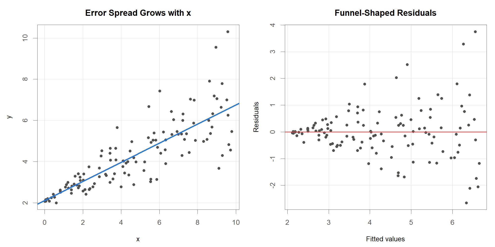
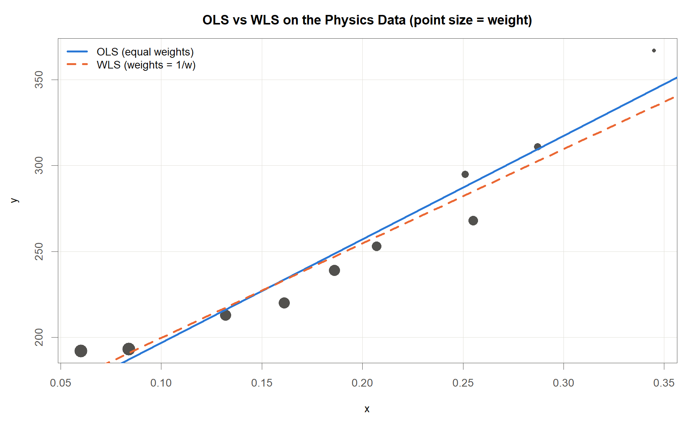
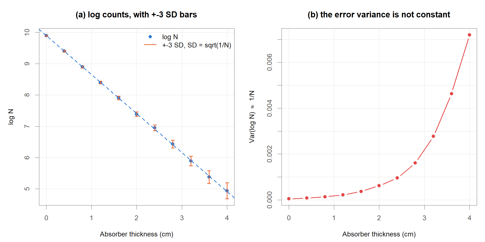
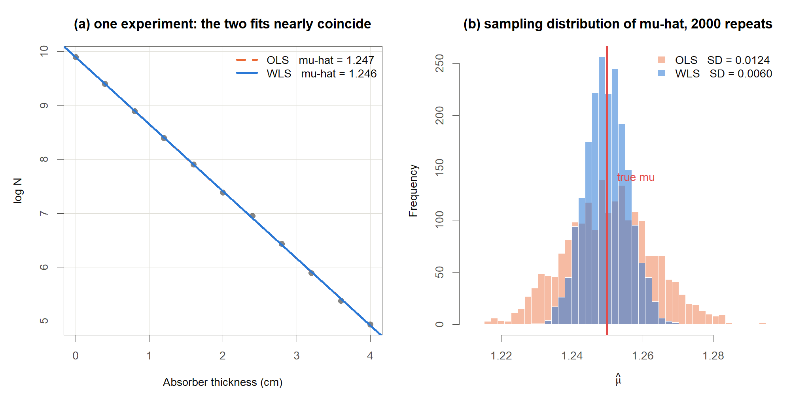
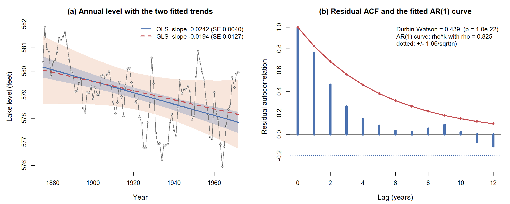

<!-- Date: 2026-08-26 | Purpose: chapter 6 of the KINS regression lecture, split from regression-lecture-note.qmd. Generated by code/agent/2026-08-26/split-chapters.py - edit the master, not this file. | File: 06-weighted-regression.qmd -->

# Weighted Regression

::: notes
특강 제목에도 들어 있는 가중회귀에 도착했습니다. 지금까지는 모든 관측값을 똑같이 믿는다는 전제로 직선을 맞춰 왔는데 이번 장은 다릅니다. 더 믿을 만한 측정에 더 큰 발언권을 주는 방법을 배우겠습니다.

여러분들 실험실 데이터와 가장 가까운 장이기도 합니다. 앞 장에서 최소제곱법이 왜 최선이라고 말할 수 있었는지, 그 근거가 무너지면 무엇으로 갈아타야 하는지를 차례로 보겠습니다.
:::

## 이 장의 출발점

### <i class="fa-solid fa-question"></i> 질문

::: {.callout-note appearance="minimal"}
<i class="fa-solid fa-link"></i> **앞 장에서 여기까지**: 진단에서 잔차가 깔때기 모양으로 퍼지면 등분산 위반. <i class="fa-solid fa-circle-question"></i> **이 장의 질문**: 그때 어떤 방법을 사용하는가
:::

::: {.highlight-box}
모든 관측값을 동일한 신뢰도로 취급해야 하는가?
:::

### <i class="fa-solid fa-lightbulb"></i> 핵심

::: {.callout-tip appearance="minimal"}
<ul>
<li>계측기마다 교정 성적서에 적힌 <b>측정 불확도</b>가 다름</li>
<li>관측값이 서로 다른 횟수의 반복 측정을 평균한 값일 수 있음</li>
<li>관측별 신뢰도를 모형에 반영하는 장치가 필요함: 가중치 $w_i$</li>
<li>추정 대상인 조건부 기댓값 $E(y \mid x)$ 자체는 바뀌지 않음. 관측마다 주는 가중치만 달라짐</li>
</ul>
:::

**기호**

<ul>
<li>$w_i$: $i$번째 관측에 부여하는 가중치</li>
<li>그 관측이 추정에 미치는 영향의 크기를 조절</li>
</ul>

::: notes
같은 시료 하나를 세 가지 저울로 재는 상황을 생각해 보시기 바랍니다. 정밀 분석저울, 주방 저울, 그리고 낡은 체중계입니다. 세 숫자가 나왔을 때 이 셋을 그냥 산술평균하는 분은 없으실 것입니다. 정밀한 저울 쪽을 더 믿으시겠지요. 여러분들 실험실에서도 계측기마다 교정 성적서에 적힌 측정 불확도가 전부 다르지 않습니까. 이 상식을 수식으로 옮긴 것이 가중치, 곧 각 관측값에 주는 발언권입니다.

그러면 낡은 체중계 값은 버리면 되지 않느냐고 물으실 수 있습니다. 버리는 것은 발언권을 0으로 만드는 극단적인 선택입니다. 정보가 조금이라도 있다면 작은 발언권이라도 주는 쪽이 대개 손해가 적습니다.

하나만 더 짚겠습니다. 우리가 찾는 대상은 조건부 기댓값, 곧 $x$가 주어졌을 때 $y$의 평균이었습니다. 가중치를 준다고 그 과녁이 옮겨 가지는 않습니다. 즉, 과녁은 그대로 두고 회의실에서 누구 말을 더 크게 들을지만 다시 정하는 것입니다.
:::

## 등분산과 이분산: 정의

### <i class="fa-solid fa-bullseye"></i> 아래첨자 $i$ 의 유무

::: {.highlight-box}
**등분산(homoscedasticity)**: 모든 $i=1,\dots,n$에 대해 $\operatorname{Var}(\varepsilon_i)=\sigma^2$. 오차의 분산이 공통

**이분산(heteroscedasticity)**: $\operatorname{Var}(\varepsilon_i)=\sigma_i^2$. 오차의 분산이 관측마다 다름
:::

**기호**

<ul>
<li>$\varepsilon_i$: $i$번째 관측의 오차. 참 직선에서 그 관측이 위아래로 벗어난 양</li>
<li>$\operatorname{Var}$: 분산. 값들이 평균에서 흩어진 정도를 재는 수치</li>
<li>$\sigma^2$: 모든 관측에 공통인 오차 분산</li>
<li>$\sigma_i^2$: 관측마다 달라지는 오차 분산</li>
<li>$n$: 관측 수</li>
</ul>

::: {.callout-tip appearance="minimal"}
두 식의 차이는 아래첨자 $i$ 하나뿐이지만, 뒤에서 볼 결과의 차이는 작지 않음
:::

::: notes
지금까지 우리는 오차의 퍼짐이 어디에서나 같다는 약속을 깔고 왔는데 이것을 등분산이라고 부릅니다. 이 약속이 깨진 상황, 곧 오차의 퍼짐이 관측마다 달라지는 상황이 이분산입니다.

기호로 보면 차이가 작습니다. 시그마 제곱에 아래첨자 $i$가 붙었을 뿐인데 그 한 글자가 관측마다 퍼짐이 다르다는 뜻입니다.

분산이라는 말이 낯설면 이렇게 생각해 보시기 바랍니다. 과녁에 화살을 여러 발 쐈을 때 탄착군이 얼마나 넓게 퍼졌는가, 그 넓이가 분산입니다. 그러니 등분산은 어느 자리에서 쏘든 탄착군 크기가 같다는 뜻입니다.
:::

## 등분산과 이분산: 깔때기 신호

### <i class="fa-solid fa-chart-line"></i> 잔차 그림으로 확인

:::: {.columns}

::: {.column width="60%"}
{width=100%}
:::

::: {.column width="40%"}
::: {.callout-tip appearance="minimal"}
<i class="fa-solid fa-chart-line"></i> **이분산의 전형적 신호**

<ul>
<li>산점도: $x$가 커질수록 점들이 직선 주위로 넓게 퍼짐</li>
<li>잔차 그림: 왼쪽은 좁고 오른쪽은 넓은 <b>깔때기 모양</b></li>
<li>등분산이면 잔차가 위아래로 고른 띠를 이룸</li>
</ul>
:::
:::

::::

등분산은 자료가 저절로 만족해 주는 성질이 아니라 분석자가 걸어 둔 가정이므로, Diagnosis 장의 잔차 그림으로 확인해야 함

::: notes
왼쪽 그림을 보시면 $x$가 커질수록 점들이 직선 주위에서 점점 넓게 퍼지고, 오른쪽 잔차 그림에서는 같은 현상이 왼쪽은 좁고 오른쪽은 넓은 깔때기 모양으로 나타납니다. 이 깔때기가 이분산의 대표적인 신호입니다. 반대로 잔차가 위아래로 고르게 띠를 이루고 있다면 등분산 가정에 큰 문제는 없다고 보셔도 됩니다.

그러면 실무에서 이분산을 어떻게 알아챌까요? 검정 통계량보다 그림이 먼저입니다. 앞 장에서 배운 잔차 그림을 그려서 눈으로 확인하는 방법이 가장 빠릅니다. 눈에 깔때기가 보인다면 그다음에 무엇을 해야 하는지가 이 장의 나머지 내용입니다.
:::

## 등분산 위반: Gauss-Markov 복습

### <i class="fa-solid fa-lightbulb"></i> OLS가 최선이었던 근거

::: {.highlight-box}
**Gauss-Markov 정리**: 다음 두 조건이 성립하면 통상최소제곱 추정량 $\hat{\boldsymbol\beta}_{OLS}$는 BLUE이다.

$$E(\boldsymbol\varepsilon \mid \mathbf X)=\mathbf 0, \qquad \operatorname{Var}(\boldsymbol\varepsilon \mid \mathbf X)=\sigma^2\mathbf I$$
:::

**기호**

<ul>
<li>$\boldsymbol\varepsilon$: 오차를 세로로 쌓은 $n\times 1$ 벡터</li>
<li>$\mathbf X$: 절편열을 포함한 $n\times(p+1)$ 설계행렬</li>
<li>$\mathbf I$: $n\times n$ 항등행렬</li>
<li>둘째 조건 = <b>등분산</b>(모든 오차의 분산이 $\sigma^2$ 로 같음) + <b>무상관</b>(서로 다른 관측의 오차가 함께 움직이지 않음)</li>
</ul>

::: {.callout-tip appearance="minimal"}
<i class="fa-solid fa-bullseye"></i> **BLUE(Best Linear Unbiased Estimator)**: $y$의 선형결합으로 만든 불편 추정량 가운데 분산이 가장 작은 것. **불편**은 같은 실험을 무수히 반복했을 때 추정값의 평균이 참값과 일치한다는 뜻
:::

::: notes
잠깐 앞 장으로 돌아가겠습니다. 최소제곱법이 최선이라고 말할 수 있었던 근거가 Gauss-Markov 정리였는데 조건은 두 줄입니다.

첫째, 오차의 평균이 0입니다. 모형이 체계적으로 위나 아래로 치우쳐 있지 않다는 뜻입니다. 둘째 줄이 오늘의 주인공인데 여기에 두 가지가 함께 들어 있습니다. 모든 오차의 퍼짐이 같다는 등분산, 그리고 서로 다른 관측의 오차가 함께 움직이지 않는다는 무상관입니다.

이 두 조건 아래에서 최소제곱 추정량은 BLUE, 곧 y의 선형결합으로 만든 편향 없는 추정량 가운데 가장 덜 흔들리는 추정량이 됩니다. 불편이라는 말은 어렵지 않습니다. 같은 실험을 수없이 반복하면 추정값들의 평균이 참값에 맞는다는 뜻입니다.
:::

## 등분산 위반: 무너지는 결론

### <i class="fa-solid fa-triangle-exclamation"></i> 불편이나 최소분산 아님

::: {.highlight-box}
이분산에서는 $\operatorname{Var}(\boldsymbol\varepsilon)=\sigma^2\mathbf I$가 성립하지 않으므로 Gauss-Markov 정리의 전제가 무너진다. $\hat{\boldsymbol\beta}_{OLS}$는 **여전히 불편추정량이지만 더 이상 최소분산이 아니다**.
:::

::: {.callout-tip appearance="minimal"}
<ul>
<li>편향은 생기지 않음: $E(\hat\beta_1)=\beta_1$이 그대로 성립함</li>
<li>최소분산이 아님: 분산이 더 작은 선형 불편 추정량이 존재함</li>
<li>표준오차가 왜곡됨: 등분산을 전제로 유도한 공식이기 때문</li>
<li>따라서 $t$-검정, $p$-값, 신뢰구간이 모두 틀어짐 (Kutner et al., 2005)</li>
</ul>
:::

**기호**

<ul>
<li>$\hat\beta_1$: 기울기의 추정량, $\beta_1$: 그 참값</li>
<li><b>표준오차</b>: 추정값이 표본마다 얼마나 흔들리는지를 재는 수치</li>
<li><b>$p$-값</b>: "기울기가 0이다"라는 가정이 옳다고 볼 때 지금 자료만큼 극단적인 결과가 나올 확률</li>
</ul>

::: notes
좋은 소식과 나쁜 소식이 있습니다. 좋은 소식은 기울기 추정에 편향이 없다는 것입니다. 평균적으로는 과녁 중심을 맞힙니다.

나쁜 소식은 둘입니다. 첫째, 화살의 흔들림이 필요 이상으로 큽니다. 분산이 더 작은 선형 불편 추정량이 어딘가에 있다는 뜻입니다. 둘째가 더 골치인데, 표준오차 공식 자체가 등분산을 전제로 만들어져 있어서 조준경 눈금이 틀어진 상태가 됩니다. 표준오차는 추정값이 표본을 바꿔 가며 얼마나 흔들리는지를 재는 숫자이고 p-값과 신뢰구간은 전부 이 숫자를 밟고 서 있으니, 밑돌이 틀어지면 그 위도 전부 틀어집니다.

그러면 OLS 결과를 다 버려야 할까요? 계수 값 자체는 참고하셔도 됩니다. 다만 검정과 구간은 믿지 마시고, 지금부터 배울 가중최소제곱으로 다시 적합하시는 편이 정석입니다.
:::

## 가중최소제곱(WLS): 목적함수 {.smaller}

### <i class="fa-solid fa-bullseye"></i> 정의

::: {.highlight-box}
가중최소제곱(weighted least squares)은 다음 **가중 잔차제곱합**을 최소화하는 값을 추정량으로 택한다.

$$\min_{\beta_0,\,\beta_1}\ \sum_{i=1}^{n} w_i\left(y_i-\beta_0-\beta_1 x_i\right)^2$$
:::

**기호**

<ul>
<li>$y_i$: 반응변수, $x_i$: 설명변수</li>
<li>$\beta_0,\beta_1$: 절편과 기울기</li>
<li>$w_i$: $i$번째 관측의 가중치, $n$: 관측 수</li>
</ul>

### <i class="fa-solid fa-lightbulb"></i> 핵심

::: {.callout-tip appearance="minimal"}
<ul>
<li>이론적 최적 가중치는 오차 분산의 역수: $w_i = 1/\sigma_i^2$</li>
<li>분산이 작은(정밀한) 관측일수록 큰 $w_i$를 받음</li>
<li>모든 $w_i=1$이면 통상최소제곱과 같음: <b>OLS는 WLS의 특수한 경우</b></li>
<li>가중치는 비율만 의미를 가짐. 전체에 같은 상수를 곱해도 추정값은 불변</li>
</ul>
:::

::: notes
아이디어는 하나입니다. 제곱오차를 더할 때 각 항 앞에 발언권을 곱하는 것입니다. 가중치가 큰 점은 오차의 벌점이 크게 매겨지니 직선이 그 점 가까이 지나가려고 애쓰게 되고, 반대로 가중치가 작은 점은 조금 멀리 지나가도 벌점이 작습니다.

이론적으로 가장 좋은 가중치는 그 관측이 가진 오차 분산의 역수입니다. 정밀한 저울일수록 발언권을 크게 주자는 상식이 그대로 수식이 된 셈입니다.

가중치의 절대 크기도 중요하냐는 질문이 자주 나오는데 아닙니다. 비율만 중요합니다. 모든 가중치에 10을 곱해도 직선은 그대로입니다.
:::

## 가중최소제곱(WLS): 행렬 해

### <i class="fa-solid fa-bullseye"></i> OLS 공식에 $\mathbf W$ 삽입

::: {.highlight-box}
$$\hat{\boldsymbol\beta}_W=(\mathbf X^\top \mathbf W \mathbf X)^{-1}\mathbf X^\top \mathbf W \mathbf y$$
:::

**기호**

<ul>
<li>$\mathbf y$: 반응변수를 세로로 쌓은 $n\times 1$ 벡터</li>
<li>$\mathbf X$: 절편열을 포함한 $n\times(p+1)$ 설계행렬</li>
<li>$\mathbf W=\operatorname{diag}(w_1,\dots,w_n)$: 가중치를 대각선에 놓고 나머지 자리를 0으로 채운 대각행렬</li>
<li>$\hat{\boldsymbol\beta}_W$: 가중최소제곱 추정량</li>
</ul>

::: {.callout-tip appearance="minimal"}
OLS 공식 $(\mathbf X^\top\mathbf X)^{-1}\mathbf X^\top\mathbf y$ 와 비교하면 $\mathbf X$ 와 $\mathbf y$ 사이에 $\mathbf W$ 가 끼어든 형태. $\mathbf W=\mathbf I$ 이면 OLS로 되돌아감
:::

::: notes
앞의 최소화 문제를 풀면 답이 한 줄로 나옵니다. OLS 공식과 나란히 놓고 보시면 $\mathbf X$와 $\mathbf y$ 사이사이에 가중치 행렬 $\mathbf W$가 끼어든 것뿐입니다. $\mathbf W$는 대각선에 발언권 $w_1$부터 $w_n$까지를 나란히 적고 나머지 칸은 전부 0으로 채운 행렬입니다.

그러면 모든 발언권이 1이면 어떻게 될까요? $\mathbf W$가 항등행렬이 되면서 공식이 정확히 OLS로 돌아갑니다. 그러니 새 공식을 외우실 필요는 없고 OLS에 발언권을 끼워 넣었다, 이렇게만 기억하시면 됩니다.

이 역행렬 계산을 직접 해야 하나 걱정하실 수 있는데 그렇지 않습니다. 계산은 프로그램이 하고 여러분들이 정하실 것은 $\mathbf W$ 의 대각선에 무엇을 넣을지, 그 하나뿐입니다.
:::

## 가중최소제곱(WLS): 해의 유도

### <i class="fa-solid fa-pen-to-square"></i> 절차는 OLS와 동일

::: {.callout-note appearance="minimal"}
가중 잔차제곱합을 행렬로 쓰면

$$S_W(\boldsymbol\beta)=\sum_{i=1}^{n} w_i\left(y_i-\mathbf x_i^\top\boldsymbol\beta\right)^2=(\mathbf y-\mathbf X\boldsymbol\beta)^\top\mathbf W(\mathbf y-\mathbf X\boldsymbol\beta)$$

$\boldsymbol\beta$로 미분해 $\mathbf 0$으로 놓으면 정규방정식을 얻음

$$\frac{\partial S_W}{\partial\boldsymbol\beta}=-2\,\mathbf X^\top\mathbf W(\mathbf y-\mathbf X\boldsymbol\beta)=\mathbf 0
\ \Longrightarrow\ \mathbf X^\top\mathbf W\mathbf X\,\hat{\boldsymbol\beta}_W=\mathbf X^\top\mathbf W\mathbf y$$

$\mathbf X^\top\mathbf W\mathbf X$ 가 가역이면 앞 슬라이드의 해
:::

**기호**

<ul>
<li>$\mathbf x_i^\top$: 설계행렬 $\mathbf X$ 의 $i$번째 행</li>
<li>$S_W(\boldsymbol\beta)$: 가중 잔차제곱합</li>
</ul>

::: notes
유도 절차는 앞 장에서 하셨던 것과 완전히 같습니다. 제곱합을 베타로 미분해서 0으로 놓으면 정규방정식이 나오고 역행렬을 곱하면 끝나는데, 달라진 것은 식 가운데에 $\mathbf W$가 하나 들어간 것뿐입니다.

미분 과정이 눈에 들어오지 않으셔도 괜찮습니다. 결론만 가져가시면 됩니다. 가중치를 넣어도 푸는 방식은 그대로이고 답의 모양도 그대로, 이 두 가지입니다.
:::

## 가중치를 정하는 규칙 {.smaller}

### <i class="fa-solid fa-table"></i> 실무 규칙

| Situation | Weight $w_i$ |
|:---|:---|
| 측정 분산 $\sigma_i^2$를 아는 경우(교정 성적서, 반복 측정) | $w_i = 1/\sigma_i^2$ |
| $y_i$가 $n_i$개 측정값의 평균인 경우 | $w_i = n_i$ |
| 퍼짐이 $x_i$에 비례해 커지는 경우 | $w_i \propto 1/x_i$ |

: Practical rules for choosing weights (Kutner et al., 2005)

**기호**

<ul>
<li>$\sigma_i^2$: $i$번째 관측의 오차 분산</li>
<li>$n_i$: $y_i$ 를 만들 때 평균한 측정 횟수</li>
<li>$\propto$: "비례한다"는 기호</li>
</ul>

### <i class="fa-solid fa-lightbulb"></i> 핵심

::: {.highlight-box}
세 규칙은 모두 하나의 원리에서 나온다: **가중치는 분산의 역수**. $n_i$개 측정값을 평균하면 그 평균의 분산이 $\sigma^2/n_i$이므로, 역수를 취하면 $w_i \propto n_i$가 된다.
:::

::: notes
그러면 실무에서 가중치를 어떻게 정할까요? 규칙은 하나입니다. 그 관측값의 분산을 알아내서 역수를 취하는 것, 이것이 전부입니다.

첫째 줄, 교정 성적서나 반복 측정으로 분산을 이미 알고 있다면 그대로 역수를 쓰시면 됩니다. 둘째 줄, $y_i$가 여러 번 측정한 값의 평균이라면 평균의 분산은 측정 횟수만큼 나눠져 작아지니 가중치는 측정 횟수에 비례하게 줍니다. 다섯 번 잰 평균이 한 번 잰 값보다 다섯 배 믿을 만하다는 뜻입니다. 셋째 줄, 앞의 깔때기 그림처럼 퍼짐이 $x$에 비례해 커진다면 가중치는 $x$의 역수에 비례하게 잡습니다.

그러면 분산 정보가 아예 없으면 어떻게 할까요? 그때는 잔차 그림으로 분산이 어느 변수를 따라 커지는지 구조를 먼저 추정하고 그것으로 가중치를 만들어 다시 적합합니다. 요점은 하나입니다. 즉, 가중치에는 근거가 있어야 합니다.
:::

## 가중치의 실무 적용: 감마선 검교정

### <i class="fa-solid fa-screwdriver-wrench"></i> 분산을 이미 아는 경우

::: {.callout-tip appearance="minimal"}
Introduction 장에서 소개한 사례가 앞 표의 첫째 줄에 해당함

<ul>
<li>검출기의 검출 효율 곡선을 적합하는 검교정 문제</li>
<li>각 측정점의 분산이 <b>계수 통계(counting statistics)</b>로 이미 알려져 있음</li>
<li>따라서 가중치를 추정하지 않고 곧바로 계산함: $w_i = 1/\sigma_i^2$</li>
<li>오차 분산을 알고 오차가 서로 무상관이면, 역분산 가중이 선형 불편 추정량 가운데 최소분산을 줌</li>
</ul>
:::

**기호**

<ul>
<li>$\sigma_i$: $i$번째 측정점 계수율의 표준편차</li>
<li>계수 통계에서 곧바로 계산되는 값</li>
</ul>

::: {.aside}
*Analytical Chemistry* 91(7) (2019), doi:10.1021/acs.analchem.9b00119. / INMM Annual Meeting Proceedings, "Weighted Least Squares Fitting of Gamma Spectroscopy Efficiency Functions".
:::

::: notes
첫 장에서 잠깐 보여 드린 감마선 분광 효율 검교정으로 돌아가겠습니다. 이 문제가 가중회귀의 교과서적인 사례인데, 각 측정점의 분산을 따로 추정할 필요가 없기 때문입니다.

계수 통계에서 이미 나와 있습니다. 방사선 계수는 세는 횟수 자체가 확률적으로 흔들리는데 그 흔들림의 크기가 이론적으로 알려져 있어서, 곧장 분산의 역수를 가중치로 넣습니다. 추정 단계가 하나 통째로 빠지니 깔끔합니다.

그리고 이렇게 분산을 아는 상황에서는 역분산 가중이 최선이라는 사실이 이론으로 보장됩니다. 여러분들 현장의 계측 자료 중에 이런 성격을 가진 것이 꽤 많을 것입니다.
:::

## 예제 자료(물리 측정): 자료 구조 {.smaller}

### <i class="fa-solid fa-table"></i> $w$ 는 분산에 비례

| x | y | w |
|---:|---:|---:|
| 0.345 | 367 | 17 |
| 0.287 | 311 | 9 |
| 0.251 | 295 | 9 |

: First 3 rows of the physics data. n = 10 observations, 3 variables (CNU lecture note, Example 8.1)

::: {.callout-tip appearance="minimal"}
<ul>
<li>양자충돌 실험 자료, $n=10$</li>
<li>$x$는 설명변수, $y$는 반응변수인 측정값</li>
<li>$w$는 각 $y$의 <b>측정 분산에 비례</b>하는 값. 분산 자체가 아니라 분산에 비례하는 값</li>
<li>따라서 가중치는 그 역수인 $1/w$가 됨. $w$ 가 클수록 신뢰도가 낮은 점</li>
</ul>
:::

::: notes
이제 실제 자료로 해 보겠습니다. 관측이 열 개뿐인 작은 자료이고 표에는 앞의 세 줄만 보여 드렸습니다. 변수는 셋인데 설명변수 $x$, 반응변수 $y$, 그리고 $w$입니다.

이 $w$가 핵심인데 여기서 한 번 헷갈리기 쉬운 지점이 나옵니다. $w$는 가중치가 아니라 측정 분산에 비례하는 값입니다. 그러니 $w$가 큰 점은 흔들림이 큰, 곧 덜 믿을 만한 점이고 첫 줄의 17이 가장 큰 값입니다. 가중치는 분산의 역수이므로 $1/w$를 씁니다.

이름이 $w$라고 해서 그대로 가중치 자리에 넣으시면 정반대 결과가 나옵니다. 믿을 수 없는 점에 가장 큰 발언권을 주게 되기 때문입니다. 실무에서 자주 나오는 실수라 한 번 더 강조드립니다.
:::

## 예제 자료(물리 측정): OLS와 WLS 비교

### <i class="fa-solid fa-chart-line"></i> 두 직선의 차이

:::: {.columns}

::: {.column width="60%"}
{width=100%}
:::

::: {.column width="40%"}
::: {.callout-tip appearance="minimal"}
<i class="fa-solid fa-lightbulb"></i> **읽는 법**

<ul>
<li>점의 크기가 가중치 $1/w$에 비례함</li>
<li>큰 점일수록 정밀하게 측정된 점</li>
<li>실선은 모든 점을 동일하게 취급한 OLS</li>
<li>점선은 가중치를 반영한 WLS</li>
<li>두 직선이 갈라지는 이유는 WLS가 큰 점 쪽으로 더 기울기 때문</li>
</ul>
:::
:::

::::

::: notes
그림에서 점의 크기가 가중치에 비례합니다. 큰 점일수록 정밀하게 측정된, 발언권이 큰 점입니다. 파란 실선이 모든 점을 똑같이 대접한 OLS이고 주황 점선이 발언권을 반영한 WLS입니다.

두 직선이 서로 다른 이유는 하나입니다. WLS가 큰 점들의 말을 더 들어주었기 때문입니다.

그림만 봐서는 차이가 크지 않아 보이실 수도 있습니다. 다음 슬라이드에서 숫자로 확인해 보겠습니다.
:::

## 예제 자료(물리 측정): 추정 결과 {.smaller}

### <i class="fa-solid fa-table"></i> 계수와 표준오차의 변화

**추정 경로**

자료에 기록된 $w_i$ 는 각 $y_i$ 의 **측정분산**. 가중치는 그 역수이므로

$$
\mathbf W=\operatorname{diag}\!\Big(\frac{1}{w_1},\dots,\frac{1}{w_{10}}\Big),
\qquad
\hat{\boldsymbol\beta}_{\mathrm{WLS}}=(\mathbf X^\top\mathbf W\mathbf X)^{-1}\mathbf X^\top\mathbf W\mathbf y
$$

$$
\operatorname{Var}(\hat{\boldsymbol\beta}_{\mathrm{WLS}})=\sigma^2(\mathbf X^\top\mathbf W\mathbf X)^{-1}
$$

$\mathbf W=\mathbf I$ 로 두면 두 식이 그대로 OLS의 $(\mathbf X^\top\mathbf X)^{-1}\mathbf X^\top\mathbf y$ 와 $\sigma^2(\mathbf X^\top\mathbf X)^{-1}$ 이 됨. OLS는 모든 관측에 동일한 가중치를 부여한 WLS

**추정 결과**

| Estimate | OLS | WLS |
|:---|:---|:---|
| $\hat\beta_0$ (intercept) | 136.6 (SE 11.9) | 144.8 (SE 10.3) |
| $\hat\beta_1$ (slope) | 602.4 (SE 55.6) | 549.5 (SE 53.6) |

: OLS vs WLS estimates on the physics data (n = 10). WLS $R^2 = 0.929$

**결과 읽기**

::: {.callout-tip appearance="minimal"}
<ul>
<li>기울기 추정: 602.4에서 549.5로 이동함</li>
<li>표준오차: 절편은 11.9에서 10.3으로, 기울기는 55.6에서 53.6으로 감소함</li>
<li>WLS 적합의 결정계수는 $R^2 = 0.929$</li>
<li>표준오차의 감소 폭보다, 분산 구조를 반영한 표준오차를 쓰게 되었다는 점이 중요함</li>
</ul>
:::

::: notes
추정 경로에서 OLS와 달라진 곳은 한 군데뿐입니다. $\mathbf X$ 와 $\mathbf y$ 사이사이에 $\mathbf W$ 가 끼어든 것, 그것이 전부입니다. 다만 자료에 적힌 $w$ 는 측정분산이라서 발언권은 그 역수라는 점만 주의하시면 됩니다. 정밀한 측정일수록 분산이 작고 역수를 취하니 발언권이 커집니다.

추정 결과를 보시면 기울기가 602.4에서 549.5로 움직였고, 표준오차는 절편이 11.9에서 10.3으로 기울기가 55.6에서 53.6으로 줄었으며 결정계수는 0.929입니다.

표준오차가 조금밖에 줄지 않았는데 의미가 있느냐고 물으실 수 있습니다. 관측이 열 개뿐이라 감소 폭이 작아 보이는 것은 맞습니다. 하지만 핵심은 폭이 아닙니다. 애초에 잘못 계산되던 표준오차 대신 실제 분산 구조를 반영한 표준오차를 이제 쓴다는 것, 그래서 그 숫자를 믿고 신뢰구간을 그릴 수 있게 되었다는 점이 더 중요합니다.
:::

## 감쇠 곡선: 문제 설정 {.smaller}

### <i class="fa-solid fa-bullseye"></i> 가중치를 아는 문제

::: {.callout-note appearance="minimal"}
<i class="fa-solid fa-pen-to-square"></i> **유도**

감쇠는 Beer-Lambert 형태로, 로그를 취하면 선형이 되고 **기울기의 음수가 감쇠계수** $\mu$

$$N(x)=N_0\,e^{-\mu x}\qquad\Longrightarrow\qquad \ln N(x)=\ln N_0-\mu x$$

계수는 Poisson을 따르므로 $\operatorname{Var}(N)=N$. 여기에 델타법을 적용하면

$$\operatorname{Var}(\ln N)\;\approx\;\Big(\frac{d\ln N}{dN}\Big)^{2}\operatorname{Var}(N)=\frac{1}{N^{2}}\cdot N=\frac{1}{N}$$

<ul>
<li>델타법: 함수 $g(N)$ 의 분산을 $\{g'(N)\}^2\operatorname{Var}(N)$ 로 근사하는 방법</li>
</ul>
:::

::: {.callout-tip appearance="minimal"}
<ul>
<li>흡수체가 두꺼워져 계수가 줄수록 $\ln N$ 의 분산이 <b>커짐</b>. 로그 변환이 이분산을 만들어 냄</li>
<li>그 크기가 이론으로 이미 알려져 있으므로 가중치는 곧바로 $w_i=1/\operatorname{Var}(\ln N_i)=N_i$</li>
<li>앞의 규칙 표 첫째 줄(분산을 아는 경우)에 그대로 해당</li>
</ul>
:::

::: notes
기관에서 관심을 두고 계신 감쇠 곡선을 가져왔습니다. 결론부터 말씀드리면 이것은 가중회귀의 교과서적 사례이고 심지어 가중치를 추정할 필요조차 없습니다.

위 상자를 따라가 보겠습니다. 감쇠는 지수함수인데 양변에 로그를 취하면 직선이 되고 기울기에 마이너스를 붙인 것이 우리가 구하려는 감쇠계수입니다. 여기까지는 익숙하실 것입니다.

문제는 그다음입니다. 계수는 Poisson을 따르므로 분산이 계수값 자체와 같습니다. 만 번 셌으면 분산도 만입니다. 그런데 우리가 회귀를 돌리는 대상은 계수가 아니라 로그를 취한 값인데, 로그를 취하면 분산이 어떻게 바뀔까요? 델타법으로 계산하면 정확히 계수의 역수가 됩니다.

이 한 줄이 핵심입니다. 흡수체가 두꺼워지면 계수가 줄고 계수가 줄면 로그값의 분산이 커집니다. 즉, 로그 변환 자체가 이분산을 만들어 내는 것입니다. 다행인 것은 그 크기를 우리가 이미 안다는 점입니다. 분산이 1 나누기 N이니 가중치는 그냥 N이고, 추정 단계가 통째로 빠집니다.
:::

## 감쇠 곡선: 분산의 증가 {.fig-led}

### <i class="fa-solid fa-chart-line"></i> 모의실험 $\mu=1.25\ \mathrm{cm^{-1}}$, $N_0=20000$

{width=100% .nostretch}

| Thickness (cm) | 0.0 | 1.2 | 2.4 | 3.6 | 4.0 |
|:--|--:|--:|--:|--:|--:|
| Counts $N$ | 19920 | 4449 | 1046 | 216 | 139 |
| $\operatorname{Var}(\ln N)=1/N$ | 0.000050 | 0.000225 | 0.000956 | 0.004630 | 0.007194 |

: One simulated attenuation experiment; the error variance grows 143-fold across the range

::: notes
숫자로 보시는 편이 빠릅니다. 감쇠계수를 1.25로 두고 흡수체 없이 이만 번 세는 상황을 모의했습니다.

표의 둘째 줄을 보시면 두께가 0일 때 이만 번 가까이 세지만 4센티미터에서는 139번밖에 세지 못합니다. 셋째 줄이 그 결과인데 로그값의 분산이 0.00005에서 0.0072로 커집니다. 143배입니다. 왼쪽 그림의 오차막대가 오른쪽으로 갈수록 길어지는 것이 바로 이 이야기이고 오른쪽 그림은 그 분산만 따로 그린 것입니다. 앞 장에서 보신 깔때기 모양이 여기서는 이론적으로 예측된 형태로 나타납니다.

이 상황에서 모든 점에 같은 발언권을 주면 어떻게 될까요? 가장 덜 믿을 만한 오른쪽 끝 점이 직선의 기울기를 부당하게 끌어당깁니다. 다음 화면에서 그 대가가 얼마인지 보겠습니다.
:::

## 감쇠 곡선: OLS와 WLS 비교 {.smaller .fig-led}

### <i class="fa-solid fa-chart-line"></i> 2000회 반복에서의 $\hat\mu$ 분포

{width=100% .nostretch}

| Method | Bias | SD | RMSE |
|:--|--:|--:|--:|
| 로그 계수에 OLS | +0.0005 | 0.0124 | 0.0124 |
| **로그 계수에 WLS** ($w_i=N_i$) | −0.0002 | **0.0060** | **0.0060** |

: Recovery of the true attenuation coefficient over 2000 simulated experiments

::: {.callout-tip appearance="minimal"}
둘 다 편향은 없으나 **WLS의 분산이 4.3배 작음**. 같은 측정으로 $\mu$ 를 두 배 이상 정밀하게 얻는다는 뜻
:::

::: notes
왼쪽 그림부터 보겠습니다. 한 번의 실험에서 두 직선이 거의 겹치니 한 번 적합해 보고는 어느 쪽이 나은지 알 수 없습니다. 이 점을 먼저 말씀드리는 이유가 있습니다. 실무에서 가중치를 넣어 보고 계수가 별로 안 바뀌길래 의미 없다고 판단하시는 경우가 많기 때문입니다. 차이는 한 번의 값이 아니라 흔들림의 폭에서 납니다.

오른쪽 그림이 그것입니다. 같은 실험을 이천 번 반복해서 얻은 감쇠계수의 분포인데 주황색이 OLS이고 파란색이 WLS입니다. 중심은 둘 다 참값에 맞아 있으니 편향은 없다는 뜻입니다. 그런데 폭이 확연히 다릅니다. 표준편차가 0.0124 대 0.0060, 분산으로는 4.3배 차이입니다.

즉, 같은 측정 자료로 감쇠계수를 두 배 이상 정밀하게 얻는다는 뜻입니다. 측정 시간을 늘리지 않고 정밀도를 올리는 방법입니다.
:::

## 감쇠 곡선: WLS의 한계 {.smaller}

### <i class="fa-solid fa-triangle-exclamation"></i> 최대가능도로의 전환

::: {.callout-tip appearance="minimal"}
가중치로 쓰는 $N_i$ 가 **관측값 자체**이므로, 계수가 적으면 가중치와 자료가 음의 상관을 갖게 되어 편향이 생김
:::

| 가장 얇은 신호의 기대계수 | OLS 편향 | WLS 편향 | Poisson GLM 편향 |
|--:|--:|--:|--:|
| 135 | +0.0005 | −0.0002 | +0.0001 |
| 13.5 | +0.0090 | −0.0026 | −0.0000 |
| **1.3** | +0.0034 | **−0.0286** | −0.0083 |

: Bias in the estimated attenuation coefficient as the weakest signal gets smaller (2000 repeats each)

::: {.callout-note appearance="minimal"}
<i class="fa-solid fa-screwdriver-wrench"></i> **실무 지침**

<ul>
<li>계수가 수십 이상: 로그 변환 후 $w_i=N_i$ 로 <b>WLS</b></li>
<li>계수가 한 자리로 떨어짐: 로그를 취하지 말고 <b>Poisson 최대가능도</b>(로그연결 GLM)로 직접 적합</li>
<li>계수가 0인 점: 로그가 정의되지 않으므로 WLS 자체가 불가능. GLM은 그대로 처리 가능</li>
</ul>
:::

::: notes
정직하게 한계도 말씀드리겠습니다. 가중치로 쓰는 N이 참값이 아니라 관측값입니다. 계수가 넉넉할 때는 문제가 안 되지만 계수가 적어지면 우연히 크게 나온 점이 큰 가중치를 함께 받게 되고, 자료와 가중치가 얽히면서 편향이 생깁니다.

표를 위에서 아래로 보겠습니다. 가장 약한 신호의 기대계수가 135일 때는 WLS 편향이 0.0002로 없는 것이나 마찬가지인데, 13.5로 내려가면 0.0026, 1.3까지 떨어지면 0.0286으로 크게 커지고 마지막 줄에서는 오히려 OLS보다 나쁩니다.

그러면 어떻게 할까요? 오른쪽 열을 보시면 Poisson 최대가능도, 곧 로그연결 GLM은 같은 상황에서 편향이 0.0083으로 훨씬 작습니다. 로그를 취해서 선형회귀로 바꾸는 대신 계수 자체를 Poisson으로 직접 모형화하기 때문입니다.

실무 지침은 아래 상자에 세 줄로 정리해 두었습니다. 계수가 0인 점이 있으면 로그를 아예 취할 수 없다는 것도 기억해 두시면 좋겠습니다. 그때는 선택의 여지가 없습니다.
:::

## 일반화최소제곱(GLS): 정의

### <i class="fa-solid fa-bullseye"></i> 오차 간 상관의 포함

::: {.highlight-box}
오차의 공분산행렬이 $\operatorname{Var}(\boldsymbol\varepsilon)=\boldsymbol\Sigma$인 선형모형 $\mathbf y=\mathbf X\boldsymbol\beta+\boldsymbol\varepsilon$에서, 일반화최소제곱 추정량은 다음과 같다.

$$\hat{\boldsymbol\beta}_{GLS}=(\mathbf X^\top\boldsymbol\Sigma^{-1}\mathbf X)^{-1}\mathbf X^\top\boldsymbol\Sigma^{-1}\mathbf y$$
:::

**기호**

<ul>
<li>$\boldsymbol\Sigma$: 오차 벡터 $\boldsymbol\varepsilon$ 의 공분산행렬. 대칭이고 양정치</li>
<li>대각 원소: 각 오차의 분산</li>
<li>비대각 원소: 두 오차가 함께 움직이는 정도인 공분산</li>
<li>나머지 기호는 앞 슬라이드와 동일</li>
</ul>

::: {.callout-tip appearance="minimal"}
WLS 공식에서 $\mathbf W$ 자리에 $\boldsymbol\Sigma^{-1}$ 이 들어간 형태
:::

::: notes
마지막으로 한 걸음만 더 나가 보겠습니다. 지금까지는 오차들이 서로 남남이라고, 그러니까 독립이라고 가정했습니다. 그런데 시간 순서로 쌓이는 자료에서는 어제의 오차와 오늘의 오차가 닮아 있는 경우가 많습니다. 온도 드리프트나 장비 노후가 그런 패턴을 만듭니다.

이 닮음까지 담으려면 오차의 공분산행렬 전체를 공식에 넣어야 합니다. 공분산행렬은 대각선에 각 오차의 분산을, 나머지 칸에 오차 쌍이 함께 움직이는 정도를 적어 둔 표입니다. 그 결과가 일반화최소제곱, 곧 GLS입니다.

공식 모양을 보시면 WLS와 골격이 똑같습니다. $\mathbf W$ 자리에 시그마의 역행렬이 들어갔을 뿐입니다.
:::

## 일반화최소제곱(GLS): 유도

### <i class="fa-solid fa-pen-to-square"></i> 변환을 통해 OLS로 환원

::: {.callout-note appearance="minimal"}
$\boldsymbol\Sigma^{-1}=\mathbf P^\top\mathbf P$를 만족하는 대칭행렬 $\mathbf P$를 잡아 모형의 양변에 곱하면

$$\mathbf P\mathbf y=\mathbf P\mathbf X\boldsymbol\beta+\mathbf P\boldsymbol\varepsilon,\qquad
\operatorname{Var}(\mathbf P\boldsymbol\varepsilon)=\mathbf P\boldsymbol\Sigma\mathbf P^\top=\mathbf I$$

변환된 자료는 등분산과 무상관을 모두 만족. 여기에 **통상최소제곱**을 그대로 적용하면 앞 슬라이드의 GLS 해
:::

**기호**

<ul>
<li>$\mathbf P$: $\boldsymbol\Sigma^{-1}$ 을 분해해 얻는 변환행렬</li>
<li>$\mathbf I$: 항등행렬</li>
</ul>

::: notes
그러면 이 공식은 왜 이렇게 생겼을까요? 유도 상자가 답입니다. 자료를 적절한 행렬 $\mathbf P$로 한 번 변환해 주면 뒤틀려 있던 오차 구조가 반듯하게 펴지고, 펴진 자료에는 우리가 아는 보통의 최소제곱을 그대로 쓸 수 있습니다. 안경을 바꿔 끼고 나서 원래 방법대로 본다, 이렇게 생각하시면 됩니다.

실제로 GLS 소프트웨어가 내부에서 하는 일이 정확히 이 변환입니다. 즉, 새로운 방법을 발명한 것이 아니라 자료의 좌표만 바꿔서 익숙한 방법으로 돌려놓는 것입니다.
:::

## 일반화최소제곱(GLS): WLS와의 관계

### <i class="fa-solid fa-lightbulb"></i> 핵심

::: {.callout-tip appearance="minimal"}
<ul>
<li>WLS는 $\boldsymbol\Sigma$가 <b>대각행렬</b>인 특수한 경우. 오차 사이의 상관을 나타내는 비대각 원소가 모두 0</li>
<li>$\boldsymbol\Sigma=\sigma^2\mathbf I$이면 GLS와 WLS와 OLS가 모두 일치함</li>
<li>$\boldsymbol\Sigma$를 알 때 GLS가 BLUE라는 결과가 Gauss-Markov 정리의 일반화임(Aitken 정리)</li>
</ul>
:::

### <i class="fa-solid fa-table"></i> 자기상관 구조의 예

시간 순서로 이웃한 오차가 서로 닮아 있는 성질을 **자기상관**이라 함. 한 칸 멀어질 때마다 상관이 $\rho$ 배로 줄어드는 구조가 가장 단순한 예

$$
\boldsymbol\Sigma=\sigma^2\begin{pmatrix}
1 & \rho & \rho^2 & \cdots & \rho^{\,n-1}\\
\rho & 1 & \rho & \cdots & \rho^{\,n-2}\\
\rho^2 & \rho & 1 & \cdots & \rho^{\,n-3}\\
\vdots & \vdots & \vdots & \ddots & \vdots\\
\rho^{\,n-1} & \rho^{\,n-2} & \rho^{\,n-3} & \cdots & 1
\end{pmatrix},\qquad |\rho|<1
$$

$\rho=0$ 이면 비대각 원소가 모두 사라져 $\boldsymbol\Sigma=\sigma^2\mathbf I$, 곧 OLS로 되돌아감

::: notes
$\boldsymbol\Sigma$가 대각행렬이면 GLS가 곧 WLS가 됩니다. 오늘 배운 WLS는 GLS라는 큰 가족의 한 식구인 셈입니다. 하나 덧붙이면, 앞 장에서 등분산일 때 OLS가 BLUE라고 했던 그 정리를 일반화한 것이 GLS입니다. 오차 구조를 알고 있다면 그 안에서 최선은 GLS라는 것이고 이것을 Aitken 정리라고 부릅니다.

오른쪽에 가장 단순한 자기상관 구조를 적어 두었습니다. 대각선은 전부 1인데 자기 자신과의 상관이니 당연합니다. 한 칸 옆으로 가면 $\rho$, 두 칸 가면 $\rho$ 의 제곱이니 멀어질수록 닮은 정도가 빠르게 줄어듭니다. 연속 계측처럼 시간 순서가 있는 자료에서 자연스러운 모양입니다.

맨 아래 줄을 봐 주시면 좋겠습니다. $\rho$ 가 0이면 비대각 원소가 전부 사라지고 우리가 아는 OLS로 돌아옵니다.

우리 실험실 연속 계측 자료가 여기 해당되는지 궁금하시다면 이렇게 확인해 보시기 바랍니다. 잔차를 시간 순서로 그려 보시고 이웃한 잔차가 비슷하게 움직이는 패턴이 보이면 GLS를 고려하실 때입니다.
:::

## GLS 예제: Lake Huron 수위 {.smaller .fig-led}

### <i class="fa-solid fa-chart-line"></i> 98년 연간 기록의 추세

{width=100% .nostretch}

| Quantity | Value | 뜻 |
|:--|--:|:---|
| Durbin-Watson $d$ | 0.4395 ($p=1.0\times10^{-22}$) | 2에서 아래로 크게 벗어남 |
| Residual ACF, lags 1-3 | 0.762, 0.464, 0.261 | 이웃 해의 잔차가 강하게 닮아 있음 |
| Runs of one sign | 19 | 98개 잔차에서 부호가 18번만 바뀜 |

: Autocorrelation in the OLS residuals of the Lake Huron trend model (n = 98 annual measurements)

<ul>
<li>$d=\sum_{t=2}^{n}(e_t-e_{t-1})^2\big/\sum_{t=1}^{n}e_t^2$: <b>Durbin-Watson 통계량</b></li>
<li>이웃한 잔차가 무관하면 2 부근, 같은 방향으로 움직이면 2보다 작아짐</li>
<li>퍼짐은 고르므로 등분산은 유지되고, $\operatorname{Var}(\boldsymbol\varepsilon)=\sigma^2\mathbf I$ 의 <b>무상관</b> 쪽만 깨져 있음</li>
</ul>

::: notes
가중회귀에서는 공분산행렬의 대각선이 문제였는데 이번에는 비대각선이 문제인 자료를 보겠습니다. Lake Huron의 수위를 1875년부터 1972년까지 해마다 잰 기록으로 98년치이고, 관측 하나가 1년이니 행 번호가 곧 시간 순서입니다. 이런 장기 감시 자료에서 우리가 알고 싶은 것은 대개 추세, 곧 수위가 해마다 얼마씩 변하는가입니다. 그래서 수위를 연도에 회귀시킵니다.

왼쪽 그림의 회색 선이 실제 수위입니다. 오르락내리락하지만 한 해 오르면 다음 해도 높은 편이고 한 번 내려가면 몇 년씩 낮게 머무는데, 이것이 이웃한 오차가 손을 잡고 있다는 뜻입니다.

오른쪽 그림이 그 정도를 잰 것입니다. 한 해 차이 나는 잔차끼리의 상관이 0.76, 두 해 차이는 0.46, 세 해 차이는 0.26으로 서서히 줄어듭니다. 점선은 우연히 나올 수 있는 범위인데 세 칸이나 그 위로 솟아 있습니다. Durbin-Watson 통계량은 이 이야기를 숫자 하나로 줄인 것인데, 이웃한 잔차가 무관하면 2 근처가 나오는 데 반해 여기서는 0.44이고 p값이 10의 마이너스 22승이니 우연이라고 볼 수 없습니다.

앞에서 본 물리 측정 자료나 감쇠 곡선과 달리 여기서는 퍼짐 자체는 고릅니다. 즉, 등분산은 성립하고 무상관만 깨진 것이니 WLS가 아니라 GLS를 쓸 자리입니다.
:::

## GLS 예제: 풀이 절차 {.smaller .stepped}

### <i class="fa-solid fa-pen-to-square"></i> 세 단계

<ol>
<li><b>구조를 고른다.</b> 앞 슬라이드의 AR(1)을 그대로 씀. 관측이 98개면 공분산행렬의 칸이 9604개이므로, 모양을 정해 추정할 값을 $\rho$ 하나로 줄임
$$\boldsymbol\Sigma=\sigma^2\mathbf V,\qquad V_{ij}=\rho^{\,|i-j|}$$</li>
<li><b>$\rho$ 를 추정한다.</b> 서로 다른 세 방법이 거의 같은 값을 줌: Cochrane-Orcutt 반복 0.768, 최대가능도 0.783, 제한최대가능도 0.825. <b>추정 방법이 결과를 좌우하지 않는다는 확인</b>이며, 이후 계산은 $\hat\rho=0.825$ 를 사용</li>
<li><b>공식에 넣는다.</b> $\hat{\boldsymbol\beta}_{GLS}=(\mathbf X^\top\mathbf V^{-1}\mathbf X)^{-1}\mathbf X^\top\mathbf V^{-1}\mathbf y$ 로 계산. $\rho=0$ 을 검정하는 가능도비는 $\chi^2_1=89.6$, $p<0.0001$ 로 자기상관 항을 넣을 근거가 뚜렷함</li>
</ol>

::: {.callout-note appearance="minimal"}
$\boldsymbol\Sigma$ 를 몰라 자료에서 추정해 쓰므로 **실행가능 GLS(feasible GLS)**. Aitken 정리의 BLUE 보장은 근사적으로만 성립
:::

::: notes
계산 절차를 세 단계로 보겠습니다.

첫째, 구조를 고릅니다. 관측이 98개면 공분산행렬의 칸이 9604개인데 관측 98개로 칸 9604개를 추정할 수는 없으니 모양을 미리 정해 줍니다. 앞 슬라이드에서 본 AR(1), 곧 한 칸 멀어질 때마다 상관이 $\rho$ 배로 줄어든다는 가정을 쓰면 추정할 것이 $\rho$ 하나로 줄어듭니다.

둘째, 그 $\rho$ 를 추정합니다. 여기가 이 예제에서 가장 마음이 놓이는 부분입니다. 서로 다른 세 가지 방법으로 구해 봤는데 0.768, 0.783, 0.825로 거의 같은 자리에 모입니다. 방법을 바꿔도 답이 크게 흔들리지 않는다는 뜻이니 이 자료에 AR(1) 구조를 씌우는 것이 무리가 아니라는 확인이 됩니다.

셋째, 그 로로 만든 행렬을 GLS 공식에 넣습니다. 자기상관 항을 굳이 넣을 필요가 있느냐는 물음에는 가능도비 검정이 답하는데, 카이제곱 89.6이고 p값은 0.0001보다 작으니 넣는 쪽이 확실히 낫습니다.

마지막으로 정직하게 짚겠습니다. 우리는 시그마를 안 것이 아니라 자료에서 추정해서 썼습니다. 이런 것을 실행가능 GLS라고 부르고, 시그마를 안다는 전제에서 나왔던 최선이라는 보장은 여기서 근사적으로만 성립합니다.
:::

## GLS 예제: OLS와 GLS 비교 {.smaller}

### <i class="fa-solid fa-table"></i> 기울기는 그대로, 표준오차는 3배

| Estimate | OLS | GLS (AR(1), $\hat\rho=0.825$) |
|:---|---:|---:|
| $\hat\beta_0$ (intercept) | 625.555 (SE 7.764) | 616.489 (SE 24.363) |
| $\hat\beta_1$ (slope, feet/year) | $-0.02420$ (SE 0.00404) | $-0.01943$ (SE 0.01266) |
| $t$ for the slope | $-6.00$ | $-1.53$ |
| $p$ for the slope | $3.5\times 10^{-8}$ | 0.128 |
| 95% CI for the slope | $[-0.0322,\ {-0.0162}]$ | $[-0.0446,\ {+0.0057}]$ |

: OLS vs feasible GLS on the Lake Huron trend model (n = 98, df = 96)

::: {.callout-tip appearance="minimal"}
<i class="fa-solid fa-lightbulb"></i> **읽는 법**

<ul>
<li>기울기 추정값은 $-0.0242$ 에서 $-0.0194$ 로 조금 움직였을 뿐. <b>바뀐 것은 정밀도의 평가</b></li>
<li>표준오차가 <b>3.14배</b>로 커지고 신뢰구간도 같은 배율로 넓어져 0을 포함하게 됨</li>
<li>결론이 뒤집힘: OLS는 하강 추세가 $p=3.5\times10^{-8}$ 로 확실하다고 하지만, GLS는 $p=0.128$ 로 <b>유의하지 않다</b>고 함</li>
<li>원인은 정보량의 과대계산. 이웃 해의 값이 서로 닮아 있으면 실제 독립 정보는 98년치보다 적은데, OLS 공식은 98개를 전부 독립으로 셈</li>
</ul>
:::

::: {.callout-note appearance="minimal"}
<i class="fa-solid fa-triangle-exclamation"></i> **주의**: AR(1)은 근사. 그림 (b)에서 붉은 곡선이 lag 2 이상에서 실제 ACF보다 위에 있고, 변환 뒤에도 lag-1 상관이 0.19 남음. 이 자료에는 AR(2) 계열이 더 맞는다고 알려져 있으나, **결론의 방향은 바뀌지 않음**
:::

::: notes
숫자로 확인하겠습니다. 먼저 기울기를 보시면 마이너스 0.0242에서 마이너스 0.0194로 조금 움직였을 뿐입니다. 왼쪽 그림에서 파란 실선과 붉은 점선이 거의 겹쳐 보이던 것이 이 이야기이고, 여기까지만 보면 GLS를 쓸 이유가 없어 보입니다.

그런데 표준오차를 보시면 0.00404에서 0.01266으로 3.14배가 됩니다. 신뢰구간도 같은 배율로 넓어져서 0을 품게 되는데, 그림에서 주황색 띠가 파란 띠보다 훨씬 넓었던 것이 바로 이것입니다. 그래서 결과가 뒤집힙니다. 최소제곱만 보면 수위가 해마다 0.024피트씩 확실하게 내려가고 있다, p값이 10의 마이너스 8승이다, 이렇게 보고했을 것입니다. 그런데 이웃한 해끼리 닮아 있다는 사실을 반영하면 p값이 0.128, 유의하지 않습니다.

왜 이런 일이 생길까요? 우리가 가진 것은 98개의 숫자이지만 서로 닮아 있으니 독립적인 정보는 98개어치가 아닙니다. 최소제곱 공식은 그것을 모르고 98개를 전부 따로 센 것이라서, 정밀도를 실제보다 후하게 매기고 없는 확신을 만들어 냅니다. 감시 자료를 다루실 때 특히 조심하실 대목입니다.

아래 상자는 정직한 단서입니다. AR(1)은 이 자료에 딱 맞는 구조는 아닙니다. 오른쪽 그림에서 붉은 곡선이 실제 막대보다 위에 떠 있고 변환한 뒤에도 이웃 상관이 0.19 남습니다. 이 자료에는 AR(2) 계열이 더 맞는다고 알려져 있습니다. 다만 어느 구조를 쓰든 표준오차가 크게 늘고 추세의 유의성이 사라진다는 결론은 같습니다.
:::

## 이 장의 정리

### <i class="fa-solid fa-list-check"></i> 정리

::: {.callout-tip appearance="minimal"}
<ul>
<li>이분산이면 OLS는 편향은 없지만 <b>최소분산이 아니고, 표준오차가 틀어짐</b></li>
<li>처방은 WLS: $\min\sum w_i(y_i-\beta_0-\beta_1x_i)^2$, 해는 $(\mathbf X^\top\mathbf W\mathbf X)^{-1}\mathbf X^\top\mathbf W\mathbf y$</li>
<li>이론적 최적 가중치는 분산의 역수 $w_i=1/\sigma_i^2$이며, 가중치에는 근거가 있어야 함</li>
<li>오차 사이의 상관까지 있으면 GLS로 확장함: $\mathbf W$ 자리에 $\boldsymbol\Sigma^{-1}$</li>
</ul>
:::

### <i class="fa-solid fa-screwdriver-wrench"></i> 실무 적용

::: {.highlight-box}
측정 불확도가 기록되어 있다면 그 분산의 역수를 가중치 $w_i=1/\sigma_i^2$ 로 삼는다.
:::

기호는 이 장에서 정의한 것과 같음($w_i$ 가중치, $\sigma_i^2$ 관측별 오차 분산, $\mathbf W$ 가중치 대각행렬, $\boldsymbol\Sigma$ 오차 공분산행렬)

::: {.callout-note appearance="minimal"}
<i class="fa-solid fa-link"></i> **다음 장**: Dummy Variable: 아이스크림 자료의 관측 연차처럼 숫자로 계산하면 안 되는 정보를 모형에 넣는 방법
:::

::: notes
정리하겠습니다. 오차의 퍼짐이 한결같지 않은 이분산 상황에서 OLS는 편향은 없지만 최적이 아니고, 무엇보다 표준오차가 틀어져서 검정과 구간을 믿을 수 없게 됩니다. 처방은 믿을 만한 점에 큰 발언권을 주는 가중최소제곱이고 이론적 최적 가중치는 분산의 역수입니다.

여러분들 현장에는 교정 성적서와 측정 불확도 기록이 이미 있습니다. 그 분산의 역수를 가중치로 삼기만 하면 오늘 내용을 바로 적용하실 수 있습니다. 오차끼리 상관까지 있는 시계열이라면 GLS로 넓히면 됩니다.

가중치를 잘못 정하면 어떻게 되느냐는 질문도 자주 받습니다. 미리 정한 가중치를 쓰는 한 편향은 생기지 않지만 효율이 떨어질 수 있으니, 불확도 기록이나 잔차 그림처럼 근거를 갖고 정하시는 편이 안전합니다.

다음 장에서는 다시 아이스크림 자료로 돌아갑니다. 관측 연차처럼 숫자로 계산하면 안 되는 정보를 모형에 어떻게 집어넣는지 보겠습니다.
:::

## 참고문헌 {.smaller}

### <i class="fa-solid fa-book"></i> 이 장에서 인용한 문헌

::: {.callout-tip appearance="minimal"}
<ul>
<li>Kutner, M. H., et al. (2005). <em>Applied Linear Statistical Models</em>, 5th ed. McGraw-Hill. (이분산의 결과, 가중치 선택 규칙, 자기상관과 Cochrane-Orcutt 절차)</li>
<li><em>Analytical Chemistry</em>, 91(7) (2019). doi:10.1021/acs.analchem.9b00119</li>
<li>INMM Annual Meeting Proceedings. Weighted least squares fitting of gamma spectroscopy efficiency functions.</li>
<li>Brockwell, P. J., &amp; Davis, R. A. (1991). <em>Time Series: Theory and Methods</em>, 2nd ed. Springer, p. 555. (GLS 예제의 Lake Huron 자료. R의 <code>datasets::LakeHuron</code> 이 출처로 드는 문헌)</li>
</ul>
:::

### <i class="fa-solid fa-atom"></i> 교과서

::: {.callout-tip appearance="minimal"}
<ul>
<li>Kutner, M. H., Nachtsheim, C. J., Neter, J., &amp; Li, W. (2005). <em>Applied Linear Statistical Models</em>, 5th ed. McGraw-Hill.</li>
<li>Faraway, J. J. (2015). <em>Linear Models with R</em>, 2nd ed. CRC Press.</li>
</ul>
:::

