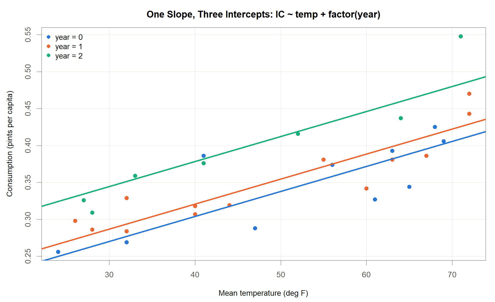

<!-- Date: 2026-08-26 | Purpose: chapter 7 of the KINS regression lecture, split from regression-lecture-note.qmd. Generated by code/agent/2026-08-26/split-chapters.py - edit the master, not this file. | File: 07-dummy-variable.qmd -->

# Dummy Variable

::: notes
마지막 방법론 장입니다. 지금까지 모형에 넣은 설명변수는 온도, 가격, 소득처럼 전부 숫자였습니다. 그런데 현장 자료를 떠올려 보십시오. 계측기가 어느 제조사 제품인지, 설비가 운전 중인지 정지 중인지, 시험편이 용접재인지 판재인지. 숫자가 아닌 정보가 오히려 더 많습니다. 이번 장에서는 이런 정보를 회귀모형에 넣는 방법을 배웁니다. 방법 자체는 허무할 만큼 단순합니다. 전등 스위치처럼 켜면 1, 끄면 0인 변수를 새로 만들면 됩니다. 다만 스위치를 몇 개 만들어야 하는지, 왜 하나를 일부러 빼야 하는지에 함정이 하나 숨어 있습니다. 오늘은 그 부분을 특히 꼼꼼히 보겠습니다. 그리고 앞 장까지 남겨 두었던 아이스크림 자료의 마지막 변수를 드디어 쓰게 됩니다.
:::

## 질적 설명변수의 처리

### <i class="fa-solid fa-lightbulb"></i> Introduction 장 복습: 변수의 유형

::: {.callout-note appearance="minimal"}
<i class="fa-solid fa-link"></i> **앞 장에서 여기까지**: 관측별 신뢰도를 가중치로 반영. <i class="fa-solid fa-circle-question"></i> **이 장의 질문**: 숫자가 아닌 범주 정보를 설계행렬에 어떻게 넣는가
:::

::: {.callout-tip appearance="minimal"}
<i class="fa-solid fa-table"></i> **Types of variables**

<ul>
<li>양적 변수(quantitative): 온도, 가격, 소득처럼 수치로 측정되어 크기와 간격이 정의되는 변수</li>
<li>질적 변수(qualitative): 관측 연차, 계측기 제조사, 운전/정지 상태, 제품 형태처럼 범주로만 구분되는 변수</li>
<li>회귀분석에서 <b>반응변수는 양적 변수</b>, <b>설명변수는 양적과 질적 모두 가능</b></li>
</ul>
:::

### <i class="fa-solid fa-question"></i> 질문

> 질적 변수의 범주에는 덧셈과 곱셈이 정의되지 않는다. 이 정보를 어떻게 $\mathbf y=\mathbf X\boldsymbol\beta+\boldsymbol\varepsilon$의 설계행렬 $\mathbf X$의 열로 만들 것인가?

여기서 $\mathbf X$: 절편열을 포함한 $n\times(p+1)$ 설계행렬, $n$: 관측 수, $p$: 설명변수의 개수. $\mathbf X$ 의 원소는 모두 숫자여야 하므로 범주 이름을 그대로 넣을 수 없음

::: notes
Introduction 장에서 변수를 두 종류로 나눴던 것을 떠올려 주십시오. 숫자로 재는 양적 변수, 종류만 나누는 질적 변수. 회귀분석에서 반응변수는 반드시 양적이어야 하지만 설명변수 쪽은 둘 다 괜찮다고 말씀드렸습니다. 그때는 질적 변수는 0과 1로 바꿔서 넣는다고 한 줄만 하고 넘어갔습니다. 오늘 그 한 줄을 펼칩니다. 문제부터 분명히 하겠습니다. 설계행렬은 숫자로 된 표입니다. 그 칸에 용접재라고 적어 넣을 수는 없습니다. 곱하고 더할 수가 없기 때문입니다. 제조사 이름을 어떻게 곱하겠습니까. 그러니 질문은 이렇게 정리됩니다. 범주라는 정보를 어떻게 숫자 열로 바꿔 담을 것인가.
:::

## 가변수의 정의

### <i class="fa-solid fa-bullseye"></i> 정의

> **가변수(dummy variable, indicator variable)**: 질적 설명변수의 특정 범주에 대해
> $$
> d_i=\begin{cases} 1, & i\text{번째 관측이 그 범주에 속할 때}\\\ 0, & \text{그 외}\end{cases}
> $$
> 로 정의되는 0/1 지시변수.

여기서 $d_i$: $i$번째 관측이 그 범주에 속하는지를 나타내는 값($i=1,\dots,n$). 값이 0 또는 1인 숫자이므로 설계행렬 $\mathbf X$ 의 한 열이 될 수 있음

### <i class="fa-solid fa-lightbulb"></i> 핵심

::: {.callout-tip appearance="minimal"}
<ul>
<li>범주 자체를 수치화하는 것이 아니라, <b>범주에 속하는지 여부</b>를 0과 1로 기록</li>
<li>가변수가 들어간 모형도 여전히 $\mathbf y=\mathbf X\boldsymbol\beta+\boldsymbol\varepsilon$ 형태의 선형모형. 추정과 검정 절차는 앞 장과 동일</li>
</ul>
:::

::: notes
해결책은 의외로 단순합니다. 방마다 달린 전등 스위치를 떠올려 보십시오. 해당하면 켜서 1, 아니면 꺼서 0. 이렇게 만든 변수를 가변수, 영어로 더미 변수라고 부릅니다. 여기서 중요한 것은 범주에 번호를 매기는 작업이 아니라는 점입니다. 용접재를 1, 판재를 2, 단조재를 3으로 적는 것이 아닙니다. 그 문제는 뒤에서 다시 이야기하겠습니다. 지금은 속하느냐 마느냐만 기록한다는 것, 그것만 잡아 주십시오. 한 가지 안심하실 점이 있습니다. 스위치를 넣었다고 해서 새로운 이론이 필요하지는 않습니다. 열 하나가 늘어난 것뿐이니, 지금까지 배운 최소제곱법이 그대로 돌아갑니다.
:::

## 예제 자료: ice cream의 관측 연차 {.smaller}

### <i class="fa-solid fa-table"></i> 자료 구조

| period | IC | price | income | temp | year |
|---:|---:|---:|---:|---:|---:|
| 1 | 0.386 | 0.270 | 78 | 41 | 0 |
| 2 | 0.374 | 0.282 | 79 | 56 | 0 |
| 3 | 0.393 | 0.277 | 81 | 63 | 0 |
| 4 | 0.425 | 0.280 | 80 | 68 | 0 |
| 5 | 0.406 | 0.272 | 76 | 69 | 0 |

: First 5 rows of the ice cream data. n = 30 four-week periods, 6 variables.

### <i class="fa-solid fa-lightbulb"></i> 핵심

::: {.callout-tip appearance="minimal"}
<ul>
<li><code>year</code>는 0/1/2 값을 가지는 <b>관측 연차</b>, 곧 몇 년째 기록인지를 나타내는 질적 변수. 계절 구분이 아님</li>
<li>앞 장까지는 <code>price</code>, <code>income</code>, <code>temp</code>만 사용하고 <code>year</code>는 보류</li>
<li><code>year</code>의 범주 수는 $k=3$</li>
</ul>
:::

::: notes
자료를 다시 꺼내 보겠습니다. 4주를 한 기간으로 묶어서 총 서른 개 기간, 변수는 여섯 개입니다. 화면에는 앞 다섯 줄만 실었습니다. 맨 왼쪽 period는 몇 번째 기간인지를 적은 번호이고, 그다음 소비량, 가격, 소득, 온도가 이어집니다. 여기까지는 앞 장에서 쓰던 그대로입니다. 오늘의 주인공은 맨 오른쪽 year입니다. 값이 0, 1, 2로 들어 있는데 이것을 계절 표시로 오해하시면 안 됩니다. 몇 년째 기록인지, 곧 관측 연차입니다. 0이 1년차, 1이 2년차, 2가 3년차. 앞 다섯 줄이 전부 0인 이유는 처음 다섯 기간이 모두 첫해 기록이기 때문입니다. 여기서 자연스러운 질문이 하나 나옵니다. 0, 1, 2면 이미 숫자인데 그냥 넣으면 안 되는가. 좋은 질문이고, 답은 잠시 뒤에 하겠습니다.
:::

## 가변수 코딩: 범주 $k$개에 가변수 $k-1$개

### <i class="fa-solid fa-table"></i> 코딩 규칙

| year (observation year) | $d_{i1}$ | $d_{i2}$ |
|:-------------:|:--------:|:--------:|
| 0 (baseline)  | 0        | 0        |
| 1             | 1        | 0        |
| 2             | 0        | 1        |

: Dummy coding for the observation year. k = 3 categories require only k - 1 = 2 indicator columns.

여기서 $d_{i1}$: 관측 연차가 year = 1이면 1, 아니면 0인 가변수, $d_{i2}$: 관측 연차가 year = 2이면 1, 아니면 0인 가변수

### <i class="fa-solid fa-lightbulb"></i> 핵심

::: {.callout-tip appearance="minimal"}
<ul>
<li>범주가 $k$개면 가변수는 $k-1$개. <code>year</code>는 $k=3$이므로 가변수 2개로 충분</li>
<li>모든 가변수가 0인 상태가 <b>기준 범주</b>(baseline, 여기서는 year = 0)이며, 그 수준은 절편 $\beta_0$ 가 담당</li>
</ul>
:::

::: notes
표를 보겠습니다. 연차는 세 가지인데 스위치는 두 개뿐입니다. year가 1이면 첫 번째 스위치만 켜지고, 2면 두 번째만 켜집니다. 0이면 둘 다 꺼집니다. 그러면 0은 어디로 갔는가. 사라진 것이 아닙니다. 둘 다 꺼진 상태가 곧 0이라는 정보입니다. 두 개만 보고도 세 가지를 완벽하게 구분할 수 있습니다. 이 기준 범주의 평균 수준은 절편이 대신 맡아 줍니다. 이제 앞에서 미뤄 둔 질문에 답하겠습니다. 0, 1, 2를 숫자 하나로 그냥 넣으면 어떻게 될까요. 1년차에서 2년차로 갈 때의 효과와 2년차에서 3년차로 갈 때의 효과가 정확히 같다고 못을 박아 버리는 셈이 됩니다. 그럴 이유가 있습니까. 없습니다. 가변수를 쓰면 각 연차의 효과를 각자 알아서 추정하게 둘 수 있습니다. 훨씬 자유롭습니다.
:::

## 가변수 코딩: dummy trap {.smaller}

### <i class="fa-solid fa-triangle-exclamation"></i> 가변수를 $k$개 모두 넣으면

::: {.callout-note appearance="minimal"}
<i class="fa-solid fa-pen-to-square"></i> **유도**

범주 수만큼 가변수를 만들어 year = 0을 나타내는 $d_{i0}$까지 설계행렬에 넣으면, 모든 관측에서

$$
d_{i0}+d_{i1}+d_{i2}=1,\qquad i=1,\dots,n
$$

가 항상 성립. 여기서 $d_{i0}$: year = 0이면 1, 아니면 0인(실제로는 만들지 않는) 세 번째 가변수. 우변의 1은 절편에 대응하는 열, 곧 모든 원소가 1인 $\mathbf X$ 의 첫 열과 동일. 한 열이 다른 열들의 합으로 그대로 재현되므로 **완전 공선성**(설명변수 열 사이에 정확한 선형 관계가 성립하는 상태)이 발생. 이때 $\mathbf X^\top\mathbf X$ 의 역행렬이 존재하지 않아 최소제곱해가 유일하게 결정되지 않으며, 이를 dummy trap이라 부름
:::

### <i class="fa-solid fa-screwdriver-wrench"></i> 해결: 기준범주를 절편에 흡수

$d_{i0}$ 을 만들지 않고 빼면 열 사이의 선형관계가 사라져 $\mathbf X^\top\mathbf X$ 의 역행렬이 존재

$$
\mathbf X=\big[\;\underbrace{\mathbf 1}_{\text{절편}}\;\;\underbrace{\mathbf x}_{\text{temp}}\;\;\underbrace{\mathbf d_1\;\;\mathbf d_2}_{k-1=2\,\text{개}}\;\big]_{30\times 4},
\qquad \operatorname{rank}(\mathbf X)=4
$$

빠진 범주 year = 0 은 사라진 것이 아니라 절편 $\beta_0$ 이 대신 나타냄. 그래서 이 범주를 **기준범주(baseline)** 라 부름

::: notes
스위치를 범주 수만큼, 그러니까 세 개를 다 만들면 문제가 생깁니다. 세 스위치를 더해 보십시오. 어느 관측에서나 정확히 1이 됩니다. 셋 중 하나는 반드시 켜져 있기 때문입니다. 그런데 절편이 쓰는 열도 전부 1로 채워진 열입니다. 두 개가 완전히 겹칩니다. 앞에서 다중공선성을 배울 때 나왔던 상황인데, 여기서는 정도가 아니라 아예 완벽하게 겹칩니다. 열 하나가 다른 열들의 합으로 그대로 만들어지면 최소제곱법은 답을 하나로 정하지 못합니다. 무한히 많은 답이 전부 똑같이 잘 맞기 때문입니다. 이 함정을 dummy trap이라고 부릅니다. 피하는 법은 단순합니다. 스위치 하나를 일부러 빼고 그 자리를 절편에게 맡기면 됩니다. 아래 상자가 그렇게 고친 설계행렬입니다. 열이 네 개이고 계수도 네 개, 어느 열도 다른 열들의 합으로 만들어지지 않습니다. 빠진 범주는 사라진 것이 아닙니다. 절편이 그 자리를 대신합니다. 그래서 이 범주를 기준범주라고 부릅니다. 왜 하나가 빠져 있는지를 아셔야 결과 표가 제대로 읽힙니다.
:::

## 평행선 모형: 정의

### <i class="fa-solid fa-bullseye"></i> 기울기는 공통, 절편만 이동

:::: {.columns}

::: {.column width="56%"}

$$
y_i = \beta_0 + \beta_1 x_i + \beta_2 d_{i1} + \beta_3 d_{i2} + \varepsilon_i
$$

**기호**

<ul>
<li>$y_i$: $i$번째 기간의 아이스크림 소비량(IC), $x_i$: 온도(temp)</li>
<li>$d_{i1}, d_{i2}$: 관측 연차가 각각 year = 1, year = 2일 때 1이 되는 가변수</li>
<li>$\beta_0$: 기준 연차(year = 0)의 절편, $\beta_1$: 세 연차가 공유하는 온도의 기울기</li>
<li>$\beta_2, \beta_3$: 기준 연차 대비 절편의 차이, $\varepsilon_i$: 평균 0, 분산 $\sigma^2$ 인 오차</li>
</ul>

:::

::: {.column width="44%"}

{width=100%}

:::

::::

::: {.aside}
Kutner, Nachtsheim, Neter & Li (2005), *Applied Linear Statistical Models*, 5th ed., McGraw-Hill.
:::

::: notes
그림부터 보겠습니다. 색이 다른 점 세 무리가 각각 세 관측 연차의 자료입니다. 직선도 세 개인데 기울기가 전부 똑같아서 나란히 평행합니다. 수식과 맞춰 보겠습니다. 온도 앞에 붙은 기울기 베타1은 하나뿐입니다. 연차 스위치가 켜질 때마다 베타2나 베타3만큼 직선이 통째로 위아래로 옮겨 갈 뿐입니다. 그래서 평행선 모형이라고 부릅니다. 계측기 검교정으로 비유해 보겠습니다. 제조사마다 영점은 조금씩 다른데 감도는 같은 상황입니다. 눈금이 시작하는 자리만 다르고, 한 눈금이 뜻하는 크기는 동일합니다. 세 직선의 기울기가 정말 같다고 봐도 되는가. 당연히 나올 질문입니다. 그것이 이 모형이 세운 가정입니다. 의심스러우면 잠시 뒤에 배울 상호작용 항으로 기울기까지 풀어 줄 수 있습니다.
:::

## 평행선 모형: 연차별 반응함수

### <i class="fa-solid fa-bullseye"></i> 조건부 기댓값으로 다시 쓰면

> 회귀를 조건부 기댓값 $E(Y\mid X=x)$로 정의하였으므로, 가변수를 포함한 모형도 연차별 조건부 기댓값으로 읽는다.
>
> $$
> \begin{aligned}
> E(y_i \mid x_i,\ \text{year}=0) &= \beta_0 + \beta_1 x_i\\
> E(y_i \mid x_i,\ \text{year}=1) &= (\beta_0+\beta_2) + \beta_1 x_i\\
> E(y_i \mid x_i,\ \text{year}=2) &= (\beta_0+\beta_3) + \beta_1 x_i
> \end{aligned}
> $$

### <i class="fa-solid fa-lightbulb"></i> 핵심

::: {.callout-tip appearance="minimal"}
<ul>
<li>연차별 절편: year = 0은 $\beta_0$, year = 1은 $\beta_0+\beta_2$, year = 2는 $\beta_0+\beta_3$</li>
<li>기울기 $\beta_1$ 은 세 연차가 공통이므로, 가변수는 직선을 <b>위아래로 평행이동</b>만 시킴</li>
<li>$\beta_2$ = 온도를 같은 값으로 고정했을 때 year = 1과 year = 0의 평균 소비량 차이</li>
</ul>
:::

::: notes
같은 모형을 조건부 기댓값으로 다시 써 보겠습니다. 회귀란 X가 주어졌을 때 Y의 평균을 알아내는 일이라고 처음에 말씀드렸습니다. 가변수가 들어가도 달라질 것은 없습니다. 스위치가 다 꺼진 기준 연차에서는 평균이 베타0 더하기 베타1 곱하기 온도입니다. 첫 번째 스위치가 켜지면 어떻게 되는가. 앞의 상수항만 베타2만큼 올라가고 온도 앞의 계수는 그대로입니다. 세 줄을 나란히 놓고 보십시오. 괄호 안의 상수항만 다르고 온도 항은 완전히 똑같습니다. 세 직선이 평행한 이유가 여기 있습니다. 그래서 베타2와 베타3을 읽을 때는 반드시 온도를 같은 값으로 고정했을 때라는 단서를 붙여야 합니다. 그 단서를 빼면 해석이 틀립니다.
:::

## 평행선 모형: 적합 결과

### <i class="fa-solid fa-bullseye"></i> 추정한 모형

$$
y_i=\beta_0+\beta_1 x_i+\beta_2 d_{i1}+\beta_3 d_{i2}+\varepsilon_i,\qquad i=1,\dots,30
$$

여기서 $x_i$: temp, $d_{i1}$: year = 1이면 1 아니면 0, $d_{i2}$: year = 2이면 1 아니면 0. 추정할 계수는 네 개

### <i class="fa-solid fa-table"></i> 결과

| Term | Estimate | p-value |
|:--|---------:|--------:|
| $\hat\beta_0$ (intercept, year = 0) | 0.169 | n.a. |
| $\hat\beta_1$ (temp) | 0.00339 | 1.0e-09 |
| $\hat\beta_2$ ($d_1$: year = 1) | 0.0165 | 0.232 |
| $\hat\beta_3$ ($d_2$: year = 2) | 0.0743 | 8.2e-05 |

: Coefficients of the parallel-lines model. R-squared = 0.790, adjusted R-squared = 0.765, n = 30.

p-value = 해당 계수가 실제로는 0이라고 가정했을 때 지금 얻은 것만큼 큰 계수가 우연히 나올 확률. 작을수록 계수가 0이 아니라는 근거가 강함

::: notes
위쪽에 추정한 모형을 적어 두었습니다. 앞 장의 단순회귀에 항이 두 개 붙었을 뿐이고, 붙은 항은 스위치 두 개입니다. 추정할 계수는 네 개입니다. 표의 이름부터 읽어 보겠습니다. 베타2가 우리가 d1이라 부른 스위치의 계수, 베타3이 d2의 계수입니다. year = 0 줄은 표에 따로 없습니다. 사라진 것이 아니라 절편 안으로 흡수되었습니다. 결과 표에서 기준 범주를 찾으실 때는 절편 줄을 보시면 됩니다. p값의 뜻은 아래 한 줄에 다시 적어 두었습니다. 계수가 진짜로 0인데도 우연히 이만큼 큰 값이 나올 확률입니다. 이 확률이 아주 작으면 우연이라고 보기 어렵다고 판단합니다. 숫자 해석은 다음 화면에서 하나씩 하겠습니다.
:::

## 평행선 모형: 결과 해석 {.smaller}

### <i class="fa-solid fa-lightbulb"></i> 온도를 고정해도 관측 연차 효과가 남는다

::: {.callout-tip appearance="minimal"}
<ul>
<li>온도의 기울기 0.00339는 세 연차 공통. $p = 1.0\times10^{-9}$ 로 매우 유의</li>
<li>같은 온도에서 3년차(year = 2)의 평균 소비량은 1년차(year = 0)보다 <b>0.0743 높음</b> ($p = 8.2\times10^{-5}$)</li>
<li>2년차(year = 1)의 차이 0.0165는 $p = 0.232$. 1년차와 다르다고 보기 어려움</li>
<li>연차별 절편: year = 0은 $\hat\beta_0=0.169$, year = 1은 $\hat\beta_0+\hat\beta_2=0.185$, year = 2는 $\hat\beta_0+\hat\beta_3=0.243$</li>
<li>온도만 사용한 단순회귀의 $R^2 = 0.602$에서 가변수 추가 후 $R^2 = 0.790$으로 상승 (adj. $R^2 = 0.765$)</li>
</ul>
:::

::: notes
계수를 하나씩 읽어 보겠습니다. 온도 기울기는 0.00339, p값이 10의 마이너스 9제곱 수준이니 여전히 압도적으로 유의합니다. 다음이 이 장의 핵심입니다. 3년차 스위치 계수가 플러스 0.0743이고 p값이 0.0001보다 작습니다. 같은 온도인데도 3년차에는 평균 소비가 그만큼 높다는 뜻입니다. 날씨 탓이 아니라 시간이 지나면서 소비 수준 자체가 올라갔습니다. 온도를 고정했는데도 남는 차이이기 때문입니다. 반면 2년차의 플러스 0.0165는 p값이 0.232라서 첫해와 다르다고 말하기 어렵습니다. 절편은 기준 연차에 각 스위치 계수를 더하면 됩니다. 1년차 0.169, 2년차 0.185, 3년차 0.243입니다. 그림의 세 직선이 정확히 이 높이에 있습니다. 결정계수도 0.602에서 0.790으로 꽤 올랐습니다. 2년차가 유의하지 않으니 그 스위치만 빼면 되지 않느냐고 물으실 수 있습니다. 보통은 한 범주형 변수에 딸린 스위치들을 한 묶음으로 넣거나 뺍니다. 묶음 전체가 도움이 되는지는 F 검정이라는 방법으로 한꺼번에 판단합니다.
:::

## 상호작용 모형: 기울기까지 달라지는 경우

### <i class="fa-solid fa-triangle-exclamation"></i> 주의: 평행선 모형의 숨은 가정

> 평행선 모형은 관측 연차가 **절편만** 바꾼다고 가정한다. 온도에 대한 민감도, 즉 기울기는 세 연차가 동일하다고 강제한다.

### <i class="fa-solid fa-bullseye"></i> 상호작용 모형

$$
y_i = \beta_0 + \beta_1 x_i + \beta_2 d_{i1} + \beta_3 d_{i2} + \beta_4 x_i d_{i1} + \beta_5 x_i d_{i2} + \varepsilon_i
$$

여기서 $x_i d_{i1}$, $x_i d_{i2}$: 온도와 연차 가변수를 곱한 상호작용 항, $\beta_4, \beta_5$: year = 1, year = 2에서 기울기가 기준 연차보다 달라지는 양. 나머지 기호는 앞 슬라이드와 동일

::: notes
한 걸음만 더 나가 보겠습니다. 평행선 모형은 연차가 절편만 바꾼다고 가정했습니다. 그런데 온도에 대한 민감도 자체가 해마다 다를 수도 있지 않을까요. 어떤 해에는 기온이 1도 오를 때 소비가 더 가파르게 늘 수도 있습니다. 그럴 때는 온도와 스위치를 곱한 항을 추가합니다. 이것을 상호작용 항이라고 부릅니다. 곱한다는 말이 낯설게 들리시면 이렇게 생각해 보십시오. 스위치가 꺼져 있으면 0을 곱한 것이라 그 항은 통째로 사라집니다. 켜져 있으면 온도가 그대로 살아나서 기울기에 얹힙니다. 스위치가 켜지는 순간 절편은 베타2만큼, 기울기는 베타4만큼 함께 달라집니다.
:::

## 상호작용 모형: 연차별 직선의 분리

### <i class="fa-solid fa-pen-to-square"></i> 가변수에 0과 1을 대입

::: {.callout-note appearance="minimal"}
가변수에 0과 1을 대입하면 연차별 회귀직선이 분리됨

$$
\begin{aligned}
\text{year}=0:\quad & y_i = \beta_0 + \beta_1 x_i + \varepsilon_i\\
\text{year}=1:\quad & y_i = (\beta_0+\beta_2) + (\beta_1+\beta_4) x_i + \varepsilon_i\\
\text{year}=2:\quad & y_i = (\beta_0+\beta_3) + (\beta_1+\beta_5) x_i + \varepsilon_i
\end{aligned}
$$

year = 1의 기울기는 $\beta_1+\beta_4$. 절편뿐 아니라 기울기까지 연차별로 달라지므로 세 직선은 더 이상 평행하지 않음
:::

### <i class="fa-solid fa-bullseye"></i> 상호작용항을 포함한 모형식

$$
y_i=\beta_0+\beta_1 x_i+\beta_2 d_{i1}+\beta_3 d_{i2}
+\beta_4\,(x_i d_{i1})+\beta_5\,(x_i d_{i2})+\varepsilon_i
$$

여기서 $x_i d_{i1}$, $x_i d_{i2}$: 설명변수와 가변수를 곱해 만든 **상호작용항**. 추정할 계수가 평행선 모형의 4개에서 6개로 늘어남

::: notes
가변수에 0과 1을 대입해서 세 연차의 식을 각각 써 보면 무슨 일이 벌어지는지 분명해집니다. 기준 연차는 원래 식 그대로입니다. 스위치가 켜진 연차는 절편에 베타2가 더해지는 동시에 온도 앞의 계수에도 베타4가 더해집니다. 이제 세 직선은 평행하지 않습니다. 앞의 검교정 비유로 돌아가면, 영점만 다르면 평행선 모형이고 감도까지 다르면 상호작용 모형입니다. 아래 상자의 모형식을 보십시오. 새로 붙은 두 항은 온도와 스위치를 그냥 곱한 것입니다. 스위치가 꺼져 있으면 0이 곱해져 사라지고, 켜져 있을 때만 온도 앞의 계수에 더해집니다. 추정할 계수는 네 개에서 여섯 개로 늘어납니다. 오늘은 개념까지만 보겠습니다. 그러면 상호작용을 항상 넣는 편이 낫지 않느냐. 그렇지는 않습니다. 추정할 계수가 늘어나면 지금 있는 자료에는 잘 맞지만 새 자료에는 오히려 못 맞는 일이 생깁니다. 과적합이라고 부르는 현상입니다. 필요한지 아닌지는 계수의 유의성과 앞 장에서 배운 AIC 같은 기준으로 판단하시면 됩니다.
:::

## 실무 적용: 원자로압력용기 조사취화 예측식 {.smaller}

### <i class="fa-solid fa-screwdriver-wrench"></i> ASTM E900-15

::: {.callout-tip appearance="minimal"}
<i class="fa-solid fa-table"></i> **Variables in the ASTM E900-15 embrittlement trend curve**

<ul>
<li>반응변수: 중성자 조사에 따른 샤르피 41 J 천이온도 변화량(transition temperature shift, TTS)</li>
<li>양적 설명변수: 구리, 니켈, 인, 망간 함량, 중성자 조사량(fluence)과 조사율(flux), 조사 온도</li>
<li><b>질적 설명변수: 제품 형태(용접재, 판재, 단조재)를 지시변수로 투입</b></li>
</ul>
:::

::: {.callout-tip appearance="minimal"}
<ul>
<li>자료: 상용 원전 감시시험 1878건(13개국 감시시험 프로그램)</li>
<li>방법: 최대가능도로 26개 모수를 적합. 적합도 RMSE 13.3 °C, 결정계수 $R^2 = 0.875$</li>
<li>이 장의 코딩 규칙 그대로: 제품 형태가 $k$개 범주이면 지시변수는 $k-1$개, 나머지 한 범주는 기준</li>
<li>지시변수 계수는 조성과 조사 조건을 고정했을 때 제품 형태에 따른 TTS의 평균 차이로 해석</li>
</ul>
:::

::: {.aside}
ASTM E900-21e1. / *Metals* 12(3), 481 (2022), doi:10.3390/met12030481.
:::

::: notes
Introduction 장 첫머리에서 보여 드린 조사취화 예측식으로 돌아가겠습니다. 그때는 제품 형태를 지시변수로 넣는다고만 하고 넘어갔습니다. 이제 그 문장이 무슨 뜻인지 정확히 아실 것입니다. 구리, 니켈, 인, 망간 함량에 조사량과 조사 온도까지, 여기까지는 전부 숫자입니다. 그런데 용접재냐 판재냐 단조재냐는 숫자가 아닙니다. 오늘 배운 그대로 스위치로 바꿔서 넣었습니다. 범주가 셋이면 스위치는 둘, 남은 하나는 기준이 되어 상수항에 흡수됩니다. 계수를 읽는 법도 똑같습니다. 조성과 조사 조건을 전부 같은 값으로 고정했을 때, 판재와 용접재의 천이온도 상승이 평균 몇 도나 차이 나는가. 이렇게 읽으시면 됩니다. 감시시험 1878건에 적합해서 결정계수 0.875를 얻은 식입니다. 여러분이 현장에서 쓰시는 이 식 안에 오늘 배운 가변수가 들어 있습니다.
:::

## 이 장의 정리

### <i class="fa-solid fa-list-check"></i> Dummy Variable

> **한 줄 요약**: 범주 정보는 0/1 가변수 $k-1$개로 모형에 들어간다. 가변수는 절편을 바꾸고(평행선 모형), $x$와 곱해 넣으면 기울기까지 바꾼다(상호작용 모형).

::: {.callout-tip appearance="minimal"}
<ul>
<li>질적 설명변수 $\rightarrow$ 가변수 $k-1$개 $\rightarrow$ 설계행렬 $\mathbf X$ 의 열. 회귀분석 8단계 중 4단계(모형 설정)의 확장</li>
<li>기준 범주는 절편 $\beta_0$ 가 담당. 가변수를 $k$개 모두 넣으면 완전 공선성으로 dummy trap</li>
<li>가변수 계수는 다른 설명변수를 고정했을 때의 조건부 기댓값 차이로 해석</li>
<li>ice cream 자료: 온도를 고정해도 3년차는 1년차보다 평균 소비가 0.0743 높음</li>
</ul>
:::

::: {.callout-note appearance="minimal"}
<i class="fa-solid fa-link"></i> **다음 장**: Summary: 여덟 장을 관통한 공식과 기호를 한자리에 모으고, 현장에서 사용할 실무 체크리스트로 정리
:::

::: notes
이 장의 요약입니다. 범주는 가변수 k 빼기 1개로 모형에 들어가고, 그 가변수가 범주별 차이를 절편에서, 필요하면 기울기에서까지 표현합니다. 기억하실 것은 두 가지입니다. 기준 범주의 몫은 절편이 대신 맡고 있다는 것, 그리고 스위치를 범주 수만큼 다 넣으면 dummy trap에 빠진다는 것. 이 둘만 잡고 계시면 결과 표를 잘못 읽는 일은 없습니다. 계수 해석은 언제나 같은 문장 틀로 하시면 됩니다. 다른 설명변수를 같은 값으로 고정했을 때의 평균 차이. 아이스크림 자료에서는 온도가 같아도 3년차가 첫해보다 0.0743 높았습니다. 계측기 제조사, 운전 상태, 시험 로트, 방금 본 제품 형태까지. 여러분 현장의 범주 정보 대부분에 오늘 배운 내용이 그대로 쓰입니다.
:::

## 참고문헌 {.smaller}

### <i class="fa-solid fa-book"></i> 이 장에서 인용한 문헌

::: {.callout-tip appearance="minimal"}
<ul>
<li>ASTM E900-21e1. <em>Standard Guide for Predicting Radiation-Induced Transition Temperature Shift in Reactor Vessel Materials</em>. ASTM International.</li>
<li><em>Metals</em>, 12(3), 481 (2022). doi:10.3390/met12030481</li>
<li>Kutner, M. H., et al. (2005). <em>Applied Linear Statistical Models</em>, 5th ed. McGraw-Hill. (가변수 코딩)</li>
</ul>
:::

### <i class="fa-solid fa-atom"></i> 교과서

::: {.callout-tip appearance="minimal"}
<ul>
<li>Kutner, M. H., Nachtsheim, C. J., Neter, J., &amp; Li, W. (2005). <em>Applied Linear Statistical Models</em>, 5th ed. McGraw-Hill.</li>
<li>Faraway, J. J. (2015). <em>Linear Models with R</em>, 2nd ed. CRC Press.</li>
</ul>
:::

