## 배경

<!--
Date: 2026-07-02 (rev. 2026-07-06)
Summary: Quarto revealjs presentation (21 slides, Korean) on radial artery pulse
         wave responses to sub-maximal treadmill walking across obesity
         phenotypes (Control / Gynoid / Android) in premenopausal women.
         Internal research briefing. Static deck: pure markdown + embedded PNG
         figures, no executable code chunks. Four interaction-confirmed findings
         (H4, PTI20, PTI30, PDI) are visually distinguished from
         hypothesis-generating descriptive patterns (HRV, rAIx@75, PTI50-90,
         OAP/PPI). No author/affiliation lines; Q&A slide removed.
Revision 2026-07-06:
  (1) 대상자 특성 slide reframed so the BMI overall p<0.001 is attributed to the
      normal-weight control (BMI 21.0), while the two obesity groups have
      comparable total adiposity (BMI/weight/hip pairwise NS; Android vs Gynoid
      BMI p=0.71) and differ only in fat distribution (WHR/WC p<0.001).
  (2) Cohen's d effect-size figures replaced by "estimated change from baseline"
      figures in ORIGINAL units (%, mm, s, ...), matching the manuscript results
      tables and the slide text, to avoid text-vs-figure misinterpretation.
      New PNGs (fig-hrv-change, fig-h4-change, fig-pdi-change, fig-pti-change-all,
      fig-pti-change-2030) are produced by
      code/agent_bot/2026-07-06/generate-presentation-change-figures.R directly
      from the stored LME within-group contrasts.
Revision 2026-07-07:
  (3) PTI overview ("PTI 패턴 확인") figure reverted to the MANUSCRIPT's own PTI
      bar chart (fig-pti-changes-barplot-1.png, within-group change, all
      thresholds) so the Control-up / Android-down direction pattern reads at a
      glance.
  (4) All between-group differences now lead with the mean difference of change
      (MD) + 95% CI + p-value (primary) and show Cohen's d only as an explicitly
      labelled auxiliary "효과크기"; the 통계 분석 slide states up front that d is a
      standardized effect size, not a raw difference. MD/CI/p/d values come from
      lme_result$contrast_OBESTYPE2 (AFTER stage, Tukey-adjusted p).
  (5) Punctuation cleanup: spaced middle-dot separators ( · ) between distinct
      facts and em dashes removed from prose; multi-fact lists converted to
      itemized bullets (개조식) or commas. Connecting 가운뎃점 within compound terms
      (NN·RMSSD, 크기·시점) kept; table N/A em-dash placeholders kept (Lancet style).
File name: radial-pulse-obesity-presentation.qmd
-->

::: {.highlight-box}
같은 BMI라도 지방의 분포 위치(상체 또는 하체)에 따라 심혈관 위험이 다르게 나타남.
:::

::: {.columns}
::: {.column width="50%"}
::: {.card .andr-bg .phenotype-card}
<div class="ptype-head"><span class="andr">Android</span><svg class="fruit-icon" viewBox="0 0 44 46" aria-hidden="true"><path d="M22 10 C13 10 7 17 8 26 C9 34 15 44 22 44 C29 44 35 34 36 26 C37 17 31 10 22 10 Z" fill="#F21A00"/><path d="M22 12 C22 12 20 6 25 4 C30 2 33 5 33 5 C33 5 31 12 25 12 C24 12 23 12 22 12 Z" fill="#3AA24A"/><rect x="20.5" y="4" width="3" height="9" rx="1.5" fill="#7A3B12"/></svg></div>
<div class="ptype-sub">Apple type, 상체(복부·내장) 지방</div>

<div class="body-fig"></div>

높은 WHR, 대사·심혈관 위험이 높은 편
:::
:::
::: {.column width="50%"}
::: {.card .gyn-bg .phenotype-card}
<div class="ptype-head"><span class="gyn">Gynoid</span><svg class="fruit-icon" viewBox="0 0 44 48" aria-hidden="true"><path d="M22 14 C18 14 16 18 17.5 22 C11 27 9 35 14 41 C18 46 26 46 30 41 C35 35 33 27 26.5 22 C28 18 26 14 22 14 Z" fill="#B7960B"/><path d="M22 15 C22 15 21 9 26 8 C30 7 32 9 32 9 C32 9 30 15 25 15 C24 15 23 15 22 15 Z" fill="#3AA24A"/><rect x="20.5" y="7" width="3" height="9" rx="1.5" fill="#7A3B12"/></svg></div>
<div class="ptype-sub">Pear type, 하체(둔부·대퇴) 지방</div>

<div class="body-fig"></div>

낮은 WHR, 상대적으로 위험이 낮은 편
:::
:::
:::

- 안정 시 측정만으로는 두 표현형의 혈관 기능 차이가 잘 드러나지 않을 수 있음
- 운동 부하 후 요골 맥파 특징과 심박변이도(HRV)를 동시에 관찰

::: {.notes}

비만은 보통 체중이나 BMI, 그러니까 지방의 '양'으로 정의됩니다. 그런데 지방이 몸의 어디에 쌓이는지, 그 '위치'가 오히려 더 중요할 수 있습니다. 새삼스러운 관점도 아닌 것이, 이미 오래전 Vague의 연구까지 거슬러 올라가는 이야기입니다. 화면 왼쪽 사과 모양이 상체, 특히 복부와 내장에 지방이 몰리는 Android형이고, 오른쪽 배 모양이 엉덩이와 대퇴 같은 하체에 지방이 쌓이는 Gynoid형입니다.

사실 본 연구는 10여년 전 맥진기 개발 과제에서 체질에 따른 비만 패턴이 맥진과 어떻게 연결될까 하는 질문에서 비롯 되었습니다. 아시다시피, 사상체질에서 태음인은 허리와 몸통이 발달한 편이라 살이 찌면 상체 중심의 Android형에 가깝고, 소음인은 상대적으로 하체가 발달해 Gynoid형에 가깝습니다. 서양 의학의 비만 표현형과 사상체질의 체형론이 이렇게 맞닿는다는 점이, 이 연구의 출발점이었습니다.


이러한 비만 표현형의 혈관 관련성은 여러 연구를 통해 확인되었습니다. 같은 정도의 비만이라도 상체 지방이 많을수록 동맥이 더 뻣뻣해지고, 내피 기능이 먼저 나빠지며, 관상동맥 석회화와 같은 구조적인 혈관손상을 야기합니다. 문제는 이런 취약성이, 특히 젊고 건강한 대상에서는 안정 시 한 번의 측정만으로 표현형 차이로 잘 드러나지 않을 수 있다는 점입니다. 게다가 이 연구가 보는 자율신경과 혈관의 반응성은 본질적으로 자극에 대한 반응이라 자극은 필수적입니다. 

그래서 가벼운 보행 운동으로 혈관에 부하를 준 다음, 그 회복 과정에서 표현형 별 요골동맥의 맥파와 심박변이도를 동시에 관찰할 수 있다면 혈관의 동적 예비 능력과 표현형별 차이를 확인할 수 있을 것이라고 판단했습니다.


:::

## 연구 질문과 가설

**질문:** 보행운동 자극 후 요골 맥파·자율신경 반응이 비만 표현형([Android]{.andr} vs [Gynoid]{.gyn})에 따라 다르게 나타날까?

- [Android]{.andr}: 자율신경·혈류역학 반응성이 둔화
- [Gynoid]{.gyn}: 중추 자율신경(교감/부교감 신경) 반응은 정상에 가깝고, 말초 반응은 표현형 고유 패턴 존재 가능
- 지방 분포와 무관하게 과체중으로 인한 공통 효과 존재 

::: {.banner .banner-hypothesis}
탐색적 임상연구: 연구 결과를 바탕으로 새로운 가설 생성 가능 확인
:::

::: {.notes}
그래서 이번 연구가 던지는 질문은 이렇습니다. 준최대 강도로 보행 운동을 시킨 뒤에, 요골 맥파와 자율신경 반응이 비만 표현형에 따라 실제로 달라지는가 하는 것입니다.

가설은 세 가지로 세웠습니다. 첫째, 중심성 지방이 많아 혈관과 자율신경에 부담이 큰 Android형은 정상 체중군보다 운동 반응이 둔해지거나 다른 양상을 보일 것이다. 둘째, Gynoid형은 상대적으로 유리한 심혈관 프로파일을 반영해 이 표현형만의 고유한 반응 패턴을 보일 것이다. 셋째, 지방 분포와 상관없이 '과체중'이라는 사실 자체로 두 비만군에 공통으로 나타나는 효과도 있을 것이다. 이렇게 세 가지입니다.

이 연구는 급성 운동에 대한 요골 맥파의 다영역 반응을 폭넓게 보는 탐색적 연구로 설계했다는 점을 감안해서 결과를 해석해 주셨으면 합니다. 
:::

<!-- ## 핵심 결과 요약 -->

<!-- interaction (stage × group)이 유의했던 지표는 4개다. -->

<!-- ::: {.tone-confirmed}
[interaction significant]{.badge .badge-confirmed}

- **H4** (절흔 높이, incisura height): **p~int~ = 0.002**, 가장 강함 · 두 비만군 모두 감소, [Control]{.ctrl}은 변화 없음
- **PTI20 / PTI30**: **p~int~ = 0.032 / 0.034** · [Control]{.ctrl} 증가 vs [Android]{.andr} 감소로 방향이 반대
- **PDI**: **p~int~ = 0.049** · [Gynoid]{.gyn}에서만 유의하게 증가 (+0.73 mm)
::: -->

<!-- ::: {.tone-hypothesis style="margin-top: 1.2em;"}
[interaction non-significant]{.badge .badge-hypothesis}

HRV 자율신경 반응 (Android 둔화), rAIx@75 dissociation 등 (interaction non-significant)
::: -->

## 연구 설계

- 관찰적 표현형 군간 비교(비무작위) + 운동 전/후 반복측정 (혼합설계 / mixed design)
- IRB WKIRB-2015/8, 2015년 9~12월 등록, 광주/전남
- 폐경 전 여성, 20~45세

```{=html}
<div style="display:flex; gap:0.9em; align-items:stretch; margin:0.4em 0;">
  <div class="card ctrl-bg" style="flex:1 1 0; min-width:0;">
    <strong><span class="ctrl">Control</span></strong> (n = 13)<br>18.5 ≤ BMI &lt; 23.0 kg/m²
  </div>
  <div class="card gyn-bg" style="flex:1 1 0; min-width:0;">
    <strong><span class="gyn">Gynoid</span></strong> (n = 14)<br>BMI ≥ 25.0 &amp; WHR &lt; 0.85
  </div>
  <div class="card andr-bg" style="flex:1 1 0; min-width:0;">
    <strong><span class="andr">Android</span></strong> (n = 15)<br>BMI ≥ 25.0 &amp; WHR ≥ 0.90
  </div>
</div>
```

::: {.highlight-box}
표현형 대비를 뚜렷하게 하려고 WHR 0.85~0.90 구간은 의도적으로 제외
:::

::: {.notes}
연구 설계는 두 축이 결합된 형태입니다. 하나는 표현형별로 나눈 군을 서로 비교하는 관찰적 군간 비교인데, 무작위 배정은 아닙니다. 다른 하나는 같은 사람에게서 운동 전과 후를 반복 측정하는 것입니다. 참고로 여기서 운동은 치료 목적의 중재가 아니라, 급성 혈류역학 반응을 끌어내기 위한 생리적 자극입니다.

2015년 9월부터 12월까지 광주·전남 지역에서 폐경 전 20세에서 45세 여성을 모집했습니다. 정상군은 BMI 18.5 이상 23 미만, Gynoid군은 BMI 25 이상이면서 WHR 0.85 미만, Android군은 BMI 25 이상이면서 WHR 0.90 이상입니다. BMI 25 기준은 WHO에서 제시한 아시아/태평양 인구집단에 적용하는 비만 분류 기준을 따랐습니다.

연구 설계 시 의도적으로 WHR 0.85에서 0.90 사이의 애매한 중간 구간은 아예 제외했습니다. 두 표현형의 대비를 최대한 선명하게 하기 위해서인데요. 다만 그만큼 일반화에 제약이 생긴다는 점은 뒤 한계에서 다시 말씀드리겠습니다.
:::

## 대상자 선정 및 분석 세트

```{=html}
<div style="display:flex; justify-content:center; align-items:center; gap:2em; padding-left:7%; margin-top:0.4em;">
  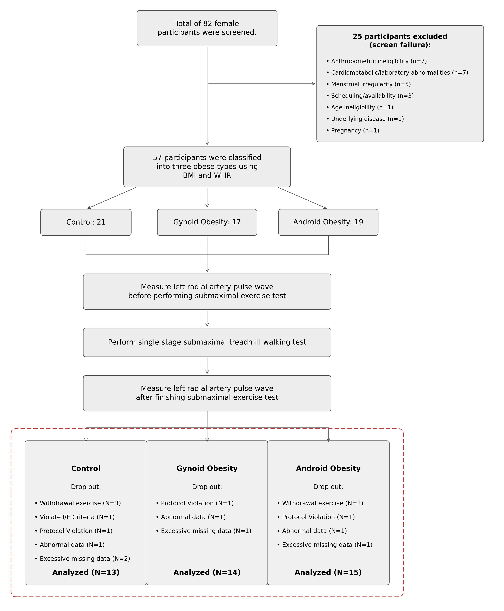
  <div style="line-height:1.5;">
    <div class="highlight-box" style="text-align:center; margin:0 0 1.1em 0;">
      <strong>Participants Flows</strong><br>82 → 57 → 42명
    </div>
    <div style="font-size:1.05em;">Final Analysis Set: <strong>42명</strong></div>
    <div style="font-size:1.05em;"><span class="ctrl">Control 13</span> / <span class="gyn">Gynoid 14</span> / <span class="andr">Android 15</span></div>
  </div>
</div>
```

::: {.notes}
임상연구에 참가를 희망한 대상자는 총 82명이었고, 신체 계측 기준에 맞지 않은 경우가 7명, 심혈관대사나 검사실 이상이 7명, 불규칙한 월경주기를 가진 경우 5명, 일정이나 참여 문제, 연령, 기저질환, 임신 같은 사유를 포함해 총 25명이 제외했고, 최종적으로 57명의 대상자가 운동부하 검사를 받았습니다. 

운동 부하 검사 후 추가적인 대상자 재외가 이루어졌는데, 이 단계에서 정상군 8명, Gynoid 3명, Android 4명이 빠졌습니다.

최종적으로 정상군 13명, Gynoid 14명, Android 15명으로 총 42명의 대상자로부텅 얻은 데이터를 분석에 활용 했습니다.
:::

## 대상자 특성

::: {.highlight-box}
두 비만군은 **총 지방량(BMI)이 유사**(27.0 vs 27.8, 두 비만군 간 p = 0.71). BMI 전체 p < 0.001은 [정상군]{.ctrl}(21.0)과의 차이에서 기인하며, **지방 분포(WHR·WC)는 뚜렷이 달라** 표현형 대비에 적합
:::

| 변수 | [Control]{.ctrl} | [Gynoid]{.gyn} | [Android]{.andr} | 전체 p | 두 비만군 간 |
|---|:--:|:--:|:--:|:--:|:--:|
| 연령·키·안정 시 BP·맥박·생활습관 | 유사 | 유사 | 유사 | [> 0.08]{.nonsig} | — |
| BMI (kg/m²) | 21.0 ± 1.4 | 27.0 ± 1.9 | 27.8 ± 3.9 | [< 0.001]{.sig} | [0.71]{.nonsig} |
| 허리둘레 WC (cm) | 72.6 ± 5.9 | 83.6 ± 6.6 | 96.0 ± 8.8 | [< 0.001]{.sig} | [< 0.001]{.sig} |
| WHR | 0.76 ± 0.05 | 0.80 ± 0.04 | 0.93 ± 0.03 | [< 0.001]{.sig} | [< 0.001]{.sig} |

- **총 지방량은 유사**: BMI·체중·엉덩이둘레 모두 두 비만군 간 유의차 없음 (Android vs Gynoid p = 0.71 / 0.73 / 0.88)
- **지방 분포는 다름**: WHR·허리둘레는 두 비만군 간에도 유의하게 차이 (모두 p < 0.001)
- 전체 p값(3군 ANOVA)은 [정상군]{.ctrl}과 두 비만군의 차이를 크게 반영

::: {.notes}

세 집단 간 baseline은 거의 동일합니다. 그리고 대조군과 다른 두 집단 간 체중, BMI, 허리둘레, WHR은 모두 유의한 차이를 보입니다. 단, 두 집단 간 BMI는 거의 동일하게 나타났기 때문에, 두 비만군의 지방 총량은 사실 상 같다고 볼 수 있습니다. 

반면 허리둘레는 83.6 대 96.0, WHR은 0.80 대 0.93로 뚜렷이 다릅니다. 두 비만군의 지방 총량을 적절히 통제했고, 따라서 두 비만군 간 차이는 지방 분포에 따른 혈관·자율신경 반응 차이로 해석할 수 있습니다.

:::

## 운동 부하 프로토콜 (single-stage sub-maximal treadmill walking test, SSTWT)

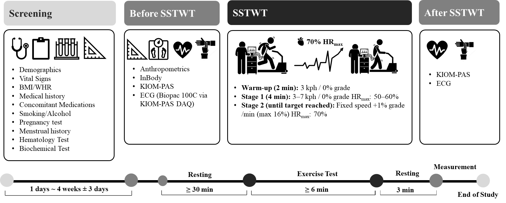{width="66%" fig-align="center" fig-alt="SSTWT protocol scheme"}

::: {.small}
- **방식**: 단일 단계 준최대 트레드밀 보행 (Ebbeling 프로토콜)
- **목표 강도**: 연령 예측 **HRmax = 211 − 0.64 × age** (Nes)
- **진행**: 준비 2분(3 kph·0%) → 1단계 4분(0%·3~7 kph·50~60% HRmax) → 2단계 경사 1%/분↑(최대 16%) → **70% HRmax** 도달
- **측정**: 운동 직전, 종료 3분 후(early recovery)
:::

::: {.notes}
운동 부하는 Ebbeling의 단일 단계 준최대 트레드밀 보행 검사를 따랐습니다. 목표는 나이로 예측한 최대 심박수의 70%까지 올리는 것이고, 그 최대 심박수는 화면의 Nes 공식, 211에서 0.64 곱하기 나이를 뺀 값으로 잡았습니다.

운동부하 과정은 다음과 같습니다. 시속 3킬로미터, 경사 0에서 2분간 몸을 풀고, 이어 경사 없이 4분 동안 개인별로 시속 3에서 7킬로미터로 맞춰 예측 최대 심박수의 50에서 60%까지 올립니다. 그다음에는 속도는 고정하고 경사만 분당 1%씩, 최대 16%까지 높여 70%에 닿을 때까지 걷게 합니다. 그동안 심박수는 계속 지켜봤고, 매 분 마지막 5초에 자각도를 적었으며, 검사실은 21에서 23도, 습도 60% 미만으로 맞췄습니다.

운동 전후 즉정을 실시했는데, 운동 후 측정은 운동 종료 후  3분 뒤 초기 회복 때 측정을 실시했습니다. 
:::

## 측정 장비와 결과 변수

**장비:** KIOM-PAS ver 2.0 압맥파 측정기 (6채널 압저항 센서, 1000 Hz, Butterworth 0.005~30 Hz), 심전도 동시 측정 Biopac ECG100C (3-lead) → HRV


::: {style="margin-top: 2.2em;"}
**결과 변수 (3개 도메인, 총 25개 지표)**
:::

::: {.columns style="font-size: 85%; margin-top: 0.6em;"}
::: {.column width="40%"}
**① HRV (심박변이도, 자율신경 지표)**

- NN: 평균 NN 간격
- SDNN: NN 간격 표준편차
- RMSSD: 연속 차이의 RMS
- nLF/nHF: 정규화 저/고주파 파워 (0.04~0.15 / 0.15~0.4 Hz)
- LF/HF: 저·고주파 파워 비
:::
::: {.column width="60%"}
**② 맥파형 특징** (맥파 구성파의 시점 T·높이 H) 

- 충격파: T1·H1, H1w 충격파 높이 2/3 지점의 폭
- 조석파: T3·H3
- 절흔: T4·H4 (incisura)
- 중복파: T5·H5
- rAIx@75: 75 bpm 표준화 요골 augmented index

**③ 맥파 분석지수**

- PPI: 최대 맥파 도달 시 센서 전압
- PDI: 피부면 수직 방향 센서 변위 (맥파 깊이)
- OAP: 맥파 진폭이 최대가 되는 최적 가압
- PTI20~90: 최대 맥파점과 최대 진폭의 p% 초과 시작점 사이 변위
:::
:::

::: {.notes}
요골 맥파는 저희 한국한의학연구원에서 개발한 KIOM-PAS 2.0 압맥파 측정기로 잽니다. 6채널 압저항 센서 배열에서 신호가 가장 큰 채널을 골라, 1000헤르츠로 표본화하고 잡음을 걸러냅니다.  여기에 Biopac 심전도를 3유도로 같이 연결해서, 맥파와 심전도를 같은 시각에 디지털화하고 그 심전도로 심박변이도를 뽑습니다.

지표는 심박변이도(heart rate variability, HRV)와 요골 맥파의 파형 특징, 그리고 맥파 분석지수, 총 3개 영역 25개 변수에 대해 분석을 실시했습니다. 

:::

## 결과 변수 특징

```{=html}
<div style="display:flex; justify-content:center; gap:0.8em; margin-top:0.2em;">
  <div style="width:585px;">
    <div class="col-head"><span class="dnum">①</span> HRV <span class="col-sub">심박변이도</span></div>
    <div class="panel">
      <div class="var-cap2">시간영역 (time domain), NN 간격</div>
      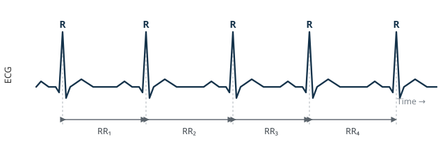
      <div class="var-desc">NN, SDNN, RMSSD</div>
    </div>
    <div class="panel">
      <div class="var-cap2">주파수영역 (frequency domain), LF/HF</div>
      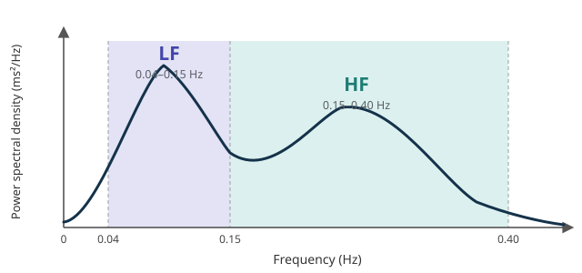
      <div class="var-desc">nLF, nHF, LF/HF</div>
    </div>
  </div>
  <div style="width:445px;">
    <div class="col-head">요골 맥파 <span class="col-sub">radial pulse</span></div>
    <div class="panel">
      <div class="var-cap2"><span class="dnum">②</span> 맥파형 특징, 구성파 시점·높이</div>
      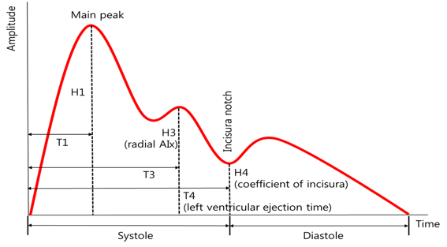
      <div class="var-desc">H1 충격파, H3 rAIx, H4 절흔(incisura)</div>
    </div>
    <div class="panel">
      <div class="var-cap2"><span class="dnum">③</span> 맥파 분석지수, 가압–변위 곡선</div>
      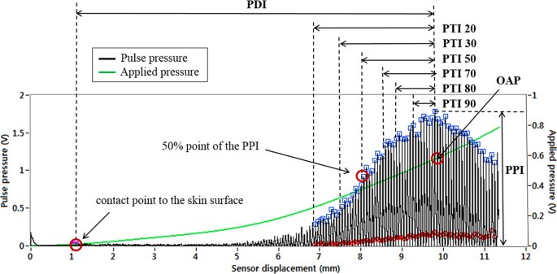
      <div class="var-desc">PPI, PDI, OAP, PTI20~90</div>
    </div>
  </div>
</div>
<!-- Provenance (hidden): 맥파 분석지수 그림 = Kim J, Bae J-H, Ku B, et al. Sci Rep 2019;9:9716,
     DOI 10.1038/s41598-019-46066-2, CC BY 4.0 (저자 그룹 자체 논문). HRV 시간/주파수 도식 = 자체 제작(설명용). -->
```

::: {.notes}
뒤 결과에 주로 등장할 지표들을 여기서 미리 짚고 가겠습니다. 화면 왼쪽 위 심전도를 보시면, 연속된 NN 간격에서 심박변이도의 시간 영역 지표가 나옵니다. 그 아래 스펙트럼에서는 저주파와 고주파 성분, 곧 주파수 영역 지표를 얻습니다.

오른쪽 맥파 파형을 보시죠. H1은 심장이 피를 뿜을 때 생기는 앞쪽 압력파, 곧 충격파의 높이입니다. H3은 반사되어 돌아오는 조석파 성분이고요. H4는 절흔의 높이인데, 수축기 말에 파형이 전달되고 반사되는 특성을 담은 절대 지표입니다. 그리고 이 H3을 H1으로 나눈 비율 지표가 rAIx@75인데, 바로 이 '비율'이라는 성격이 뒤에서 중요한 함정이 됩니다.

아래쪽 가압-변위 곡선에서는 맥파 분석지수가 나옵니다. PDI는 요골동맥이 가장 크게 맥동할 때의 깊이고, PTI는 압력을 높여갈 때 맥동이 얼마나 팽팽하게 버티는지 보는 긴장도 지표입니다. 이 분석지수 도식은 저희 연구팀이 예전에 낸 논문에서 가져왔습니다.
:::

## 통계 분석

$$
\text{outcome}_{ij} = \beta_0 + \beta_1 \text{stage} + \beta_2 \text{group} + \beta_3(\text{stage}\times\text{group}) + \beta_4 \text{baseline} + u_i + \varepsilon_{ij}
$$

- 선형혼합효과모형(LME): baseline을 공변량으로, 참가자를 random intercept($u_i$)로
- 핵심 검정: stage × group interaction (F-test, **p~int~**)
- 군간차 보고 (주 지표): **변화량 차이(MD), 95% CI, p-value**
    - 효과크기(**Cohen's d**): (within [전/후 변화량], between [군간 변화량 차이])
- 사후 대비: Tukey HSD 보정
<!-- - baseline 결측 제외 기준: 31개 혈류역학 변수 중 50% 이상 결측 -->

::: {.columns}
::: {.column width="50%"}
::: {.tone-confirmed}
**핵심 검정: stage × group interaction (p~int~)**
:::
:::
::: {.column width="50%"}
::: {.tone-hypothesis}
**25개 지표에 대한 다중비교는 보정하지 않음**
:::
:::
:::

::: {.notes}
통계분석은 지표마다 선형혼합효과모형, 줄여서 LME를 따로 적합했습니다. 사람마다 개인차가 있으니 참가자를 임의 절편으로 넣었고, 운동 전후를 뜻하는 stage와 표현형, 그리고 baseline을 고정효과로 뒀습니다. baseline을 공변량으로 넣은 건, 무작위 배정이 아니어서 군마다 출발점이 조금씩 다를 수 있는데 그 차이를 보정하기 위해서입니다.

가장 주목하는 건 화면 수식에서 stage와 group의 상호작용 항입니다. 해당 항이 통계적으로 유의하다는 건 운동에 대한 반응의 크기나 방향이 표현형에 따라 다르다는 것을 의미합니다. 즉, interaction이 유의하면, 운동 전후 변화량이 세 군에서 서로 다르다는 것이고, 유의하지 않으면 변화량은 세 군에서 비슷하다는 뜻입니다.

군간 차이는 실제 단위의 변화량 차이, 곧 MD와 95% 신뢰구간, p값을 통해 평가했고. Cohen's d와 같은 효과크기를 함께 제시했습니다. 탐색적 연구이기 때문에 총 25개 지표 전체에 대한 다중비교 보정은 실시하지 않았습니다.  
:::

## 운동 후 자율신경 반응: Android 둔화

[interaction non-significant]{.badge .badge-hypothesis} nLF p~int~ = 0.068 (경계)

```{=html}
<div style="display:flex; align-items:flex-start; gap:1.6em; margin-top:0.4em;">
  <div style="flex:0 0 42%;">
    <ul style="line-height:1.5; margin:0; font-size:0.88em;">
      <li><span class="ctrl">Control</span>·<span class="gyn">Gynoid</span>: 운동 후 정상 sympathovagal shift (nLF↑, nHF↓, LF/HF↑; 모두 p ≤ 0.003)</li>
      <li><span class="andr">Android</span>: 주파수 영역 변화 없음 (모두 p &gt; 0.21)</li>
      <li>운동 후 <span class="andr">Android</span> nLF가 유의하게 낮음
        <ul style="margin:0.25em 0 0.2em 0.9em; padding-left:1.1em; font-size:0.9em; list-style-type:square;">
          <li><span class="andr">Android</span> vs. <span class="ctrl">Control</span>: MD −13.3% (95% CI −24.2, −2.4), p = 0.013, 효과크기 d = −0.69</li>
          <li><span class="andr">Android</span> vs. <span class="gyn">Gynoid</span>: MD −11.9% (95% CI −22.3, −1.6), p = 0.020, 효과크기 d = −0.65</li>
        </ul>
      </li>
      <li>NN·RMSSD는 세 군 공통 감소 (p &lt; 0.001), between 차이 없음</li>
    </ul>
  </div>
  <div style="flex:1; min-width:0; text-align:center;">
    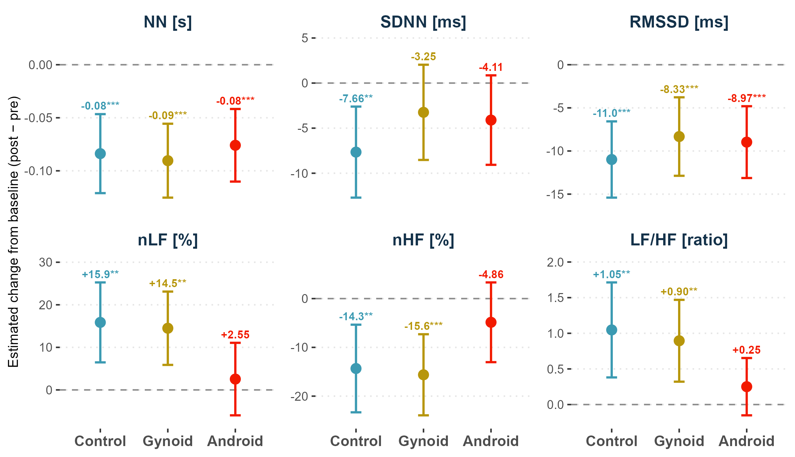
  </div>
</div>
<div style="margin-top:1.1em; border-left:6px solid #3B9AB2; background:#eef6f9; border-radius:6px; padding:0.3em 0.8em; font-size:0.68em; line-height:1.4;">
  <div style="font-weight:700; color:#14324a; margin-bottom:0.1em;">고찰</div>
  <ul style="display:block; margin:0.15em 0 0 0; padding-left:1.3em; list-style-position:outside;">
    <li><span class="andr">Android</span>의 주파수 영역 무반응 → 자율신경 반응성 저하(blunted sympathovagal shift) 시사. interaction non-significant, 재현 필요.</li>
    <li>nLF은 교감·미주 성분 혼재로 두 기전 구분 불가(해석 주의). 방향성은 복부지방·자율신경 선행연구와 부합(Grassi 2015; Farah 2013).</li>
    <li>PTI 연계: <span class="ctrl">Control</span> PTI 상승(심박출량↑) vs <span class="andr">Android</span> PTI 감소 → cardiovascular reactivity 결손 가능성.</li>
  </ul>
</div>
```

::: {.notes}
첫 번째 도메인은 자율신경, 심박변이도입니다. 시간 영역은 세 군이 비슷하게 움직였는데, 주파수 영역에서 표현형별로 갈렸습니다. Android가 사실상 변화가 없었습니다. 다만 상호작용이 유의수준 경계에 걸쳐있기 때문에, 방향성 관찰로 봐 주셔야 합니다.

NN 간격과 RMSSD는 세 군 다 운동 후 유의하게 줄었고, 군간 차이는 없었습니다. 운동에 따른 정상적인 미주신경 위축이죠. 주파수 영역에서는 정상군과 Gynoid가 예상대로 교감신경 쪽으로 무게가 실리는 전환을 보였습니다. nLF는 오르고 nHF는 내려가는 반응입니다. 그런데 Android는 주파수 지표가 하나도 유의하게 변하지 않았습니다.

운동 후 Android의 nLF는 정상군보다 13.3%포인트 낮았습니다. p는 0.013, 효과크기는 마이너스 0.69고요. Gynoid와 비교해도 11.9%포인트 낮았습니다. Android에서 교감-미주 전환이 둔해졌다는 얘기인데, 중심성 지방과 자율신경 둔화를 이은 기존 연구와도 방향이 맞습니다. 다만 nLF에는 교감과 미주 성분이 섞여 있어서, 어느 쪽이 원인인지는 이 데이터만으로 못 박기 어렵습니다. 이 부분은 곧 나올 PTI 결과와 묶어서 다시 말씀드리겠습니다.
:::

## H4: 두 비만군 공통 감소, Control은 변화 없음

[interaction significant]{.badge .badge-confirmed} H4 = 절흔 높이 (incisura height), p~int~ = 0.002

```{=html}
<div style="display:flex; align-items:flex-start; gap:1.4em; margin-top:0.4em;">
  <div style="flex:0 0 40%; font-size:0.84em;">
    <div class="card gyn-bg"><strong><span class="gyn">Gynoid</span></strong>: −6.87%, p &lt; 0.001, 효과크기 d = −0.53</div>
    <div class="card andr-bg"><strong><span class="andr">Android</span></strong>: −4.33%, p = 0.006, 효과크기 d = −0.34</div>
    <div class="card ctrl-bg"><strong><span class="ctrl">Control</span></strong>: +1.03%, p = 0.525 (non-significant)</div>
    <div style="margin-top:1.0em; font-weight:700;">운동 후 군간차 (변화량 차이 MD)</div>
    <ul style="margin:0.15em 0 0 0; padding-left:1.2em; font-size:0.95em; line-height:1.35;">
      <li><span class="gyn">Gynoid</span> vs. <span class="ctrl">Control</span>: MD −7.90% (95% CI −11.7, −4.1), p &lt; 0.001, 효과크기 d = −1.17</li>
      <li><span class="andr">Android</span> vs. <span class="ctrl">Control</span>: MD −5.36% (95% CI −9.2, −1.5), p = 0.004, 효과크기 d = −0.79</li>
    </ul>
  </div>
  <div style="flex:1; min-width:0; text-align:center;">
    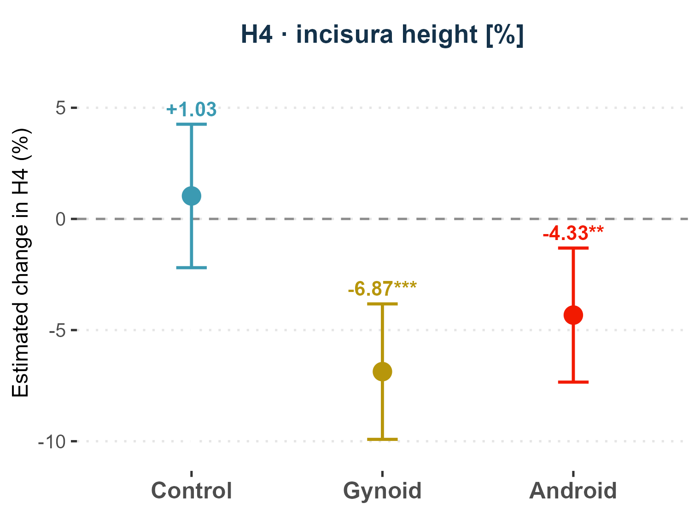
  </div>
</div>
```

```{=html}
<div style="margin-top:1.2em; border-left:6px solid #3B9AB2; background:#eef6f9; border-radius:6px; padding:0.3em 0.8em; font-size:0.68em; line-height:1.4;">
  <div style="font-weight:700; color:#14324a; margin-bottom:0.1em;">고찰</div>
  <ul style="display:block; margin:0.15em 0 0 0; padding-left:1.3em; list-style-position:outside;">
    <li>두 비만군 공통 감소, <span class="ctrl">Control</span> 변화 없음 → 지방 분포와 무관한 과체중의 공통 효과(파형 전달 특성 변화).</li>
    <li>H4(절흔 높이) 감소는 운동 후 반사파 특성(크기·시점) 변화를 반영. 안정 시엔 드러나지 않던 차이가 운동 부하로 표면화.</li>
  </ul>
</div>
```

::: {.notes}
두 번째 결과, H4입니다. 이번 연구에서 가장 강한 군간 차이를 보였습니다. 25개 지표 중 상호작용 p값이 0.002로 가장 유의하게 나타났고, 시간 영역 파형 지표 열 개 가운데 상호작용이 유의한 건 이 H4 하나뿐이었습니다. 나머지는 다 0.31을 넘었습니다.

아주 명확하게 두 비만군은 운동 후 H4가 나란히 떨어졌습니다. Gynoid가 6.87% 감소에 p는 0.001 미만, Android가 4.33% 감소에 p는 0.006입니다. 정상군은 오히려 1% 남짓 올라서 사실상 그대로였고요. 그러다 보니 군간 차이도 큽니다. 정상군과 견줘 Gynoid가 마이너스 7.9%포인트, Android가 마이너스 5.36%포인트 차이고, 효과크기로는 각각 마이너스 1.17과 마이너스 0.79로 꽤 큽니다.

여기서 중요한 발견은 지방의 분포와 상관없이 과체중이라는 사실 자체가 파형 전달 특성을 바꿨다는 뜻입니다. H4 같은 반사파 지표가 운동 후 줄어드는 건, 반사파의 크기가 작아지고 도달 시점이 앞당겨지는 것으로 설명됩니다. 흥미로운 것은이 차이가 안정 시에는 안 나타났었는데 운동 후 차이가 명확하게 드러났다는 점입니다.
:::

## rAIx@75와 H4의 dissociation: 비율 지표의 한계

[interaction non-significant]{.badge .badge-hypothesis} rAIx@75: p~int~ = 0.470, H4: p~int~ = 0.002로 → 두 반사 지표가 [Android]{.andr}에서 엇갈림

::: {.columns}
::: {.column width="50%"}
**정의와 관찰**

$$\text{rAIx@75} = H3\,/\,H1$$

H3 = 반사파(조석파), H1 = 충격파(forward wave)

rAIx@75 within-group 변화:

- [Gynoid −11.8%]{.gyn} (p = 0.018, significant)
- [Android −8.18%]{.andr} (p = 0.087, 경계)
- [Control]{.ctrl} 변화 없음 (p = 0.547)
:::
::: {.column width="50%"}
**기전: 분모(H1)가 분자(H3) 변화를 상쇄**

::: {.card .gyn-bg}
**[Gynoid]{.gyn}**: H1 ↑ (+0.17 V), H3 ↓ (−8.27%) → 분자↓·분모↑ → 비율 뚜렷이 감소
:::
::: {.card .andr-bg}
**[Android]{.andr}**: H1 ↓ (−0.19 V, 심박출 증강 둔화), H3 ↓ (−4.12%) → 분모(H1) 감소가 H3 감소 상쇄 → 비율 변화 가려짐
:::

<!-- 절대 지표 H4는 H1 교란이 없어 두 비만군 공통 감소가 그대로 드러남 (p~int~ = 0.002) -->
:::
:::

::: {.highlight-box style="font-weight:400; font-size:0.84em; line-height:1.4; margin-top:0.6em;"}
**한계**

- rAIx@75(= H3/H1): 반사파(H3)·forward wave(H1) 변화를 한 값에 섞은 비율 지표
- H1 동반 변동 시(운동·교감신경 변화) H3 변화의 상쇄 → 위음성(false negative) 소지
- 절대 지표 H4(절흔 높이): H1 교란에 둔감, 반사 변화(크기·시점) 직접 반영
- 비율 지표(AIx)의 보완 수단: 절대 파형 지표 병용
:::

::: {.notes}
여기는 조금 까다롭지만 짚고 갈 만한 대목입니다. 같은 반사파 현상을 보는데도 두 지표가 엇갈렸습니다. 절대 지표인 H4는 상호작용이 유의했는데, 비율 지표인 rAIx@75는 상호작용 p값이 0.470으로 전혀 유의하지 않았습니다. 같은 현상을 두고 왜 이렇게 갈릴까요. 비율 지표의 구조적 한계 때문입니다.

rAIx@75는 H3을 H1으로 나눈 값입니다. 그러니 이 비율은 반사파 H3과 충격파 H1이 각각 어떻게 변하느냐에 함께 휘둘립니다. Gynoid에서는 H1이 0.17볼트 오르고 H3이 8.27% 내려갔습니다. 분자는 줄고 분모는 커졌으니 비율이 뚜렷이 떨어지죠. 그래서 변화가 잡혔고, 실제로 Gynoid의 rAIx@75는 11.8% 감소, p는 0.018이었습니다.

Android는 다릅니다. H1이 오히려 0.19볼트 줄어듭니다. 앞서 본, 교감 활성이 둔해져 심박출 증강이 약해진 것과 딱 맞아떨어집니다. 문제는 분모인 H1이 줄면서 분자 H3의 감소를 상쇄해 버린다는 것입니다. 그래서 비율로는 변화가 거의 안 보입니다. 일종의 위음성인 셈이죠. 그래서 드리고 싶은 말씀은 두 가지입니다. H4 같은 절대 지표는 이런 분모 교란에 둔감해서 반사파 변화를 더 정직하게 보여준다는 것, 그리고 AIx 같은 비율 지표는 운동처럼 H1이 같이 흔들리는 상황에서는 반드시 절대 지표와 함께 봐야 한다는 것입니다.
:::

## PTI: 압력 임계값별 방향성

압력 임계값(PTI20~90)에서 운동 후 방향은 일관되나, interaction 유의성은 낮은 임계값에서만 확인됨.

::: {.columns style="font-size: 0.8em;"}
::: {.column width="40%"}
**운동 후 방향** (within-group, 모든 임계값 일관)

- [Control]{.ctrl} 증가 (+)
- [Android]{.andr} 감소 (−)
- [Gynoid]{.gyn} 미미

**Interaction 유의성**

- [significant]{.badge .badge-confirmed} PTI20 / PTI30
- [non-significant]{.badge .badge-hypothesis} PTI50~90 (p~int~ > 0.15)

**운동 후 군간차** ([Android]{.andr} < [Control]{.ctrl}, 탐색적)

| 임계값 | MD, mm (95% CI) | p | 효과크기 d |
|:--|:--:|:--:|:--:|
| PTI50 | −0.22 (−0.42, −0.02) | 0.026 | −0.62 |
| PTI70 | −0.18 (−0.35, −0.02) | 0.023 | −0.63 |
| PTI90 | −0.11 (−0.22, 0.00) | 0.047 | −0.56 |
:::
::: {.column width="60%"}
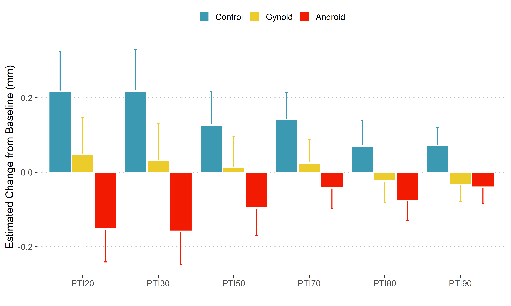{width="98%" fig-alt="PTI within-group estimated change from baseline across pressure thresholds by group, bar chart"}
:::
:::

::: {.notes}
세 번째 도메인은 맥동 긴장도 PTI입니다. 압력 임계값을 20%부터 90%까지 여섯 단계로 나눠서 봅니다. 큰 그림부터 말씀드리면, 여섯 임계값 전부에서 방향이 일관됩니다. 운동 후 정상군은 올라가고, Android는 내려가고, Gynoid는 거의 그대로입니다. 화면 막대그래프에서 이 위아래가 한눈에 들어옵니다.

다만 상호작용이 유의한 곳은 낮은 임계값인 PTI20과 PTI30, 두 군데뿐입니다. p값이 각각 0.032와 0.034고요. PTI50부터 90까지는 방향은 같아도 상호작용 p값이 0.15를 넘어 유의하지 않았습니다.

물론 운동 후 시점에서 Android가 정상군보다 낮다는 군간 차이 자체는 PTI50, 70, 90에서도 유의했습니다. 하지만 상호작용이 없으니 이 높은 임계값 결과들은 확정이 아니라 탐색적 소견으로 조심스럽게 봐야 합니다. 그래서 다음 슬라이드에서는 상호작용이 뚜렷한 PTI20과 30만 떼어 보겠습니다.
:::

## PTI20 / PTI30: Control은 증가, Android는 감소

[interaction significant]{.badge .badge-confirmed} **PTI20**: p~int~ = 0.032, **PTI30**: p~int~ = 0.034

::: {.columns style="font-size: 0.82em;"}
::: {.column width="44%"}
운동 후 [Control]{.ctrl} 증가 vs. [Android]{.andr} 감소 (방향 반대), [Gynoid]{.gyn}는 미미

| 지표 | [Control]{.ctrl} ↑ | [Android]{.andr} ↓ | Android−Control MD (95% CI) |
|:--|:--:|:--:|:--:|
| **PTI20** | +0.22 | −0.15 | −0.37 (−0.61, −0.13) |
| **PTI30** | +0.22 | −0.16 | −0.38 (−0.62, −0.13) |

- 변화량 단위: mm
- 군간차 모두 **p = 0.001** (PTI20, PTI30)
- 효과크기 d = −0.86 / −0.85
:::
::: {.column width="56%"}
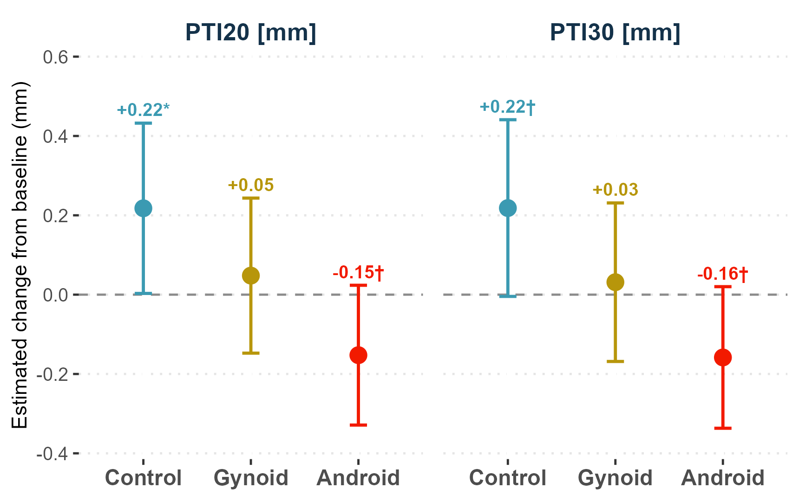{width="98%" fig-alt="PTI20 and PTI30 estimated change from baseline by group"}
:::
:::

::: {.highlight-box}
**고찰:** 낮은 압력 임계값에서 [Android]{.andr}의 맥파 박동성이 [Control]{.ctrl}과 **반대 방향으로 감소** → 운동 자극에 대한 **중추(자율신경) 조절 반응이 둔해진 것**으로 해석.
:::


::: {.notes}
바로 그 PTI20과 PTI30입니다. 이번 연구에서 Android의 차별적 반응을 가장 또렷하게 보여주는 소견이고요. 두 지표 다 상호작용이 유의했습니다. p값은 각각 0.032와 0.034입니다.

방향이 정반대라는 게 관건입니다. 운동 후 정상군은 맥동 긴장도가 올라가는데, Android는 내려갑니다. 변화량으로 보면 정상군이 약 0.22밀리미터 증가, Android는 0.15에서 0.16밀리미터 감소, Gynoid는 거의 그대로입니다. 두 군 차이로는 Android가 정상군보다 PTI20에서 0.37밀리미터, PTI30에서 0.38밀리미터 낮고, 둘 다 p값이 0.001, 효과크기는 마이너스 0.86과 0.85로 큽니다.

이게 중요한 이유는 앞의 자율신경 결과와 기전으로 이어지기 때문입니다. 정상군에서 운동 후 PTI가 오르는 건, 교감신경이 제대로 작동해 심박출량이 늘고 혈관 벽의 박동성이 커진 결과로 볼 수 있습니다. 반대로 Android에서 PTI가 주는 건, 둔해진 자율신경 반응의 하류에서 혈류역학적 증폭이 약해졌다는 뜻이고요. 둔해진 교감 활성과 줄어든 맥동성이 같은 방향으로 맞물리면서, 중심성 지방에서 보이는 심혈관 반응성의 결손을 시사합니다.
:::

## PDI: Gynoid에서만 유의하게 증가

[interaction significant]{.badge .badge-confirmed} PDI = pulse depth index, p~int~ = 0.049

::: {.columns style="font-size: 0.82em;"}
::: {.column width="44%"}
- 운동 후 [Gynoid]{.gyn}만 PDI 증가

- [Control]{.ctrl}·[Android]{.andr}는 변화 없음

| 군 | 운동 후 변화 | vs [Control]{.ctrl}: MD (95% CI) |
|:--|:--:|:--:|
| **[Gynoid]{.gyn}** | +0.73 mm | +0.94 (0.27, 1.61) |
| [Control]{.ctrl}, [Android]{.andr} | 변화 없음 (p > 0.41) | — |

- [Gynoid]{.gyn} within·between 모두 **p = 0.004**
- 효과크기 d: within 0.75, between 0.84

:::
::: {.column width="56%"}
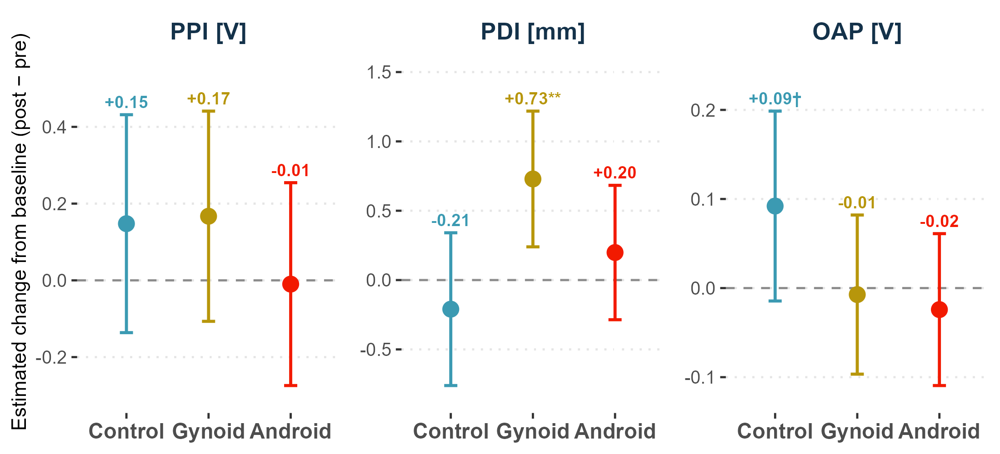{width="96%" fig-alt="PPI, PDI, OAP estimated change from baseline by group"}
:::
:::

::: {.highlight-box}
**고찰:** [Gynoid]{.gyn}에서만 나타난 말초 변화 → 운동으로 유발되는 **말초 혈관 확장(vasodilation) 능력이 유지**됨을 시사.
:::

::: {.notes}
이번에는 Gynoid 쪽입니다. 맥 깊이 지수 PDI는 상호작용이 유의했고, 오직 Gynoid에서만 운동 후 유의하게 늘었습니다. 상호작용 p는 0.049였고, PPI와 OAP는 유의하지 않았습니다.

Gynoid만 0.73밀리미터 늘었고 p는 0.004입니다. 정상군과 Android는 유의한 변화가 없었습니다. 운동 후 Gynoid는 정상군보다 PDI가 0.94밀리미터 높았고, 효과크기 0.84로 큰 차이였습니다.

PDI는 요골동맥이 가장 크게 맥동할 때의 깊이를 보는 지표입니다. Gynoid에서만 이게 커졌다는 건, 교감 활성이 온전한 상태에서 운동으로 요골동맥이 확장되거나 전완 관류가 늘었다는 뜻으로 읽힙니다. 실제로 Gynoid는 여러 신호가 한 방향을 가리킵니다. 정상적인 교감-미주 전환이 보존됐고, 앞서 본 rAIx@75 감소도 말초 혈관 확장과 맞아떨어지며, 여기에 PDI 상승까지 겹칩니다. 그러니 Gynoid형은 운동에 대한 말초 혈관 적응 능력이 유지된다는 그림이 나옵니다. 다만 이것도 표현형 차이와 맞아떨어지는 기능적 관찰이지, 그 자체로 확증은 아니라는 점은 함께 말씀드립니다.
:::

## PPI와 OAP

[interaction non-significant]{.badge .badge-hypothesis} 표현형 구분 기여는 제한적

| 지표 | interaction p~int~ | 요약 |
|---|:--:|---|
| **PPI** | [0.598 (non-significant)]{.nonsig} | interaction도 변화도 유의하지 않음 (모두 p > 0.22) |
| **OAP** | [0.254 (non-significant)]{.nonsig} | 운동 후 [Android]{.andr} vs. [Control]{.ctrl} 차이 경계, MD −0.12 (95% CI −0.24, 0.01), p = 0.071, 효과크기 d = −0.52 |

::: {.small .muted}
두 지표는 표현형 구분에 크게 기여하지 않음
:::

::: {.notes}
나머지 PPI와 OAP는 짧게 넘어가겠습니다. 이 둘은 이번 표현형 대비에 별로 기여하지 못했습니다.

PPI는 상호작용도, 운동 전후 변화도 유의하지 않았습니다. OAP도 상호작용은 유의하지 않았고, 운동 후 Android와 정상군의 차이가 p 0.071로 경계 수준, 효과크기는 마이너스 0.52 정도였습니다. 완전성을 위해 보고만 하고, 해석에서 크게 다루지는 않겠습니다.
:::

## 통합 해석: Android vs Gynoid vs 공통

| 도메인 | [Control]{.ctrl} | [Gynoid]{.gyn} | [Android]{.andr} | 해석 |
|---|:--:|:--:|:--:|---|
| 자율신경 (HRV) | 정상 이동 | 정상 이동 | 무반응 | [Android]{.andr} 중추 자율신경 반응성 둔화 [non-significant]{.badge .badge-hypothesis} |
| 맥파 박동성 (PTI20/30) | 증가 | 무변화 | 감소 | [Android]{.andr} 박동성 저하 [significant]{.badge .badge-confirmed} |
| 심박출 증강 (H1 방향) | 증가 | 증가 (+0.17 V) | 감소 (−0.19 V) | [Android]{.andr} 증강 약화 [non-significant]{.badge .badge-hypothesis} |
| 반사파 (H3, 조석파) | 무변화 | 감소 (−8.27%) | 감소 (−4.12%) | 두 비만군 반사파 감소 (rAIx@75 해리와 연결) [non-significant]{.badge .badge-hypothesis} |
| 말초 형태 (PDI·rAIx@75) | 무변화 | PDI +0.73 mm, rAIx@75 −11.8% | 미미 | [Gynoid]{.gyn} 말초 vasodilation 유지 (PDI [significant]{.badge .badge-confirmed}) |
| 파형 전달 (H4) | 무변화 | −6.87% | −4.33% | 두 비만군 공통 감소 [significant]{.badge .badge-confirmed} |

- [Android]{.andr}: 자율신경 둔화 + 박동성 감소 + 심박출 증강 약화 → 내장지방에 부합하는 중추 매개 반응성 결핍
- [Gynoid]{.gyn}: 중추 자율신경 정상 + 증강 유지 + 말초 변화 고유 → 운동 유발 말초 vasodilation 능력 유지
- 공통(두 비만군, Control엔 없음): H4 감소 → 지방 분포와 무관한 과체중의 효과

::: {.notes}
지금까지 결과를 한 장면으로 묶으면 세 갈래입니다.

먼저 Android형, 내장지방형입니다. 자율신경 반응이 둔하고, PTI로 본 맥동성이 줄고, H1으로 본 심박출 증강도 약합니다. 세 가지가 같은 방향을 가리키죠. 내장지방에서 이미 알려진 자율신경·혈관 이상과 맞아떨어지는, 중추 매개 심혈관 반응성 결손입니다.

두 번째는 Gynoid형, 둔부지방형입니다. 중추 자율신경 반응은 정상적으로 보존됐고, 대신 이 표현형만의 말초 변화가 나타납니다. PDI 증가와 rAIx@75 감소가 모두 말초 혈관 확장을 가리킵니다.

세 번째는 두 비만군에 공통이고 정상군에는 없는 H4 감소입니다. 지방 분포와 상관없이 과체중 자체가 파형 전달에 남긴 흔적이고요. 결국 상호작용이 확인된 네 지표, H4와 PDI, PTI20, PTI30이 '운동 반응이 표현형마다 다르다'는 가장 강한 근거입니다. 나머지 자율신경 차이나 H4와 rAIx@75의 해리, 높은 임계값 PTI 경향은 이 그림과 결은 같지만 아직 확증은 아닌, 앞으로 검증할 가설입니다.
:::

<!-- ## 의의 -->

<!-- ::: {.highlight-box}
지방의 양보다 분포가 운동에 대한 자율신경·혈관 반응을 좌우한다
::: -->

<!-- - 안정 시 측정(연령·혈압·맥박에서 차이 없음)에서는 안 보이던 표현형 차이가, 운동 부하 + 맥파 분석으로 확인
- 요골 압맥파와 HRV를 함께 측정하면 표현형별 반응 패턴을 포착 가능
- 비침습 맥파 지표를 비만 표현형 평가에 활용할 가능성 -->


## 한계

- 표본이 작음 (N = 42, 군당 13~15명) → 검정력 제한
- 표현형 군이 무작위 배정이 아닌 관찰적 분류 → 인과관계 규명은 제한적
- WHR 기반 분류 + 0.85~0.90 제외 구간 → 일반화 제한
- 내장/피하 지방을 직접 영상으로 측정하지 않음
- 운동 후 단일 시점(약 3분, early recovery)만 측정
- 난포기 시점을 생화학적으로 확인하지 않음
- 요골 측정치가 중심 대동맥 혈류역학으로 그대로 확장되지 않을 수 있음
- 25개 지표에 대한 다중비교 보정 없음

::: {.notes}
한계도 짚겠습니다. 무엇보다 표본이 작습니다. 전체 42명, 군당 열서너 명이라 검정력이 제한적입니다. 표현형도 무작위 배정이 아니라 관찰적으로 나눈 것이어서 인과를 단정하기 어렵습니다.

분류 방식에도 한계가 있습니다. WHR을 기준으로 삼고 애매한 중간 구간을 일부러 뺐으니 일반화에 제약이 따릅니다. 내장지방과 피하지방을 영상으로 직접 재지도 않았고요. 측정도 운동 후 3분, 초기 회복 한 시점만 봐서 시간에 따른 회복 경과는 알 수 없습니다.

호르몬도 남는 문제입니다. 영향을 줄이려고 난포기에 맞춰 방문 일정을 잡았지만, 주기 단계를 생화학적으로 확인하지는 않았습니다. 그래서 잔여 호르몬 변동이 자율신경이나 동맥 경직도, 말초 반응에 끼어들었을 여지가 남습니다. 끝으로, 손목 요골에서 잰 값이 중심 대동맥 혈류역학으로 그대로 이어지지 않을 수 있고, 앞서 말씀드린 대로 25개 지표에 다중비교 보정은 하지 않았습니다.
:::

## 결론

::: {.highlight-box}
운동 부하는 안정 시 드러나지 않는 비만 **표현형별 혈류역학 반응 차이**를 드러낸다
:::

**Findings** [significant]{.badge .badge-confirmed}

- **H4 감소**(두 비만군 공통) → 지방 분포와 무관한 과체중 효과
- **PTI20 / PTI30**: [Control]{.ctrl} 증가 vs [Android]{.andr} 감소 → [Android]{.andr} 맥파 박동성 저하
- **PDI 증가**([Gynoid]{.gyn} 고유) → 운동 유발 말초 vasodilation 유지

**표현형별 반응**

- [Android]{.andr}(내장지방형): 박동성 저하 + 중추 자율신경 반응 둔화 **경향**
- [Gynoid]{.gyn}(둔부지방형): 중추 반응 정상 + 말초 vasodilation **유지**

<!-- **후속 과제**: 더 큰 표본 · 영상 기반 지방 측정 · 운동 후 다시점 측정 -->

::: {.notes}
결론입니다. 남길 메시지는 두 가지입니다. 하나, 급성 운동에 대한 자율신경과 혈관의 통합적 반응을 좌우하는 건 지방의 '양'이 아니라 '분포'입니다. 둘, 운동 부하에 다매개 맥파 분석을 더하면, 가만히 앉아 재는 안정 시 측정에서는 숨어 있던 표현형 차이를 끌어낼 수 있습니다.

표현형별로는 이렇습니다. 두 비만군은 공통으로 운동 후 H4가 줄었는데, 이건 과체중 자체의 효과입니다. Android는 둔해진 자율신경 반응과 PTI의 역방향 감소가 겹친 중추 매개 반응성 결손을 보였습니다. 특히 H4는 줄었는데 rAIx@75는 안 줄어든 해리가 인상적이었습니다. 심박출 증강이 약해지면 비율 지표가 진짜 변화를 가려 버릴 수 있다는 걸 잘 보여줍니다. 반대로 Gynoid는 자율신경 반응이 보존된 채, PDI 증가로 나타나는 말초 혈관 확장 능력의 유지를 보였습니다.

물론 이 모두 작은 표본에서 얻은 탐색적 결과입니다. 앞으로 지방을 영상으로 직접 정량화하고, 운동 후 여러 시점을 보는 더 크고 전향적인 연구로 확인해 봐야 합니다. 이상으로 발표를 마치겠습니다. 감사합니다.
:::
