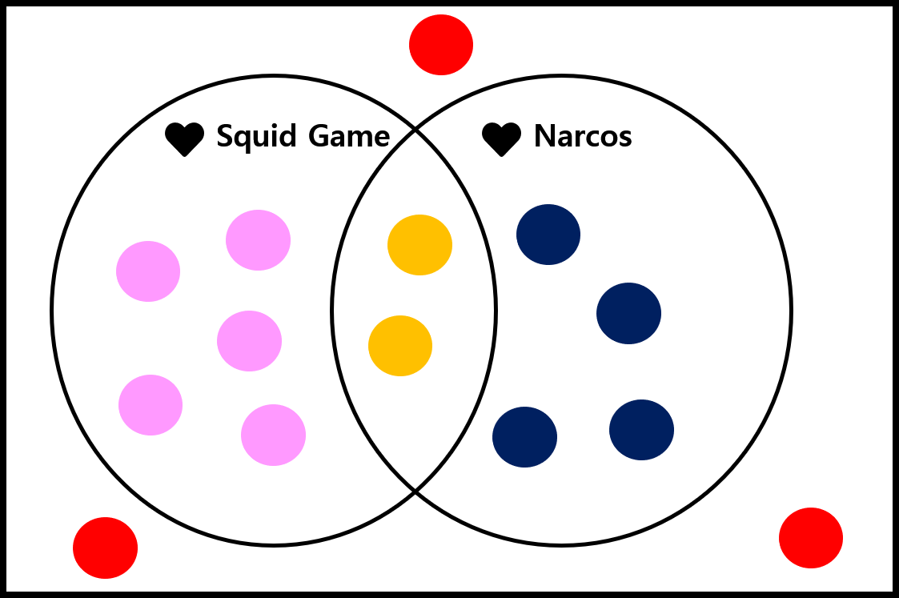
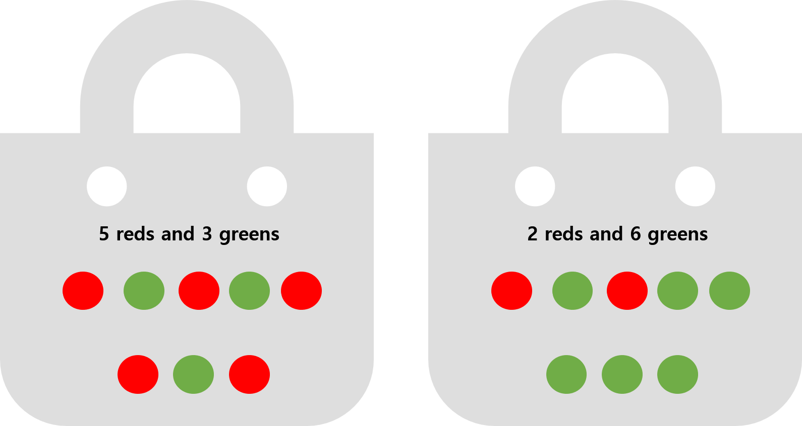

```{r setup-knitr, include=FALSE}
options(htmltools.dir.version = FALSE)
# knitr::opts_knit$set(root.dir='..')
knitr::opts_chunk$set(eval = TRUE, 
                      echo = FALSE, 
                      cache = FALSE,
                      include = TRUE,
                      collapse = FALSE,
                      message=FALSE,
                      warning=FALSE, 
                      dependson = NULL,
                      engine = "R", # Chunks will always have R code, unless noted
                      error = TRUE,
                      fig.path="Figures/",  # Set the figure options
                      fig.align = "center", 
                      #fig.width = 7,
                      #fig.height = 7, 
                      fig.keep='all', fig.retina=3)

```

```{r setup-library}
library(MASS)
library(reshape2)
library(plyr)
library(tidyverse)
library(lubridate)
library(readxl)
library(tidyselect)
library(tidystats)
library(glue)
library(here)
library(gt)
library(gtsummary)
library(kableExtra)
library(icons)

xaringanExtra::use_tile_view()
xaringanExtra::use_progress_bar(color = "#23373B", location = "bottom")
xaringanExtra::use_scribble()
xaringanExtra::use_panelset()
# xaringanExtra::style_panelset_tabs(foreground = "honeydew", background = "seagreen")

```


<!-- class: inverse, center, middle -->


# Probability `r icon_style(fontawesome("dice", style = "solid"), fill = "white")`

---


# Random vs. Deterministic

### Deterministic Experiment 

> The outcome can be predicted with certainty beforehand

#### **Example**

> - Chemical/physical experiment (e.g. $\mathrm{2H + O = H_2O}$, $S = 0.5gt^2$)
> - Adding two numbers (e.g. 8 + 3 = 11)


### Random Experiment 

> The outcome is determined by chance and cannot be predicted with certainty beforehand


#### **Example**

> - Tossing/rolling a coin/dice $\rightarrow$ $\{H, T\}$ or $\{1,2,3,4,5,6\}$
> - throwing a dart on a board
> - A LOTTO/Hitting the jackpot


**Random phenomena**: outcomes of the random experiment


???

On this slide, we are going to compare two types of experiments in statistics and science: deterministic experiments and random experiments.

First, let’s look at deterministic experiments. The key idea here is that the outcome can be predicted with complete certainty before the experiment takes place. For example, in chemistry or physics, when we combine hydrogen and oxygen in the right conditions, we always produce water. There is no surprise — it always happens the same way. Another simple example is mathematics: if we add eight and three, the result is always eleven. No matter how many times we try, the outcome will not change. That is what we mean by ‘deterministic.’

Now, let’s compare this with random experiments. In this case, the outcome is influenced by chance. We cannot say with certainty what the result will be before the experiment is carried out. A classic example is tossing a coin. We know the possible outcomes are heads or tails, but before we flip it, we cannot know for sure which one will appear. Similarly, rolling a dice can result in any one of the six numbers, but the specific number is unpredictable.

Other examples include throwing a dart on a board — it could land anywhere depending on small variations in force, angle, or wind — and playing the lottery, where millions of possibilities exist, but only one combination wins the jackpot.

In probability and statistics, when we talk about random phenomena, we are referring to the outcomes of these random experiments. These are the situations where we need probability theory to describe, analyze, and make predictions, because certainty is not possible.

So, to summarize: deterministic experiments are predictable with certainty, while random experiments involve uncertainty and chance. This distinction is fundamental because probability focuses mainly on analyzing random phenomena.


---


# Sample Space 

> #### **All possible outcomes of a random experiment** $\rightarrow$ $S$

#### Example 

> - Tossing a coin: $S = {H, T}$
> - Rolling a dice:  $S$={`r fontawesome("dice-one", style = "solid")`, `r fontawesome("dice-two", style = "solid")`, 
`r fontawesome("dice-three", style = "solid")`, `r fontawesome("dice-four", style = "solid")`, 
`r fontawesome("dice-five", style = "solid")`, `r fontawesome("dice-six", style = "solid")`} = {
1, 2, 3, 4, 5, 6}


### $S$ can be _finite_ or _infinite_

> - #### **Finite sample space**: $S = \{e_1, e_2, \ldots, e_N\}$ 


> - #### **Infinite sample space** <br><br>
> 
>   - Natural numbers: $\{1, 2, \ldots\}$ $\rightarrow$ **countably infinite sample space** $\rightarrow$ 
**_discrete sample space_**
>   - Many numbers within an interval (e.g. $0\leq x \leq 1$) $\rightarrow$ 
**non-countably infinite sample space** $\rightarrow$ **_non-discrete sample space_**


**In terms of statistics, sampling is a observation of an outcome from the random experiment and its result is called as a sample**


???

Alright, now that we’ve discussed random experiments, the next step is to define what we call the sample space.

So let me ask you: When we flip a coin, what are all the possible outcomes? … Yes, exactly — either Heads or Tails. We write that as the set S equals {H, T}.

Now, how about rolling a dice? Think about it for a second. What could we get? … Right — one, two, three, four, five, or six. So in that case, the sample space is the set of numbers from 1 to 6. This set contains all possible outcomes of the experiment. That’s why we call it the sample space.

Mathematically, we usually write sample space with the symbol S.

Now, sample spaces can be either finite or infinite. Let’s start with finite. If the number of possible outcomes is limited — for example, rolling a dice gives us only six options — then we say it’s a finite sample space.

But sometimes, the sample space is infinite. Let me give you two different cases:

Suppose we’re interested in the natural numbers: {1, 2, 3, …}. That list goes on forever, but notice — we can still count them one by one. This type of infinite set is called a countably infinite sample space, and in statistics, we also call it a discrete sample space.

On the other hand, imagine picking a random real number between 0 and 1. Now, there are infinitely many numbers in that interval, and we cannot count them one by one. This is what we call a non-countably infinite sample space, or a non-discrete sample space.

So let me pause and ask you a question: Which category would “tossing a coin” fall into — finite or infinite? … Right, finite. And choosing a random real number between 0 and 1? … Exactly, non-countably infinite.

Finally, here’s the connection to statistics: when we collect data, we are basically performing a random experiment and recording one outcome from the sample space. That outcome is what we call a sample.

So remember: the sample space contains all possible outcomes, while a sample is the actual result that we observe.


---

# `r fontawesome::fa("r-project", fill = "white")` Practice: Sample Space

#### Making a function to create a sample space for simple tools of random experiments (coin and dices)

.pull-left[
```{r, echo=TRUE}
sample_space <- function(
  outcome, times, prob = FALSE
) {
  n <- length(outcome)
  temp <- list()
  for (i in 1:times) {
    temp[[i]] <- outcome
  }
  out <- expand.grid(
    temp, 
    KEEP.OUT.ATTRS = FALSE
  )
  names(out) <- paste(
    "X", 1:times, sep = ""
  )
  if (prob) 
    out$probs <- rep(1, n^times)/(n^times)
  return(out)
}

```
]


.pull-right[
#### rolling a dice once

```{r, echo=TRUE, comment=NA}
sample_space(1:6, times = 1) |> unlist()

```


#### Toss a coin 3 times (all sample space)

```{r, echo=TRUE, eval=FALSE}
sample_space(c("H", "T"), 3)
```

$\rightarrow$ **CHECK RESULTS**


Please check Kerns, G. Jay. Introduction to probability and statistics using r. Lulu. com, 2010.

]


---

# Events

### **A collection of outcomes $\rightarrow$ a subset of the sample space**

> If outcomes of the random experiment belong to the event $A$ $\rightarrow$ the event $A$ has **_occurred_**. 

#### A single event of $A$ $\rightarrow$ a **_simple_** or **_elementary event_** (See pp. 4)

#### Special Events (Basic Set Operation)

> - $S$: Sample space itself $\rightarrow$ _sure_ or _certain event_ (any element of $S$ must occur) 
> - $\varnothing$: **Empty set**, _impossible, empty, or null event_
> - A event occurs **either $A$ or $B$ or both** $\rightarrow$ $A\cup B$ (**_union_** of $A$ and $B$)
> - **both $A$ and $B$** $\rightarrow$ $A\cap B$ (**_intersection_** of $A$ and $B$)
> - The event "**not $A$**" $\rightarrow$ $A^c$ or $A'$ (**_complement_** of $A$)
> - The event " $A$ **but not $B$**" $\rightarrow$ $A - B$ or $A \cap B^c$ (**_set difference_**)
> - a bunch of events $A_1, A_2, A_3, \ldots$ are _mutually exclusive_ or _disjoint_ if $A_i\cap A_j = \varnothing$, 
where $A_i \neq A_j$


**To review the set algebra, see Appendix E.1 in `IPSUR.pdf`**

???

Now that we’ve introduced the idea of a sample space, let’s move one step further and talk about events.

An event is simply a collection of outcomes. In other words, it is a subset of the sample space.

Let’s take a coin toss as an example. The sample space is $\{H, T\}$. Now, if we define event $A$ as ‘getting heads,’ then A contains just one outcome, $\{H\}$. If the coin lands on heads, then we say event A has occurred.

So here’s a question for you: If I roll a die, and event B is defined as ‘rolling an even number,’ what outcomes belong to event B? … Yes, exactly: $\{2, 4, 6\}$.

Events can be simple or complex. A simple or elementary event contains only one outcome. For example, ‘rolling a 3’ on a die. But often, we combine outcomes to form more complex events.

There are also some special types of events that we describe using set operations. Let’s walk through them:

The entire sample space itself, $S$, is called the certain event. Why do you think that is? … Right — because no matter what, the outcome will always be in $S$.

At the opposite extreme, we have the empty set, which represents the impossible event. Can you think of an example? … For instance, rolling a 7 on a six-sided die.

The union of two events, $A\cup B$, means $A$ occurs, or B occurs, or both occur. If event $A$ is ‘rolling an even number’ and event $B$ is ‘rolling a number greater than 4,’ what would $A\cup B$ be? … That’s right — $\{2, 4, 5, 6\}$.

The intersection of two events, $A\cap B$, means both occur at the same time. With the same example, what is $A\cap B$? … Yes, $\{6\}$.

The complement of an event, written $A'$, is everything in the sample space that is not in A. If A is ‘rolling an even number,’ then $A'$ is $\{1, 3, 5\}$.

The set difference, $A-B$, means $A$ occurs but not $B$.

Finally, we say events are mutually exclusive or disjoint if they cannot happen at the same time. For example, ‘rolling a 2’ and ‘rolling a 5’ are disjoint events.

So to summarize: events are just subsets of the sample space, and we use basic set operations like union, intersection, and complement to describe how events relate to each other


---

# `r fontawesome::fa("r-project", fill = "white")` Practice: Events

.pull-left[
#### all three coins show identical faces

```{r, echo=TRUE, comment=NA}
S <- sample_space(c("H", "T"), times = 3)
subset(S, X1 == X2 & X1 == X3 & X2 == X3)

```

#### show 2 heads when tossing a coin 3 times

```{r, echo=TRUE, comment=NA}
count <- apply(S, 1, function(x) as.numeric(x == "H"))
numH <- apply(count, 2, sum)
S[which(numH == 2), ]

```

]

.pull-right[
#### more than 2 times of `r fontawesome("dice-three", style = "solid")` rolling 3 dices

```{r, echo=TRUE, results='hide'}
S <- sample_space(1:6, 3)
count <- apply(S, 1, function(x) as.numeric(x == 3))
num3 <- apply(count, 2, sum)
S[which(num3 >= 2), ]

```

#### sum of all three dices are more than 16

```{r, echo=TRUE, comment=NA}
subset(S, X1 + X2 + X3 > 16)
```

]

---

# Concept of Probability


#### **A measure of the chance or uncertainty that assigns a number between 0 to 1**

> - Sure or certain that a event will occurs $\rightarrow$ probability is 100% or 1
> - Sure or certain that a event will not occurs $\rightarrow$ probability is 0 
> - Probability is 1/4 $\rightarrow$ a 25% chance will occur and a 75% chance will not occur
> - Odds against occurance are 75% to 25%, 3 to 1, odds = 1/3


#### **Theoretical Probability**

> - Define a mathemetical function on the sample space $\rightarrow$ probability measure
> - $h$ different ways out of a total of $n$ possible ways $\rightarrow$ 
the probability is $h/n$ (all of outcomes are equally likely)


#### **Emperical Probability**

> With $n$ repetition, $h$ times of occurance were observed $\rightarrow$ the probability is $h/n$ 
(when $n \rightarrow \infty$)


???

“Now, let’s talk about the central idea of today’s topic: probability.

Probability is a way to measure chance or uncertainty. It assigns a number between 0 and 1 to an event.

So let me ask you: If an event is absolutely certain to happen, what probability should we assign? … Yes, 1. That’s the same as saying there is a 100% chance.

On the other hand, if an event is impossible, what is its probability? … Exactly, 0.

Now, most events fall somewhere in between. For example, if an event has a probability of 1/4, that means there’s a 25% chance it will occur and a 75% chance it will not. Another way to describe this is with odds. The odds against the event are 75% to 25%, or 3 to 1.

So here’s a quick check: If the odds are 1 to 4 against an event, what’s the probability that the event actually happens? … Right, 1/5.

Now let’s distinguish between two important types of probability:

**Theoretical probability**. This is based on mathematical reasoning. If there are h favorable outcomes out of n total equally likely outcomes, the probability is h divided by n. For example, in rolling a die, the chance of getting a 2 is 1 out of 6, or 1/6.

**Empirical probability**. This is based on observation or experiment. If we repeat an experiment n times and the event occurs h times, then the probability is estimated as h/n. For example, if I flip a coin 100 times and get 48 heads, then the probability of heads is estimated as 48/100, or 0.48.

Now here’s the important part: as the number of repetitions gets larger and larger — as n approaches infinity — empirical probability tends to approach theoretical probability. This is why experiments, simulations, and large datasets are so important in statistics.

For example, tossing a coin repeatedly, in exactly the same way each time. 

Keep a record of total trials and the number of heads observed 

$$P(\mathrm{Heads}) \approx \frac{\mathrm{total~\#~of~flips}}{\mathrm{\#~of~observed~head}}$$
The mathematical background of this approach is the Law of Large Numbers. 

Let $S_n$ count the number of times that $A$ occurred in the $n$ experiments 

$$\frac{S_n}{n} \rightarrow P(A),~ n \rightarrow \infty$$


So, to recap: probability is a measure between 0 and 1. We can calculate it mathematically in the theoretical way, or we can estimate it through repeated trials in the empirical way.”


---

# Axioms of Probability

> Suppose $S$ is a sample space and each event $A$ of the $S$, $P(A) = p$ called the probability of $A$ 
and satisfies the following axioms: 


- **Axiom 1**: For any event $A \subset S$, $P(A) \geq 0$

- **Axiom 2**: For the sure or certain event $S$, $P(S) = 1$

- **Axiom 3**: If the events $A_1, A_2, A_3, \ldots$ are disjoint (mutually exclusive) events, 


$$P(A_1 \cup A_2 \cup \ldots) = P\left(\bigcup_{i=1}^{\infty} A_i \right) = P(A_1) + P(A_2) + \cdots = \sum_{i=1}^{\infty}P(A_i)$$


???

Up to this point, we’ve talked about probability in an intuitive way. Now, let’s make it more formal with the axioms of probability.

Suppose we have a sample space, S, and an event A is a subset of S. We write the probability of event A as P(A). For probability to make sense mathematically, it must satisfy three fundamental rules, called axioms.

Let’s go through them one by one.

**Axiom 1**: For any event $A$, the probability is always greater than or equal to zero. So, here’s a quick question: Can a probability ever be negative? … No, never. Probabilities range from 0 to 1, so the smallest possible value is 0.

**Axiom 2**: The probability of the whole sample space, S, is 1.
Why is that true? Think for a moment. … Right — because something in the sample space must occur. Every experiment produces some outcome, so the total probability has to be 1.

**Axiom 3**: If we have a collection of disjoint, or mutually exclusive, events, then the probability of their union is the sum of their probabilities.

Let’s try an example. Imagine rolling a die. Event A is rolling a 1, event B is rolling a 2. These two events cannot happen at the same time — they are disjoint. So what’s the probability of rolling either a 1 or a 2? … Yes, $P(A) + P(B) = 1/6 + 1/6 = 2/6$.

And this rule works even if we have many events, as long as they are disjoint. That’s why the formula is written with a big union and a summation sign.

So, to summarize:

   - Probabilities are never negative.
   
   - The probability of the entire sample space is 1.
   
   - And for disjoint events, probabilities simply add up.

These three axioms are the foundation of probability theory. Everything else we do conditional probability, Bayes’ theorem, distributions — all rely on these rules.

---

# Properties of Probability

#### **Some important theroems related to probability**

- **Theorem 1**: If $A \subset B$ then $P(A) \leq P(B)$

- **Theorem 2**: For avery event $A$, $0 \leq P(A) \leq 1$

- **Theorem 3**: For $\varnothing$, $P(\varnothing) = 0$

- **Theorem 4**: $P(A^c) = 1 - P(A)$

- **Theorem 5**: **_The general addition rule_**

$$\begin{aligned}
P(A\cup B) &= P(A) + P(B) - P(A\cap B)~~~\mathrm{more~generally,}\\
P\left(\bigcup_{i=1}^{n}A_i\right) &= \sum_{i=1}^{n}P(A_i) - \sum_{i=1}^{n-1}\sum_{j=i+1}^{n}P(A_i\cap A_j) +\cdots + (-1)^{n-1}P\left(\bigcap_{i=1}^{n}A_i\right)\end{aligned}$$

- **Theorem 6**: Let $B_1, B_2, \ldots, B_n$ be disjoint and partitioned in $A$

$$P(A) = P(A\cap B_1) + P(A\cap B_2) + \cdots + P(A\cap B_n)$$

$\rightarrow$ **The Theorem of Total Probability**

???

Now that we’ve covered the axioms of probability, let’s look at some important theorems and properties that follow from those axioms. These are tools we will use again and again.

**Theorem 1**: If $A$ is a subset of $B$, then $P(A) \leq P(B)$.

That makes sense, right? If every outcome in $A$ is also inside $B$, then the probability of $A$ can’t be larger than the probability of $B$.

Quick check: If $A$ is ‘rolling a 2’ and $B$ is ‘rolling an even number,’ which probability is bigger? … Yes, $P(B)$, because B includes more outcomes.

Theorem 1 _Proof_. If $A\subset B$, it suffices  $B = A \cup (B\cap A^c)$ and $A\cap (B\cap A^c)=\varnothing$, 
therefore, $P(B) = P(A \cap (B\cup A^c)) = P(A) + P(B\cup A^c)\geq P(A)$

**Theorem 2**: For any event $A$, probability always lies between 0 and 1.

So let me ask: Can probability ever be 1.2? … No, never. It must be between 0 and 1.

**Theorem 3**: The probability of the empty set is 0.

Why? Think for a moment. … Right — because the empty set means no outcomes at all, so the event can never occur.

**_Proof_**: $\varnothing = S^c$

**Theorem 4**: The probability of the complement of A is 1 minus the probability of $A$.

Here’s a quick example: if $P(A) = 0.3$, then what is $P(A')$? … Exactly, 0.7.

**Theorem 5**: The general addition rule.

This one is very important. For two events,

$$P(A ∪ B) = P(A) + P(B) – P(A ∩ B)$$.

Why do we subtract the intersection? … Right — because if we just add P(A) and P(B), then the overlap gets counted twice.

So let’s try a simple question: If $P(A) = 0.4$, $P(B) = 0.5$, and $P(A ∩ B) = 0.2$, what is $P(A ∪ B)$? … Yes, 0.7.

The formula also extends to more than two events, but the key idea is the same: we add probabilities, then subtract overlaps, and so on.

**Theorem 6**: Finally, the Theorem of Total Probability. This says if we partition the sample space into disjoint events B1, B2, …, Bn, then we can calculate the probability of A by breaking it down:

P(A) = P(A ∩ B1) + P(A ∩ B2) + … + P(A ∩ Bn).

This is extremely useful when we want to compute probabilities by considering different cases.

So to summarize: these properties tell us how probabilities behave, how to handle complements, unions, and intersections, and how to decompose probabilities using partitions. You’ll use these rules throughout all of probability and statistics.


---

# Assignment of Probabilities

#### If $S$ consists of outcomes $a_1, a_2, \ldots, a_n$ that are **equally likely** in the sense ( $a_{i}\cap a_{j} = \varnothing$ ) that each $a_i$ has equal chance of occurance, by Axiom 2 and 3 

$$P(S) = P(\{a_1, a_2, \ldots, a_n\})=P(a_1\cup a_2 \cup \ldots\cup a_n) = \sum_{i=1}^{n}P(a_i) = 1$$

> #### Since $P(a_i)$ is identical for all $i$, $P(a_i) = 1/N$


#### For an event $A \subset S$ with $k$ elements: e.g. $A=\{a_{i1}, a_{i2}, \ldots, a_{ik}\}$

$$\begin{aligned}
P(A) &= P(a_{i1}) + P(a_{i2}) + \cdots + P(a_{ik}) \\
     &= \frac{1}{N} + \frac{1}{N} + \cdots + \frac{1}{N} \\
     &= \frac{k}{N} = \frac{\#(A)}{\#(S)}
\end{aligned}$$

### $\rightarrow$ Equally Likely Model (ELM) 

> - _equivalent to the theoretical definition of the probability_
> - convenient and popular way to analyze the random experiments


???

Now let’s talk about how we actually assign probabilities in the simplest case: when outcomes are equally likely.

Suppose our sample space S consists of outcomes a₁, a₂, …, aₙ. Each outcome is disjoint — meaning they cannot occur at the same time — and each has the same chance of happening.

By the axioms of probability, we know that the total probability of the sample space must be 1. So if we add up the probabilities of all outcomes, we must get 1.

That means each individual outcome must have probability 1/N, where N is the total number of outcomes.

Let’s test this idea with an example. If we toss a fair coin, how many outcomes are in the sample space? … Yes, 2. So each outcome has probability 1/2.

What about rolling a fair die? … Right, 6 possible outcomes, so each one has probability 1/6.

Now, what happens if we are interested in an event A that contains more than one outcome? For example, rolling an even number with a die. The event $A = \{2, 4, 6\}$.
How do we calculate its probability? We just add the probabilities of each simple outcome:

P(A) = 1/6 + 1/6 + 1/6 = 3/6 = 1/2.

In general, if $A$ contains $k$ outcomes, then $P(A) = k/N$. This is the formula you see on the slide:


$$P(A) = \frac{k}{N} = \frac{\#(A)}{\#(S)}$$


where $\#(A)$ is the number of outcomes in event $A$, and $\#(S)$ is the total number of outcomes in the sample space.

This method is called the Equally Likely Model (ELM). It is equivalent to the theoretical definition of probability and is one of the most convenient ways to analyze random experiments, especially in simple settings like cards, dice, or lotteries.

So, quick question for you: If we draw a card from a standard deck of 52 cards, what’s the probability of drawing a heart? … Yes, 13 out of 52, which simplifies to 1/4.

That’s exactly how the equally likely model works.


---

# Counting Method

#### Calculate the probability of occurance of the event $A$ $\rightarrow$ just merely **COUNTING** the number of possible outcomes of $A$ and $S$

### Multiplication Rule 

#### Suppose the experiment consisting of two successive steps

- $n_1$: The number of distinct ways for the first step
- $n_2$: The number of distinct ways for the second step

> - **All possible way made by two steps** $\rightarrow$ $n_1 n_2$ ways

#### More generally 

> An experiment composed of $k$ successive steps with $n_1, n_2, \ldots, n_k$ ways, respectively, 
then all possible number of outcomes from an experiment is $n_1 n_2 \cdots n_k$


#### **EXAMPLE** 

> - Pizza topping: {pepperoni, sausage, anchovies, olives, green peppers}
> - Total number of available topping: $2\cdot 2\cdot 2\cdot 2\cdot 2 = 2^5 = 32$


???

Now, let’s talk about one of the most fundamental techniques in probability, which is the Counting Method.

The key idea here is very simple: when we want to calculate the probability of an event, we don’t necessarily need to measure anything directly. Instead, we just need to count the number of possible outcomes. Then, probability is simply the ratio of the number of favorable outcomes to the number of all possible outcomes.

To make this more systematic, we introduce the Multiplication Rule. Suppose an experiment consists of two steps. If the first step can be done in $n_1$ distinct ways, and the second step can be done in $n_2$ distinct ways, then the total number of outcomes is simply $n_1 \times n_2$.

Why does this work? Because every choice you make in the first step can be combined with every choice in the second step. So mathematically, it’s just multiplication.

This idea generalizes very easily: if you have $k$ steps, with $n_1, n_2, \ldots, n_k$ possible ways in each step, then the total number of outcomes is $n_1 \times n_2 \times \cdots \times n_k$.

Let me give you a simple example. Imagine you are making a pizza, and you have five possible toppings: pepperoni, sausage, anchovies, olives, and green peppers. For each topping, you can either include it or not include it. So, each topping gives us two options. Since there are five toppings, the total number of possible pizzas is $2^5$, which is 32.

So, even though the rule itself looks very mathematical, it’s really just about systematically counting possibilities. This principle is very powerful, because once we know the number of possible outcomes, we can easily calculate probabilities for many kinds of experiments.

---

# Counting Method

### Permutations 

> Counting the number of different **arrangements**

$$_nP_r = n(n-1)\cdots(n-r+1)$$

> **_the number of permutations of $n$ objects taken $r$ at a time_**

#### A bag with $n$ distinguishable balls and draw $r$ balls at random. How many possible sequences might be observed? 

- **with replacement**: $n^r$
- **without replacement**: $n(n-1)(n-2)\cdots(n-r + 1)$

#### **EXAMPLE**

Required to seat 5 men and 4 women in a row so that the women occupy the even places

> - The men: $_5P_5 = 5! = 120$
> - the women: $_4P_4 = 4! = 24$
> - $\therefore$ number of arrangements = $120 \times 24 = 2880$


???

Now, let’s move on to another very important concept in counting methods, which is permutations.

A permutation is basically the number of different arrangements of objects. The order here matters. If you change the order of the objects, it counts as a different arrangement.

The general formula for the number of permutations of $n$ objects taken $r$ at a time is

$$_nP_r = n(n-1)\cdots(n-r+1)$$


So what does this mean? Imagine we have a bag with $n$ distinguishable balls, and we want to draw $r$ balls in sequence. If we draw with replacement—meaning after each draw we put the ball back into the bag—then for each draw we always have $n$ options. That gives us $n^r$ possible sequences.

On the other hand, if we draw without replacement, after each draw we have one fewer option, so the number of sequences is $n(n-1)(n-2)\cdots(n-r+1)$, exactly what the permutation formula tells us.

Let’s look at an example. Suppose we are required to seat 5 men and 4 women in a row, but with the condition that the women must occupy the even-numbered places.

First, we arrange the 5 men. Since we are placing all 5 men in order, that’s $_5P_5 = 5! = 120$ ways.

Next, we arrange the 4 women in the even positions. That’s $_4P_4 = 4! = 24$ ways.

Since the two arrangements are independent, we multiply them: $120 \times 24 = 2880$.

So, there are 2880 possible seating arrangements under these conditions.

This example illustrates how permutations allow us to count not just the number of selected items, but also how the order of those items can lead to many different outcomes. It’s a very powerful tool whenever order is important.

The number of permutations of $n$ elements is $n!$


---

# Counting Method

### Combinations

> - A counting method for selected objects **without regard to order and replacement**
> - _combinations of $n$ things taken $r$ at a time_ $\rightarrow$ $_nC_r$

$$_nC_r = {n \choose r} = \frac{n!}{r!(n-r)!}$$
It can be written 


$$_nC_r = {n \choose r} = \frac{n(n-1)\cdots(n-r+1)}{r!} = \frac{_nP_r}{r!}$$

> - Permutations $\rightarrow$ interesting in order of arrangements (e.g. $\{abc\} \neq \{cba\}$)
> - In combinations, $\{abc\} = \{cba\}$

#### **EXAMPLE**

> From 7 consonant and 5 vowels, how many words can be formed consisting of 4 different consonants 
and 3 vowels? 


???

Now let’s move on from permutations to **combinations**.  

Remember, permutations are all about **order**. But in combinations, we are interested only in **which objects are selected**, not the order in which they appear.  

Formally, the number of combinations of $n$ things taken $r$ at a time is written as $_nC_r$, or "n choose r."  
The formula is  

$$_nC_r = {n \choose r} = \frac{n!}{r!(n-r)!}$$

Another way to see this is by connecting it to permutations:  

$$_nC_r = \frac{_nP_r}{r!}$$

This makes sense because if order matters, each selection can be arranged in $r!$ different ways. But in combinations, all those different orders count as the **same** selection.  

For example, in permutations, $\{abc\}$ is different from $\{cba\}$.  
But in combinations, $\{abc\} = \{cba\}$.  


Now, let’s try the example on the slide.  

We have 7 consonants and 5 vowels. We want to form a word consisting of **4 different consonants** and **3 vowels**.  

- First, we choose 4 consonants out of 7:  

$${7 \choose 4} = \frac{7!}{4!(3!)} = 35$$  

- Then, we choose 3 vowels out of 5:  

$${5 \choose 3} = \frac{5!}{3!(2!)} = 10$$  

- Since these choices are independent, the total number of different word selections is:  

$$35 \times 10 = 350.$$  

So, there are 350 possible words under these rules.  


---

# Conditional Probability

#### **Concept** 

- Suppose select two cards from a full deck of 52 standard cards in succession. 

> - Event $A$: the first card is Ace
> - Event $B$: the second card is Ace

- $P(A)=4/52$ ( $\therefore$ Four Aces)
- (1) If the first card is Ace, then $P(B) = 3/51$ (The sample space is **changed!!**)
- (2) If the first card is **NOT** Ace, then $P(B) = 4/51$

$$(1):~P(B|A) = 3/51, ~~~ (2):~P(B|A^c)=4/51$$

> _When the sample space is changing, then the probability defined on the sample space is also changing_


#### Under the condition that some information (event) was revealed (occurred), then what does the probability of the other event (usually related to the previous information) occur? 

$\rightarrow$ The probability that the main event $(B)$ occur given that the previous event $(A)$ occur? 


???

Now we come to a very important idea in probability: **Conditional Probability**.  

Let’s think about the card example on the slide.  

We select two cards in succession from a full deck of 52 cards.  

- Event $A$: the first card is an Ace.  
- Event $B$: the second card is an Ace.  

What is the probability of $A$? Since there are 4 Aces out of 52 cards,  

$$P(A) = \frac{4}{52}$$  

So far, that’s simple. But now, the situation changes after we actually draw the first card. 

Case 1: If the first card is an Ace, then there are only **3 Aces left**, and only **51 cards remaining** in the deck.  
So,  

$$P(B|A) = \frac{3}{51}$$  

Case 2: If the first card is **not** an Ace, then all 4 Aces are still left, but there are still only 51 cards remaining.  
So,  

$$P(B|A^c) = \frac{4}{51}$$

Notice what’s happening: the sample space has changed after we got new information.  
When the sample space changes, the probability we assign to an event must also change.  

This leads us to the definition of **conditional probability**:  

The probability of event $B$ given that event $A$ has already occurred is written as $P(B|A)$.  

It represents: *“What is the probability of $B$ happening, once I know that $A$ has already happened?”*  

Let’s check for understanding.  

- If I draw one card and tell you it was an Ace, how would you explain why the probability of the next Ace is $\tfrac{3}{51}$ instead of $\tfrac{4}{52}$?  
Take a moment and think about how the **reduction of the sample space** changes the probability.  

To summarize:  

   - Conditional probability is about **updating probabilities once we have new information**.  
   - It’s crucial in real-world applications, from medical testing to weather forecasting, because we almost always update our beliefs after learning something new.  
   
---

# Conditional Probability 

#### **Definition**

> Let $A$ and $B$ two events such dat $P(A) > 0$. Denote $P(B|A)$ the probability of $B$ given that 
$A$ has occurred is defined by 

$$P(B|A) = \frac{P(A\cap B)}{P(A)}, ~~~ P(A) > 0$$

#### _Example_

UST students in KIOM, I asked them which NETFLIX series is the most favorite: 

- Squid Game vs. Narcos: one of them or both or none

.center[
 vs. 


]

???

Now let’s formalize what we discussed in the previous slide.  

The **definition** of conditional probability is:  

> Let $A$ and $B$ be two events such that $P(A) > 0$.  
> The probability of $B$ given that $A$ has occurred is defined as:  

$$
P(B|A) = \frac{P(A \cap B)}{P(A)}.
$$

This formula makes sense if we think about it carefully.  
We are restricting our sample space to the event $A$.  
So, the probability of $B$ now is the proportion of outcomes in $A$ that are also in $B$. 

Let’s illustrate this with a simple example.  
Suppose I asked a group of students at UST in KIOM which Netflix series they like the most — Squid Game or Narcos.  
Some students like Squid Game, some like Narcos, some like both, and some like neither.  

Imagine we define:  
- Event $A$: A student likes Squid Game  
- Event $B$: A student likes Narcos  

Then $P(B|A)$ means:  

*“Given that the student likes Squid Game, what is the probability that they also like Narcos?”*  

By definition,  

$$
P(B|A) = \frac{P(A \cap B)}{P(A)}.
$$

So we are looking at the overlap between the two preferences, relative to the total number who like Squid Game.  


This example shows that **conditional probability is about narrowing down the sample space based on the information we have**.  
It is not just a formula — it is a way of updating our probability when new conditions or information are given.  

Let me ask you:  
If P(A) = 0.4 and P(A ∩ B) = 0.1, what is P(B|A)? …  
Right, it’s 0.25.  

That’s how we connect the definition with real-world data.  
Understanding this will be essential when we later study **Bayes’ theorem** and decision-making under uncertainty.

---

# Conditional Probability

.pull-left[
#### Suppose 14 UST students in KIOM

> - love Squid Game: 7 
> - love Narcos: 6 
> - love both: 2 
> - don't like both: 3
]

???

Let’s apply the definition of conditional probability to a real example.  

Suppose we surveyed 14 UST students in KIOM about their favorite Netflix series.  
Here are the results:  

- Love Squid Game: 7  
- Love Narcos: 6  
- Love both: 2  
- Don’t like either: 3  


--

.pull-right[
####    

```{r, echo=FALSE}
# library(gt)
x1 <- c(2, 4)
x2 <- c(5, 3)
t1 <- tibble(
  rowname = c("Love S.G", "Not like S.G"),
  `Love NC` = x1,
  `Not like NC` = x2
)

kbl(t1, booktabs = TRUE, caption = "Contingency Table") %>% kable_paper %>% kable_styling(font_size = 14)
```
]
<br>

???

We can summarize this information in a **contingency table** as shown on the right.  

--

.pull-left[
#### **Venn Diagram**

]


???

This is also represented visually in the **Venn diagram** on the slide.  

Let’s define:  
- Event $A$: Student loves Squid Game  
- Event $B$: Student loves Narcos  

From the table:  

$$
P(A) = \frac{7}{14} = 0.5, \quad P(B) = \frac{6}{14} \approx 0.429, \quad P(A \cap B) = \frac{2}{14} \approx 0.143.
$$


--

#### **Probabilities**

- Let $A$ and $B$ be the events that students like Squid Game and Narcos, respectively.
- $P(A) = 7/14$, $P(B) = 6/14$
- $P(A\cap B) = 2/14$

--

**NOW LET'S CALCULATE CON'D PROBABILITIES!!**


---

# Conditional Probability

> #### Remind the contingency table and venn diagram!!

- The probability that students love S.G among students who love Narcos? 

???

Let’s continue with the contingency table and Venn diagram example from the previous slide.  
We will now calculate several **different conditional probabilities** to deepen our understanding.  

Recall:  
- Event $A$: Student loves Squid Game (S.G)  
- Event $B$: Student loves Narcos (NC)  

From our contingency table:  

$$P(A) = \frac{7}{14}, \quad P(B) = \frac{6}{14}, \quad P(A \cap B) = \frac{2}{14}, \quad P(A^c \cap B^c) = \frac{3}{14}, \quad P(A \cap B^c) = \frac{5}{14}.$$


1. **Probability that students love Squid Game among students who love Narcos**:  

$$
P(A|B) = \frac{P(A \cap B)}{P(B)} = \frac{2/14}{6/14} = \frac{1}{3} \approx 0.333.
$$


This means about 33.3% of students who love Narcos also love Squid Game.

--

$$P(A|B) = P(\mathrm{love~S.G~and~NC|loves~NC}) = \frac{P(A\cap B)}{P(B)} = \frac{2/14}{6/14}=\frac{1}{3}$$
- The probability that students don't like S.G among students who don't like Narcos? 

???

2. **Probability that students don’t like Squid Game among students who don’t like Narcos**:  

$$P(A^c|B^c) = \frac{P(A^c \cap B^c)}{P(B^c)} = \frac{3/14}{7/14} = \frac{3}{7} \approx 0.429$$

So about 42.9% of students who don’t like Narcos also don’t like Squid Game.


--

$$P(A^c|B^c) = \frac{P(A^c\cap B^c)}{P(B^c)} = \frac{3/14}{7/14} = \frac{3}{7}$$

- The probability that students don't like NC among students who like S.G? 


???

3. **Probability that students don’t like Narcos among students who love Squid Game**:  

$$P(B^c|A) = \frac{P(B^c \cap A)}{P(A)} = \frac{5/14}{7/14} = \frac{5}{7} \approx 0.714$$

This tells us that about 71.4% of students who love Squid Game do not like Narcos.


--

$$P(B^c|A) = \frac{P(B^c\cap A)}{P(A)} = \frac{5/14}{7/14} = \frac{5}{7}$$

- The probability that students like S.G among students who don't like NC? 


???

4. **Probability that students love Squid Game among students who don’t like Narcos**:  

$$P(A|B^c) = \frac{P(A \cap B^c)}{P(B^c)} = \frac{5/14}{8/14} = \frac{5}{8} = 0.625$$

This means 62.5% of students who don’t like Narcos still like Squid Game.

--

$$P(A|B^c) = \frac{P(A\cap B^c)}{P(B^c)} = \frac{5/14}{8/14} = \frac{5}{8}$$

???


💡 Key takeaway:  
These examples show clearly how **conditioning changes the probability**.  
Depending on what information we already know, the probability can change significantly.  
That’s the essence of conditional probability — it is always tied to the condition we impose.  

Let’s keep this in mind, because this idea will lead us directly into **Bayes’ theorem**, which is a powerful tool for updating probabilities based on new evidence.

---

# Conditional Probability 

#### **Properties and Rules**

> **Theorem 7.** For any event $A$ with $P(A) > 0$, 
> 
> 1. $P(B|A) \geq 0$, for all events $B \subset S$
> 2. $P(S|A) = 1$ 
> 3. If $B_1, B_2, B_3, \ldots$ are disjoint events, then 

$$P\left(\bigcup_{i=1}^{\infty}B_k |A \right) = \sum_{i-1}^{\infty}P(B_k|A)$$

> **Theorem 8 (multiplication rule).** For any two events $A$ and $B$, 

$$P(A\cap B) = P(A)P(B|A)$$

> More generally, for $A_1, A_2, \ldots, A_n$, 

$$P(A_1\cap, \cdots, \cap A_n) = P(A_1)P(A_2|A_1)P(A_3|A_1\cap A_2)\cdots P(A_n|A_1\cap A_2 \cap\cdots\cap A_{n-1})$$


#### **Theorem 8** is very important since it allow us to find probabilites in ramdom experiments with sequential structure


???

Now let’s review some important **properties and rules** of conditional probability.  

These rules give us powerful tools to compute probabilities in more complex situations.  


**Theorem 7** states three fundamental properties:  

For any event $B$,  

$$P(B|A) \geq 0$$  

This simply means probabilities are never negative — even when we condition on some event.  

$$P(S|A) = 1$$  

If we condition on event $A$, the sample space becomes restricted to $A$, so the probability of the whole new sample space is always 1.  

If $B_1, B_2, B_3, \ldots$ are disjoint events,  

$$P\left( \bigcup_{i=1}^{\infty}B_i \middle| A \right) = \sum_{i=1}^{\infty}P(B_i|A)$$

This is similar to the addition rule for unconditional probabilities, but now applied in the **conditional probability space**.


**Theorem 8** — the **Multiplication Rule** — is especially important:  

For any two events $A$ and $B$:  

$$P(A \cap B) = P(A)P(B|A)$$  

This is a direct application of the definition of conditional probability.  
It tells us how to calculate the probability of two events happening in sequence:  
First $A$, then $B$ given $A$.  


More generally, for multiple events $A_1, A_2, \ldots, A_n$:  

$$P(A_1 \cap A_2 \cap \cdots \cap A_n) = P(A_1)P(A_2|A_1)P(A_3|A_1 \cap A_2)\cdots P\left(A_n|A_1 \cap A_2 \cap \cdots \cap A_{n-1}\right).$$


This is the **general multiplication rule**, and it is extremely useful for analyzing **random experiments with sequential structure**.  


💡 Let’s think about an example:  
If we roll two dice and want to find the probability that the first die is even and the second die is a six, we can write:  

$$P(\text{First even} \cap \text{Second six}) = P(\text{First even}) \cdot P(\text{Second six}|\text{First even})$$  


---

# Conditional Probability

#### Example 1 

> Back to the question in the slide 15, What is $P(\mathrm{both~Aces})$? 

???

Now, let’s apply the multiplication rule and conditional probability ideas to **examples**.  

**Example 1** goes back to the **card deck question from slide 15**.  

We want the probability that **both selected cards are Aces**.  

We already defined:  

- $A$: the first card is Ace  
- $B$: the second card is Ace  

From the multiplication rule:  

$$P(\text{both Aces}) = P(A \cap B) = P(A) \cdot P(B|A)$$  

Now, $P(A) = \tfrac{4}{52}$ since there are 4 Aces in a 52-card deck.  
If the first card is an Ace, then only 3 Aces remain out of 51 cards, so  

$$P(B|A) = \tfrac{3}{51}$$  

Multiplying,  

$$P(\text{both Aces}) = \frac{4}{52}\cdot\frac{3}{51} \approx 0.00452.$$  

So the chance is less than half a percent — quite rare!  

--

$$P(\mathrm{both~Aces})=P(A\cap B) = P(A)P(B|A) = \frac{4}{52}\cdot\frac{3}{51}\approx 0.00452$$

#### Example 2

> Consider an urn with 10 ball insides
>
> - 7 balls: red
> - 3 balls: blue
> - Select 3 balls successively from the urn and What is the probability of all 3 balls are red?


???

**Example 2** involves an **urn problem**, another classic in probability.  

We have 10 balls in total:  

- 7 are red  
- 3 are blue  

We want the probability that, when selecting **3 balls in succession without replacement**, all 3 are red.  


Now compute step by step:  
- $P(A) = 7/10$  
- Given the first was red, $P(B|A) = 6/9$  
- Given the first two were red, $P(C|A \cap B) = 5/8$  

So,  

$$P(\text{all 3 red}) = \frac{7}{10}\cdot \frac{6}{9}\cdot \frac{5}{8}$$  

If we multiply, we’ll get the exact probability.  


Notice the key idea: each time we draw a ball, the **sample space changes**.  
This is the same principle we saw with the card example — conditional probability updates the sample space after each event.  


--

$\rightarrow$ Let define three events: $A={1^{\mathrm{st}}~\mathrm{ball~ is~ red}}$, 
$B={2^{\mathrm{nd}}~\mathrm{ball~ is~ red}}$, $C={3^{\mathrm{rd}}~\mathrm{ball~ is~ red}}$


--

$$P(\mathrm{all~3~balls~red})=P(A\cap B\cap C) = P(A)P(B|A)P(C|A\cap B) = \frac{7}{10}\frac{6}{9}\frac{5}{8}$$

---

# Conditional Probability


#### Example 3: Consider two different colors of balls in two bags

.pull-left[]

.pull-right[

> - Min Randomly select one ball from the first and move it to the second bag
> - Rogers select one ball from the second bag
]

**What is the probability that Rogers select a red ball?**

???

Now let’s work through **Example 3**, which is a bit more complex and requires us to use the **law of total probability**.  

We have two bags of balls:  
- The **first bag** has 5 red and 3 green.  
- The **second bag** has 2 red and 6 green.  

Here’s the process:  
1. Min randomly selects one ball from the first bag and transfers it to the second bag.  
2. Rogers then selects one ball from the second bag.  

Our question: **What is the probability that Rogers selects a red ball?**  

To analyze, let’s define events:  
- $A$: the transferred ball from the first bag is red  
- $A^c$: the transferred ball is green  
- $B$: the ball selected by Rogers is red  

Notice that $B$ can occur in two different ways:  
- Case 1: $A \cap B$ → the transferred ball is red **and** Rogers picks red  
- Case 2: $A^c \cap B$ → the transferred ball is green **and** Rogers picks red  

So, by the **law of total probability**,  

$$P(B) = P(A)P(B|A) + P(A^c)P(B|A^c)$$  


Now, compute each piece:  

- Probability the transferred ball is red:  

$$P(A) = \frac{5}{8}$$  

- If a red is transferred, the second bag now has 3 red and 6 green, so  

$$P(B|A) = \frac{3}{9}$$  

- Probability the transferred ball is green:  

$$P(A^c) = \frac{3}{8}$$  

- If a green is transferred, the second bag has 2 red and 7 green, so  

$$P(B|A^c) = \frac{2}{9}.$$  


Putting it together:  

$$P(B) = \frac{5}{8}\cdot \frac{3}{9} + \frac{3}{8}\cdot \frac{2}{9}.$$  

Simplify:  

$$P(B) = \frac{15}{72} + \frac{6}{72} = \frac{21}{72} \approx 0.292$$  

--

> - $A$: **transferred** ball is `r fontawesome::fa("circle", fill = "red")` (occurred in the first bag)
> - $B$: **selected** ball is `r fontawesome::fa("circle", fill = "red")` (occurred in the second bag)

Let $S$ be the whole sample space made by balls in the first bag

$$B = S\cap B = (A\cup A^c)\cap B = (A\cap B)\cup(A^c\cap B)$$

$$\begin{aligned}
P(B) &= P(A\cap B) + P(A^c\cap B)~~(\mathrm{WHY??})\\
     &= P(A)P(B|A) + P(A^c)P(B|A^c) = \frac{5}{8}\cdot\frac{3}{9} + \frac{3}{8}\cdot\frac{2}{9} = \frac{21}{72}
\end{aligned}$$


---

# Independent Events


> **Definition 1** Event $A$ and $B$ are said to be **_independent_** if 

> $$P(A\cap B) = P(A)P(B)$$

> Otherwise, the events are said to be **_dependent_**.


The connection between the conditional probability 

$$P(A|B) = \frac{P(A\cap B)}{P(B)}, ~~~ P(B) > 0$$
$P(A\cap B) = P(A)P(B|A) = P(B)P(A|B)$

In the case that $A$ and $B$ are independent, 

$$P(A|B)=\frac{P(A)P(B)}{P(B)} = P(A)$$
#### If $P(B|A) = P(B)$ or $P(A|B) = P(A)$, $A$ and $B$ are **_independent events_**.


#### The conditional probability provides the insight for the **relationship between two events**.


???

Now we move to the important concept of **independent events**.  

By definition, two events $A$ and $B$ are **independent** if:  

$$P(A \cap B) = P(A)P(B)$$  

This means that the occurrence of one event does **not affect** the probability of the other.  
If this equality does not hold, then we call them **dependent events**.  


Let’s connect this to **conditional probability**.  
Recall that:  

$$P(A|B) = \frac{P(A \cap B)}{P(B)}, \quad P(B) > 0.$$  

Also, we know:  

$$P(A \cap B) = P(A)P(B|A) = P(B)P(A|B)$$

Now, if $A$ and $B$ are independent, then:  

$$P(A|B) = \frac{P(A)P(B)}{P(B)} = P(A)$$

So, when events are independent, the probability of $A$ given $B$ is just the probability of $A$ itself.  

Similarly, $P(B|A) = P(B)$.  


This conditional probability framework gives us **insight into the relationship between two events**.  

- If knowing $B$ changes the probability of $A$, they are dependent.  
- If it does not change the probability, they are independent.  


Now let’s briefly connect this to **statistics and regression analysis**.  
In regression, we often talk about the **conditional expectation** $E[Y|X]$.  

- If $X$ and $Y$ are independent, then $E[Y|X] = E[Y]$.  
- This is exactly the same logic as $P(A|B) = P(A)$ for independent events.  

So conditional probability and conditional expectation are deeply related:  

- In probability theory, conditional probability tells us about the dependence between events.  
- In statistics, conditional expectation plays the same role for random variables.

---


# Independent Events

#### Example 1

> Suppose rolling two dices: `r fontawesome::fa("dice-six", fill = "red")` `r fontawesome::fa("dice-six", fill = "blue")`

.left-column[
#### Contingency Table

```{r, comment=NA}
dice2 <- sample_space(c(1:6), 2)
names(dice2) <- c("Red", "Blue")
with(dice2, table(dice2))

```

]


.right-column[
> - $A$: `r fontawesome::fa("dice-three", fill = "red")` $\rightarrow$ $P(A) = 6/36 = 1/6$
> - $B$: `r fontawesome::fa("dice-three", fill = "blue")` $\rightarrow$ $P(B) = 6/36 = 1/6$
> - $C$: sum of two dices are equal to 4 $\rightarrow$ $P(C) = 1/12$
> - $D$: sum of two dices are equal to 7 $\rightarrow$ $P(D) = 1/6$

#### **Check**

> - $P(A\cap B) = 1/36 = P(A)\cdot P(B) \rightarrow A \perp B$ 
> - $P(A\cap C) = 1/36 \neq P(A)\cdot P(C)$
> - $P(A\cap D) = 1/36 = P(A)\cdot P(D)\rightarrow A \perp D$
]


???

Now let’s explore independence using the experiment of rolling two dice.

Event $A$ is that the red die shows three, and event $B$ is that the blue die shows three. Each has probability $1/6$. If we ask for both dice showing three simultaneously, that is $P(A \cap B)$. There is only one outcome, $(3,3)$, out of 36, so the probability is $1/36$. Notice that this equals $P(A) \cdot P(B)$, which tells us $A$ and $B$ are independent.

Next, consider event $C$, that the sum of two dice is four. The probability of this event is $1/12$. If we check $P(A \cap C)$, the only case is when the red die shows three and the blue die shows one, which has probability $1/36$. But $P(A) \cdot P(C)$ is $(1/6)\cdot(1/12) = 1/72$, not equal to $1/36$. This means $A$ and $C$ are dependent.

Finally, look at event $D$, that the sum is seven. There are six outcomes in total, so $P(D)=1/6$. If we ask $P(A \cap D)$, the only valid outcome is when the red die is three and the blue die is four, again probability $1/36$. And here, $P(A) \cdot P(D)$ is $(1/6)\cdot(1/6)=1/36$. They match perfectly, so $A$ and $D$ are independent.

This example illustrates two important points. First, independence is not about whether two events seem related, but whether the probabilities satisfy the multiplication rule. Second, independence has to be checked case by case—some pairs of events are independent, while others are not, even in the same experiment.


---

# Independent Events 

#### Example 2: Tossing a coin 10 times 

> What is the probability of observing at least one Head? 


???

Now let’s look at another example that illustrates the importance of independence in probability.

Suppose we toss a fair coin 10 times. The question is: what is the probability of observing at least one Head?

At first, this might sound a little complicated, because there are so many possible outcomes. But instead of counting all the cases with one or more Heads, we can apply a very useful trick: the complement rule.

The complement of “at least one Head” is the event “no Heads at all,” which means all 10 tosses are Tails. So we can write:

$$P(\text{at least one Head}) = 1 - P(\text{all Tails})$$

Now, how do we calculate the probability of all Tails? Let’s define $A_i$ as the event that the $i$-th coin shows Head, and $A_i^c$ as the event that it shows Tail. What we want is the probability that all 10 tosses give Tails:

$$P(A_1^c \cap A_2^c \cap \cdots \cap A_{10}^c)$$

Here is where independence comes in. Each coin toss is independent of the others, which means the outcome of one toss does not affect the outcome of the next. Because of this, we can multiply the probabilities:

$$P(A_1^c)\cdot P(A_2^c)\cdot \cdots P(A_{10}^c)$$

Since each $P(A_i^c) = 1/2$, multiplying gives $(1/2)^{10} = 1/1024$.

Therefore,

$$P(\text{at least one Head}) = 1 - \left(\tfrac{1}{2}\right)^{10} = \tfrac{1023}{1024} \approx 0.999$$


So the probability of seeing at least one Head when tossing a coin 10 times is extremely high. This example is powerful because it shows how independence allows us to break down a seemingly complex probability into a simple product. Without independence, we couldn’t apply this multiplication rule so easily.
--

#### Answer: 

Let $A_{i}$ be a event that $i^{\mathrm{th}}$ coin show $H$, $i=1,\ldots,10$

$$\begin{aligned}
P(\mathrm{at~least~one~H}) &= 1 - P(\mathrm{all~H}) \\
                           &= 1 - P(A_1^c\cap A_2^c \cap\cdots \cap A_{10}^c) \\
                           &= 1 - P(A_1^c)P(A_2^c)\cdots P(A_{10}^c) \\
                           &= 1 - \left(\frac{1}{2}\right)^{10}
\end{aligned}$$

---

# Bayes' Theorem

#### **Motive: How is the probability of our interest updated when new information is available?**


> **Theorem 9. (Bayes Rule)**: Let $B_1, B_2, \ldots, B_n$ be mutually exclusive and exhaustive 
(whose union is the sample space $S$). And let $A$ be an event with $P(A) > 0$, then
> $$P(B_k|A) = \frac{P(B_k)P(A|B_k)}{\sum_{i=1}^{n}P(B_i)P(A|B_i)}$$


#### **Proof.**

> - For all $P(B_k) > 0$, $P(A\cap B_k)$ can be written as 
> - $P(A\cap B_k) = P(B_k)P(A|B_k) = P(A)P(B_k|A)$ 
> - Since $P(A) > 0$, then 
> $$P(B_k|A) = \frac{P(B_k)P(A|B_k)}{P(A)}$$
> - Since $B_k$ is a partition of $S$, according to the theorem of total probability, 
> $$P(A) = P(A\cap B_1) + P(A\cap B_2) + \cdots + P(A\cap B_n) = \sum_{i=1}^{n}P(B_i)P(A|B_i)$$


???

Now, let’s carefully walk through Bayes’ theorem.  

The key idea here is about *updating probabilities*. We often start with some prior beliefs, expressed as probabilities of events before observing new data. Once new evidence becomes available, we need a systematic way to update those beliefs. This is exactly what Bayes’ theorem allows us to do.  

The formula tells us how to calculate the probability of a specific cause, $B_k$, given that we observed some evidence $A$. Notice that it depends on two things:  

1. The prior probability $P(B_k)$, which reflects our belief about $B_k$ before seeing the evidence, and  
2. The likelihood $P(A|B_k)$, which tells us how compatible the evidence is with that specific cause.  

The denominator, $\sum_{i=1}^n P(B_i)P(A|B_i)$, plays an important role. It normalizes the probability so that the total across all possible causes sums to 1. This comes directly from the law of total probability.  

Let’s also briefly look at the proof. We start from the basic definition of conditional probability:  

Suppose we have a set of events $B_1, B_2, \ldots, B_n$ that partition the sample space.  
That means one and only one of these events must occur.  
Now, we observe another event, call it $A$.  
We want to know: *given that $A$ has occurred, what is the probability that the true underlying cause was $B_k$?*  

The proof starts by expressing the joint probability $P(A \cap B_k)$ in two ways.  
On one hand, it can be written as $P(B_k)P(A|B_k)$.  
On the other hand, it can also be expressed as $P(A)P(B_k|A)$.  
Rearranging gives us the first key relation:  

$$P(B_k|A) = \frac{P(B_k)P(A|B_k)}{P(A)}$$

But what is $P(A)$?  
Because the $B_i$ form a partition of the sample space, the total probability of $A$ can be written as a sum over all $B_i$:  

$$P(A) = \sum_{i=1}^n P(B_i)P(A|B_i)$$

Substituting this into the formula gives us Bayes’ Theorem in its complete form.  

Conceptually, this result is very powerful:  
- It tells us how to start with prior beliefs $P(B_k)$,  
- then use new evidence $A$ to update those beliefs, producing posterior probabilities $P(B_k|A)$.  


So, what does this mean in practice? It shows us that probability is not static. Instead, it is dynamic, constantly being updated as we observe new evidence. In real-world applications, this principle underlies medical diagnosis, spam filtering, and even machine learning algorithms.  

When you interpret Bayes’ theorem, remember: the prior represents what you believe *before*, the likelihood captures how evidence interacts with each hypothesis, and the denominator ensures everything stays consistent as probabilities.  

This balance between prior belief and new evidence is why Bayes’ theorem is such a powerful and widely used tool in statistics.

This updating mechanism is the cornerstone of Bayesian statistics and underlies many modern applications, from machine learning to medical diagnosis.  


---

# Bayes' Theorem

#### What does Bayes' Rule imply?

> - A method to update belief on the basis of new information 
> - When we know **prior** probabilities $(P(B_k))$, we want to know the **posterior** probability of
interest $(P(B_k|A))$ after obtaining the new information (data, the event $A$)


#### Decode the formula in **Theorem 9**

> - $P(B_k)$: **prior probability** of the previous **knowledge** 
> - $P(A)$: **prior probability** of the current **evidence** $A$ (also called normalized constant)
> - $P(A|B_k)$: **likelihood** of the basis on the previous knowledge
> - $P(B_k|A)$: updated **posterior probability** after adding information from $A$


$$\mathrm{posterior~prob} = \frac{\mathrm{prior~prob \times likelihood}}{P(\mathrm{data})}$$


???

Let’s now break down what Bayes’ Rule really means in practical terms.  

At its core, Bayes’ theorem provides a systematic method to *update our beliefs* when we acquire new information. It bridges what we knew before—the **prior**—with what we observe now—the **evidence**—to produce a new, updated belief—the **posterior**.  

Think about it like this: We often start with some expectation about the world. This is our prior probability, $P(B_k)$. When new evidence $A$ arrives, Bayes’ theorem gives us the formal rule to adjust that expectation to a new value, $P(B_k|A)$.  

Let’s decode the formula in Theorem 9 in everyday language:  

- $P(B_k)$ is the *prior probability* — your initial belief before seeing the new evidence.  
- $P(A|B_k)$ is the *likelihood* — how probable is the evidence if the prior hypothesis were true?  
- $P(A)$ is the *normalizing constant* — the total probability of observing the evidence across all possible hypotheses.  
- $P(B_k|A)$ is the *posterior probability* — your updated belief after taking into account the new evidence.  

Mathematically, this relationship can be written simply as:  

$$\mathrm{posterior~prob} = \frac{\mathrm{prior~prob} \times \mathrm{likelihood}}{P(\mathrm{data})}$$  

This shows the essence of Bayesian thinking: your updated belief is proportional to the prior belief multiplied by the likelihood of the new data.  

For example, in medical diagnosis, the prior probability might be the prevalence of a disease, the likelihood comes from test accuracy, and the posterior is the probability that a patient has the disease given a positive test result.  

This way of thinking is powerful because it formalizes how knowledge evolves in the face of new information — making Bayes’ theorem a fundamental pillar of statistical reasoning, decision making, and machine learning.  

By mastering this, you gain not just a formula, but a framework for thinking about uncertainty in any field where evidence accumulates over time.


---

# Bayes' Theorem 

#### **Example 1:** COVID-19 Virus

> Suppose that there exist four types of COVID-19 Virus: $\alpha$, $\beta$, $\gamma$, and $\delta$
> 
> - $P(\alpha) = 0.4$, $P(\beta) = 0.1$, $P(\gamma) = 0.2$, $P(\delta) = 0.3$
> - 
> Symptoms varies according to the type of COVID-19. Let define the event who shows symptoms like 
headache, sore throat, or runny nose due to the infection of COVID-19. Then, 
> 
> - $P(E|\alpha) = 0.2$, $P(E|\beta) = 0.2$, $P(E|\gamma) = 0.3$, $P(E|\delta) = 0.6$
> - Assume that no one is infected with more than one virus at the same time


#### Probability that patients show symptoms of $E$? 

$$\begin{aligned}
P(E) &= P(E\cap (\alpha\cup\beta\cup\gamma\cup\delta)) \\
     &= P(E\cap\alpha) + P(E\cap\beta) + P(E\cap\gamma) + P(E\cap\delta) \\
     &= P(\alpha)P(E|\alpha) + P(\beta)P(E|\beta) + P(\gamma)P(E|\gamma) + P(\delta)P(E|\delta) \\
     &= 0.4\cdot 0.2 + 0.1\cdot 0.2 + 0.2\cdot 0.3 + 0.3\cdot 0.6 = 0.34
\end{aligned}$$


???

Let’s apply Bayes’ theorem to a realistic example involving COVID-19 virus variants. 

Suppose there are four distinct types of COVID-19 virus: **α**, **β**, **γ**, and **δ**. Each type has a different prevalence:  

$P(\alpha) = 0.4$, $P(\beta) = 0.1$, $P(\gamma) = 0.2$, $P(\delta) = 0.3$  

Symptoms caused by these virus types also vary. Let’s define the event $E$ as showing symptoms like headache, sore throat, or runny nose due to infection.  

The probability of symptoms given each virus type is:  

- $P(E|\alpha) = 0.2$  
- $P(E|\beta) = 0.2$  
- $P(E|\gamma) = 0.3$  
- $P(E|\delta) = 0.6$  

We also assume no co-infection: a patient can only have one type of virus at a time.  

The first question we can answer is: **What is the probability that a patient shows symptoms of $E$?**  

We calculate this using the **law of total probability**:  

Plugging in the numbers:  

$$P(E) = 0.4\cdot0.2 + 0.1\cdot0.2 + 0.2\cdot0.3 + 0.3\cdot0.6 = 0.08 + 0.02 + 0.06 + 0.18 = 0.34$$  

So the probability that a randomly chosen patient shows these symptoms is **0.34**, or **34%**.  

This is an important intermediate step before we apply Bayes’ theorem to answer deeper questions, such as: *Given a patient shows symptoms, what is the probability they have a specific virus type?* That is where the posterior probability comes into play — and we will address that in the next example.  

This example clearly shows how prior probabilities and conditional probabilities combine to give us the total probability of an observed event, setting the stage for Bayesian inference.


---

# Bayes' Theorem

#### **Example 1:** COVID-19 Virus (_continued_)

> Let $S$ be a set of patients with COVID-19 and $\#(S) = 100$


```{r covid-19-bayes-mosaic, dev='svg', out.width="90%", fig.width=9, fig.height=6}
n <- 100
type <- c("alpha", "beta", "gamma", "delta")
symptom <- c("No", "Yes")
pb <- c(0.4, 0.1, 0.2, 0.3)
pe_b <- c(0.2, 0.2, 0.3, 0.6)

dat <- 
  tibble(
    type = rep(type, n*pb), 
    prob = rep(pe_b, n*pb)
  )

dat %>% 
  group_by(type) %>% 
  mutate(
    symptom = rep(symptom, c(1-unique(prob), unique(prob))*length(type))
  ) %>% 
  ungroup %>%
  mutate(
    type = factor(type, levels = c("alpha", "beta", "gamma", "delta"))
  ) -> dat


mosaicplot(~ type + symptom, data = dat, 
           sub = "COVID-19 Types", 
           cex.axis = 1.1, 
           main = "", 
           col = c("goldenrod1", "firebrick"))

```

???

Let’s continue our COVID-19 example to visualize what we calculated in the previous slide.  

Here we assume the total population of patients with COVID-19 is **100** individuals. This will help us better understand the prevalence of each virus type and the occurrence of symptoms.  

Recall the prevalence rates:  

- α: 40% → 40 people  
- β: 10% → 10 people  
- γ: 20% → 20 people  
- δ: 30% → 30 people  

Also, recall the symptom probabilities:  

- $P(E|\alpha) = 0.2$  
- $P(E|\beta) = 0.2$  
- $P(E|\gamma) = 0.3$  
- $P(E|\delta) = 0.6$  

We can now calculate how many patients in each group exhibit symptoms.  

For α: $40 \times 0.2 = 8$ patients  
For β: $10 \times 0.2 = 2$ patients  
For γ: $20 \times 0.3 = 6$ patients  
For δ: $30 \times 0.6 = 18$ patients  

This gives us a total of $8 + 2 + 6 + 18 = 34$ patients showing symptoms, consistent with our previous calculation of $P(E) = 0.34$.  

To make this data more intuitive, we use a **mosaic plot**.  

In the plot:  
- The horizontal axis represents the four virus types.  
- The width of each section reflects the proportion of each virus type in the population.  
- Each section is further split vertically into patients with symptoms (“Yes”) and without symptoms (“No”).  
- The height of each split corresponds to the symptom probability for that virus type.  

From the mosaic plot, you can visually compare:  
- The relative prevalence of each virus type.  
- How symptom probabilities differ by virus type.  
- That δ-type COVID-19 has the highest symptom occurrence rate, despite being only 30% of the population.  

This visualization is powerful — it not only confirms our numerical results but also prepares us to answer deeper Bayesian questions, such as: *Given symptoms, what is the probability that a patient has a specific virus type?* This will be the focus in the next step of Bayes’ theorem.


---
# Bayes' Theorem

#### **Example 1:** COVID-19 Virus (_continued_)

> **Question**: What is the probability that patients showing symptoms in $E$ is infected by COVID-19 $\delta$ ?

#### **Solution**

$$P(\delta|E) = \frac{P(\delta\cap E)}{P(E)} = \frac{P(\delta)P(E|\delta)}{P(E)} = \frac{0.3\cdot 0.6}{0.34} = 0.529$$

Likewise, $P(\alpha|E)$, $P(\beta|E)$, $P(\gamma|E)$ can be obtained as 


$$\begin{aligned}
P(\alpha|E) &=\frac{0.4\cdot 0.2}{0.34}=0.235 \\
P(\beta|E)  &=\frac{0.1\cdot 0.2}{0.34}=0.059 \\
P(\gamma|E) &=\frac{0.2\cdot 0.3}{0.34}=0.176
\end{aligned}$$

> #### **The prior probabilities of each type of COVID-19 virus are updated based on the given information!!**


???

Now that we have visualized the prevalence and symptom probabilities, let’s apply **Bayes’ Theorem** to answer a key question:  

> Given that a patient shows symptoms in event $E$, what is the probability that they are infected with COVID-19 type δ?  

Recall Bayes’ theorem formula:  

$$P(B_k|A) = \frac{P(B_k)P(A|B_k)}{P(A)}$$  

Here:  
- $B_k$ = δ-type virus  
- $A$ = event $E$ (showing symptoms)  

So we calculate:  

$$P(\delta|E) = \frac{P(\delta)P(E|\delta)}{P(E)} = \frac{0.3\cdot 0.6}{0.34} = 0.529$$  

This means there is about a **53% probability** that a symptomatic patient has the δ-type virus.  

We can apply the same calculation for the other virus types:  

- For α:  

$$P(\alpha|E) = \frac{0.4\cdot 0.2}{0.34} = 0.235$$  

- For β:  

$$P(\beta|E) = \frac{0.1\cdot 0.2}{0.34} = 0.059$$  

- For γ:  

$$P(\gamma|E) = \frac{0.2\cdot 0.3}{0.34} = 0.176$$  

These updated values are **posterior probabilities** — our updated beliefs about the virus type given new evidence (symptoms).  

Notice how drastically these probabilities differ from the prior probabilities we started with:  
- δ-type’s probability jumps from 30% to over 50%.  
- β-type drops significantly.  

This illustrates the power of Bayes’ theorem: it allows us to update prior knowledge based on observed evidence, turning raw probabilities into informed decisions.  

In medical diagnosis, this is crucial — new information like symptoms, test results, or patient history changes our assessment of the likelihood of different conditions, guiding more accurate and effective treatment strategies.

---

# Bayes' Theorem

#### **Example 2:** Monty Hall Problem

> _Suppose you're on a game show, and you're given the choice of three doors: Behind one door is a car; 
behind the others, goats. You pick a door, say No. 1, and the host, **who knows what's behind the doors**, 
opens another door, say No. 3, which has a goat. He then says to you, "Do you want to pick door No. 2?" 
Is it to your advantage to switch your choice?_
>
> _From Parade magazine’s Ask Marilyn column_


.center[

]


???

Let’s explore an intriguing and famous example of conditional probability — the **Monty Hall Problem**.  

Imagine this: you’re on a game show. Behind one of three doors is a car — the prize you want. Behind the other two doors are goats. You choose door No. 1. The host, who knows what’s behind all the doors, opens door No. 3 to reveal a goat.  

Now the host offers you the chance to switch your choice to door No. 2.  

The question is: **Should you switch?**  

---

# Bayes' Theorem

#### You may think like

> 1. My chance to win a brand new car rises from 1/3 to 1/2 because one of doors among #1 or #2 has a new car. 
> 2. The chance of having a car in door #1 is never changed no matter the host open the door #3. That is, 
the probability that the door #2 has a brand new car is 2/3. So it is better to change my choice. 


#### **Which opinion is correct?**

???

At first glance, it feels like a 50–50 choice. But Bayes’ theorem shows this intuition is wrong.  

Here’s why:  
- Initially, the probability of the car being behind your chosen door is $1/3$, and behind one of the other doors is $2/3$.  
- When the host opens a door to reveal a goat, he gives us extra information.  
- This changes the probability distribution.  


Suppose that a car is behind door #1 (your initial choice is the door #1). The host can open either door #2 or door #3, both of which have goats. If the car is behind door #2, the host must open door #3. If the car is behind door #3, the host must open door #2.

--

Let's make trees for the number of cases

.center[

]


---

# Bayes' Theorem

#### Solution Using Conditional Probabilities

$$\begin{aligned}
P(\mathrm{win~by~switching}|\mathrm{select~\#1~and~host~opens~\#3})\\
= P(\mathrm{car~behind~\#2|host~opens~\#3})&\\
= \frac{P(\mathrm{car~behind~\#2~and~host~opens~\#3})}{P(\mathrm{host~opens~\#3})}\\
= \frac{1/3}{1/3 + 1/6} = \frac{2}{3}
\end{aligned}$$

#### Solution Using Bayes' Rule

> - $C_1, C_2, C_3$ be events that a car is behind the door #1, #2, and #3. respectively.
> - $X_1, X_2, X_3$ be events that a player chooses the door #1, #2, and #3. respectively.
> - $H_1, H_2, H_3$ be events that a host opens the door #1, #2, and #3. respectively.
> - **Check**
>   - What is information? $\rightarrow$ **the host opens door**
>   - What is the outcome? $\rightarrow$ **the location of a car**


???

Now let’s carefully solve the Monty Hall problem using **conditional probabilities**.  

We want to know the probability of winning **by switching** doors, given that you initially chose door No. 1 and the host opened door No. 3.  

Mathematically, this is written as:  

\[
P(\text{win by switching} \mid \text{select \#1 and host opens \#3}) = P(\text{car behind \#2 | host opens \#3})
\]  

Using Bayes’ theorem, this becomes:  

$$P(\text{car behind \#2 | host opens \#3}) = \frac{P(\text{car behind \#2 and host opens \#3})}{P(\text{host opens \#3})}$$

Now, let’s unpack this step by step:  
- The probability that the car is behind door 2 is $1/3$.  
- Given the car is behind door 2, the host must open door 3, so $P(\text{host opens \#3 | car behind \#2}) = 1$.  
- So, the numerator becomes $1/3$.  

For the denominator, $P(\text{host opens \#3})$, we consider all possible car locations:  
- If the car is behind door 1, the host could open either door 2 or door 3, so the probability is $1/6$.  
- If the car is behind door 2, the host must open door 3, probability $1/3$.  
- If the car is behind door 3, the host cannot open that door, so probability $0$.  

Adding these gives: $1/3 + 1/6 = 1/2$.  

So, the conditional probability is:  

$$\frac{1/3}{1/2} = \frac{2}{3}$$

This confirms that **switching doubles your chance of winning** compared to staying with your original choice.  


---

# Bayes' Theorem

#### Solution Using Bayes' Rule (_continued_)

> **Fact**
> - A host can't expect a player's decision and a player can't see where a car is. 
> $$P(C_i\cap X_i) = P(C_i)P(X_i),~~ i=1,2,3$$
> - Opening the door by a host is determined by the player's choice and the location of a car. For 
example, suppose that a car is behind the door #1 and a player chooses the door #2, then a host 
has to open the door #3. That is, 
> $$P(H_1|(C_1\cap X_2))=0, P(H_2|(C_1\cap X_2))=0, P(H_3|(C_1\cap X_2))=1$$
> - Suppose a player chooses the door #2 and a car is behind the door #2, then the probabilities of 
the host opens each door is 
> $$P(H_1|(C_2\cap X_2))=\frac{1}{2}, P(H_2|(C_2\cap X_2))=0, P(H_3|(C_2\cap X_2))=\frac{1}{2}$$


---

# Bayes' Theorem

#### Solution Using Bayes' Rule (_continued_)

> - The probability of a car is behind the door #2 when a player chooses the door #1 and the host open 
the door #3? 

$$\begin{aligned}
P(C_2|X_1\cap H_3) &= \frac{P(C_2\cap X_1 \cap H_3)}{P(X_1 \cap H_3)} \\[6pt]
                   &= \frac{P(H_3|C_2\cap X_1)P(C_2\cap X_1)}{P(X_1 \cap H_3)} \\
                   &= \frac{P(C_2)P(X_1)}{P(H_3|X_1)P(X_1)}~~(\because P(H_3|C_2\cap X_1) = 1,~C_2 \perp X_1) \\
                   &= \frac{P(C_2)}{P(H_3|X_1)} \\
                   &= \frac{P(C_2)}{\sum_{i=1}^{3}P(H_3\cap C_i|X_1)} = \frac{P(C_2)}{\sum_{i=1}^{3}P(C_i)P(H_3|X_1\cap C_i)}\\
                   &= \frac{1/3}{1/3\cdot 1/2 + 1/3\cdot 1 + 1/3\cdot 0} = \frac{2}{3}
\end{aligned}$$


???

We want to compute the probability that the car is behind door #2 given that the player chooses door #1 and the host opens door #3: 

$$P(C_2|X_1\cap H_3) = \frac{P(C_2\cap X_1 \cap H_3)}{P(X_1 \cap H_3)}$$

It is the probability of the joint event in the numerator divided by the probability of the condition (here, $P(X_1 \cap H_3)$) in the denominator.

The numerator $P(C_2\cap X_1 \cap H_3)$ can be written using the multiplication rule as follows:

$$P(C_2\cap X_1 \cap H_3) = P(H_3|C_2\cap X_1)P(C_2\cap X_1)$$

This is the standard expansion in the form $P(A \cap B) = P(A|B)P(B)$. 

Here, it can be interpreted as “the probability that $C_2 \cap X_1$ occurs first, and then $H_3$ happens.


Independence of $C_2$ and $X1$

We assume that the location of the car ($C_2$) and the player’s choice ($X_1$) are unrelated. Therefore,

$$P(C_2\cap X_1) = P(C_2)P(X_1)$$

That is, the player’s choice is made randomly in advance, and the placement of the car is independent.

If the car is behind door #2 and the player chooses door #1 (the host never opens the door chosen by the player and never opens the door hiding the car, always opening a door with a goat), then the host must open door #3. Therefore,

$$P(H_3|C_2\cap X_1) = 1$$

This makes the numerator simply

$$P(C_2)P(X_1)$$

The denominator can be written in the same way:

$$P(X_1 \cap H_3) = P(H_3|X_1)P(X_1)$$

That is, it is the probability that “the host opens door #3 given that the player chose door #1 (including the host’s information),” multiplied by the probability that the player chooses door #1.

Since $P(X_1)$ appears in both the numerator and denominator, and $P(X_1)>0$, it can be canceled. This simplifies the expression to:

$$P(C_2|X_1\cap H_3) = \frac{P(C_2)}{P(H_3|X_1)}$$

Intuitively, this means we are looking at “the portion of the total likelihood of the host opening door #3 that corresponds to the car being behind door #2.”


Expanding $P(H_3|X_1)$ Using the Law of Total Probability

$P(H_3|X_1)$ is the overall probability that the host opens door #3 given that the player chose door #1. This probability depends on where the car is located $(C_1, C_2, C_3)$, so we decompose it using the law of total probability:

$$P(H_3|X_1) = P(H_3\cap C_1|X_1) + P(H_3\cap C_2|X_1) + P(H_3\cap C_3|X_1)$$

Using the law of total probablity, 

$$P(H_3|X_1) = \sum_{i=1}^{3} P(C_i|X_i)P(H_3|X_1 \cap C_i)$$


However, according to our earlier assumption, the location of the car is independent of the player’s choice, so

$$P(C_i|X_1) = P(C_i)$$

Therefore, 

$$P(H_3|X_1) = \sum_{i=1}^{3} P(C_i)P(H_3|X_1 \cap C_i)$$

Final calculation

Returning to the original formula:
$$P(C_2|X_1\cap H_3) = \frac{P(C_2)}{\sum_{i=1}^{3} P(C_i)P(H_3|X_1 \cap C_i)}=\frac{1/3\cdot 1}{1/2}=\frac{2}{3}$$

That is, if the player chooses door #1 and the host opens door #3, the probability that the car is behind door #2 is 2/3. 


Intuitive Summary

Initially, the probability that the door you chose (door #1) has the car is 1/3, and the combined probability for the other two doors is 2/3.

The host always opens a door with a goat, providing information. The host’s action focuses the remaining 2/3 probability (when the car is not behind your chosen door) onto one specific closed door.

Therefore, when the host opens door #3, the 2/3 probability effectively concentrates on door #2, making switching advantageous.

Important Note (Assumption Sensitivity)

This conclusion holds only under the assumptions that the host (1) knows where the car is, (2) never opens the door chosen by the player, and (3) chooses randomly if two goat doors are available to open. If the host’s behavior changes, the result may change as well.


---

# Bayes' Theorem

#### `r fontawesome::fa("r-project", fill = "black")` **Monty Hall Problem Simulation**

.panelset[
.panel[.panel-name[R Code]
```{r monty-hall, echo=TRUE}
# a function for simulation of Monty Hall Game
# https://pkg.garrickadenbuie.com/xaringanExtra/#/panelset
library(tidyverse)
monty_hall <- function(niter) {
  player_choose <- sample(doors, size = niter, replace = TRUE)
  hold_win <- ifelse(player_choose == "car", 1, 0)
  switch_win <- ifelse(player_choose == "car", 0, 1)
  p_WinHold <- cumsum(hold_win)/(1:niter)
  p_WinSwitch <- cumsum(switch_win)/(1:niter)
  out <- tibble(
    ntry = 1:niter, 
    
    
    
    player_choose = player_choose,
    hold_win = hold_win, 
    switch_win = switch_win, 
    p_WinHold = p_WinHold, 
    p_WinSwitch = p_WinSwitch
  )
  out
}
```
]

.panel[.panel-name[Check]
```{r, echo=TRUE, comment=NA}
set.seed(12345)
doors <- c("car", "goat", "goat")
niter = 10000
outcome <- monty_hall(niter)

sum(outcome$hold_win)/niter
sum(outcome$switch_win)/niter

```

]

.panel[.panel-name[Plot-code]
```{r, echo=TRUE}
# https://pkg.garrickadenbuie.com/xaringanExtra/#/panelset
gp <- ggplot(data = outcome) + 
  aes(x = ntry) + 
  geom_line(aes(y = p_WinHold), color = "#2B7CC9") + 
  geom_line(aes(y = p_WinSwitch), color = "#C24931") + 
  geom_hline(yintercept = 1/3, color ="#2B7CC9", linetype = "dashed") + 
  geom_hline(yintercept = 2/3, color = "#C24931", linetype = "dashed") + 
  labs(title = "Estimated Probabilities of Winning for Monty Hall Game", 
       y = "P(Win)") + 
  geom_label(data = tibble(label = c("Switch", "Hold"), 
                           ntry=rep(nrow(outcome), 2), 
                           probs = c(0.75, 0.25)), 
             aes(label = label, color = label, y = probs), 
             show.legend = FALSE) + 
  scale_color_manual(values = c( "#2B7CC9", "#C24931")) + 
  ggpubr::theme_pubclean(base_size = 15)

```
]

.panel[.panel-name[Plot]
```{r, fig.width=9, fig.height=6}
gp

```

]
]


<!-- - Inference the probability of interest based on the previous experience or evidences -->
