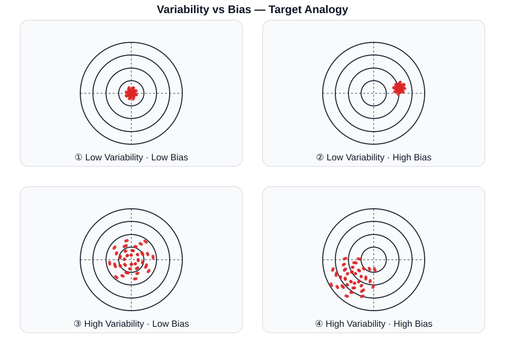

# Sampling Distribution

```{r setup-library}
library(MASS)
library(reshape2)
library(plyr)
library(tidyverse)
library(lubridate)
library(readxl)
library(tidyselect)
library(tidystats)
library(glue)
library(here)
library(gt)
library(gtsummary)
library(kableExtra)
library(icons)

# xaringanExtra::use_tile_view()
# xaringanExtra::use_progress_bar(color = "#23373B", location = "bottom")
# xaringanExtra::use_scribble()
# xaringanExtra::use_panelset()
# xaringanExtra::style_panelset_tabs(foreground = "honeydew", background = "seagreen")

```

## Introduction

### `r icons::fontawesome("lightbulb", style = "solid")` Review

::: {.callout-tip appearance="minimal"}
### **Recall the following terms:**

<ul>

<li>Population: The entire set of individuals or units about which information is desired in a study</li>

<li>Parameter: An unknown constant that defines the characteristics or distribution of a population</li>

<li>(Random) Sample: A collection of observations or measurements obtained from a subset of a population for statistical analysis</li>

<li>Statistics: A number summarizing a (random) sample taken from the population</li>

</ul>
:::

### `r icons::fontawesome("question", style = "solid")` Distribution of Statistics?

-   **Statistics** $\rightarrow$ **Random Variable** $\rightarrow$ **Probability Distribution**

> Sampling Distribution: The probability distribution of a given statistic based on a random sample.

::: notes

Let’s begin by recalling some key foundational concepts in statistics.  
When we say *population*, we mean the entire group we are interested in—say, all adults in Korea, or all blood samples in a study.  
A *parameter* is a fixed but unknown number that describes that population—for example, the true mean blood pressure.  

Since we usually cannot measure the entire population, we take a *sample*—a smaller subset.  
And from that sample, we compute *statistics*—like the sample mean, variance, or proportion.  
Because the sample itself is random, these statistics will vary from one sample to another.  

That variation leads us to the idea of a **sampling distribution**—the probability distribution of a statistic when we repeatedly take random samples of the same size from the same population.  
Understanding the sampling distribution is crucial because it forms the foundation for statistical inference—how we generalize from a sample to a population.


-   In practice, we usually do not have access to the entire population.
-   Instead, we collect a random sample from the population and compute statistics from the sample.
-   However, since the sample is random, the statistics computed from the sample are also random.
-   Therefore, if we repeatedly take random samples from the same population and compute statistics from each sample, we will obtain different values of the statistics each time.
-   This leads us to the concept of the **sampling distribution** of a statistic, which describes the distribution of the statistic over all possible random samples of a given size from the population.

:::

## Statistics and Sampling Distribution

### `r icons::fontawesome("bullseye", style = "solid")` Definition

> Let $X_1,\ldots,X_n$ be a **random sample** of size $n$ from a population with probability distribution $f(x|\theta)$.
>
> where $\theta$ is the unknown parameter of the population distribution
>
> $\rightarrow$ $X_i$'s are independent and identically distributed (i.i.d.)
>
> $\rightarrow$ *Simple Random Sample size of* $n$ $\rightarrow$ $\text{SRS}(n)$

1.  **Statistic**: $T$ is any value that can be computed from the random sample $X_1,\ldots,X_n$ $\rightarrow$ $T=T(X_1,\ldots, X_n)$ (A function of $X_1,\ldots, X_n$)

2.  A Statistic $T(X)$ is a **random variable** since it is a function of random variables $X_1,\ldots,X_n$

3.  Therefore, $T$ has a **probability distribution** called the **sampling distribution** of the statistic $T$

::: notes
Now, let’s formalize what we just discussed.  

Imagine we take a random sample $X_1, X_2, \ldots, X_n$ from a population with distribution $f(x|\theta)$, where $\theta$ is an unknown parameter.  
Each $X_i$ is a random variable, so any statistic $T = T(X_1, \ldots, X_n)$ —such as the sample mean or variance—is itself a random variable.  

Therefore, $T$ has its own probability distribution, which we call the **sampling distribution** of the statistic $T$.  

This concept is fundamental because it helps us quantify the uncertainty of our estimators.  

If you can describe or approximate the sampling distribution of a statistic, you can make probability statements about how close your sample statistic is to the true population parameter.

:::


## Statistics and Sample Distribution

### Examples

-   Sample Mean: $\bar{X} = \frac{1}{n}\sum_{i=1}^n X_i$ $\rightarrow \mu$

-   Sample Variance: $S^2 = \frac{1}{n-1}\sum_{i=1}^n (X_i - \bar{X})^2 \rightarrow \sigma^2$

-   Sample Proportion: $\hat{p} = \frac{1}{n}\sum_{i=1}^n I(X_i = \text{success}) \rightarrow p$

-   Sample Correlation Coefficient:

$$r_{XY} = \frac{\sum_{i=1}^n (X_i - \bar{X})(Y_i - \bar{Y})}{\sqrt{\sum_{i=1}^n (X_i - \bar{X})^2}\sqrt{\sum_{i=1}^n (Y_i - \bar{Y})^2}} \rightarrow \rho_{XY}$$

-   Mean Difference: $\bar{X}_1 - \bar{X}_2$ $\rightarrow \mu_1 - \mu_2$

-   Proportion Difference: $\hat{p}_1 - \hat{p}_2$ $\rightarrow p_1 - p_2$


::: notes
Let’s look at some examples of common statistics and the parameters they estimate.

- The **sample mean**, $\bar{X}$, estimates the population mean $\mu$.  
- The **sample variance**, $S^2$, estimates the population variance $\sigma^2$.  
- The **sample proportion**, $\hat{p}$, estimates the true population proportion $p$.  
- The **sample correlation coefficient**, $r_{XY}$, estimates the population correlation $\rho_{XY}$.  

Each of these statistics has a sampling distribution—some are approximately normal, others not.  
The key takeaway: these statistics fluctuate from one sample to another, and understanding their distributions lets us assess reliability and variability in estimation.

:::


## Sampling Distribution of the Sample Mean

### `r icons::fontawesome("chart-bar", style = "solid")` Sampling Distribution of $\bar{X}$

Proposition

:   Let $X_1, X_2, \ldots, X_n$ be a random sample of size $n$ from a population with mean $\mu$ and variance $\sigma^2$. Then the mean and standard deviation of $\bar{X}$ are given by the formulas $\mu_{\bar{X}} = \mu$ and $\sigma_{\bar{X}} = \sigma^2/n$

::: {.callout-note appearance="minimal"}
### *Proof*

### **Mean of** $\bar{X}$

$$E(\bar{X}) = E\left(\frac{1}{n}\sum_{i=1}^n X_i\right) = \frac{1}{n}\sum_{i=1}^n E(X_i) = \frac{1}{n}\cdot n\mu = \mu$$

### **Variance of** $\bar{X}$

$$Var(\bar{X}) = Var\left(\frac{1}{n}\sum_{i=1}^n X_i\right) = \frac{1}{n^2}\sum_{i=1}^n Var(X_i) = \frac{1}{n^2}\cdot n\sigma^2 = \frac{\sigma^2}{n}$$
:::


::: notes
Here’s an essential result: the sampling distribution of the sample mean $\bar{X}$.

If $X_1, X_2, \ldots, X_n$ are i.i.d. with mean $\mu$ and variance $\sigma^2$ ,
then the expected value of $\bar{X}$ is $\mu$, and its variance is $\sigma^2/n$.

This means that the sample mean is **an unbiased estimator** of the population mean—it’s centered around the true mean on average.  
And as the sample size $n$ increases, the variability of the sample mean decreases.  

So, larger samples yield more precise estimates of the population mean, which aligns with our intuition—more data, less uncertainty.

:::

## Sampling Distribution of the Sample Mean

### Example

::: {.callout-tip appearance="minimal"}
Suppose we have a population with only 4 persons. The heights (in cm) of these persons are 148, 156, 176, and 184.

| $\text{Height}: x$ | 148 | 156 | 176 | 184 |
|--------------------|-----|-----|-----|-----|
| $f(x)=P(X=x)$      | 1/4 | 1/4 | 1/4 | 1/4 |

We want to find the sampling distribution of the sample mean $\bar{X}$ for samples of size $n=2$ drawn from this population **with replacement**.
:::

::: panel-tabset
### Population Mean

$$\begin{align}
\mu &= E(X) = \sum x \cdot f(x) \\
    &= 148\cdot \frac{1}{4} + 156\cdot \frac{1}{4} + 176\cdot \frac{1}{4} + 184\cdot \frac{1}{4} = 166
\end{align}$$

### Population Variance

$$\begin{align}
\sigma^2 &= Var(X) = E[X^2] - (E[X])^2 \\
         &= 148^2\cdot \frac{1}{4} + 156^2\cdot \frac{1}{4} + 176^2\cdot \frac{1}{4} + 184^2\cdot \frac{1}{4} - 166^2 = 212
\end{align}$$
:::

::: notes
Let’s make this concrete with an example.  
Imagine a small population of four individuals with heights 148, 156, 176, and 184 cm.  
Each value is equally likely, so each has probability 1/4.

If we take all possible samples of size 2 with replacement, and compute their means,  
we can list all combinations and derive the **sampling distribution of the sample mean** $\bar{X}$.

What do we observe?  
- The population mean is 166 cm.  
- The population variance is 212.  
- The mean of all possible sample means is also 166, so $E(\bar{X}) = \mu$.  
- The variance of those sample means is 106, exactly half of 212, confirming $Var(\bar{X}) = \sigma^2 / n$.

This small simulation illustrates the theory in action:  
as sample size increases, the sample mean gets more stable, and its variability shrinks.
:::

## Sampling Distribution of the Sample Mean

### Example (cont.)

:::::: panel-tabset
### $\bar{X}$ for $n=2$

::::: columns
::: {.column width="50%"}
| Sample    | $\bar{X}$ | $P(\text{Sample})$ |
|-----------|-----------|--------------------|
| (148,156) | 152       | 1/16               |
| (148,176) | 162       | 1/16               |
| (148,184) | 166       | 1/16               |
| (156,148) | 152       | 1/16               |
| (156,176) | 166       | 1/16               |
| (156,184) | 170       | 1/16               |
| (176,148) | 162       | 1/16               |
| (176,156) | 166       | 1/16               |
:::

::: {.column width="50%"}
| Sample    | $\bar{X}$ | $P(\text{Sample})$ |
|-----------|-----------|--------------------|
| (176,184) | 180       | 1/16               |
| (184,148) | 166       | 1/16               |
| (184,156) | 170       | 1/16               |
| (184,176) | 180       | 1/16               |
| (148,148) | 148       | 1/16               |
| (156,156) | 156       | 1/16               |
| (176,176) | 176       | 1/16               |
| (184,184) | 184       | 1/16               |
:::
:::::

### Dist'n of $\bar{X}$ for $n=2$

| $\bar{X}$    | 148  | 152  | 156  | 162  | 166  | 170  | 176  | 180  | 184  |
|--------------|------|------|------|------|------|------|------|------|------|
| $f(\bar{X})$ | 1/16 | 2/16 | 1/16 | 2/16 | 4/16 | 2/16 | 1/16 | 2/16 | 1/16 |

```{r}
#| fig-align: center
#| fig-width: 10
#| fig-height: 6
# Sampling Distribution of the Sample Mean Example
sample_values <- c(148, 156, 176, 184)
n <- 2
samples <- expand.grid(rep(list(sample_values), n))
samples$SampleMean <- rowMeans(samples)
sampling_dist <- as.data.frame(table(samples$SampleMean))
sampling_dist$Freq <- sampling_dist$Freq / sum(sampling_dist$Freq)
colnames(sampling_dist) <- c("SampleMean", "Probability")
# sampling_dist

# Histogram
library(ggplot2)
ggplot(sampling_dist, aes(x = as.numeric(SampleMean), y = Probability)) +
  geom_bar(stat = "identity", fill = "skyblue", color = "black") +
  labs(title = "Sampling Distribution of the Sample Mean (n=2)",
       x = "Sample Mean",
       y = "Probability") +
  theme_minimal()

```

### $\mu_{\bar{X}}$ & $\sigma^2_{\bar{X}}$

$$\begin{align}
\mu_{\bar{X}} &= \sum \bar{x} \cdot f(\bar{x}) = 166 = \mu \\
\sigma^2_{\bar{X}} &= \sum \bar{x}^2 \cdot f(\bar{x}) - (\mu_{\bar{X}})^2 = 106 = \frac{212}{2} = \frac{\sigma^2}{n}
\end{align}$$
::::::


## Sampling Distribution of the Sample Mean

### Properties

::: {.callout-tip appearance="minimal"}
1.  Mean: $E(\bar{X}) = \mu$ (Unbiased Estimator)

2.  Variance: $Var(\bar{X}) = \frac{\sigma^2}{n}$

3.  $\sqrt{Var(\bar{X})} = \sigma/n \rightarrow$ Standard Error (SE) of $\bar{X}$

    -   Measures the variability of the sample mean $\bar{X}$
    -   Decreases with increasing sample size $n$

4.  Shape: If the population distribution is normal, then the sampling distribution of $\bar{X}$ is also normal for any sample size $n$.

> Let $X_1, \ldots, X_n$ be a random sample from $N(\mu, \sigma^2)$, then the sample mean $\bar{X} \sim N\left(\mu, \sigma^{2}/n\right)$

5.  If the population distribution is not normal, the sampling distribution of $\bar{X}$ approaches normality as $n$ increases $\rightarrow$ **Central Limit Theorem**
:::


::: notes
Now let’s summarize some key properties of the sample mean’s sampling distribution.

1. **Mean**: $E(\bar{X}) = \mu$.  
   This tells us $\bar{X}$ is an unbiased estimator.  
2. **Variance**: $Var(\bar{X}) = \sigma^2 / n$.  
   As $ n $ grows, variability decreases proportionally to $1/n$.  
3. **Standard Error**: $\sigma / \sqrt{n}$ is the standard deviation of $\bar{X}$.  
   It measures how much the sample mean fluctuates from sample to sample.  

If the population is normal, the sampling distribution of $\bar{X}$ is exactly normal for any $n$.  
If not, as $n$ grows, the sampling distribution becomes *approximately* normal, thanks to the **Central Limit Theorem**.  

This bridge between non-normal data and normal inference is one of the most powerful ideas in statistics.

:::

## Central Limit Theorem

### `r icons::fontawesome("bullseye", style = "solid")` Theorem

> Let $X_1, \ldots, X_n$ be a random sample from any population with mean $\mu$ and variance $\sigma^2$. Then the sampling distribution of
>
> $$Z = \frac{\bar{X} - \mu}{\sigma/\sqrt{n}}$$
>
> approaches the standard normal distribution $N(0,1)$ as the sample size $n \rightarrow \infty$

::: {.callout-note appearance="minimal"}
### Remarks of CLT

-   Fundamental theorem in statistics that allows us to make inferences about population parameters using sample statistics, even when the population distribution is unknown or non-normal.

-   Justifying the use of normal distribution-based methods (e.g., confidence intervals, hypothesis tests) for large samples, regardless of the population distribution.
:::

::: notes
Now we arrive at one of the most important theorems in all of statistics — the **Central Limit Theorem (CLT)**.

It states that for *any* population with finite mean $\mu$ and variance $\sigma^2$, the standardized sample mean  

$$Z = \frac{\bar{X} - \mu}{\sigma / \sqrt{n}}$$
approaches the standard normal distribution $N(0,1)$ as the sample size $n$ increases.

What does this mean practically?  
Even if your population is skewed, discrete, or non-normal, the distribution of the sample mean becomes nearly normal when the sample is large enough.  
This theorem is what allows us to construct confidence intervals and perform hypothesis testing using normal-based methods,  
even when we don’t know the exact population distribution.  

It’s one of the reasons why the normal distribution appears *everywhere* in applied statistics.

:::

## Central Limit Theorem

### Binomial Distribution

::: {.callout-note appearance="minimal"}
-   Let $X$ be a binomial random variable with parameters $n$ and $\theta$, i.e., $X \sim \text{Binomial}(n, \theta)$

-   The mean and variance of $X$ are given by $\mu = n\theta$ and $\sigma^2 = n\theta(1-\theta)$, respectively.

-   As the sample size $n$ increases, the distribution of $\bar{X}$ approaches a normal distribution with mean $\mu$ and variance $\sigma^2$, i.e.,

$$\bar{X}_N \stackrel{d}{\rightarrow} \mathcal{N}(\mu, \frac{\sigma^2_X}{N}) = \mathcal{N}(n\theta, \frac{n\theta(1-\theta)}{N})$$
:::

::: {layout="[-1,1,-1]" layout-align="center"}

:::

::: {.callout-tip appearance="minimal"}
$X \sim \text{Binomial}(n=1, \theta=0.25)$ , repeated 300 times with sample size $N={1,\ldots, 50}$
:::

## Central Limit Theorem

### Poisson Distribution

::: {.callout-note appearance="minimal"}
-   Let $X$ be a Poisson random variable with parameter $\lambda$, i.e., $X \sim \text{Poisson}(\lambda)$

-   The mean and variance of $X$ are both equal to $\lambda$.

-   As the sample size $n$ increases, the distribution of $\bar{X}$ approaches a normal distribution with mean $\mu$ and variance $\sigma^2$, i.e.,

$$\bar{X}_N \stackrel{d}{\rightarrow} \mathcal{N}(\mu, \frac{\sigma^2_X}{N}) = \mathcal{N}(\lambda, \frac{\lambda}{N})$$
:::

::: {layout="[-1,1,-1]" layout-align="center"}

:::

::: {.callout-tip appearance="minimal"}
$X \sim \text{Poisson}(\lambda=3)$ , repeated 300 times with sample size $N={1,\ldots, 50}$
:::

## Central Limit Theorem

### Uniform Distribution

::: {.callout-note appearance="minimal"}
-   Let $X$ be a uniform random variable on the interval $[a,b]$, i.e., $X \sim \text{Uniform}(a,b)$

-   The mean and variance of $X$ are given by $\mu = \frac{a+b}{2}$ and $\sigma^2 = \frac{(b-a)^2}{12}$, respectively.

-   As the sample size $n$ increases, the distribution of $\bar{X}$ approaches a normal distribution with mean $\mu$ and variance $\sigma^2$, i.e.,

$$\bar{X}_N \stackrel{d}{\rightarrow} \mathcal{N}(\mu, \frac{\sigma^2_X}{N}) = \mathcal{N}(\frac{a+b}{2}, \frac{(b-a)^2}{12N})$$
:::

::: {layout="[-1,1,-1]" layout-align="center"}

:::

::: {.callout-tip appearance="minimal"}
$X \sim \text{Uniform}(a=0, b=1)$ , repeated 300 times with sample size $N={1,\ldots, 50}$
:::

## Central Limit Theorem

### $\chi^2$ Distribution

::: {.callout-note appearance="minimal"}
-   Let $X$ be a chi-square random variable with $\nu$ degrees of freedom, i.e., $X \sim \chi^2(k)$

-   The mean and variance of $X$ are given by $\mu = \nu$ and $\sigma^2 = 2\nu$, respectively.

-   As the sample size $n$ increases, the distribution of $\bar{X}$ approaches a normal distribution with mean $\mu$ and variance $\sigma^2$, i.e.,

$$\bar{X}_N \stackrel{d}{\rightarrow} \mathcal{N}(\mu, \frac{\sigma^2_X}{N}) = \mathcal{N}(\nu, \frac{2\nu}{N})$$
:::

::: {layout="[-1,1,-1]" layout-align="center"}

:::

::: {.callout-tip appearance="minimal"}
$X \sim \chi^2(\nu=3)$ , repeated 300 times with sample size $N={1,\ldots, 50}$
:::

# Estimation

## Introduction

### Statistical Inference

1.  Data from a any polulation governed by a **Probability Distribution**

2.  Any probability distribution determined by a small number of **Parameters**

3.  From the given data, procedures to identify or estimate the parameters $\rightarrow$ **Estmation**

::: {.callout-tip apperance="minimal"}
### Two Types of Estimation

1.  **Point Estimation**

    -   Direct toward conclusions about one or one more parameters
    -   $\theta$: the parameter of interest
    -   Objective: estimate $\theta$

2.  **Interval Estimation**

    -   Find a random interval containing the parameter $\theta$ with probability $(1-\alpha)$ using the estimated errors

    -   Objective: estimate an interval that contains $\theta$ with a certain level of confidence (e.g., 95% confidence interval)
:::

::: notes
Now we move into one of the most important areas of inferential statistics — **estimation**.  
The goal of estimation is to use data from a sample to learn about unknown population parameters.  

First, remember that any population we study is governed by a probability distribution — for example, a normal, binomial, or exponential distribution.  
Each of these distributions is determined by a few parameters, such as the mean $\mu$ or variance $\sigma^2$.  

Our job in estimation is to infer or estimate those parameters based on observed data.  
There are two main types of estimation: **point estimation** and **interval estimation**.  

A **point estimate** gives a single best guess of the parameter,  
while an **interval estimate** gives a range of plausible values for the parameter, typically with a confidence level like 95%.  

In practice, we often begin with point estimation and later move to confidence intervals, which quantify our uncertainty about the estimate.
:::


## Point Estimation

### `r icons::fontawesome("bullseye", style = "solid")` General Concepts

::: {.callout-tip appearance="minimal"}
-   A point estimate of a population parameter is a single value that serves as an estimate of that parameter based on sample data.

-   Unknown parameters are denoted as $\theta$ (e.g., population mean $\mu$, population variance $\sigma^2$, population proportion $p$)

-   A point estimate is obtained by applying a statistical function (**estimator**) to the sample data.

    | Parameter ($\theta$) | Estimator | Estimates |
    |-------------------|-------------------------------------|----------------|
    | Mean ($\mu$) | $$\bar{X}=\frac{1}{n}\sum_{i=1}^{N} X_i$$ | $$\frac{1}{100}\sum_{i=1}^{100} x_i = 36$$ |
    | Variance ($\sigma^2$) | $$S^2=\frac{1}{n-1}\sum_{i=1}^{N}(X_i-\bar{X})^2$$ | $$\frac{1}{100-1}\sum_{i=1}^{100}(x_i-36)^2 = 64$$ |
    | Proportion ($p$) | $$\hat{p}=\frac{X}{n}$$ | $$\hat{p}=\frac{200}{2000} = 0.1$$ |

:::

**Different Samples** $\rightarrow$ **Different Estimates** with **Same Estimator**


::: notes
A **point estimate** provides a single numerical value as an estimate of a population parameter.  

For example:
- If we want to estimate a population mean $\mu$, we use the sample mean $\bar{X}$.
- For a population variance $\sigma^2$, we use the sample variance $S^2$.
- For a population proportion $p$, we use the sample proportion $\hat{p} = X/n$.  

Each of these statistics is computed using a **function of sample data**, which we call an **estimator**.  
The value it produces from a specific dataset is the **estimate**.  

It’s important to recognize that if we draw different samples, the estimator will yield different estimates — because the estimator depends on random sample data.  
This variability in estimates is what drives the need to assess how “good” an estimator is.

:::

## Point Estimation 

### `r icons::fontawesome("bullseye", style = "solid")` How to Assess the Quality of Point Estimators?

::: {.callout-tip appearance="minimal"}

#### Sampling Error 

Difference between the point estimator $\hat{\theta}$ and the true parameter value $\theta$

$$
\text{sampling error} = \hat{\theta} - \theta
$$

Our best hope is that the sampling error is small enough to make $\hat{\theta}$ a good approximation of $\theta$.


To assess the quality of point estimators, we need the **distribution of these arrors over all samples**


:::


::: {.callout-tip appearance="minimal"}
#### Measure of Quality

- Mean Squared Error (MSE): $\text{MSE} = E\left [(\theta -\hat{\theta})^2 \right]$
   - Small MSE $\rightarrow$ Good Estimator

- MSE can be decomposed into **Bias** and **Variance (variabilty)** components:

$$\text{MSE} = \text{Bias}^2(\hat{\theta}) + Var(\hat{\theta})$$
where $\text{Bias}(\hat{\theta}) = E(\hat{\theta}) - \theta$, $Var(\hat{\theta}) = E[(\hat{\theta} - E(\hat{\theta}))^2]$

Standard error: $\sigma_{\hat\theta} = \sqrt{Var(\hat\theta)}$

:::


::: notes
Once we have a point estimator, the next question is:  “How reliable is it?”  

Every estimate we compute has a **sampling error**,  
which is simply the difference between the estimator $\hat{\theta}$ and the true parameter $\theta$:  

$$\text{Sampling error} = \hat{\theta} - \theta$$

Since this error depends on the random sample, we need to study its distribution across all possible samples.  
This leads us to measures of quality for estimators.  

One key measure is the **Mean Squared Error (MSE)**:

$$\text{MSE} = E[(\hat{\theta} - \theta)^2]$$

A smaller MSE indicates a better estimator.  

We can decompose MSE into two parts: **bias** and **variance**.

$$\text{MSE} = [E(\hat{\theta}) - \theta]^2 + Var(\hat{\theta})$$

This decomposition tells us that a good estimator should have both small bias and small variance.  

We also define the **standard error**, which is just the square root of the variance of the estimator —  
it measures the typical fluctuation of the estimator around its expected value.

:::


## Point Estimation

### `r icons::fontawesome("bullseye", style = "solid")` Bias and Variance (Variability)

::: {.callout-tip appearance="minimal"}

#### Good Estimator 

An estimator is considered good if it has both low bias and low variance.

- **Unbiasedness**: $E(\hat{\theta}) = \theta$

- **Low Variance**: $Var(\hat{\theta}) \rightarrow 0$ 


**Unfortunately, there is often a trade-off between bias and variance**
:::

{height="550" fig-align="center"}


::: notes
A “good” estimator has two desirable properties: **low bias** and **low variance**.  

An estimator is **unbiased** if its expected value equals the true parameter:

$$E(\hat{\theta}) = \theta $$

This means that, on average, it hits the target.  

At the same time, we want **low variance** —  
the estimator should give similar results even if we repeat the sampling process.  

However, there’s often a **trade-off** between bias and variance.  
Reducing bias may increase variance, and vice versa.  
This trade-off is a central theme not only in classical statistics but also in modern machine learning.  

To visualize this, we can think of the familiar **target analogy**:  
- Low bias, low variance → estimates are tightly clustered around the true value.  
- High bias, low variance → tightly clustered but far from the truth.  
- Low bias, high variance → scattered around the true value.  
- High bias, high variance → scattered and systematically off target.  

This diagram helps students intuitively understand why both components matter in building accurate estimators.

:::


## Point Estimation 

### `r icons::fontawesome("bullseye", style = "solid")` How to obtain the Point Estimator?

::: {.callout-important}
#### Maximum Likelihood Estimation (MLE)

A method of estimating the parameters of a statistical model by maximizing the likelihood function, which measures how likely it is to observe the given sample data for different parameter values.

<!-- The MLE is the parameter value that maximizes the likelihood function,  -->

<!-- $$\hat{\theta}_{MLE} = \arg\max_{\theta} \mathcal{L}(\theta|x)$$ -->

<!-- where $L(\theta|x)$ is the likelihood function given the observed data $x$ -->


:::

:::{.callout-note}

- First introduced by Ronald A. Fisher in the 1920s. 

- Widely used methods for parameter estimation in statistics due to its desirable properties, such as consistency, efficiency, and asymptotic normality.


:::


::: notes

Now that we understand what makes an estimator good, the next question is:  
“How do we actually find one?”

One of the most powerful and widely used approaches is **Maximum Likelihood Estimation (MLE)**.  

The key idea of MLE is to choose the parameter value that makes the observed data **most likely** under the assumed probability model.  

This is the same as asking the following question: “given an assumed
probability density (or mass) function for the data, what values of the
parameters (out of the range of possible values) make the observed
data least surprising?”

Mathematically, we define a **likelihood function**,  
which expresses how probable our observed data are for each possible parameter value. Then, we select the parameter value that maximizes this likelihood — that’s our MLE.  

The MLE method was first introduced by Ronald A. Fisher in the 1920s and remains fundamental in both theoretical and applied statistics.  
MLE estimators have excellent properties: they are **consistent**, **asymptotically normal**, and **efficient** under regular conditions.  

In simpler terms, as the sample size increases, the MLE converges to the true parameter value and tends to make the best possible use of the data.


:::

## Point Estimation 

### `r icons::fontawesome("bullseye", style = "solid")` Maximum Likelihood Estimation (MLE)

::: {.callout-tip appearance="minimal"}

#### `r icons::fontawesome("lightbulb", style = "solid")` Intuitive Example 

Suppose we have three bias coins A, B, and C 

- $P(\text{Head}|A) = 0.8$

- $P(\text{Head}|B) = 0.4$

- $P(\text{Head}|C) = 0.3$

We randomly select one coin and toss it 100 times, resulting in the following outcomes:

| Outcome | H  | T  |
|---------|----|----|
| Count   | 70 | 30 |

Which coin is most likely to have produced this outcome?


:::

::: notes
Most people would guess A and the idea is that we are less likely to see that many heads using B or C. This is essentially the intuition behind the MLE approach – our guess of the parameter should be that for which the observed data is least
surprising.

In our simple illustration, this is in fact a binomial experiment, thus, a
Bin(n, p) distribution where n is known to be 100 but we are unsure what p is and the only possible options for p are 0.8, 0.4 and 0.3. The MLE approach would choose p = 0.8.

Essentially, we are looking at the binomial pmf in terms of a fixed x but variable p, whereas, previously we would look at a fixed p and variable x. 

:::


## Point Estimation 

### `r icons::fontawesome("bullseye", style = "solid")` Maximum Likelihood Estimation (MLE)

::: {.callout-tip appearance="minimal"}

#### Example 1

A sample of ten independent bike helmets just made in the factory A was up for testing. 3 helmets are flawed. 

| Helmet | 1 | 2 | 3 | 4 | 5 | 6 | 7 | 8 | 9 | 10 |
|--------|---|---|---|---|---|---|---|---|---|----|
| Status | F | N | F | N | N | N | F | N | N | N  |


$$p = P(\text{Flawed Helmet}) = \binom{10}{3}p^3(1-p)^7$$

The likelihood function is given by

$$\mathcal{L}(p|x_1,\ldots,x_{10}) = \binom{10}{3}p^3(1-p)^7$$

$\rightarrow$ **The function of the parameter $p$ **

:::


::: notes
Let’s apply MLE to a more formal example.  

Suppose a factory produces bike helmets.  
We test ten helmets, and three are found to be defective.  
If each helmet has an independent probability $p$ of being flawed,  
the number of flawed helmets $X$ follows a **Binomial(10, p)** distribution.

The likelihood function is

$$\mathcal{L}(p) = \binom{10}{3} p^3 (1-p)^7$$

which describes how likely our observed data are for different values of $p$.

By plotting this function, we can visually see that the likelihood is maximized around $p = 0.3$.  

That value, $\hat{p}_{MLE} = 0.3$, is our best estimate for the probability that a helmet is flawed.  

Notice how this process relies directly on probability theory —  
we’re not just taking an average, but explicitly finding the parameter that best explains our data.

:::


## Point Estimation 

### `r icons::fontawesome("bullseye", style = "solid")` Maximum Likelihood Estimation (MLE)

::: {.callout-tip appearance="minimal"}

#### Example 1 (cont.)

::: panel-tabset
### `r fontawesome::fa("r-project")` Code  

```{r, echo=TRUE}
p_values <- seq(0, 1, by = 0.01)
likelihood_values <- function(p_value) {
  choose(10, 3) * (p_value^3) * ((1 - p_value)^7)
}

likelihood_df <- data.frame(p = p_values, Likelihood = likelihood_values(p_values))

# Plotting the Likelihood Function
library(ggplot2)

gp1 <- 
  ggplot(likelihood_df, aes(x = p, y = Likelihood)) +
  geom_line(color = "blue") +
  labs(title = "Likelihood Function",
       x = "Probability of Flawed Helmet (p)",
       y = "Likelihood") + 
  theme_minimal()

```

### `r fontawesome::fa("r-project")` Likelihood Function: Plot

```{r}
#| fig-align: center
#| fig-width: 10
#| fig-height: 6

gp1
```


### `r fontawesome::fa("r-project")` MLE of $p$

```{r, echo=TRUE}
# Finding the MLE
mle_p <- likelihood_df$p[which.max(likelihood_df$Likelihood)]
mle_p


```

### `r fontawesome::fa("r-project")` MLE of $p$: Plot

```{r}
#| fig-align: center
#| fig-width: 10
#| fig-height: 6

# Plotting the Likelihood Function with MLE
gp1 + 
  geom_vline(xintercept = mle_p, color = "red", linetype = "dashed") +
  annotate("text", x = mle_p + 0.05, y = max(likelihood_df$Likelihood) * 0.9,
           label = paste("MLE of p =", round(mle_p, 2)), color = "red")


```


### `r fontawesome::fa("r-project")` Log-Likelihood Function

```{r}
#| fig-align: center
#| fig-width: 10
#| fig-height: 6

# Log-Likelihood Function
log_likelihood_values <- function(p_value) {
  log(choose(10, 3)) + 3 * log(p_value) + 7 * log(1 - p_value)
}

log_likelihood_df <- data.frame(p = p_values, LogLikelihood = log_likelihood_values(p_values))

# Plotting the Log-Likelihood Function
gp2 <- 
  ggplot(log_likelihood_df, aes(x = p, y = LogLikelihood)) +
  geom_point(size = 2, color = "blue") +
  labs(title = "Log-Likelihood Function",
       x = "Probability of Flawed Helmet (p)",
       y = "Log-Likelihood") + 
  geom_vline(xintercept = mle_p, color = "red", linetype = "dashed") +
  annotate("text", x = mle_p + 0.05, y = max(log_likelihood_df$LogLikelihood) * 2,
           label = paste("MLE of p =", round(mle_p, 2)), color = "red") +
  theme_minimal()

gp2

```


:::

:::


::: notes

When we graph the likelihood function, it peaks at the MLE value —  
that’s where the observed sample is most probable.

We often take the **logarithm** of the likelihood to simplify calculations,  
especially when dealing with products of probabilities.  
The log-likelihood turns those products into sums,  
making derivatives and optimization much easier.

In this helmet example, the log-likelihood is

$$\ell(p) = \log \mathcal{L}(p) = \log \binom{10}{3} + 3\log(p) + 7\log(1-p)$$

The maximum of the log-likelihood occurs at the same place as the original likelihood —  
taking logs doesn’t change the maximizer, only the scale.  

This example shows students the full MLE workflow: define the model, construct the likelihood, plot it, and identify the maximum.

:::


## Point Estimation 

### `r icons::fontawesome("bullseye", style = "solid")` Maximum Likelihood Estimation (MLE)

::: {.callout-tip appearance="minimal"}

#### `r icons::fontawesome("bullseye", style = "solid")` Definition

Let $X_1,\ldots,X_n$ be i.i.d random sample with pdf (or pmf) $f(x|\theta)$, where $\theta$ is the unknown parameter of the population distribution. 

The **likelihood function** is defined as

$$\mathcal{L}(\theta|x_1,\ldots,x_n) = \prod_{i=1}^{n} f(x_i|\theta)$$

The MLE of $\theta$ is the value that maximizes the likelihood function:

$$\hat{\theta}_{MLE} = \arg\max_{\theta} \mathcal{L}(\theta|x_1,\ldots,x_n)$$

Products are often converted to sums by taking the logarithm of the likelihood function, called the **log-likelihood function**:

$$\ell(\theta|x_1,\ldots,x_n) = \log \mathcal{L}(\theta|x_1,\ldots,x_n) = \sum_{i=1}^{n} \log f(x_i|\theta)$$

:::


::: notes

Formally, let $X_1, X_2, \ldots, X_n$ be independent and identically distributed random variables  
with probability density (or mass) function $f(x|\theta)$,  
where $\theta$ is the unknown parameter we want to estimate.  

The **likelihood function** is defined as:

$$\mathcal{L}(\theta) = \prod_{i=1}^{n} f(x_i | \theta)$$

The **Maximum Likelihood Estimator** is the parameter value $\hat{\theta}_{MLE}$ that maximizes this function:

$$\hat{\theta}_{MLE} = \arg\max_{\theta} \mathcal{L}(\theta)$$

In practice, we almost always work with the **log-likelihood**:

$$\ell(\theta) = \log \mathcal{L}(\theta) = \sum_{i=1}^{n} \log f(x_i|\theta)$$

We then differentiate $\ell(\theta)$ with respect to $\theta$, set the derivative to zero, and solve for $\hat{\theta}$.  
This approach is elegant, general, and forms the backbone of many modern estimation techniques.

:::

## Point Estimation

### `r icons::fontawesome("bullseye", style = "solid")` Maximum Likelihood Estimation (MLE)

::: {.callout-tip appearance="minimal"}
#### Example 2

Let $X_1, X_2, \ldots, X_n$ be a random sample from a normal distribution $N(\mu, \sigma^2)$, where both $\mu$ and $\sigma^2$ are unknown. Find the MLEs of $\mu$. 

**Solution:**

The likelihood function is given by

$$\mathcal{L}(\mu, \sigma^2|x_1,\ldots,x_n) = \prod_{i=1}^{n} \frac{1}{\sqrt{2\pi\sigma^2}} \exp\left(-\frac{(x_i - \mu)^2}{2\sigma^2}\right)
$$

The log-likelihood function is given by

$$\ell(\mu, \sigma^2|x_1,\ldots,x_n) = -\frac{n}{2}\log(2\pi\sigma^2) - \frac{1}{2\sigma^2}\sum_{i=1}^{n}(x_i - \mu)^2$$

Taking the partial derivative with respect to $\mu$ and setting it to zero:

$$\frac{\partial \ell}{\partial \mu} = \frac{1}{\sigma^2}\sum_{i=1}^{n}(x_i - \mu) = 0$$


$$\therefore \hat{\mu}_{MLE} = \bar{X} = \frac{1}{n}\sum_{i=1}^{n} X_i$$


:::


::: notes
Finally, let’s look at a classic MLE derivation for the **normal distribution**.  

Suppose we have $X_1, X_2, \ldots, X_n \sim N(\mu, \sigma^2)$,  
and both $\mu$ and $\sigma^2$ are unknown.  

The likelihood function is:

$$\mathcal{L}(\mu, \sigma^2) = \prod_{i=1}^{n} \frac{1}{\sqrt{2\pi\sigma^2}}
\exp\left[-\frac{(x_i - \mu)^2}{2\sigma^2}\right]$$

Taking the log gives the log-likelihood:

$$\ell(\mu, \sigma^2) = -\frac{n}{2}\log(2\pi\sigma^2)
- \frac{1}{2\sigma^2}\sum_{i=1}^{n}(x_i - \mu)^2$$

Differentiating with respect to $\mu$ and setting to zero gives:

$$\hat{\mu}_{MLE} = \bar{X}$$

So the sample mean is again the MLE of the population mean under normality.  
This connection reinforces what we saw earlier —  
the sample mean isn’t just intuitive, it’s *optimal* under a probabilistic framework.

:::

<!-- Even though we could obtain $\hat{\theta}$ as an estimate of $\theta$ using the same estimator, it doesn't always give us the true value of $\theta$. -->

<!-- It is natural to write our estimate $\hat{\theta}$ with **error of estimation** -->

<!-- $$\hat{\theta} = \theta + \text{error}$$ -->

<!-- To assess the quality of point estimators, we need the **distribution of these arrors over all samples** -->

<!-- In all samples, we could obtain $\hat{\theta}$ as an estimate of $\theta$ using the same estimator, but why doesn't it always give us the true value of $\theta$? -->


<!-- Sampling error can be devided into **Bias** and **Variability** -->

<!-- #### Bias -->

<!-- The bias of a point estimator $\hat{\theta}$ is defined as the difference between the expected value of the estimator and the true parameter value: -->

<!-- $$\text{Bias}(\hat{\theta}) = E(\hat{\theta}) - \theta$$ -->
<!-- An estimator is said to be **unbiased** if its bias is zero, i.e., $E(\hat{\theta}) = \theta$ -->

<!-- #### Variability -->

<!-- The variability of a point estimator $\hat{\theta}$ is measured by its variance: -->

<!-- $$Var(\hat{\theta}) = E[(\hat{\theta} - E(\hat{\theta}))^2]$$ -->
<!-- A point estimator with lower variance is considered more precise, as it tends to produce estimates that are closer to the expected value. -->


<!-- 1.  **Point Estimator**: A statistic used to estimate a population parameter. Denoted as $\hat{\theta} = T(X_1, X_2, \ldots, X_n)$, where $T$ is a function of the sample data. -->

<!-- 2. **Estimate**: The specific value obtained from the point estimator using the observed sample data. Denoted as $\hat{\theta} = T(x_1, x_2, \ldots, x_n)$, where $x_i$ are the observed values. -->

<!-- 3. **Properties of Point Estimators**: -->

<!--    - **Unbiasedness**: An estimator $\hat{\theta}$ is unbiased if its expected value equals the true parameter value, i.e., $E(\hat{\theta}) = \theta$. -->

<!--    - **Consistency**: An estimator $\hat{\theta}$ is consistent if it converges in probability to the true parameter value as the sample size $n$ approaches infinity. -->

<!--    - **Efficiency**: Among all unbiased estimators, an efficient estimator has the smallest variance. -->

<!--    - **Sufficiency**: An estimator $\hat{\theta}$ is sufficient if it captures all the information about the parameter $\theta$ contained in the sample data. -->

<!-- -   Let $X_1, X_2, \ldots, X_n$ be a random sample of size $n$ from a population with mean $\mu$ and variance $\sigma^2$. -->

<!-- -   The sample mean $\bar{X} = \frac{1}{n}\sum_{i=1}^n X_i$ is a statistic that estimates the population mean $\mu$. -->

<!-- -   The sampling distribution of the sample mean $\bar{X}$ has the following properties: -->

<!-- 1.  **Mean**: $E(\bar{X}) = \mu$ (Unbiased Estimator) -->

<!-- 2.  **Variance**: $Var(\bar{X}) = \frac{\sigma^2}{n}$ (Decreases with increasing sample size $n$) -->

<!-- 3.  **Shape**: If the population distribution is normal, then the sampling distribution of $\bar{X}$ is also normal for any sample size $n$. If the population distribution is not normal, the sampling distribution of $\bar{X}$ approaches normality as $n$ increases (**Central Limit Theorem**) -->

<!-- ## Central Limit Theorem (CLT) -->

<!-- ### `r icons::fontawesome("lightbulb", style = "solid")` Central Limit Theorem -->

<!-- > Let $X_1, X_2, \ldots, X_n$ be a random sample of size $n$ from any population with mean $\mu$ and variance $\sigma^2$. -->

<!-- > -->

<!-- > As the sample size $n$ becomes large, the sampling distribution of the sample mean $\bar{X}$ approaches a normal distribution with mean $\mu$ and variance $\frac{\sigma^2}{n}$, regardless of the shape of the population distribution. -->

<!-- -   The CLT is a fundamental theorem in statistics that allows us to make inferences about population parameters using sample statistics, even when the population distribution is unknown or non-normal. -->
